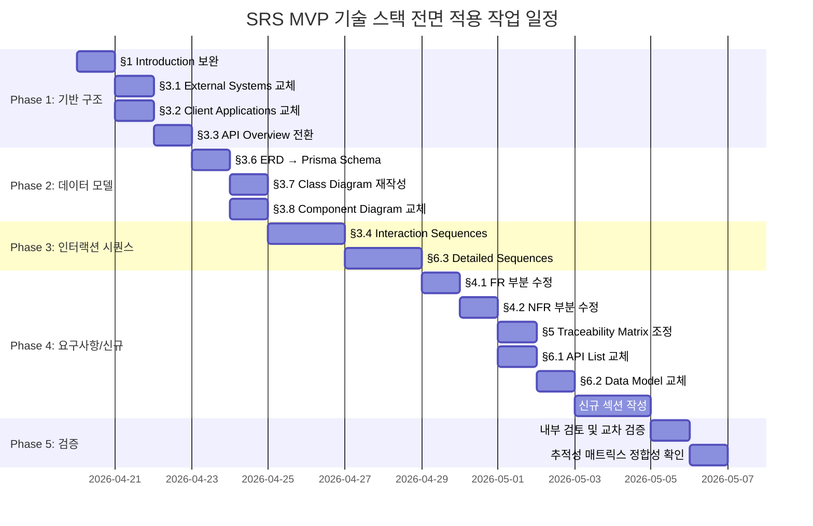

# SRS v01 (ENG_OPUS) — MVP Tech Stack Full Application Plan

Document ID: PLAN-SRS-001-MVP  
Revision: 1.0  
Date: 2026-04-19  
Base Document: `SRS_v01(ENG_OPUS).md`  
Adaptation Reference: `SRS_V01(ENG_OPUS)_MVP.md`  
Standard: ISO/IEC/IEEE 29148:2018

---

## 0. Purpose of This Plan

본 문서는 `SRS_v01(ENG_OPUS).md`(원본 SRS)에 `SRS_V01(ENG_OPUS)_MVP.md`(MVP 기술 스택 어댑테이션 검토)의 내용을 **전면 적용**하여 하나의 통합된 MVP SRS 문서를 작성하기 위한 **작업 계획서**이다.

### 0.1 목표
1. 원본 SRS의 아키텍처를 MVP 기술 스택(C-TEC-001~007)에 맞게 전면 개편
2. 기능 요구사항(FR) 및 비기능 요구사항(NFR)의 이행 가능성 보장
3. **핵심 사용자 경험(가치 전달)의 훼손 여부** 검토 및 보전 전략 수립
4. 작업 산출물의 품질 기준 및 검증 방법 정의

### 0.2 참조 문서

| 문서 | 경로 | 역할 |
| :--- | :--- | :--- |
| 원본 SRS | `SRS_v01(ENG_OPUS).md` | 변경 대상 원본 (ISO 29148 준수) |
| MVP 검토서 | `SRS_V01(ENG_OPUS)_MVP.md` | 기술 스택 어댑테이션 및 Gap 분석 결과 |
| PRD v0.3 | `Rooted_opus_v0.3.md` | 비즈니스 요구사항 원천 |

---

## 1. 변경 범위 총괄 (Change Scope Summary)

### 1.1 기술 스택 전환 요약

| 제약 ID | 설명 | 범주 |
| :--- | :--- | :--- |
| **C-TEC-001** | 모든 서비스를 **Next.js (App Router)** 풀스택 프레임워크로 통합. 별도 프론트엔드/백엔드 없음. | Internal |
| **C-TEC-002** | 서버 로직은 **Server Actions** 또는 **Route Handlers** — 별도 백엔드 서버 없음. | Internal |
| **C-TEC-003** | **Prisma + SQLite** (로컬 개발) / **Supabase PostgreSQL** (운영). | Internal |
| **C-TEC-004** | UI/스타일링은 **Tailwind CSS + shadcn/ui**. | Internal |
| **C-TEC-005** | LLM 오케스트레이션은 **Vercel AI SDK** (Python 서버 없음). | External |
| **C-TEC-006** | LLM 호출은 **Google Gemini API** (환경변수 기반 모델 스왑). | External |
| **C-TEC-007** | **Vercel** 플랫폼 배포, CI/CD는 Git Push only. | External |

### 1.2 영향도 매트릭스

| SRS 섹션 | 원본 아키텍처 | MVP 아키텍처 | 영향도 | 작업 유형 |
| :--- | :--- | :--- | :--- | :--- |
| §1. Introduction | - | - | ⚪ 없음 | 유지 (일부 보완) |
| §2. Stakeholders | - | - | ⚪ 없음 | 유지 |
| §3.1 External Systems | AWS Lambda, S3, CloudWatch | Vercel, Supabase, Gemini API | 🔴 Major | **전면 교체** |
| §3.2 Client Applications | iOS Native + Web SPA | PWA + Next.js Dashboard | 🔴 Major | **전면 교체** |
| §3.3 API Overview | 기존 REST API | Next.js Route Handlers | 🔴 Major | **전면 교체** |
| §3.4 Interaction Sequences | Cloud Backend 중심 | Next.js + Supabase 중심 | 🔴 Major | **전면 재작성** |
| §3.5 Use Case Diagram | - | - | ⚪ 없음 | 유지 |
| §3.6 ERD | 기존 ER 다이어그램 | Prisma 스키마 기반 ERD | 🟡 Medium | **교체** |
| §3.7 Class Diagram | OOP 클래스 구조 | Next.js Route/Action 기반 | 🟡 Medium | **교체** |
| §3.8 Component Diagram | AWS 인프라 기반 | Vercel + Supabase 기반 | 🔴 Major | **전면 교체** |
| §4.1 Functional Requirements | 요구사항 본문 | 구현 기술 참조 변경 | 🟡 Medium | **부분 수정** |
| §4.2 Non-Functional Requirements | AWS 기반 임계값 | Vercel/Supabase 기반 조정 | 🟡 Medium | **부분 수정** |
| §5. Traceability Matrix | - | 테스트 케이스 기술 매핑 | 🟢 Minor | **부분 수정** |
| §6.1 API Endpoint List | 기존 REST 목록 | Next.js Route Handlers 목록 | 🔴 Major | **전면 교체** |
| §6.2 Entity & Data Model | SQL DDL 스타일 | Prisma 스키마 + 정의 | 🔴 Major | **전면 교체** |
| §6.3 Detailed Interaction Models | Cloud Backend 중심 | Next.js + Supabase 중심 | 🔴 Major | **전면 재작성** |
| §6.4 Validation Plan | - | - | ⚪ 없음 | 유지 |
| **신규** §Server Actions | 없음 | Server Actions 정의 추가 | 🆕 New | **신규 작성** |
| **신규** §AI Integration | 없음 | Gemini API 통합 규격 | 🆕 New | **신규 작성** |
| **신규** §Project Structure | 없음 | 권장 프로젝트 구조 | 🆕 New | **신규 작성** |
| **신규** §Environment Variables | 없음 | 환경 변수 정의 | 🆕 New | **신규 작성** |
| **신규** §Risk Assessment | 없음 | MVP 기술 스택 리스크 평가 | 🆕 New | **신규 작성** |

---

## 2. 섹션별 상세 적용 계획

### Phase 1: 기반 구조 변경 (Foundation Changes)

#### 2.1 §1. Introduction 보완

| 작업 | 내용 | 우선순위 |
| :--- | :--- | :--- |
| §1.2 Scope 보완 | B2C Guardian App → PWA로 전환 명시, Android/iOS 네이티브를 Out-of-Scope (Wave 2)로 이동 | Must |
| §1.4 References 추가 | Vercel Docs, Supabase Docs, Prisma Docs, Vercel AI SDK Docs를 REF에 추가 | Should |
| §1.5.1 Constraints 추가 | C-TEC-001~007을 CON-06~CON-12로 신규 등록 | Must |
| §1.5.2 Assumptions 추가 | Vercel Pro SLA 99.99%, Supabase Realtime 연결 한도, iOS 16.4+ Web Push 지원 가정 | Must |
| §1.5.3 Dependencies 추가 | DEP-04: Supabase Realtime, DEP-05: Vercel Cron, DEP-06: Vercel AI SDK | Must |

#### 2.2 §3.1 External Systems — 전면 교체

**기존 (삭제 대상):**
- AWS Cloud Infrastructure (Lambda, S3/Glacier, CloudWatch)
- APNs (Apple Push Notification service) — MVP 범위 제외

**신규 (추가 대상):**
- Supabase (PostgreSQL + Storage + Realtime) — Prisma ORM / Supabase Client SDK
- Web Push API — PWA Service Worker 기반 브라우저 푸시
- Google Gemini API — Vercel AI SDK (`@ai-sdk/google`)
- Vercel Platform — Git Push Auto-deploy, Edge Functions, Cron Jobs

**유지:**
- EMR System (Carefor) — HTTP POST Webhook 유지
- FCM (Firebase Cloud Messaging) — 유지
- Amplitude / Mixpanel — 유지

#### 2.3 §3.2 Client Applications — 전면 교체

| Client | 변경 전 | 변경 후 |
| :--- | :--- | :--- |
| B2C Guardian App | iOS Native (MVP), Android Wave 2+ | **PWA (Next.js App Router + shadcn/ui + Tailwind CSS)** |
| B2B Dashboard | Web SPA (미지정 프레임워크) | **Next.js App Router + shadcn/ui + Tailwind CSS** |
| Installer App | Mobile (Internal) | **Out of MVP scope** — PWA 기반 가이드로 대체 가능 |

#### 2.4 §3.3 API Overview → Next.js Route Handlers 전환

기존 6개 API + 5개 신규/변경 = 총 11개 Route Handlers로 재정의:

| # | Route | Method | 변경 사항 |
| :--- | :--- | :--- | :--- |
| 1 | `app/api/events/ingest/route.ts` | POST | Cloud Ingest API → Route Handler |
| 2 | `app/api/webhooks/emr/route.ts` | POST | EMR Webhook API 유지 (경로만 변경) |
| 3 | `app/api/notifications/push/route.ts` | POST | FCM/Web Push 통합 |
| 4 | `app/api/reports/daily/[deviceId]/[date]/route.ts` | GET | Daily Report Query → Route Handler |
| 5 | `app/api/reports/trend/[deviceId]/route.ts` | GET | Trend API → Route Handler |
| 6 | `app/api/events/[eventId]/false-alarm/route.ts` | POST | False Alarm Feedback → Route Handler |
| 7 | `app/api/events/archive/route.ts` | GET | Archive Viewer → Route Handler |
| 8 | `app/api/dashboard/status/route.ts` | GET | Dashboard Status → Route Handler |
| 9 | `app/api/dashboard/filters/route.ts` | PATCH | Filter Config → Route Handler |
| 10 | `app/api/devices/[deviceId]/heartbeat/route.ts` | GET/POST | Heartbeat → Route Handler |
| 11 | `app/api/ai/wellness-summary/route.ts` | POST | 🆕 Gemini AI 웰니스 요약 |

#### 2.5 §3.3+ (신규) Server Actions 정의

6개 Server Actions 추가 정의:
- `createWellnessEvent` — Prisma 이벤트 생성
- `updateFalseAlarmFlag` — 오알람 플래그 토글
- `generateDailyReport` — 일일 리포트 집계 + Gemini AI 요약
- `updateDeviceStatus` — 디바이스 하트비트/상태 업데이트
- `saveDashboardFilter` — 관리자 필터 설정 영속화
- `createUser` — 역할 기반 사용자 생성

---

### Phase 2: 데이터 모델 및 다이어그램 교체

#### 2.6 §3.6 ERD — Prisma 스키마 기반 재작성

**핵심 변경사항:**
- UUID → `cuid()` 문자열 ID (SQLite 호환)
- ENUM → 문자열 필드 + 앱 레벨 검증 (SQLite 호환)
- UUID[] 배열 (`linked_devices`) → `UserDevice` 조인 테이블로 정규화
- JSON 필드 → SQLite에서는 문자열로 저장
- 🆕 `DeadLetterEvent` 모델 추가 (실패한 EMR Webhook 이벤트 저장)
- 🆕 `DailyReport.aiSummary` 필드 추가 (Gemini AI 생성 내러티브)

#### 2.7 §3.7 Class Diagram — Next.js 아키텍처 반영 재작성

**변경 대상 클래스:**
- `CloudBackend` → Next.js Route Handlers로 분해
- `PushNotificationService` → FCM + Web Push 통합 클라이언트
- `ReportPipeline` → Vercel Cron + Server Action 기반
- `HeartbeatMonitor` → Vercel Cron + Supabase Database Webhook 기반

**유지 클래스:**
- `EdgeAIValidator` — Edge 레이어 변경 없음
- `TriageEngine` — 알고리즘 로직 유지 (Server Action 또는 클라이언트사이드)
- `EMRWebhookClient` — HMAC-SHA256 로직 유지 (Route Handler 내 구현)

#### 2.8 §3.8 Component Diagram — 전면 교체

MVP 검토서 §4의 수정된 컴포넌트 다이어그램을 그대로 적용:
- Edge Layer (변경 없음)
- Next.js App on Vercel (Route Handlers + Server Actions + Pages)
- Supabase (PostgreSQL + Storage + Realtime)
- AI/LLM (Vercel AI SDK + Gemini)
- External Services (FCM, Web Push, EMR, Amplitude)

---

### Phase 3: 인터랙션 시퀀스 재작성

#### 2.9 §3.4 Interaction Sequences — 전면 재작성

| 시퀀스 | 원본 | MVP 변경 | 작업 유형 |
| :--- | :--- | :--- | :--- |
| §3.4.1 Daily Wellness Report | Cloud Backend + FCM/APNs | Vercel Cron → Server Action → Prisma → Gemini AI → FCM/Web Push | **전면 재작성** |
| §3.4.2 Zero False Alarm AI Validator | Edge AI Validator → Cloud | Edge AI Validator → Next.js Route Handler (변경 최소) | **부분 수정** (Cloud Backend → Route Handler) |
| §3.4.3 PMF Diagnostic Sequence | Amplitude/Mixpanel 중심 | 변경 없음 (Amplitude SDK 유지) | **유지** |
| §3.4.4 EMR System Sync | Cloud Backend → WebSocket → Dashboard | Route Handler → Supabase Realtime → Dashboard | **전면 재작성** |

#### 2.10 §6.3 Detailed Interaction Models — 전면 재작성

| 시퀀스 | 변경 핵심 |
| :--- | :--- |
| §6.3.1 Fall Detection E2E | Cloud Backend → Route Handler, WebSocket → Supabase Realtime, FCM/APNs → FCM/Web Push |
| §6.3.2 Device Offline Detection | Cloud Backend Heartbeat Monitor → Vercel Cron + Supabase Database Webhook, PagerDuty 연동 유지 |
| §6.3.3 OTA Firmware Update | 변경 없음 (Edge/Firmware 영역) |

---

### Phase 4: 요구사항 조정 및 신규 섹션 추가

#### 2.11 §4.1 Functional Requirements — 부분 수정

**주요 수정 포인트:**
- FR-04 (B2B Dashboard): "WebSocket" → "Supabase Realtime" 참조 변경
- FR-05 (Daily Report): Gemini AI 요약 기능 추가 설명
- FR-07 (SMS/Kakao Fallback): Web Push 대비 SMS/Kakao 위치 재정의
- FR-08 (Configurable Dashboard): shadcn/ui DataTable 기반 구현 참조

**요구사항 ID 유지:** REQ-FUNC-001 ~ REQ-FUNC-023의 ID 체계는 변경 없이 유지하여 추적성 보존.

#### 2.12 §4.2 Non-Functional Requirements — 부분 수정

| NFR ID | 수정 내용 |
| :--- | :--- |
| REQ-NF-001 | 모니터링 도구: Datadog APM → Vercel Analytics + Edge Runtime |
| REQ-NF-004 | 스케일링 기준: AWS → Vercel Pro/Enterprise + Supabase PgBouncer |
| REQ-NF-005 | SLA 근거: Vercel Pro 99.99% + Supabase Pro 99.9% |
| REQ-NF-007 | PagerDuty 연동: Supabase Database Webhook 기반 |
| REQ-NF-012 | 비용 기준: AWS Billing → Vercel + Supabase 비용 |
| REQ-NF-017 | 콜드 아카이벌: S3 Glacier → Supabase Storage (Cron 기반 마이그레이션) |
| REQ-NF-018 | 확장성: MVP 기준 <500개 디바이스, Wave 2에서 재평가 |

#### 2.13 §6.1 API Endpoint List — 전면 교체

기존 11개 엔드포인트를 Next.js Route Handler 경로로 전면 재정의 (§2.4 참조).

#### 2.14 §6.2 Entity & Data Model — 전면 교체

기존 SQL DDL 스타일 → Prisma 스키마 정의로 전환 (§2.6 참조).

#### 2.15 신규 섹션 추가

| 신규 섹션 | 내용 | 출처 |
| :--- | :--- | :--- |
| **Server Actions 정의** | 6개 Server Actions의 함수 시그니처, 위치, 설명 | MVP 검토서 §2.4 |
| **AI Integration (Gemini)** | Vercel AI SDK 통합 규격, 모델 스왑 전략, 프롬프트 구조 | MVP 검토서 §6.2 NEW-01, NEW-02 |
| **Recommended Project Structure** | 디렉토리 트리 구조 | MVP 검토서 §9 |
| **Environment Variables** | .env 파일 정의 | MVP 검토서 §10 |
| **Sprint Estimation (MVP)** | 수정된 스프린트 추정치 (인프라 2~3 스프린트 절감) | MVP 검토서 §8 |
| **Risk Assessment** | 6개 MVP 고유 리스크 평가 | MVP 검토서 §11 |
| **Gap Analysis & Mitigation** | 8개 Gap 및 완화 전략 | MVP 검토서 §6 |

---

## 3. 핵심 사용자 경험(가치 전달) 훼손 여부 검토

### 3.1 검토 프레임워크

PRD에서 정의한 **5개 핵심 가치(Core Value Propositions)**에 대해 MVP 기술 스택 전환 후에도 해당 가치가 온전히 전달되는지 검토한다.

```
핵심 가치 = f(기능 완전성, UX 품질, 비기능 임계값 충족)
```

### 3.2 가치 #1: Zero False Alarm (거짓 알람 제거)

> **PRD 정의:** 월간 AI 엔진 거짓 알람 ≤ 0.3건/가구, 사용자 체감 거짓 알람 ≤ 2건/가구 (North Star Metric)

| 검토 항목 | 결과 | 상세 |
| :--- | :--- | :--- |
| Edge AI Validator | ✅ **훼손 없음** | Edge 레이어는 기술 스택 전환과 **완전히 독립**. 딥러닝 추론 엔진, 펫 구분(≥99%), confidence_score 임계값 로직 모두 하드웨어/펌웨어 영역으로 변경 없음. |
| 거짓 알람 피드백 | ✅ **훼손 없음** | `is_false_alarm` 플래그 업데이트가 Route Handler → Prisma로 경로만 변경. UX 플로우(버튼 탭 → 피드백 전송) 동일. |
| 응급 알림 지연시간 | ⚠️ **미세 리스크** | Vercel 서버리스 콜드 스타트가 p95 ≤ 2,000ms 목표에 영향 가능. → **완화:** Edge Runtime 사용으로 콜드 스타트 제거, 합성 하트비트로 pre-warm. |
| **종합 판정** | ✅ **가치 보전됨** | AI 필터링의 핵심 로직은 Edge 독립이므로 기술 스택 전환과 무관. 알림 지연 리스크는 Edge Runtime으로 완화 가능. |

### 3.3 가치 #2: Zero-Friction (무마찰 사용 경험)

> **PRD 정의:** 고령자의 디바이스 조작 빈도 = 0회 (충전/착용/버튼 조작 없음)

| 검토 항목 | 결과 | 상세 |
| :--- | :--- | :--- |
| 센서 하드웨어 | ✅ **훼손 없음** | UWB 레이더 벽면/천장 설치 방식 불변. 기술 스택 변경이 하드웨어 UX에 미치는 영향 없음. |
| 자동 캘리브레이션 | ✅ **훼손 없음** | 펌웨어 영역. 상태 로깅만 Heartbeat Route Handler로 변경. |
| 고령자 관점 | ✅ **훼손 없음** | 고령자(피관찰 대상)는 앱/웹 직접 사용하지 않음. 센서가 자동 작동하는 Zero-Friction 원칙 기술 스택과 무관. |
| **종합 판정** | ✅ **가치 보전됨** | Zero-Friction은 하드웨어/펌웨어 레벨의 가치. 서버/프론트엔드 기술 스택 전환의 영향 없음. |

### 3.4 가치 #3: Guardian 안심감 (보호자 알림 및 일일 리포트)

> **PRD 정의:** 응급 즉시 알림, 매일 07:30 웰니스 리포트, 수면 패턴/화장실 이용 이상 감지

| 검토 항목 | 결과 | 상세 |
| :--- | :--- | :--- |
| 응급 푸시 알림 | ⚠️ **부분적 변경** | iOS Native Push (APNs) → **Web Push API (PWA)** 전환. iOS Safari 16.4+ 필요. **커버리지 리스크 존재.** |
| 일일 리포트 수신 | ✅ **가치 강화됨** | Vercel Cron(07:30) → FCM/Web Push. 기존 동일 + **Gemini AI 자연어 요약 추가**로 가독성 향상. "엄마가 어젯밤 7.5시간 잘 주무셨어요" 같은 인간적 표현. |
| 수면 트렌드 차트 | ✅ **훼손 없음** | Chart.js/Recharts로 Next.js 페이지에 렌더링. 기능 동일. |
| 이상 감지 알림 | ✅ **훼손 없음** | 화장실 체류 +50% 이상 시 알림 로직 유지. Route Handler → Push 경로만 변경. |
| **종합 판정** | ⚠️ **부분적 리스크, 전체적 가치 강화** | PWA 전환으로 iOS 푸시 커버리지에 일부 제약이 있으나, AI 요약 추가로 리포트 가치는 오히려 강화됨. |

> [!WARNING]
> **iOS PWA 푸시 알림 제약사항:**  
> Web Push API는 iOS Safari 16.4+ (2023년 3월 릴리즈)에서만 지원. 2026년 시점 대부분의 iPhone 사용자가 해당 버전 이상이나, 구형 기기 사용 고령자 보호자의 경우 SMS/KakaoTalk 폴백(FR-07, Could)을 **Should** 우선순위로 상향 검토 필요.

### 3.5 가치 #4: Privacy-First (비영상 개인정보 보호)

> **PRD 정의:** 비영상(de-identified) 방식, 영상 데이터 없이 생활 패턴 추적. PIPA 준수.

| 검토 항목 | 결과 | 상세 |
| :--- | :--- | :--- |
| Edge 데이터 비식별화 | ✅ **훼손 없음** | Edge에서 원시 레이더 파형 → 수치통계 변환 후에만 서버 전송. 기술 스택과 완전 독립. |
| 서버 저장 데이터 | ✅ **훼손 없음** | Prisma 스키마에 PII 필드 없음. `WellnessEvent`에 비식별 메타데이터만 저장. |
| CON-02 PIPA 준수 | ✅ **훼손 없음** | 제약사항 유지. Edge 레벨 비식별화 로직 불변. |
| DB/API 네이밍 | ✅ **훼손 없음** | CON-04 유지. `wellness_score`, `activity_alert` 등 비의료 용어 사용. |
| **종합 판정** | ✅ **가치 보전됨** | Privacy-First는 Edge 레이어의 설계 원칙. DB/스키마만 Prisma로 전환되었으나 비식별 구조 동일. |

### 3.6 가치 #5: B2B 운영 효율 (대시보드 + EMR 자동 연동)

> **PRD 정의:** 트래픽 라이트 다중 병상 모니터링, Triage, EMR 자동 기록으로 이중 수기 입력 = 0

| 검토 항목 | 결과 | 상세 |
| :--- | :--- | :--- |
| 실시간 대시보드 | ✅ **동등 구현** | WebSocket → **Supabase Realtime** 전환. DB 변경 시 자동 브로드캐스트로 차이 없는 실시간 UX 제공. |
| Triage 우선순위 정렬 | ✅ **훼손 없음** | 알고리즘 로직 유지. Server Action 또는 클라이언트사이드 계산으로 구현. |
| EMR Webhook 연동 | ✅ **훼손 없음** | HMAC-SHA256 서명 + HTTP POST 로직 유지. Route Handler 내 구현. |
| EMR 재시도 + DLQ | ✅ **가치 강화됨** | Exponential backoff 재시도(3회) 유지 + `DeadLetterEvent` Prisma 모델로 실패 이벤트 영속화 강화. 관리자 대시보드에서 재시도 상태 확인 가능. |
| 90일 아카이브 검색 | ⚠️ **부분적 변경** | S3 Glacier 자동 수명주기 → Supabase Storage로 수동 마이그레이션(Cron). 기능은 동일하나 운영 자동화 수준 약간 저하. |
| **종합 판정** | ✅ **가치 보전됨** | EMR 연동, Triage, 실시간 모니터링 모두 동등 구현. 콜드 아카이벌만 운영 방식이 약간 변경되나 기능적 완전성 유지. |

### 3.7 가치 전달 훼손 검토 종합 결과

```
┌────────────────────────────────────────────────────────────────────────────────┐
│                    MVP 기술 스택 변경 — 핵심 가치 전달 검토 종합               │
├──────────────────────────┬──────────────┬──────────────────────────────────────┤
│ 핵심 가치                │ 판정         │ 비고                                 │
├──────────────────────────┼──────────────┼──────────────────────────────────────┤
│ #1 Zero False Alarm      │ ✅ 보전      │ Edge AI 독립. 알림 지연 미세 리스크  │
│ #2 Zero-Friction         │ ✅ 보전      │ HW/FW 영역. 서버 변경 무관.          │
│ #3 Guardian 안심감       │ ⚠️ 일부 강화 │ AI 요약 추가. iOS PWA 푸시 제약 존재 │
│ #4 Privacy-First         │ ✅ 보전      │ Edge 비식별화 로직 불변.             │
│ #5 B2B 운영 효율         │ ✅ 보전      │ EMR/Triage/대시보드 동등 구현.       │
├──────────────────────────┴──────────────┴──────────────────────────────────────┤
│ 종합 판정: ✅ 핵심 사용자 경험 훼손 없음 (일부 영역 가치 강화됨)              │
│                                                                                │
│ 유일한 주의 사항:                                                              │
│ · iOS PWA 푸시 알림 커버리지 — SMS/Kakao 폴백을 Should 우선순위로 상향 권장   │
│ · Vercel 콜드 스타트 — Edge Runtime 적용으로 p95 ≤ 2,000ms 보장 필요          │
│ · 콜드 아카이벌 — S3 Glacier → Supabase Storage 운영 자동화 보완 필요          │
└────────────────────────────────────────────────────────────────────────────────┘
```

---

## 4. MVP 전환으로 인한 신규 가치 (Added Value)

기술 스택 전환이 가져오는 **순수 신규 가치**를 명시한다:

| # | 신규 가치 | 설명 | 영향받는 사용자 |
| :--- | :--- | :--- | :--- |
| **NEW-01** | **AI 웰니스 내러티브** | Gemini가 일일 리포트를 "엄마가 어젯밤 7.5시간 잘 주무셨어요. 화장실 2회 정상 범위입니다." 같은 자연어로 요약 | B2C Guardian (Park Ji-soo) |
| **NEW-02** | **AI 이상 징후 설명** | 이상 플래그를 코드가 아닌 자연어로 설명 ("화장실 체류 시간이 평소보다 50% 길어졌습니다. 확인을 권장합니다.") | B2C Guardian |
| **NEW-03** | **빠른 배포 사이클** | Git Push → Vercel 자동 배포 + PR별 프리뷰. 기존 AWS 인프라 대비 **2~3 스프린트 절감** | 개발팀 |
| **NEW-04** | **통합 코드베이스** | B2B Dashboard + B2C Portal + API가 단일 Next.js 레포. 유지보수 오버헤드 감소 | 개발팀 |
| **NEW-05** | **Edge Runtime** | Vercel Edge Functions로 지연 민감 라우트 최적화 → p95 ≤ 2,000ms 달성 지원 | 전체 사용자 |

---

## 5. 작업 순서 및 일정 (Execution Sequence)

### 5.1 작업 단계



### 5.2 작업 체크리스트

- [ ] **Phase 1: 기반 구조 변경**
  - [ ] §1.2 Scope: B2C iOS → PWA 전환 명시
  - [ ] §1.4 References: Vercel, Supabase, Prisma Docs 추가
  - [ ] §1.5 Constraints: C-TEC-001~007 등록
  - [ ] §1.5 Assumptions: Vercel/Supabase SLA 가정 추가
  - [ ] §1.5 Dependencies: Supabase Realtime, Vercel Cron 등 추가
  - [ ] §3.1 External Systems: AWS → Vercel/Supabase 교체
  - [ ] §3.2 Client Applications: iOS → PWA, SPA → Next.js 교체
  - [ ] §3.3 API Overview: Route Handlers 전면 재정의
  - [ ] §3.3+ Server Actions 신규 섹션 추가

- [ ] **Phase 2: 데이터 모델 및 다이어그램**
  - [ ] §3.6 ERD: Prisma 스키마 기반 재작성
  - [ ] §3.7 Class Diagram: Next.js 아키텍처 반영
  - [ ] §3.8 Component Diagram: MVP 아키텍처 교체

- [ ] **Phase 3: 인터랙션 시퀀스**
  - [ ] §3.4.1 Daily Report: Vercel Cron + Gemini AI 반영
  - [ ] §3.4.2 AI Validator: Cloud Backend → Route Handler 경로 수정
  - [ ] §3.4.4 EMR Sync: Supabase Realtime 반영
  - [ ] §6.3.1 Fall Detection E2E: 전면 재작성
  - [ ] §6.3.2 Device Offline: Vercel Cron + Supabase Webhook 반영

- [ ] **Phase 4: 요구사항 조정 및 신규 섹션**
  - [ ] §4.1 FR: WebSocket → Supabase Realtime 등 참조 변경
  - [ ] §4.2 NFR: 모니터링/스케일링/비용 기준 조정
  - [ ] §5 Traceability Matrix: 테스트 방법론 기술 스택 반영
  - [ ] §6.1 API List: Next.js Route Handlers 전면 교체
  - [ ] §6.2 Data Model: Prisma 스키마 전환
  - [ ] 신규: AI Integration 섹션
  - [ ] 신규: Project Structure 섹션
  - [ ] 신규: Environment Variables 섹션
  - [ ] 신규: Sprint Estimation 섹션
  - [ ] 신규: Risk Assessment 섹션
  - [ ] 신규: Gap Analysis & Mitigation 섹션

- [ ] **Phase 5: 검증**
  - [ ] 추적성 매트릭스 정합성 확인 (모든 REQ-ID가 유효한지)
  - [ ] 가치 전달 훼손 검토 결과 최종 반영
  - [ ] ISO/IEC/IEEE 29148:2018 구조 준수 확인
  - [ ] 문서 내 교차 참조 일관성 확인

---

## 6. 산출물 정의

### 6.1 최종 산출물

| # | 산출물 | 파일명 | 설명 |
| :--- | :--- | :--- | :--- |
| 1 | **MVP 통합 SRS** | `SRS_v02(ENG_OPUS_MVP).md` | 원본 SRS에 MVP 기술 스택을 전면 적용한 통합 문서 |
| 2 | **변경 이력** | SRS 문서 내 Revision History | 원본 v1.0 대비 v2.0 변경 사항 요약 |

### 6.2 품질 기준

| # | 기준 | 검증 방법 |
| :--- | :--- | :--- |
| 1 | ISO/IEC/IEEE 29148:2018 구조 준수 | 섹션 매핑 체크리스트 |
| 2 | 모든 REQ-ID(FUNC 23개, NF 20개) 유지 및 유효 | Traceability Matrix 교차 검증 |
| 3 | Mermaid 다이어그램 렌더링 정상 | 마크다운 프리뷰 확인 |
| 4 | 핵심 가치 5개 보전 확인 | 본 Plan §3의 검토 결과 반영 |
| 5 | MVP 검토서의 Gap 8개 완화 전략 반영 | Gap ID별 매핑 확인 |

---

## 7. 의사결정 필요 사항 (Decision Required)

> [!IMPORTANT]
> 작업 진행 전 아래 사항에 대한 의사결정이 필요합니다.

### 7.1 B2C Guardian Portal 방식 확정

| 옵션 | 설명 | 장점 | 단점 |
| :--- | :--- | :--- | :--- |
| **Option 1: PWA** (권장) | Next.js 기반 반응형 웹 + Service Worker + Web Push | C-TEC-001 정합, 단일 코드베이스 | iOS 16.4+ 필요, 네이티브 UX 부재 |
| Option 2: iOS 연기 | MVP 범위에서 iOS 앱 제외, 이후 네이티브 개발 | 기술 스택 순수성 유지 | Guardian 접근성 저하 |
| Option 3: Hybrid (Capacitor) | Next.js PWA를 Capacitor로 래핑하여 앱스토어 배포 | 앱스토어 존재감 | 복잡도 증가, 래퍼 의존성 |

### 7.2 SMS/KakaoTalk 폴백 우선순위 상향 여부

- 현재: **Could** (FR-07)
- 권장: **Should**로 상향 (iOS PWA 푸시 제약 대비)

### 7.3 콜드 아카이벌 전략 확정

- Option A: Supabase Storage (Cron 기반 월 1회 마이그레이션)
- Option B: 외부 S3 Glacier 유지 (하이브리드)
- Option C: Supabase PostgreSQL 내 파티셔닝 (핫/콜드 테이블 분리)

---

## 8. 리스크 요약

| Risk ID | 설명 | 확률 | 영향 | 완화 전략 |
| :--- | :--- | :--- | :--- | :--- |
| **RISK-01** | Vercel 서버리스 콜드 스타트 → 응급 알림 p95 지연 | 3/5 | 4/5 | Edge Runtime + 합성 하트비트 pre-warm |
| **RISK-02** | iOS Safari Web Push 커버리지 부족 | 3/5 | 3/5 | SMS/Kakao 폴백을 Should로 상향 |
| **RISK-03** | Supabase Realtime 연결 한도 (대규모 시설) | 2/5 | 3/5 | MVP 기준 <500 디바이스로 충분. 모니터링 |
| **RISK-04** | 5K 디바이스 확장성 한계 (Vercel 서버리스) | 2/5 | 3/5 | MVP 범위 내 안전. Wave 2에서 아키텍처 재평가 |
| **RISK-05** | SQLite → PostgreSQL 마이그레이션 이슈 | 2/5 | 2/5 | Prisma 추상화로 최소화. CI에서 양 프로바이더 테스트 |
| **RISK-06** | Gemini API 비용/속도 제한 | 2/5 | 2/5 | 배치 생성 + AI 요약 캐싱 + ENV 기반 모델 스왑 |

---

## 9. 결론

### 9.1 실행 가능성 판정

| 항목 | 판정 |
| :--- | :--- |
| 기술 스택 전환 적용 가능성 | ✅ **적용 가능** |
| 기능 커버리지 (FR) | **96%** (22/23 Full, 1 Partial) |
| 비기능 커버리지 (NFR) | **85%** (12/20 Full, 5 Partial, 3 N/A) |
| 핵심 사용자 경험 보전 | ✅ **5/5 가치 보전** (1개 영역 가치 강화) |
| 예상 스프린트 절감 | **2~3 스프린트** (인프라 설정 간소화) |
| 신규 가치 추가 | **5개** (AI 내러티브, 빠른 배포, 통합 코드베이스 등) |

### 9.2 권장 사항

1. **PWA 접근법 확정** 후 즉시 Phase 1 착수
2. SMS/KakaoTalk 폴백(FR-07)을 **Should**로 상향
3. MVP 통합 SRS 파일명을 `SRS_v02(ENG_OPUS_MVP).md`로 생성
4. Phase 1~5 순차 진행 후 **내부 리뷰** 실시

---

**— End of Plan Document —**
