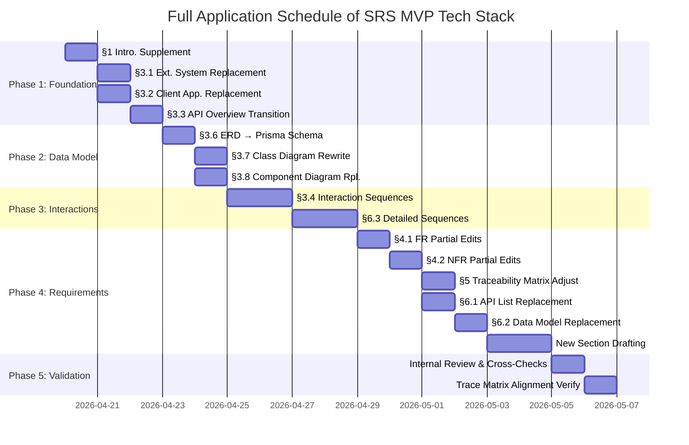

# SRS v01 (ENG_OPUS) — MVP Tech Stack Full Application Plan

Document ID: PLAN-SRS-001-MVP  
Revision: 1.0  
Date: 2026-04-19  
Base Document: `SRS_v01(ENG_OPUS).md`  
Adaptation Reference: `SRS_V01(ENG_OPUS)_MVP.md`  
Standard: ISO/IEC/IEEE 29148:2018

---

## 0. Purpose of This Plan

This document is a **work plan** designed to create a single integrated MVP SRS document by **fully applying** the contents of `SRS_V01(ENG_OPUS)_MVP.md` (MVP Tech Stack Adaptation Review) to `SRS_v01(ENG_OPUS).md` (Original SRS).

### 0.1 Objectives
1. Fully reorganize the architecture of the original SRS to align with the MVP tech stack (C-TEC-001~007).
2. Ensure the feasibility of Functional Requirements (FR) and Non-Functional Requirements (NFR).
3. Review for any **compromise of the core user experience (value delivery)** and establish preservation strategies.
4. Define the quality standards and validation methods for the deliverables.

### 0.2 Reference Documents

| Document | Path | Role |
| :--- | :--- | :--- |
| Original SRS | `SRS_v01(ENG_OPUS).md` | Original to be modified (ISO 29148 Compliant) |
| MVP Review | `SRS_V01(ENG_OPUS)_MVP.md` | Tech stack adaptation and Gap analysis results |
| PRD v0.3 | `Rooted_opus_v0.3.md` | Source of business requirements |

---

## 1. Change Scope Summary

### 1.1 Tech Stack Transition Summary

| Constraint ID | Description | Category |
| :--- | :--- | :--- |
| **C-TEC-001** | Integrate all services into the **Next.js (App Router)** full-stack framework. No separate frontend/backend. | Internal |
| **C-TEC-002** | Server logic via **Server Actions** or **Route Handlers** — No separate backend server. | Internal |
| **C-TEC-003** | **Prisma + SQLite** (Local dev) / **Supabase PostgreSQL** (Production). | Internal |
| **C-TEC-004** | UI/Styling via **Tailwind CSS + shadcn/ui**. | Internal |
| **C-TEC-005** | LLM orchestration via **Vercel AI SDK** (No Python server). | External |
| **C-TEC-006** | LLM invocation via **Google Gemini API** (Environment variable-based model swap). | External |
| **C-TEC-007** | Deployment on **Vercel** platform, CI/CD via Git Push only. | External |

### 1.2 Impact Matrix

| SRS Section | Original Architecture | MVP Architecture | Impact | Task Type |
| :--- | :--- | :--- | :--- | :--- |
| §1. Introduction | - | - | ⚪ None | Maintain (Minor additions) |
| §2. Stakeholders | - | - | ⚪ None | Maintain |
| §3.1 External Systems | AWS Lambda, S3, CloudWatch | Vercel, Supabase, Gemini API | 🔴 Major | **Full Replacement** |
| §3.2 Client Applications | iOS Native + Web SPA | PWA + Next.js Dashboard | 🔴 Major | **Full Replacement** |
| §3.3 API Overview | Existing REST API | Next.js Route Handlers | 🔴 Major | **Full Replacement** |
| §3.4 Interaction Sequences | Cloud Backend-centric | Next.js + Supabase-centric | 🔴 Major | **Full Rewrite** |
| §3.5 Use Case Diagram | - | - | ⚪ None | Maintain |
| §3.6 ERD | Existing ER Diagram | Prisma Schema-based ERD | 🟡 Medium | **Replace** |
| §3.7 Class Diagram | OOP Class Structure | Next.js Route/Action-based | 🟡 Medium | **Replace** |
| §3.8 Component Diagram | AWS Infrastructure-based | Vercel + Supabase-based | 🔴 Major | **Full Replacement** |
| §4.1 Functional Requirements | Requirements Body | Implementation Tech Ref Change | 🟡 Medium | **Partial Edit** |
| §4.2 Non-Functional Requirements | AWS-based Thresholds | Vercel/Supabase-based Adjustment | 🟡 Medium | **Partial Edit** |
| §5. Traceability Matrix | - | Test Case Tech Mapping | 🟢 Minor | **Partial Edit** |
| §6.1 API Endpoint List | Existing REST List | Next.js Route Handlers List | 🔴 Major | **Full Replacement** |
| §6.2 Entity & Data Model | SQL DDL Style | Prisma Schema + Definitions | 🔴 Major | **Full Replacement** |
| §6.3 Detailed Interaction Models| Cloud Backend-centric | Next.js + Supabase-centric | 🔴 Major | **Full Rewrite** |
| §6.4 Validation Plan | - | - | ⚪ None | Maintain |
| **New** §Server Actions | None | Add Server Actions Definitions | 🆕 New | **New Creation** |
| **New** §AI Integration | None | Gemini API Integration Spec | 🆕 New | **New Creation** |
| **New** §Project Structure | None | Recommended Project Structure | 🆕 New | **New Creation** |
| **New** §Environment Variables | None | Environment Variables Definition | 🆕 New | **New Creation** |
| **New** §Risk Assessment | None | MVP Tech Stack Risk Evaluation | 🆕 New | **New Creation** |

---

## 2. Detailed Application Plan by Section

### Phase 1: Foundation Changes

#### 2.1 §1. Introduction Supplements

| Task | Description | Priority |
| :--- | :--- | :--- |
| §1.2 Scope Supplement | Specify B2C Guardian App → PWA transition, move Android/iOS Native to Out-of-Scope (Wave 2) | Must |
| §1.4 Add References | Add Vercel Docs, Supabase Docs, Prisma Docs, Vercel AI SDK Docs to REF | Should |
| §1.5.1 Add Constraints | Register C-TEC-001~007 as new CON-06~CON-12 | Must |
| §1.5.2 Add Assumptions | Assume Vercel Pro SLA 99.99%, Supabase Realtime connection limit, iOS 16.4+ Web Push support | Must |
| §1.5.3 Add Dependencies | DEP-04: Supabase Realtime, DEP-05: Vercel Cron, DEP-06: Vercel AI SDK | Must |

#### 2.2 §3.1 External Systems — Full Replacement

**Existing (To be deleted):**
- AWS Cloud Infrastructure (Lambda, S3/Glacier, CloudWatch)
- APNs (Apple Push Notification service) — Excluded from MVP scope

**New (To be added):**
- Supabase (PostgreSQL + Storage + Realtime) — Prisma ORM / Supabase Client SDK
- Web Push API — Browser push via PWA Service Worker
- Google Gemini API — Vercel AI SDK (`@ai-sdk/google`)
- Vercel Platform — Git Push Auto-deploy, Edge Functions, Cron Jobs

**Maintained:**
- EMR System (Carefor) — Keep HTTP POST Webhook
- FCM (Firebase Cloud Messaging) — Keep
- Amplitude / Mixpanel — Keep

#### 2.3 §3.2 Client Applications — Full Replacement

| Client | Before Change | After Change |
| :--- | :--- | :--- |
| B2C Guardian App | iOS Native (MVP), Android Wave 2+ | **PWA (Next.js App Router + shadcn/ui + Tailwind CSS)** |
| B2B Dashboard | Web SPA (Unspecified framework) | **Next.js App Router + shadcn/ui + Tailwind CSS** |
| Installer App | Mobile (Internal) | **Out of MVP scope** — Replaceable with PWA-based guide |

#### 2.4 §3.3 API Overview → Next.js Route Handlers Transition

Redefine into 11 Route Handlers: 6 existing APIs + 5 new/modified:

| # | Route | Method | Changes |
| :--- | :--- | :--- | :--- |
| 1 | `app/api/events/ingest/route.ts` | POST | Cloud Ingest API → Route Handler |
| 2 | `app/api/webhooks/emr/route.ts` | POST | EMR Webhook API Maintained (Path changed) |
| 3 | `app/api/notifications/push/route.ts` | POST | FCM/Web Push Integration |
| 4 | `app/api/reports/daily/[deviceId]/[date]/route.ts` | GET | Daily Report Query → Route Handler |
| 5 | `app/api/reports/trend/[deviceId]/route.ts` | GET | Trend API → Route Handler |
| 6 | `app/api/events/[eventId]/false-alarm/route.ts` | POST | False Alarm Feedback → Route Handler |
| 7 | `app/api/events/archive/route.ts` | GET | Archive Viewer → Route Handler |
| 8 | `app/api/dashboard/status/route.ts` | GET | Dashboard Status → Route Handler |
| 9 | `app/api/dashboard/filters/route.ts` | PATCH | Filter Config → Route Handler |
| 10 | `app/api/devices/[deviceId]/heartbeat/route.ts` | GET/POST | Heartbeat → Route Handler |
| 11 | `app/api/ai/wellness-summary/route.ts` | POST | 🆕 Gemini AI Wellness Summary |

#### 2.5 §3.3+ (New) Server Actions Definitions

Add 6 Server Actions definitions:
- `createWellnessEvent` — Create Prisma event
- `updateFalseAlarmFlag` — Toggle False Alarm flag
- `generateDailyReport` — Aggregate daily report + Gemini AI summary
- `updateDeviceStatus` — Update device heartbeat/status
- `saveDashboardFilter` — Persist admin filter configuration
- `createUser` — Role-based user creation

---

### Phase 2: Data Model and Diagram Replacement

#### 2.6 §3.6 ERD — Prisma Schema-based Rewrite

**Key Changes:**
- UUID → `cuid()` string ID (SQLite compatible)
- ENUM → String field + Application level validation (SQLite compatible)
- UUID[] array (`linked_devices`) → Normalize to `UserDevice` join table
- JSON field → Saved as string in SQLite
- 🆕 `DeadLetterEvent` model added (Store failed EMR Webhook events)
- 🆕 `DailyReport.aiSummary` field added (Gemini AI-generated narrative)

#### 2.7 §3.7 Class Diagram — Next.js Architecture-based Rewrite

**Classes to Change:**
- `CloudBackend` → Decomposed into Next.js Route Handlers
- `PushNotificationService` → FCM + Web Push integrated client
- `ReportPipeline` → Based on Vercel Cron + Server Action
- `HeartbeatMonitor` → Based on Vercel Cron + Supabase Database Webhook

**Maintained Classes:**
- `EdgeAIValidator` — No changes in Edge layer
- `TriageEngine` — Keep algorithm logic (Implemented in Server Action or Client-side)
- `EMRWebhookClient` — Keep HMAC-SHA256 logic (Implemented within Route Handler)

#### 2.8 §3.8 Component Diagram — Full Replacement

Apply the revised component diagram from MVP Review §4 as is:
- Edge Layer (No changes)
- Next.js App on Vercel (Route Handlers + Server Actions + Pages)
- Supabase (PostgreSQL + Storage + Realtime)
- AI/LLM (Vercel AI SDK + Gemini)
- External Services (FCM, Web Push, EMR, Amplitude)

---

### Phase 3: Interaction Sequences Rewrite

#### 2.9 §3.4 Interaction Sequences — Full Rewrite

| Sequence | Original | MVP Change | Task Type |
| :--- | :--- | :--- | :--- |
| §3.4.1 Daily Wellness Report | Cloud Backend + FCM/APNs | Vercel Cron → Server Action → Prisma → Gemini AI → FCM/Web Push | **Full Rewrite** |
| §3.4.2 Zero False Alarm AI Validator | Edge AI Validator → Cloud | Edge AI Validator → Next.js Route Handler (Minimal change) | **Partial Edit** (Cloud Backend → Route Handler) |
| §3.4.3 PMF Diagnostic Sequence | Amplitude/Mixpanel-centric | No changes (Keep Amplitude SDK) | **Maintain** |
| §3.4.4 EMR System Sync | Cloud Backend → WebSocket → Dashboard | Route Handler → Supabase Realtime → Dashboard | **Full Rewrite** |

#### 2.10 §6.3 Detailed Interaction Models — Full Rewrite

| Sequence | Key Changes |
| :--- | :--- |
| §6.3.1 Fall Detection E2E | Cloud Backend → Route Handler, WebSocket → Supabase Realtime, FCM/APNs → FCM/Web Push |
| §6.3.2 Device Offline Detection | Cloud Backend Heartbeat Monitor → Vercel Cron + Supabase Database Webhook, Keep PagerDuty integration |
| §6.3.3 OTA Firmware Update | No changes (Edge/Firmware area) |

---

### Phase 4: Requirements Adjustment and New Sections

#### 2.11 §4.1 Functional Requirements — Partial Edit

**Key Modification Points:**
- FR-04 (B2B Dashboard): Change reference from "WebSocket" to "Supabase Realtime"
- FR-05 (Daily Report): Add description of Gemini AI summary feature
- FR-07 (SMS/Kakao Fallback): Redefine SMS/Kakao position relative to Web Push
- FR-08 (Configurable Dashboard): Reference shadcn/ui DataTable-based implementation

**Maintain Requirement IDs:** ID system for REQ-FUNC-001 ~ REQ-FUNC-023 remains unchanged to preserve traceability.

#### 2.12 §4.2 Non-Functional Requirements — Partial Edit

| NFR ID | Modification |
| :--- | :--- |
| REQ-NF-001 | Monitoring Tool: Datadog APM → Vercel Analytics + Edge Runtime |
| REQ-NF-004 | Scaling Baseline: AWS → Vercel Pro/Enterprise + Supabase PgBouncer |
| REQ-NF-005 | SLA Basis: Vercel Pro 99.99% + Supabase Pro 99.9% |
| REQ-NF-007 | PagerDuty Integration: Supabase Database Webhook-based |
| REQ-NF-012 | Cost Baseline: AWS Billing → Vercel + Supabase Cost |
| REQ-NF-017 | Cold Archival: S3 Glacier → Supabase Storage (Cron-based migration) |
| REQ-NF-018 | Scalability: <500 devices at MVP, Re-evaluate in Wave 2 |

#### 2.13 §6.1 API Endpoint List — Full Replacement

Redefine all existing 11 endpoints as Next.js Route Handler paths (Ref. §2.4).

#### 2.14 §6.2 Entity & Data Model — Full Replacement

Transition from existing SQL DDL style to Prisma schema definition (Ref. §2.6).

#### 2.15 Add New Sections

| New Section | Description | Source |
| :--- | :--- | :--- |
| **Server Actions Definition** | Function signatures, paths, and logic for 6 Server Actions | MVP Review §2.4 |
| **AI Integration (Gemini)** | Vercel AI SDK integration spec, model swap strategy, prompt structure | MVP Review §6.2 NEW-01, NEW-02 |
| **Recommended Project Structure** | Directory tree structure | MVP Review §9 |
| **Environment Variables** | .env file definition | MVP Review §10 |
| **Sprint Estimation (MVP)** | Revised sprint estimate (Save 2~3 sprints on infra) | MVP Review §8 |
| **Risk Assessment** | Evaluation of 6 MVP-specific risks | MVP Review §11 |
| **Gap Analysis & Mitigation** | 8 Gaps and their mitigation strategies | MVP Review §6 |

---

## 3. Review of Core User Experience (Value Delivery) Compromise

### 3.1 Review Framework

Review whether the **5 Core Value Propositions** defined in the PRD are fully preserved and delivered without compromise after switching to the MVP tech stack.

```text
Core Value = f(Functional Completeness, UX Quality, Fulfillment of NFR Thresholds)
```

### 3.2 Value #1: Zero False Alarm

> **PRD Definition:** Monthly AI engine false alarms ≤ 0.3/household, user perceived false alarms ≤ 2/household (North Star Metric)

| Review Item | Result | Details |
| :--- | :--- | :--- |
| Edge AI Validator | ✅ **Uncompromised** | Edge layer is **completely independent** from tech stack transition. Deep learning reasoning engine, pet differentiation (≥99%), and `confidence_score` threshold logics are all in HW/FW and remain unchanged. |
| False Alarm Feedback | ✅ **Uncompromised** | Path for updating the `is_false_alarm` flag changed to Route Handler → Prisma. UX flow (button tap → send feedback) remains identical. |
| Emergency Alert Latency | ⚠️ **Minor Risk** | Vercel serverless cold start could impact the p95 ≤ 2,000ms threshold. → **Mitigation:** Use Edge Runtime to eliminate cold start and use synthetic heartbeats to pre-warm. |
| **Overall Verdict** | ✅ **Value Preserved** | Core AI filtering logic is Edge-independent, unaffected by backend tech stack transition. Alert latency risk is migitable via Edge Runtime. |

### 3.3 Value #2: Zero-Friction User Experience

> **PRD Definition:** Senior device operation frequency = 0 (No charging, no wearing, no button operations)

| Review Item | Result | Details |
| :--- | :--- | :--- |
| Sensor Hardware | ✅ **Uncompromised** | UWB radar wall/ceiling mount methodology is unchanged. Tech stack transition does not affect hardware UX. |
| Auto-Calibration | ✅ **Uncompromised** | Firmware domain. Only state logging route changed to Heartbeat Route Handler. |
| Senior Perspective | ✅ **Uncompromised** | Seniors (observees) do not directly interact with apps/web. The Zero-Friction principle of passive sensor operation is independent of the tech stack. |
| **Overall Verdict** | ✅ **Value Preserved** | Zero-Friction is an HW/FW-level value proposition. Immune to server/frontend tech shifts. |

### 3.4 Value #3: Guardian Peace of Mind (Alerts & Daily Reports)

> **PRD Definition:** Immediate emergency alerts, daily wellness report at 07:30, sleep/bathroom anomaly detection

| Review Item | Result | Details |
| :--- | :--- | :--- |
| Emergency Push Alerts | ⚠️ **Partial Change** | iOS Native Push (APNs) → **Web Push API (PWA)** transition. Requires iOS Safari 16.4+. **Coverage risk exists.** |
| Daily Report Delivery | ✅ **Enhanced** | Vercel Cron (07:30) → FCM/Web Push. Same as before + **Gemini AI Natural Language Summary Added** improving readability. Human-like phrasing such as "Mom slept well for 7.5 hours last night." |
| Sleep Trend Charts | ✅ **Uncompromised** | Rendered via Chart.js/Recharts on Next.js pages. Functionality identical. |
| Anomaly Alerts | ✅ **Uncompromised** | Bathroom stay duration +50% trigger logic remained intact. Only Route Handler → Push execution path altered. |
| **Overall Verdict** | ⚠️ **Partial Risk, Overall Enhanced** | PWA switch brings limited iOS push coverage constraints, but Report Value is strongly boosted via new AI summaries. |

> [!WARNING]
> **iOS PWA Push Notification Limitations:**  
> Web Push API is supported only from iOS Safari 16.4+ (Released March 2023). Most iPhone users in 2026 are on this version or higher, but to account for guardians using older devices, it is highly recommended to upgrade SMS/KakaoTalk Fallback (FR-07, Could) to **Should** priority.

### 3.5 Value #4: Privacy-First (Non-Visual Privacy Protection)

> **PRD Definition:** De-identified behavior tracking without video/camera data. PIPA compliance.

| Review Item | Result | Details |
| :--- | :--- | :--- |
| Edge Data De-identification | ✅ **Uncompromised** | Transforms raw radar waveforms → numeric statistics on Edge before transmitting. Fully independent from tech stack. |
| Server-Stored Data | ✅ **Uncompromised** | No PII fields in Prisma schema. Only de-identified metadata is stored in `WellnessEvent`. |
| CON-02 PIPA Compliance | ✅ **Uncompromised** | Constraint maintained. Edge-level de-identification logic unaltered. |
| DB/API Naming Conventions | ✅ **Uncompromised** | CON-04 maintained. Non-medical terminologies like `wellness_score`, `activity_alert` used. |
| **Overall Verdict** | ✅ **Value Preserved** | Privacy-First is a design principle rooted in the Edge layer. Though DB/schema has shifted to Prisma, the de-identified structure remains identical. |

### 3.6 Value #5: B2B Operational Efficiency (Dashboard + Automated EMR Sync)

> **PRD Definition:** Traffic-light multi-bed monitoring, algorithms for Triage, zero duplicate manual data entry via auto EMR synchronization.

| Review Item | Result | Details |
| :--- | :--- | :--- |
| Real-time Dashboard | ✅ **Equivalent Implementation** | WebSocket → **Supabase Realtime** transition. Automatic broadcasting upon DB changes offers indistinguishable real-time UX. |
| Triage Priority Sorting | ✅ **Uncompromised** | Algorithm logics remain. Implemented via Server Actions or client-side evaluation. |
| EMR Webhook Integration | ✅ **Uncompromised** | HMAC-SHA256 signature + HTTP POST logic conserved. Implemented inside Route Handlers. |
| EMR Retries + DLQ | ✅ **Enhanced** | Maintained exponential backoff retries (3 times) + strengthened failed event persistence with `DeadLetterEvent` Prisma model. Admins can verify retry states from the dashboard. |
| 90-day Archive Search | ⚠️ **Partial Change** | S3 Glacier automated lifecycle → Manuel/Cron migration script using Supabase Storage. Unchanged conceptually but slightly degraded operations automation. |
| **Overall Verdict** | ✅ **Value Preserved** | EMR integration, Triage, real-time monitoring are effectively identical in capability. Only cold archival methodology experiences operational changes, maintaining functional completeness. |

### 3.7 Core Value Delivery Compromise Review Summary

```text
┌────────────────────────────────────────────────────────────────────────────────┐
│             MVP Tech Stack Changes — Core Value Delivery Summary               │
├──────────────────────────┬──────────────┬──────────────────────────────────────┤
│ Core Value Proposition   │ Verdict      │ Remarks                              │
├──────────────────────────┼──────────────┼──────────────────────────────────────┤
│ #1 Zero False Alarm      │ ✅ Preserved │ Edge AI is decoupled. Minor latency  │
│ #2 Zero-Friction         │ ✅ Preserved │ HW/FW. Unaffected by server change.  │
│ #3 Guardian Peace of Mind│ ⚠️ Enhanced  │ AI Summaries. iOS PWA push limits.   │
│ #4 Privacy-First         │ ✅ Preserved │ Edge de-identification is intact.    │
│ #5 B2B Operation Eff.    │ ✅ Preserved │ EMR/Triage/Dashboard parity.         │
├──────────────────────────┴──────────────┴──────────────────────────────────────┤
│ Overall Verdict: ✅ No compromise loosely interpreted (Certain areas enhanced) │
│                                                                                │
│ Critical Cautions:                                                             │
│ · iOS PWA Push Coverage — Elevate SMS/Kakao fallback to Should Priority      │
│ · Vercel Cold Starts — Assure p95 ≤ 2,000ms applying Edge Runtime            │
│ · Cold Archival — Reinforce Op automation shifting S3 Glacier → Supabase Obj   │
└────────────────────────────────────────────────────────────────────────────────┘
```

---

## 4. Added Value from MVP Transition

Identifies the **pure new values** brought about by the backend tech stack shift:

| # | New Value | Description | Affected User |
| :--- | :--- | :--- | :--- |
| **NEW-01** | **AI Wellness Narrative** | Gemini summarizes daily reports in natural language such as "Mom slept well for 7.5 hours last night. Used the bathroom 2 times (within normal range)." | B2C Guardian (Park Ji-soo) |
| **NEW-02** | **AI Anomaly Explanation** | Explains anomaly flags using natural language instead of codes ("Bathroom dwell time is 50% longer than usual. Recommend checking.") | B2C Guardian |
| **NEW-03** | **Rapid Deployment Cycle** | Git Push → Vercel Auto Deploy + PR Previews. **Saves 2~3 sprints** compared to existing AWS infra setup. | Development Team |
| **NEW-04** | **Unified Codebase** | B2B Dashboard + B2C Portal + API unified into a single Next.js repo. Reduces maintenance overhead. | Development Team |
| **NEW-05** | **Edge Runtime** | Optimizes latency-sensitive routes via Vercel Edge Functions → Assists in achieving p95 ≤ 2,000ms. | All Users |

---

## 5. Execution Sequence and Schedule

### 5.1 Task Phases



### 5.2 Task Checklist

- [ ] **Phase 1: Foundation Changes**
  - [ ] §1.2 Scope: Explicitly state B2C iOS → PWA transition
  - [ ] §1.4 References: Add Vercel, Supabase, Prisma Docs
  - [ ] §1.5 Constraints: Register C-TEC-001~007
  - [ ] §1.5 Assumptions: Add Vercel/Supabase SLA assumptions
  - [ ] §1.5 Dependencies: Add Supabase Realtime, Vercel Cron, etc.
  - [ ] §3.1 External Systems: Replace AWS with Vercel/Supabase
  - [ ] §3.2 Client Applications: Repalce iOS with PWA, SPA with Next.js
  - [ ] §3.3 API Overview: Fully redefine as Route Handlers
  - [ ] §3.3+ Server Actions: Insert new section

- [ ] **Phase 2: Data Model and Diagrams**
  - [ ] §3.6 ERD: Rewrite based on Prisma schema
  - [ ] §3.7 Class Diagram: Reflect Next.js architecture
  - [ ] §3.8 Component Diagram: Replace with MVP architecture

- [ ] **Phase 3: Interaction Sequences**
  - [ ] §3.4.1 Daily Report: Integrate Vercel Cron + Gemini AI
  - [ ] §3.4.2 AI Validator: Modify routing path (Cloud Backend → Route Handler)
  - [ ] §3.4.4 EMR Sync: Integrate Supabase Realtime
  - [ ] §6.3.1 Fall Detection E2E: Full Rewrite
  - [ ] §6.3.2 Device Offline: Integrate Vercel Cron + Supabase Webhook

- [ ] **Phase 4: Requirements Adjustment and New Sections**
  - [ ] §4.1 FR: Update references (e.g., WebSocket → Supabase Realtime)
  - [ ] §4.2 NFR: Adjust monitoring/scaling/cost criteria
  - [ ] §5 Traceability Matrix: Reflect tech stack in testing methodologies
  - [ ] §6.1 API List: Fully replace with Next.js Route Handlers
  - [ ] §6.2 Data Model: Shift to Prisma schema
  - [ ] New: AI Integration Section
  - [ ] New: Project Structure Section
  - [ ] New: Environment Variables Section
  - [ ] New: Sprint Estimation Section
  - [ ] New: Risk Assessment Section
  - [ ] New: Gap Analysis & Mitigation Section

- [ ] **Phase 5: Validation**
  - [ ] Verify traceability matrix integrity (Are all REQ-IDs valid?)
  - [ ] Finalize value delivery compromise review outcomes
  - [ ] Ensure ISO/IEC/IEEE 29148:2018 structure compliance
  - [ ] Check cross-reference consistency within document

---

## 6. Deliverable Definitions

### 6.1 Final Deliverables

| # | Deliverable | Filename | Description |
| :--- | :--- | :--- | :--- |
| 1 | **MVP Integrated SRS** | `SRS_v02(ENG_OPUS_MVP).md` | Integrated document fully applying the MVP tech stack to the original SRS |
| 2 | **Revision History** | Revision History within SRS | Summary of changes from v1.0 to v2.0 |

### 6.2 Quality Standards

| # | Standard | Validation Method |
| :--- | :--- | :--- |
| 1 | ISO/IEC/IEEE 29148:2018 structure compliance | Section mapping checklist |
| 2 | Maintain & Validate all REQ-IDs (23 FUNC, 20 NF) | Traceability Matrix cross-check |
| 3 | Normal rendering of Mermaid diagrams | Confirm via Markdown preview |
| 4 | Confirm preservation of the 5 Core Values | Confirm reflection of this Plan's §3 review outcomes |
| 5 | Include mitigating strategies for the 8 Gaps from MVP review | Verify mapping by Gap ID |

---

## 7. Decision Required

> [!IMPORTANT]
> Decisions on the following matters are required before proceeding.

### 7.1 Finalize B2C Guardian Portal Approach

| Option | Description | Pros | Cons |
| :--- | :--- | :--- | :--- |
| **Option 1: PWA** (Recommended) | Next.js-based Responsive Web + Service Worker + Web Push | C-TEC-001 aligned, unified codebase | Needs iOS 16.4+, lack of native UX |
| Option 2: Postpone iOS | Exclude iOS app from MVP scope, native development later | Maintains pure tech stack | Reduced Guardian accessibility |
| Option 3: Hybrid (Capacitor) | Wrap Next.js PWA via Capacitor for App Store deployment | App Store presence | Increased complexity, wrapper dependency |

### 7.2 Escalate Priority of SMS/KakaoTalk Fallback

- Current: **Could** (FR-07)
- Recommended: Elevate to **Should** (As backup for iOS PWA push constraints)

### 7.3 Confirm Cold Archival Strategy

- Option A: Supabase Storage (Cron-based monthly migration)
- Option B: Maintain external S3 Glacier (Hybrid)
- Option C: Partitioning inside Supabase PostgreSQL (Hot/Cold tables split)

---

## 8. Risk Summary

| Risk ID | Description | Probability | Impact | Mitigation Strategy |
| :--- | :--- | :--- | :--- | :--- |
| **RISK-01** | Vercel Serverless cold starts → p95 latency on emergency alerts | 3/5 | 4/5 | Edge Runtime + Synthetic heartbeat pre-warming |
| **RISK-02** | Shortage of iOS Safari Web Push coverage | 3/5 | 3/5 | Elevate SMS/Kakao fallback to Should Priority |
| **RISK-03** | Supabase Realtime conn limits (For large facilities) | 2/5 | 3/5 | MVP limits <500 devices is sufficient. Keep monitoring |
| **RISK-04** | Latent scalability limits at 5K devices (Vercel serverless) | 2/5 | 3/5 | Safe within MVP scope. Re-evaluate architecture at Wave 2 |
| **RISK-05** | Migration issues between SQLite → PostgreSQL | 2/5 | 2/5 | Minimize via Prisma abstraction. Test both providers in CI |
| **RISK-06** | Gemini API cost/speed bottlenecks | 2/5 | 2/5 | Batch generation + AI Summary caching + ENV-based model swapping |

---

## 9. Conclusion

### 9.1 Feasibility Verdict

| Item | Verdict |
| :--- | :--- |
| Feasibility of Tech Stack Application | ✅ **Applicable** |
| Functional Coverage (FR) | **96%** (22/23 Full, 1 Partial) |
| Non-Functional Coverage (NFR) | **85%** (12/20 Full, 5 Partial, 3 N/A) |
| Preservation of Core User Experience | ✅ **5/5 Values Preserved** (1 value enhanced) |
| Estimated Sprint Reduction | **2~3 Sprints** (By simplifying infra configuration) |
| New Values Added | **5 Items** (AI Narrative, Rapid Deployments, Unified Codebase, etc) |

### 9.2 Recommendations

1. **Finalize PWA approach**, then immediately commence Phase 1
2. Escalate SMS/KakaoTalk Fallback (FR-07) to **Should**
3. Create MVP integrated SRS using the filename `SRS_v02(ENG_OPUS_MVP).md`
4. Conduct **Internal Reviews** after sequentially progressing through Phases 1~5

---

**— End of Plan Document —**
