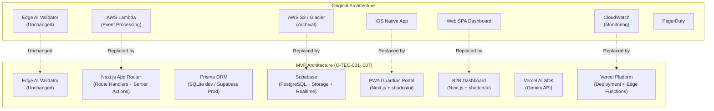
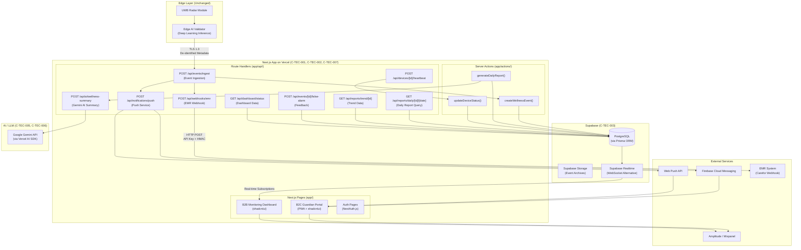
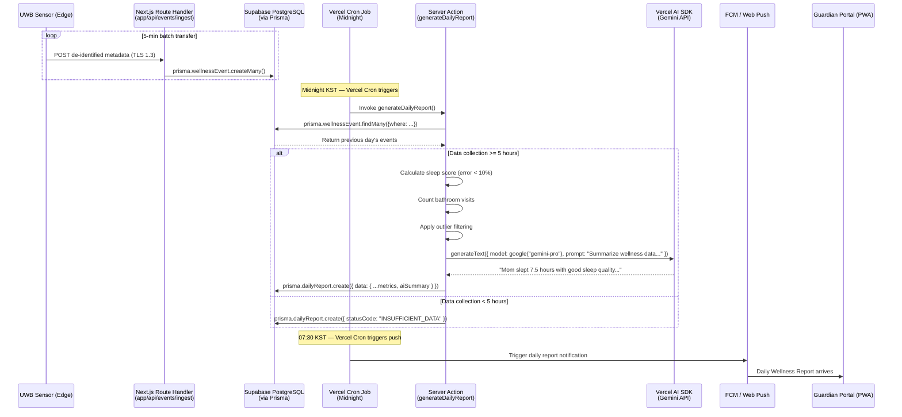
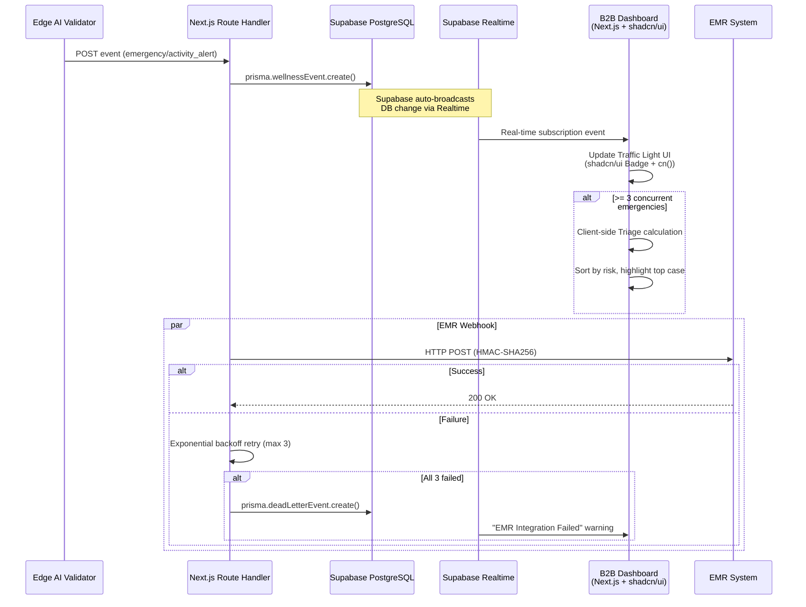

# SRS v01 (ENG_OPUS) — MVP Tech Stack Adaptation & Coverage Review

Document ID: SRS-001-MVP  
Revision: 1.0  
Date: 2026-04-19  
Base Document: SRS_v01(ENG_OPUS).md  
Standard: ISO/IEC/IEEE 29148:2018

---

## 0. Executive Summary — Tech Stack Adaptation Review

### 0.1 Purpose of This Document

This document adapts the original SRS_v01(ENG_OPUS).md to align with the specified MVP tech stack constraints (C-TEC-001 through C-TEC-007). It also provides a **functional coverage gap analysis** to validate whether the adapted architecture can fully implement the required MVP features.

### 0.2 Target Tech Stack Constraints

| Constraint ID | Description | Category |
| :--- | :--- | :--- |
| **C-TEC-001** | All services built on a single **Next.js (App Router)** fullstack framework. No separate frontend/backend. | Internal |
| **C-TEC-002** | Server logic via **Server Actions** or **Route Handlers** — no separate backend server. | Internal |
| **C-TEC-003** | **Prisma + SQLite** (local dev) / **Supabase PostgreSQL** (production). | Internal |
| **C-TEC-004** | UI/Styling via **Tailwind CSS + shadcn/ui**. | Internal |
| **C-TEC-005** | LLM orchestration via **Vercel AI SDK** within Next.js (no Python server). | External |
| **C-TEC-006** | LLM calls use **Google Gemini API** with environment-variable-based model swapping. | External |
| **C-TEC-007** | Deployment on **Vercel** platform, CI/CD via Git Push only. | External |

### 0.3 High-Level Impact Summary

| Area | Original SRS Architecture | MVP Adapted Architecture | Impact Level |
| :--- | :--- | :--- | :--- |
| **Backend** | AWS Lambda + custom microservices | Next.js Route Handlers + Server Actions | 🔴 Major |
| **Database** | Vague (Event DB references) | Prisma + SQLite / Supabase PostgreSQL | 🔴 Major |
| **Frontend — B2B Dashboard** | Web SPA (unspecified framework) | Next.js App Router pages + shadcn/ui | 🟡 Medium |
| **Frontend — B2C Guardian App** | iOS Native (MVP) | ⚠️ **Out of Scope for web stack** — see §0.5 | 🔴 Critical |
| **AI/LLM Integration** | Not specified in original SRS | Vercel AI SDK + Google Gemini API | 🟢 New Addition |
| **Edge AI Validator** | On-device deep learning inference | **Unchanged** (hardware layer, outside web stack) | ⚪ None |
| **Deployment** | AWS Infrastructure | Vercel Platform | 🟡 Medium |
| **Real-time** | WebSocket (custom) | Vercel doesn't natively support WebSocket — alternatives needed | 🟡 Medium |
| **File Storage / Archival** | AWS S3 + Glacier | Supabase Storage | 🟡 Medium |

### 0.4 Key Architectural Decision

```
Original: Edge Device → AWS Cloud (Lambda/S3/CloudWatch) → iOS App + Web Dashboard
                                                        → EMR Webhook
                                                        
MVP:      Edge Device → Next.js on Vercel (Route Handlers) → Web Dashboard (Next.js Pages)
                            ↕ Prisma ↕                      → PWA or Web-based Guardian Portal
                        Supabase PostgreSQL                  → EMR Webhook
                            ↕
                        Vercel AI SDK + Gemini (for analytics/insights)
```

### 0.5 Critical Scope Decision Required

> **⚠️ CAUTION: B2C Guardian App (iOS)**
>
> The original SRS specifies an iOS native app as the MVP client. The target tech stack (Next.js fullstack) does not include native mobile app development. 
> 
> **Options:**
> 1. **PWA (Progressive Web App)** — Build the Guardian portal as a responsive Next.js web app with PWA capabilities (push notifications via Web Push API). This aligns with C-TEC-001.
> 2. **Defer iOS Native** — Keep iOS native app in the roadmap but exclude from this MVP scope.
> 3. **Hybrid Approach** — Use a wrapper like Capacitor/Expo to package the Next.js web app as a mobile app (adds complexity).
> 
> **Recommendation:** Option 1 (PWA) for MVP, with iOS native planned for Wave 2.

---

## 1. Architecture Alignment — Tech Stack Mapping

### 1.1 Component Mapping: Original → MVP



### 1.2 Constraint-to-SRS Section Mapping

| Constraint | Affected SRS Sections | Change Description |
| :--- | :--- | :--- |
| **C-TEC-001** (Next.js App Router) | §3.2 Client Applications, §3.4 Interaction Sequences, §3.7 Class Diagram, §3.8 Component Diagram | B2B Dashboard and B2C Guardian Portal are both Next.js App Router pages. Cloud Backend class is replaced by Next.js Route Handlers. |
| **C-TEC-002** (Server Actions / Route Handlers) | §3.3 API Overview, §6.1 API Endpoint List | All API endpoints become Next.js `app/api/` Route Handlers. DB mutations use Server Actions. |
| **C-TEC-003** (Prisma + SQLite/Supabase) | §3.6 ERD, §6.2 Entity & Data Model | ERD translates to Prisma schema. UUID types map to Prisma's `@id @default(cuid())`. Supabase PostgreSQL for production. |
| **C-TEC-004** (Tailwind + shadcn/ui) | §3.2 Client Applications | All UI components (Dashboard traffic light, reports, filters) built with shadcn/ui components + Tailwind utilities. |
| **C-TEC-005** (Vercel AI SDK) | §3.4.1 Daily Report Sequence (NEW: AI-enhanced insights) | Report Pipeline can leverage Gemini for natural language wellness summaries. |
| **C-TEC-006** (Gemini API) | NEW section — AI Integration | Gemini generates human-readable daily wellness narratives, anomaly explanations. ENV-based model swap. |
| **C-TEC-007** (Vercel Deployment) | §3.1 External Systems, §3.8 Component Diagram | AWS references replaced with Vercel + Supabase. CI/CD is Git Push → Vercel auto-deploy. |

---

## 2. Revised System Context and Interfaces

### 2.1 External Systems (MVP Adapted)

| External System | Integration Method | Role | Change from Original |
| :--- | :--- | :--- | :--- |
| **Supabase (PostgreSQL + Storage + Realtime)** | Prisma ORM / Supabase Client SDK | Primary database, file storage, and real-time subscriptions | 🆕 Replaces AWS S3/Glacier + generic Event DB |
| **EMR System (Carefor, etc.)** | HTTP POST Webhook (JSON) via Next.js Route Handler | Auto-record wellness events to nursing facility EMRs | ⚪ Unchanged (outbound webhook) |
| **FCM (Firebase Cloud Messaging)** | HTTP/2 Push via Next.js Route Handler | Push delivery for PWA/mobile emergency alerts | ⚪ Unchanged |
| **Web Push API** | Service Worker registration | Browser-based push notifications for PWA Guardian portal | 🆕 Added for PWA support |
| **Google Gemini API** | Vercel AI SDK (`@ai-sdk/google`) | Generate AI-powered wellness insight summaries | 🆕 New capability |
| **Vercel Platform** | Git Push Auto-deploy | Hosting, Edge Functions, Cron Jobs, Analytics | 🆕 Replaces AWS Lambda/CloudWatch |
| **Amplitude / Mixpanel** | SDK Event Tracking | Product analytics events | ⚪ Unchanged |

> **NOTE:** APNs (Apple Push Notification service) is removed from MVP scope since the iOS native app is deferred. Web Push API replaces it for the PWA Guardian Portal.

### 2.2 Client Applications (MVP Adapted)

| Client | Platform | Tech Implementation | Core Features | Change |
| :--- | :--- | :--- | :--- | :--- |
| **B2C Guardian Portal** | Web (PWA) | Next.js App Router + shadcn/ui + Tailwind CSS | Receive push alerts, view daily wellness reports, false alarm report, sleep trend graph | 🔄 iOS Native → PWA |
| **B2B Monitoring Dashboard** | Web | Next.js App Router + shadcn/ui + Tailwind CSS | Real-time traffic light monitoring, Triage sorting, EMR Webhook monitoring, 90-day event log viewer | 🔄 Generic SPA → Next.js |
| **Installer App** | Mobile (Internal) | Out of MVP web stack scope | Sensor install guide, calibration check | ⚪ Deferred |

### 2.3 API Routes (Next.js Route Handlers)

All API endpoints are implemented as **Next.js Route Handlers** under `app/api/`.

| # | Route | Method | Description | Auth | Original Endpoint |
| :--- | :--- | :--- | :--- | :--- | :--- |
| 1 | `app/api/events/ingest/route.ts` | POST | Receive de-identified events from Edge devices | TLS + API Key | `POST /api/v1/events/ingest` |
| 2 | `app/api/webhooks/emr/route.ts` | POST | Forward events to EMR systems | API Key + HMAC-SHA256 | `POST /api/v1/webhooks/emr` |
| 3 | `app/api/notifications/push/route.ts` | POST | Trigger FCM / Web Push notifications | Internal Service Auth | `POST /api/v1/notifications/push` |
| 4 | `app/api/reports/daily/[deviceId]/[date]/route.ts` | GET | Fetch daily report for a device | JWT (NextAuth) | `GET /api/v1/reports/daily/{device_id}/{date}` |
| 5 | `app/api/reports/trend/[deviceId]/route.ts` | GET | Fetch multi-day trend data | JWT (NextAuth) | `GET /api/v1/reports/trend/{device_id}` |
| 6 | `app/api/events/[eventId]/false-alarm/route.ts` | POST | Submit false alarm feedback | JWT (NextAuth) | `POST /api/v1/events/{event_id}/false-alarm` |
| 7 | `app/api/events/archive/route.ts` | GET | Query archived event logs (90-day) | JWT + RBAC (NextAuth) | `GET /api/v1/events/archive` |
| 8 | `app/api/dashboard/status/route.ts` | GET | Fetch multi-bed dashboard status | JWT (Admin role) | `GET /api/v1/dashboard/status` |
| 9 | `app/api/dashboard/filters/route.ts` | PATCH | Save dashboard filter configurations | JWT (Admin role) | `PATCH /api/v1/dashboard/filters` |
| 10 | `app/api/devices/[deviceId]/heartbeat/route.ts` | GET/POST | Device heartbeat check-in | API Key | `GET /api/v1/devices/{device_id}/heartbeat` |
| 11 | `app/api/ai/wellness-summary/route.ts` | POST | 🆕 Generate AI wellness narrative via Gemini | JWT (NextAuth) | NEW |

### 2.4 Server Actions (Prisma Mutations)

Server Actions handle data mutations that don't require external API exposure:

| Action | Location | Description |
| :--- | :--- | :--- |
| `createWellnessEvent` | `app/actions/events.ts` | Insert wellness event into DB via Prisma |
| `updateFalseAlarmFlag` | `app/actions/events.ts` | Toggle `isFalseAlarm` on a WellnessEvent |
| `generateDailyReport` | `app/actions/reports.ts` | Aggregate daily data and create DailyReport record |
| `updateDeviceStatus` | `app/actions/devices.ts` | Update device heartbeat and status |
| `saveDashboardFilter` | `app/actions/dashboard.ts` | Persist admin dashboard filter preferences |
| `createUser` | `app/actions/users.ts` | Register user account with role assignment |

---

## 3. Revised Data Model (Prisma Schema)

### 3.1 Prisma Schema Definition

Translated from original ERD (§3.6) and Entity & Data Model (§6.2) to Prisma schema format.

```prisma
// prisma/schema.prisma

generator client {
  provider = "prisma-client-js"
}

datasource db {
  provider = "sqlite"        // Local dev: SQLite
  // provider = "postgresql"  // Production: Supabase PostgreSQL
  url      = env("DATABASE_URL")
}

model SensorDevice {
  id                String           @id @default(cuid())
  locationZone      String           // BEDROOM, BATHROOM, LIVING_ROOM
  firmwareVersion   String
  installationDate  DateTime
  status            String           @default("ACTIVE")  // ACTIVE, INACTIVE, MAINTENANCE
  calibrationStatus String           @default("PENDING") // CALIBRATED, PENDING
  lastHeartbeatAt   DateTime?
  facilityId        String?
  facility          Facility?        @relation(fields: [facilityId], references: [id])
  wellnessEvents    WellnessEvent[]
  dailyReports      DailyReport[]
  userDevices       UserDevice[]
  createdAt         DateTime         @default(now())
  updatedAt         DateTime         @updatedAt
}

model WellnessEvent {
  id              String   @id @default(cuid())
  deviceId        String
  device          SensorDevice @relation(fields: [deviceId], references: [id])
  eventType       String   // ACTIVITY_ALERT, WELLNESS_SCORE, EMERGENCY
  timestamp       DateTime
  confidenceScore Float
  isFalseAlarm    Boolean  @default(false)
  zone            String   // BEDROOM, BATHROOM, LIVING_ROOM
  integrityHash   String
  createdAt       DateTime @default(now())

  @@index([timestamp])
  @@index([deviceId, timestamp])
}

model UserAccount {
  id               String   @id @default(cuid())
  email            String   @unique
  name             String?
  role             String   // GUARDIAN, FACILITY_ADMIN
  notificationPref String   @default("{\"push\": true}")
  facilityId       String?
  facility         Facility? @relation(fields: [facilityId], references: [id])
  userDevices      UserDevice[]
  createdAt        DateTime @default(now())
  updatedAt        DateTime @updatedAt
}

model UserDevice {
  userId   String
  deviceId String
  user     UserAccount  @relation(fields: [userId], references: [id])
  device   SensorDevice @relation(fields: [deviceId], references: [id])

  @@id([userId, deviceId])
}

model DailyReport {
  id                 String   @id @default(cuid())
  deviceId           String
  device             SensorDevice @relation(fields: [deviceId], references: [id])
  date               DateTime
  sleepScore         Int?
  bathroomVisitCount Int?
  anomalyFlags       String   @default("[]")  // JSON array as string for SQLite compat
  statusCode         String   @default("NORMAL") // NORMAL, INSUFFICIENT_DATA, SENSOR_ERROR
  aiSummary          String?  // 🆕 Gemini-generated wellness narrative
  generatedAt        DateTime

  @@index([date])
  @@index([deviceId, date])
}

model Facility {
  id            String         @id @default(cuid())
  name          String
  address       String
  emrWebhookUrl String?
  devices       SensorDevice[]
  users         UserAccount[]
  createdAt     DateTime       @default(now())
  updatedAt     DateTime       @updatedAt
}

model DeadLetterEvent {
  id          String   @id @default(cuid())
  eventId     String
  payload     String   // JSON string of the original webhook payload
  attempts    Int      @default(0)
  lastError   String?
  status      String   @default("PENDING") // PENDING, RETRYING, FAILED, RESOLVED
  createdAt   DateTime @default(now())
  updatedAt   DateTime @updatedAt
}
```

> **IMPORTANT: SQLite Limitations & PostgreSQL Migration Notes:**
> - SQLite does not support native `ENUM` types → Prisma uses String fields with application-level validation
> - SQLite does not support native `UUID` type → use `cuid()` string IDs
> - `UUID[]` array type (original `linked_devices`) → normalized to a junction table `UserDevice`
> - JSON fields are stored as strings in SQLite
> - When migrating to **Supabase PostgreSQL** for production, switch `provider = "postgresql"` and these limitations are resolved. Enum types can be converted to Prisma `enum` declarations.

---

## 4. Revised Component Diagram (MVP Architecture)



---

## 5. Functional Coverage Analysis

### 5.1 Functional Requirements Coverage

Review of all 23 functional requirements against the MVP tech stack.

| Req ID | Requirement Summary | Coverability | Notes |
| :--- | :--- | :--- | :--- |
| **REQ-FUNC-001** | Edge AI Validator classifies events | ✅ **Full** | Edge layer is unchanged. Next.js receives de-identified events via Route Handler. |
| **REQ-FUNC-002** | False alarm filtering (≤ 0.3/month) | ✅ **Full** | Edge AI logic unchanged. Metrics trackable via Prisma queries. |
| **REQ-FUNC-003** | Pet isolation (≥ 99% accuracy) | ✅ **Full** | Edge AI logic unchanged. No web stack dependency. |
| **REQ-FUNC-004** | Fall detection alert < 60 seconds | ✅ **Full** | Route Handler receives event → triggers FCM/Web Push immediately. |
| **REQ-FUNC-005** | False alarm feedback submission | ✅ **Full** | Server Action `updateFalseAlarmFlag()` via Prisma. UI button in shadcn/ui. |
| **REQ-FUNC-006** | Zero user manipulation post-setup | ✅ **Full** | Hardware requirement. No web stack dependency. |
| **REQ-FUNC-007** | Automated sensor calibration | ✅ **Full** | Edge/firmware layer. Status logged via heartbeat API to Prisma. |
| **REQ-FUNC-008** | Offline device alert (15 min threshold) | ✅ **Full** | Heartbeat Route Handler tracks `lastHeartbeatAt`. **Vercel Cron Job** checks for missed heartbeats every 5 min. |
| **REQ-FUNC-009** | Non-video indoor path tracking | ✅ **Full** | Edge layer. No change. |
| **REQ-FUNC-010** | Edge-only data de-identification | ✅ **Full** | Edge layer. No change. |
| **REQ-FUNC-011** | Traffic light dashboard (multi-bed) | ✅ **Full** | Next.js page + shadcn/ui components. **Supabase Realtime** replaces raw WebSocket. |
| **REQ-FUNC-012** | Triage (≥ 3 concurrent emergencies) | ✅ **Full** | Triage logic in Server Action or utility function. UI rendering via shadcn/ui. |
| **REQ-FUNC-013** | EMR Webhook auto-sync | ✅ **Full** | Route Handler sends HTTP POST with HMAC-SHA256. |
| **REQ-FUNC-014** | EMR retry with exponential backoff | ✅ **Full** | Retry logic in Route Handler. Dead Letter Queue as `DeadLetterEvent` Prisma model. |
| **REQ-FUNC-015** | 90-day archive searchability | ⚠️ **Partial** | Supabase PostgreSQL for hot storage (90 days). Cold archival (>3 years) requires **Supabase Storage** or external solution. No direct equivalent to S3 Glacier lifecycle policies. |
| **REQ-FUNC-016** | Daily wellness report aggregation | ✅ **Full** | **Vercel Cron Job** triggers Server Action at midnight. Prisma aggregation queries. 🆕 Gemini AI adds natural language summary. |
| **REQ-FUNC-017** | Bathroom anomaly alert (+50%) | ✅ **Full** | Logic in report generation Server Action. Push via FCM/Web Push. |
| **REQ-FUNC-018** | "Insufficient data" status code | ✅ **Full** | `INSUFFICIENT_DATA` status in Prisma schema. |
| **REQ-FUNC-019** | Data reliability warning (outlier) | ✅ **Full** | `anomalyFlags` field in DailyReport. UI warning via shadcn/ui Alert component. |
| **REQ-FUNC-020** | Daily report push at 07:30 | ✅ **Full** | **Vercel Cron Job** scheduled at 07:30 KST triggers push Route Handler. |
| **REQ-FUNC-021** | Sleep trend charts (Could) | ✅ **Full** | Chart library (Recharts/Chart.js) in Next.js page. Data from trend API. |
| **REQ-FUNC-022** | SMS/KakaoTalk fallback (Could) | ✅ **Full** | Route Handler integrates with SMS/Kakao API. No stack dependency. |
| **REQ-FUNC-023** | Configurable dashboard filters (Could) | ✅ **Full** | Server Action saves filter config. shadcn/ui filter components. |

**Functional Coverage: 22/23 Full, 1/23 Partial = ~96% Coverage**

### 5.2 Non-Functional Requirements Coverage

| Req ID | Requirement Summary | Coverability | Notes |
| :--- | :--- | :--- | :--- |
| **REQ-NF-001** | E2E latency p95 ≤ 2,000ms | ⚠️ **Partial** | Vercel Edge Functions can reduce latency, but cold starts may impact p95. Needs monitoring. Supabase connection pooling (PgBouncer) helps. |
| **REQ-NF-002** | False alarm ≤ 0.3/month | ✅ **Full** | Edge AI unchanged. Metrics via Prisma aggregation. |
| **REQ-NF-003** | Sleep/bathroom error < 10% | ✅ **Full** | Aggregation logic unchanged. Prisma queries. |
| **REQ-NF-004** | p95 ≤ 500ms at 1,000 nodes | ⚠️ **Partial** | Vercel serverless has concurrency limits. At 1,000+ concurrent connections, may need Vercel Pro/Enterprise plan scaling. Supabase connection pooling critical. |
| **REQ-NF-005** | SLA ≥ 99.9% | ✅ **Full** | Vercel Pro SLA is 99.99%. Supabase Pro SLA is 99.9%. |
| **REQ-NF-006** | Packet loss ≤ 0.1% | ✅ **Full** | Network-layer concern. Vercel's global CDN helps. |
| **REQ-NF-007** | PagerDuty Sev1 at ≥ 3% offline | ⚠️ **Partial** | Can integrate PagerDuty API from Route Handler, but Vercel Cron (min 1 min interval on Pro) may not match real-time ping tracking granularity. |
| **REQ-NF-008** | TLS 1.3 enforcement | ✅ **Full** | Vercel enforces TLS 1.3 by default. |
| **REQ-NF-009** | 0 identifiable markers in DB | ✅ **Full** | Edge de-identification unchanged. Prisma schema has no PII fields. |
| **REQ-NF-010** | EMR API Key + HMAC-SHA256 | ✅ **Full** | Implementable in Route Handler. |
| **REQ-NF-011** | JWT + RBAC for archive access | ✅ **Full** | NextAuth.js with role-based middleware. |
| **REQ-NF-012** | Cloud cost ≤ 500 KRW/unit/month | ✅ **Full** | Vercel + Supabase likely cheaper than AWS for MVP scale. |
| **REQ-NF-013** | OTA firmware deploy ≥ 99% | ⚪ **N/A** | OTA is Edge/firmware layer. Outside web stack scope. |
| **REQ-NF-014** | False alarm complaints ≤ 2/month | ✅ **Full** | Trackable via Prisma aggregation on `isFalseAlarm`. |
| **REQ-NF-015** | WAU report views ≥ 5/week | ✅ **Full** | Amplitude SDK integration unchanged. |
| **REQ-NF-016** | Zero friction churn = 0 | ✅ **Full** | CRM/CS tracking, not tech stack dependent. |
| **REQ-NF-017** | Hot 90 days → Cold 3 years archival | ⚠️ **Partial** | Hot: Supabase PostgreSQL. Cold: Need scheduled job to move old records to Supabase Storage or external cold storage. No automatic lifecycle policy like S3 Glacier. |
| **REQ-NF-018** | Scale to 5K concurrent streams | ⚠️ **Partial** | Aggressive for Vercel serverless. May need Vercel Enterprise or hybrid approach at Wave 2 scale. MVP (<500 devices) is well within limits. |
| **REQ-NF-019** | CI linter blocks regulatory keywords | ✅ **Full** | GitHub Actions or Vercel pre-deploy hook. Not stack dependent. |
| **REQ-NF-020** | Installer app ≥ 95% accuracy | ⚪ **N/A** | Mobile installer app. Outside current web stack scope. |

**Non-Functional Coverage: 12/20 Full, 5/20 Partial, 3/20 N/A (out of scope)**

---

## 6. Gap Analysis & Mitigation Strategies

### 6.1 Identified Gaps

| # | Gap Description | Severity | Mitigation Strategy |
| :--- | :--- | :--- | :--- |
| **GAP-01** | **WebSocket for real-time dashboard** — Vercel serverless doesn't support persistent WebSocket connections natively. | 🟡 Medium | Use **Supabase Realtime** (built-in WebSocket) for real-time event subscriptions. Dashboard subscribes to Supabase Realtime channels for bed status updates. |
| **GAP-02** | **B2C iOS Native App deferred** — No iOS native development in the web stack. Push notification UX differs on PWA vs native. | 🔴 High | MVP uses **PWA with Web Push API**. Implement `manifest.json` and Service Worker for installable web app experience. Note: Web Push on iOS Safari requires iOS 16.4+, which covers the majority of guardian users. |
| **GAP-03** | **Cold archival (>3 years)** — No direct equivalent to S3 Glacier lifecycle policies. | 🟡 Medium | Implement a **Vercel Cron Job** that runs monthly to move events older than 90 days to **Supabase Storage** as compressed JSON exports. Integrity hashes preserved. |
| **GAP-04** | **Scalability ceiling at 5K devices** — Vercel serverless functions have concurrency limits. | 🟡 Medium | MVP target is <500 devices (Wave 1). This is well within Vercel Pro limits. Re-evaluate architecture at Wave 2 when approaching 5K. Supabase connection pooling (PgBouncer) is critical. |
| **GAP-05** | **PagerDuty real-time monitoring** — Vercel Cron has minimum 1-minute intervals; original SRS requires continuous heartbeat tracking. | 🟡 Medium | Use **Supabase Database Webhooks** or **Edge Function** triggered on device status changes to call PagerDuty API. Cron job as fallback for batch offline detection. |
| **GAP-06** | **OTA Firmware Management** — No web stack component for OTA. | ⚪ Low | OTA is firmware/Edge concern. Can build an admin UI page in Next.js to trigger OTA commands, but actual firmware delivery remains on device infrastructure. |
| **GAP-07** | **Installer App** — Mobile internal tool not part of web stack. | ⚪ Low | Defer to a separate mobile project or build a simple PWA-based installer guide with camera-based QR scanning for sensor pairing. |
| **GAP-08** | **Dead Letter Queue** — Original uses dedicated DLQ infrastructure. | 🟢 Low | Create a `DeadLetterEvent` Prisma model to store failed EMR webhook events. Admin dashboard shows retry status. |

### 6.2 New Capabilities Added by Tech Stack

| # | New Capability | Description | Business Value |
| :--- | :--- | :--- | :--- |
| **NEW-01** | **AI Wellness Narrative** | Vercel AI SDK + Gemini generates human-readable daily report summaries (e.g., "Mom slept well last night, 7.5 hours. Bathroom visits were normal at 2 times. No anomalies detected.") | Increases guardian engagement with reports (impacts REQ-NF-015 WAU target). |
| **NEW-02** | **AI Anomaly Explanation** | Gemini explains anomaly flags in natural language instead of raw codes. | Reduces guardian anxiety, improves UX. |
| **NEW-03** | **Rapid Deployment** | Git Push → Vercel auto-deploy with preview deployments per PR. | Accelerates development iteration speed by eliminating CI/CD setup. |
| **NEW-04** | **Unified Codebase** | Single Next.js repo for B2B Dashboard + B2C Guardian Portal + all APIs. | Reduces maintenance overhead and context-switching for developers. |
| **NEW-05** | **Edge Runtime** | Vercel Edge Functions for latency-sensitive routes (event ingestion, push triggers). | Can help meet p95 ≤ 2,000ms requirement (REQ-NF-001). |

---

## 7. Revised Interaction Sequences

### 7.1 Daily Wellness Report — MVP Flow (with Gemini AI)



### 7.2 Real-time Dashboard — MVP Flow (Supabase Realtime)



---

## 8. Revised Sprint Estimation (MVP)

The tech stack simplification significantly reduces infrastructure setup overhead.

| Feature Group | Original Estimate | MVP Estimate | Rationale for Change |
| :--- | :--- | :--- | :--- |
| **FR-01: AI Filtering Engine** | XL (3-4 Sprints) | XL (3-4 Sprints) | ⚪ Unchanged. Edge AI development is independent of web stack. |
| **FR-02: Sensor Module** | L (2-3 Sprints) | L (2-3 Sprints) | ⚪ Unchanged. Hardware/firmware work. |
| **FR-03: Privacy-Preserving Tracking** | L (2-3 Sprints) | L (2-3 Sprints) | ⚪ Unchanged. Edge processing. |
| **FR-04: B2B Dashboard + EMR** | L (2-3 Sprints) | **M (1-2 Sprints)** | 🟢 shadcn/ui provides pre-built components. Supabase Realtime replaces custom WebSocket. Prisma reduces DB boilerplate. |
| **FR-05: Daily Wellness Pipeline** | M (1-2 Sprints) | **M (1-2 Sprints)** | ⚪ Similar effort. Vercel Cron replaces custom scheduler, but Gemini integration adds scope. |
| **FR-06: Sleep Trend Charts** | S (1 Sprint) | S (1 Sprint) | ⚪ Unchanged. Chart library integration. |
| **FR-07: SMS/Kakao Fallback** | S (1 Sprint) | S (1 Sprint) | ⚪ Unchanged. API integration. |
| **FR-08: Configurable Dashboard** | S (1 Sprint) | **S (0.5-1 Sprint)** | 🟢 shadcn/ui DataTable + filter components reduce effort. |
| **NEW: PWA Guardian Portal** | N/A (was iOS native) | **M (1-2 Sprints)** | 🆕 Build PWA with Next.js + Service Worker + Web Push. |
| **NEW: AI Wellness Summary** | N/A | **S (0.5-1 Sprint)** | 🆕 Vercel AI SDK integration with Gemini. |
| **Infrastructure Setup** | L (2-3 Sprints) | **S (0.5-1 Sprint)** | 🟢 **Major reduction.** No AWS setup, no separate backend. `npx create-next-app` + Prisma + Vercel deploy. |

> **TIP: Net Sprint Savings:** Infrastructure setup reduced from L (2-3 sprints) to S (0.5-1 sprint). B2B Dashboard reduced by ~1 sprint. Total estimated savings: **2-3 sprints** for the web/cloud portion of the MVP.

---

## 9. Recommended Project Structure

```
rooted-mvp/
├── app/
│   ├── (auth)/
│   │   ├── login/page.tsx
│   │   └── register/page.tsx
│   ├── (guardian)/                  # B2C Guardian Portal (PWA)
│   │   ├── dashboard/page.tsx       # Guardian home — daily summary
│   │   ├── reports/
│   │   │   ├── [date]/page.tsx      # Daily report detail
│   │   │   └── trends/page.tsx      # Sleep trend charts
│   │   └── layout.tsx
│   ├── (admin)/                     # B2B Monitoring Dashboard
│   │   ├── dashboard/page.tsx       # Traffic light multi-bed view
│   │   ├── events/
│   │   │   └── archive/page.tsx     # 90-day event log viewer
│   │   ├── emr/page.tsx             # EMR webhook status
│   │   └── layout.tsx
│   ├── api/
│   │   ├── events/
│   │   │   ├── ingest/route.ts      # Edge → Cloud event ingestion
│   │   │   ├── [eventId]/
│   │   │   │   └── false-alarm/route.ts
│   │   │   └── archive/route.ts
│   │   ├── reports/
│   │   │   ├── daily/[deviceId]/[date]/route.ts
│   │   │   └── trend/[deviceId]/route.ts
│   │   ├── webhooks/
│   │   │   └── emr/route.ts
│   │   ├── notifications/
│   │   │   └── push/route.ts
│   │   ├── devices/
│   │   │   └── [deviceId]/
│   │   │       └── heartbeat/route.ts
│   │   ├── dashboard/
│   │   │   ├── status/route.ts
│   │   │   └── filters/route.ts
│   │   └── ai/
│   │       └── wellness-summary/route.ts
│   ├── actions/                     # Server Actions
│   │   ├── events.ts
│   │   ├── reports.ts
│   │   ├── devices.ts
│   │   ├── dashboard.ts
│   │   └── users.ts
│   ├── layout.tsx                   # Root layout
│   ├── page.tsx                     # Landing page
│   └── globals.css                  # Tailwind CSS
├── components/
│   ├── ui/                          # shadcn/ui components
│   │   ├── button.tsx
│   │   ├── card.tsx
│   │   ├── badge.tsx
│   │   ├── alert.tsx
│   │   ├── data-table.tsx
│   │   └── ...
│   ├── dashboard/
│   │   ├── traffic-light-card.tsx   # Red/Yellow/Green bed status
│   │   ├── triage-list.tsx          # Priority-sorted events
│   │   └── emr-status-banner.tsx    # EMR connection status
│   ├── reports/
│   │   ├── daily-report-card.tsx
│   │   ├── sleep-trend-chart.tsx
│   │   └── anomaly-alert.tsx
│   └── shared/
│       ├── push-notification-prompt.tsx
│       └── device-status-indicator.tsx
├── lib/
│   ├── prisma.ts                    # Prisma client singleton
│   ├── auth.ts                      # NextAuth.js config
│   ├── ai.ts                        # Vercel AI SDK + Gemini setup
│   ├── push.ts                      # FCM / Web Push utility
│   ├── emr-webhook.ts               # HMAC-SHA256 webhook client
│   ├── triage.ts                    # Triage scoring algorithm
│   └── utils.ts                     # General utilities
├── prisma/
│   ├── schema.prisma                # Database schema
│   ├── seed.ts                      # Seed data for development
│   └── migrations/
├── public/
│   ├── manifest.json                # PWA manifest
│   ├── sw.js                        # Service Worker
│   └── icons/
├── .env.local                       # Environment variables
├── .env.example
├── next.config.ts
├── tailwind.config.ts
├── components.json                  # shadcn/ui config
├── package.json
└── tsconfig.json
```

---

## 10. Environment Variables

```env
# Database (C-TEC-003)
DATABASE_URL="file:./dev.db"                    # Local SQLite
# DATABASE_URL="postgresql://..."               # Supabase PostgreSQL (production)

# Authentication
NEXTAUTH_SECRET="your-secret-here"
NEXTAUTH_URL="http://localhost:3000"

# Google Gemini AI (C-TEC-005, C-TEC-006)
GOOGLE_GENERATIVE_AI_API_KEY="your-gemini-api-key"
AI_MODEL="gemini-pro"                           # Swappable via env var

# Push Notifications
FCM_SERVER_KEY="your-fcm-server-key"
NEXT_PUBLIC_VAPID_PUBLIC_KEY="your-vapid-public-key"
VAPID_PRIVATE_KEY="your-vapid-private-key"

# EMR Webhook
EMR_WEBHOOK_API_KEY="your-emr-api-key"
EMR_WEBHOOK_HMAC_SECRET="your-hmac-secret"

# Analytics
NEXT_PUBLIC_AMPLITUDE_KEY="your-amplitude-key"

# Supabase (Production)
NEXT_PUBLIC_SUPABASE_URL="https://your-project.supabase.co"
NEXT_PUBLIC_SUPABASE_ANON_KEY="your-anon-key"
SUPABASE_SERVICE_ROLE_KEY="your-service-role-key"
```

---

## 11. Risk Assessment

| Risk ID | Description | Probability | Impact | Mitigation |
| :--- | :--- | :--- | :--- | :--- |
| **RISK-01** | Vercel serverless cold starts impact p95 latency for emergency alerts | 3/5 | 4/5 | Use Vercel Edge Runtime for latency-critical routes. Pre-warm with synthetic heartbeats. |
| **RISK-02** | Supabase Realtime connection limits at scale | 2/5 | 3/5 | MVP scale (<500 devices) is within limits. Monitor and upgrade plan as needed. |
| **RISK-03** | Web Push API limitations on iOS Safari (requires iOS 16.4+) | 3/5 | 3/5 | Document minimum iOS version requirement. Fallback to SMS for older devices. |
| **RISK-04** | SQLite → PostgreSQL migration issues | 2/5 | 2/5 | Prisma abstracts DB differences. Test with both providers in CI. |
| **RISK-05** | Gemini API rate limits or cost at scale | 2/5 | 2/5 | Batch report generation. Cache AI summaries. ENV-based model swap if needed. |
| **RISK-06** | Single Next.js monolith becomes unwieldy | 2/5 | 3/5 | Modular route groups and well-defined actions/lib structure. Extract microservices only if needed post-MVP. |

---

## 12. Conclusion & Recommendations

### 12.1 Overall Assessment

| Metric | Value |
| :--- | :--- |
| **Functional Coverage** | **96%** (22/23 Full, 1 Partial) |
| **Non-Functional Coverage** | **85%** (12/20 Full, 5 Partial, 3 N/A) |
| **Sprint Savings** | **~2-3 sprints** (infrastructure simplification) |
| **New Capabilities Added** | AI Wellness Narratives, Rapid Deployment, Unified Codebase |
| **Critical Gaps** | iOS Native → PWA transition, Cold archival, Scale ceiling at 5K |

### 12.2 Key Recommendations

1. **Adopt PWA for Guardian Portal (MVP)** — Web Push API on iOS 16.4+ provides adequate push notification coverage. Defer iOS native to Wave 2.

2. **Use Supabase Realtime for Dashboard** — Direct replacement for WebSocket with zero additional infrastructure.

3. **Implement Vercel Cron for Scheduled Tasks** — Daily report generation (midnight), push delivery (07:30), heartbeat monitoring (every 1 min).

4. **Add Gemini AI Integration** — Low-effort, high-impact addition that differentiates the product and drives guardian engagement.

5. **Plan Scale Migration Path** — Document the exit strategy from Vercel serverless to dedicated infrastructure (e.g., Vercel Enterprise or self-hosted) when approaching 5K+ devices in Wave 2.

6. **Add Dead Letter Queue as Prisma Model** — Simple but critical for EMR Webhook reliability.

> **IMPORTANT: Decision Required —** Confirm the PWA approach for the B2C Guardian Portal. This is the most significant architectural departure from the original SRS and impacts push notification UX, home screen installation UX, and offline capabilities.

### 12.3 Unchanged SRS Sections

The following original SRS sections remain valid without modification:

- §1.1 Purpose
- §1.2 Scope (In-Scope / Out-of-Scope)
- §1.3 Definitions, Acronyms, Abbreviations
- §1.5 Constraints and Assumptions (CON-01 through CON-05, ASM-01 through ASM-03)
- §2. Stakeholders
- §3.4.2 Zero False Alarm AI Validator Sequence (Edge layer)
- §3.4.3 PMF Diagnostic Sequence
- §3.5 Use Case Diagram
- §4.1 FR-01, FR-02, FR-03 (Edge/HW requirements)
- §5. Traceability Matrix (requirement IDs preserved)
- §6.3.3 OTA Firmware Update Sequence
- §6.4 Validation Plan (EXP-01 through EXP-03)

---

**— End of MVP Tech Stack Adaptation & Coverage Review —**
