# Software Requirements Specification (SRS)

Document ID: SRS-001  
Revision: 3.0  
Date: 2026-04-20  
Standard: ISO/IEC/IEEE 29148:2018  
Tech Stack: Next.js (App Router) + Prisma + Supabase Free + Vercel AI SDK + Vercel Hobby Deployment  
Development Mode: Vibe-Coding (AI Coding Assistant-based)

---

### Revision History

| Version | Date | Description |
| :--- | :--- | :--- |
| 1.0 | 2026-04-18 | Initial SRS based on PRD v0.3 (AWS Cloud Architecture) |
| 2.0 | 2026-04-19 | Full MVP tech stack adaptation — Next.js App Router, Prisma + Supabase, Vercel AI SDK + Gemini, Vercel deployment. Applied per PLAN-SRS-001-MVP. |
| 3.0 | 2026-04-20 | Vibe-coding MVP optimization — Free Tier infrastructure adaptation, difficulty adjustment, technical contradiction resolution. Applied per PLAN-SRS-002-VIBE. 4 approval items accepted: (1) Real-time push excluded from MVP → Email (Resend Free), (2) SLA relaxed to Best Effort ~99%, (3) Data retention 90→30 days, (4) EMR integration deferred to Wave 2. Route Handlers 11→6, Prisma models 7→5, new sections §13–§15 added. |

---

## 1. Introduction

### 1.1 Purpose

This SRS defines the functional, non-functional, interface, and data requirements for the Minimum Viable Product (MVP) software system of **Rooted**, a contactless AI ambient home safety solution, in accordance with the ISO/IEC/IEEE 29148:2018 standard.

**Development Context (v3.0):**

This document is specifically designed for a **vibe-coding** development approach where an individual developer with 3 months of SW development experience uses AI coding assistants (e.g., Cursor, Copilot, Antigravity) to build the web application. All requirements are structured with explicit **Phase tags** enabling the developer to immediately identify "what to build now" at each stage.

**Targeted Problem:**

The contactless ambient care market is structurally in an "Unmet Need" state from B2B, B2G, and B2C perspectives.

- **B2B (Nursing Facilities):** 12 false alarms per day on average from low-cost motion sensors cause alarm fatigue, leading to the accumulation of 11 false alarms during a night shift → ignoring alarms → the worst-case scenario of a fatal accident becoming reality. Moreover, the lack of data integration with EMR networks forces double-entry work. (PRD §1.1, §1.7 Jang Young-hee Extreme case)
- **B2G (Local Governments):** They must resolve care blind spots with limited budgets, but face a cost-utility dilemma where high-spec equipment exceeds unit costs and low-spec equipment misses emergency signs. (PRD §1.5)
- **B2C (Guardians):** CCTV infringes on privacy, and wearables become virtually useless when left uncharged, causing guardians to experience extreme anxiety and lack of data with no way to immediately recognize their elderly parents' emergencies living alone. (PRD §1.5, §1.7, §1.10)

The intended audience for this SRS includes the development team, QA team, project managers, and external auditors. This document serves as the official reference for design, implementation, testing, and acceptance.

### 1.2 Scope (In-Scope / Out-of-Scope)

**System Name:** Rooted — Contactless AI Ambient Home Safety Solution

**Developer Profile:**

| Item | Profile |
| :--- | :--- |
| Development Experience | SW development learning 3 months (Beginner) |
| Professional Background | IT Planning 3 years |
| Development Method | **Full Vibe-Coding** (AI Coding Assistant-based) |
| Infrastructure Budget | **Fully Free** (Free Tier Only) |
| Tool Cost | Only AI coding assistant subscription allowed |

**Quantitative Objectives (Desired Outcome):**

| Objective | Current State (As-Is) | Target State (To-Be) | PRD Source |
| :--- | :--- | :--- | :--- |
| Monthly AI engine false alarm frequency | 12 cases/day (= 360 cases/month/household) | ≤ 0.3 cases/month/household | §1.9, §2.2.2 |
| Monthly perceived false alarm frequency by user (North Star) | 360 cases/month/household | ≤ 2 cases/household | §1.3 |
| Frequency of elderly operating device | Constant friction with wearable charging/wearing | 0 times (Zero-Friction) | §1.9 |
| Error rate of night sleep/bathroom patterns | Lack of data | Less than 10% | §1.9 |
| Privacy infringement | Rejection of CCTV/home cam surveillance | Non-video (de-identified) method, zero infringement | §1.10 |
| B2B EMR double-entry | Double entry (Manual + System) | Automatic EMR integration, 0 cases of double-entry (**Wave 2**) | §1.10, §3.1 |

**MVP Scope Definition (3-Tier):**

| Tier | Scope | Timeline | Infrastructure | Developer |
| :--- | :--- | :--- | :--- | :--- |
| **MVP Core (Phase 0–3)** | Web Dashboard + Wellness Report + AI Summary + Email Alerts + Mock Data | 5–7 weeks | Vercel Hobby + Supabase Free ($0/month) | Vibe-coding (solo) |
| **Phase 2 Extensions** | Sleep Trend Charts + PWA Conversion + Dashboard Filters + Amplitude | +1–2 weeks | Same | Vibe-coding + Expert Review |
| **Wave 2 (Separate)** | Edge AI/HW + EMR HMAC + SMS/Kakao + PagerDuty + Cold Archival + RBAC | Separate timeline | Vercel Pro + Supabase Pro | **Professional developer required** |

**In-Scope:**

| Item | Description | Phase | PRD Source |
| :--- | :--- | :--- | :--- |
| Mock Data Generator | Edge sensor simulator replacement. Seed Script + Mock API for development/demo purposes. | **Phase 0** | NEW |
| B2C Guardian Portal (Web App) | Standard web application built on Next.js App Router. Daily reports, false alarm reporting. **PWA conversion deferred to Phase 3.** | **Phase 1** | §2.2.3, C-TEC-001 |
| B2B Monitoring Dashboard (Web) | Next.js App Router + shadcn/ui. Traffic light system (Red/Yellow/Green) multi-bed monitoring UI. **API polling (30s) for MVP Core; Supabase Realtime in Phase 2.** | **Phase 1** | §2.2.3, C-TEC-004 |
| Wellness Daily Report | Automatically generates sleep scores, bathroom visit frequency, and anomaly flags daily via Vercel Cron Job (once daily). **Includes Gemini AI natural language summary.** | **Phase 2** | §3.1 Feature 5, C-TEC-005 |
| Email Notification (Resend Free) | Free email notification replacing SMS/KakaoTalk/FCM/Web Push for MVP. 100 emails/day limit. | **Phase 2** | NEW |
| UWB radar HW integration | Contactless sensor module — **Edge/HW scope, outside vibe-coding.** | **Wave 2** | §2.2.1 |
| Zero false alarm AI engine | Deep learning-based edge inference — **Edge/HW scope, outside vibe-coding.** | **Wave 2** | §2.2.2, DOS 3.8 |

**Out-of-Scope (Deferred from v02):**

| Item | v02 Location | Reason for Exclusion | Deferred To |
| :--- | :--- | :--- | :--- |
| EMR Webhook (HMAC-SHA256) | FR-04 Must | Vendor partnership (DEP-01) unsigned + HMAC security requires expert | **Wave 2** |
| SMS/KakaoTalk fallback (FR-07) | Should | Paid service. Violates fully free constraint. | **Wave 2** |
| PagerDuty integration | REQ-NF-007 | Paid service ($21/user/month) | **Wave 2** |
| Real-time push (FCM/Web Push) | §2.2.3 | FCM/Web Push excluded from MVP; Email (Resend Free) replaces. | **Phase 2 (Email) / Wave 2 (Push)** |
| Cold Archival (>90 days) | REQ-NF-017 | Not needed until 90 days after MVP launch | **Wave 2** |
| Hash Chain integrity verification | REQ-FUNC-015 partial | Legal evidence needed only at production stage | **Wave 2** |
| Rate Limiting (100 req/min) | §3.3 #2 | Unnecessary for <50 devices | **Wave 2** |

**Legacy Out-of-Scope (unchanged):**

| Item | Reason for Exclusion | PRD Source |
| :--- | :--- | :--- |
| Smart home control integration (Lighting/Appliances) | Dilutes the core value of safety. Aqara Life method excluded. | §2.3 #1 |
| Use of 'Care' marketing language | Prevents rejection due to 'elderly stigma' from the non-user Ko Tae-sik type ~440K-540K households. | §2.3 #2 |
| B2G public procurement lowest price bidding SLA specs | Causes indefinite delay at launch time. Re-evaluate in Q4 after verifying SOM S1 segment penetration. | §2.3 #3 |
| iOS Native App | Deferred to Wave 2. MVP starts as standard web app → PWA conversion in Phase 3. | C-TEC-001 |
| Android Native App | Deferred to Wave 2+. | §2.2.3 |
| Installer App (Mobile) | Out of MVP web stack scope. Replaceable with PWA-based installer guide. | C-TEC-001 |

### 1.3 Definitions, Acronyms, Abbreviations

| Term | Definition |
| :--- | :--- |
| UWB (Ultra-Wideband) | Ultra-wideband wireless technology. Radar-based technology that senses respiration, heart rate, and movement patterns through radio wave reflection without a camera. |
| Zero-Friction | A UX principle where the system operates autonomously without any manual intervention by the user (elderly), such as charging, wearing, or button operation. |
| False Alarm | A phenomenon where the system mistakenly identifies a non-emergency situation (e.g., tossing in bed, pet movement) as an emergency and sends an alert. |
| JTBD (Jobs to be Done) | A framework that analyzes product needs centering around the tasks or goals a user wants to achieve in a specific situation. |
| AOS (Adjusted Opportunity Score) | An adjusted opportunity score calculated from opportunity discovery interviews. It quantifies the market opportunity size by weighting importance and satisfaction. |
| DOS (Discovered Opportunity Score) | An opportunity score discovered in interviews. Quantifies the degree of unmet need compared to existing alternatives on a 0-5 scale. |
| CJM (Customer Journey Map) | An analysis tool that visualizes the experiences and emotions of the customer's entire journey from awareness, purchase, usage, to churn. |
| Triage | An algorithm that automatically calculates the risk level and determines response priority during simultaneous emergencies. |
| Edge | A local computing environment that performs AI inference directly on the sensor device itself. Raw data is processed before being sent to the cloud. |
| OTA (Over-the-Air) | A method to remotely update device firmware over a wireless network. |
| EMR (Electronic Medical Record) | The electronic medical record system of nursing facilities. |
| Webhook | A server-to-server communication method that automatically sends an HTTP POST request to a pre-registered external URL when a specific event occurs. |
| MoSCoW | Prioritization technique: Must / Should / Could / Won't. |
| Heartbeat | A signal periodically notifying the server that the device is operating normally. |
| Validator | A logic module that verifies the reliability of AI inference results and discriminates between false alarms and true events. |
| PMF (Product-Market Fit) | A metric indicating whether a product adequately satisfies the core needs of a market. |
| KSF (Key Success Factor) | The core success factors that determine a competitive advantage in the market. |
| PWA (Progressive Web App) | A web application that provides native app-like experience using Service Workers, Web Push API, and manifest.json for home screen installation. |
| Route Handler | Next.js App Router pattern for defining API endpoints within `app/api/` directory. Replaces traditional REST API backend servers. |
| Server Action | Next.js mechanism for executing server-side data mutations directly from React components without explicit API calls. |
| Supabase Realtime | WebSocket-based real-time subscription service built into Supabase that auto-broadcasts database changes to connected clients. |
| **Vibe-Coding** | 🆕 A development method where an individual developer uses AI coding assistants to generate, debug, and refine code through conversational interaction rather than manual coding from scratch. |
| **Free Tier** | 🆕 The zero-cost usage tier of cloud services (Vercel Hobby, Supabase Free, Gemini Free) with specific resource limitations. |

### 1.4 References (REF-XX)

| Reference ID | Document Name | Description |
| :--- | :--- | :--- |
| REF-01 | PRD v0.3 — Rooted Contactless AI Ambient Home Safety Solution | The single source of truth for business/functional requirements of this SRS |
| REF-02 | KHIDI Market Report | Size of the Korean senior care market: 72T KRW (2020) → 168T KRW (2030) |
| REF-03 | Global AI-based Elderly Care Market Analysis | $56.8B (2025) → $329.4B (2034) (CAGR 21.3%) |
| REF-04 | JTBD VoC Interview Report | Original interview texts and AOS/DOS analysis from 3 groups (recent users/churners/non-using explorers) (§1.9) |
| REF-05 | Porter's Five Forces / 5-Company Competition Analysis | Structure and competitor analysis (Carebell, Opasnet, Aqara Life, Umain, BR Lab) based on §1.1, §1.2 |
| REF-06 | Jang Young-hee Extreme Case Timeline | Root cause analysis of a nursing home nighttime fall death incident on 2024.01.14 (§1.7) |
| REF-07 | ISO/IEC/IEEE 29148:2018 | Systems and software engineering — Life cycle processes — Requirements engineering |
| REF-08 | Next.js App Router Documentation | https://nextjs.org/docs/app — Foundation for fullstack framework (C-TEC-001) |
| REF-09 | Prisma ORM Documentation | https://www.prisma.io/docs — Database ORM for SQLite/PostgreSQL (C-TEC-003) |
| REF-10 | Supabase Documentation | https://supabase.com/docs — PostgreSQL, Storage, Realtime, Auth (C-TEC-003) |
| REF-11 | Vercel AI SDK Documentation | https://sdk.vercel.ai/docs — LLM orchestration framework (C-TEC-005) |
| REF-12 | Vercel Platform Documentation | https://vercel.com/docs — Deployment, Cron Jobs (C-TEC-007) |
| REF-13 | 🆕 Resend Email API Documentation | https://resend.com/docs — Free email notification (100/day, 3,000/month) |
| REF-14 | 🆕 Supabase Free Tier Limits | https://supabase.com/pricing — 500MB DB, 1GB Storage, 7-day pause policy |
| REF-15 | 🆕 Vercel Hobby Plan Limits | https://vercel.com/docs/accounts/plans — 100 GB-hr Serverless, 1 Cron/day |

### 1.5 Constraints and Assumptions

#### 1.5.1 Constraints

Integrates Architectural Decision Record (ADR) decisions regarding risk items in PRD §7.2 and MVP tech stack constraints as constraints.

| Constraint ID | Constraint | ADR Decision | PRD Source |
| :--- | :--- | :--- | :--- |
| CON-01 | **Avoidance of Medical Device Classification** — Mandatory MFDS approval if notifications based on pulse/respiration data are interpreted as 'diagnosis'. Probability 4/5, Impact 5/5. | Position product as "Life Care Smart Home Device (For Wellness/Safety Check)". Insert disclaimers in App UI/Alerts. Completely exclude words like `diagnosis`, `medical`, `patient` in DB/API. | R-01, §3.2 Principle 2 |
| CON-02 | **Compliance with PIPA (Personal Information Protection Act)** — Concerns about violating sensitive info management guidelines if movement/biometric data accumulates on servers. Probability 4/5, Impact 4/5. | Convert raw data into non-identifiable binary/numerical event results at the edge. Only non-identifiable metadata is stored on the server. Provide templates for B2B multi-party consent forms. | R-02, §3.1 Feature 3 |
| CON-03 | **Prevention of Becoming SI (System Integration)** — Need to block unreasonable EMR customization requests from large nursing hospitals. Probability 4/5, Impact 4/5. | Prioritize supplying a standalone SaaS dashboard at the MVP stage. EMR integration restricted to standard plugins (Webhook) through strategic partnerships with #1 vendors (e.g., Carefor). Refuse individual SI build requests. **EMR deferred to Wave 2.** | R-04, §3.1 Feature 4 |
| CON-04 | **DB/API Naming Convention** — Strictly prohibit the use of regulatory trigger words like `diagnosis`, `medical`, `patient`. Unify terms as `wellness_score`, `activity_alert`, etc. | Applied across the entire system. | NFR-12 |
| CON-05 | **Dependence on UWB Chipset Supply** — Dependence on a few primary component manufacturers like NXP/Infineon. Probability 3/5, Impact 4/5. | Concurrently review short-term multi-sourcing strategy + long-term proprietary chipset design roadmap (benchmarking Umain). | R-03, §1.1.4 |
| CON-06 | **C-TEC-001: Next.js Fullstack** — All services built on a single Next.js (App Router) fullstack framework. No separate frontend/backend. | Unified codebase for B2B Dashboard + B2C Guardian Portal + API Routes. | C-TEC-001 |
| CON-07 | **C-TEC-002: Server Actions / Route Handlers** — Server logic via Server Actions or Route Handlers only. No separate backend server. | DB mutations via Server Actions, external API via Route Handlers. | C-TEC-002 |
| CON-08 | **C-TEC-003: Prisma + SQLite/Supabase** — Prisma ORM with SQLite (local dev) / Supabase PostgreSQL (production). | cuid() string IDs (SQLite compat), String fields for ENUMs, UserDevice join table for M:N. | C-TEC-003 |
| CON-09 | **C-TEC-004: Tailwind CSS + shadcn/ui** — All UI/Styling via Tailwind CSS and shadcn/ui components. | Pre-built components accelerate B2B Dashboard and Guardian Portal development. | C-TEC-004 |
| CON-10 | **C-TEC-005: Vercel AI SDK** — LLM orchestration via Vercel AI SDK within Next.js. No Python server. | AI Wellness Narrative and Anomaly Explanation powered by Gemini via `@ai-sdk/google`. | C-TEC-005 |
| CON-11 | **C-TEC-006: Google Gemini API** — LLM calls use Google Gemini API with environment-variable-based model swapping. | AI_MODEL env var enables model swap without code changes. | C-TEC-006 |
| CON-12 | **C-TEC-007: Vercel Deployment** — Deployment on Vercel platform, CI/CD via Git Push only. | Git Push → auto-deploy, PR preview deployments, Cron Jobs. | C-TEC-007 |
| **CON-13** | 🆕 **Vercel Hobby Limits** — Serverless 100 GB-hr/month, function 10-second timeout, Edge Runtime not supported, Cron once daily, bandwidth 100GB. | Route Handlers reduced to 6, Cron once daily, cold start allowed. | CTR-01~09 |
| **CON-14** | 🆕 **Supabase Free Limits** — DB 500MB, Storage 1GB, Realtime 200 concurrent connections, **project pause after 7 days of inactivity**. | Models reduced to 5, data retention 30 days, pause prevention via daily ping. | CTR-10 |
| **CON-15** | 🆕 **Gemini API Free Quota** — Free: 15 RPM (requests per minute), 1M TPM (tokens per minute). Daily 1,500 request limit. | 50 devices × 1 request/day = 50 requests → sufficient. Sequential generation to prevent burst. | C-TEC-006 |
| **CON-16** | 🆕 **Fully Free Infrastructure Principle** — All operational costs maintained at $0. Only AI coding tool subscription is the exception. | All paid services (PagerDuty, SMS, Pro plans) completely excluded from MVP Core. | P-02 |

#### 1.5.2 Assumptions

| Assumption ID | Assumption | Verification Point | PRD Source |
| :--- | :--- | :--- | :--- |
| ASM-01 | Stable supply of NXP/Infineon UWB chipsets continues without a global semiconductor supply crisis. | Continuous monitoring | §1.1.4 |
| ASM-02 | Initial penetration rate assumptions used for TAM-SAM-SOM calculation (B2C 0.2%, B2B 2.0%, B2G 5.0%) remain valid. | Verification after Wave 2 ends | §1.6 SOM |
| ASM-03 | Installation of 1 sensor per room (1 on bedroom ceiling + 1 above bathroom door) sufficiently covers major living areas' movements. | **Analysis of actual measured movement coverage data per household in Beta Week 4 of Wave 1** | §3.1 Feature 2 |
| ~~ASM-04~~ | ~~Vercel Pro plan SLA of 99.99% uptime is maintained consistently.~~ | **DELETED — Hobby plan has no SLA guarantee.** | ~~C-TEC-007~~ |
| ASM-05 | Supabase Realtime connection limits (default: 200 concurrent connections per project) are sufficient for MVP scale (**<50 devices**). | Monitor connection utilization in Phase 2 Realtime transition. | C-TEC-003 |
| ASM-06 | Guardian users' iOS devices support Web Push API (requires iOS Safari 16.4+, released March 2023). As of 2026, the vast majority of iPhone users are on iOS 16.4+. | Track iOS version distribution of registered guardians. **Verified at Phase 3 PWA conversion.** | C-TEC-001 |
| **ASM-07** | 🆕 Vercel Hobby's 100 GB-hr/month Serverless limit is sufficient for 6 Route Handlers + <50 devices operation. | Beta Week 2 usage monitoring | CON-13 |
| **ASM-08** | 🆕 Supabase Free DB 500MB is sufficient for 50 devices × 30-day event data retention (based on 30-day auto-cleanup). | Monthly data accumulation inspection | CON-14 |
| **ASM-09** | 🆕 Gemini 1.5 Flash free quota (15 RPM, 1,500 req/day) is sufficient for 50-device daily report generation. | Verified at Phase 2 AI integration | CON-15 |

#### 1.5.3 Dependencies

| Dependency ID | Dependent Subject | Description | PRD Source |
| :--- | :--- | :--- | :--- |
| DEP-01 | EMR Vendors (Carefor, etc.) | Essential to finalize B2B technical partnerships for standard plugin (Webhook) integration. **Wave 2 — partnership unsigned.** | §3.1 Feature 4 |
| DEP-02 | KCC Wireless Certification | Must pass domestic radio wave certification for UWB radar devices. | §3.2 Phase 2 |
| DEP-03 | ~~FCM Push Services~~ → **Resend Email API (Free)** | MVP uses Resend Free (100 emails/day) for notifications. FCM/Web Push deferred to Wave 2. | §2.2.3 |
| DEP-04 | Supabase Realtime | Depends on Supabase Realtime for real-time dashboard updates. **Phase 2 — MVP Core uses API polling (30s interval).** | C-TEC-003 |
| DEP-05 | Vercel Cron Jobs | Depends on Vercel Cron for scheduled task execution: **daily report generation (once daily)**. ⚠️ Hobby plan limited to 1 Cron/day. Heartbeat monitoring uses device→server push instead. | C-TEC-007 |
| DEP-06 | Vercel AI SDK + Google Gemini API | Depends on Vercel AI SDK (`@ai-sdk/google`) for AI wellness narrative generation. **Uses Gemini 1.5 Flash (free quota optimized).** ENV-based model swap is possible. | C-TEC-005, C-TEC-006 |

---

## 2. Stakeholders

Translating the 4 core personas from PRD §2.1 into stakeholder roles.

| Role | Name (Persona) | Responsibility | Interest |
| :--- | :--- | :--- | :--- |
| **B2C Guardian (Core)** | Park Ji-soo (43, working child) | Decision to install sensor, use guardian web portal, primary response to emergencies, submit false alarm feedback. | ① Receive alerts only in actual emergencies (False alarms ≤ 2/month). ② Zero device operation/friction for the elderly. ③ Early detection of health preconditions via night sleep/bathroom pattern data. |
| **B2G Government Procurement Official (Adjacent)** | Jeong Min-seok (46, civil servant) | Execute Emergency Safety Assurance Service budget, evaluate replacement of obsolete equipment (90k units), verify actual false alarm rate of introduced devices. | ① Maximize cost-utility within a limited budget. ② Reduce false dispatches (189 of 847 cases last year due to device false alarms). ③ Secure large-scale reference verification data. |
| **Bereaved Family / Facility Reselection Seekers (Extreme)** | Jang Young-hee (63, family of fall fatality lawsuit) | Demands data integrity from the nursing home monitoring system, evaluates safety systems when reselecting facilities. | ① Preservation of monitoring data for 90+ days at the time of the accident and proof of integrity. **(Wave 2 — 30-day retention in MVP.)** ② Prevention of alarms being ignored due to false alarms. |
| **B2B Facility Administrator** | Night shift administrator in nursing homes | Multi-bed night monitoring, EMR event record management, triage decision-making during simultaneous emergencies. | ① Reduce daily average of 12 false alarms to ≤ 0.3/month. ② Eliminate double manual entry into EMR. **(Wave 2)** ③ Priority operations via Triage. |
| **Non-user (Potential Conversion Target)** | Ko Tae-sik (71, retired civil servant) | Observed subject. UX acceptance that determines the potential of device rejection is a core variable. | ① Non-video method avoiding 'surveillance' perception. ② 0 manual interventions required. ③ Exclusion of stigmatizing language like 'care'. |

---

## 3. System Context and Interfaces

### 3.1 External Systems

| External System | Integration Method | Role | Phase | PRD Source |
| :--- | :--- | :--- | :--- | :--- |
| **Supabase (PostgreSQL + Storage)** | Prisma ORM / Supabase Client SDK | Primary database (PostgreSQL Free: 500MB), file storage. | **Phase 0** | C-TEC-003 |
| **Supabase Realtime** | Supabase Client SDK | Real-time event subscriptions for dashboard. | **Phase 2** | C-TEC-003 |
| **Google Gemini API** | Vercel AI SDK (`@ai-sdk/google`) | Generate AI-powered wellness insight summaries and anomaly explanations. **Gemini 1.5 Flash default (free quota optimized).** | **Phase 2** | C-TEC-005, C-TEC-006 |
| **Vercel Platform** | Git Push Auto-deploy | Hosting (Serverless — Hobby plan), Cron Jobs (1/day), CI/CD via Git Push. | **Phase 0** | C-TEC-007 |
| **Resend (Email API)** | 🆕 REST API | Free email notifications (100/day, 3,000/month). Replaces FCM/Web Push/SMS for MVP. | **Phase 2** | NEW |
| **Slack/Discord Webhook** | 🆕 Incoming Webhook (HTTP POST) | Free operational alerts. Replaces PagerDuty ($21/user/month). | **Phase 2** | NEW |
| **Vercel Analytics / Umami** | SDK Event Tracking or self-hosted | Tracking product analytics events. **Replaces Amplitude as free alternative.** | **Phase 3** | §1.3 |
| ~~EMR System (Carefor, etc.)~~ | ~~HTTP POST Webhook + HMAC-SHA256~~ | ~~Automatically record wellness events to EMR.~~ | **Wave 2** | §3.1 Feature 4 |
| ~~FCM (Firebase Cloud Messaging)~~ | ~~HTTP/2 Push~~ | ~~Push delivery of emergency alerts.~~ | **Wave 2** | §2.2.3 |
| ~~Web Push API~~ | ~~Service Worker + VAPID~~ | ~~Browser-based push notifications for PWA.~~ | **Phase 3 (PWA)** | C-TEC-001 |
| ~~PagerDuty~~ | ~~REST API~~ | ~~Ops escalation ($21/user/month).~~ **Removed — paid service.** | **Wave 2** | NFR-13 |
| ~~Amplitude / Mixpanel~~ | ~~SDK~~ | ~~Product analytics.~~ **Replaced with Vercel Analytics / Umami (free).** | **Phase 3** | §1.3 |

### 3.2 Client Applications

| Client | Platform | Tech Implementation | Core Features | Phase | PRD Source |
| :--- | :--- | :--- | :--- | :--- | :--- |
| **B2C Guardian Portal** | Web (Standard → PWA Phase 3) | Next.js App Router + shadcn/ui + Tailwind CSS | View daily wellness reports (with AI summary), false alarm report button, sleep trend graph (Phase 3). **Email notifications via Resend Free.** | **Phase 1** | §2.2.3, FR-05, C-TEC-001 |
| **B2B Monitoring Dashboard** | Web | Next.js App Router + shadcn/ui + Tailwind CSS | Traffic light monitoring (Red/Yellow/Green) for multiple beds via **API polling (30s)**. Triage-based priority sorting. **Supabase Realtime in Phase 2.** | **Phase 1** | §2.2.3, FR-04, C-TEC-004 |
| **Installer App** | Mobile (Internal) | Out of MVP scope | Deferred. Replaceable with PWA-based installer guide with QR scanning. | **Wave 2** | NFR-11 |

### 3.3 API Overview — Next.js Route Handlers

All API endpoints are implemented as **Next.js Route Handlers** under `app/api/` (C-TEC-002).

#### MVP Core Route Handlers (6)

| # | Route | Method | Description | Authentication | Phase | PRD Source |
| :--- | :--- | :--- | :--- | :--- | :--- | :--- |
| 1 | `app/api/events/ingest/route.ts` | POST | Mock event ingestion (Edge simulator replacement). Receives de-identified event metadata. | API Key (env) | **Phase 0** | §3.1 Feature 3 |
| 2 | `app/api/reports/daily/[deviceId]/[date]/route.ts` | GET | Query daily sleep scores, bathroom visit count, AI summary, and anomaly flags. | JWT (NextAuth) | **Phase 1** | FR-05 |
| 3 | `app/api/events/[eventId]/false-alarm/route.ts` | POST | Collect guardian feedback reporting false alarms. | JWT (NextAuth) | **Phase 2** | §1.3 |
| 4 | `app/api/ai/wellness-summary/route.ts` | POST | Generate AI wellness narrative via Vercel AI SDK + Gemini Flash. | JWT (NextAuth) | **Phase 2** | C-TEC-005 |
| 5 | `app/api/dashboard/status/route.ts` | GET | Return multi-bed status for traffic light dashboard (static, no Realtime). | JWT (NextAuth) | **Phase 1** | FR-04 |
| 6 | `app/api/devices/[deviceId]/heartbeat/route.ts` | POST | Device heartbeat reception (device→server push model). | API Key (env) | **Phase 1** | FR-02 |

#### Deferred Route Handlers — Phase 2 (3)

| # | Route | Deferral Reason | Phase |
| :--- | :--- | :--- | :--- |
| 7 | `app/api/reports/trend/[deviceId]/route.ts` | Sleep Trend chart data. Replaceable with date-range query on daily report API. | **Phase 2** |
| 8 | `app/api/notifications/push/route.ts` | Web Push added at Phase 3 PWA conversion. MVP uses Email notification. | **Phase 3** |
| 9 | `app/api/dashboard/filters/route.ts` | Dashboard filters unnecessary for <50 devices. | **Phase 3** |

#### Deferred Route Handlers — Wave 2 (2)

| # | Route | Deferral Reason | Phase |
| :--- | :--- | :--- | :--- |
| 10 | `app/api/webhooks/emr/route.ts` | EMR vendor partnership unsigned (DEP-01). HMAC-SHA256 security requires expert. | **Wave 2** |
| 11 | `app/api/events/archive/route.ts` | 90-day archive + RBAC. With 30-day retention, separate archive is unnecessary. | **Wave 2** |

### 3.3.1 Server Actions Definitions

Server Actions handle data mutations that don't require external API exposure (C-TEC-002).

#### MVP Core Server Actions (4)

| # | Action Name | Location | Description | Phase |
| :--- | :--- | :--- | :--- | :--- |
| 1 | `createWellnessEvent` | `app/actions/events.ts` | Insert wellness event into DB via Prisma after Route Handler validation. | **Phase 0** |
| 2 | `updateFalseAlarmFlag` | `app/actions/events.ts` | Toggle `isFalseAlarm` boolean on a WellnessEvent record. | **Phase 2** |
| 3 | `generateDailyReport` | `app/actions/reports.ts` | Aggregate previous day's data → calculate sleep score, bathroom count → detect anomalies → invoke Gemini AI summary → create DailyReport record. **Send Email notification via Resend.** | **Phase 2** |
| 4 | `updateDeviceStatus` | `app/actions/devices.ts` | Update device heartbeat timestamp and status via Prisma. | **Phase 1** |

#### Deferred Server Actions — Phase 2/3 (2)

| # | Action Name | Deferral Reason | Phase |
| :--- | :--- | :--- | :--- |
| 5 | `saveDashboardFilter` | Unnecessary for <50 devices. | **Phase 3** |
| 6 | `createUser` | Replaceable with NextAuth.js built-in signup flow. | **Phase 3** |

### 3.4 Interaction Sequences

#### 3.4.1 Daily Wellness Report Generation Sequence ⟨MVP Core⟩

Shows the full flow of mock data → daily aggregation → Gemini AI summary generation → **Email notification** to the guardian portal.

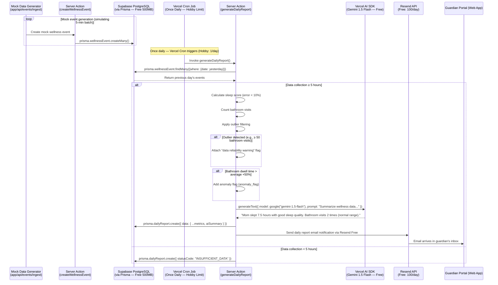

#### 3.4.2 Zero False Alarm AI Validator Execution Sequence ⟨Wave 2 — Edge/HW Scope⟩

> **⚠️ Wave 2 — Edge/HW Scope.** This sequence describes Edge AI validator logic. Not part of vibe-coding MVP Core.

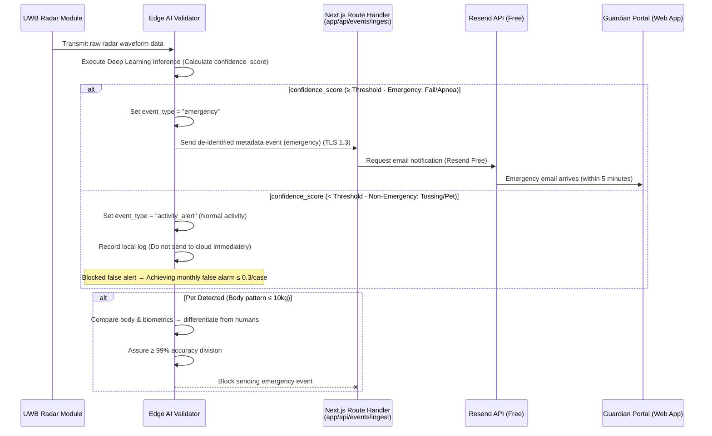

#### 3.4.3 PMF Diagnostic Sequence (Tracking User Experience Metrics) ⟨MVP Core⟩

Tracking the North Star metric (Monthly perceived false alarms ≤ 2 times) and secondary KPI (View report ≥ 5 times/week).

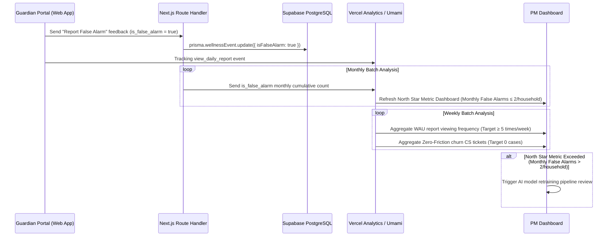

#### 3.4.4 EMR System Synchronization Sequence ⟨Wave 2 — EMR Partnership Required⟩

> **⚠️ Wave 2 — EMR Partnership Required.** EMR Webhook integration deferred pending vendor partnership (DEP-01). Not part of MVP Core.

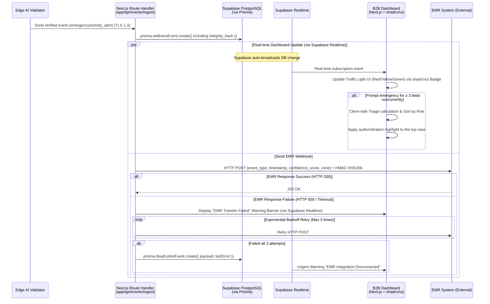

### 3.5 Use Case Diagram

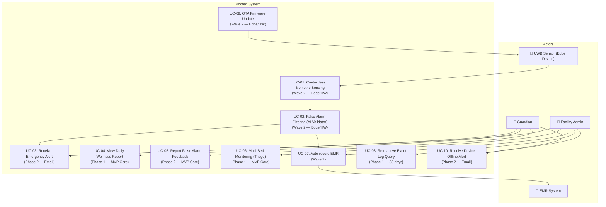

### 3.6 Entity-Relationship Diagram (ERD) — Prisma Schema-based (5 Models)

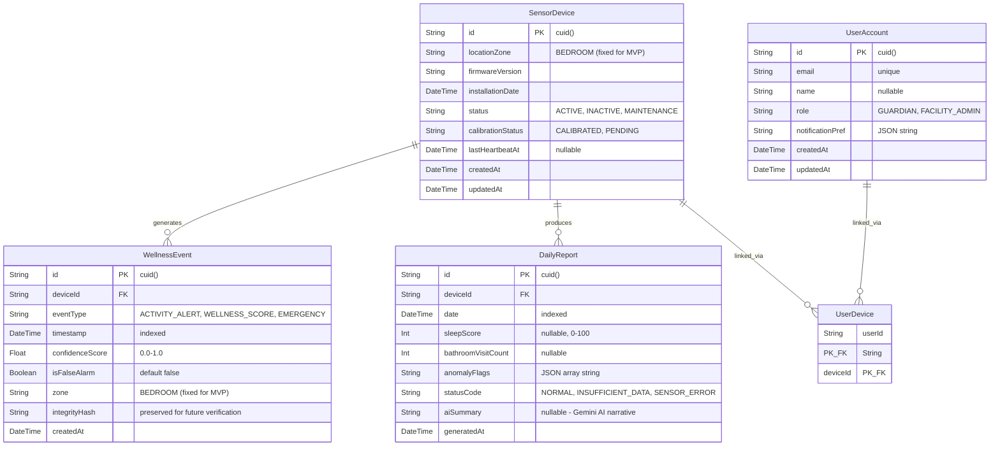

> **Key Changes from v2.0:**
> - **Facility model removed** — B2B facility management deferred to Wave 2. Facility info is hardcoded or set via environment variable in MVP.
> - **DeadLetterEvent model removed** — EMR Webhook deferred to Wave 2. Failed event management table unnecessary.
> - `facilityId` FK removed from SensorDevice and UserAccount.
> - `locationZone` fixed to "BEDROOM" for MVP simplicity.
> - `integrityHash` field preserved but chain verification logic deferred to Wave 2.
> - 7 models → **5 models** (SensorDevice, WellnessEvent, UserAccount, UserDevice, DailyReport).

### 3.7 Class Diagram

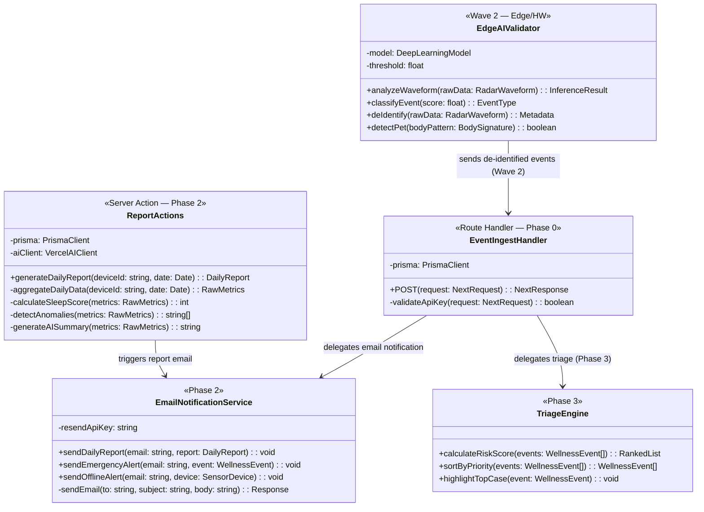

> **Key Changes from v2.0:**
> - `EMRWebhookHandler` **removed** — EMR HMAC deferred to Wave 2.
> - `OTAService` **removed** — Edge/FW scope, Wave 2.
> - `HeartbeatCronJob` **removed** — Cron limited to 1/day on Hobby plan. Heartbeat uses device→server push via Route Handler.
> - `PushNotificationService` → **`EmailNotificationService`** — FCM/Web Push replaced with Resend API (Free).
> - `TriageEngine` — Maintained but tagged as Phase 3. MVP Core uses simple sorting.

### 3.8 Component Diagram

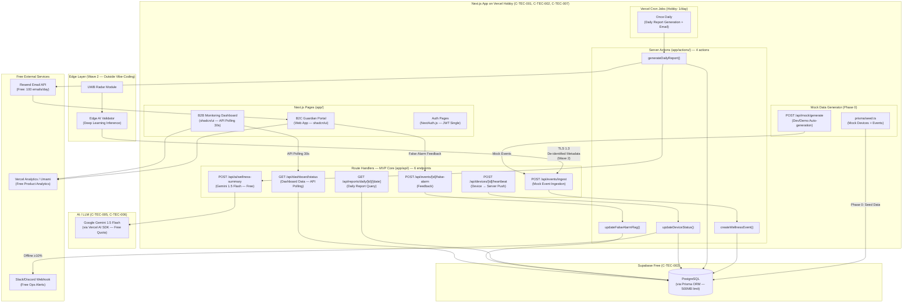

> **Key Changes from v2.0:**
> - **Removed:** PagerDuty, FCM, Web Push API, EMR System connection, Cold Archival (Supabase Storage), Supabase Realtime (Phase 2)
> - **Added:** Resend (Email API), Slack/Discord Webhook, Mock Data Generator, Vercel Analytics/Umami
> - **Modified:** 11 Route Handlers → 6, Cron Jobs 4 → 1 (Hobby limit), Supabase Realtime → API Polling (MVP Core)

---

## 4. Specific Requirements

### 4.1 Functional Requirements

> **Legend:** The Source column refers to the PRD Story/FR number. Priority follows the MoSCoW criterion. ACs are written in Given/When/Then format. **Phase tags indicate when to implement.**

---

#### FR-01: Zero False Alarm AI Filtering Engine (Must — Edge/HW, ⟨Wave 2 — Professional Developer Required⟩)

> **⚠️ Wave 2 — Edge/HW scope. Outside vibe-coding.** Professional developer required.

| ID | Requirement Statement | Source | Acceptance Criteria | Priority | Phase |
| :--- | :--- | :--- | :--- | :--- | :--- |
| REQ-FUNC-001 | Edge AI Validator analyzes UWB radar waveforms via deep learning and classifies events as `emergency` or `activity_alert`. | Story 1, FR-01 | **Given** sensor is working normally **When** radar waveform is inputted **Then** the AI model calculates `confidence_score` (0-1) and decides the event type based on the threshold. | **Must** | **Wave 2** |
| REQ-FUNC-002 | The system strictly separates non-urgent activities like tossing and sitting as `activity_alert`, blocking immediate alerts. | Story 1 (AC-1.1), FR-01 | **Given** sensor is working normally **When** the elderly person tosses a blanket **Then** no false alarm occurs. Monthly false alarm rate ≤ 0.3/household. | **Must** | **Wave 2** |
| REQ-FUNC-003 | The system shall isolate the movement of pets (≤ 10kg) and differentiate from human patterns, ensuring no alarms are erroneously sent. | Story 1 (AC-1.4), FR-01 | **Given** pets are traversing the sensor area **When** movements are detected **Then** system accurately isolates pet signals with ≥ 99% accuracy and suppresses the alert. | **Must** | **Wave 2** |
| REQ-FUNC-004 | In real fall detections (feeble movement patterns continuously over 5 mins), send alerts to guardians. | Story 1 (AC-1.3), FR-01 | **Given** an actual fall happens with signs of weak movement **When** Validator marks `confidence_score` ≥ Threshold **Then** guardian receives **email notification** within 5 minutes via Resend Free. (**Wave 2: FCM/Web Push under 60 seconds.**) | **Must** | **Phase 2 (Email) / Wave 2 (Push)** |
| REQ-FUNC-005 | The user app allows submitting "False Alarm" flags, and the database automatically marks the occurrence. | Story 1, §1.3 | **Given** guardian gets an alert **When** taps "Report False Alarm" in web portal **Then** Server Action `updateFalseAlarmFlag` sets `isFalseAlarm` = `true` via Prisma for batch metrics. | **Must** | **Phase 2** |

---

#### FR-02: Zero-Friction Contactless Sensor Module (Must — Edge/HW, ⟨Wave 2 — Professional Developer Required⟩)

> **⚠️ Wave 2 — Edge/HW scope. Outside vibe-coding.** Professional developer required.

| ID | Requirement Statement | Source | Acceptance Criteria | Priority | Phase |
| :--- | :--- | :--- | :--- | :--- | :--- |
| REQ-FUNC-006 | Mounted correctly on wall/ceilings, the sensor must demand exactly 0 user manipulations once deployed. | Story 1 (AC-1.2), FR-02 | **Given** setup completes **When** everyday usage initiates **Then** elderly engagement frequency strictly equates to 0 (No charging/wearing/buttons). | **Must** | **Wave 2** |
| REQ-FUNC-007 | Perform automated calibrations immediately following fresh installations to map boundaries efficiently. | FR-02, NFR-11 | **Given** new placement operates **When** initialized **Then** calibration passes completely and logs as `calibrated` via heartbeat Route Handler. | **Must** | **Wave 2** |
| REQ-FUNC-008 | Drop of power / missing heartbeats beyond 15 minutes triggers a 1-time offline notification. | Story 1 (AC-1.5), FR-02 | **Given** a device severs WiFi or power **When** heartbeat Route Handler detects continuous heartbeats fail > 15 minutes (3 consecutive misses) **Then** **email notification sent to guardians via Resend Free. Dashboard status updated to INACTIVE.** | **Must** | **Phase 2 (Email)** |

---

#### FR-03: Privacy-Preserving Non-Video Tracking (Must — Edge/HW, ⟨Wave 2 — Professional Developer Required⟩)

> **⚠️ Wave 2 — Edge/HW scope. Outside vibe-coding.** Professional developer required.

| ID | Requirement Statement | Source | Acceptance Criteria | Priority | Phase |
| :--- | :--- | :--- | :--- | :--- | :--- |
| REQ-FUNC-009 | Keep track of indoor paths using non-video sensors, registering dwell times and boundaries strictly ignoring camera solutions. | FR-03, §1.4 KSF #2 | **Given** sensor functions actively **When** users traverse between zones **Then** paths record sans explicit video storage guaranteeing 100% privacy compliance. | **Must** | **Wave 2** |
| REQ-FUNC-010 | The Edge device MUST manipulate raw radar arrays into numerical statistics inside its local CPU before shipping to Cloud. Direct uploading is prohibited. | FR-03, CON-02 | **Given** waveforms arrive **When** trying to move data to Next.js server **Then** only fully de-identified digits are permitted through. No PII fields exist in Prisma schema. | **Must** | **Wave 2** |

---

#### FR-04: B2B Multi-bed Dashboard (Must — Dashboard Only, ⟨Phase 1 — MVP Core⟩) + EMR Webhook (⟨Wave 2⟩)

| ID | Requirement Statement | Source | Acceptance Criteria | Priority | Phase |
| :--- | :--- | :--- | :--- | :--- | :--- |
| REQ-FUNC-011 | Implement color-coded nodes for individual patient beds via B2B dashboards displaying synchronous status markers. | Story 3, FR-04 | **Given** dashboard active **When** receiving status from **periodic API polling (30s interval)** **Then** UI transitions matching node colors using shadcn/ui Badge components. (**Phase 2: Supabase Realtime subscription.**) | **Must** | **Phase 1** |
| REQ-FUNC-012 | If ≥ 3 simultaneous emergencies arrive, activate Triage module prioritizing dangerous elements first adding auditory signals to the top element. | Story 3 (AC-3.5), FR-04 | **Given** simultaneous alerts occur **When** evaluating arrays > 3 items **Then** client-side Triage calculation sorts by risk; highest ranked object gets primary sound/visual cues. | **Must** | **Phase 3** |
| REQ-FUNC-013 | ~~With EMR Webhooks functional, event meta-data gets routed seamlessly dropping double manual entry down to 0.~~ | Story 3 (AC-3.2), FR-04 | **Wave 2 — EMR vendor partnership (DEP-01) unsigned. HMAC-SHA256 security requires professional developer.** | ~~Must~~ **Could** | **Wave 2** |
| REQ-FUNC-014 | ~~Handle offline EMR states or 500 errors gracefully with 3 back-off retries and visible front-end notices.~~ | Story 3 (AC-3.4), FR-04 | **Wave 2 — DeadLetterEvent model removed. EMR retry logic deferred.** | ~~Must~~ **Could** | **Wave 2** |
| REQ-FUNC-015 | Maintain searchable event logs with proof of integrity. | Story 3 (AC-3.3), FR-04 | **Given** a manager initiates backward searching **When** a date scope applies **Then** accurate log returns from Supabase PostgreSQL (**hot, 30 days**). Events older than **30 days** are **automatically deleted** via daily cleanup query. integrityHash field is preserved for future verification. (**Wave 2: 90-day hot + Cold Archival.**) | **Must** | **Phase 1 (30-day) / Wave 2 (90-day+)** |

---

#### FR-05: B2C Daily Wellness Notification Pipeline (⬆️ Must — MVP Killer Feature, ⟨Phase 2 — MVP Core⟩)

> **Priority upgraded from Should → Must.** This is the optimal domain for vibe-coding and the MVP killer feature.

| ID | Requirement Statement | Source | Acceptance Criteria | Priority | Phase |
| :--- | :--- | :--- | :--- | :--- | :--- |
| REQ-FUNC-016 | Consolidate and summarize previous 24hr analytics executing precision sleeping and bathroom habits below a 10% discrepancy limit. **Include Gemini AI natural language summary.** | Story 2 (AC-2.1), FR-05 | **Given** constant operations **When** Vercel Cron triggers once daily **Then** Server Action `generateDailyReport` produces report with metrics + `aiSummary` via **Gemini 1.5 Flash** (e.g., "Mom slept well for 7.5 hours last night"). Error rate < 10%. | **Must** ⬆️ | **Phase 2** |
| REQ-FUNC-017 | Push special daily alerts immediately if an individual's bathroom length metric breaches 50% above customary trends. | Story 2 (AC-2.2), FR-05 | **Given** normal patterns observed beforehand **When** current duration stretches > +50% expected threshold **Then** anomaly flag is set, and **AI anomaly explanation** is generated via Gemini (e.g., "Bathroom dwell time is 50% longer than usual. Recommend checking."). | **Must** ⬆️ | **Phase 2** |
| REQ-FUNC-018 | Emit status notice "Missing Stay Metrics" failing < 5 hours threshold mapping for residents vacationing or hospitalized. | Story 2 (AC-2.4), FR-05 | **Given** subjects leave for extended visits **When** Vercel Cron triggers report generation **Then** DailyReport created with `statusCode: "INSUFFICIENT_DATA"` instead of blank outputs. | **Must** ⬆️ | **Phase 2** |
| REQ-FUNC-019 | Attach 'unreliable data' warning elements preventing anxiety if mechanical bugs force outlier results (ex. > 50 door checks). | Story 2 (AC-2.5), FR-05 | **Given** impossible counts trigger (50x door triggers) **When** sorting values **Then** system sets `anomalyFlags` and displays warning via shadcn/ui Alert component: "Sensor Service Requires Inspection". | **Must** ⬆️ | **Phase 2** |
| REQ-FUNC-020 | Deliver formatted reports to guardian devices via scheduled mechanism. | FR-05, §2.2.3 | **Given** full daily generation **When** Vercel Cron triggers once daily **Then** report is generated and stored. **Email notification sent via Resend Free** (100 emails/day). Guardian views report in web portal. | **Must** ⬆️ | **Phase 2** |

---

#### FR-06: Sleep Tracking Charts (Could, ⟨Phase 3⟩)

| ID | Requirement Statement | Source | Acceptance Criteria | Priority | Phase |
| :--- | :--- | :--- | :--- | :--- | :--- |
| REQ-FUNC-021 | Chart temporal sleep patterns leveraging accumulated points producing week/month timelines within the Guardian Portal tab. | FR-06, §1.7 CJM P5 | **Given** > 7 reports exist securely **When** the person browses the trend interface **Then** Recharts renders graph arrays within Next.js page showing variations predictably. | **Could** | **Phase 3** |

---

#### FR-07: Fallback Message Providers — SMS/Kakao (⬇️ Won't MVP, ⟨Wave 2⟩)

> **Priority downgraded from Should → Won't (MVP).** Paid service. Violates fully free infrastructure constraint. **Replaced by Email (Resend Free) in MVP.**

| ID | Requirement Statement | Source | Acceptance Criteria | Priority | Phase |
| :--- | :--- | :--- | :--- | :--- | :--- |
| REQ-FUNC-022 | ~~Broadcast backup texts or Kakao alerts parallel to Web Push/FCM notifications accommodating network limits whenever set active.~~ | FR-07, §2.2.3 | **Won't (MVP). Wave 2.** SMS ₩20-50/msg, KakaoTalk ₩7-15/msg. 500 devices × 30 days = ₩300K-750K/month. Completely violates $0 infrastructure constraint. MVP uses Resend Free email only. | **Won't** ⬇️ | **Wave 2** |

---

#### FR-08: Configurable Dashboards (Could, ⟨Phase 3⟩)

| ID | Requirement Statement | Source | Acceptance Criteria | Priority | Phase |
| :--- | :--- | :--- | :--- | :--- | :--- |
| REQ-FUNC-023 | Afford administrators filtering options grouping displays using custom rulesets depending on assigned wards or priority. | FR-08, §3.1 Ext. Function 4 | **Given** staff members engage with UI **When** specific room tags or condition layers apply **Then** shadcn/ui DataTable with filter components limits display. (**Unnecessary for <50 devices.**) | **Could** | **Phase 3** |

---

### 4.2 Non-Functional Requirements

#### 4.2.1 Performance

| ID | Requirement Statement | Metric / Threshold | Monitoring | Phase | PRD Source |
| :--- | :--- | :--- | :--- | :--- | :--- |
| REQ-NF-001 | End-to-end latency for report/dashboard query response. | **p95 ≤ 5,000ms** (Serverless cold start allowed). "Report/dashboard query, not real-time emergency alert." (**Wave 2: p95 ≤ 2,000ms with Edge Runtime.**) | Vercel Analytics (Hobby included). | **Phase 1** | NFR-01, CTR-02 |
| REQ-NF-002 | Accuracy metrics proving False Alarm mitigation algorithm success | **≤ 0.3 events/month/home** (**Edge AI scope — unchanged**) | Weekend batches reading `isFalseAlarm` via Prisma aggregation queries. | **Wave 2** | NFR-02 |
| REQ-NF-003 | Deviation metrics against physical actuals regarding bathroom usage or sleep points | **Error value < 10%** | Manual comparison routines against beta testers ground-truth data points. | **Phase 2** | NFR-03 |
| REQ-NF-004 | Stress-test boundaries checking transaction responses and connection hold limits | **p95 ≤ 1,000ms at 50 active nodes.** "Supabase Free DB basis." (**Wave 2: p95 ≤ 500ms at 1,000 active nodes.**) | Manual stress test protocols. | **Phase 1** | NFR-14, CTR-09 |

#### 4.2.2 Availability / Reliability

| ID | Requirement Statement | Metric / Threshold | Monitoring | Phase | PRD Source |
| :--- | :--- | :--- | :--- | :--- | :--- |
| REQ-NF-005 | Application availability target for free tier infrastructure. | **Best Effort, target ~99%.** "Free tier basis. No SLA guarantee. Supabase Free 7-day pause risk exists." Mitigate via daily ping (GitHub Actions or UptimeRobot Free). (**Wave 2: SLA ≥ 99.9% with Pro plans.**) | UptimeRobot Free (5-min synthetic checks). | **Phase 0** | NFR-04, CTR-01 |
| REQ-NF-006 | Max error bounds mapping packet drop elements between nodes over internet tunnels. | **≤ 0.1% loss limits** | Aggregation summaries verifying Edge proxy routing arrays via Vercel edge network. | **Wave 2** | NFR-05 |
| REQ-NF-007 | High priority alerting for large systemic dropouts (≥10% offline devices). | **Slack/Discord Incoming Webhook (free).** Condition: offline device ratio ≥ 10%. (**PagerDuty removed — paid service $21/user/month.**) (**Wave 2: PagerDuty Sev1 escalation.**) | Heartbeat Route Handler + manual batch check. | **Phase 2** | NFR-13, CTR-03 |

#### 4.2.3 Security

| ID | Requirement Statement | Metric / Threshold | Monitoring | Phase | PRD Source |
| :--- | :--- | :--- | :--- | :--- | :--- |
| REQ-NF-008 | Force strict security layers across network protocols using updated ciphers. | 100% adherence to TLS 1.3 standards. **Vercel enforces TLS 1.3 by default (including Hobby).** | Yearly 3rd party penetration checking / Monthly auditing. | **Phase 0** | NFR-06 |
| REQ-NF-009 | Execute pure compliance matching privacy clauses ensuring personal markers completely evade capture. | 0 identifiable markers. No PII fields in Prisma schema. | Quarterly internal DB examination via Prisma query scan. | **Phase 0** | NFR-07 |
| REQ-NF-010 | ~~Anchor endpoint EMR push capabilities restricting access exclusively resolving keys and custom hashes.~~ | ~~API Key + HMAC-SHA256~~ **Wave 2 — EMR deferred.** | ~~Daily log monitoring~~ | **Wave 2** | §6.2 |
| REQ-NF-011 | Implement JWT verification for authentication. | **JWT single authentication via NextAuth.js.** Role field stored in DB but middleware enforcement deferred to Phase 2. "MVP Core: demo credentials." (**Wave 2: Full RBAC middleware enforcement.**) | Quarterly security review. | **Phase 1 (JWT) / Phase 2 (RBAC)** | §6.2, CTR-03 |

#### 4.2.4 Cost

| ID | Requirement Statement | Metric / Threshold | Monitoring | Phase | PRD Source |
| :--- | :--- | :--- | :--- | :--- | :--- |
| REQ-NF-012 | Limit operational costs to fully free infrastructure. | **$0/Unit/Month (Free Tier operation).** "Free Tier constraints: <50 devices. Restore ≤500 KRW target upon paid transition." (**Wave 2: ≤ 500 KRW/Unit/Month with Pro plans.**) | Vercel + Supabase billing dashboards (both $0 on free tier). | **Phase 0** | NFR-08, CTR-04 |

#### 4.2.5 Operations / Monitoring

| ID | Requirement Statement | Metric / Threshold | Monitoring | Phase | PRD Source |
| :--- | :--- | :--- | :--- | :--- | :--- |
| REQ-NF-013 | ~~Ensure seamless OTA firmware pushing.~~ | ~~Deploy Success Rates ≥ 99%~~ **Wave 2 — Edge/FW scope. Outside vibe-coding.** | ~~OTA system hooks~~ | **Wave 2** | NFR-09 |
| REQ-NF-014 | Keep exact tabs over PMF North Star markers. | **≤ 2 complaints / house / month.** | Prisma aggregation of `isFalseAlarm` flags + Vercel Analytics/Umami feedback loops. | **Phase 2** | §1.3 |
| REQ-NF-015 | Retain weekly viewing frequency values. | WAU limits **≥ 5 report hits per week**. | Vercel Analytics / Umami `view_daily_report` tracker. | **Phase 3** | §1.3 |
| REQ-NF-016 | Prove friction elimination logic ensuring seniors exhibit absolute passivity. | Churn via explicit "Too uncomfortable" parameters at exactly **0**. | Reading tagged CRM markers dynamically. | **Wave 2** | §1.3 |

#### 4.2.6 Data Retention

| ID | Requirement Statement | Metric / Threshold | Monitoring | Phase | PRD Source |
| :--- | :--- | :--- | :--- | :--- | :--- |
| REQ-NF-017 | Maintain event data within Supabase Free DB limits. | **Hot: 30 Days. Automatic deletion.** "Supabase Free 500MB constraint. Events older than 30 days auto-deleted via daily cleanup query. integrityHash preserved during retention period." (**Wave 2: Hot 90 days + Cold Archival >3 years with Supabase Storage.**) | Daily cleanup query execution monitoring. | **Phase 1** | NFR-10, CTR-10 |

#### 4.2.7 Scalability / Maintainability

| ID | Requirement Statement | Metric / Threshold | Monitoring | Phase | PRD Source |
| :--- | :--- | :--- | :--- | :--- | :--- |
| REQ-NF-018 | Define MVP device capacity limits. | **<50 devices (Vercel Hobby + Supabase Free).** "Free Tier Beta/Demo basis." (**Wave 2: <500 devices with Pro plans. Re-evaluate at 5K.**) | Routine monitoring. | **Phase 0** | NFR-14, CTR-09 |
| REQ-NF-019 | Establish absolute hard rules isolating variable syntax prohibiting regulatory keywords entirely. | Linter catches ruleset breaking structures preventing merging exactly 100%. | GitHub Actions CI checks tracking exact words. | **Phase 0** | NFR-12 |
| REQ-NF-020 | Support engineering staff applying positioning with precise internal software. | Install matching angles executing ≥ 95% accurately | PWA-based installer guide as interim. | **Wave 2** | NFR-11 |

---

## 5. Traceability Matrix

| PRD Source (Story / FR / NFR) | Requirement ID | Requirement Type | Phase | Test Method | Test Case Summary |
| :--- | :--- | :--- | :--- | :--- | :--- |
| Story 1, FR-01 | REQ-FUNC-001 | Functional | **Wave 2** | Edge Device Test | Inject various radar waveforms and verify Edge AI Validator classifies events correctly. |
| Story 1 (AC-1.1), FR-01 | REQ-FUNC-002 | Functional | **Wave 2** | Edge Device Test | Verify absent flags when injecting blanket movement. Track 30d values ≤ 0.3. |
| Story 1 (AC-1.4), FR-01 | REQ-FUNC-003 | Functional | **Wave 2** | Edge Device Test | Simulate ≤ 10kg objects; verify ≥ 99% accuracy. |
| Story 1 (AC-1.3), FR-01 | REQ-FUNC-004 | Functional | **Phase 2 / Wave 2** | Manual Test + Email Check | Verify guardian receives email within 5 min (Phase 2) / push under 60s (Wave 2). |
| Story 1, §1.3 | REQ-FUNC-005 | Functional | **Phase 2** | Manual UI Test | Run mock alert feedback via web portal; verify `isFalseAlarm` marking via Server Action. |
| Story 1 (AC-1.2), FR-02 | REQ-FUNC-006 | Functional | **Wave 2** | Field Test | Note device operational parameters: friction limits at exactly nil. |
| FR-02, NFR-11 | REQ-FUNC-007 | Functional | **Wave 2** | Field Test | Deploy a new sensor; verify calibration logged as `calibrated`. |
| Story 1 (AC-1.5), FR-02 | REQ-FUNC-008 | Functional | **Phase 2** | Manual Test | Verify >15 min heartbeat loss triggers email notification + INACTIVE status. |
| FR-03, §1.4 KSF #2 | REQ-FUNC-009 | Functional | **Wave 2** | Edge Device Test | Verify indoor path tracking with 100% privacy compliance. |
| FR-03, CON-02 | REQ-FUNC-010 | Functional | **Wave 2** | Code Review | Confirm 0 PII fields in Prisma schema; no raw data reaches server. |
| Story 3, FR-04 | REQ-FUNC-011 | Functional | **Phase 1** | Manual UI Test | Verify dashboard displays color-coded nodes; updates via **API polling (30s)**. |
| Story 3 (AC-3.5), FR-04 | REQ-FUNC-012 | Functional | **Phase 3** | Manual Test | Send >3 concurrent events; verify Triage sorts by risk with audio cues. |
| Story 3 (AC-3.2), FR-04 | REQ-FUNC-013 | Functional | **Wave 2** | Integration Test | Confirm EMR Route Handler sends HTTP POST with HMAC-SHA256. |
| Story 3 (AC-3.4), FR-04 | REQ-FUNC-014 | Functional | **Wave 2** | Integration Test | Simulate EMR failure; verify retry + DeadLetterEvent creation. |
| Story 3 (AC-3.3), FR-04 | REQ-FUNC-015 | Functional | **Phase 1** | Manual Test | Query events within 30-day window; verify auto-deletion of >30 day records. |
| Story 2 (AC-2.1), FR-05 | REQ-FUNC-016 | Functional | **Phase 2** | Manual Test + AI Review | Verify Cron + Server Action produces report with <10% error + Gemini AI summary. |
| Story 2 (AC-2.2), FR-05 | REQ-FUNC-017 | Functional | **Phase 2** | Manual Test | Inject +50% bathroom anomaly; verify anomaly flag + AI explanation. |
| Story 2 (AC-2.4), FR-05 | REQ-FUNC-018 | Functional | **Phase 2** | Manual Test | Verify <5 hour data yields `INSUFFICIENT_DATA` status. |
| Story 2 (AC-2.5), FR-05 | REQ-FUNC-019 | Functional | **Phase 2** | Manual Test | Trigger >50 door events; verify `anomalyFlags` set + warning displayed. |
| FR-05, §2.2.3 | REQ-FUNC-020 | Functional | **Phase 2** | Manual Test + Email Check | Verify Cron triggers once daily; confirm email sent via Resend Free. |
| FR-06 | REQ-FUNC-021 | Functional | **Phase 3** | Manual UI Test | Render Recharts chart mapping data points onto visual timelines. |
| FR-07 | REQ-FUNC-022 | Functional | **Wave 2** | N/A (Won't MVP) | Won't MVP. SMS/KakaoTalk paid service excluded. |
| FR-08 | REQ-FUNC-023 | Functional | **Phase 3** | Manual UI Test | Apply dashboard filters; verify DataTable updates. |
| NFR-01 | REQ-NF-001 | Non-Functional | **Phase 1** | Manual Load Test | Verify p95 E2E latency ≤ 5,000ms (cold start allowed). |
| NFR-02 | REQ-NF-002 | Non-Functional | **Wave 2** | Edge AI Test | Query monthly `isFalseAlarm` counts; verify ≤ 0.3/household. |
| NFR-03 | REQ-NF-003 | Non-Functional | **Phase 2** | Manual Test | Compare reports against ground-truth; verify error rate < 10%. |
| NFR-14 | REQ-NF-004 | Non-Functional | **Phase 1** | Manual Load Test | Test with 50 concurrent devices; verify p95 ≤ 1,000ms. |
| NFR-04 | REQ-NF-005 | Non-Functional | **Phase 0** | UptimeRobot | Verify Best Effort ~99% via UptimeRobot Free synthetic monitoring. |
| NFR-05 | REQ-NF-006 | Non-Functional | **Wave 2** | Network Test | Measure packet loss; confirm ≤ 0.1% loss. |
| NFR-13 | REQ-NF-007 | Non-Functional | **Phase 2** | Manual Test | Simulate ≥10% offline; verify Slack/Discord Webhook fires. |
| NFR-06 | REQ-NF-008 | Non-Functional | **Phase 0** | Certificate Check | Confirm Vercel enforces TLS 1.3 by default. |
| NFR-07 | REQ-NF-009 | Non-Functional | **Phase 0** | Code Review | Verify 0 PII fields in Prisma schema. |
| §6.2 | REQ-NF-010 | Non-Functional | **Wave 2** | Integration Test | Verify EMR API Key + HMAC-SHA256 authentication. |
| §6.2 | REQ-NF-011 | Non-Functional | **Phase 1 / Phase 2** | Manual Test | Test NextAuth.js JWT (Phase 1); RBAC middleware (Phase 2). |
| NFR-08 | REQ-NF-012 | Non-Functional | **Phase 0** | Billing Check | Verify $0 unit cost on free tier dashboards. |
| NFR-09 | REQ-NF-013 | Non-Functional | **Wave 2** | Edge Test | Verify OTA firmware deploy success rate ≥ 99%. |
| §1.3 | REQ-NF-014 | Non-Functional | **Phase 2** | Prisma Query | Verify ≤ 2 false alarm complaints per household/month. |
| §1.3 | REQ-NF-015 | Non-Functional | **Phase 3** | Analytics | Verify WAU ≥ 5 times/week via Vercel Analytics/Umami. |
| §1.3 | REQ-NF-016 | Non-Functional | **Wave 2** | CRM Review | Verify 0 "Too uncomfortable" churn signals. |
| NFR-10 | REQ-NF-017 | Non-Functional | **Phase 1** | DB Query | Verify 30-day auto-deletion; confirm no >30-day records remain. |
| NFR-14 | REQ-NF-018 | Non-Functional | **Phase 0** | Manual Test | Verify <50 device operation on free tier without degradation. |
| NFR-12 | REQ-NF-019 | Non-Functional | **Phase 0** | CI Check | Verify linter catches regulatory-trigger words. |
| NFR-11 | REQ-NF-020 | Non-Functional | **Wave 2** | Field Test | Verify installation calibration guidance ≥ 95%. |

---

## 6. Appendix

### 6.1 API Endpoint List — Next.js Route Handlers

#### MVP Core (6 Endpoints)

| # | Route | Method | Description | Auth | Phase | PRD Source |
| :--- | :--- | :--- | :--- | :--- | :--- | :--- |
| 1 | `app/api/events/ingest/route.ts` | POST | Mock event ingestion (Edge simulator replacement). | API Key (env) | **Phase 0** | §3.1 Feature 3 |
| 2 | `app/api/reports/daily/[deviceId]/[date]/route.ts` | GET | Query daily report with AI summary. | JWT (NextAuth) | **Phase 1** | FR-05 |
| 3 | `app/api/events/[eventId]/false-alarm/route.ts` | POST | False alarm feedback. | JWT (NextAuth) | **Phase 2** | §1.3 |
| 4 | `app/api/ai/wellness-summary/route.ts` | POST | Gemini 1.5 Flash AI wellness narrative. | JWT (NextAuth) | **Phase 2** | C-TEC-005 |
| 5 | `app/api/dashboard/status/route.ts` | GET | Multi-bed traffic light status (API polling). | JWT (NextAuth) | **Phase 1** | FR-04 |
| 6 | `app/api/devices/[deviceId]/heartbeat/route.ts` | POST | Device heartbeat (device→server push). | API Key (env) | **Phase 1** | FR-02 |

#### Phase 2/3 (3 Endpoints)

| # | Route | Method | Description | Auth | Phase |
| :--- | :--- | :--- | :--- | :--- | :--- |
| 7 | `app/api/reports/trend/[deviceId]/route.ts` | GET | Trend data for charts. | JWT | **Phase 2** |
| 8 | `app/api/notifications/push/route.ts` | POST | Web Push (PWA conversion). | Internal | **Phase 3** |
| 9 | `app/api/dashboard/filters/route.ts` | PATCH | Dashboard filter configs. | JWT (Admin) | **Phase 3** |

#### Wave 2 (2 Endpoints)

| # | Route | Method | Description | Auth | Phase |
| :--- | :--- | :--- | :--- | :--- | :--- |
| 10 | `app/api/webhooks/emr/route.ts` | POST | EMR Webhook + HMAC-SHA256. | API Key + HMAC | **Wave 2** |
| 11 | `app/api/events/archive/route.ts` | GET | 90-day archive + RBAC. | JWT + RBAC | **Wave 2** |

### 6.2 Entity & Data Model — Prisma Schema (5 Models)

#### 6.2.1 SensorDevice

| Field | Type (Prisma) | Constraint | Description |
| :--- | :--- | :--- | :--- |
| `id` | String | `@id @default(cuid())` | Unique Device Identifier |
| `locationZone` | String | NOT NULL, `@default("BEDROOM")` | Fixed to BEDROOM for MVP |
| `firmwareVersion` | String | NOT NULL | Current active firmware version |
| `installationDate` | DateTime | NOT NULL | Deployment timestamp |
| `status` | String | NOT NULL, `@default("ACTIVE")` | Device state: `ACTIVE`, `INACTIVE`, `MAINTENANCE` |
| `calibrationStatus` | String | NOT NULL, `@default("PENDING")` | Calibration state: `CALIBRATED`, `PENDING` |
| `lastHeartbeatAt` | DateTime? | NULLABLE | Timestamp of most recent heartbeat signal |
| `createdAt` | DateTime | `@default(now())` | Record creation timestamp |
| `updatedAt` | DateTime | `@updatedAt` | Auto-updated timestamp |

> `facilityId` FK removed — Facility model deferred to Wave 2.

#### 6.2.2 WellnessEvent

| Field | Type (Prisma) | Constraint | Description |
| :--- | :--- | :--- | :--- |
| `id` | String | `@id @default(cuid())` | Unique event record identifier |
| `deviceId` | String | FK → SensorDevice, NOT NULL | Originating device reference |
| `eventType` | String | NOT NULL | Type: `ACTIVITY_ALERT`, `WELLNESS_SCORE`, `EMERGENCY` |
| `timestamp` | DateTime | NOT NULL, `@@index` | Event timing (indexed for query performance) |
| `confidenceScore` | Float | NOT NULL, 0.0–1.0 | AI model confidence metric |
| `isFalseAlarm` | Boolean | NOT NULL, `@default(false)` | Human-verified reversal flag (updated via Server Action) |
| `zone` | String | NOT NULL, `@default("BEDROOM")` | Fixed to BEDROOM for MVP |
| `integrityHash` | String | NOT NULL | SHA-256 hash preserved for future verification (chain verification deferred to Wave 2) |
| `createdAt` | DateTime | `@default(now())` | Record creation timestamp |

#### 6.2.3 UserAccount

| Field | Type (Prisma) | Constraint | Description |
| :--- | :--- | :--- | :--- |
| `id` | String | `@id @default(cuid())` | User identity |
| `email` | String | `@unique` | Login email address |
| `name` | String? | NULLABLE | Display name |
| `role` | String | NOT NULL | Role: `GUARDIAN`, `FACILITY_ADMIN` (stored but RBAC enforcement deferred to Phase 2) |
| `notificationPref` | String | `@default("{\"push\": true}")` | JSON string for notification preferences |
| `createdAt` | DateTime | `@default(now())` | Record creation timestamp |
| `updatedAt` | DateTime | `@updatedAt` | Auto-updated timestamp |

> `facilityId` FK removed — Facility model deferred to Wave 2.

#### 6.2.4 UserDevice (Join Table)

| Field | Type (Prisma) | Constraint | Description |
| :--- | :--- | :--- | :--- |
| `userId` | String | `@@id([userId, deviceId])`, FK → UserAccount | User reference |
| `deviceId` | String | `@@id([userId, deviceId])`, FK → SensorDevice | Device reference |

#### 6.2.5 DailyReport

| Field | Type (Prisma) | Constraint | Description |
| :--- | :--- | :--- | :--- |
| `id` | String | `@id @default(cuid())` | Unique report identifier |
| `deviceId` | String | FK → SensorDevice, NOT NULL | Related device |
| `date` | DateTime | NOT NULL, `@@index` | Report date (indexed) |
| `sleepScore` | Int? | NULLABLE, 0–100 | Sleep quality score or null if metrics insufficient |
| `bathroomVisitCount` | Int? | NULLABLE | Bathroom visit count |
| `anomalyFlags` | String | `@default("[]")` | JSON array as string: anomaly tags |
| `statusCode` | String | NOT NULL, `@default("NORMAL")` | Status: `NORMAL`, `INSUFFICIENT_DATA`, `SENSOR_ERROR` |
| `aiSummary` | String? | NULLABLE | Gemini 1.5 Flash AI-generated wellness narrative |
| `generatedAt` | DateTime | NOT NULL | Report generation timestamp |

> **Removed Models from v2.0:**
> - **Facility** — B2B facility management is Wave 2. Facility info via env var or hardcoding in MVP.
> - **DeadLetterEvent** — EMR Webhook deferred to Wave 2. Failed event table unnecessary.

### 6.3 Detailed Interaction Models

#### 6.3.1 Detailed Sequence — Fall Detection → Email Alert E2E Flow ⟨Phase 2 (Email) / Wave 2 (Full)⟩

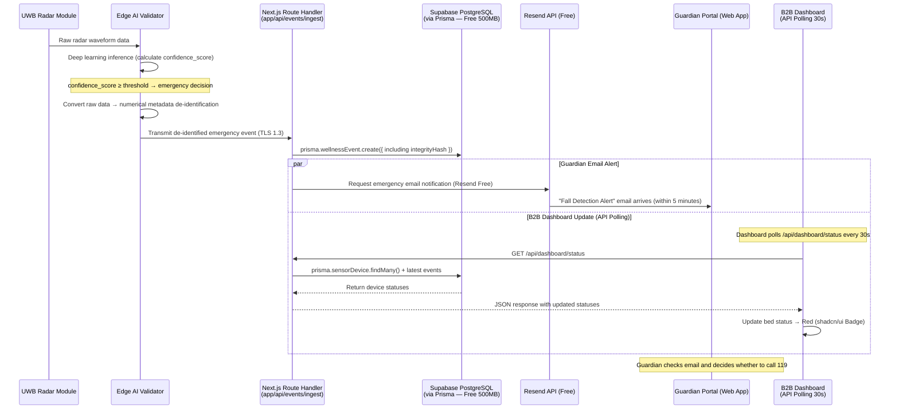

#### 6.3.2 Detailed Sequence — Device Offline Detection → Slack/Discord Alert ⟨Phase 2⟩

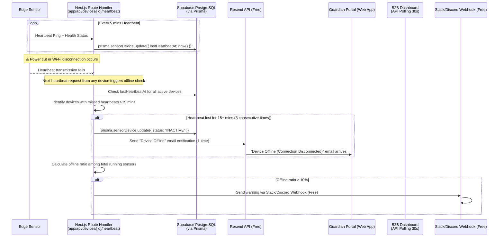

#### 6.3.3 Detailed Sequence — OTA Firmware Update ⟨Wave 2 — Edge/FW Scope⟩

> **⚠️ Wave 2 — Edge/FW Scope.** Not part of vibe-coding MVP Core.

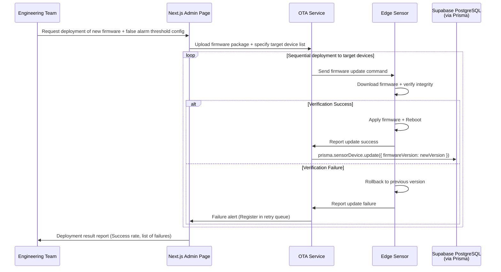

### 6.4 Validation Plan

Validation plan based on experiment hypothesis/measurement/success criteria in PRD §8.2.

| Experiment ID | Hypothesis | Measurement Protocol | Acceptance/Success Criteria | Phase | Related Requirements |
| :--- | :--- | :--- | :--- | :--- | :--- |
| **EXP-01** | Eliminating false alarms in B2B sites improves contract retention & satisfaction. | Run 1st closed beta in **2–3 nursing homes (30–50 beds total)** concurrently. Track `isFalseAlarm` flag via Prisma aggregation continuously for 4 weeks. | False alarms **reduced by ≥ 97.5%** compared to old motion sensor control group (≤ 2 cases per bed/month). | **Wave 2** | REQ-FUNC-002, REQ-NF-002 |
| **EXP-02** | B2C daily reports (with AI summaries) contribute to preventing subscription churn. | 2nd open beta with **20–50 households** using Guardian web portal. Track Vercel Analytics `view_daily_report` views for 4 weeks. | WAU stats show **≥ 60% users checking ≥ 5 times/week**. | **Phase 2** | REQ-FUNC-016, REQ-NF-015 |
| **EXP-03** | Zero-Friction eliminates resistance among elderly users. | Entire subscriber base during Wave 2. Analyze text of CRM CS tickets for 'operation inconvenience/device wearing refusal'. | Accumulated churn/cancellation complaints = **0 cases**. | **Wave 2** | REQ-FUNC-006, REQ-NF-016 |

---

## 7. AI Integration Specification

### 7.1 Vercel AI SDK + Google Gemini Integration

| Item | Specification |
| :--- | :--- |
| **SDK** | Vercel AI SDK (`ai` package + `@ai-sdk/google` provider) |
| **Model** | **Google Gemini 1.5 Flash (default).** Free quota optimized. Swappable via `AI_MODEL` environment variable. |
| **Route** | `app/api/ai/wellness-summary/route.ts` |
| **Invocation** | `generateText({ model: google(process.env.AI_MODEL), prompt, system })` |
| **Caching** | AI summaries cached in `DailyReport.aiSummary` field. One generation per device per day. |
| **Fallback** | If Gemini API fails, report is created without `aiSummary` (null). No user-facing error. |
| **Free Quota** | 15 RPM, 1M TPM, 1,500 requests/day. 50 devices × 1 req/day = 50 requests → **well within limits.** |

### 7.2 AI Use Cases

| # | Use Case | Input | Output Example | Trigger | Phase |
| :--- | :--- | :--- | :--- | :--- | :--- |
| **NEW-01** | AI Wellness Narrative | Sleep score, bathroom count, anomaly flags, dwell times | "Mom slept well for 7.5 hours last night. Used the bathroom 2 times (within normal range). No anomalies detected." | `generateDailyReport` Server Action (daily Cron) | **Phase 2** |
| **NEW-02** | AI Anomaly Explanation | Anomaly flag type, deviation percentage, historical baseline | "Bathroom dwell time is 50% longer than usual. Recommend checking." | When anomaly flag is detected during report generation | **Phase 2** |

### 7.3 Prompt Structure

```
System: You are an AI wellness assistant for the Rooted ambient care system. 
Generate a brief, warm, easy-to-understand summary of the daily wellness data 
for a family member (guardian). Use natural, caring language. 
Do NOT use medical terminology. Refer to the observed person as "your family member" 
or use the provided name. Keep the summary under 100 words.

User: 
Device: {deviceId}
Date: {date}
Sleep Score: {sleepScore}/100
Sleep Duration: {sleepHours} hours
Bathroom Visits: {bathroomCount} times
Anomaly Flags: {anomalyFlags}
Status: {statusCode}
```

### 7.4 Model Swap Strategy

| Environment | `AI_MODEL` Value | Purpose |
| :--- | :--- | :--- |
| Development | `gemini-1.5-flash` | Fast, free quota optimized for testing |
| Staging | `gemini-1.5-flash` | Quality validation within free tier |
| Production | `gemini-1.5-flash` | **Free quota optimized.** Upgrade to `gemini-1.5-pro` only with Pro plan budget. |

> **Change from v2.0:** All environments default to `gemini-1.5-flash` for free quota optimization. `gemini-1.5-pro` reserved for Wave 2 (paid budget).

---

## 8. Recommended Project Structure — MVP Core

```
rooted-mvp/
├── app/
│   ├── (auth)/
│   │   ├── login/page.tsx
│   │   └── register/page.tsx
│   ├── (guardian)/                  # B2C Guardian Portal (Web App)
│   │   ├── dashboard/page.tsx       # Guardian home — daily summary + AI narrative
│   │   ├── reports/
│   │   │   └── [date]/page.tsx      # Daily report detail
│   │   └── layout.tsx
│   ├── (admin)/                     # B2B Monitoring Dashboard
│   │   ├── dashboard/page.tsx       # Traffic light multi-bed view (API Polling 30s)
│   │   └── layout.tsx
│   ├── api/
│   │   ├── events/
│   │   │   ├── ingest/route.ts      # Mock event ingestion (Phase 0)
│   │   │   └── [eventId]/
│   │   │       └── false-alarm/route.ts  # (Phase 2)
│   │   ├── reports/
│   │   │   └── daily/[deviceId]/[date]/route.ts  # (Phase 1)
│   │   ├── devices/
│   │   │   └── [deviceId]/
│   │   │       └── heartbeat/route.ts  # (Phase 1)
│   │   ├── dashboard/
│   │   │   └── status/route.ts      # (Phase 1)
│   │   ├── ai/
│   │   │   └── wellness-summary/route.ts  # Gemini 1.5 Flash (Phase 2)
│   │   └── mock/
│   │       └── generate/route.ts    # 🆕 Mock event auto-generation (Phase 0)
│   ├── actions/                     # Server Actions — MVP Core (4)
│   │   ├── events.ts                # createWellnessEvent, updateFalseAlarmFlag
│   │   ├── reports.ts               # generateDailyReport
│   │   └── devices.ts               # updateDeviceStatus
│   ├── layout.tsx                   # Root layout
│   ├── page.tsx                     # Landing page
│   └── globals.css                  # Tailwind CSS
├── components/
│   ├── ui/                          # shadcn/ui components
│   │   ├── button.tsx
│   │   ├── card.tsx
│   │   ├── badge.tsx
│   │   ├── alert.tsx
│   │   ├── data-table.tsx
│   │   └── ...
│   ├── dashboard/
│   │   ├── traffic-light-card.tsx   # Red/Yellow/Green bed status
│   │   └── triage-list.tsx          # Priority-sorted events
│   ├── reports/
│   │   ├── daily-report-card.tsx    # Includes AI summary display
│   │   └── anomaly-alert.tsx
│   └── shared/
│       └── device-status-indicator.tsx
├── lib/
│   ├── prisma.ts                    # Prisma client singleton
│   ├── auth.ts                      # NextAuth.js config (JWT single)
│   ├── ai.ts                        # Vercel AI SDK + Gemini 1.5 Flash setup
│   ├── email.ts                     # 🆕 Resend API utility (Free: 100/day)
│   ├── slack.ts                     # 🆕 Slack/Discord Webhook utility (Free)
│   ├── triage.ts                    # Triage scoring (Phase 3)
│   └── utils.ts                     # General utilities
├── prisma/
│   ├── schema.prisma                # Database schema — 5 models (see §3.6)
│   ├── seed.ts                      # 🆕 Mock data generation script (see §14)
│   └── migrations/
├── public/
│   └── icons/
├── .env.local                       # Environment variables (see §9)
├── .env.example
├── next.config.ts
├── tailwind.config.ts
├── components.json                  # shadcn/ui config
├── package.json
├── tsconfig.json
└── vercel.json                      # Vercel Cron configuration (1/day)
```

> **Key Changes from v2.0:**
> - **Removed:** `app/api/webhooks/emr/` (Wave 2), `app/api/notifications/push/` (Phase 3), `app/api/events/archive/` (Wave 2), `app/api/dashboard/filters/` (Phase 3), `app/api/reports/trend/` (Phase 2), `app/actions/dashboard.ts` (Phase 3), `app/actions/users.ts` (NextAuth built-in), `components/dashboard/emr-status-banner.tsx` (Wave 2), `lib/emr-webhook.ts` (Wave 2), `lib/push.ts` (Phase 3), `public/manifest.json` (Phase 3), `public/sw.js` (Phase 3)
> - **Added:** `lib/email.ts` (Resend), `lib/slack.ts` (Webhook), `prisma/seed.ts` (Mock Data), `app/api/mock/generate/route.ts` (Dev/Demo)
> - **Simplified:** `(guardian)/reports/trends/` removed (Phase 2), `(admin)/events/`, `(admin)/emr/` removed (Wave 2)

---

## 9. Environment Variables (8 Variables)

```env
# ==========================================
# Database (Supabase Free — 500MB limit)
# ==========================================
DATABASE_URL="postgresql://..."

# ==========================================
# Authentication (NextAuth.js — JWT Single)
# ==========================================
NEXTAUTH_SECRET="your-secret-here"
NEXTAUTH_URL="http://localhost:3000"

# ==========================================
# AI (Gemini 1.5 Flash — Free Quota)
# ==========================================
GOOGLE_GENERATIVE_AI_API_KEY="your-gemini-api-key"
AI_MODEL="gemini-1.5-flash"           # Flash default (free quota optimized)

# ==========================================
# Email Notification (Resend Free — 100/day)
# ==========================================
RESEND_API_KEY="your-resend-api-key"

# ==========================================
# Analytics (Optional — Free)
# ==========================================
NEXT_PUBLIC_AMPLITUDE_KEY="..."       # Or use Vercel Analytics (Hobby included)

# ==========================================
# Ops Alert (Optional — Free)
# ==========================================
SLACK_WEBHOOK_URL="..."               # Slack/Discord ops alert webhook
```

> **Key Changes from v2.0:**
> - **Removed (5):** `FCM_SERVER_KEY`, `NEXT_PUBLIC_VAPID_PUBLIC_KEY`, `VAPID_PRIVATE_KEY`, `EMR_WEBHOOK_API_KEY`, `EMR_WEBHOOK_HMAC_SECRET`
> - **Added (2):** `RESEND_API_KEY`, `SLACK_WEBHOOK_URL`
> - **Modified:** `DATABASE_URL` — Supabase Free PostgreSQL only (no SQLite toggle), `AI_MODEL` — Flash default
> - 12 variables → **8 variables**

---

## 10. Sprint Estimation — Vibe-Coding MVP

| Feature Group | v02 Estimate | v03 Estimate (Vibe-Coding) | Phase | Rationale |
| :--- | :--- | :--- | :--- | :--- |
| **FR-01: AI Filtering Engine** | XL (3-4 Sprints) | **N/A** (Outside vibe-coding) | Wave 2 | Edge/HW — Professional developer required |
| **FR-02: Sensor Module** | L (2-3 Sprints) | **N/A** (Outside vibe-coding) | Wave 2 | Hardware/firmware work — Professional developer required |
| **FR-03: Privacy-Preserving Tracking** | L (2-3 Sprints) | **N/A** (Outside vibe-coding) | Wave 2 | Edge processing — Professional developer required |
| **FR-04: Dashboard (UI Only)** | M (1-2 Sprints) | **S (0.5–1 Sprint, 1–2 weeks)** | Phase 1 | EMR separated. shadcn/ui pre-built components. API polling instead of Realtime. |
| **FR-05: Wellness Report + AI** ⬆️ | M (1-2 Sprints) | **M (1 Sprint, 2 weeks)** | Phase 2 | **MVP killer feature.** Gemini AI SDK is ideal for vibe-coding. |
| **FR-06: Sleep Trend Charts** | S (1 Sprint) | **S (0.5 Sprint, 1 week)** | Phase 3 | Recharts simple integration. |
| **FR-07: SMS/Kakao** | S (1 Sprint) | **N/A** (Won't MVP) | Wave 2 | Paid service excluded. |
| **FR-08: Dashboard Filters** | S (0.5-1 Sprint) | **XS (0.5 Sprint, 3–5 days)** | Phase 3 | Unnecessary for <50 devices but Could. |
| **PWA Guardian Portal** | M (1-2 Sprints) | **S (0.5 Sprint, 1 week)** | Phase 3 | manifest + Service Worker basics only. |
| **Infra Setup** | S (0.5-1 Sprint) | **XS (2–3 days)** | Phase 0 | `create-next-app` + Vercel deploy. |
| **Mock Data + Seed** 🆕 | N/A | **XS (1–2 days)** | Phase 0 | New: Edge simulator replacement. |
| **Email Notification** 🆕 | N/A | **XS (1–2 days)** | Phase 2 | New: Resend Free replaces SMS/FCM. |
| **Total Vibe-Coding Duration** | - | **~5–7 weeks (full-time)** | Phase 0–3 | |

---

## 11. Risk Assessment

| Risk ID | Description | Probability | Impact | Mitigation Strategy | Phase |
| :--- | :--- | :--- | :--- | :--- | :--- |
| ~~RISK-01~~ | ~~Vercel cold starts → p95 latency~~ | - | - | **Resolved in v3.0.** Edge Runtime not supported on Hobby. Threshold relaxed to p95 ≤ 5,000ms. | - |
| **RISK-02** | iOS Safari Web Push API coverage gap (requires iOS 16.4+) | 3/5 | 3/5 | "**PWA is Phase 3. MVP Core uses email notification via Resend Free.**" | Phase 3 |
| ~~RISK-03~~ | ~~Supabase Realtime connection limits at scale~~ | - | - | **Resolved in v3.0.** Device target reduced to <50. | - |
| ~~RISK-04~~ | ~~Scalability ceiling at 5K devices~~ | - | - | **Resolved in v3.0.** MVP <50 devices. Wave 2 concern. | - |
| **RISK-05** | SQLite → PostgreSQL migration issues | 2/5 | 2/5 | "**MVP uses Supabase Free PostgreSQL directly. SQLite for local testing only.** Prisma abstracts differences." | Phase 0 |
| **RISK-06** | Gemini API rate limits or latency | 2/5 | 2/5 | "**Flash model default. Free quota (1,500 req/day) sufficient for <50 devices.** Batch generation (1/device/day)." | Phase 2 |
| **RISK-07** 🆕 | **Supabase Free project 7-day inactivity → pause** → service interruption | 3/5 | 4/5 | GitHub Actions cron or UptimeRobot Free for daily ping. | **Phase 0** |
| **RISK-08** 🆕 | **Vercel Hobby Serverless 100 GB-hr** exceeded → 429 error | 2/5 | 3/5 | Route Handlers minimized (6). Function code minimized. Reduce unnecessary API calls. | **Phase 0** |
| **RISK-09** 🆕 | **Resend Free 100 emails/day** exceeded → notifications not sent | 2/5 | 2/5 | <50 devices → safe. Send email only for urgent alerts; normal reports viewed in-app. | **Phase 2** |
| **RISK-10** 🆕 | **Vibe-coding AI generates NextAuth.js configuration errors** → authentication bypass security vulnerability | 3/5 | 4/5 | MVP Core uses demo credentials. Perform security checklist before real deployment. | **Phase 1** |

---

## 12. Gap Analysis & Mitigation

### 12.1 Identified Gaps

| Gap ID | Gap Description | Severity | Mitigation Strategy | Phase |
| :--- | :--- | :--- | :--- | :--- |
| **GAP-01** | **Real-time dashboard** — Vercel serverless doesn't support persistent WebSocket. | 🟡 Medium | **MVP Core: API polling (30s interval).** Phase 2: Supabase Realtime transition. | **Phase 1 (Polling) / Phase 2 (Realtime)** |
| **GAP-02** | **B2C iOS Native App deferred** — No iOS native development. PWA UX differs. | 🟡 Medium | **MVP Core: Standard web app.** Phase 3: PWA conversion (manifest + Service Worker). | **Phase 1 (Web) / Phase 3 (PWA)** |
| **GAP-03** | **Cold archival (>3 years)** — No S3 Glacier equivalent. | 🟡 Medium | **MVP: 30-day retention, automatic deletion.** Wave 2: Cold Archival implementation. | **Phase 1 (30-day) / Wave 2 (Cold)** |
| **GAP-04** | **Scalability ceiling** — Free tier limits. | ⚪ Low | MVP <50 devices. Well within free tier limits. Re-evaluate at Wave 2. | **Wave 2** |
| **GAP-05** | **Real-time ops monitoring** — No PagerDuty. | 🟡 Medium | **MVP: Slack/Discord Webhook (free).** Wave 2: PagerDuty if needed. | **Phase 2 (Slack) / Wave 2 (PagerDuty)** |
| **GAP-06** | **OTA Firmware Management** — No web stack component. | ⚪ Low | OTA is Edge/FW concern. Wave 2. | **Wave 2** |
| **GAP-07** | **Installer App** — Mobile internal tool not part of web stack. | ⚪ Low | PWA-based installer guide as interim. | **Wave 2** |
| **GAP-08** | ~~**Dead Letter Queue** — Failed EMR webhook storage.~~ | ~~Low~~ | **Removed.** DeadLetterEvent model deleted. EMR deferred to Wave 2. Reintroduce if needed. | **Wave 2** |
| **GAP-09** 🆕 | **Emergency alert delay** — Edge Runtime not supported + Email transmission delay → No real-time emergency alerts. | 🔴 High | **MVP is "report/dashboard query" centered. Real-time emergency alerts deferred to Wave 2 (Edge AI + FCM/Web Push). Clearly stated in SRS.** | **Wave 2** |
| **GAP-10** 🆕 | **Mock data dependency** — No real sensor data; mock data patterns may be unrealistic. | 🟡 Medium | Seed Script with realistic data distribution. Partial real sensor integration test during Beta. | **Phase 0** |

### 12.2 New Capabilities Added by MVP Tech Stack

| # | New Capability | Description | Business Value | Phase |
| :--- | :--- | :--- | :--- | :--- |
| **NEW-01** | **AI Wellness Narrative** | Vercel AI SDK + Gemini 1.5 Flash generates human-readable daily report summaries. | Increases guardian engagement (WAU target ≥ 5/week). | **Phase 2** |
| **NEW-02** | **AI Anomaly Explanation** | Gemini explains anomaly flags in natural language. | Reduces guardian anxiety, improves UX. | **Phase 2** |
| **NEW-03** | **Rapid Deployment Cycle** | Git Push → Vercel auto-deploy with preview deployments per PR. | **Saves 2-3 sprints** compared to AWS infra setup. | **Phase 0** |
| **NEW-04** | **Unified Codebase** | Single Next.js repo for B2B Dashboard + B2C Guardian Portal + all APIs. | Reduces maintenance overhead. | **Phase 0** |
| **NEW-05** | 🆕 **Zero-Cost Operation** | Fully free infrastructure ($0/month). | Eliminates financial barrier to MVP launch. | **Phase 0** |
| **NEW-06** | 🆕 **Mock Data Generator** | Edge sensor simulator replacement. Enables web development without hardware. | Unblocks vibe-coding development entirely. | **Phase 0** |

---

## 13. MVP Phase Definition (🆕 New Section)

> **This is the core new section of SRS v3.0.** All FR/NFR have Phase tags enabling the vibe-coding developer to immediately identify "what to build now" at each stage.

### 13.1 Phase Overview

| Phase | Duration | Scope | Infrastructure | Development Method |
| :--- | :--- | :--- | :--- | :--- |
| **Phase 0: Foundation** | 1 week | Next.js + Prisma 5 models + Vercel deploy + Seed Data | Vercel Hobby + Supabase Free | Vibe-coding |
| **Phase 1: Core UI** | 2 weeks | Guardian Dashboard + B2B Dashboard + Login (NextAuth.js) + Daily Report query + Heartbeat API | Same | Vibe-coding |
| **Phase 2: Pipeline** | 2 weeks | Mock event ingestion API + Daily Report generation (Cron) + Gemini AI summary + Email notification + False alarm feedback | Same | Vibe-coding |
| **Phase 3: Enhancements** | 1–2 weeks | Sleep Trend charts + PWA conversion (Service Worker) + Dashboard filters + Analytics tracking | Same | Vibe-coding + Expert review |
| **Wave 2: Expansion** | Separate | Edge AI/HW integration + EMR HMAC + SMS/Kakao + PagerDuty + Cold Archival + RBAC strengthening | Vercel Pro + Supabase Pro | **Professional developer required** |

### 13.2 Phase 0 — Foundation (Week 1)

| Task | Deliverable | Related Requirements |
| :--- | :--- | :--- |
| `npx create-next-app@latest` + Tailwind + shadcn/ui setup | Working Next.js project | CON-06, CON-09 |
| Prisma schema (5 models) + Supabase Free connection | Database schema deployed | §3.6, CON-08 |
| `prisma/seed.ts` — Mock data generation | 3-5 mock devices, 7 days of events | §14 |
| Vercel deployment (Git Push) + Cron configuration | Live deployment URL | CON-12, CON-13 |
| `app/api/events/ingest/route.ts` — Mock event ingestion | Working API endpoint | Route #1 |
| NextAuth.js basic setup (demo credentials) | Login functionality | CON-07 |
| UptimeRobot / GitHub Actions daily ping | Supabase pause prevention | RISK-07 |

### 13.3 Phase 1 — Core UI (Weeks 2–3)

| Task | Deliverable | Related Requirements |
| :--- | :--- | :--- |
| Guardian Dashboard page + Daily Report viewer | B2C web portal | FR-05 (UI) |
| B2B Monitoring Dashboard (traffic light, API polling 30s) | B2B admin dashboard | FR-04, REQ-FUNC-011 |
| `app/api/reports/daily/[deviceId]/[date]/route.ts` | Report query API | Route #2 |
| `app/api/dashboard/status/route.ts` | Dashboard status API | Route #5 |
| `app/api/devices/[deviceId]/heartbeat/route.ts` | Heartbeat API | Route #6 |
| 30-day data cleanup query | Auto-deletion of old events | REQ-NF-017, REQ-FUNC-015 |

### 13.4 Phase 2 — Pipeline (Weeks 4–5)

| Task | Deliverable | Related Requirements |
| :--- | :--- | :--- |
| Vercel Cron + `generateDailyReport` Server Action | Automated daily report generation | REQ-FUNC-016–020 |
| Gemini 1.5 Flash AI summary integration | AI wellness narrative | §7, NEW-01, NEW-02 |
| Resend Free email notification | Email alerts to guardians | REQ-FUNC-004, REQ-FUNC-008, REQ-FUNC-020 |
| `app/api/events/[eventId]/false-alarm/route.ts` | False alarm feedback | Route #3, REQ-FUNC-005 |
| `app/api/ai/wellness-summary/route.ts` | AI summary API | Route #4 |
| Slack/Discord Webhook for ops alerts | Operational monitoring | REQ-NF-007 |

### 13.5 Phase 3 — Enhancements (Weeks 6–7, Optional)

| Task | Deliverable | Related Requirements |
| :--- | :--- | :--- |
| Sleep Trend charts (Recharts) | Visual trend analysis | FR-06, REQ-FUNC-021 |
| PWA conversion (manifest.json + Service Worker) | Installable web app | GAP-02 |
| Dashboard filters (shadcn/ui DataTable) | Admin filter UI | FR-08, REQ-FUNC-023 |
| Vercel Analytics / Umami tracking | Product analytics | REQ-NF-014, REQ-NF-015 |
| Triage sorting (client-side) | Priority-sorted events | REQ-FUNC-012 |

### 13.6 Wave 2 — Expansion (Separate Timeline, Professional Developer)

| Task | Requires | Related Requirements |
| :--- | :--- | :--- |
| Edge AI/HW integration (UWB radar + Deep Learning) | Professional ML engineer | FR-01, FR-02, FR-03 |
| EMR Webhook (HMAC-SHA256) | EMR vendor partnership (DEP-01) + Security expert | FR-04 (EMR), REQ-FUNC-013–014 |
| SMS/KakaoTalk fallback | Budget for paid messaging services | FR-07, REQ-FUNC-022 |
| FCM/Web Push real-time alerts | Firebase setup + VAPID keys | §3.4.2 (full version) |
| PagerDuty Sev1 escalation | $21/user/month budget | REQ-NF-007 (full version) |
| Cold Archival (90-day hot + >3-year cold) | Supabase Pro ($25/month) | REQ-NF-017 (full version) |
| Full RBAC middleware + DeadLetterEvent | Security review | REQ-NF-011 (full version) |
| OTA Firmware updates | Firmware engineering team | REQ-NF-013 |

---

## 14. Mock Data Specification (🆕 New Section)

Mock data specification for developing and testing the web application without actual Edge sensors.

### 14.1 Seed Script

| Item | Specification |
| :--- | :--- |
| **Location** | `prisma/seed.ts` |
| **Mock Devices** | 3–5 devices (locationZone: "BEDROOM" fixed) |
| **Mock Users** | Guardian 2, Admin 1 |
| **Mock WellnessEvent** | 7 days of data, 5-min intervals (288 events/day/device). eventType distribution: ACTIVITY_ALERT 95%, WELLNESS_SCORE 4%, EMERGENCY 1% |
| **Mock DailyReport** | 7 days of data. sleepScore: 60–95 random. bathroomVisitCount: 1–5 random. |
| **Mock AI Summary** | 3–5 hardcoded example sentences (testable without Gemini API call) |
| **Event Generation API** | `app/api/events/ingest/route.ts` with `mock=true` query parameter triggers auto-generation mode |

### 14.2 Sample Mock Data

```json
{
  "sensorDevices": [
    { "id": "dev-001", "locationZone": "BEDROOM", "status": "ACTIVE", "firmwareVersion": "1.0.0-mock" },
    { "id": "dev-002", "locationZone": "BEDROOM", "status": "ACTIVE", "firmwareVersion": "1.0.0-mock" },
    { "id": "dev-003", "locationZone": "BEDROOM", "status": "INACTIVE", "firmwareVersion": "1.0.0-mock" }
  ],
  "userAccounts": [
    { "email": "guardian1@demo.com", "role": "GUARDIAN", "name": "Park Ji-soo (Demo)" },
    { "email": "guardian2@demo.com", "role": "GUARDIAN", "name": "Kim Min-ji (Demo)" },
    { "email": "admin@demo.com", "role": "FACILITY_ADMIN", "name": "Admin (Demo)" }
  ],
  "mockAISummaries": [
    "Your family member slept well for 7.5 hours last night. Used the bathroom 2 times (within normal range). No anomalies detected.",
    "Your family member had a slightly restless night with 5.5 hours of sleep. Bathroom visits were 4 times, slightly above average. Consider a check-in today.",
    "Your family member had a good rest with 8 hours of sleep. Bathroom usage was normal at 1 time. Everything looks healthy.",
    "Insufficient data collected today. Your family member may not have been home. We'll resume monitoring when activity is detected.",
    "⚠️ Bathroom dwell time is 50% longer than usual. We recommend checking on your family member."
  ]
}
```

---

## 15. Free Tier Constraint Specification (🆕 New Section)

| Service | Free Plan | Key Constraints | MVP Usage (<50 devices) | Headroom | Action on Exceed |
| :--- | :--- | :--- | :--- | :--- | :--- |
| **Vercel Hobby** | Free | 100 GB-hr Serverless, 10s function timeout, Edge Runtime not supported, Cron 1/day, 100GB bandwidth | ~20 GB-hr estimated | 🟢 Sufficient | Pro upgrade ($20/month) |
| **Supabase Free** | Free | 500MB DB, 1GB Storage, 50K MAU, Realtime 200 concurrent, **7-day inactivity pause** | ~100MB DB estimated | 🟢 Sufficient | Pro upgrade ($25/month). Pause prevention: daily ping. |
| **Gemini 1.5 Flash** | Free | 15 RPM, 1M TPM, 1,500 requests/day | 50 requests/day | 🟢 Sufficient | Use `gemini-1.5-flash` for cost minimization |
| **NextAuth.js** | Free (OSS) | No constraints | - | 🟢 - | - |
| **Resend (Email)** | Free | 100 emails/day, 3,000/month | 50 emails/day | 🟢 Sufficient | Paid $20/month (50K/month) |
| **GitHub** | Free | Unlimited public repos, Actions 2,000 min/month | - | 🟢 - | - |
| **UptimeRobot** | Free | 50 monitors, 5-min intervals | 1 monitor | 🟢 - | - |
| **Total Monthly Cost** | - | - | - | - | **$0/month** |

---

**— End of SRS Document —**
