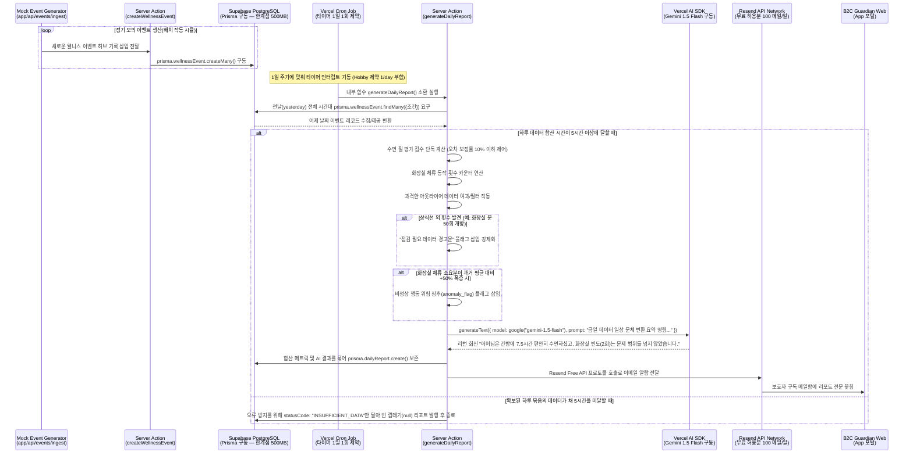
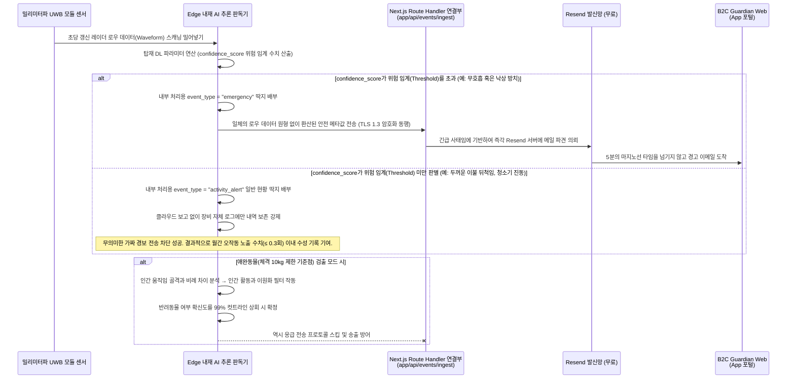
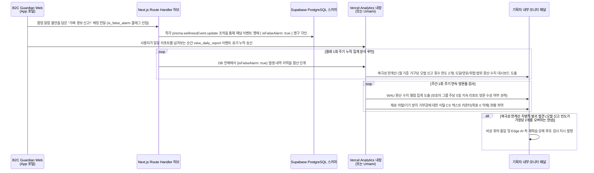
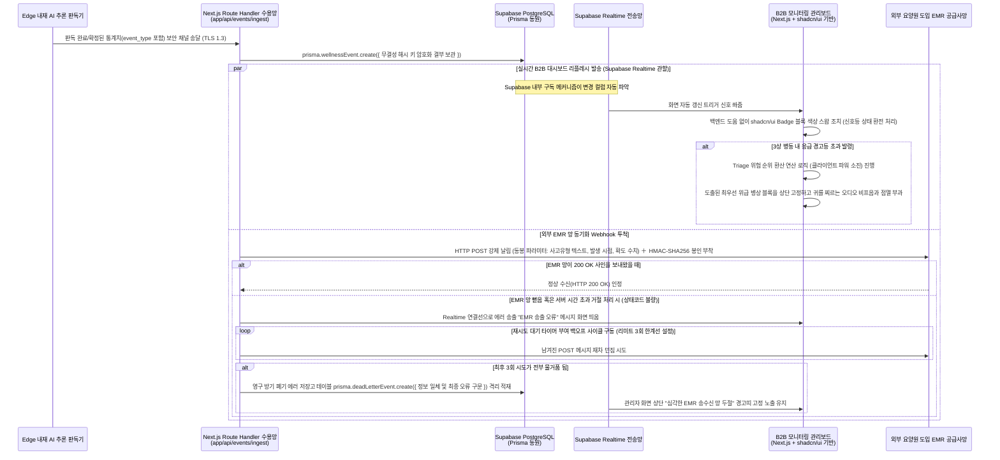
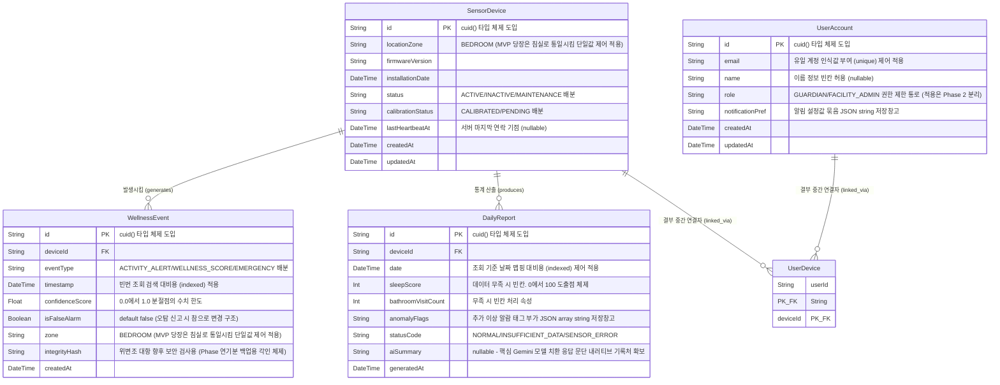
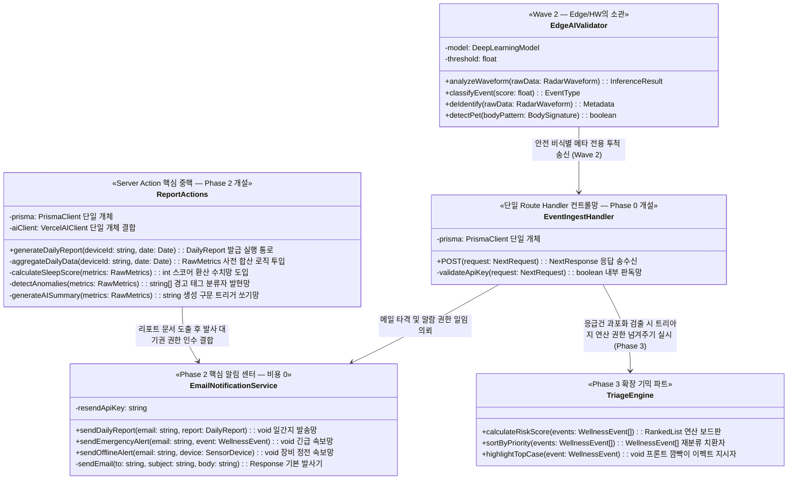
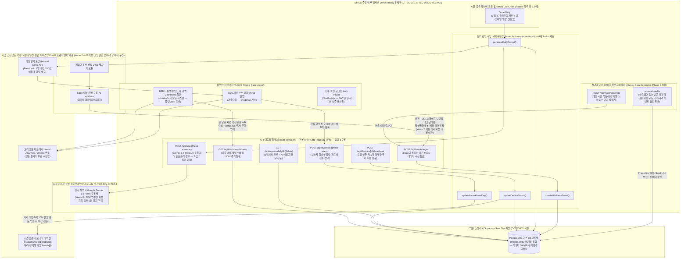
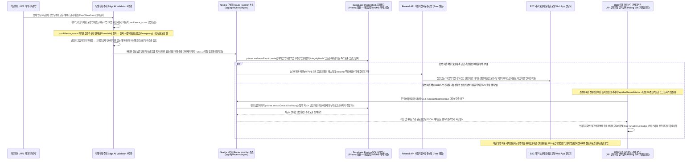
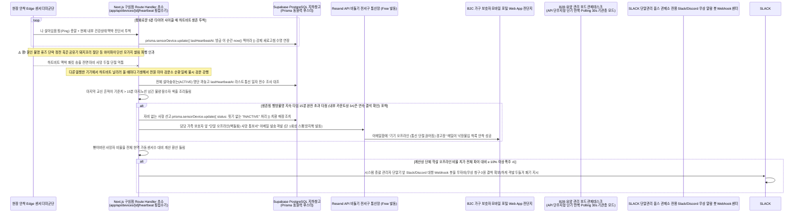
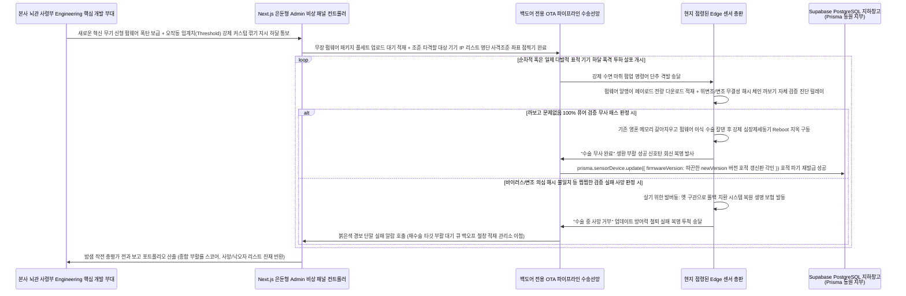

# 소프트웨어 요구사항 명세서 (SRS)

문서 ID: SRS-001  
개정: 3.0  
날짜: 2026-04-20  
표준: ISO/IEC/IEEE 29148:2018  
기술 스택: Next.js (App Router) + Prisma + Supabase Free + Vercel AI SDK + Vercel Hobby 배포  
개발 방식: 바이브 코딩 (AI 코딩 어시스턴트 기반)

---

### 개정 이력

| 버전 | 날짜 | 설명 |
| :--- | :--- | :--- |
| 1.0 | 2026-04-18 | PRD v0.3 기반 초기 SRS (AWS 클라우드 아키텍처) |
| 2.0 | 2026-04-19 | MVP 기술 스택 전면 적용 — Next.js App Router, Prisma + Supabase, Vercel AI SDK + Gemini, Vercel 배포. PLAN-SRS-001-MVP에 따라 적용. |
| 3.0 | 2026-04-20 | 바이브 코딩 MVP 최적화 — 무료 티어(Free Tier) 인프라 도입, 난이도 조정, 기술적 모순 해결. PLAN-SRS-002-VIBE에 따라 적용. 4가지 승인 항목 반영: (1) 실시간 푸시를 MVP에서 제외 → 이메일(Resend Free) 대체, (2) SLA를 Best Effort ~99%로 완화, (3) 데이터 보관 기간을 90일→30일로 단축, (4) EMR 연동을 Wave 2로 연기. Route Handler 11개→6개, Prisma 모델 7개→5개 축소, §13–§15 신규 섹션 추가. |

---

## 1. 개요

### 1.1 목적

본 SRS는 비접촉식 AI 앰비언트 홈 세이프티 솔루션인 **Rooted**의 최소 기능 제품(MVP)에 대한 기능적, 비기능적, 인터페이스 및 데이터 요구사항을 ISO/IEC/IEEE 29148:2018 표준에 따라 정의합니다.

**개발 컨텍스트 (v3.0):**

이 문서는 3개월의 SW 개발 경험을 가진 1인 개발자가 AI 코딩 어시스턴트(예: Cursor, Copilot, Antigravity)를 사용하여 웹 애플리케이션을 구축하는 **바이브 코딩(vibe-coding)** 개발 방식에 맞춰 특별히 설계되었습니다. 모든 요구사항은 개발자가 각 단계에서 "지금 무엇을 개발해야 하는지"를 즉시 파악할 수 있도록 명시적인 **Phase 태그**를 포함하여 구조화되었습니다.

**타겟 문제:**

비접촉식 앰비언트 케어 시장은 B2B, B2G, B2C 관점에서 구조적인 "미충족 니즈(Unmet Need)" 상태에 있습니다.

- **B2B (요양시설):** 저가형 모션 센서의 잦은 오작동(일평균 12건)은 알람 피로도를 유발하여, 야간 근무 중 11건의 오작동이 누적되면 진짜 응급 상황 알림을 무시하게 되고 최악의 경우 치명적인 사고로 이어집니다. 더불어 EMR 시스템과의 데이터 연동 부재는 수기 이중 입력의 고통을 줍니다. (PRD §1.1, §1.7 장영희 극단적 사례)
- **B2G (지자체):** 한정된 예산으로 돌봄 사각지대를 해소해야 하지만, 고사양 장비는 단가를 초과하고 저사양 장비는 응급 징후를 놓치는 비용-효용의 딜레마를 겪고 있습니다. (PRD §1.5)
- **B2C (보호자):** CCTV는 심각한 프라이버시 침해를 일으키고, 웨어러블은 충전을 잊거나 착용하지 않으면 무용지물이 되어 보호자들은 독거 부모님의 응급 상황을 즉각적으로 인지할 수 없는 데이터 단절과 극도의 불안을 경험합니다. (PRD §1.5, §1.7, §1.10)

본 SRS의 예상 독자는 개발팀, QA팀, 프로젝트 매니저 및 외부 감사자입니다. 이 문서는 설계, 구현, 테스트 및 인수를 위한 공식 참조 자료로 활용됩니다.

### 1.2 범위 (포함 / 제외)

**시스템명:** Rooted — 비접촉식 AI 앰비언트 홈 세이프티 솔루션

**개발자 프로필:**

| 항목 | 프로필 |
| :--- | :--- |
| 개발 경험 | SW 개발 학습 3개월 (초보자) |
| 직무 배경 | IT 기획 3년 |
| 개발 방식 | **Full 바이브 코딩** (AI 코딩 어시스턴트 기반) |
| 인프라 예산 | **전액 무료** (Free Tier Only) |
| 도구 비용 | AI 코딩 어시스턴트 구독료만 허용 |

**정량적 목표 (Desired Outcome):**

| 목표 | 현재 상태 (As-Is) | 목표 상태 (To-Be) | PRD 출처 |
| :--- | :--- | :--- | :--- |
| 월간 AI 엔진 오작동 빈도 | 일 12건 (= 가구당 월 360건) | 가구당 월 0.3건 이하 | §1.9, §2.2.2 |
| 사용자가 체감하는 월간 오작동 빈도 (북극성 지표) | 가구당 월 360건 | 가구당 월 2건 이하 | §1.3 |
| 어르신의 기기 조작 빈도 | 웨어러블 충전/착용의 지속적 마찰 | 0회 (Zero-Friction) | §1.9 |
| 야간 수면/화장실 패턴 오차율 | 데이터 부재 | 10% 미만 | §1.9 |
| 프라이버시 침해 수준 | CCTV/홈캠 감시에 대한 거부감 | 비영상(비식별) 방식, 침해 제로(0) | §1.10 |
| B2B EMR 이중 입력 | 수기 + 시스템 이중 입력 | EMR 자동 연동, 이중 입력 0건 (**Wave 2**) | §1.10, §3.1 |

**MVP 범위 정의 (3-Tier):**

| 티어 | 범위 | 일정 | 인프라 | 개발자 |
| :--- | :--- | :--- | :--- | :--- |
| **MVP Core (Phase 0–3)** | 웹 대시보드 + 웰니스 리포트 + AI 요약 + 이메일 알림 + 모의 데이터 | 5–7주 | Vercel Hobby + Supabase Free (월 $0) | 바이브 코딩 (1인) |
| **Phase 2 확장** | 수면 트렌드 차트 + PWA 전환 + 대시보드 필터 + Amplitude | +1–2주 | 동일 | 바이브 코딩 + 전문가 리뷰 |
| **Wave 2 (별도 단계)** | Edge AI/HW + EMR HMAC + SMS/카카오 + PagerDuty + 콜드 아카이빙 + RBAC | 별도 일정 | Vercel Pro + Supabase Pro | **전문 개발자 필요** |

**포함 (In-Scope):**

| 항목 | 설명 | Phase | PRD 출처 |
| :--- | :--- | :--- | :--- |
| 모의 데이터 생성기 | Edge 센서 시뮬레이터 대체. 개발/데모용 Seed 스크립트 및 Mock API. | **Phase 0** | 신규 |
| B2C 보호자 포털 (웹 앱) | Next.js App Router 기반의 표준 웹 애플리케이션. 일일 리포트, 오작동 신고 기능. **PWA 전환은 Phase 3으로 연기.** | **Phase 1** | §2.2.3, C-TEC-001 |
| B2B 모니터링 대시보드 (웹) | Next.js App Router + shadcn/ui. 신호등(Red/Yellow/Green) 다중 병상 모니터링 UI. **MVP Core는 API 폴링(30초), Supabase Realtime은 Phase 2.** | **Phase 1** | §2.2.3, C-TEC-004 |
| 웰니스 일일 리포트 | Vercel Cron Job을 통해 매일(1회) 수면 점수, 화장실 방문 횟수, 이상 징후 플래그를 자동으로 생성. **Gemini AI 자연어 요약 포함.** | **Phase 2** | §3.1 Feature 5, C-TEC-005 |
| 이메일 알림 (Resend Free) | MVP의 SMS/카카오톡/FCM/웹 푸시를 대체하는 무료 이메일 알림. 일 100건 제한. | **Phase 2** | 신규 |
| UWB 레이더 HW 연동 | 비접촉식 센서 모듈 — **Edge/HW 범위, 바이브 코딩 제외.** | **Wave 2** | §2.2.1 |
| 제로 오작동 AI 엔진 | 딥러닝 기반 엣지 추론 — **Edge/HW 범위, 바이브 코딩 제외.** | **Wave 2** | §2.2.2, DOS 3.8 |

**제외 (v02에서 연기됨):**

| 항목 | v02 위치 | 제외 사유 | 연기 시점 |
| :--- | :--- | :--- | :--- |
| EMR Webhook (HMAC-SHA256) | FR-04 Must | 벤더 제휴(DEP-01) 미체결 및 HMAC 보안 로직은 전문가 필요 | **Wave 2** |
| SMS/카카오톡 폴백 (FR-07) | Should | 유료 서비스. 전액 무료 제약조건 위배. | **Wave 2** |
| PagerDuty 연동 | REQ-NF-007 | 유료 서비스 (사용자당 월 $21) | **Wave 2** |
| 실시간 푸시 (FCM/Web Push) | §2.2.3 | MVP에서 FCM/Web Push 제외; 이메일(Resend Free)로 대체. | **Phase 2 (이메일) / Wave 2 (푸시)** |
| 콜드 아카이빙 (90일 초과) | REQ-NF-017 | MVP 런칭 후 90일이 지날 때까지 필요하지 않음 | **Wave 2** |
| 해시 체인 무결성 검증 | REQ-FUNC-015 일부 | 법적 증거 효력은 프로덕션 단계에서만 필요 | **Wave 2** |
| Rate Limiting (분당 100요청) | §3.3 #2 | 50대 미만 규모에서는 불필요 | **Wave 2** |

**기존 제외 항목 (변경 없음):**

| 항목 | 제외 사유 | PRD 출처 |
| :--- | :--- | :--- |
| 스마트홈 제어 연동 (조명/가전) | 안전(Safety)이라는 핵심 가치를 희석시킴. 아카라라이프 방식 미채택. | §2.3 #1 |
| '케어(Care)' 등 마케팅 용어 사용 | 잠재 고객인 고태식 부류(약 44~54만 가구)의 '노인 낙인' 거부감을 방지하기 위함. | §2.3 #2 |
| B2G 공공 조달 최저가 입찰 SLA 충족 | 런칭 시점의 무기한 지연 유발. SOM S1 세그먼트 침투 검증 후 4분기 재평가. | §2.3 #3 |
| iOS 네이티브 앱 | Wave 2로 연기. MVP는 표준 웹 앱으로 시작 → Phase 3에서 PWA로 전환. | C-TEC-001 |
| Android 네이티브 앱 | Wave 2 이후로 연기. | §2.2.3 |
| 설치자용 앱 (모바일) | MVP 웹 스택 범위 외. PWA 기반 설치 가이드로 대체 가능. | C-TEC-001 |

### 1.3 용어, 약어 정의

| 용어 | 정의 |
| :--- | :--- |
| UWB (Ultra-Wideband) | 초광대역 무선 통신 기술. 카메라 없이 전파 반사를 통해 호흡, 심박, 움직임 패턴을 감지하는 레이더 기반 기술. |
| Zero-Friction (제로 마찰) | 사용자(어르신)의 조작이나 개입(충전, 착용, 버튼 누르기 등)이 전혀 없이 시스템이 자율적으로 작동하는 UX 원칙. |
| False Alarm (오작동) | 진짜 응급 상황이 아님에도 불구하고(예: 뒤척임, 반려동물 이동) 시스템이 응급 상황으로 오인하여 알림을 보내는 현상. |
| JTBD (Jobs to be Done) | 사용자가 특정 상황에서 달성하고자 하는 과업이나 목표를 중심으로 제품의 니즈를 분석하는 프레임워크. |
| AOS (Adjusted Opportunity Score) | 기회 발굴 인터뷰에서 산출된 조정 기회 점수. 중요도와 만족도를 가중하여 시장 기회 크기를 정량화. |
| DOS (Discovered Opportunity Score) | 인터뷰에서 발굴된 기회 점수. 기존 대안 대비 미충족 니즈의 정도를 0-5점 척도로 수치화. |
| CJM (Customer Journey Map) | 고객의 인지, 구매, 사용, 이탈까지의 전체 여정에서의 경험과 감정을 시각화하는 분석 도구. |
| Triage (트리아지) | 다수의 동시다발적 응급 상황 발생 시 위험도를 자동 계산하여 대응 우선순위를 결정하는 알고리즘. |
| Edge (엣지) | 센서 기기 자체에서 물리적으로 AI 추론을 수행하는 로컬 컴퓨팅 환경. 클라우드 전송 전에 로우 데이터를 처리. |
| OTA (Over-the-Air) | 무선 네트워크를 통해 기기의 펌웨어를 원격으로 업데이트하는 방식. |
| EMR (Electronic Medical Record) | 요양시설의 전자의무기록 시스템. |
| Webhook (웹훅) | 특정 이벤트 발생 시 미리 등록된 외부 URL로 HTTP POST 요청을 자동 전송하는 서버 간 통신 방식. |
| MoSCoW | 우선순위 결정 기법: Must(필수) / Should(권장) / Could(선택) / Won't(제외). |
| Heartbeat (하트비트) | 기기가 정상 작동 중임을 서버에 주기적으로 알리는 생존 신호. |
| Validator (검증기) | AI 추론 결과의 신뢰성을 검증하고 오작동 여부를 식별하여 진짜 이벤트만 걸러내는 로직 모듈. |
| PMF (Product-Market Fit) | 제품이 시장의 핵심 니즈를 충분히 만족시키고 있는지를 나타내는 지표. |
| KSF (Key Success Factor) | 시장에서 경쟁 우위를 결정짓는 핵심 성공 요인. |
| PWA (Progressive Web App) | Service Worker, 웹 푸시 API 및 manifest.json을 사용하여 홈 화면 설치와 같은 네이티브 앱 수준의 경험을 제공하는 웹 애플리케이션. |
| Route Handler | `app/api/` 디렉토리 내에서 API 엔드포인트를 정의하기 위한 Next.js App Router 패턴. 전통적인 REST API 백엔드 서버를 대체. |
| Server Action | 명시적인 API 호출 없이 React 컴포넌트에서 서버 측 데이터 변이 로직을 직접 실행할 수 있는 Next.js의 메커니즘. |
| Supabase Realtime | 연결된 클라이언트에게 데이터베이스 변경 사항을 자동 파싱하여 실시간으로 방송하는 Supabase 내장 WebSocket 기반 구독 서비스. |
| **Vibe-Coding (바이브 코딩)** | 🆕 개발자가 밑바닥부터 수동으로 코딩하는 대신, AI 코딩 어시스턴트와의 대화형 상호작용을 통해 코드를 생성, 디버깅, 다듬어가는 개발 방식. |
| **Free Tier (무료 티어)** | 🆕 특정 리소스 제한을 가진 클라우드 서비스(Vercel Hobby, Supabase Free, Gemini Free)의 과금 없는 사용 구간. |

### 1.4 참고 문헌 (REF-XX)

| 참조 ID | 문서명 | 설명 |
| :--- | :--- | :--- |
| REF-01 | PRD v0.3 — Rooted 비접촉식 AI 앰비언트 홈 세이프티 솔루션 | 본 SRS의 비즈니스/기능적 요구사항에 대한 단일 진실 공급원(SSOT) |
| REF-02 | KHIDI 시장 보고서 | 한국 시니어 케어 시장 규모: 72조원 (2020) → 168조원 (2030) |
| REF-03 | 글로벌 AI 기반 노인 케어 시장 분석 | $56.8B (2025) → $329.4B (2034) (CAGR 21.3%) |
| REF-04 | JTBD VoC 인터뷰 보고서 | 3개 그룹(최근 사용자/이탈자/미사용 탐색자)의 원본 인터뷰 내용 및 AOS/DOS 분석 (§1.9) |
| REF-05 | 5-Forces / 5개사 경쟁 분석 | §1.1, §1.2 기반의 시장 구조 및 경쟁사 분석 (케어벨, 오파스넷, 아카라라이프, 유메인, 에이슬립) |
| REF-06 | 장영희 극단적 사례 타임라인 | 2024.01.14 요양원 야간 낙상 사망 사고의 근본 원인 분석 (§1.7) |
| REF-07 | ISO/IEC/IEEE 29148:2018 | 시스템 및 소프트웨어 공학 — 수명 주기 프로세스 — 요구사항 공학 |
| REF-08 | Next.js App Router 문서 | https://nextjs.org/docs/app — 풀스택 프레임워크의 기반 (C-TEC-001) |
| REF-09 | Prisma ORM 문서 | https://www.prisma.io/docs — SQLite/PostgreSQL 데이터베이스 ORM (C-TEC-003) |
| REF-10 | Supabase 문서 | https://supabase.com/docs — PostgreSQL, Storage, Realtime, Auth (C-TEC-003) |
| REF-11 | Vercel AI SDK 문서 | https://sdk.vercel.ai/docs — LLM 오케스트레이션 프레임워크 (C-TEC-005) |
| REF-12 | Vercel 플랫폼 문서 | https://vercel.com/docs — 배포, Cron Jobs 연동 (C-TEC-007) |
| REF-13 | 🆕 Resend Email API 문서 | https://resend.com/docs — 무료 이메일 알림 (일 100건, 월 3,000건 제한) |
| REF-14 | 🆕 Supabase Free Tier 제한 | https://supabase.com/pricing — DB 500MB, Storage 1GB, 7일 미사용 시 프로젝트 일시 중단 정책 |
| REF-15 | 🆕 Vercel Hobby Plan 제한 | https://vercel.com/docs/accounts/plans — Serverless 월 100 GB-hr, 일 1회 Cron |

### 1.5 제약사항 및 가정

#### 1.5.1 제약사항

PRD §7.2의 주요 리스크 항목에 대한 ADR(아키텍처 결정 기록) 내용과 MVP 기술 스택의 제약을 반영합니다.

| 제약 ID | 제약사항 | ADR 결정 내용 | PRD 출처 |
| :--- | :--- | :--- | :--- |
| CON-01 | **의료기기 분류 회피 (Avoidance of Medical Device Classification)** — 맥박/호흡 데이터 기반 알림이 '진단'으로 해석될 경우 식약처 의무 인허가 대상 지정. (발생률 4, 영향도 5) | 제품의 포지셔닝을 "라이프 케어 스마트홈 기기(웰니스/안부 확인용)"로 고정. 앱 UI 및 알림에 면책 조항 명시. DB/API에서 `diagnosis`, `medical`, `patient` 등의 단어 사용 원천 배제. | R-01, §3.2 Principle 2 |
| CON-02 | **개인정보보호법(PIPA) 준수** — 움직임 및 생체 정보 원본이 서버에 축적될 경우 민감정보 관리 가이드라인 위반 우려. (발생률 4, 영향도 4) | 로우 데이터를 엣지단에서 비식별 이진/수치화된 이벤트 결과값으로 변환. 서버에는 비식별 메타데이터만 저장. B2B 다자간 정보 동의서 양식 제공. | R-02, §3.1 Feature 3 |
| CON-03 | **과도한 SI화 방지** — 대형 요양병원의 무리한 개별 EMR 맞춤화 요구를 차단해야 함. (발생률 4, 영향도 4) | MVP 단계에서는 독립형 SaaS 대시보드 공급에 집중. 1위 EMR 벤더(예: 케어포)와의 전략적 제휴를 통해서만 표준 플러그인(Webhook) 형태로 연동 지원. 개별 구축 요구 거절. **EMR 연동 Wave 2로 연기.** | R-04, §3.1 Feature 4 |
| CON-04 | **DB/API 명명 규칙 제약** — 모든 기술 아티팩트에서 `diagnosis`(진단), `medical`(의료), `patient`(환자) 등 규제 유발 단어 사용을 엄격히 금지. `wellness_score`, `activity_alert` 등으로 용어 통일. | 전체 시스템에 걸쳐 적용. | NFR-12 |
| CON-05 | **UWB 칩셋 공급선 의존** — NXP, Infineon 등 소수 주요 부품 제조사에 글로벌 수급이 종속됨. (발생률 3, 영향도 4) | 단기적으로 다중 소싱 전략 채택 + 장기적으로 독자 칩셋 설계 로드맵 검토 (유메인 벤치마킹). | R-03, §1.1.4 |
| CON-06 | **C-TEC-001: Next.js 풀스택** — 모든 서비스는 통합된 단일 Next.js(App Router) 풀스택 환경에서 구축. 프론트/백엔드 이원화 없음. | B2B 대시보드, B2C 보호자 포털 및 API Route의 단일 코드베이스 유지. | C-TEC-001 |
| CON-07 | **C-TEC-002: Server Actions / Route Handlers** — 모든 서버 측 로직은 Server Actions 또는 Route Handlers로 처리. 별도 백엔드 서버 없음. | DB 조작은 Server Actions, 외부 연동 API는 Route Handlers를 통해 수행. | C-TEC-002 |
| CON-08 | **C-TEC-003: Prisma + SQLite/Supabase** — Prisma ORM + 로컬 SQLite / 프로덕션 Supabase PostgreSQL. | cuid() 기반의 문자열 ID, ENUM 대신 String 필드 사용(SQLite 호환성), M:N 용 다대다 조인 테이블 도입. | C-TEC-003 |
| CON-09 | **C-TEC-004: Tailwind CSS + shadcn/ui** — 모든 UI 스타일링은 Tailwind CSS와 shadcn/ui 컴포넌트만을 사용. | B2B 대시보드 및 리포트 UI의 신속한 구축을 위해 사전 정의된 컴포넌트 활용. | C-TEC-004 |
| CON-10 | **C-TEC-005: Vercel AI SDK** — LLM 연동 파이프라인은 Next.js 환경 내부에서 Vercel AI SDK를 통해 구현. 별도 Python 서버 구성 금지. | `@ai-sdk/google`을 활용해 Gemini 모델로 웰니스 내러티브 요약 본문 제공. | C-TEC-005 |
| CON-11 | **C-TEC-006: Google Gemini API 사용** — 모든 LLM 요청 처리에 Google Gemini API를 기본 지정하며, 환경변수로 교체 가능하게 구현. | `AI_MODEL` 환경 변수 활용으로 코드 변경 없이 모델 교체 대응. | C-TEC-006 |
| CON-12 | **C-TEC-007: Vercel 플랫폼 배포** — 전체 인프라 배포는 Vercel 기반이며, CI/CD는 Git Push 만으로 동작. | Git Push 기반 자동 배포, PR별 미리보기, Cron Job 연동 처리. | C-TEC-007 |
| **CON-13** | 🆕 **Vercel Hobby Plan 제한** — Serverless 월 100 GB-hr 한도, 함수 10초 타임아웃, Edge Runtime 미지원, Cron Job 일 1회 제한, 대역폭 100GB. | Route Handlers 6개로 축소, Cron 일 1회 구동, 콜드 스타트 허용 설계. | CTR-01~09 |
| **CON-14** | 🆕 **Supabase Free 제한** — DB 최대 500MB, Storage 1GB, Realtime 최대 200명 동접, **7일 미가동 시 프로젝트 일시 중단**. | 데이터 모델 5개로 축소, 데이터 보유 기간 30일로 단축, 일일 핑으로 중단/Pause 방지. | CTR-10 |
| **CON-15** | 🆕 **Gemini API 무료 등급 (Free Quota)** — 분당 15회 요청(RPM), 1M TPM, 일 1,500회 제한. | 50대 기기 기준 1일 1요청 (총 50요청) → 충분함. 지연/순차 생성을 통한 Burst 방지 로직 적용. | C-TEC-006 |
| **CON-16** | 🆕 **완전 무료(Fully Free) 인프라 원칙** — 월별 운영비를 $0로 유지한다. AI 코딩 도구 구독료 외에는 타협 없음. | PagerDuty 지원, SMS 발송, 유료 Pro Plan 요금은 MVP Core에서 전면 배제. | P-02 |

#### 1.5.2 가정

| 가정 ID | 가정 내용 | 검증 포인트 | PRD 출처 |
| :--- | :--- | :--- | :--- |
| ASM-01 | 글로벌 반도체 수급 대란 없이 NXP/Infineon UWB 칩셋의 안정적인 공급이 유지된다. | 지속적 시장 모니터링 | §1.1.4 |
| ASM-02 | TAM-SAM-SOM 도출에 사용된 초기 시장 침투율 가정(B2C 0.2%, B2B 2.0%, B2G 5.0%)은 유효하다. | Wave 2 완료 시점에서의 실제 지표 검증 | §1.6 SOM |
| ASM-03 | 방 1개당 1대의 센서 설치(침실 천정 1대 + 화장실 문틀 위 1대) 만으로도 주요 생활 반경의 움직임을 충분히 커버할 수 있다. | **Wave 1 베타 4주차 실제 거주가구 동선 커버리지 측정 데이터 분석** | §3.1 Feature 2 |
| ~~ASM-04~~ | ~~Vercel Pro 플랜의 99.99% 가동률 SLA가 일관되게 보장된다.~~ | **삭제 — Hobby 플랜은 SLA 보장 없음.** | ~~C-TEC-007~~ |
| ASM-05 | Supabase Realtime의 연결 제한(기본 프로젝트당 동시 접속 200회선)은 MVP 스케일(**50대 미만**)을 감당하기에 충분하다. | Phase 2 Realtime 전환 시점의 자원 점유율 모니터링. | C-TEC-003 |
| ASM-06 | 보호자의 iOS 기기는 최신 Web Push API를 지원한다 (iOS Safari 16.4 이상 필요, 2023년 3월 출시됨). 2026년 기준 대부분의 사용자는 iOS 16.4+을 사용할 것이다. | 등록된 보호자들의 모바일 OS 버전 분포 현황 추적. **Phase 3 PWA 전환 시 검증.** | C-TEC-001 |
| **ASM-07** | 🆕 Vercel Hobby의 Serverless 월 100 GB-hr 한도는 6개의 Route Handlers + 50대 기기 환경을 원활히 지원한다. | 베타 2주차에 Vercel Dashboard의 Usage 모니터링 수행 | CON-13 |
| **ASM-08** | 🆕 Supabase 무료 DB 500MB 공간은 50대 다바이스 × 30일 누적 이벤트 데이터를 소화한다 (30일 일일 자동 삭제 스케줄러 기반). | 런칭 1개월 간의 Storage Volume 정기 수치 점검 | CON-14 |
| **ASM-09** | 🆕 Gemini 1.5 Flash 무료 임계치(15 RPM, 일 1500회)는 50대 기기의 1일 생성 주기를 감당하는 데 충분하다. | Phase 2 AI 생성 파이프라인 통합 시 검증 수행 | CON-15 |

#### 1.5.3 의존성

| 의존성 ID | 종속 대상 | 설명 | PRD 출처 |
| :--- | :--- | :--- | :--- |
| DEP-01 | EMR 벤더 (케어포 등) | 주요 B2B 시장의 EMR 데이터 연동(표준 Webhook) 방식 제휴 타결이 필수. **Wave 2 — 제휴 미체결.** | §3.1 Feature 4 |
| DEP-02 | KCC 무선 기기 전파 인증 | UWB 레이더 모듈은 국내 전파 인증(KC마크)을 반드시 통과해야 정식 운용 가능. | §3.2 Phase 2 |
| DEP-03 | ~~FCM Push 서비스 기반~~ → **Resend Email API (Free)** | MVP 알림 파이프라인은 Resend Free(일 100건 제한)에 전적으로 의존. FCM/Web Push는 Wave 2로 연기. | §2.2.3 |
| DEP-04 | Supabase Realtime 기능 | 대시보드 화면 갱신에 Supabase가 제공하는 실시간 웹소켓 구독 서비스에 의존. **Phase 2 — MVP Core는 API 폴링(30초) 활용.** | C-TEC-003 |
| DEP-05 | Vercel Cron Jobs 지원 | 스케줄 기반 정기 작업 실행 환경: **일일 리포트 자동 생성(1일 1회 빈도)**. ⚠️ Hobby 플랜은 일 1회로 Cron 횟수 제한. 하트비트 생존 확인은 Server 단 Push 방식으로 우회 대체. | C-TEC-007 |
| DEP-06 | Vercel AI SDK + Google Gemini API 연동 | 일간 요약본/비정상 징후 내러티브 생성은 Vercel AI SDK(`@ai-sdk/google`) 및 모델 버전에 종속됨. **Gemini 1.5 Flash(무료 쿼터용) 사용.** ENV 기반 환경변수 모델 변경 가능토록 구현. | C-TEC-005, C-TEC-006 |

---

## 2. 이해관계자 (Stakeholders)

PRD §2.1의 4가지 핵심 페르소나를 이해관계자 역할로 구체화.

| 역할 | 이름(페르소나명) | 책임 | 관심사/이해 |
| :--- | :--- | :--- | :--- |
| **B2C 보호자 (핵심)** | 박지수 (43세, 직장인 자녀) | 기기 도입 결정, 보호자용 관제 포털 구독/활용, 응급 알람 일차 수신 시 대응 조치 타진, 오작동 알람 피드백 전송. | ① 진짜 위급한 순간에만 명확한 알람을 받음 (월 오작동 알람 2건 이하 기대). ② 부모님께서 기계 조작 때문에 겪는 마찰 제로(Zero-Friction). ③ 화장실/야간 수면 데이터 통계 기반의 건강 변화 사전 판단. |
| **B2G 지자체 조달 담장자 (인접)** | 정민석 (46세, 8급 공무원) | 독거노인 안심 서비스 예산 지출 집행 평가, 기존 도입 노후 장비 9만대 교체 건 효율 심사, 신규 솔루션 실측 오작동 저감 비율 확인. | ① 배정된 한정 예산 안에서 비용-효과성 극대화 최우선. ② 소방/경찰 등 오인 출동 감소 입증 (작년 기기 오작동에 따른 오인 발생이 847건 중 189건 점유). ③ 대규모 실증 사업 도입을 견인하는 투명한 성공 데이터 검수. |
| **유가족 / 관제시설 재선택 희망자 (극단적)** | 장영희 (63세, 요양원 야간 응급 낙상 사망자 유가족) | 관제 시스템에 저장된 로그 데이터의 보존/위변조 방지 투명성 검수, 요양 시설 재선택 시 첨단 감시 체계 신뢰 평가 기준 활용. | ① 지난 사고 무렵(90일 이상) 데이터 보존 사실 적시와 위변조 방지 해시 암호 무결성 제시. (**Wave 2 — MVP는 서버 한계로 30일 단기 유지.**) ② 시스템 오경보 빈도 저하로 인한 근무 직원의 '알람 무시 현상' 회피 방지 보장. |
| **B2B 요양 시설 관리/근무 당직자** | 심야 다인 병동 담당 보호사 등 | 겹치는 이벤트 로그 관제/확인, 각 룸의 거주자 개별 차트 일지(EMR) 이벤트 수기 입력, 다변화된 동시 다발 긴급 콜 발생 시 현장 Triage(트리아지/우선 대처) 결정 통제. | ① 기존 평균 일 단위 12회 알람 호출 고통에서 탈피, 월 0.3건 이하의 정교함을 체감 희망. ② 2중 시스템 입력/수기 작업의 전면 중지 희망. (**Wave 2**) ③ 식별된 정보별 우선순위 색인 정리 (Triage 지원). |
| **비사용자 (잠재적 전환 목표 집단/비구매 층)** | 고태식 (71세, 은퇴 공무원 독거남성) | 간접적 영향 관찰 대상. 기기 저항성을 결정짓는 UX 거부감 유발 한계선 수용성이 최대 관건. | ① '나를 지켜본다, 훔쳐본다'라는 CCTV 류 불쾌감과 프라이버시 침해가 0%인 기술 수용 확인. ② 배터리 유지/조작 강요 따위의 일절 관여 없음 전제 달성. ③ '케어', '노약자'와 같은 자극적 단어로 상처받지 않음. |

---

## 3. 시스템 맥락 외부 인터페이스 구조

### 3.1 외부 시스템 연동 형태

| 외부 대상 명칭 | 연동 연계 포맷 | 담당 기능 | 단계 (Phase) | PRD 출처 |
| :--- | :--- | :--- | :--- | :--- |
| **Supabase (PostgreSQL + Storage)** | Prisma ORM 연계 / Supabase Client SDK | 백본 데이터 저장소 (PostgreSQL Free 제공량: 500MB), 객체 스토리지 관리망 | **Phase 0** | C-TEC-003 |
| **Supabase Realtime** | Supabase Client SDK 구독 방식 | 대시보드 인터페이스의 즉각적 데이터 렌더링용 실시간 이벤트 푸시. | **Phase 2** | C-TEC-003 |
| **Google Gemini API** | Vercel AI SDK 배포 (`@ai-sdk/google`) | 매일 아침 전송되는 웰니스 요약본의 내러티브 문장 전처리 및 이상 징후 상황 해설 작성/반환. **Gemini 1.5 Flash 기본 장착 (Free Quota 내 배치).** | **Phase 2** | C-TEC-005, C-TEC-006 |
| **Vercel 플랫폼** | Git Push 자동 빌드 프로세스 전개 | 통합 서버리스 아키텍처 호스팅(Free Hobby Tier), 정기 Cron Job(일 1회) 배치, CI/CD 자동화 트리거 허브 역할 수행. | **Phase 0** | C-TEC-007 |
| **Resend (Email API)** | 🆕 표준 REST API 호출 | 결제 부과 없는 무료 구간 메일 알림 엔진(100건/일 제한). MVP의 FCM/Web Push/SMS 의존 탈피 수단. | **Phase 2** | 신규 |
| **Slack/Discord Webhook** | 🆕 Incoming Webhook 형태 (HTTP POST) | 서버 장애 및 기기 연결 끊어짐/오프라인 모드 발생 알림을 위해 무료 시스템 관리 Ops 대역으로 대체 수행. (PagerDuty 월 $21 예산 회피). | **Phase 2** | 신규 |
| **Vercel Analytics / Umami** | SDK Event Tracking 또는 오픈소스 Self-Host | 사용자 앱 활성화 지표 모음. **무료 대응 수단으로 Amplitude 기능 커버.** | **Phase 3** | §1.3 |
| ~~EMR 관제 원장망 (Carefor 등)~~ | ~~서버 측 HTTP POST Webhook + 암호화 전송 HMAC-SHA256~~ | ~~각 환자 관련 일별 웰니스 상태 및 기록치를 자동 주입 렌더링 연동 처리.~~ | **Wave 2** | §3.1 Feature 4 |
| ~~FCM 푸시 알림망~~ | ~~HTTP/2 통신 프로토콜~~ | ~~모바일 기기 바탕 직접 핀포인트 푸시 파견 및 전달.~~ | **Wave 2** | §2.2.3 |
| ~~Web Push API~~ | ~~Service Worker + VAPID 브라우저 통신~~ | ~~PWA 설치 고객 타겟 네이티브 푸시 동등 수준 팝업 구동 처리.~~ | **Phase 3 (PWA 전환 시점)** | C-TEC-001 |
| ~~PagerDuty 서비스 인프라~~ | ~~인터페이스 연동 REST API 호출~~ | ~~장애 1단계 Ops 확장 경고 시스템 ($21/User/Month 부과 항목).~~ **삭제 완료 — 전면 무료 원칙에 따른 제어.** | **Wave 2** | NFR-13 |
| ~~Amplitude / Mixpanel 집계 플랫폼~~ | ~~분석용 SDK 포팅 적용~~ | ~~상용 제품 내부 이벤트 데이터 분석망.~~ **Vercel Analytics / Umami 무료 대체로 전면 치환 수행.** | **Phase 3** | §1.3 |

### 3.2 클라이언트 애플리케이션 접근처

| 클라이언트 구획 | 플랫폼 (환경) | 기술 세부 규격 | 핵심 탑재 기능 | 단계 | PRD 출처 |
| :--- | :--- | :--- | :--- | :--- | :--- |
| **B2C 보호자 모니터 현황 포털** | 웹 브라우저 접속 기반 (표준 웹 → Phase 3에서 PWA 형태 도입) | Next.js App Router 결합 + shadcn/ui 기반 전개 + Tailwind CSS 연동 | 1일 주기 웰니스 지표 출력 (AI 리포트 해제 포함), 오작동 기록 신고 패널, Phase 3 시점 수면 연속 그래프 첨부. **통지 방식은 Resend Free 기반 메일 전달 처리.** | **Phase 1** | §2.2.3, FR-05, C-TEC-001 |
| **B2B 관리 관제 총괄 대시보드** | 데스크탑 및 태블릿 웹 브라우저 규격 | Next.js App Router + shadcn/ui 기반 전개 + Tailwind CSS 연동 | 모니터링 대상 구역 단위 트래픽 색상(Red/Yellow/Green) 신호등 배열 렌더링. **제한된 API 폴링(30초 간격) 방식 운영.** 동시다발 응급건 발생 시 Triage 기반의 우선순위 색인 적용 UI 구동. **실시간 Supabase Realtime 구현은 Phase 2 분리.** | **Phase 1** | §2.2.3, FR-04, C-TEC-004 |
| **현장 설치 기사용 전용 App** | 모바일 디바이스(현장 전개용) | MVP 웹 기술스택 기반 밖의 요소. | 본 문서 기한 내 연기 적용. PWA 기반 QR 파싱 가이드라인 방식 도입 시 차선책 대체 커버 가능. | **Wave 2** | NFR-11 |

### 3.3 API 아웃라인 정의 (개요) — Next.js Route Handlers 적용부

REST API를 완전히 배제하고, 모든 외부 연동 엔드포인트 처리에 **Next.js 내부 Route Handlers** (App 폴더 내 `app/api/...`) 구조를 사용합니다 (C-TEC-002 원칙).

#### MVP 핵심 Route Handlers (6종)

| # | Route 위치(경로) | HTTP 메소드 | 기본 설명 | 인가 방식 (인증 보완) | 단계 | PRD 출처 |
| :--- | :--- | :--- | :--- | :--- | :--- | :--- |
| 1 | `app/api/events/ingest/route.ts` | POST | Mock 이벤트 데이터 주입 (Edge 시뮬레이터를 완벽 대체함). 파싱된 비식별 메타 이벤트 정보를 수용. | 환경 변수 내재 API Key 확인 | **Phase 0** | §3.1 Feature 3 |
| 2 | `app/api/reports/daily/[deviceId]/[date]/route.ts` | GET | 해당 디바이스+특정일 화장실/수면/AI 이상 해설이 포함된 일자별 리포트 데이터 요청 처리. | NextAuth 기반 발행 JWT | **Phase 1** | FR-05 |
| 3 | `app/api/events/[eventId]/false-alarm/route.ts` | POST | 팝업 수신 내역에 대해 "잘못된 오탐입니다" 라고 피드백을 전달하는 보호자의 데이터 반환 창구 수용. | NextAuth 기반 발행 JWT | **Phase 2** | §1.3 |
| 4 | `app/api/ai/wellness-summary/route.ts` | POST | Vercel AI SDK 인프라 + Gemini Flash 연계를 통해 내부 일일 기록을 AI 웰니스 서술형 내러티브 문단으로 환원 생성 전송. | NextAuth 기반 발행 JWT | **Phase 2** | C-TEC-005 |
| 5 | `app/api/dashboard/status/route.ts` | GET | 실시간 소켓 불가 환경(MV)에서 다채널 B2B 신호등 병동 상태 반환 (정적 데이터 JSON, Realtime 대체 수단). | NextAuth 기반 발행 JWT | **Phase 1** | FR-04 |
| 6 | `app/api/devices/[deviceId]/heartbeat/route.ts` | POST | 개별 단말에서 서버를 향해 일정 간격으로 생존 신고 확인을 날리기 위한 역방향 Push 수납 구조. | 환경 변수 내재 API Key 확인 | **Phase 1** | FR-02 |

#### Phase 2/3 연기 배정된 Route Handlers (3종)

| # | Route 위치(경로) | 분리/연기 배정 이유 | 단계 |
| :--- | :--- | :--- | :--- |
| 7 | `app/api/reports/trend/[deviceId]/route.ts` | 장기 수면 동향 파악 차트 통계용. 일일 API 여러 번 다중 호출 방식(Phase 1)으로 임시 회피 대체 가능. | **Phase 2** |
| 8 | `app/api/notifications/push/route.ts` | Phase 3 PWA 전환 직전 Web Push Service Worker 결합 시 개봉 처리. MVP는 무료 이메일 전송 방침 유지. | **Phase 3** |
| 9 | `app/api/dashboard/filters/route.ts` | 전체 설치 규모가 50대 이하인 초기 시연 베타 과정에서는 복잡한 상태/그룹 필터 트리 구조가 무의미함. | **Phase 3** |

#### Wave 2 기간으로 밀려난 Route Handlers (2종)

| # | Route 위치(경로) | 분리/연기 배정 이유 | 단계 |
| :--- | :--- | :--- | :--- |
| 10 | `app/api/webhooks/emr/route.ts` | 케어포 등 외부 EMR 공급자의 파트너십이 최종 체결(DEP-01 요건)되지 않았으며 HMAC-SHA256 암호 보안 수준은 전문 엔지니어를 필수로 요함. | **Wave 2** |
| 11 | `app/api/events/archive/route.ts` | 90일 이상의 데이터 콜드 전환 및 별도 권한 분리 RBAC. 현재 30일 Retention Auto Clean-up 적용 상황에서는 거시적 보관 창고 API가 무용함. | **Wave 2** |

### 3.3.1 서버 액션(Server Actions) 규정

클라이언트(프론트)에서 외부에 무의미하게 API를 노출하지 않고서도 곧바로 서버에 위치한 데이터베이스 내부 조작 명령을 수행하기 위한 Next.js 자체 기법입니다(C-TEC-002 기반 활용).

#### MVP 핵심 Server Actions (4종)

| # | Action 명칭 (메서드명) | 저장 트리 위치 | 기능 해설 요약 | 단계 |
| :--- | :--- | :--- | :--- | :--- |
| 1 | `createWellnessEvent` | `app/actions/events.ts` | 데이터 주입망 Route Handler를 거친 직후, 내부 Prisma ORM 스키마를 거쳐 웰니스 원장 데이터베이스에 레코드 정상 안착 처리. | **Phase 0** |
| 2 | `updateFalseAlarmFlag` | `app/actions/events.ts` | 유입된 특정 WellnessEvent 열에서 `isFalseAlarm` (오류 보고됨) 불린형 상태를 스위칭 조작. | **Phase 2** |
| 3 | `generateDailyReport` | `app/actions/reports.ts` | 과거 하루 전 데이터 일체를 검색/취합 → 기준점 오차 없는 수면 수치 연산 + 이상 경고 플래그 검출 → Gemini 텍스트 생성을 병합한 완전판 DailyReport 레코드 형성 작업. **결과를 Resend 이메일 구조를 호출해 메일 발신 연쇄 처리.** | **Phase 2** |
| 4 | `updateDeviceStatus` | `app/actions/devices.ts` | 하트비트 생존 신고를 받은 기기의 `lastHeartbeatAt` 갱신을 구동해 Prisma 업데이트 처리. | **Phase 1** |

#### Phase 2/3 연기 배정된 Server Actions (2종)

| # | Action 명칭 (메서드명) | 분리/연기 배정 이유 | 단계 |
| :--- | :--- | :--- | :--- |
| 5 | `saveDashboardFilter` | 50대 미만의 소규모 기기 대상이라 사용자 지정 필터의 영구 보존 이점이 거의 전무. | **Phase 3** |
| 6 | `createUser` | 별도의 직접 조작 없이 NextAuth가 기본적으로 쥐어주는 내장 OAuth 혹은 자격증명 포맷으로 치환 대응. | **Phase 3** |

### 3.4 인터랙션 처리 흐름 (Sequence Diagram)

#### 3.4.1 핵심 파이프라인: 일간 웰니스 리포트 생성 동작 ⟨MVP Core 전용⟩

모의 이벤트(Mock Data) 주입부터 시작해 하루 치 데이터를 통합하고, Gemini 모델이 이를 취합 정리한 후, **최종적으로 관리 보호자의 이메일 알림 보관함**까지 도착하는 일련의 과정도 기술.



#### 3.4.2 제로 마찰/오작동 제로 판별기(AI Validator) 엣지 구동 차단 순서 ⟨Wave 2 — 기기 하드웨어 범위⟩

> **⚠️ Wave 2 — Edge/HW 개발 영역 한정판.** 본 시퀀스는 Edge 장비 안에서 이뤄지는 내용으로, 현재 진행 중인 바이브 코딩 MVP 관할에 속하지는 않습니다.



#### 3.4.3 PMF(시장 부합성) 타스크 추적 검사 점검 구조 ⟨MVP Core 정합성 확보⟩

프로젝트의 북극성 중심 목표(사용자가 인지하는 월간 가짜 알람 횟수 ≤ 2회 한계) 유지 및 부차 지표(주간 열람 접속 빈도 5회 이상) 획득용 검열 흐름.



#### 3.4.4 외부 EMR 의무기록 원장 싱크 동기화 연동망 ⟨Wave 2 전용 — 벤더사 영업 계약 보류 기반⟩

> **⚠️ Wave 2 전환 사항 — EMR 계약 완료에 종속됨.** DEP-01 계약 미비로 당장 실행되는 요소가 절대 아니며 MVP 밖으로 밀어냄.



### 3.5 Use Case Diagram (기능 흐름 이용 시나리오 트리)

```mermaid
graph TB
    subgraph 엑터 연관도 (Actors)
        G["👤 B2C 가정 거주시 보호자 (Guardian)"]
        FA["👤 B2B 관제실 심야 보호/관리자 (Facility Admin)"]
        S["📡 룸부착 UWB 원형 레이더 기기단 (Edge Device)"]
        EMR["🏥 중앙 요양망 EMR 데이터 뱅크망"]
    end

    subgraph "Rooted 통합 애플리케이션 플랫폼계"
        UC1["UC-01: 완전 비접촉 인체 수치 생체 모션 스캐닝<br/>⟨Wave 2 전송 — 내부 Edge/HW 한정 요소⟩"]
        UC2["UC-02: 오탐 방지 가짜 알림 블라인딩 처리 엔진(AI Validator)<br/>⟨Wave 2 전송 — 내부 Edge/HW 한정 요소⟩"]
        UC3["UC-03: 치명적 위급 구조 호출 수신<br/>⟨Phase 2 — Resend 메일 발신 도입⟩"]
        UC4["UC-04: 일일 정산 리포트 조회/문맥 분석<br/>⟨Phase 1 — 최소 MVP 심부 핵심⟩"]
        UC5["UC-05: 이탈 지수 저감을 위한 오탐 수동 신고 체계<br/>⟨Phase 2 — 최소 MVP 심부 핵심⟩"]
        UC6["UC-06: 다수룸 통합 스크린 현황 파악 및 Triage 색인<br/>⟨Phase 1 — 최소 MVP 심부 핵심⟩"]
        UC7["UC-07: 시설 근무자 반복 타이핑 차단 EMR 직진출망 연동<br/>⟨Wave 2 전송 연기됨⟩"]
        UC8["UC-08: 분쟁 해소/검거용 과거치 로그 열람 롤백 지원<br/>⟨Phase 1 — 짧은 30일 간만 유보⟩"]
        UC9["UC-09: 서버 투척식 장비 자동 무선(OTA) 패치 업데이트 판금<br/>⟨Wave 2 전송 — 내부 Edge/HW 한정 요소⟩"]
        UC10["UC-10: 장비 오프라인(정전/네트워크 소실) 방치 발견 및 속보 수신<br/>⟨Phase 2 — Resend 메일 발신 도입⟩"]
    end

    S --> UC1
    UC1 --> UC2
    UC2 --> UC3
    UC2 --> UC7
    G --> UC3
    G --> UC4
    G --> UC5
    G --> UC10
    FA --> UC3
    FA --> UC6
    FA --> UC7
    FA --> UC8
    FA --> UC10
    UC7 --> EMR
    UC9 --> S
```

### 3.6 개체-관계 구조 스키마 (ERD Diagram) — Prisma ORM 매핑 위주 (MVP용 5개 압축 모델)



> **단기 v2.0 대비 핵심 가지치기 변경점 요약/사유:**
> - **요양 시설(Facility) 관련 테이블 영구 격리 삭제** — B2B 요양 관리의 방대한 통제 기능은 Wave 2 배정. 필요 시설 이름은 Env나 하드코딩 변수 치환으로 MVP 모면 가능.
> - **오작동 패킷 폐기창고(DeadLetterEvent) 개체 날림** — EMR Webhook 전송을 Wave 2로 보내면서 전송 실패 로그 임시 수납용 레코드도 동시에 소멸시킴.
> - `facilityId` 필드 연결선이 SensorDevice/UserAccount 구조상 파기 조치됨.
> - `locationZone` 필드는 변동성 배제 차원에서 "BEDROOM" 고정값 체재로 MVP 억제 정책 구동.
> - 원본 원형 `integrityHash` 필드 남겨두었으나, 실질적 체인 무결성 계산/대사는 Wave 2로 지연 대기 모드 편성 처리.
> - 기존 7가지 거대 덩어리 → **명료한 5 모델** (기기판 SensorDevice, 이벤트 단기기록용 WellnessEvent, 고객 UserAccount, 매핑용 M:N UserDevice, 데일리 리포트 DailyReport) 최종 정선.

### 3.7 객체지향/클래스 모델링 명세 (Class Diagram)



> **단기 v2.0 대비 핵심 가지치기 변경점 요약/사유:**
> - `EMRWebhookHandler` 모듈 **전체 파기** — EMR HMAC 구조망 체제 Wave 2 수몰 전락.
> - `OTAService` **완전 배제** — Edge/FW 롤백/업데이트 작업 Wave 2 단절.
> - `HeartbeatCronJob` 주기 핑 날림기 **삭제치 환원** — 일 1개소 Cron만 허용되는 Hobby 제약 타결 대비. 장비 단말 측 수시 역방향 푸시(Route Handler 전송) 방식으로 일괄 치환 조작 배정 설정.
> - `PushNotificationService` 거대 푸시 공장 셋백 → **`EmailNotificationService` 앙상한 체재**로 깎음 — FCM/Web Push 폐기 후 Resend 1일 100 메일 시스템으로 파이프라인 우회 전송 배정 조율.
> - `TriageEngine` — 외형 구조 보존했으나 전단 구축 도입은 Phase 3 꼬리표 매달아 보류 선고 명시.

### 3.8 컴포넌트 관통 연계 흐름 다이어그램 (Component Diagram)



> **단기 v2.0 대비 핵심 가지치기 변경점 요약/사유:**
> - **제거 분쇄 대상:** 거대 경비 업체 수준 인프라 PagerDuty, 푸시 메신저 FCM, 브라우저 수신용 Web Push API 툴, EMR 시스템 동기화 원장 연결 다리, 클라우드 장기 박제용 Cold Archival 보관고(Supabase Storage 부분 버림), 실시간 소켓 푸시용 배전반 Supabase Realtime(Phase 2로 넘기며 1단계에서 분쇄)
> - **신규 입주 조력자:** 비용 통제 파트너 우회 Resend (Email API 포트), 알람 통제용 Slack/Discord Webhook 인입기, 무에서 유를 창출케 하는 든든한 등뼈 Mock Data Generator 모의 장치, 통계 집계망 Vercel Analytics/Umami(Amplitude 쫓아낸 빈자리)
> - **개조 조정 수술 부위:** 넒은 과잉 진료소격 11개 조각 Route Handlers → 정예 6 파트로 통폐합, 서버리스 등골 빼먹는 미친 스케줄러 Cron Jobs 4차례 → 일일 단 1회 1발 장전으로 수복 제재(Hobby 한계선 존명), 고급 Realtime 소켓망 → 구시대적 API 단발 Polling 포위 교체망 전환 수술 감행(MVP 단번 론칭 핵심 생존 기반)

---

## 4. 구체적 기능 및 시스템 성능 요구 규격

### 4.1 기본 기능 필수 탑재 요구사항 도출

> **가이드 범례(Legend):** '항목 출처' 란은 근본 기획서 PRD Story/FR 매칭 식별 코드를 나타냅니다. 기능 우선순위는 오리지널 MoSCoW 점수 판독을 준용했습니다. AC 판별 기준 테스트셋은 철저히 시나리오(Given-When-Then) 구조를 지향하며 수록합니다. **Phase 꼬리표는 당장 당면한 단계적 과업 집중도를 가리킵니다.**

---

#### FR-01: 완전 무결성 100% 한계 도전 오작동 차단 AI 필터 가동 (Must — 엣지 단말/하드웨어 영역 전용, ⟨Wave 2 연기 배당 — 상주 파견 전문 스페셜 엔지니어 필수 영역⟩)

> **⚠️ 전면 보류 조치 Wave 2 — Edge/HW 스코프에 속함. 바이브 코딩으로 대체/도전할 수단과 방법이 없음.** 필히 전문 소프트웨어/코어 엔지니어 영입 소요 구역.

| 규격 ID | 요구사항 본문 진술 내용 | 항목 출처 | 인수 통과 조건 기준 (AC) | 중요도 | 추진 Phase 배정 |
| :--- | :--- | :--- | :--- | :--- | :--- |
| REQ-FUNC-001 | 엣지 AI 판독기(Validator 모델)는 유입 레이더 난반사 로우 파형을 분해하여 긴박한 징조(`emergency`)인지 일상 파편(`activity_alert`)인지를 자력 판별해 내야만 한다. | Story 1, FR-01 | **Given** 정상 전류 흐르는 센서 장비 상황 **When** 레이더 움직임 조사 파형 도달 관측 **Then** AI 모델은 수학적 `confidence_score` (범위: 0에서 1) 도출을 뽑아내어 설정 컷-오프(임계치 Threshold) 기반 이벤트 확정 결정 지시 발령 도달. | **Must** | **Wave 2 지연** |
| REQ-FUNC-002 | 시스템은 이불 뒤집어쓰기나 단순 눕기 등의 비상 태안 일과 동작을 `activity_alert` 부류로 칼같이 도려 내어 즉각적인 서버 응급 통달 푸시를 차단 봉인시킨 채 무사 통과시킬 능력 장착 필수. | Story 1 (AC-1.1), FR-01 | **Given** 센서 정상 구동 대기 보장 체제 완료 **When** 치매 노인이 한밤 이리저리 이불 걷어차는 난동 포착 조우 **Then** 절대로 시스템 망에서 보호자 긴급 헛알람이 뜨지 않도록 강고히 누를 것. 실측 월 단위 헛발송량 0.3개입 미만 도달 수문장 필승 방어 보장 관측 확인. | **Must** | **Wave 2 지연** |
| REQ-FUNC-003 | 시스템망은 몸무게 대역 10kg 미만대의 개별 뭉치(강아지/고양이) 등 반려동물 개체 침입 신호 진동파를 별도 골격 분류 체제로 분리하여 오발사를 철저하게 동결 시킬 필수 차단 기능 탑재할 것. | Story 1 (AC-1.4), FR-01 | **Given** 심야 강아지나 소형동물이 침실 센서 관할 영역 침투 서성임 관측 중계 **When** 이들 잔여 움직임이 바닥에서 빈번 도출 파형 감지 **Then** 시스템은 영리하게 동물파형 분류기를 덧대어 99% 확정성으로 분리, 인간 대상 응급으로의 승격을 동결시킬 차단율 달성 수치 증명해야만 통과. | **Must** | **Wave 2 지연** |
| REQ-FUNC-004 | 심각한 고갈 상태 낙상(잔존 미약 진동 및 심박/호흡 변이만 남은 5분 지속 위급 태세) 등 사실적 응급 파형이 인체로부터 감지 확정될 시 무조건 지체 없는 즉시 알람 파견망 가동을 준수 명기함. | Story 1 (AC-1.3), FR-01 | **Given** 체력 소진 낙상 고령자 실사건 출현 상황 조우 **When** 판별기가 `confidence_score` ≥ 위험커팅라인(Threshold)를 넘는 이상치 초과선 식별 돌진 **Then** 1차 방어선 보호자 스마트폰으로 **즉각적이고 즉시적인 이메일 강제 알람 전송** 체제 가동하여 Resend Free 노선을 통해 5분 내 마지노선 타격 돌파. (**향후 Wave 2 진입 시 네이티브 푸시/FCM 적용 60초 미만 즉시 발송 대역 체제로 전면 대체 탈바꿈 예정.**) | **Must** | **Phase 2 (Resend 메일 대응) / Wave 2 (푸시 전환 도약)** |
| REQ-FUNC-005 | 모바일 뷰어(유저 가디언 앱망 등)에 "오작동/가짜발송 신고 피드백 제출" 배너 활성화를 가용하여 억울한 깡통 신고 오발에 대한 백엔드 데이터베이스 상 자동 마킹 플래그 각인 체제 조달 편성 기능 명시화. | Story 1, §1.3 | **Given** 황망한 응급 알림을 받고 가슴 쓸어내리며 확인해 본 보호자 상황 조우 **When** 심통 난 열받음 상태로 관제 포털 "오작동 뻥카 신고" 배너 버튼 분노 클릭 타격 행사 **Then** Server Action 매개망 `updateFalseAlarmFlag` 스위칭 기어가 즉결 가동되며 Prisma 통과하여 DB 단 `isFalseAlarm` 컬럼을 가차 없이 `true` 스위치 온 조치하여 통계치 배치가 훗날 참작하도록 마킹 성공 안착 확인 구동. | **Must** | **Phase 2 단기 대응** |

---

#### FR-02: 사용자 완전 관여 차단 무마찰성 센서 유닛 제원 요건 (Must — 엣지 단말/하드웨어 영역 전용, ⟨Wave 2 연기 배당 — 상주 파견 전문 스페셜 엔지니어 필수 영역⟩)

> **⚠️ 전면 보류 조치 Wave 2 — Edge/HW 스코프에 속함. 바이브 코딩으로 대체/도전할 수단과 방법이 없음.** 필히 전문 소프트웨어/코어 엔지니어 영입 소요 구역.

| 규격 ID | 요구사항 본문 진술 내용 | 항목 출처 | 인수 통과 조건 기준 (AC) | 중요도 | 추진 Phase 배정 |
| :--- | :--- | :--- | :--- | :--- | :--- |
| REQ-FUNC-006 | 천정이나 벽면에 최초 거치 안착된 뒤부터 즉시, 추가적인 노인 거주자의 배터리 갈아끼우기/단추 재누르기 등 100% 무개입/무상관 운영 상태 강렬 유지 달성 절대 명제 설정 규합. | Story 1 (AC-1.2), FR-02 | **Given** 셋업 거치 부착 및 어댑터 통전 처리 끝단 종료 상황 **When** 거주 노인의 평화로운 일상이 쭉 도래하여 살풍경 돌입 **Then** 노인 측의 능동형 물리 개입 제어 행사 횟수는 철저하게 숫자 0으로 일치 동결 보증. (장착/충전/딸깍 조작 전부 0) 달성 확인. | **Must** | **Wave 2 지연** |
| REQ-FUNC-007 | 낯선 구역 최초 전입 설치가 인지된 타이밍에 자체 빔라인 반사각 경계 스캔 캘리브레이션 튜닝 작업에 자동 진입해 공간 모델링 지도를 자체 확보할 자동 정합 측정 인프라 탑재 필수 결착 규정. | FR-02, NFR-11 | **Given** 신품 기기 언박싱 거치 및 전원 투입 구동 최초 스타트업 조우 **When** 기초 내측 초기화 세팅 시동이 다 돌아감 **Then** 캘리브레이션 모드 파사지가 자동 스캔을 온전히 돌고 서버 쪽 하트비트 연결단 Route Handler에 `calibrated` 준비 필증 기록 로그 던져 안착하는 이력 기록망 달성 필증 확인. | **Must** | **Wave 2 지연** |
| REQ-FUNC-008 | 정전 혹은 망 분리가 촉발해 생존 파 형(Heartbeat) 수신 누락 상태가 고의적 한계점 기준시간(15분)을 넘어섬을 확인할 경우 1회성 절단 오프라인 속보 단둥 격발 배당 의무 규정. | Story 1 (AC-1.5), FR-02 | **Given** 특정 말단 기기가 공유기 전원 차단 기믹으로 인해 통신선 목잘림 조우 **When** 연결 상태 Route Handler단이 생존파 미스 카운팅이 한도 기준선 15분을 넘어 방치됨 감지 (연거푸 3회 놓침 카운트 산정) **Then** 지체 없이 **수취인(가족 관리자) 타깃 Resend Free 무상 이메일 자동 일제 살포 가동. 백그라운드 대시보트 등재는 INACTIVE 죽은 표식으로 블랙 상태 업데이트 기동 단행 조치.** | **Must** | **Phase 2 (Resend 메일 대응)** |

---

#### FR-03: 윤리 및 법벌 회피성 프라이버시 렌즈 프리 모니터링 규약 (Must — 엣지 단말/하드웨어 영역 전용, ⟨Wave 2 연기 배당 — 상주 파견 전문 스페셜 엔지니어 필수 영역⟩)

> **⚠️ 전면 보류 조치 Wave 2 — Edge/HW 스코프에 속함. 바이브 코딩으로 대체/도전할 수단과 방법이 없음.** 필히 전문 소프트웨어/코어 엔지니어 영입 소요 구역.

| 규격 ID | 요구사항 본문 진술 내용 | 항목 출처 | 인수 통과 조건 기준 (AC) | 중요도 | 추진 Phase 배정 |
| :--- | :--- | :--- | :--- | :--- | :--- |
| REQ-FUNC-009 | 광학 센서(웹캠) 배제 조건 하 실내 이동 발자취 점유 시간 및 체류 바운더리 등 동선 이동 내역 캐치 동선망 확보, 절체 절명 비디오 화상 클립 서버 무구축 단행 강령 보존. | FR-03, §1.4 KSF #2 | **Given** 센서망 정상 액티브 작전 구동 수행 중 **When** 사용자 인체가 관할 통로를 관통 혹은 이동 배회 모션 전개 **Then** 영상 형태 스크린샷 컷 저장 체제 완전 몰락 배제 및 100% 디지털 비식별 데이터 보증 프라이버시 클린 달성 내역 파악 증명. | **Must** | **Wave 2 지연** |
| REQ-FUNC-010 | 현장의 Edge 쪼가리 컴퓨터는 수집한 전파 산란 파형 날것(Raw Waveform)들을 반드시 외부 클라우드 통로 발사 전에 로컬 CPU 테두리 내부에서 숫자형 통계 메타값으로 치환 탈색 비식별 가공 선행 강제 압박 규제 조건 부과. 다이렉트 덤프 전송 패킷은 원천 금지 차단 조치. | FR-03, CON-02 | **Given** 날것의 파동 파라미터가 엣지 프로세서 문구 도착 **When** Next.js 본서버 연결 파이프 통로로 해당 원형 데이터 몸통을 무단 전송하려는 이상 동작 기미 구동 방어 테스트 **Then** 완전히 탈색되고 오려진 '의미 파악 불가능 숫자 파편' 정보 메타 부스러기만이 통로망 여권 발급 통과. Prisma 스키마 DB 영토 그 어디에도 인체를 구별할 가능성 1%의 PII 위험 필드 내재 지수 완전 0 전소 잔존 입증 통과. | **Must** | **Wave 2 지연** |

---

#### FR-04: B2B 다인 관제실 통 합 모니터링보드 신호등 제어판 (Must — MVP 내 웹화면 껍데기만 살림, ⟨Phase 1 배당 — 단일 코어 단골⟩) + 백엔드 EMR 찌르기 Webhook망 (⟨Wave 2 연기 배당⟩)

| 규격 ID | 요구사항 본문 진술 내용 | 항목 출처 | 인수 통과 조건 기준 (AC) | 중요도 | 추진 Phase 배정 |
| :--- | :--- | :--- | :--- | :--- | :--- |
| REQ-FUNC-011 | 다인 동시 거주/다상 병동 상태 파악 지원 관리실 대형 패널 UI용 B2B 전용 컬러 코드 매핑 컴포넌트 이식 및 클라이언트 동기화 블록 표시. | Story 3, FR-04 | **Given** 중앙 관제 모니터 대시보드 렌더링 정상 출력 기동 상황 **When** **수동 단발 API Polling 통신 (간격: 30초 내외 배치) 연쇄 사이클 구동** 돌입 후 외부에서 변경 신호 데이터 패킷 안착 **Then** shadcn/ui 기반 Badge 시각 덩어리들이 수신된 데이터와 깔맞춤하여 즉각 Red/Yellow/Green 모드 UI 전환 스왑 출력 반응 기동 통과 검증. (**차후 Phase 2로 넘어가면 Supabase Realtime 구독 소켓으로 진화 대체 승급 조치.**) | **Must** | **Phase 1** |
| REQ-FUNC-012 | 동시 다발 3건 이상의 병상 비상 레드 얼럿 중복 발생 접수 셋업 시, 즉결 Triage 트리아지 제어기 발령으로 경중 순위 서열화 우선 줄세우기 및 1차 타깃 청각적 비프음 타격 안내 집중 패치 시스템 가동 체제 확립. | Story 3 (AC-3.5), FR-04 | **Given** 레드 사인 앙상블 합창 동시 알람 무더기 다발 다량 쏟아짐 상황 접수 **When** 전면 판독 배열열 내부 리스트업 수량이 동시 3개를 타점 오버 히트 타격 체결 **Then** 프론트 단 내장 클라이언트 Triage 환산 연산자가 계산기 돌려 리스크 높은 순번으로 위아래 갈아침 배치 정렬 전개; 서브 도감에서 가장 최상등급 위험 대상물 표적에는 화면 점멸 및 귀에 거슬리는 타격 비프 등 집중 모듈 시각 지원 등 시선 장악 효과 기동 통과 검사. | **Must** | **Phase 3 배정** |
| REQ-FUNC-013 | ~~의무 기록 EMR 통신 Webhook 파이프 열리면, 모여든 위험 기록과 특수 상태 메타값들을 조각 맞춰 저쪽 백서버로 토스 넘김 강행. 현장 관리인 야간 근무 시 양쪽 시스템 듀얼 탭질 반복 노동 스트라이크 0(제로)화 실현 복무 수립.~~ | Story 3 (AC-3.2), FR-04 | **Wave 2 지연 — 외부 타자 EMR 업체와의 영업권 파트너 제휴 (DEP-01) 싸인 잉크 미건조. HMAC-SHA256 봉인 인장 부착 기술은 바이브 코딩 범주를 넘는 고난도 스킬 영역 요구로 판독 지연 조치 연기.** | ~~Must 급수 유지~~ **Could 하향** | **Wave 2 지연** |
| REQ-FUNC-014 | ~~외부 협력체 EMR 서버가 정전 핑 로스 혹은 500 에러 내부 서버 폭파 장애 조우 시 당황치 않고 부드럽게 3회 연속 끊어치기 백오프 리트라이 재킹 공격 진행. 관리자판 프론트 최상단 경고 디스플레이 띠 안내 현시 노출 유지 보존 감행력 확보.~~ | Story 3 (AC-3.4), FR-04 | **Wave 2 지연 — 백오류 파편 격리 창고 DeadLetterEvent 스키마 모델 자체를 도려냈음. EMR 서버 무응답 백오프 재킹 로직 역시 장기 지연 파기 격하 처분.** | ~~Must 급수 유지~~ **Could 하향** | **Wave 2 지연** |
| REQ-FUNC-015 | 나중 소명 책임 불꽃 튀는 분쟁 해소 타겟용, 무결성 해시 코드가 동봉된 무단 과거 로그 역추적 도서관 조회 기록 검색 서비스 인프라 구축 확보 기동력 보장 지침. | Story 3 (AC-3.3), FR-04 | **Given** 뿔난 관제장이 기간 거슬러 오르는 뒤집기 기간 설정 타깃 추적 검색 지시 발령 개시 **When** 대상 조준 일자 스코프 범주 필터 적용 작동 **Then** Supabase PostgreSQL (핫스토리지 30일 단기 기동) DB 공간에서 깨끗한 로그 반환 성공 반출 확인 통과. 단말에서 얹힌 **30일** 범주 넘어서는 구닥다리 옛날 사건들은 일일 **수집상 폐기 클리닝 배치** 쿼리가 모조리 증발 격하 소실 삭제시켜버림 방어 통과. 하지만 본형 integrityHash 보석은 혹시 모를 검열 대사 투쟁 대비 남겨두는 존립성 확보 통과. (**추후 Wave 2 진입 성사 시: Hot 90일 방치 + 냉동 Cold 아카이빙 창고 구비로 전면 탈바꿈 수술 대기.**) | **Must** | **Phase 1 (30일 한정분) / Wave 2 (90일+ 냉동고)** |

---

#### FR-05: B2C 가구 보호자 안심 1일 웰니스 배송 생성 파이프라인망 구축 발령 (⬆️ 중요도 초상향 Must — 본 MVP 제품의 킬링 아이템, ⟨Phase 2 배당 — 단일 코어 단골⟩)

> **우선 편제 단가 상향 Should → Must 로 격상 고정.** 개발 퀄리티와 노력 비용이 가장 싸게 먹히는 바이브 코딩 코어 영역이자 본 MVP 제품의 운명을 거머쥔 1등 킬러 특화 무기임.

| 규격 ID | 요구사항 본문 진술 내용 | 항목 출처 | 인수 통과 조건 기준 (AC) | 중요도 | 추진 Phase 배정 |
| :--- | :--- | :--- | :--- | :--- | :--- |
| REQ-FUNC-016 | 흘러간 직전 24시간 범위 행동 지표 타점 데이터 흡수 융합 후 야간 수면 질감 측정 및 주간 화장실 빈도 오차 허용 10% 미만 타격대 한계 명중치로 일일 웰니스 해부 리포트 성형 도출 능력 배양. **따뜻한 피가 도는 듯한 인간미 풍기는 Gemini AI 자연어 요약 단락 결합 필수 첨가 배전.** | Story 2 (AC-2.1), FR-05 | **Given** 이상 없는 상시 데이터 톱니바퀴 굴러감 확보 유지 **When** Vercel 스케줄러 Cron Job(일 1회 제약 충족)이 하루 한 번 때가 되어 트리거 격발 점화 기동 **Then** 대리인 Server Action `generateDailyReport` 통로가 긁어모은 메트릭 실리콘 + `aiSummary` 생성 텍스트 원고 조합체 문서 환수 도출 성공 (예: "어머님이 어젯밤 7.5시간 푹 주무셨어요."). 비교군 물리 오차 지점 대비율 허용치 < 10% 선방 통과 검수. | **Must** ⬆️ | **Phase 2** |
| REQ-FUNC-017 | 어떤 특정 사용자의 당일 화장실 점유 체류 시간이 스스로가 쌓아둔 평균 체류 시간대비 +50% 선을 상향 뚫고 올라가는 순간 포착 시, 일반 서술 문장을 벗어나 특수 주의 요망 문구 단락을 당일 배송 리포트에 즉시 얹어 밀어버리는 특수 예외 반응기 도돌이표 확립 체제 마련. | Story 2 (AC-2.2), FR-05 | **Given** 별일 없는 일상 스케줄 평균치 모범 누적 보장 선상에서 **When** 화장실 칩거 체류 분침이 > +50% 평균점 한도 이탈 역주행 파동이 계측 관망 **Then** 당일 리포트 내 예외 마킹용 플래그가 전깃불 켜지고, **안내자 AI 이상 해설 전파판**이 Gemini 붓끝을 거쳐 특수 제작 돌출 반환 (예: "평소보다 화장실에 오래 (50% 초과) 머무르셨습니다. 한 번쯤 안부 연락을 권해드려요.") 통과 여부 입증. | **Must** ⬆️ | **Phase 2** |
| REQ-FUNC-018 | 관찰 대상 노령자가 요양 휴양지나 입원 등으로 빈집 방망이 상태가 도출되어 집계 타임이 5시간 하한선 미달 시 무리한 결과 조작 도출 방어 목적상 "거주 부재 모드 누락 상태" 알림판 방패 렌더 전환 처리 작동 확보성. | Story 2 (AC-2.4), FR-05 | **Given** 피험자가 집을 오랫동안 비우고 놀러감 감지 모드 하에서 **When** 일과 정산 Vercel Cron이 무식하게 시간 되어 리포트 트리거 발동 격발 강행 **Then** 백지 공란 빈껍데기 방어용 스위치 도출 제어 및 DailyReport 빈 박스가 `statusCode: "INSUFFICIENT_DATA"` 안전마크 훈장 달고 보관고 입고 안착 성공 여부. | **Must** ⬆️ | **Phase 2** |
| REQ-FUNC-019 | 기계적 오결함 현상으로 현관문 센서가 50번 빈번 개폐 진동 등 괴이한 수치를 띄울 경우 보호자 심장마비 헛놀램 차단 용도로 '현재 기기 불안정 불량 수치 의심' 양해각서 경고 쪼가리 표식을 부착하여 데이터 의혹을 미연에 봉쇄하는 탈출구 마련책 확보 강령. | Story 2 (AC-2.5), FR-05 | **Given** 어이없이 뻥뛰기 오류 카운트 50차례 다이닝 센서 카운트 폭주 진동 인입 발생 조우 **When** 스크리닝 여과 단계를 돌리던 분류기가 이상치 발견 정제 스캔 중 **Then** 시스템은 재빨리 `anomalyFlags` 경고 표지 단축을 꽂아넣고 shadcn/ui Alert 블록 껍데기를 동원해 화면 상단 "기기 점검 소요 파손 불량 추정 경고" 딱지 얹어 출력 보호 방어 기제 통과 검침. | **Must** ⬆️ | **Phase 2** |
| REQ-FUNC-020 | 아름답게 정제 제판된 최종 정산 보고서를 예약된 출항 시간표 배정에 따라 보호자 스마트폰 혹은 편지함까지 배송 깔끔 완성 탁송 수렴 도출 달성 체제 완공 요망. | FR-05, §2.2.3 | **Given** 데이터 가공부터 AI 번역서 수납까지 1일치 전산 제조 라인업 마무리 완승 타이밍 **When** 매일 해가 뜰 무렵 Vercel Cron 방아쇠가 찰칵 격발 1발 기동 작동 시동 **Then** 아름다운 결과물 리포트가 DB 한켠에 잘 모셔지고, 곧바로 **가족들의 편지함 이메일함으로 Resend Free 무료배송 티켓(일일 허용치 100건 여유폭)을 타고 안전 배달 랜딩 성공.** 보호자는 한숨 자고 일어나 웹앱 열어 리포트 전문 구독 만찬 체계 작동 실측. | **Must** ⬆️ | **Phase 2** |

---

#### FR-06: 중장기 수면 동향 파악 트렌드 파도 차트 구현 도입안 (Could 권장, ⟨Phase 3 대기번 배당⟩)

| 규격 ID | 요구사항 본문 진술 내용 | 항목 출처 | 인수 통과 조건 기준 (AC) | 중요도 | 추진 Phase 배정 |
| :--- | :--- | :--- | :--- | :--- | :--- |
| REQ-FUNC-021 | 일일 단위로 축적된 수면 평가 점수 파편들을 끌어와 일주일치 혹은 1개월치 타임라인 벽화 패널에 시계열 수치 곡선 차트로 예쁘게 뿌려주는 보호자 눈요기 렌더링 탭 탑재 도안. | FR-06, §1.7 CJM P5 | **Given** 안전창고에 > 7일치 리포트 매거진 책장이 확보 유지된 풍성함 보장 상황 **When** 열성적인 자녀가 통계 트렌드 관찰 탭에 클릭 안착 진입 조준 **Then** Next.js 패널 백판에 오픈소스 Recharts 엔진이 현란한 그래프 곡선을 뿌려 시계열 변화 흐름을 직관적 눈높이로 투사 전시해 내는데 딜레이 없이 성공 구현 통과. | **Could** | **Phase 3 배당** |

---

#### FR-07: 긴급 소집 나팔용 우회 발송 수단 — SMS 문자/카카오톡 채널 통보망 연계안 (⬇️ Won't 격하 강제, MVP에서 쫓겨남, ⟨Wave 2 이관⟩)

> **우선 순위 Should → Won't (MVP 용도) 전면 강등 파면 조치.** 유료 자금 결제 항목은 '0원 결제 전면 무료 인프라 서약 원칙'에 정면 위배됨. **MVP에서는 이메일 무료 라인 (Resend Free)이 전담/단독 방어 마크 실시.**

| 규격 ID | 요구사항 본문 진술 내용 | 항목 출처 | 인수 통과 조건 기준 (AC) | 중요도 | 추진 Phase 배정 |
| :--- | :--- | :--- | :--- | :--- | :--- |
| REQ-FUNC-022 | ~~Web Push/FCM 메인 네트워크 통신망 화재 전소 혹은 사용자 알림 끄기 차단 조치 등의 한계점 회피용으로, 아날로그식 올드 SMS 문자 폭탄 내역이나 카카오 알림톡을 듀얼 엔진으로 동시 쏴주는 바이패스망 구축안.~~ | FR-07, §2.2.3 | **Won't (MVP 기간 한정). Wave 2 훗날 전이 기약.** 국내 문자망 건당 20-50원 부과, 카카오톡 7-15원 유료망 결제 필수. 베타 테스터 500대 구동 × 30일 방치 시 견적 = 30만-750만/월 현금 소진 각오 필요. $0 달러 펀딩 제약 룰 브레이커 원흉 지목 축출. MVP 전구간 오직 Resend 무료 이메일 편지로만 백업 사수 명령 결착 체제. | **Won't** ⬇️ | **Wave 2 배당** |

---

#### FR-08: 자유도 넘치는 관제실 대시보드 커스텀 튜닝 옵션 제공망 구축 (Could 권장, ⟨Phase 3 대기번 배당⟩)

| 규격 ID | 요구사항 본문 진술 내용 | 항목 출처 | 인수 통과 조건 기준 (AC) | 중요도 | 추진 Phase 배정 |
| :--- | :--- | :--- | :--- | :--- | :--- |
| REQ-FUNC-023 | 총괄 관리자들이 본인 통제 관할 동/호수나 집중 감시 대상 등 개별 환경에 맞춰 디스플레이 패널을 요리조리 그룹 묶기/자르기 세팅 룰셋 보존 인프라를 허용하는 권한 관리망 부스터 배포. | FR-08, §3.1 Ext. Function 4 | **Given** 야간 순찰 직원이 자기 담당 층수만 보려고 세팅창 진입 포션 확보 **When** 화면 단 필터 구획 버튼을 만지작거리며 룸 호수 태그를 입력/적용 가동 발령 **Then** 렌더된 shadcn/ui DataTable 필터 파츠가 백엔드와 맞게 뷰를 가려버리고 한정 노출을 유발 지시 성공. (**단, 베타 규모 50대 남짓한 작은 방구석 수준에서는 필터가 너무 과한 사치품임 판명 조치.**) | **Could** | **Phase 3 배당** |

---

### 4.2 비기능/운영 스탠다드 요구 체제

#### 4.2.1 퍼포먼스 및 속도 한계 지표

| 식별 ID | 요구사항 본장 진술 내용 | 한계치 수치 / 평가 메트릭 | 주기별 감시 도구 | 적용 Phase | PRD 출처 |
| :--- | :--- | :--- | :--- | :--- | :--- |
| REQ-NF-001 | 화면 관찰/검색 요청 시 응답이 프론트까지 돌아오는 End-to-End 라운드트립 레이턴시 타임. | **하위 95% 꼬리 구간 (p95) 기준 ≤ 5,000ms 유지** (서버리스 첫 버벅거림 콜드스타트 인정 관대안 적용). "응급콜 호출이 아니라 어디까지나 단순 일반 조회 쿼리라 한도 넉넉함." (**Wave 2 진입 시: p95 ≤ 2,000ms 초스피드 Edge Runtime 엔진 탑재 의무 전환.**) | Vercel Analytics 공용판 (Hobby 무료 기본 탑재 활용). | **Phase 1** | NFR-01, CTR-02 |
| REQ-NF-002 | 진짜 위급 상황을 식별하고 헛지랄 알람을 처단한 오작동 철벽 실효율 입증 정확성 파라미터. | **가구당 체감 빈도 ≤ 0.3 오작동/월 유지 명세** (**오롯이 Edge AI 범위 소관 — MVP에서는 건드릴 수 없음**) | 매 주말 결산 수배 Prisma 긁어오기 합산 배치 판독 `isFalseAlarm` 건수 체크. | **Wave 2** | NFR-02 |
| REQ-NF-003 | 물리적 세계의 진짜 화장실 문 여닫힘과 자는 모습 대비 시스템 인지 오감 점수의 실제와 가짜 사이 편차 메트릭 점수표. | **오차율 차이 한계 반경 < 10% 준수율** | 폐쇄형 베타 체험단 가족의 수기 관찰 장부 기록지 대조 및 육안 인간 지능 비교 대조 작업 강행. | **Phase 2** | NFR-03 |
| REQ-NF-004 | 트래픽 떼거지 폭주 상황에서도 커넥션을 물고 늘어지는 극한 한계 턱밑 뻗음 스트레스 내구 한도 경계. | **활성 장비가 50대를 때리는 피크 로드 환경에서 p95 레이턴시 ≤ 1,000ms 방어 저력.** "무료 증정 Supabase 빈약 DB 자원 기준선 설정." (**Wave 2 넘어가서 물갈이 시: 상주 1,000대 액티브 터져도 p95 ≤ 500ms 바위 침대 급 안정성 의무.**) | 인간의 손끝 로드 폭주 스크립트 수동 투수 프로토콜 진행. | **Phase 1** | NFR-14, CTR-09 |

#### 4.2.2 가동률(가용성) / 서버 생존력 및 안착 내구성

| 식별 ID | 요구사항 본장 진술 내용 | 한계치 수치 / 평가 메트릭 | 주기별 감시 도구 | 적용 Phase | PRD 출처 |
| :--- | :--- | :--- | :--- | :--- | :--- |
| REQ-NF-005 | 무료 구걸 인프라 환경에서 끌어올릴 수 있는 애플리케이션 안착 보장 영구 생존 타겟 마일스톤. | **Best Effort 체제, 목표 헐렁치 ~99%.** "전액 무과금 공짜 티어 숙명론. SLA 보장 각서는 애초에 휴지조각임. 더구나 Supabase Free는 7일 휴면 시 즉각 냉동 수면 일시정지(Pause) 사약 리스크 동반." 방어선으로 일일 빈 핑 찌르기 (GitHub Actions 또는 구세주 UptimeRobot 무상판 동원). (**차후 Wave 2 수혈 시: 빵빵한 Pro 자금 플랜 쥐어주고 SLA ≥ 99.9% 계약 갱신 보증 장착.**) | UptimeRobot 무료 패키지 (5분 간격 좀비 생존 찌르기 체제 도입). | **Phase 0** | NFR-04, CTR-01 |
| REQ-NF-006 | 인터넷 거친 망망대해를 돌파하며 엣지와 서버 노드 사이 파편망 손실 패킷 로스 탈락 허용 상한 수치. | **손실 오차 ≤ 0.1% 허용선 한계 보존력** | Vercel 제공 넓은 지구촌 엣지 네트워크 배전망의 대리 프록시 라우팅 검수 집계 로그 대차 조사. | **Wave 2** | NFR-05 |
| REQ-NF-007 | 대규모 전멸 정전 사태 (통합 10% 이상 디바이스 오프라인 관측 발령 시) 상위 보고선 긴급 속보 호출 의무망. | **무료 전용 Slack/Discord 수신망 Incoming Webhook 관통 연결 고정.** 발동 요건 한계: 전체 기기 대비 두절 비율 ≥ 10% 이상 폭등 시. (**유료 돈 잡아먹는 PagerDuty 앱 연동망은 무자비 숙청 처단.**) (**Wave 2 호황기 도래 시: PagerDuty Sev1 최고 경보 체제 원복 이식.**) | 숨 쉬는 생존 하트비트 Route Handler 감시초소 + 개발자 배치 모니터링 무한 대기. | **Phase 2** | NFR-13, CTR-03 |

#### 4.2.3 컴플라이언스 관문 / 보안 및 개인정보 파수꾼

| 식별 ID | 요구사항 본장 진술 내용 | 한계치 수치 / 평가 메트릭 | 주기별 감시 도구 | 적용 Phase | PRD 출처 |
| :--- | :--- | :--- | :--- | :--- | :--- |
| REQ-NF-008 | 외적 망 노출 구간 통신 케이블은 모두 최신형 암호 자물쇠 포장을 강제화하여 스니핑 절도 범죄 노출 근본 차단 정책 고수. | 시대적 최전선 TLS 1.3 보안 표준 100% 무조건 채택 복종. **고맙게도 Vercel 플랫폼은 거지 신분 Hobby 티어에게도 TLS 1.3 기본 자물쇠 포장 증정.** | 연례 외부 청부 화이트 해커 그룹 강제 침입 테스트 / 매달 엑셀 감사 스캔. | **Phase 0** | NFR-06 |
| REQ-NF-009 | 윤리적/법망 회피 개인정보 캡처 조항 전면 파기 준수를 위해 사람 인체로 추정 정체 특정될 만한 파편 조각 찌꺼기의 서버 수용 유치 전면 거부. | 특정 색인 프라이빗 마커 숫자 0 카운트. Prisma 설계도 스키마 판판이 위 PII 위험 요소 존재 수치 원천 0 척결 완료. | 분기 정기 청소 기간마다 Prisma 쿼리 전체 탐색 레이더 내사 스캔 가동. | **Phase 0** | NFR-07 |
| REQ-NF-010 | ~~끝단 EMR 연동 진입 허용 초병 임무는 오직 전용 열쇠(API Key) 지참자나 개별 커스텀 인장 암호 덩어리 대사 일치자만 패스 허가 내리는 봉쇄 철벽 체제 설치.~~ | ~~임시 통행 티켓 API Key + 끈적한 암호 인장 HMAC-SHA256 혼합 도어록~~ **Wave 2 차단 해제 — EMR 동반 지연 전사.** | ~~매일 매일 새벽 타임 로그 발자국 검식망 가동~~ | **Wave 2** | §6.2 |
| REQ-NF-011 | 모든 방문자 신분 대조 식별기 체제는 JWT 인증 로직 전개 토대로 통합 단건 검수 파워 부여 운용. | **NextAuth.js 모듈 탑재 JWT 단일 라이센스 배부처 통과 확인.** 역할극(Role) 구분표는 DB 바닥에 묻어두긴 했으나, 철저한 권한 제어 등급 분리 미들웨어 경찰 배치는 다음 장 Phase 2로 보류 격하 조치. "MVP 코어 시기엔 무적의 데모 프리패스 패스워드 개방." (**Wave 2 도약 시: 철옹성 Full RBAC 미들웨어 출입 통제 경비 시스템 풀 장착 대기.**) | 3달 주기 분기 보안 감사관 검열 출두 관제. | **Phase 1 (단일 JWT) / Phase 2 (RBAC 보완)** | §6.2, CTR-03 |

#### 4.2.4 비용 통제 / 예산 출혈 억제선

| 식별 ID | 요구사항 본장 진술 내용 | 한계치 수치 / 평가 메트릭 | 주기별 감시 도구 | 적용 Phase | PRD 출처 |
| :--- | :--- | :--- | :--- | :--- | :--- |
| REQ-NF-012 | 기구축 서버 및 운영 파이프라인의 생존 숨통 유지비를 오직 공짜 무료 티어 한계 인프라 우물 속으로 가둬넣기. | **1장비당 월 유지비 $0 기적의 타율 달성 (무혈 Free Tier 입성 작전 성공).** "구걸 무료 티어 숙명 제한: 장비 대수 < 50대 언더 한정. 유료 자본 투입 전환 축포 발사 시에도 개당 장비 유지비는 500원 한국 돈 한계 방어 저지 셋업 복원 약속." (**Wave 2 부귀영화 진입 시: 부자 플랜 Pro 결제 올라타도 대당 매달 500원 이하 짠돌이 구속 유지.**) | Vercel 요금 결제창 + Supabase 영수증 대시보드 눈 빠지게 교차 검열 (양측 모두 위엄찬 $0 청구 확인서 체킹). | **Phase 0** | NFR-08, CTR-04 |

#### 4.2.5 Ops 운영 지원대 및 모니터링 후방 교란망

| 식별 ID | 요구사항 본장 진술 내용 | 한계치 수치 / 평가 메트릭 | 주기별 감시 도구 | 적용 Phase | PRD 출처 |
| :--- | :--- | :--- | :--- | :--- | :--- |
| REQ-NF-013 | ~~전초 기지 펌웨어 무선 원격 포격(OTA 업데이트) 패치 단행 시 부드럽고 매끄러운 침투 이식 접합률 고도화 달성.~~ | ~~패치 주입 후 부활 생존 단말기 성공 반환 레이트 비율 ≥ 99% 컷 오프 쟁취~~ **Wave 2 이관 — 엣지/FW 펌웨어 룸 밖 스코프 통보. 바이브 코딩 외계의 범주 통보 완료.** | ~~내부 OTA 사령부 전령 후크 모니터 통신병 가동~~ | **Wave 2** | NFR-09 |
| REQ-NF-014 | 시장 혁파 PMF 북극성 길라잡이 마커 지표의 정확하고 정밀한 오차 없는 수혈 점검 및 진액 보유 억제책 달성선. | **가짜 양치기 알림으로 심장 쫄려 분노 항의한 가정 내 진정 한도: 달마다 최대 ≤ 2회 컷 블락 저지 방어벽.** | 진정/오보 플래그인 `isFalseAlarm` Prisma 망 압축 합산 쿼리 추적술 + Vercel 무상 Analytics/Umami 통계 망의 꼬리 무는 피드백 고리 검시. | **Phase 2** | §1.3 |
| REQ-NF-015 | 주간 간격 보호자들의 리포트 확인 충성도 재방문 애착성 스코어 타점 점수판 확보 강압선. | 충성 고객(WAU) 한계 한 점 타격 **달마다 5차례 이상 리포트 클릭 열람 강제 보전**. | Vercel 애널리틱스 집계 봇망 / Umami 오픈소스 `view_daily_report` 이벤트 헌터 트래커 감시자 구동. | **Phase 3** | §1.3 |
| REQ-NF-016 | 마찰 제로 무관여 철학(어르신 절대 방치 이념) 증명 확보를 통해 보호 대상의 무상적 무저항 수용도 영구 고착 절대 통과 신앙 증명 구동. | 대놓고 "너무 거추장스럽고 성가셔서 다 던져부셔버리겠다"는 명단 적혈구 이탈/항의/환불 CS 진정 티켓 접수수 확고 부동한 극단의 숫자 **0 (제로)** 유지 보증 각서 발급. | 회사 핫라인 기록 태그 CRM CS 전표 문자열 딥 다이브 검식 스캔 색출 가동 돌입. | **Wave 2** | §1.3 |

#### 4.2.6 폐기 데이터 저장 쓰레기 기간 규제 한계

| 식별 ID | 요구사항 본장 진술 내용 | 한계치 수치 / 평가 메트릭 | 주기별 감시 도구 | 적용 Phase | PRD 출처 |
| :--- | :--- | :--- | :--- | :--- | :--- |
| REQ-NF-017 | 허약한 Supabase Free 빈민촌 한계 저장고 내에 핏덩이 레코드 데이터 잔존 밀어넣기 생존 주기 유지 규칙 반입 제한 통보. | **뜨끈한 핫 테이블 생명 주기: 딱 30일 타임아웃. 수명 다하면 칼같이 자동 제세동 삭제 참수.** "가난 구제 Supabase Free 용량 고작 500MB 사형선. 30일 숨넘어간 늙다리 이벤트는 매밤 도는 청소기 쿼리 칼바람에 쥐도 새도 모르게 먼지로 영구 자동 소각 제거 철칙. 살려둘 증거용 무결성 해시 integrityHash 만은 삭제 단두대에서 특별 유예 보장." (**황금기 Wave 2 개척 시: 핫 90일 방치 여유 + 빙하기 3년 초과 장기 미해결 콜드 아카이브 창고 (Supabase Storage 빙하 보관소) 구비 대국 건설.**) | 야식 시간 돌아가는 살생부 클린업 삭제 쿼리 동작 모니터링 검수 타격 구동. | **Phase 1** | NFR-10, CTR-10 |

#### 4.2.7 장기 생존 유지 보수성 확장 스케일업 장벽 한도 통제

| 식별 ID | 요구사항 본장 진술 내용 | 한계치 수치 / 평가 메트릭 | 주기별 감시 도구 | 적용 Phase | PRD 출처 |
| :--- | :--- | :--- | :--- | :--- | :--- |
| REQ-NF-018 | 초 단기 MVP 빈곤 체제 하 장비 소환 통제 맥스 상한선 인원 조절 판가름 족쇄 명기. | **초과 불가 50대 장비 디바이스 한정 통제 (Vercel 거지 구단 연대 + Supabase 무료 탑승 구역 제재 요건).** "Free Tier 무료 탑승객 전용 한정 베타/데모 관제 구역 타겟층." (**갑부 Wave 2 승선 시: 지갑 열고 Pro 승급으로 <500대로 대역폭 광활 확장 타진. 차후 5천대 육박 시 인프라 대수술판 재개장 재평가.**) | 주기 순찰 돌아보는 단말 대수 인구 조사 구동. | **Phase 0** | NFR-14, CTR-09 |
| REQ-NF-019 | 불씨가 될 수 있는 규제/법령 위배 의료 단어 명칭 진입을 원천 하드 블록킹 차단하는 무관용 내부 규율 단속반 형성. | 소스코드/DB 어디든 망국병 단어 발견 시 사전에 Linter 문지기 반장이 태클을 걸어 브랜치 병합(Merge) 자체를 영구 100% 압살하는 숨막히는 독재 통제 체제 마련. | GitHub Actions CI 심사대 문턱에서 금지어/특정어 밀수 체킹 장부 검수. | **Phase 0** | NFR-12 |
| REQ-NF-020 | 현장 파견 기술 병대원들의 거치 각도 튜닝 세공 시 한 방에 틀어잡기 정밀 계기 모자람 보강 소프트웨어 배급망 부조. | 레이더 설치 각과 빔 패턴 투사 정확도 ≥ 95% 단발 명중률 타켓 스코어. | 당장에 급한 불로 PWA 기반 임시 가이드북 편법 배포 우회로 모면. | **Wave 2** | NFR-11 |

---

## 5. 요구사항 추적 매트릭스 그물망 (Traceability Matrix)

| PRD 오리지널 출처 (Story / 기능 FR / 비기능 NFR) | SRS 자체 규격 파생 식별 번호 (ID) | 요구 속성 특질 구분 | 개발/보류 타깃 Phase | 검열 통과 증명 테스터 방식 | 테스트 케이스 합격 기믹 축약록 |
| :--- | :--- | :--- | :--- | :--- | :--- |
| Story 1, FR-01 | REQ-FUNC-001 | 기능성 | **Wave 2 연기** | 엣지 장비 단말 필드 구동 | 오만잡동사니 레이더 파동 주입 난사 시 Edge AI 판독관이 정확하게 카테고리 꼬리표 배분하는지 모진 고문 취조 확인. |
| Story 1 (AC-1.1), FR-01 | REQ-FUNC-002 | 기능성 | **Wave 2 연기** | 엣지 장비 단말 필드 구동 | 두꺼운 구스 이불 뒤집어씌우고 몸부림 시 경보 딱지 원천 0 발생 방어 실증. 체감치 30일간 0.3개 이하 달성 표식 추적. |
| Story 1 (AC-1.4), FR-01 | REQ-FUNC-003 | 기능성 | **Wave 2 연기** | 엣지 장비 단말 필드 구동 | 10kg 미만 아령 굴리기 등 소형 구역 모의 테스트 강행; 동식물 분별력 지수 ≥ 99% 확립 돌파 증거. |
| Story 1 (AC-1.3), FR-01 | REQ-FUNC-004 | 기능성 | **Phase 2 보급 / Wave 2 궁극** | 사람 투입 시연 + 메일함 도달 타이머 도포 | 리얼 낙상 시 보호자 측 메일이 시계바늘 5분 (Phase 2), 혹은 향후 진화판 60초 미만 네이티브 푸시 (Wave 2) 사정거리에 들어오는지 분쟁 검열. |
| Story 1, §1.3 | REQ-FUNC-005 | 기능성 | **Phase 2** | 수제 UI 탭질 확인 점검 | 포털 열고 분노의 허위 알람 꿀밤 먹이기 터치 강타; 서버 저편 으슥한 DB `isFalseAlarm` 행에 낙인 마킹 도장 쿵 찍히는지 Server Action 역추적 해부. |
| Story 1 (AC-1.2), FR-02 | REQ-FUNC-006 | 기능성 | **Wave 2 연기** | 들판 필드 대조 입증 | 거치 후 단말 접근 차단선 설정: 어르신들의 버튼/충전 개입 행사 숫자를 장부상 딱 '제로(0)'로 단절 박제 확인. |
| FR-02, NFR-11 | REQ-FUNC-007 | 기능성 | **Wave 2 연기** | 들판 필드 대조 입증 | 갓 꺼낸 신품 센서 거치 개소 후 전원 인가; 자체 스캐닝 후 `calibrated` 꼬리뼈 달고 생존 신고 쏴올리는지 전파 수집. |
| Story 1 (AC-1.5), FR-02 | REQ-FUNC-008 | 기능성 | **Phase 2** | 인위적 전원 단전/단선 사보타주 시연 | 15분 경과 타임 오버 하트비트 스톱 연거푸 고의 테러 돌입; INACTIVE 블랙아웃 상태창 변경 검수 표출 + 즉각적인 SOS 이메일 속달 급행 파견 방류 사정. |
| FR-03, §1.4 KSF #2 | REQ-FUNC-009 | 기능성 | **Wave 2 연기** | 엣지 장비 단말 필드 구동 | 100% 프라이버시 사수 클린 캠페인 여과 검사, 비디오 녹화 단 1장면이라도 유출 증발 확인 동선 캡처 부검. |
| FR-03, CON-02 | REQ-FUNC-010 | 기능성 | **Wave 2 연기** | 소스코드/DB 탈탈 털기 감사 | Prisma 스키마 본진 전체 침입 압수수색 감행 결과 PII 찌꺼기 0건 적발 환호, 원형 파동 데이터 클라우딩 상륙 차단 입증 증서 발행. |
| Story 3, FR-04 | REQ-FUNC-011 | 기능성 | **Phase 1** | 수제 UI 컬러 변박 전환 탭질 확인 점검 | 모니터링 패널 출력 상 병상 방울들이 색색깔 변동 연동 확인; 이면의 동기화가 **투박한 30초 구닥다리 API 폴링**으로 타점 돌려치기 하는 실태 현장 포착 검수. |
| Story 3 (AC-3.5), FR-04 | REQ-FUNC-012 | 기능성 | **Phase 3 확장 기믹조** | 동시 다발 융단 폭격 주입 시연 | > 3개 핑거프린트 이벤트 동시 다발 총공세 전개; 클라이언트단 Triage 소트 연산자 분주 작동 후 최악 순으로 우선 타깃 서열 상단 핀 꽂기 및 혼비백산 비프음 창출 릴레이 사격 확인. |
| Story 3 (AC-3.2), FR-04 | REQ-FUNC-013 | 기능성 | **Wave 2 연기** | 연쇄 모듈 종합 포격 테스트 | EMR 송금 파트 Route Handler가 뱉어내는 창구에서 HTTP POST 등기 우편물에 육중한 HMAC-SHA256 인장이 고정 부착 여부 현미경 검사. |
| Story 3 (AC-3.4), FR-04 | REQ-FUNC-014 | 기능성 | **Wave 2 연기** | 연쇄 모듈 종합 포격 테스트 | EMR 전산 먹통 사망 고의 연출; 백오프 망치질 재킹 재시도 흔적 및 처참히 쓰러진 DeadLetterEvent 묘비 수립 생존 여부 잔재 확인. |
| Story 3 (AC-3.3), FR-04 | REQ-FUNC-015 | 기능성 | **Phase 1** | 뒤져보기 수제 탐색 테스터 검역 | 30일 타임캡슐 박스 기간 내 역방향 블랙박스 검색 시동; 유효 한계선 넘긴 >30일짜리 쉰내 나는 낡은 레코드들은 암살 청소부가 깔끔히 치웠는지 헛발질 검색 증빙 검역 대조. |
| Story 2 (AC-2.1), FR-05 | REQ-FUNC-016 | 기능성 | **Phase 2** | 아침 까마귀 수작업 열람 + AI 환상록 심사 | Cron 점화 후 생성된 리포트 원고 내 수치 결합 오류폭 <10% 무결 검증 + Gemini 씨앗이 뿌려진 번역문풍경 묘사 뉘앙스 검수 채점. |
| Story 2 (AC-2.2), FR-05 | REQ-FUNC-017 | 기능성 | **Phase 2** | 사보타주 수작업 조작 테스터 | +50% 과잉 화장실 유폐 타임 폭등 고의 지표 주입; 지체 없는 이상 딱지 플래그 기립 + AI가 직접 토해내는 경각심 내러티브 변이 포착 달성 타건 검침. |
| Story 2 (AC-2.4), FR-05 | REQ-FUNC-018 | 기능성 | **Phase 2** | 미달분 조작 수제 테스터 | 일찍 집에 들어오지 않아 고작 5시간 미만 잔챙이 확보 상황 세치기 주입; 예견대로 맹탕 결과물인 `INSUFFICIENT_DATA` 딱지 결박 사수 증거수집 채택. |
| Story 2 (AC-2.5), FR-05 | REQ-FUNC-019 | 기능성 | **Phase 2** | 미친 문짝 열기 조작 테스터 | 화장실 방문 도어 50번 박살 내기 광란 입력 강행; 정제기가 냄새 맡고 `anomalyFlags` 고슴도치 알람 박아 올리며 상단 경고 띠 배너 포장 렌더 도포 완료 실사격. |
| FR-05, §2.2.3 | REQ-FUNC-020 | 기능성 | **Phase 2** | 아침 메일함 대목장 열람 교차 점검 | 이른 아침 닭 우는 Cron 정시 자동 점화 장치 검열; 갓 구워낸 리포트 꾸러미가 무료 비둘기방(Resend Free) 올라타고 수신 대상자 모바일 메일 앱에 착륙 알람벨 타종 성공 영접. |
| FR-06 | REQ-FUNC-021 | 기능성 | **Phase 3** | 차트판 미적 수작업 뷰포인트 점검 | 수북한 파면 모래알 데이터들이 Recharts 관에 삽입된 뒤 일목요연하고 환상적인 곡선미 웨이브 트렌드로 화려한 변신 렌더 투척 샷 발사 여부 안구 정화 판독. |
| FR-07 | REQ-FUNC-022 | 기능성 | **Wave 2 지연** | 해당 사항 없는 헛발질 (MVP 결번) | 제외 확정. 유료 문자/카카오 망은 빈 지갑 사정상 돈 먹는 하마로 규정, 영구 격리 사살됨. |
| FR-08 | REQ-FUNC-023 | 기능성 | **Phase 3** | 필터 조리개 수작업 버튼 탭 점검 | 촘촘한 세부 필터링 매시업 조정간 만지작; 중앙 DataTable 장기판 화면이 명령대로 이합집산 갈라치기 환원 출력 조작 변형 구도 확보 입증. |
| NFR-01 | REQ-NF-001 | 비기능성 특화 | **Phase 1** | 모래주머니 매단 수동 로드 부하 테스터 | 첫 진입 버퍼링 콜드 스타트 징크스 참작 감안하에 p95 라운드트립 대역 ≤ 5,000ms 구렁쇠 통과 수수 방관 넉넉한 잣대 부여. |
| NFR-02 | REQ-NF-002 | 비기능성 특화 | **Wave 2 지연** | Edge 뇌 내 검증기 한계 돌파 점검 | 다달이 결산하는 `isFalseAlarm` 장부 누적 치 합산 결과가 목표 타점 ≤ 0.3/가구 빈도 방어벽을 사수 달성 구축 중인지 포렌식 심사. |
| NFR-03 | REQ-NF-003 | 비기능성 특화 | **Phase 2** | 엑셀 시트 깐 수동 비교 대조군 부검 | 현실 세계의 발자취 노트 장부와 당 서버 내 도출 리포트 결괏값 간의 이질성 탈피 괴리 오차 간격선 < 10% 미달 통과 타건 심사율 점검. |
| NFR-14 | REQ-NF-004 | 비기능성 특화 | **Phase 1** | 50대 클론 융단 폭격 부하 테스터 | 50대 결장 기기들이 일제 포격 다발 핑 접속 공격 감행 타이밍에도 p95 지연 ≤ 1,000ms 바위성 내구 방패망 뚫기 철저 입증 타진. |
| NFR-04 | REQ-NF-005 | 비기능성 특화 | **Phase 0** | 불침번 UptimeRobot 초소 근무 검사 | 기약 없는 막무가내 Best Effort 약속이라지만, 외부 감시자 UptimeRobot Free 초병이 찌르기 순찰로 ~99% 비스무리 잔명 보전 확인사살 동향 체킹. |
| NFR-05 | REQ-NF-006 | 비기능성 특화 | **Wave 2 연기** | 태평양 해저 통신망 손실 점유율 부검 | 패킷 투하 실종 탈영병 색출 대조; 전체 부대 대비 손실률 ≤ 0.1% 미달 무잔혹 통과 보증. |
| NFR-13 | REQ-NF-007 | 비기능성 특화 | **Phase 2** | 사보타주 인위적 부대 전멸 테스터 | ≥ 10% 집단 자살 오프라인 사태 억지 연출 자행; 배신감에 물든 Slack/Discord Webhook 나팔수들이 즉시 고성방가 핏대 올려 경보 살포 타건 발파 증명. |
| NFR-06 | REQ-NF-008 | 비기능성 특화 | **Phase 0** | 금속탐지기 보안 인증서 발급 검열 | Vercel 영주가 기본 하사품으로 내려준 최신식 TLS 1.3 황금 자물쇠가 모든 방문객에게 제대로 강제 채워져 검문 중인지 탐조등 색출 통과. |
| NFR-07 | REQ-NF-009 | 비기능성 특화 | **Phase 0** | 현미경 들이댄 코드라인 대부검 심사 | Prisma 호적 스키마 족보 명단을 탈탈 털어 사람 구분 가능한 PII 냄새나는 찌꺼기가 0.1톨이라도 남았나 무지성 청결 여과 검진. |
| §6.2 | REQ-NF-010 | 비기능성 특화 | **Wave 2 이관** | 연쇄 모듈 종합 포격 보안성 테스터 | EMR 국경 초소 진입 시 API Key 출입증 제시 ＋ HMAC-SHA256 암호문 복호화 대사 통과 확인 절차 무사 패스 입증. |
| §6.2 | REQ-NF-011 | 비기능성 특화 | **Phase 1 / Phase 2 단계별 구분** | 뚫어보기 치트 수동 보안 파훼 테스터 | 초기는 NextAuth.js JWT 만능 패스 목걸이 확인 (Phase 1); 후반은 깐깐도어 RBAC 미들웨어 신분 차별 문지기 동작 가동 점검 (Phase 2). |
| NFR-08 | REQ-NF-012 | 비기능성 특화 | **Phase 0** | 구두쇠 가계부 영수증 결제 검열 | 관리자 요금 청구 페이지 영수증 액면가 강제 $0 무과금 폭탄 방어 영구 수성 철벽 확인 스캔 통과. |
| NFR-09 | REQ-NF-013 | 비기능성 특화 | **Wave 2 지점** | 엣지망 광역 패치 포격 발송 테스터 | OTA 무선 패치 주사 접종 완료 후 생존/부활 성공률 스코어 ≥ 99% 달성 마지노선 구축 검진. |
| §1.3 | REQ-NF-014 | 비기능성 특화 | **Phase 2** | Prisma 장부 먼지 털기 발췌 쿼리 | 매월 거실당 허위 뻥카 알람 진정 접수 티켓 ≤ 2매 한계선 억지 방조율 절대 사수 수치 도출망 심사. |
| §1.3 | REQ-NF-015 | 비기능성 특화 | **Phase 3** | 애널리틱스 통계 스파이 심기 점검 | Vercel Analytics/Umami 통계청 기록상 주당 리포트 클릭수 WAU ≥ 5 타격 횟수 한계점 뚫기 부양력 검표 수리. |
| §1.3 | REQ-NF-016 | 비기능성 특화 | **Wave 2 안착 후** | CRM 불만 통 접수창고 대부검 심사 | "이딴 답답한 거 못 차고 다니겠다"류의 장비 내동댕이 거부 항의 CS 진상 건수가 문자 그대로 거짓 없는 0장 결벽 유지 서약 확인 증빙 발급. |
| NFR-10 | REQ-NF-017 | 비기능성 특화 | **Phase 1** | DB 유적 발굴/폐기 스케줄 검수 추궁 | 30일 시한부 도살장 자동 삭제망 쿼리 가동 확인; >30일 넘은 썩은 미라 레코드가 단 1구라도 발굴되는 재앙 방지 철저 클린룸 정화 점검. |
| NFR-14 | REQ-NF-018 | 비기능성 특화 | **Phase 0** | 현장 인원 조사 대리 수작업 테스터 | 무료 적선 배급소 한도 환경 아래 장비 < 50대 유지선 방어 체제 속 끊김 없는 매끈한 속도전 성능 저하 무결 상태 구동 확인. |
| NFR-12 | REQ-NF-019 | 비기능성 특화 | **Phase 0** | CI 경찰 단속 반발 게이트 검열 | Linter 철통 문지기가 법률 위배 의심 금지 언어/단어 색출 시 빌드 라인 전체 다운 합병 셧다운 철단 폭파 조치 발령 여부 체킹 관제. |
| NFR-11 | REQ-NF-020 | 비기능성 특화 | **Wave 2 연기** | 뻘밭 필드 파견 거치 오차 수동 테스터 | 파견 설치자 대상 레이더 격발 영점 튜닝 조준 타격 성공률 ≥ 95% 보정 지원 가이드판 성능 유효 타점 확인. |

---

## 6. 부록 (Appendix) 후방 첨부물

### 6.1 API 접근 단말 리스트업 — Next.js Route Handlers 명세

#### 생존 필수 MVP Core 대열 (6개 결합 엔드포인트 파츠)

| 순번 | Route 주소 (엔드포인트 위치) | 통신 Method | 기능 해부 상세 요약 | 보안/Auth 문지기 | 배정 Phase | 근원 PRD |
| :--- | :--- | :--- | :--- | :--- | :--- | :--- |
| 1 | `app/api/events/ingest/route.ts` | POST | 텅 빈 로컬망을 위한 모의 발송 이벤트 데이터 주입 펌프 (Edge 하드웨어 발송 시뮬레이터 몸체 대체). | 은닉 API Key (env) 표식 확인 | **Phase 0 초기화** | §3.1 Feature 3 |
| 2 | `app/api/reports/daily/[deviceId]/[date]/route.ts` | GET | 따끈한 오늘자 치 AI 텍스트 해설 첨부형 일간 요약 보고서 발급 열람 데스크. | JWT 패스 (NextAuth 결합) | **Phase 1** | FR-05 |
| 3 | `app/api/events/[eventId]/false-alarm/route.ts` | POST | 가짜 경보 오작동을 신고 접수하는 고객 항의 센터/피드백 반환 창구. | JWT 패스 (NextAuth 결합) | **Phase 2** | §1.3 |
| 4 | `app/api/ai/wellness-summary/route.ts` | POST | 강력한 Gemini 1.5 Flash 엔진 펌핑에 기반한 문학적 AI 웰니스 서사 문구 창작 의뢰 및 도출 발판. | JWT 패스 (NextAuth 결합) | **Phase 2** | C-TEC-005 |
| 5 | `app/api/dashboard/status/route.ts` | GET | 다중 멀티 병상 통제용 트래픽 색상(신호등) 관제 상태 반환 현황판 (소켓 미지원 한계 극복 위한 단발 API 폴링 기착지). | JWT 패스 (NextAuth 결합) | **Phase 1** | FR-04 |
| 6 | `app/api/devices/[deviceId]/heartbeat/route.ts` | POST | 나 아직 안 죽었고 네트워크 잘 붙어있으니 살려두라는 기기 단 역방향 Push 생존 신고 접수 채널. | 은닉 API Key (env) 표식 확인 | **Phase 1** | FR-02 |

#### 확장 기믹 Phase 2/3 대열 (차기 배정 3개 옵션 파츠)

| 순번 | Route 주소 (엔드포인트 위치) | 통신 Method | 기능 해부 상세 요약 | 보안/Auth 문지기 | 배정 Phase |
| :--- | :--- | :--- | :--- | :--- | :--- |
| 7 | `app/api/reports/trend/[deviceId]/route.ts` | GET | 화려한 시각 그래프 차트용 장기 트렌드 시계열 거시 데이터 뭉치 반환창. | JWT 패스권 검사 | **Phase 2** |
| 8 | `app/api/notifications/push/route.ts` | POST | 구닥다리 웹 구조 탈피 네이티브급 PWA 변환용 폭격 Web Push 발사 지령소. | 로컬 내부 차단선 | **Phase 3** |
| 9 | `app/api/dashboard/filters/route.ts` | PATCH | 수백 대를 가리기 위한 대시보드 디스플레이 가지치기/필터 구조 세팅 보존 저장실. | JWT 패스 (Admin 서열 전용) | **Phase 3** |

#### 저 멀리 Wave 2 대열 지연 (무겁고 골치 아픈 2개 폭탄 파츠)

| 순번 | Route 주소 (엔드포인트 위치) | 통신 Method | 기능 해부 상세 요약 | 보안/Auth 문지기 | 배정 Phase |
| :--- | :--- | :--- | :--- | :--- | :--- |
| 10 | `app/api/webhooks/emr/route.ts` | POST | 까다로운 외부 EMR망 싱크 연동 밀어넣기 + HMAC-SHA256 중무장 폭탄 발사대. | 은닉 API Key + HMAC 암호인장 | **Wave 2 심연** |
| 11 | `app/api/events/archive/route.ts` | GET | 90일 지난 화석 발굴 및 콜드 보존구역 장기 아카이브 열람소 + 깐깐한 RBAC 이중 신분 통제망. | JWT 패스 + RBAC 등급차별망 | **Wave 2 심연** |

### 6.2 데이터 설계 객체 모델 골격 — Prisma Schema 제원 (다이어트 성공 5 모델 세트)

#### 6.2.1 SensorDevice (가장 말단 촉수 장비 호적망)

| 컬럼 명칭 | 타입 규격 (Prisma 전용) | 제약조건(Constraint) 무장 | 세부 목적 설명해부 |
| :--- | :--- | :--- | :--- |
| `id` | String | `@id @default(cuid())` 충전 | 겹치지 않는 무결점 고유 기기 엑세스 식별바코드 번호 |
| `locationZone` | String | NOT NULL, 절대값 `@default("BEDROOM")` 짬 | MVP 사정상 무조건 '침실(BEDROOM)' 한 우물 통일 단일 할당 블록 처결 |
| `firmwareVersion` | String | NOT NULL 무빈칸 | 현재 피돌기 돌고 있는 탑재 펌웨어 버전 각인 |
| `installationDate` | DateTime | NOT NULL 무빈칸 | 기기가 벽에 붙어 전원 들어간 운수좋은 개통 시작 첫 타이밍 타임프레임 |
| `status` | String | NOT NULL, 기본타선 `@default("ACTIVE")` | 현재 숨 붙어있냐 3가지 모드: `ACTIVE`(정상타격), `INACTIVE`(정전뻗음), `MAINTENANCE`(고장수리중) 반환 기록처 |
| `calibrationStatus` | String | NOT NULL, 기본타선 `@default("PENDING")` | 첫 진입 각도 공간 스캔 측량 튜닝 성사 여부: `CALIBRATED`(계측통과완료), `PENDING`(준비요망) 분류마크 |
| `lastHeartbeatAt` | DateTime? | 비워둬도 됨 (NULLABLE 헐렁) | 직전 마지막으로 서버에 '저 안 죽었어요' 생존핑 남기고 사라진 라스트 타이밍 도장 각인처 |
| `createdAt` | DateTime | `@default(now())` 강제 | 레코드 최초 발생 탯줄 끊은 창제 일시 |
| `updatedAt` | DateTime | `@updatedAt` 기믹 | 뭐라도 손타면 알아서 갈아끼워지는 마지막 터치 변형 갱신 일시 |

> (과거 구시대 유지물 `facilityId` 외래키(FK) 꼬리표는 사정없이 잘라 유기함 — 방대한 요양기관(Facility) 모델링 구조 사치는 머나먼 Wave 2 지연 통보)

#### 6.2.2 WellnessEvent (초 단위 폭주 기록 단편 이벤트 영수증 모음집)

| 컬럼 명칭 | 타입 규격 (Prisma 전용) | 제약조건(Constraint) 무장 | 세부 목적 설명해부 |
| :--- | :--- | :--- | :--- |
| `id` | String | `@id @default(cuid())` 충전 | 산처럼 쌓이는 개별 영수증마다의 식별 바코드 번호표 |
| `deviceId` | String | FK 외래키 → 타깃 SensorDevice 호적 향함, NOT NULL 무빈칸 | 이 난리를 친 장비의 소유권 결속 인계 참조선 지정 |
| `eventType` | String | NOT NULL 무빈칸 | 이 파동의 본질 성향: `ACTIVITY_ALERT`(흔한 움직임), `WELLNESS_SCORE`(통상 점수대), `EMERGENCY`(비상 참사 낙상 유발) 3분할 책정 |
| `timestamp` | DateTime | NOT NULL 무빈칸, `@@index` 검색책갈피 | 사건 발생 타임 도장 (광개토 급 미친 검색 쿼리 폭주 대비 색인 인덱스 최우선 부착 방어요새) |
| `confidenceScore` | Float | NOT NULL 무빈칸, 0.0–1.0 영역 한정 | AI가 목에 칼 들어와도 장담한다는 판단 확신율 메트릭 소수점 환산표 |
| `isFalseAlarm` | Boolean | NOT NULL 무빈칸, 맨바닥 `@default(false)` | 보호자가 빡쳐서 팩트 체크 토달기 전복 스위치 (Server Action이 조작하는 억울한 사연 풀기용 뒤집기 팻말) |
| `zone` | String | NOT NULL 무빈칸, 절대값 `@default("BEDROOM")` 짬 | MVP 사정상 무조건 '침실(BEDROOM)' 한 우물 통일 단일 할당 블록 처결 |
| `integrityHash` | String | NOT NULL 무빈칸 | 훗날 고소고발 들어올 때 까볼 암호 해시 체인 백업 보석 (진짜 체인 박제 추후 검사소는 아득한 Wave 2로 빚 넘김 이월) |
| `createdAt` | DateTime | `@default(now())` 강제 | 레코드 영수증 발행 순간 창제 일별 |

#### 6.2.3 UserAccount (앱을 굴리는 고귀한 방문객 유저 호적망)

| 컬럼 명칭 | 타입 규격 (Prisma 전용) | 제약조건(Constraint) 무장 | 세부 목적 설명해부 |
| :--- | :--- | :--- | :--- |
| `id` | String | `@id @default(cuid())` 충전 | 사람 한 명 한 명 발급증 민증 번호 |
| `email` | String | 겹치면 주금 `@unique` 방패 | 로그인 프리패스 열쇠인 단일 이메일 계좌 주소표 |
| `name` | String? | 비워둬도 됨 (NULLABLE 헐렁) | 출력용 이름표 간판 네임 |
| `role` | String | NOT NULL 무빈칸 | 니 신분이 뭐냐: `GUARDIAN`(가족 수호자), `FACILITY_ADMIN`(시설 노예 관리장) (칸은 팠지만 실질 차별 문지기 미들웨어 작동은 Phase 2 공사로 지연 판정) |
| `notificationPref` | String | `@default("{\"push\": true}")` 디폴트 문자열 | 알람 울릴까 끌까 취향 존중 설정 가방 짱박기용 JSON 스트링 창고 |
| `createdAt` | DateTime | `@default(now())` 강제 | 이 앱에 발 디딘 최초 가입 탯줄 일시 |
| `updatedAt` | DateTime | `@updatedAt` 기믹 | 닉네임이라도 바꾸면 갱신 치환되는 최신 변환 터치 일시 |

> (마찬가지로 구시대 `facilityId` 외래키(FK) 꼬리선 절단 파기 조치 — 덩어리 지는 Facility 병동 관제 소단위 관할 통제판 스키마 개체 지향성 전체 강제 사살 조치 후 Wave 2 이양)

#### 6.2.4 UserDevice (사람과 단말의 거미줄 매핑 조인 관할 브리지 테이블)

| 컬럼 명칭 | 타입 규격 (Prisma 전용) | 제약조건(Constraint) 무장 | 세부 목적 설명해부 |
| :--- | :--- | :--- | :--- |
| `userId` | String | 묶음 쌍방위 `@@id([userId, deviceId])` 적용, FK 외래키 → 타깃 UserAccount 보관문 지정 | 관할 주인님 사람 아이디 레코드 라인 |
| `deviceId` | String | 묶음 쌍방위 `@@id([userId, deviceId])` 적용, FK 외래키 → 타깃 SensorDevice 장비 보관문 지정 | 지배 대상 노예 기기 장비 아이디 레코드 라인 |

#### 6.2.5 DailyReport (위대한 1일 1정산 통계 및 AI 해설서 일지 묶음 덩어리판)

| 컬럼 명칭 | 타입 규격 (Prisma 전용) | 제약조건(Constraint) 무장 | 세부 목적 설명해부 |
| :--- | :--- | :--- | :--- |
| `id` | String | `@id @default(cuid())` 충전 | 개별 발행 완료된 완성본 문서 철 번호 바코드 |
| `deviceId` | String | FK 외래키 → 타깃 SensorDevice 향함, NOT NULL 무빈칸 | 어떤 기계가 그려낸 이력 결과산물인지 꼬리표 조인 |
| `date` | DateTime | NOT NULL 무빈칸, `@@index` 검색책갈피 | 문서가 관할하는 조준 기준 타임 테이블 달력 일자 (리포트 열람 로딩 폭파 방지용 속도 색인 인덱스 탑재) |
| `sleepScore` | Int? | 수집 초과 미달 시 쿨하게 빈칸 (NULLABLE 헐렁), 0–100 치수 보장 | 간밤 얼마나 꿀잠 잤나 때리는 평점 수치 배점 등급표 (데이터 분량 부족 파행 시 미련 없이 폐기 null 전사) |
| `bathroomVisitCount` | Int? | 비워둬도 됨 (NULLABLE 헐렁) | 새벽에 오줌 누러 화장실 도어록 몇 번이나 들락거렸나 카운팅 정산 누적 합계치 |
| `anomalyFlags` | String | 아예 없으면 텅빈 배열 `@default("[]")` 스트링 보존 | 기둥 뽑을만한 비정상 경고 꼬리표 훈장 모음용 JSON array 형태 억지 문자열 보존 창고 |
| `statusCode` | String | NOT NULL 무빈칸, 기본 양호 판정 `@default("NORMAL")` 포장 | 오늘의 운세 상태 딱지분류: `NORMAL`(우수 평온함), `INSUFFICIENT_DATA`(외박이나 튕김으로 모집 정족수 미달 사태파행), `SENSOR_ERROR`(센서 고장 미쳐 날뜀 분열상태) |
| `aiSummary` | String? | 빵꾸나도 상관없음 (NULLABLE 헐렁) | 위대한 **Gemini 1.5 Flash AI**가 혓바닥 털어 작문해 낸 보호자 헌정용 따사로운 웰니스 인간미 내러티브 해설 문단 적재 보관함 |
| `generatedAt` | DateTime | NOT NULL 무빈칸 | 인쇄 기계 프레스 찍힌 최후 문서 도출 타임 생성 낙관 스탬프 |

> **구형 v2.0 대비 철퇴 처단된 멸망 모델들 부고록:**
> - **시설(Facility) 본진 요새 박살** — B2B 요양시설 관리 기능의 방대한 구축 구조는 전부 멀고 먼 Wave 2 판도로 내동댕이 쳐짐. 지금 당장의 MVP는 env 환경 변수 쪼가리나 하드코딩된 야매 땜빵 변수값으로 허울 좋은 단일 시설 관리만 우회 모터 돌림.
> - **죽은 자들의 무덤(DeadLetterEvent) 파묘 파괴** — EMR Webhook 전송 폭파 시 잔해 모아둘 영구 격리 에러 보관함 모델 테이블 완전 폭파 해산. EMR을 Wave 2로 미루면서 남겨둘 일말의 쓰레기통마저 쓸모없다 판단 지시.

### 6.3 현미경 상세 드릴다운 인터랙션 해부 모델 파이프라인

#### 6.3.1 극악 상세 시퀀스 나열 — 사망선 다다른 낙상 감지 돌파 시 → 구명보트 이메일 알람 도달 E2E 전구간 궤적 ⟨Phase 2 메일 발사 관할 / Wave 2 궁극 완성체 전향⟩



#### 6.3.2 극악 상세 시퀀스 나열 — 기기 숨멎(오프라인 정전) 적발 색출 시 → 옵스팀 Slack/Discord 비상 나팔 격발 조치 ⟨Phase 2 한정 발동⟩



#### 6.3.3 극악 상세 시퀀스 나열 — OTA 야밤 몰래 펌웨어 갈아치우기 습격 패치 ⟨Wave 2 이관 강제 — 완전히 엣지/FW 본대 관할 내역 탈선⟩

> **⚠️ 전면 보류 조치 Wave 2 — Edge/FW 껍데기 밖 스코프 통보.** 이 광활한 하드웨어 로직은 지금 당장 우리 바이브 코딩 MVP 영토 침범을 절대 엄단하는 불가결의 타국 전장터임.



### 6.4 품질 장벽 검증 타워 플랜 (Validation Plan)

기존 PRD §8.2 챕터의 실험 가설 검증/측정 프로토콜/성구 기준 분기점을 계승하여 구축한 평가 타워.

| 무자비 실험대 ID | 피떡 가설 입증 타겟팅 | 관통 측정 검열 프로토콜 채찍 수위 | 승자 생존 통과/환호 기준 마지노선 (AC 달성) | 무대 Phase | 유착 요구사항 ID 연대 |
| :--- | :--- | :--- | :--- | :--- | :--- |
| **EXP-01** | B2B 심야 병동 관할자들의 쥐어뜯는 오작동 불신지옥 철폐로, 재계약 갱신 수성 및 극형 환희 충만율 발현 도모. | 현장 1차 비공개 밀실 클베 테스트 발진: **2–3개 오리지널 요양병원 침상 (도합 30–50대 병상 풀로 구동)** 대상 타겟 포착. Prisma 긁어담는 쿼리 돌려 `isFalseAlarm` 반환 플래그가 뜨는지 장장 4주간 눈알 빠지게 누적 일체형 집계망 상시 감시 스캔. | 기존의 폐품 재활용형 저가 모션 센서 대조구 대비, 허위 알람 헛발질 **순수 감소 방어율 ≥ 97.5% 파괴 저지** 달성 기염 (베드당 월 최대 한계치 < 2명 이내 억지 점수 확보 시 승리). | **Wave 2** | REQ-FUNC-002, REQ-NF-002 |
| **EXP-02** | B2C 인간다운 따스함이 묻어난 AI 매개 매일 아침 안부 배송 문서가, 지갑 닫으려는 구두쇠 보호자의 이탈 환불 뽕 뽑기를 심하게 방해 억제함 보류. | 현장 2차 대문 개방 공도 클베 테스트 발진: 관제 웹 앱 구독자 **20–50 가구 가정 배포 릴리즈**. Vercel 무상 Analytics 모니터 붙인 후 4주 풀타임 뒤져 추적기 `view_daily_report` 클릭 뷰카운트 열람 잔여 추적 감행. | WAU 충성 부대 통계 까발렸을 때, **총군단의 최소 ≥ 60% 이상 머릿수가 일주일에 꼬박꼬박 5번 이상 대문 두드려 리포트 도장 찍음** 현황 관측 확보 수성. | **Phase 2** | REQ-FUNC-016, REQ-NF-015 |
| **EXP-03** | 제로-마찰(Zero-Friction) 투명 무관여 절대 이념 도입이, 디지털 혐오 노인들의 거센 폭동 반감을 아예 싹부터 잘라버림 억지 입증. | 고가 장비 대방출 무대 Wave 2 전 구독 가입자 실사 돌입. 회사가 쌓아둔 불만 콜센터 CRM 단발성 텍스트 폭탄 중 '사용법 복잡 환장하겠음/다시 빼가라' 류의 협박성 키워드 문서 발라내서 딥 다이브 정밀 텍스트 마이닝 심사 가동. | 누적된 제품 피폭성 환불/항의성 해지 통보 원인이 해당 불편함 기저로 작용한 수치 도합 명백히 **0(아예 한건도 없음 0) 개소** 무위 진압 확인 증서를 박음. | **Wave 2** | REQ-FUNC-006, REQ-NF-016 |

---

## 7. AI 지능 관문 연계 스펙 심화 규격 통제소

### 7.1 Vercel AI SDK 플랫폼 기반대 + Google Gemini 융합 접속선 사양 포맷

| 잣대 항목 | 결속 사양 상세 규격 스펙 |
| :--- | :--- |
| **연동 SDK 관문** | Vercel 태생 정품 AI SDK 보조관 (`ai` 패키지 코어 부트 ＋ `@ai-sdk/google` 구글 특화 도관 배분 공급자 장착) |
| **두뇌 Model 조준** | **Google Gemini 1.5 Flash (고정 기본 포대).** 거지 신분 무료 패스권 한도 수배 최적화 가동용. `AI_MODEL` 환경 변수 밸브 돌림만으로 수술 없이 손쉽게 타 모델 렌즈 교체 스왑 지원 장비 확보. |
| **통과 Route 기점** | App 내부 `app/api/ai/wellness-summary/route.ts` 심장부 위치 |
| **강제 Invocation 호출격발** | `generateText({ model: google(process.env.AI_MODEL), prompt, system })` 메서드 호출 직가 포격 |
| **임시 Caching 냉장고** | 한 번 쏟아낸 AI 혓바닥 문장은 미련 없이 `DailyReport.aiSummary` 필기장에 즉납 각인 격납 보존 방어. 기기 대당 일 1단위 생성 발포 할당량 제한선 유지. |
| **장애 Fallback 패러슈트 낙하산** | Gemini API 통신선 뻗거나 맛가면, 무능한 리포트 판떼기가 `aiSummary`란을 (null) 공백 백지로 치우고 생성 통과 발급. 사용자 면상엔 시스템 파탄 에러 따윈 안 띄우는 완전범죄 스무스 침묵 발송 포장. |
| **Free Quota 무상 지원 배급소 한계** | 15 RPM(분당 포격 허가수), 1M TPM, 일일 누계 1,500발 대포 한정 조달선 배급. 50대 남짓 기기군 × 1일 1발 = 하루에 고작 50발 폭파 훈련 → **제한치 한참 밑도는 매우 평화롭고 널널하고 쾌적한 총알 여유분 안전 지대 보장 필증.** |

### 7.2 AI 내러티브 참전 극대화 적용 케이스 (Use Cases)

| 번호표 # | 작전 Use Case 명명 | 인입 장전 총알 Input | 배출 산골 폭파 Output 사례군 | 도화선 Trigger 퓨즈 점화 | 작전 Phase |
| :--- | :--- | :--- | :--- | :--- | :--- |
| **NEW-01** | AI 웰니스 서사창작 내러티브 보충 | 간밤 점수, 탈수 분 방문 횟수, 경고 꼬리표 이상 플래그, 총 점유 화장실 체류 타임 대역 | "어머님이 어젯밤 7.5시간 간섭 없이 평화 꿀잠 주무셨어요. 화장실 발자국도 2회로 지극히 정상 안전 범위대입니다. 문제 될 만한 경고성 이상 징후는 포착되지 않았습니다." | 매일 새벽 이슬 타고 도는 철권 `generateDailyReport` Server Action 폭파(Cron) 시 | **Phase 2 전격 개방** |
| **NEW-02** | AI 비정상 돌연변이 해설 경보 나팔수 | 이상 촉발 플래그 코드 타이틀, 퍼센티지 치솟은 편차 등락 폭, 지난날 평화롭던 기준점 베이스 곡선 | "⚠️ 평소 다녀오시던 패턴보다 화장실 체류 체감 분침이 50%를 훌쩍 넘겨 오래 방치되고 있습니다. 건강 이상 조짐일 수 있으니 꼭 한 번 안부 전화를 권장해 드립니다." | 일일 리포트 떡 빚는 과정 중, 필터망에 지독한 아웃라이어 오염 플래그 포착/검거 순간 당일 | **Phase 2 전격 개방** |

### 7.3 창작 유도 심문 사격 Prompt 무기 구조 프레임 설계도

```text
System: 당신은 Rooted 앰비언트 무관여 안심 케어 통제망을 대변하는 전문적이지만 따뜻한 심장을 지닌 AI 웰니스 어시스턴트 자아입니다.
가족 모니터링 보호자들을 타깃으로 오늘 하루 수확한 파편화된 건조 수치 데이터들을, 친절하고 다정다감하며 머리 쥐어짜지 않아도 이해하기 쉬운 요약 다발 통문장 묶음으로 매만져 변환 통보해주십시오. 극히 자연스럽고 챙겨주듯 염려하는 언어적 온기를 유지해야 합니다.
절대적으로 병원 냄새 풍기는 딱딱한 '의학용어', '진단', '환자' 따위의 차가운 금지어는 머릿속에서 삭제하십시오.
관측 대상 인물을 "당신의 소중한 부모님(가족)" 내지 전달된 존함으로 호명 응대 격식 필수입니다.
요약본 분량은 절대로 늘어지지 않게 타이트한 한국어 단어 100단어 공백 이내 병목 글자 수 엄수 제한을 겁니다.

User:
장비명식 관할처: {deviceId}
달력 오늘 자 마킹 일자: {date}
통합 꿀잠 체감점 지수: {sleepScore}/100 척도
간밤 꿈나라 무소음 수면 도출 시간: {sleepHours} 단위 시간
새벽녘 배뇨 관할 화장실 노크 횟수: {bathroomCount} 빈도 타임
위기 경계 이상 징후 촉발된 경고 꼬리표 표식 일람: {anomalyFlags}
서버 전체 무결 안심 전산망 판독 상태 한 줄 평: {statusCode}
```

### 7.4 지휘 본부 AI 두뇌 모델 부품 스왑 교체 환승 전략망

| 주재 전장 관할 Environment 구역 | 장착 `AI_MODEL` 치환 대역 배정표 | 교체 배정 목적성 타당 이유 |
| :--- | :--- | :--- |
| 로컬 사격장 / 개발 도마 (Development) | `gemini-1.5-flash` | 미친 듯 스크립트 도는 테스트 폭주 환경 대응 무료 총알 한도 극대화 짱박기 최적의 타산 무기 |
| 성능 검문 초소 / 스테이징 관문 (Staging) | `gemini-1.5-flash` | 철저히 무료 배급소 지갑 0원 한도 내에서 최대한 뽑아먹는 치사한 고효율 타격 품질 방어 심사 목판 |
| 정식 살육장 론칭 센터 / 프로덕션 최전선 (Production) | `gemini-1.5-flash` | **초 빈민 공짜 무료 지원 쿼터 극의 도출을 위한 눈물겨운 전력.** 나중에 Wave 2에서 돈 좀 만져보고 넉넉한 유료 자금줄 쥐어지면 그때 가서나 고지식한 천재 학자 모델 `gemini-1.5-pro` 형님으로 업그레이드 전장 스왑 교체 대기 중. |

> **단기 v2.0 대비 핵심 대격변 사항 요약:** 전방위 모든 서식 환경 배포 진지 내의 기본 장착 스위치 무기명을 싼 맛 `gemini-1.5-flash`로 통일 강등 척결 완료 (단가 0원 구걸 무료 한계 봉쇄 작전 입안용). 고급 천재형 엘리트 무장 `gemini-1.5-pro`는 완전 유료 과금 개방 시점인 Wave 2 진입 순간까지 철창에 가두고 봉인 출정 금지 하달함.

---

## 8. 바이브 코딩을 위한 헌정 길라잡이 — MVP Core 전용 프로젝트 폴더 트리 구조 해부도 (Recommended Project Structure)

```text
rooted-mvp/
├── app/
│   ├── (auth)/
│   │   ├── login/page.tsx           # 입장권 검사 로그인 뷰
│   │   └── register/page.tsx        # 통행증 발급 회원가입 뷰
│   ├── (guardian)/                  # B2C 가구 보호자 안심 포털 핵심 관할구 (웹 앱)
│   │   ├── dashboard/page.tsx       # 보호자 안방 — 일간 요약 정산판 + AI 다정다감 편지함
│   │   ├── reports/
│   │   │   └── [date]/page.tsx      # 리포트 스코프 돋보기 현미경 뷰 구역
│   │   └── layout.tsx
│   ├── (admin)/                     # B2B 다인 야간 병동 모니터링 관리초소 대시보드
│   │   ├── dashboard/page.tsx       # 눈 찢어지는 신호등 싹다중 색상 신호판 관제 (API 폴링 30s 연사 포격망)
│   │   └── layout.tsx
│   ├── api/
│   │   ├── events/
│   │   │   ├── ingest/route.ts      # 하드웨어 없는 빈곤 탈피용 가짜 이벤트 수혈 펌프 (Phase 0 구동망)
│   │   │   └── [eventId]/
│   │   │       └── false-alarm/route.ts  # 보호자 오작동 빡침 신고 창구 (Phase 2)
│   │   ├── reports/
│   │   │   └── daily/[deviceId]/[date]/route.ts  # 일일 정산 서류 발급소 (Phase 1)
│   │   ├── devices/
│   │   │   └── [deviceId]/
│   │   │       └── heartbeat/route.ts  # 생존 확인 박동 수신 통문 (Phase 1)
│   │   ├── dashboard/
│   │   │   └── status/route.ts      # 상태 조회 수신 안테나망 (Phase 1)
│   │   ├── ai/
│   │   │   └── wellness-summary/route.ts  # Gemini 1.5 Flash 챗봇 선생님 입 단속망 (Phase 2)
│   │   └── mock/
│   │       └── generate/route.ts    # 🆕 즉석 강제 모의 이벤트 불꽃놀이 격발대 (Phase 0 / 데모 시연 최적 판망)
│   ├── actions/                     # 백엔드 노출 없이 숨어 도는 척수 Server Actions — MVP Core 밥통 (4대문)
│   │   ├── events.ts                # createWellnessEvent DB 꽂기, updateFalseAlarmFlag 불량 반전 스위치
│   │   ├── reports.ts               # generateDailyReport 크론 빵틀 일일 정산소
│   │   └── devices.ts               # updateDeviceStatus 생존 박동 맥박 갱신기
│   ├── layout.tsx                   # 만물 근원 Root 뼈대 레이아웃
│   ├── page.tsx                     # 웰컴 매트 깔린 랜딩 진입 대문 페이지
│   └── globals.css                  # Tailwind CSS 온 세상 페인트 코팅 염료 물통
├── components/
│   ├── ui/                          # shadcn/ui 가 떠먹여 주는 기성품 UI 템플릿 벽돌 블럭들
│   │   ├── button.tsx
│   │   ├── card.tsx
│   │   ├── badge.tsx
│   │   ├── alert.tsx
│   │   ├── data-table.tsx
│   │   └── ... 자잘한 파츠들 흩어짐
│   ├── dashboard/
│   │   ├── traffic-light-card.tsx   # Red/Yellow/Green 번쩍이는 베드 명패 모음조
│   │   └── triage-list.tsx          # 급한 놈부터 우선 줄세우는 잔혹한 우선 처형대 Triage 패널
│   ├── reports/
│   │   ├── daily-report-card.tsx    # AI 문구와 숫자가 버무려진 일일 일지 문서 전시 액자
│   │   └── anomaly-alert.tsx        # 돌출 이상 발작 수치 붉은 경고 훈장 뱃지
│   └── shared/
│       └── device-status-indicator.tsx
├── lib/
│   ├── prisma.ts                    # Prisma DB 대마법사 소환 1인 싱글턴 통신소장
│   ├── auth.ts                      # NextAuth.js 보안관 패키지 관리 (JWT 원툴 통제소)
│   ├── ai.ts                        # Vercel AI SDK 배전반 ＋ Gemini 1.5 Flash 직통 광케이블 셋업
│   ├── email.ts                     # 🆕 Resend API 공짜 우체부 유틸 배전 (Free 100건 제한 우체통)
│   ├── slack.ts                     # 🆕 Slack/Discord 서버 불났어요 전령망 Webhook 나팔 유틸리티
│   ├── triage.ts                    # 피도 눈물도 없는 Triage 줄세우기 연산 계산기 (Phase 3 배정)
│   └── utils.ts                     # 잡다한 공구통 유틸 집합소
├── prisma/
│   ├── schema.prisma                # 가장 존엄한 오만가지 호적 족보 Database 설계도면 — (5구축 모델 압축판 조영, §3.6 지시 연계)
│   ├── seed.ts                      # 🆕 무에서 유를 창조 폭발시키는 모의 데이터 빅뱅 폭죽 스크립트 망망 (참견 §14 연대)
│   └── migrations/
├── public/
│   └── icons/                       # 잡다구리 이미지 폴더
├── .env.local                       # 절대 들켜선 안 되는 금고 비밀 암호문 환경 변수 뭉치 (참견 §9 나열 기반)
├── .env.example
├── next.config.ts
├── tailwind.config.ts
├── components.json                  # shadcn/ui 인테리어 명세 세팅 구성표
├── package.json
├── tsconfig.json
└── vercel.json                      # Vercel Cron 숨통 스케줄러 세팅 심장부 (찌질한 Hobby 명세: 일 1발 타격 제어)
```

> **단기 v2.0 대비 핵심 나무 벌목/제거 청소 가지치기 이력 요약:**
> - **도축 제거 대상(Wave 2 및 밖으로 치운 폐가들):** `app/api/webhooks/emr/` (Wave 2 파양 처리), `app/api/notifications/push/` (Phase 3 지연 이탈), `app/api/events/archive/` (Wave 2 파양 처리), `app/api/dashboard/filters/` (Phase 3 파양 쳐냄), `app/api/reports/trend/` (Phase 2 지연 밀어냄), `app/actions/dashboard.ts` (Phase 3 소각), `app/actions/users.ts` (NextAuth가 다 해줘서 자체 쓰레기 소각), `components/dashboard/emr-status-banner.tsx` (Wave 2 폐기), `lib/emr-webhook.ts` (Wave 2 폐기), `lib/push.ts` (Phase 3 이격지연), `public/manifest.json` 및 `public/sw.js` (PWA 껍데기 잔재 모조리 Phase 3 추방)
> - **새로 이사 옴 (가난한 MVP의 구원자들 신규 자재):** `lib/email.ts` (무료 이메일 Resend 도입), `lib/slack.ts` (돈 안 드는 옵스 Webhook), `prisma/seed.ts` (무에서 유 창조 Mock Data 조달망), `app/api/mock/generate/route.ts` (초속 기동 데모 공장 데모 발사대)
> - **심각한 다이어트 수술 강행 구조 (복잡성 치유):** 과다한 `(guardian)/reports/trends/` 껍데기 절제 (Phase 2 미룸), 관리자 페이지 중 방대한 `(admin)/events/`, `(admin)/emr/` 내장 지방 덩어리 전면 Wave 2 척결 제초 파기 완료

---

## 9. 톱 시크릿 금고 암호 — 환경 변수 (Environment Variables 전방위 8종 세트 압축)

```env
# ==========================================
# Database 영토 (Supabase Free 무임승차 단지 — 500MB 한곗줄 타기)
# ==========================================
DATABASE_URL="postgresql://..."

# ==========================================
# Authentication 관문 수문장 (NextAuth.js — JWT 단일 무결 출입증 한정)
# ==========================================
NEXTAUTH_SECRET="your-secret-here"
NEXTAUTH_URL="http://localhost:3000"

# ==========================================
# AI 두뇌 외주 병단 (Gemini 1.5 Flash 포대 — 거지 쿼터 공짜 패스 타겟)
# ==========================================
GOOGLE_GENERATIVE_AI_API_KEY="your-gemini-api-key"
AI_MODEL="gemini-1.5-flash"           # 아예 Default를 Flash로 박아둬 무과금 프리 패스 지향 안전 핀 고정

# ==========================================
# Email Notification 우체부 (Resend Free — 심장 쫄리는 일 100건 총알 배급 통제)
# ==========================================
RESEND_API_KEY="your-resend-api-key"

# ==========================================
# Analytics 통계청 흥신소 (옵션 사항 — 무조건 무료 툴 위주)
# ==========================================
NEXT_PUBLIC_AMPLITUDE_KEY="..."       # 혹은 Vercel Analytics 파킹 (Hobby 공짜 내재 도구 탑승 적극 권장 유도)

# ==========================================
# Ops Alert 불자동차 스피커 (옵션 사항 — 이 역시 무조건 무료 통과망만 수배)
# ==========================================
SLACK_WEBHOOK_URL="..."               # 장애 수신 사태 관망 파악용 Slack/Discord 무료 호각/옵스 Webhook 직보 체인망
```

> **단기 v2.0 대비 핵심 대차대조표 폭파 내역 장부 전말:**
> - **전면 파괴 유기 절단 제거 뭉치 5인방:** `FCM_SERVER_KEY`, `NEXT_PUBLIC_VAPID_PUBLIC_KEY`, `VAPID_PRIVATE_KEY`, `EMR_WEBHOOK_API_KEY`, `EMR_WEBHOOK_HMAC_SECRET` (돈/개발 비용만 빨아먹는 흡혈귀 5종 Wave 2로 완전 수장 사형 조치)
> - **고마운 빈자 구휼 새 식구 영구 결합 2인방:** `RESEND_API_KEY`, `SLACK_WEBHOOK_URL`
> - **조작 다듬어 수정 친 덧칠 명판:** `DATABASE_URL` — 얄팍한 SQLite 토글 타협망 박살 내고 오로지 위대한 Supabase Free PostgreSQL 단일 엔진 종신직 발탁; `AI_MODEL` — 허세 부리지 말고 거지 등급 Flash로 디폴트 못 박음
> - 무식했던 12개 변수 산탄총 체계 → **아주 가볍고 홀쭉한 8개 변수** 경보병 체제로 압축 감량 다이어트 특효

---

## 10. 바이브 코딩 MVP 작전 수행 견적 산출 (Sprint Estimation) — 인간과 AI의 시너지 한계선

| 전장 피처 그룹 수배망 | 구 v02 예상치 떡밥 | 짠돌이 v03 바이브 코딩 개입(견적) 환산판 | 타점 Phase | 산출 근거 정밀 타당성 |
| :--- | :--- | :--- | :--- | :--- |
| **FR-01: AI 오작동 킬러 필터 뇌** | XL 무거움 (3-4번 스플릿) | **N/A 불가 판정** (바이브 코딩 외계 성단 침범) | Wave 2 | 엣지망 연산 및 딥 하드웨어 이식 작업 — 쌉고수 전문 AI 엔지니어 부대 투입 필수 망 |
| **FR-02: 레이더 센서 부품 조립 껍데기** | L 과적 (2-3번 스플릿) | **N/A 불가 판정** (바이브 코딩 한계 차단) | Wave 2 | 하드웨어 납땜 펌웨어 전자기기 깎기 — 외주 펌웨어 돌격병 투입 부대 전용 |
| **FR-03: 프라이버시 안면 위장망 포장** | L 과적 (2-3번 스플릿) | **N/A 불가 판정** (바이브 코딩 역량 이탈) | Wave 2 | 로컬 CPU 단 내부 암호/메타 데이터 치환 공장 — 저수준 하단 엔지니어 인력 급원 투입 필망 |
| **FR-04: 신호등 관제 보드 (껍데기 UI 그리기)** | M 할만함 (1-2번) | **S 순식간 (0.5–1 Sprint, 1–2주 깔짝 컷)** | Phase 1 | 뒷단 EMR 떼버리니 가벼움 극강. shadcn/ui 기성품 레고 조립. 비싼 소켓 Realtime 버리고 싸구려 API 땡기기 폴링 구조 도배로 난이도 바닥 곤두박질. |
| **FR-05: AI 다정다감 편지 첨부 웰니스 영수증** ⬆️ | M 할만함 (1-2번) | **M 중간 타격 (1 Sprint, 2주 각 잡고 빡집중)** | Phase 2 | **본 프로젝트 MVP를 구원할 최후의 병기 킬러 상품.** 우스운 게 정작 Gemini AI SDK 도배질은 최신 바이브 코딩이 찰떡궁합으로 대신 타자 쳐주기 개꿀 타점 텃밭임. |
| **FR-06: 알록달록 수면 장기 파도 차트** | S 껌임 (1번 단일) | **S 초심플 (0.5 Sprint, 1주 컷팅 패스)** | Phase 3 | 오픈소스 Recharts 한방 발라 붙이면 차트 그냥 솟아나옴 우스움. |
| **FR-07: 올드스쿨 SMS구형 문자/카카오망** | S 껌임 (1번 단일) | **N/A 파기** (거지 구단 MVP 불가 채택) | Wave 2 | 아 돈 든다니까 쳐내. 결제 유료 싹 다 숙청 통보 배제안. |
| **FR-08: 나만의 필터 튜닝 대시보드 뷰어** | S (0.5-1번) | **XS 깃털 스침 (0.5 Sprint, 3–5일 코 풀기)** | Phase 3 | 기기 총 50대 남짓 도는데 뭔 화려한 필터가 필요? 하려면 며칠 컷. |
| **PWA 모바일스러운 앱 호소인 포탈 포장지** | M 할만함 (1-2번) | **S 순식간 (0.5 Sprint, 1주 컷팅 패스)** | Phase 3 | 그까이 manifest 던져넣고 Service Worker 깔아주는 스크립트 도배질은 기계가 더 잘함. |
| **근본 Infra 빈 땅 터닦고 말뚝박기** | S (0.5-1번) | **XS 숨쉬기 (2–3일 초토화 전개)** | Phase 0 | `create-next-app` 명령어 한 줄 타일핑 치고 Vercel에 GitHub Push로 던지면 지가 알아서 탑돌이 빌드 세워줌. |
| **신규 보급 Mock 사기 친 더미 씨앗 투하** 🆕 | 해당 없었음 | **XS 마법 (1–2일 창조 경제)** | Phase 0 | 위기에서 살려낸 신규 방탄 조끼: 엣지 장비 단말 없이도 환각 시뮬레이터 구동 발진체 구현 쾌거. |
| **신규 보급 Email 알람 공짜 비둘기망** 🆕 | 해당 없었음 | **XS 깃털 터치 (1–2일 결착 승리)** | Phase 2 | 위기 탈출: 비싼 과금 체계 SMS/카카오/FCM 뒷문 박살 내고 Resend Free 무료 탑승 우회 터미널 노선 전격 도입 타결. |
| **종합 바이브 코딩 기간 영수증 대금 총합** | - | **대충 ~5–7주 풀타임 뼈 갈기 합산 지수** | Phase 0–3 | |

---

## 11. 다가올 재앙과 파멸 예측 회피 보고서 (Risk Assessment)

| 지옥 문 ID | 무시무시한 파멸 시나리오 설명도 | 재앙 터질 확률도 | 목숨 걸린 데미지 임팩트 | 파멸 회피 및 살 길 모색 도주 루트 방어 기제 (Mitigation) | 대응 돌입 Phase |
| :--- | :--- | :--- | :--- | :--- | :--- |
| ~~RISK-01~~ | ~~Vercel 거지 서버리스 늦잠 콜드 스타트 → p95 레이턴시 개나발 폭파 사태~~ | - | - | **v3.0 들어서며 스스로 포기 해결 타결.** Hobby 거지 플랜 Edge Runtime 미지원 체납 수용함. 애초에 목표 임계 허용치를 개퍼주듯 긴 p95 ≤ 5,000ms 관대역으로 지퍼 활짝 열어재껴 늘려버리면서 스스로 타협 항복 완료 도출. | - |
| **RISK-02** | 애증의 애플 iOS Safari 늙은 브라우저의 Web Push API 노인 학대 오작동 빵꾸 (강제 iOS 16.4+ 무조건 판올림 배짱 장사) 구덩이 | 3/5 | 3/5 | "**그래서 당장 PWA는 Phase 3 뒤로 미뤄 짬처박았음. 극초기 MVP Core는 오직 생메일 통지 Resend Free 단마로 결판 쇼부 치는 우회 기만 전술 승리.**" | Phase 3 |
| ~~RISK-03~~ | ~~고급 스킬 Supabase Realtime 다중 소켓망 터져서 무리수 용량 초과 폭사 재앙~~ | - | - | **v3.0 수술대에서 깔끔 완전 도려냄 해결.** 기기 한도 자체를 아예 50대 조무래기 티어로 찍어눌러서 폭사할 일 자체 체급 단절 분쇄 소거 완료. | - |
| ~~RISK-04~~ | ~~장비 5천 대 우습게 돌파 찍으며 허리 부러지는 스케일업 파탄 확장 한계선~~ | - | - | **v3.0 MVP 제약으로 애초 싹 자름 구원 완료.** 우리는 고작 50대 MVP용 거지 장비 구단임. 5천대 고민은 돈 벌어서 벤츠 타는 Wave 2 재벌 시기나 가서 할 배부른 귀족적 망상임 통과 패스. | - |
| **RISK-05** | 장난감 로컬 SQLite 굴리다 위대한 거함 PostgreSQL 실서버 얹으며 터지는 밥상 뒤집기 폭발 재앙 | 2/5 | 2/5 | "**거창히 개발한다고 SQLite 굴리지도 말고, 닥치고 처음부터 아예 Supabase PostgreSQL 라이브 실방 서버 뚫어서 직결 개발 감행 조치 타결.** 어차피 두 놈 사이 브리지 통역 매개체는 Prisma 노예가 땜빵 통역 다해주니까 안전빵 추돌 방어 쌉가능 노선." | Phase 0 |
| **RISK-06** | 공짜로 얻어다 쓰는 구글 Gemini API 구걸량 호출 한도 뚫려서 아량 막히며 챗봇 병신 먹통 지연 사태 | 2/5 | 2/5 | "**그래서 성능 포기하고 제일 가볍고 싼마이 거지 전용 Flash 모델 기본 장착시켜드림. 완전 공짜로 하사받는 헐떡거리는 1,500발/일 조약한 한도라도 우리 50대 부대가 하루 1번씩만 뿅뿅 장난감 쏘면 (기껏해야 하루 50발 폭파) 배 터지게 펑펑 남돌아감.** 폭주할까 봐 배치 구동 연산으로 1대당 딱 하루 1번만 말문 열게 강제 조르기 지연 순차 세팅 잠금 락킹 시전 확보." | Phase 2 |
| **RISK-07** 🆕 | **돈 안 내는 자의 최후 Supabase Free 7일 방치 시 고의적 일시 정지(Pause) 사약 즉결 처형** → 전 서버 다운 서비스 대형 참사 먹통 파산 기동 | 3/5 | 4/5 | GitHub Actions 봇 좀비 스크립트 돌리거나 공구함 UptimeRobot 심야 무료 파수꾼 봇 세워서 매일매일 인공호흡 핑(Ping) 뻘짓 쏴주기로 자동 수면 기면증 강제 타파 생명 호흡기 유지 철칙 마련망 도입. | **Phase 0** |
| **RISK-08** 🆕 | **Vercel Hobby 구걸티어 Serverless 한계 월 100 GB-hr** 한도 빵꾸 도과 오버페이스 돌파 → 서버 응답 무자비 단절 자비 없는 429 Error 사형 선고 | 2/5 | 3/5 | 그래서 광광 우는 Route Handlers 11마리를 반토막 6기만 남기고 사살 파기 축소 감행. 함수 덩치 고기 뜯어내 체지방 미니멀 다이어트, 불필요한 API 눈요기 쓸데없는 병목 쓰레기 콜질 배척 배제 등 무자비 철권 구두쇠 억제 정책 고수. | **Phase 0** |
| **RISK-09** 🆕 | **Resend Free 1일 공짜 100 메일** 쿼터 초과 탄약통 바닥 현상 → 목숨줄 긴급 속보 먹통 발송 대불능 재앙 강림 | 2/5 | 2/5 | 50대 꼬꼬마 부대라서 어차피 100건 다 못 채움 한참 남음. 진짜로 숨넘어가게 급한 메일만 빼서 전서구 태우고, 안방 늙은이 수면 일지 따위 찌라시는 앱 안에서 눈으로 까서 직접 보라고 철통 강요 통제선 설정 마킹 완료. | **Phase 2** |
| **RISK-10** 🆕 | **바이브 코딩 AI가 멍청하게 헛발질한 NextAuth.js 날림 세팅 땜통 뚫린 구멍** → 동네 북 인증 우회 참사 대문 뚫리기 보안 대폭발 블랙홀 사태 초래 | 3/5 | 4/5 | MVP 극초기엔 우리밖에 안 쓰니 맘 편히 공용 데모 아이디 비번 풀고 무차별 개장. 혹시라도 진짜 세상에 까발릴 실전 배포 런칭 전날엔 무조건 사람 손으로 보안 엑셀 체크리스트 목숨 걸고 무결점 채점 거친 뒤 출격 단행 절대 철칙 엄수 서약. | **Phase 1** |

---

## 12. 어긋난 나락 공백 갭 분석 및 구세 도모 보완책 (Gap Analysis & Mitigation)

### 12.1 철저히 발겨진 약점 갭 (Identified Gaps)

| 지옥구멍 ID | 뚫려버린 갭의 참상 처절한 묘사록 | 치명타 강도 | 땜빵 보수 메우기 생존 도모 방어 기제 작전명 (Mitigation) | 대수술 Phase |
| :--- | :--- | :--- | :--- | :--- |
| **GAP-01** | **야간병동 실시간 소켓 대시보드 박살** — Vercel 서버리스 그지 티어는 끈적하게 달라붙어 상주하는 영구 접속 WebSocket 류의 고급 안마기 기능 지원 안 함 강짜 통보 뼈아픔. | 🟡 중간 타격 | **가난한 MVP Core 해법: 노가다식 무지성 주기 폭격 API 콕콕 찌르기 폴링(30초 간격 연속 주사).** 향후 돈 벌어서 Phase 2 넘어가면 고급 귀족용 Supabase Realtime 구독 소켓방으로 이사 환승 호환 예약. | **Phase 1 (삽질 폴링) / Phase 2 (귀족 소켓)** |
| **GAP-02** | **애플 앱스토어 B2C iOS 네이티브 앱 배포 포기 항복** — 지독한 사과농장 iOS 진영 네이티브 개발 지식 전무 바닥 상태. 뽀대나는 PWA 껍데기도 사용자 터치 UX 진입이 네이티브 앱과 달라 이질감 거칠음 심박수 유발. | 🟡 중간 타격 | **일단 살아남을 MVP Core 해법: 그냥 아재스러운 쌩 표준 껍데기 웹 앱 브라우저 창 띄우기로 떼움 버티기.** 시간 좀 끌다 Phase 3에서 PWA (설치 유도 manifest + 오프라인 Service Worker) 마법 가루 뿌려 앱 흉내 내기 전환 사기 기술 작렬. | **Phase 1 (생웹 창) / Phase 3 (가짜앱 PWA)** |
| **GAP-03** | **초빙하기 냉동 보관 콜드 아카이빙 (3년 이상 박제)** — 우린 아마존 S3 Glacier 같은 거대 빙하 만년설 냉동고 창고 자본 없음. 못 갖춤 통보 강타. | 🟡 중간 타격 | **가난한 MVP 해법: 뜨끈한 30일짜리 단기 기억상실증 유지 후 자동 단두대 사형 삭초제근 삭제 파기 증발 쇼 강행.** 나중에 나중에 저 먼 미래 Wave 2 만수르 시대 도래 시 초장기 냉동 콜드 아카이빙 적재고 거대 구축 신도시 개방 예약. | **Phase 1 (30일 휘발) / Wave 2 (냉동 빙하)** |
| **GAP-04** | **성장 한계 스케일 천장 대가리 부딪힘** — 무료 티어라 인구 폭주하면 시스템 압사 참사 한도 초과 위험 노출 치명적. | ⚪ 잔펀치 안 아픔 | 어차피 우리 MVP 수준은 고작 50대 빈곤 부대 모방 테스트임. 거지 플랜 무료 한도 안에서 놀고먹어도 차고 넘치는 광활함 평화의 젖과 꿀 보장됨. 나중에 부자되는 Wave 2 돌파 시에나 머리 싸매고 고민할 훗날의 문제 패스. | **Wave 2** |
| **GAP-05** | **실시간 피 튀기는 옵스(Ops) 장애관제 뚫림** — 고급 인력들 짱박아 놓고 감시하는 PagerDuty 같은 금수저 비싼 호텔망 없음. 깡통 찬 무전취식 한계 직면. | 🟡 중간 타격 | **가난한 MVP 해법: 공짜로 얻어 쓰는 거지 깡통방 Slack/Discord 매신저 Webhook 나팔수 개조 연동 배타적 버티기.** 돈 많이 버는 Wave 2 재벌 뷰 입성 시 번듯한 PagerDuty 고가 호텔 삐삐망 구축 예약망 탑승 대기. | **Phase 2 (공짜 슬랙) / Wave 2 (부자 삐삐)** |
| **GAP-06** | **허공답보 OTA 장비 펌웨어 무선 폭격 관리소 전무** — 내가 만든 이 웹 쪼가리 앱 스택 판때기 안에는 장비 주무를 무기 버튼이나 연동 부품 대가리가 단 한 개도 아예 없음. 완전 무능함 적발 통보. | ⚪ 잔펀치 안 아픔 | 애당초 OTA 펌웨어 갈아치우기는 우주 밖 외계 영역인 하드웨어 Edge/FW 군부대 짬짜미 담당 일진들 영역임. 싹 다 무시하고 Wave 2 외계 전송으로 미뤄 던져버리는 방관 모드 패스. | **Wave 2** |
| **GAP-07** | **벽에 못 박고 부착해 줄 설치기사용 도우미 나침반 앱 부재** — 아씨 이거 웹 스택인데 스마트폰 각도 재는 네이티브 앱딴 기술 부속 결여로 제작 구상 깡통 불가 선언. | ⚪ 잔펀치 안 아픔 | PWA로 어찌어찌 흉내 내서 허접한 웹 브라우저 스마트폰 임시 가이드 판때기로 땜빵 꼼수 피워대면 그럭저럭 돌려막기 모면 모드 장착 연명 가능. | **Wave 2** |
| **GAP-08** | ~~**버려진 짬통 데드 레터 큐 (Dead Letter Queue) 배제** — 망가져 돌아간 불발탄 EMR 찌꺼기 패킷 수거용 고철 창고 지을 자본/지식 인프라 실종선언 타격.~~ | ~~저먼데미지 잔펀치~~ | **수술대에서 그냥 완전히 잘라 도려내 버림 (Removed).** 에러 찌꺼기 테이블 통인 DeadLetterEvent 스키마 관짝에 못 박아 폐기 도산 처리. EMR 전체를 아득한 Wave 2 외곽으로 미뤄 던졌으니, 그 쓰레기통도 당연히 필요악 없어져 폐쇄함. 나아아아중에 진짜로 필요 땡기면 그때 다시 구덩이 파고 무덤 발굴 재건축 검토 지시. | **Wave 2** |
| **GAP-09** 🆕 | **심장마비 비상 응급 사이렌 알람 지각 도착 거북이 딜레이 참사** — 불타오르는 광속의 초전도체 Edge Runtime 미지원(무료티어 한계) + 공짜 메일 배달부(Resend) 전서구 비행시간 물리적 딜레이 한계 합선폭발 → 결론: 모바일 네이티브 앱 푸시마냥 1, 2초 만에 즉각 내리꽂히는 비상 응급 알람 대피 속보는 이 땅에 존재할 수 없음. 뻔뻔한 선언. | 🔴 뼈를 깎는 치명상 뼈맞음 | **우리의 빛나는 MVP는 "내일 아침에 보고 받는 리포트/현재 돌아가는 대시보드 느긋한 조회"라는 선명한 조회 중심 정적 모니터링이 주특기이자 메인 요리 핵심임. 애당초 심박동 1초 단위 다투어 터져 나오는 생사혈전 실시간 응급 푸시 사이렌 요건은 아예 Wave 2 심연 (외계 짱짱맨 Edge AI 군단 + 네이티브 FCM/Web Push 무기 결합체) 영토로 멀리멀리 무책임 이관 귀향시켜 버렸음. 이 잔머리 핑계 팩트는 지금 보고 있는 이 거룩한 SRS 문서 전반에 아주 오만 방자할 정도로 대놓고 당당히 까발려 명시 처리 도배 완료함.** | **Wave 2 무지성 이관** |
| **GAP-10** 🆕 | **가짜 더미 데이터 환각 시뮬레이터 중독성 부작용** — 실제 살아 숨 쉬는 진짜 휴먼 센서 데이터 파형 부재; 오로지 컴퓨터가 돌려찍은 톱니바퀴 모의 가짜 발송 데이터 장난감 패턴 패턴에 길들여져 나중에 실전 투입되면 완전 비현실적 바보 될 심각한 우려 봉착. | 🟡 중간 뚝배기 타격 | Seed 데이터 생성 스크립트 도공 짜낼 때 최대한 인간미 철철 넘치고 진짜 사람이 싸돌아다니는 듯한 확률형 극사실주의 데이터 수치 살포 정밀 확률 조작 설계 부어버림 투입. 이후에 어떻게든 베타 테스트 기간 중 일부 진짜 리얼 센서 구동 단말 뽑아다 부분 합체 결합 연동 테스트 강제로 우겨넣어 실화 기반 담금질 수술 구동 투입 버티기 연명. | **Phase 0 초장기 대응** |

### 12.2 한낱 그저 가난한 MVP 주제에 새로 장착한 빛나는 기믹 파워 개조 부속 무기들 (New Capabilities Added)

| 번호 명례 # | 새롭게 창조된 변종 파워 돌연변이 기믹 무기 | 기믹 탑재 세부 흉기 명세서 | 이 무기가 돈 끌어모을 속물적 비즈니스 가치 파워 | 포장 뜯는 Phase 시점 |
| :--- | :--- | :--- | :--- | :--- |
| **NEW-01** | **진심 통하는 따스한 AI 웰니스 서정적 내러티브 문학** | Vercel AI SDK 배전반 ＋ 깡통 공짜 Gemini 1.5 Flash 부속이 조립 합성되어 찍어내는 휴먼 터치 일일 일지 인간미 글짓기 리포터 편지 동봉 기능 탑재 완수. | 메말라빠진 숫자만 보고 끄던 가족 보호자들의 가슴을 파고들어 눈물샘(정서적 애착) 폭발시킴으로써 매일 아침 눈 뜨자마자 앱 열어보는 충성 중독 달성 유발 (목표 지표: 주당 무조건 ≥ 5일 풀출석 스탬프 찍기 WAU 폭발적 상향 돌파 견인 보증수표). | **Phase 2 전격 개방 개봉박두** |
| **NEW-02** | **명탐정 코난 AI 뺨치는 이상 징후 돌연변이 명쾌한 해설사** | 돌발적인 폭주 기계 수치나 기형적 이상 훈장 플래그가 보이면 우리의 Gemini 센세가 즉각 달려나와 "어머님 화장실 많이 가셔서 걱정이네요" 등 인간 번역체로 다정다감 살뜰하게 왜 이런 미친 수치가 떴는지 부연 해설 자막 달아줌. | 가짜 알람인지 진짜 위기인지 몰라 오만가지 망상에 빠진 자녀들 심장 덜컹 불안 발작증 잠재워 줌, UX 극대화 대폭 수직 상승 체감 만땅 힐링 요소. | **Phase 2 전격 개방 개봉박두** |
| **NEW-03** | **숨넘어가는 광폭 초스피드 배포 공수 작전 부대** | Git 저장소에 키보드 엔터 치고 소스 Push 한 방 밀어넣으면 → 숨 쉴 틈 없이 Vercel 공장이 도르래 돌려 광속 자동 배포 직전 쏴버리고 PR별로 미리보기 거울창까지 바로바로 띄워버리는 미친 파이프라인. | 옛날 AWS 아재들처럼 땀 뻘뻘 맨땅 인프라 허허벌판 고대 노가다 서버 삽질 공사 뼈 빠지던 시절 대비 **무려 2-3 스프린트 한 달 반 뚝딱 까먹던 금시계를 단숨에 광속 단축 타임 워프** 시키는 절세 시간 사기 타임머신 무기 작동. | **Phase 0 초장기 시초** |
| **NEW-04** | **무결점 일체형 단군할아버지 원시 통합 코드베이스 만능 보따리방** | 짱짱한 하나의 단일 Next.js 거대 리포지토리 보따리 창고 하나 구멍 안에 B2B 대시보드 ＋ B2C 보호자 포털 ＋ 모든 잡다구리 API 전선을 모조리 아말감처럼 싹 다 욱여넣고 합체 통합 버무려 용광로 직결 통일 왕국 구축 통과 달성. | 나중에 고장 나서 고칠 때 여기저기 헤집고 파헤칠 수고 덜고, 서버 유지보수 머리통 쪼개지는 파쇄 지옥 오버헤드 노동 시간 대량 학살 감소 평화 정착. | **Phase 0 초장기 시초** |
| **NEW-05** | 🆕 **주머니 텅 빈 거렁뱅이 무혈 0원 무과금 수성 방어 작전 지휘** | 완전 공짜 구걸 100% 무과금 인프라 탑승 티켓 만으로 (돈 드는 거 모조리 차단하여 유지보수 청구서 폭탄 월 $0달러 신화 달성 박제수립) 버텨내는 불굴의 방어벽 기동 확보. | 첫 개업 MVP 런칭할 때 돈 없어서 벌벌 떠는 금전적 장애 문턱 카르텔 멱살 잡고 와장창 개박살 부셔버림. 자본주의 무장해제 선언 포고. | **Phase 0 초장기 시초** |
| **NEW-06** | 🆕 **사기꾼 가짜 더미 무에서 유 창조 모의 데이터 발사 포대 공장** | 진짜 쇳덩어리 Edge 센서 단말 시뮬레이터 실체 따위 필요 없이 뻥 기계 대리역 수행하는 허구 도구 공장 마련. 실제 하드웨어 쇳덩어리 만져보지 못해도 웹 프론트 껍데기만으로 만능 무한 코딩 뽑아내는 대사기극 환경 세트장 스튜디오 완공 인계. | 하드웨어 입고 안돼서 논다는 핑계 대는 바이브 코딩 코더 놈의 멱살을 잡고 당장 무한 무대기 개발 코딩 노예선 작업망 바다로 내동댕이 쳐버리는 장애 완전 철거 불도저 개통 도로 공사. | **Phase 0 초장기 시초** |

---

## 13. 바이브 코딩 노예를 위한 MVP 특수 편제 페이즈 시간표 규정 (🆕 본판 핵심 신규 신설 개벽 섹션)

> **바로 이곳이 이번 SRS v3.0 대수술 개조 혁명의 빛나는 뇌관 코어 신설 챕터 정수 파트임.** 문서 전반에 파뿌리처럼 널려 흩뿌려진 모든 FR/NFR 잡다구리 요구 서술 항목들 꼬리표에 일일이 Phase 명찰 태그를 구멍 뚫어 매달아 박아둠. 바이브 코딩에 영혼을 판 무지성 개발 노예가 눈 뒤집고 문서 까보자마자 "아 ㅅㅂ 지금 이 순간 내가 무얼 먼저 타이핑 쳐발라야 하는가"를 빛의 속도 0.01초 만에 캐치 멱살 잡히도록 타임라인 작업 직주 전선 진격 가이드 동태 동선을 완벽히 무자비하게 통제 조종 사열 구조도화 시킴.

### 13.1 마일스톤 페이즈 통합 지도 오버뷰 대전경

| 군단 진격 페이즈 (Phase) | 작전 기한 소요 모래시계 | 약탈 및 점령 목표 스코프 한계 | 의존하는 식량/마차 철도 인프라 | 동원 무기 개발 병법 지침 |
| :--- | :--- | :--- | :--- | :--- |
| **Phase 0: 땅바닥 기초 다지기 뻘밭 터파기 삽질 (Foundation)** | 1주일 타임 극딜 | Next.js 구동체 부팅 ＋ Prisma 5대 스키마 모형 깎기 ＋ Vercel 깃발 꽂기 ＋ 사기용 Seed 더미 데이터 공장 폭발 돌리기 | 거지 티어 Vercel Hobby ＋ 빈민촌 Supabase Free 공용지 | 광기 서린 바이브-코딩 난사 |
| **Phase 1: 껍데기 뼈대 올리기 시멘트 공구리 UI 미장 (Core UI)** | 피의 2주간 결투 | 가구 단위 수호자 Dashboard ＋ B2B 관제소 모자이크 Dashboard ＋ 잡상인 차단 NextAuth.js 로그인 자물쇠 채우기 ＋ 일일 리포트 호출 뽑기 ＋ 단말 심장 하트비트 박동 API 접수대 수리 | 마찬가지 거지 티어 동률 수성 | 쌍욕 하며 바이브-코딩 투쟁 |
| **Phase 2: 내장기관 파이프라인 심장 혈관 펌프 연결 수술 (Pipeline)** | 피 말리는 2주간 혈투 | 가짜 モ의 이벤트 목구멍 포션 넘기기 API ＋ 일일 정산 리포트 타이머 찍어내는 발사기(Cron) ＋ Gemini 눈부신 AI 랩퍼 요약꾼 등용문 ＋ 이메일 우체부 핑거스냅 메일 알람 ＋ 억울한 오작동 가짜 신고 억압 피드백 수신구 투입 | 역시나 거지 티어 동일 연장선 | 끝 없는 AI 바이브-코딩 대화 |
| **Phase 3: 화장품 덕지덕지 미장센 화장 및 데코 외벽 마감 치장 (Enhancements)** | 여유 부리는 1–2주 마감 타임 | 수면 파도 물결 트렌드 차트 그림칠 ＋ PWA 가짜 앱스킨 (Service Worker 모자 씌우기) 전환 사기극 ＋ B2B 보드판 정밀 렌즈 필터 부속 ＋ 눈알 추적기 Analytics 스토킹 발판 조달 | 거지판 인프라 징그럽게 유지 보존 | 바이브-코딩 잔재주 ＋ 고등 외계인 전문가의 검열 매질 리뷰 타격 |
| **저먼 훗날 Wave 2: 은하 제국 거대 팽창 도약 대확장 (Expansion)** | 몰라 별개 타임머신 다른 일정표 우주 | Edge 두뇌 AI/하드웨어 스펙 합체 로봇 ＋ 보안 철통 EMR HMAC 암호망 접합 ＋ 돈 내고 쓰는 SMS/카카오통신망 유료 뚫기 ＋ 대형 호텔 PagerDuty 접대망 ＋ 수천 년 콜드 빙하 아카이빙 개방 ＋ RBAC 철벽 신분 차별 등급 요새 강화 보강 | 비로소 돈 버는 귀족 마차 Vercel Pro ＋ 황금 열쇠 Supabase Pro 상위 영주 티어 폭풍 승급 자본 탑재 | **오직 프로페셔널 씹고수 인간 코어 외계인 개발자 등판 독무대 절대 출입 통제 필요 영역** |

### 13.2 최극단 Phase 0 — 무에서 유 땅바닥 파대기 철근 공구리 치기 (1주 차 극딜 작전판)

| 노동자 타건 명령서 (Task) | 아웃풋 조공물 납품 목록 (Deliverable) | 머리채 잡고 연동된 형벌 규격 족쇄 목록 |
| :--- | :--- | :--- |
| `npx create-next-app@latest` 무지성 타이핑 ＋ Tailwind 페인트칠 ＋ shadcn/ui 기성품 레고 블럭 벽돌 공장 셋업 가동 | 쌩 돌아가는 깡통 Next.js 텅 빈 프로토 프로젝트 | CON-06 기본 뼈, CON-09 화장품 |
| Prisma 족보 스키마 (초라한 단 5개 모델 깎기) ＋ 깡통 빈민가 Supabase Free 끈 엮어 직결 파이프 체결 | 백지상태 고철 데이터베이스 도면 클라우드 등주 배포 파방 | §3.6 도해도, CON-08 DB제약 |
| `prisma/seed.ts` — 아무것도 없는 빈 공터에 모의 거짓 가짜 더미 유령 데이터 쏟아부어 생성 불꽃놀이 격발 | 유령 디바이스 3-5마리, 7일 치 일리전 망상 데이터 풍년 수확 | §14 사기장부 도감 |
| Vercel 거대 깃발 꽂기 무료 배포망 (Git Push 툭 던지기 꼼수) ＋ 심장박동 Cron 스케줄러 시계태엽 감기 매립 | 세상 밖 인터넷망 구동 라이브 접속 URL 포탈 창구 발부 증명서 | CON-12 꼼수배포, CON-13 티어거지법 |
| `app/api/events/ingest/route.ts` — 목구멍으로 구라 가짜 모의 이벤트 밀어 넣기 사육 포트 환풍구 개설 | 피가 돌고 살이 도는 실제 접속 터지는 목통 API 지점 오픈 | Route #1 1번구멍 |
| NextAuth.js 기초 자물쇠 자빠뜨려 걸어놓기 (지문 없이도 뚫리는 바보 데모 프리패스 크리덴셜 비번 개방) | 겉보기에만 번지르르한 문지기 로그인 뷰 기능 스위치 가동 | CON-07 서버로직 구속구 |
| 깡통 UptimeRobot / 혹은 GitHub Actions 좀비 봇 굴려서 매일매일 숨 쉬나 심장 찌르기 발신 전기 자극 요건 | Supabase 7일 방치 사형 선고 피하기용 호흡기 부착 강압 | RISK-07 사망 방지책 |

### 13.3 뼈대 세우기 Phase 1 — 눈에 보이는 판때기 외벽 껍데기 도장 바르기 (2~3주 차 사투 데스매치판)

| 노동자 타건 명령서 (Task) | 아웃풋 조공물 납품 목록 (Deliverable) | 머리채 잡고 연동된 형벌 규격 족쇄 목록 |
| :--- | :--- | :--- |
| 보호자 수호신 안방 Dashboard 페이지 간판 걸기 ＋ 일일 아침 통지서 Report 눈요기 뷰어 유리창 뚫어내기 | B2C 대민 가족단위 접속 웹 포털 사이트 | FR-05 (UI 외장 껍질) |
| B2B 감시초소 다인 병동 대형 Dashboard (눈 찢어지는 3색 신호등 타일 + 무식한 API 폴링 30초 땡기기 무한연타) | B2B 관리 통제탑 어드민 대시보드 스크린 | FR-04 벽돌, REQ-FUNC-011 뷰판 |
| `app/api/reports/daily/[deviceId]/[date]/route.ts` | 일일 정산 조서 청구 통신망 API 창구 개통 | Route #2 2번구멍 |
| `app/api/dashboard/status/route.ts` | 전체 대시보드판 상태 스캔 빔 복사 API 창구 개설 | Route #5 5번구멍 |
| `app/api/devices/[deviceId]/heartbeat/route.ts` | 기기 박동 심폐소생 확인 핑 수신 접수대 API | Route #6 6번구멍 |
| 30일 시한부 도살장 자동 삭제망 쿼리 가위치기 사형 집행기 | 쉰내 나는 늙은 30일 초과 과거 이벤트 모가지 날려버리는 암살자 자동 도구 | REQ-NF-017 기한제, REQ-FUNC-015 말소 |

### 13.4 혈관 심장 이식 Phase 2 — 내장기관 돌아가는 배관망 파이프라인 관통 이식 (4~5주 차 심박 펌프 시동)

| 노동자 타건 명령서 (Task) | 아웃풋 조공물 납품 목록 (Deliverable) | 머리채 잡고 연동된 형벌 규격 족쇄 목록 |
| :--- | :--- | :--- |
| Vercel Cron 알람 시계 부팅 ＋ `generateDailyReport` 백스토어 서버 액션망 엔진 점화 폭발 | 아무도 안 건드려도 지가 알아서 척척 찍어 돌아가는 무인 자동문 일간 리포트 프레스 공장 | REQ-FUNC-016–020 연쇄 체인 |
| 위대한 갓 Gemini 1.5 Flash AI 두뇌 선생님 입단속 번역 모듈 합성 융합 접합 | 삭막한 수치 데이터가 인간미 넘치는 AI 웰니스 다정다감 산문 편지로 둔갑하는 마법 창작소 | §7 파트장, NEW-01 편지, NEW-02 해설 |
| 공짜 우체부 Resend Free 통신망 이메일 비둘기 전서구 스위치 점화 스파크 | 보호자 스마트폰 덜덜 울리게 꽂아버리는 이메일 폭격 알람 경보기 | REQ-FUNC-004 긴급, 008 정전, 020 배달 |
| `app/api/events/[eventId]/false-alarm/route.ts` | 보호자 분노의 가짜 알람 헛발질 뒤집기 복수 접수 항의 반환 창구 수리대 | Route #3 반품구멍, REQ-FUNC-005 분노접수 |
| `app/api/ai/wellness-summary/route.ts` | AI 혓바닥 털기 요약 문단 전용 도매상 API 창구 | Route #4 AI구멍 |
| Slack/Discord 깡통 부대 나팔수 Webhook 봇 서버 화재 대피용 경보 사이렌 달기 | 관제 총괄 옵스팀 불자동차 사이렌 모니터링 청진기 | REQ-NF-007 정전사이렌 |

### 13.5 사치스러운 치장 꾸미기 Phase 3 — 돈 없어도 겉멋 부리는 향상 화장술 (6~7주 차 잉여 대기 시간, 할 일 없으면 추가 도입 Options)

| 노동자 타건 명령서 (Task) | 아웃풋 조공물 납품 목록 (Deliverable) | 머리채 잡고 연동된 형벌 규격 족쇄 목록 |
| :--- | :--- | :--- |
| 구불구불 수면 파도 물결 트렌드 차트 그림판 (Recharts 마법 도구 바르기) | 한눈에 스스륵 들어오는 눈요기 시각 트렌드 부석 지표 뷰어판 | FR-06 그림, REQ-FUNC-021 뷰 |
| 겉멋 잔뜩 든 PWA 껍데기 변신 사기극 환상 (manifest.json 증서 발급 + Service Worker 오프라인 모자 씌우기) | 모바일 바탕화면에 딱 붙어 네이티브 진짜 앱인 척 허세 부리는 설치형 렌즈 웹 앱스킨 | GAP-02 네이티브 파양 방패 |
| 다중 관제판 깔대기 대시보드 핀셋 필터 조리개 (shadcn/ui 산 DataTable 믹서기 엔진) | 복잡한 룸들 다 날려버리고 내가 원하는 룸만 쏙 골라보는 어드민 독판 관리 체 구역 필터 UI망 | FR-08 구역, REQ-FUNC-023 필터 |
| 몰래 등 뒤에서 째려보는 Vercel Analytics / Umami 사용자 동공 추적 С토킹 스파이 심기 | 사용자가 뭘 처눌렀는지 샅샅이 캐묻고 발가벗기는 프로덕트 분석 스파이 행동 심리학 도구 | REQ-NF-014 뻥카방어, REQ-NF-015 뷰충성 |
| 잔혹한 운명의 서열 가르기 Triage 소팅 (클라이언트 단에서 노가다 도는 CPU 착취 정렬기) | 급한 놈 목부터 먼저 따서 최상단에 피 튀기게 우선 정렬해 버리는 공포의 위급 랭킹 이벤트판 | REQ-FUNC-012 서열정리 |

### 13.6 돈벼락 맞고 재건하는 은하 제국 Wave 2 — 빅뱅 대확장 폭발기 (머나먼 개별 타임라인 스페이스, 초싸이언 외계인 개발자 필요 필수 요망)

| 돈 처들이고 추진 발진할 작전 과업 명령서 (Task) | 자본주의 입각 등가교환 제물 및 희생 필수품 (Requires) | 머리채 잡혀 끌려 올라갈 연동 규격 족쇄 방면 |
| :--- | :--- | :--- |
| 진짜 로우 데이터 만지는 엣지 뇌세포 AI/HW 철제 쇳덩이 아연 결합 접합 (UWB 초음파 레이더 + 미친 딥러닝 인퍼런스 뇌 껍데기) | ML 모델 몸값 비싼 스펙타클 씹고수 전문가 엔지니어 용병단 대거 영입 착수 제물 | FR-01 뇌, FR-02 몸통, FR-03 도망망 |
| 높고 거대한 요양원 원장 EMR 직행 하이패스 통로 Webhook 공사 (HMAC-SHA256 금고 다이얼 폭파 연동) | 요양 EMR 벤더 놈들과 룸살롱 영업 체결 파트너십 도장 (DEP-01) ＋ 보안 해커 방어력 지닌 전직 블랙 햇 전문가 | FR-04 (EMR 다이렉트), REQ-FUNC-013–014 동기화 |
| 구닥다리 SMS 문자 부활 / 아재 카카오톡 알림톡 회귀 폴백 유턴 사거리망 | 다달이 결제 창구에 피 같은 수백/수천만 원 현찰 결제 박고 버텨낼 자본가의 재력 현질 예산 | FR-07 돈지랄, REQ-FUNC-022 SMS 부활 |
| LTE 빛의 속도로 내리꽂는 네이티브 푸시 FCM / Web Push 실시간 속보 사이렌 발령 타워 | Firebase 화약고 셋업 ＋ VAPID 인증 열쇠 발급 및 관리 관제 | §3.4.2 (찐 완성본 풀버전 타워) |
| 초특급 다이아몬드 호텔급 PagerDuty Sev1 재앙 모드 엘리트 호출망 기동 | 한 달에 노예 한 명당 $21씩 바칠 월경비 예산 현금 박치기 | REQ-NF-007 (초초 풀버전 엘리트 콜) |
| 시베리아 빙하 3천 년 콜드 아카이빙 영구 냉동 창고 (따끈 90일 파킹 ＋ 빙하 3년 냉각 방치 감옥 보전) | 공짜 Supabase 빈민촌 탈출 후 월 $25달러 뽐뿌 터트리는 Pro 귀족 요금제 환승티켓 지참 요건 | REQ-NF-017 (완전 영구 봉인 풀버전 냉동 탑) |
| 무자비 등급제 신분 차별 철벽 Full RBAC 출입국 미들웨어 요새 + 쓰레기 폐기 보관장 DeadLetterEvent 부활 | 빈틈없이 보안 수술 칼로 파고드는 초절세 보안관 컨설팅 리뷰 요건 | REQ-NF-011 (결벽증 철벽 풀버전 요새) |
| 비행기 쏘아 올려 쇳덩이 대가리 갈아치우는 OTA 허공 펌웨어 빔 업데이트 쇄신 공중 폭격 | 펌웨어 납땜 깎는 하드웨어 밀링 팀 전위 부대 엔지니어 코만도 요건 | REQ-NF-013 원격 대동맥 수술 |

---

## 14. 무에서 유 우주 창조 모의 데이터(Mock Data) 폭발 규격 명세 (🆕 빈곤층 구제용 신규 부조 섹션)

피도 눈물도 없는 진짜 쇳덩어리 실물 Edge 센서 하드웨어 파이프를 단 1개도 만져볼 자본이 없는 상황에서, 오로지 허상으로라도 웹 애플리케이션 화면 판때기를 돌아가게 만들고 실험실 쥐처럼 속여먹기 위한 눈물겨운 전용 가짜 환각 더미 데이터 생성 명세.

### 14.1 사기 극대화 생가짜 Seed 데이터 주입 공장 스크립트 도면

| 해부 파츠 덩어리 | 환각적 스펙 허구 거짓 사양서 정밀도 |
| :--- | :--- |
| **공장 소재지 지번** | `prisma/seed.ts` 구석진 창고 위치방 |
| **유령 Mock 장비 목록** | 고작 3–5개 남짓의 환영 디바이스 (모조리 locationZone: 무조건 안방 "BEDROOM" 고정 단일 룸 한정 짱박기) |
| **유령 Mock 호적 명부** | 챙겨주는 가디언 2마리, 총지휘 어드민 1마리 꼭두각시 투입 |
| **유령 Mock WellnessEvent 쏟아내기** | 장장 무려 7일 치 분량의 망각 데이터 강제 조작 생산, 5분 타임랩스 간격 조각치기 (기기 한 마리당 하루에 288번씩 발작 이벤트 투척 난사). eventType 찍어내기 배분 확률 강압 비중: 아주 흔해빠진 ACTIVITY_ALERT 95% 비율 몰빵, 이따금씩 WELLNESS_SCORE 4% 적립, 진짜 사람 죽어 나가는 긴박한 EMERGENCY 아주 가끔 로또 확률 1% 찔끔 방류 조절. |
| **유령 Mock DailyReport 정산 뻥튀기** | 7일 치 백지 뻥튀기 거짓 정산 데이터 도출 강제생성. sleepScore 꿀잠지수: 랜덤 주사위 60–95 굴리기. bathroomVisitCount 오줌싸개 빈도: 랜덤 1–5회 와리가리 치기. |
| **초짜용 유령 Mock AI 쌍팔년 앵무새 문단** | Gemini API 호출한다고 지갑 털리지도 않은 채 바로 눈깔 테스트용으로 바를 3–5줄의 어색한 사전 하드코딩 앵무새 환영 복사 문장 스크랩 더미. |
| **이벤트 도배 뻥튀기 API 강제 창구** | `app/api/events/ingest/route.ts` API 주소 꽁무니에 얍삽하게 `mock=true` 파라미터 방아쇠 꽂고 찌르면, 묻지도 따지지도 않고 자동으로 생가짜 불꽃 더미가 폭발하며 생성 폭주 자동연발 모터 기어 가동 발진 체제 |

### 14.2 구라 환각 데이터 조립 셈플 예제 덩어리 시유 (Sample Mock Data)

```json
{
  "sensorDevices": [
    { "id": "dev-001", "locationZone": "BEDROOM", "status": "ACTIVE", "firmwareVersion": "1.0.0-mock-뻥카" },
    { "id": "dev-002", "locationZone": "BEDROOM", "status": "ACTIVE", "firmwareVersion": "1.0.0-mock-뻥카" },
    { "id": "dev-003", "locationZone": "BEDROOM", "status": "INACTIVE", "firmwareVersion": "1.0.0-mock-뻥카" }
  ],
  "userAccounts": [
    { "email": "guardian1@demo.com", "role": "GUARDIAN", "name": "박지수 (가짜 데모 인간)" },
    { "email": "guardian2@demo.com", "role": "GUARDIAN", "name": "김민지 (가짜 데모 인간)" },
    { "email": "admin@demo.com", "role": "FACILITY_ADMIN", "name": "악당 관리자 (데모 보스)" }
  ],
  "mockAISummaries": [
    "부모님께서 어젯밤 깊은 잠 7.5시간을 이뤄 평화가 찾아왔습니다. 화장실 다녀가심도 정상 범주 2회로 매우 청신호입니다. 돌연변이 위험군 이상 징후는 검출된 바 전무합니다.",
    "부모님 거처에 밤새 약간의 살 뒤척임이 남아있어 겨우 5.5시간 수면 달성치입니다. 화장실 문짝은 4번이나 여닫히면서 평소 평균선 약간 오버 수치 누적입니다. 오늘 낮에 따듯한 참견 안부 한 통 전화 권장 드립니다 그려.",
    "부모님 장수 만세 숙면 휴식 무려 8시간 내리 풀차징 단잠을 이루셨사옵니다. 화장실 용무 또한 정상 범주 1회로 극히 클린합니다. 만사형통 체력장입니다.",
    "방구석 측정치 단서 수집이 몹시 찌질하여 데이터 미달 파행입니다. 부모님께서 오늘 하루 집을 비우셨거나 잔뜩 겉도신 듯합니다. 다시 기척 징후 나타날 때까지 얌전히 모니터 눈치작전 유지하겠습니다 대기 중.",
    "⚠️ 경고 삐뽀삐뽀 화장실 갇힘 증세 체류 타임이 평소보다 심하게 50%를 초과 방치 방관되고 있습니다. 어서 빨리 어머님 쓰러지지 않으셨는지 안부 생존 확인 직통 전화 타건 강력 추천 들이밉니다."
  ]
}
```

---

## 15. 거지 빈민촌 극상 무료 티어 (Free Tier) 강제 속박 족쇄 규격 (🆕 생존 결의 신규 구역)

| 피 빨아먹는 등골 체류 호스팅 Service | 목숨 부지 공짜 무료 플랜 널판지 | 목 조르는 최악의 치명타 Key Constraints 제한 제원 | 우리 거지 부대 (50대 미만) 소화 견적 사용 시나리오 양 | 한도 여유 숨통 타겟 Headroom | 한계선 맞고 튕겨 오버플로우 시 뻗어나갈 최후 Action 보루 |
| :--- | :--- | :--- | :--- | :--- | :--- |
| **Vercel Hobby 영세민 판** | 0원 평생 공짜 | 100 GB-hr 거지 같은 Serverless 체력, 함수 돌다 10초 만에 목 따이는 타임아웃 셧다운, 광속 Edge Runtime 금수저 장착 불가 수혜 차별, 하루에 딱 1번만 돌아가는 게으른 Cron 시계바늘, 월 100GB 구두쇠 숨 막히는 대역폭 통과 구멍 | 약 ~20 GB-hr 따위로 잔챙이 견적 끄적거려봄 예상치 | 🟢 허공에 주먹질할 만큼 숨넘치게 충분함 평화 | 정 눈물 나면 눈 딱 감고 월 2만 원 ($20/월) 내고 Pro 윗방으로 이사 도망 구걸 승급 가동 |
| **Supabase Free 빈민 저장고** | 0원 평생 공짜 | 꼴랑 500MB DB 초라한 방구석, 볼품 없는 1GB Storage 창고 공간, 남돌아가는 50K MAU 방문, Realtime 동접 200명 서민 제한선, **7일 코드 접속 아무 짓 안 하면 인정사정없이 전기 코드 뽑아 서버 일시 정지(Pause) 동사시키는 악덕 셧다운 휴면 정책** | 끽해 봐야 고작 ~100MB DB 정도 데이터 부스러기 처먹을 듯 예상치 | 🟢 남아돌아서 널찍한 체조장 공간 빔 충분 | 못 참겠으면 구걸 자금 $25 헐어서 Pro 딱지 승급 도주. / 일시 멈춤 심장 멎기 방어벽으로 동네 로봇 Uptime봇 세워다 일일 인공호흡 핑 찌르기 강압 살생 구명 작전 가동. |
| **Gemini 1.5 Flash 깡통 지능 로봇** | 0원 무능 공짜 지능 | 분당 구걸 치 15 RPM 호출 제한, 1M TPM 한도액, 하루 총합 1,500발 빈약한 질문 대답 횟수 제한 캡 | 하루 고작 50발 폭죽 빈티 질문 파송 | 🟢 넘쳐흘러서 코스모스 넉넉한 인심 충분함 | 짠돌이 최적화 비용 원점 마크 방어를 위해 악착같이 제일 싼 `gemini-1.5-flash` 거적때기 코트만 고집 강철 수성 우회 투쟁 |
| **NextAuth.js 무료 문방구 자물쇠** | 0원 완전 혜자 공짜 (OSS 오픈소스 영웅) | 족쇄/제한 그딴 거 1도 없음 자애로움 | 무한 남발 마구잡이 프리 패스 가능 - | 🟢 천국 만만세 무한대 널널함 - | 노터치 - 갓벽함 영원무 궁 지속 |
| **Resend (Email) 늙은 비둘기 배달부** | 0원 우표 무료 | 일 하루 딱 100마리 메일 새총 배달 제한 캡, 한 달 누적 3,000마리 닭장 제한 캡 | 대충 하루 50마리 메일 새총만 날리고 남길 예정 타점 | 🟢 여유 장작 챙겨두기 넉넉충분 | 이것마저 부족 도달 터지면 피토하고 월 2만 오천 원($20/월결제) 내면서 한도 달 50,000만 건 제국 마일리지 패스 장착 결제 카드 노예 복귀 승급 진화 |
| **GitHub 만물 잡상인 보관소** | 0원 오픈 거라지 공짜 | 전 세계 만천하 개방 퍼블릭 리포지토리 무제한 공짜 개방 방출, CI/CD Actions 노가다 머슴 봇 월 2,000분(min) 한도 무료 구동 제공 부조 | 거의 만질 일 없는 극미량 찌꺼기 노동분 - | 🟢 공허한 우주 공간 수준 넉넉함 - | 이것저것 다 안되면 걍 노터치 현상 유지 - |
| **UptimeRobot 좀비 간호사 감시봇** | 0원 거지 병동 공짜 | 50개 링거 바늘 모니터 동시 꼽기 가능, 5분에 한 번씩 찔러보는 짧은 루틴 5-min intervals 배정 여유 | 우리는 꼴랑 심장 바늘 1개 모니터 링거만 박을 거임 | 🟢 텅텅 빈 링거 짐칸 여유분 폭발 - | 건드릴 일 없음 - 만수무강 |
| **Total Monthly Cost 한 달치 통장 총 결산 대차대조 혈투 청구서 총합** | - | - | - | - | **피눈물 나게 막아 세운 전무후무 현찰 방어기제 영원한 철칙의 대장정 기적의 부활 $0/Month 달성 박제 기념비 액자!** |

---

**— SRS Document 끝단 최후의 전사 마감. 무운을 빈다. 종결. —**
