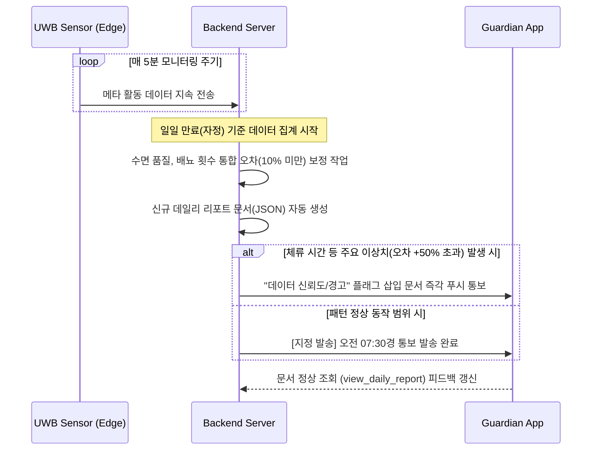
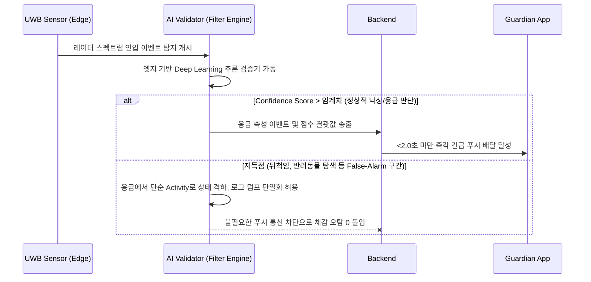
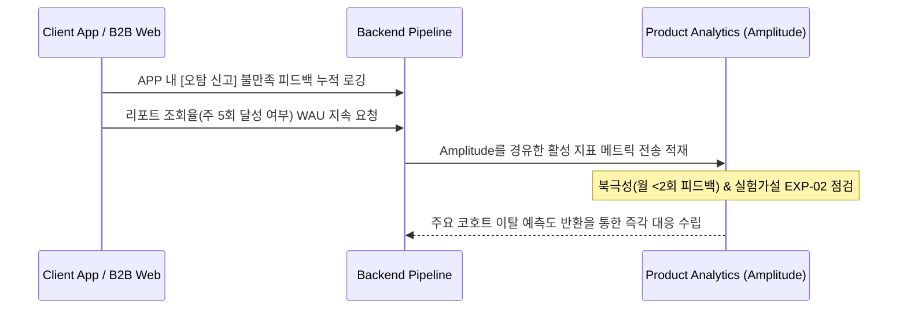
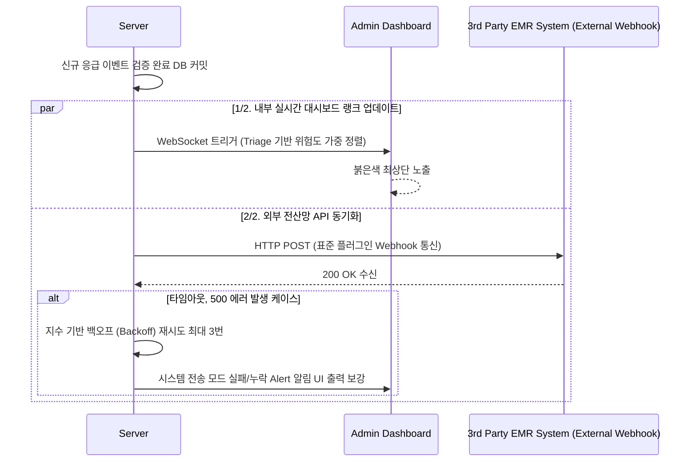
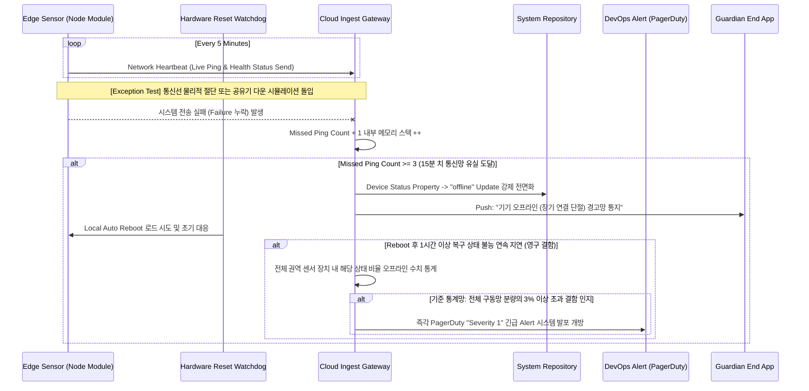

# Software Requirements Specification (SRS)
Document ID: SRS-001
Revision: 1.0
Date: 2026-04-18
Standard: ISO/IEC/IEEE 29148:2018

-------------------------------------------------

## 1. Introduction

### 1.1 Purpose
본 SRS의 목적은 비접촉 AI 앰비언트 홈 안전 솔루션 'Rooted'에 대한 완전하고 추적 가능한 요구사항을 명세하여, 개발 조직이 B2B, B2G, B2C 시장의 미충족 수요(Unmet Need)를 해결하는 최소기능제품(MVP)을 구현하도록 안내하는 것이다. 특히 모션 센서 기반의 시스템에서 발생하는 빈번한 오탐(하루 평균 12건)을 제로화(Zero-Friction)하고 야간 낙상으로 인한 인명 피해를 방어하며, 데일리 리포트를 통해 지속적인 웰니스 가치를 제공하는 데 중점을 둔다.

### 1.2 Scope (In-Scope / Out-of-Scope)
본 시스템은 UWB 레이더 기반의 비접촉 생체 신호 모니터링 기능과 클라우드 기반 관제 시스템을 제공한다.
- **주요 목표(Desired Outcome)**
  - 월간 사용자 체감 오탐 빈도 가구당 2회 이하 달성 (시스템 허용 상한 월 0.3건)
  - 사용자 기기 직접 조작 횟수 0회 (Zero-Friction)
  - 수면 및 화장실 체류 시간 분석 오차율 10% 미만
  - B2B 환경의 EMR 이중 수기 기록 완전 제거
- **In-Scope (범위 내)**
  - UWB 레이더 하드웨어 연동 및 비접촉 센서 데이터 처리
  - 오탐 제로화 AI 필터링 엔진 (엣지단 딥러닝 추론)
  - B2C 보호자용 모바일 애플리케이션 (MVP: iOS 우선 지원, Android 단말은 Wave 2 고려)
  - B2B 관제 웹 대시보드 및 EMR 전송용 Webhook 구축
- **Out-of-Scope (범위 외)**
  - 조명 및 가전 제어를 포함한 스마트홈 제어 연동 플랫폼 개발
  - 서비스 명칭 및 앱 UI 내 '노인/치매/돌봄/환자' 등의 마케팅 언어 노출
  - 최저가 기반의 B2G 공공조달 전용 SLA 인프라 확충 (론칭 후 SOM S1 세그먼트 침투 후 Q4 재검토)

### 1.3 Definitions, Acronyms, Abbreviations
- **UWB (Ultra-Wide Band) 레이더**: 카메라 없이 전파를 이용해 호흡, 심박, 동선을 추적하는 비영상 센서.
- **Zero-Friction (무마찰)**: 사용자가 충전, 착용, 버튼 작동 등의 신체적/인지적 개입 없이 시스템이 알아서 동작하는 상태.
- **JTBD (Jobs to be Done)**: 사용자가 특정 상황에서 완수하고자 하는 과업이나 달성하려는 궁극적 목표.
- **AOS (Adjusted Opportunity Score)** / **DOS (Discovered Opportunity Score)**: 잠재 고객 인터뷰를 통해 확인된 기회 점수로, 미충족된 사용자 니즈를 정량적으로 식별하는 지표.
- **Validator (검증자)**: AI가 도출한 이벤트 및 시스템 전반의 정확도를 판별하는 역할을 수행하는 모듈 기반 로직 체계.
- **False Alarm (오탐)**: 위급 상황이 아님에도(예: 이불 뒤척임) 시스템이 긴급 상황으로 오인하여 알림을 발송하는 현상.

### 1.4 References (REF-XX)
- **REF-01 (Market Data)**: 한국보건산업진흥원(KHIDI) 국내 시니어케어 시장 전망 (2030년 168조 원 규모) 및 TAM-SAM-SOM 도출 근거 통계.
- **REF-02 (VoC Report)**: 기존 저가 모션 센서 사용자 그룹, 웨어러블 이탈 그룹, 미사용 탐색 그룹 대상 JTBD VoC 원문 분석.
- **REF-03 (Extreme Case Data)**: 장영희 사례 기반 '오탐 피로도로 인한 시스템 무시 -> 요양원 사망사고' 근본 원인 도출 타임라인 보고서.

### 1.5 Constraints and Assumptions
- **Constraints (제약사항 / ADR 기반 통합 결정 사항)**
  - 본 기기는 식약처 인허가 이슈 발생 위험(R-01)을 회피하기 위해 진단용이 아닌 '라이프케어/웰니스용'으로 UI와 기능 명세가 우회 설계되어야 한다. `medical`, `diagnosis`, `patient` 등의 단어는 시스템 전 구간에서 사용이 엄격히 금지된다.
  - 대형 요양병원 커스텀 구축에 따른 SI 전락 위험(R-04)을 타개하기 위해 점유율 1위 EMR 벤더와 전략적 제휴를 맺으며, 이외 개별 커스텀 구축 요청은 허용하지 않고 '표준 플러그인(Webhook)'으로만 연동을 제한한다.
  - 개인정보 보호법 위반 리스크(R-02) 대응으로 물리 레이더 파형을 클라우드에 직접 전송하지 않고 엣지에서 비식별 이진 데이터 및 수치로 변환 후, HTTPS TLS 1.3 암호화를 통해야만 서버에 저장된다.
- **Assumptions (가정)**
  - UWB 칩셋 부품의 글로벌 공급망(NXP/Infineon 등)이 원활하게 유지되어 하드웨어 대량공급이 가능하다.
  - 침실 천장 1개, 화장실 문 1개를 동시 부착하는 1실 1센서 기초 패키지로 사용자 활동 반경을 충분히 커버한다는 실증이 오픈 베타 4주 차에 성공적으로 확인된다.

---

## 2. Stakeholders

| Stakeholder Name | 역할 (Role) | 책임 (Responsibility) | 관심사 (Interest) |
| :--- | :--- | :--- | :--- |
| **박지수 (Core)** | 원격 보호자 | 어르신 거처에 기기 모듈 세팅 및 구독 운영, 긴급 알림 발생 시 119 통보 등 최종 대응 | 비접촉 기반(충전 방치 이슈 없음) 무마찰 모니터링, 체감 오탐 스트레스 없는 구동 신뢰, 일상 데이터를 통한 조기 징후 확인 |
| **정민석 (Adjacent)**| B2G 지자체 조달관 | 관할 지역 공공 예산 분배를 통한 독거/취약 계층 홈 시스템 교체 및 배포 | 저가입찰 부작용인 오탐 문제 해결 확인, 허위 출동 감소 여부, 도입 단가 대비 효율 극대화 및 지표 증명 |
| **장영희 (Extreme)**| 소송 가족대표 및 요양 수요층 | 요양 인프라의 과실 위험 배제 검증 요구, 타 시설 이전 결정 | 사고 상황의 진상을 입증할 90일 이상의 이벤트 데이터 무결성 보존, 관제 근무자의 피로를 야기하지 않는 시스템 도입 여건 |
| **요양기관 시설 관리자**| B2B 시스템 관리자 | 시설 전체 병상에 설치된 안전 모듈 관리, 외부 EMR 동기화 체계 모니터링 | 야간 소수 근무 인원 업무 하중의 합리적 완화, EMR 기록 이중 생성 방지, 응급 순위(Triage) 기반 명확한 상황 제공 |
| **고태식 (Non-user)** | 관측 대상 노인층 | 가족 권유에 수동적으로 모니터링의 피관측 상태 수용 | 자신을 "보호 및 감시"의 대상으로 한정 짓는 CCTV나 프라이버시 침해 도구, 불편한 착용형 도구의 개입에 대한 강력한 저항 |

---

## 3. System Context and Interfaces

### 3.1 External Systems
- **요양시설 외부 EMR 시스템 (3rd Party EMR)**: Rooted 서버에서 발생시켜 전송하는 응급 및 패턴 데이터를 수신하여 자체 전산 DB에 적재하는 외부 의존망.
- **FCM (Firebase Cloud Messaging) / APNs**: 모바일 단말기로 사용자의 긴급 알림, 예약된 데일리 웰니스 패턴 리포트를 실시간으로 밀어 보내는 클라우드 중계 서비스 시스템.

### 3.2 Client Applications
- **B2C 보호자 애플리케이션 (iOS)**: 보호자가 제품 설정 관리, 센서와 단말기 연결, 데일리 수면/배뇨 리포트를 확인하고 오탐 신고(Feedback)를 발행하는 모바일 앱 클라이언트.
- **B2B 관리 대시보드 웹 (Web Admin View)**: 요양 시설 관리자가 수백 개의 센서 상태를 신호등과 시계열 구조로 확인하며 위급 Triage 랭킹을 관제하는 기능성 웹 SPA.

### 3.3 API Overview

| API Name | Type | Description | Security / Format |
| :--- | :--- | :--- | :--- |
| **엣지 → 클라우드 인제스트 API** | Inbound | 디바이스 단말로부터 비식별 처리된 각종 활동 인덱스와 파형 추론 메타 상태를 송신 허용 | TLS 1.3 / Batch JSON |
| **FCM / APNs 푸시 API 발송** | Outbound | 분석 파이프라인에서 추출된 에러 혹은 정상 리포트를 보호자 앱 푸시 식별 토큰으로 전송 | High Priority JSON HTTP |
| **EMR Webhook 연동 발송단** | Outbound | B2B 모드 한정으로 응급 이벤트가 발생하면 즉각 1위 EMR 벤더 표준에 맞추어 POST 발송 | HTTP POST / HMAC 서명 |

### 3.4 Interaction Sequences (핵심 시퀀스 다이어그램 머메이드 차트 포함)

*(기존 템플릿의 형식을 유지하되, 내용상 AmbieCARE 도메인에 부합하는 형태로 반영)*

#### 3.4.1 문서 자동 생성 시퀀스 (데일리 웰니스 리포트 문서 자동 발송)
사용자의 체류와 수면 맥락을 시스템 단에서 데이터화하여 "리포트 문서(Report Document)"로 생산하는 시퀀스이다.



#### 3.4.2 검증기(Validator) 실행 시퀀스 (오탐 제로화 AI 필터링 실행)
UWB 파형 데이터 간섭을 방어하기 위해 진짜 낙상과 동물/활동 등 단순 노이즈를 식별하는 Validator 시퀀스이다.



#### 3.4.3 PMF(Product-Market Fit) 진단 시퀀스 (활성 리텐션 지표 추적)
도입 사용자들의 체감 목표(PMF 정합성)를 실시간 메트릭으로 평가하기 위해 시스템 이탈/유지 이벤트를 집계하는 구조이다.



#### 3.4.4 노션/지라(Notion/Jira) 동기화 시퀀스 (외부 EMR 전산망 자동 연동 시퀀스)
외부 협업 도구와의 외부망 동기화(Sync) 아키텍처를 도입하여 시스템 알림 시 EMR 전산망으로 안전하게 밀어넣는 체계이다.



### 3.5 Use Case Diagram

```mermaid
usecaseDiagram
  actor "보호자 (App User)" as C
  actor "요양시설 관리자 (Admin)" as M
  actor "UWB 센서 디바이스" as S
  actor "EMR 백엔드 시스템" as EMR

  package "AmbieCARE (Rooted) System Framework" {
    usecase "환경 파형 감지 및 오탐/무호흡 검증" as UC1
    usecase "AI Validator 판정 알림 발송" as UC2
    usecase "동선 시간 등 웰니스 패턴 통계 추적" as UC3
    usecase "주/일간 기반 데일리 리포트 시각적 확인" as UC4
    usecase "응급 병상 위험 기반의 Triage 모니터링" as UC5
    usecase "Webhook 전송 및 이중 문서 대체 기재" as UC6
  }

  S --> UC1
  S --> UC3
  UC1 --> UC2
  UC3 --> UC4
  C --> UC4
  C --> UC2
  M --> UC5
  M --> UC2
  UC2 --> UC6
  UC6 --> EMR
```

---

## 4. Specific Requirements

### 4.1 Functional Requirements (기능 요구사항 테이블)

| ID | Title / Statement | Source | Acceptance Criteria (Given / When / Then) | Priority (MoSCoW) |
| :--- | :--- | :--- | :--- | :--- |
| **REQ-FUNC-001** | **오탐 제로화 AI 필터링 실행**<br>센서 엣지단에서 이불 뒤척임/반려동물을 필터링하여 오작동 응급 프로세스를 차단한다. | Story 1 / FR-01 | **Given** 시스템이 정상 구동되는 실내 측정 중<br>**When** 이불 뒤척임 또는 작은 애완동물의 산발적 이동 모션이 잡힐 경우<br>**Then** 위급 시그널로 착각하지 않고, 오탐률 월 0.3건 이하 상한선 체계를 통과한다. (정확도 확인) | **Must** |
| **REQ-FUNC-002** | **비접촉 무마찰 센싱 (Zero-Friction)**<br>어떠한 웨어러블류의 결속 없이 거주자 생체 이벤트를 스캐닝 처리한다. | Story 1 / FR-02 | **Given** 기기가 사용자의 침실과 벽면에 각기 부착 완료된 상태에서<br>**When** 노인이 모든 일상생활 주기 패턴을 거칠 때<br>**Then** 명시적인 충전/조작/제어(Button 등) 횟수가 최종적으로 0회로 귀결된다. | **Must** |
| **REQ-FUNC-003** | **낙상 긴급 푸시 전송**<br>실제 긴급 낙상 신호 시 보호자 모바일 채널로 응급 상황을 즉시 넘긴다. | Story 1 / FR-01 | **Given** 심장 무호흡 및 바닥 안면 낙상 후 5분 이상 이탈 불가 케이스 발생 시<br>**When** Validator에서 이벤트 위험성을 도출 확정하면<br>**Then** 관련 보호자의 앱 토큰으로 60초 이내에 명확한 푸시 문구가 노출 배달된다. | **Must** |
| **REQ-FUNC-004** | **데일리 웰니스 패턴 리포트 자동 생성**<br>일간 수집된 배뇨, 수면 패턴 메트릭을 집계하여 아침 일간 정보로 발행한다. | Story 2 / FR-05 | **Given** 24시간 동안 수집된 비식별 센서 메타데이터가 덤프되었을 때<br>**When** 당일 리포트 집계 파이프라인이 정해진 새벽 시간에 구동 완료되면<br>**Then** 오차율 10% 미만의 정밀도를 보장하는 수면 및 체류 정보 문서가 생성된다. | **Should** |
| **REQ-FUNC-005** | **비정상 패턴 조기 경고 리포트 발송**<br>사용자의 체류량 등이 평균치 상한 임계점을 허물 경우 경고성 정보를 노출한다. | Story 2 / FR-05 | **Given** 야간 어르신의 평균 활동 체류 임계치가 세팅되어 있는 환경에서<br>**When** 신규 데이터가 그 평균치의 50%를 초과하는 비정상적인 체류율을 보이면<br>**Then** 데이터 신뢰도 저하/건강 경고성 플래그를 부착한 특수 일간 리포트를 생성 발송한다. | **Should** |
| **REQ-FUNC-006** | **장기결측(No-data) 예외 필터링**<br>외박, 입원 등의 환경에서 무의미한 데이터를 0점 체계로 기입하지 않고 상태로 치환한다. | Story 2 / FR-05 | **Given** 대상 어르신이 24시간 이상 센서 인식 범주를 온전히 벗어난 부재 상태일 때<br>**When** 서버 기준 데일리 문서 파이프라인이 집계를 시도하려 하면<br>**Then** 통계에 영향을 주는 제로점수 집계를 멈추고 "체류 데이터 수집 부족" 상태 Null 예외로 치환하여 안내한다. | **Should** |
| **REQ-FUNC-007** | **B2B 대시보드 리스크 순위 Triage 뷰**<br>수백 명 이상의 시스템 관리 차원에서 발생 위험도를 선순위로 강제 정렬한다. | Story 3 / FR-04 | **Given** 야간의 관제 시설 관리자가 하나의 웹 대시보드를 주시하는 경우<br>**When** 3개 이상의 다원화된 병상에서 모션/응급 알람이 동시다발적으로 들어오면<br>**Then** 백엔드가 위험도 우선순위(Triage) 목록을 측정, 최상위 위험군부터 리스트 최상단 노출 및 진동음향 신호 강화를 부여한다. | **Must** |
| **REQ-FUNC-008** | **EMR Webhook 자동 연동**<br>검증된 이벤트를 EMR망에 다이렉트 전송하여 중복성 입력 업무를 폐지한다. | Story 3 / FR-04 | **Given** EMR 전송 세팅이 유효화된 B2B 시스템 서버 인프라 망 내에서<br>**When** 이벤트 응급 발생 내역이 정식으로 관리 DB 스토리지에 올라가면<br>**Then** 외부에 지정된 EMR Webhook 수신처로 관련 JSON을 무조건 통보 발송하여 관리자의 직접 입력 가능성을 물리적으로 제한한다. | **Must** |
| **REQ-FUNC-009** | **장기 데이터 로그 무결성 관리 / 열람**<br>이벤트 발생 내역을 B2B 관리자가 소급 열람 기능을 통해 자유롭게 확인할 수 있다. | Story 3 / FR-04 | **Given** 모 요양원에서 낙상 관련 소송 이슈나 관리 증명 책임 건이 발동되었을 때<br>**When** 시설장/관리자가 이벤트 이력 조회 페이지를 통하여 검색을 구동시키면<br>**Then** 소실 없이 최소 과거 90일 구간의 데이터 로그를 투명하게 열람 제공한다. | **Must** |
| **REQ-FUNC-010** | **수면 트렌드 변화 시각 그래프 도출**<br>기존 데일리 리포트 기록들을 시계열 차트로 합쳐 제공한다. (1 스프린트 추정) | Story 2 / FR-06 | **Given** 연속된 7일 치 이상의 데이터 기록이 누적된 계정에서<br>**When** 앱 인터페이스 내 수면 점수 트렌드 시각화 탭으로 진입 시<br>**Then** 변화 추이를 한눈에 직관적으로 파악할 차트를 로딩 노출하여 보존 가치를 높인다. | **Could** |
| **REQ-FUNC-011** | **MMS/카카오톡 채널 이중화 발송**<br>네트워크 푸시의 한계를 대비하는 SMS 외부 채널 발송을 곁들인다. (1 스프린트 추정)| Story 1 / FR-07 | **Given** 모바일 폰 3G/LTE 대역 차단 및 푸시 설정이 꺼진 보호 환경 내에서<br>**When** 부모님의 긴급 낙상 신호가 서버로 유입되어 통보가 발의될 때<br>**Then** 앱과 별개로 지정 전화번호 체계로 SMS 텍스트/카카오 알림톡을 지연 없이 백업 전송한다. | **Could** |
| **REQ-FUNC-012** | **B2B 관리 대시보드 맞춤형 층/구역 필터**<br>다수 층수와 방대한 동별 분산을 관리하기 위한 추가 옵션 구축. (1 스프린트 추정)| Story 3 / FR-08 | **Given** 100인 수용 이상의 다층 구간 요양 시설 대시보드 뷰 상에서<br>**When** 당직자가 자신에게 속한 관리 계층(예: 2동 B구역)으로 토글 필터를 걸면<br>**Then** 선택 구역 내의 이벤트와 신호등 모션만 필터링 출력되어 관리 시야 각도를 집중시킨다. | **Could** |

### 4.2 Non-Functional Requirements (비기능 요구사항 테이블)

| ID | Category | Requirement Description | Threshold / Measurement Criteria (Metric) | Source / Proof |
| :--- | :--- | :--- | :--- | :--- |
| **REQ-NF-001** | Performance | **긴급 시스템 응답 레이턴시 한계**<br>낙상 감지로부터 최종 보호자 모바일 기단까지의 골든타임 도달 시스템 속도 보전 | **p95 ≤ 2,000 ms**. (Datadog APM 모니터링 적용 중 2,500ms 상회 관측 시 즉시 Slack #ops-alert 자동 채널 경고망 발송 포함) | NFR-01 |
| **REQ-NF-002** | Precision | **오탐 제로화 임계 비율 상한 보장**<br>환경 노이즈 필터링 실패율의 전면 억제를 통한 사용자 해지 방어 달성 | 매월 가구당 기계적 오퍼 상한선 목표율 **≤ 0.3건 달성** 및 사용자 최종 앱 신고 통제 **≤ 2회 유입 만족도** | NFR-02 |
| **REQ-NF-003** | Precision | **패턴 통계 산출 허용 마진(Error Rate)**<br>화장실 이동과 실제 침대 체류를 구분 짓는 논리 기반의 데이터 정확도 방증치 도출 | 파일럿 테스터의 Ground-Truth 기록부 대조 결과 **양자간 오차율 ≤ 10% 미만** 증명 충족 | NFR-03 |
| **REQ-NF-004** | SLA | **클라우드 서비스 가동성 목표치**<br>인프라 환경 결함 등의 장애 허용 내성 보전 및 중단 최소화 한계 설정 | 상시 클라우드 가동률 **≥ 99.9%** (월 누적 허용 다운타임 한도 43.8분. Datadog Uptime 모니터 5분 검증기 활용) | NFR-04 |
| **REQ-NF-005** | Reliability | **통신 지연 파괴 및 손실 내구성**<br>하위 종단 센서-게이트웨이 간 패킷 네트워크 증발 비율 통제 | 일간 합산 통신 패킷 재전송 과정상의 영구 유실 허용치 **≤ 0.1% 도달 유지** | NFR-05 |
| **REQ-NF-006** | Security | **민감 생체 정보 암호화 및 비식별 체계**<br>개인정보 및 의료 법률 체계 침해를 규제하기 위한 보안 인증 감사 의무 충족률 | 시스템 파형 원문 수집 전면 배제. 정보는 모두 이진/수치 체계 변환 관리. **(수시 TLS 1.3 암호, 연 1회/분기 1회 PT 침투 외부 보안 감사 점검)** | NFR-06 / NFR-07 |
| **REQ-NF-007** | Cost | **클라우드 인프라 유지 단위 단가**<br>데이터 전송 폭주로 인한 인프라 비용 적자 전환 예방 장치 및 임계 구간 점검망 | 가구 당 부과 통제비용 **Limit 월 500원 이하**. AWS Cost Explorer 조회분 600원 오버슈트 관측 시점 시 개발 실무진 #cost-alert 슬랙 전송 필 트리거 | NFR-08 |
| **REQ-NF-008** | Archiving | **장기 데이터 로그 이중 아카이빙 유지력**<br>법동 분쟁 소지가 큰 극단 이벤트 내역 증명을 위한 Hot / Cold 보존 정책 | 1차 클라우드망 이벤트 로그 기록 **90일 보존** 확정. 유효 구간 경과 후 AWS Glacier 스토리지로 변경, **최소 3년 Cold Storage 보관** 준수 | NFR-10 |
| **REQ-NF-009** | Scalability | **이벤트 트래픽 부하 증가 내성 보강**<br>동시 다발성 엣지 디바이스 통신 및 B2C 인입 증가 상황 속 안정화 지표 측정 | JMeter 등을 통한 동시 접속 부하테스터 상 **1,000 센서 동접 허용량 상회 및 TPS 레이턴시 최대 지연폭 ≤ 500ms** 검증 필 달성 요망 | NFR-14 |
| **REQ-NF-010** | Monitor | **다운타임 대형 장애 신호 수발신 파훼 구조**<br>시스템 먹통 상황 대응을 위한 데몬 감지 모니터 인력 즉각 투입 대응 체계 마련 | 현존 구동 센서 엣지 중 **3% 이상의 분량이 일괄 동시 오프라인** (통신 실패) 판정 시점 시 PagerDuty 앱 Severity 1 콜 개발팀 전원 발송 (1시간 내 복구 시작) | NFR-13 |
| **REQ-NF-011** | KPI | **어르신 직접/물리 관여 제로 달성율 유지**<br>무마찰 센싱의 초기 론칭 마찰력을 측량하기 위한 CS 발생 티켓 누적 상한 지표 | 월간 앱 론치 개기 후 "설치 충전 제어 불만 및 마찰/거부 사유"에 할당된 취소 티켓 발생 비율 누적 **0건 유지 필수 과제 증명** 획득 | EXP-03 |
| **REQ-NF-012** | KPI | **기능 잔존 만족성(PMF) 입증 활성자 검증**<br>"안전 시기 무보상" 상태를 돌파하기 위한 데일리 통계 앱 가치 효용성 메트릭 기준 | 전체 Wave 2 오픈 B2C 참여단 기준 활성비율(WAU) 점검 시 **리포트 주간 5회 초과 열람 군의 비율이 가입자의 전체 60% 이상** 유지되어야 함 달성 | EXP-02 |

---

## 5. Traceability Matrix

위에서 정의된 스토리가 최종적으로 코드 단위로 구축되어 어떠한 테스트로 검증되는지 증명하는 추적성 목록이다.

| Original Story / PRD Goal | Requirement ID | Requirement Type | Test Case ID | Test Case Execution Overview (Summary) |
| :--- | :--- | :--- | :--- | :--- |
| **Story 1 (안심/지속성)** | REQ-FUNC-001 | Functional | TC-FUNC-001 | Mock 환경 하 모션 더버깅 구동 시 이불 강제 흔들기 시뮬레이션 적용, 응급 앱 알림 미발송 여부 교차 검증 통과 |
| **Story 1 (안심/지속성)** | REQ-FUNC-002 | Functional | TC-FUNC-002 | 테스터 물리 환경 조성 후 7일 연속 인위적 조작(충전 등) 미적용 하에 기능 모션 전 구간 데이터 발현 확인 달성 |
| **Story 1 (안심/지속성)** | REQ-FUNC-003 | Functional | TC-FUNC-003 | 시스템 시야각 앞 응급 바닥 위치 포지셔닝 타임라인 도달 후, 관리자 모바일로 수신된 패킷 시간차 End-To-End 60초 미만 측정 |
| **Story 2 (데이터 예방)** | REQ-FUNC-004 | Functional | TC-FUNC-004 | 취침-기상 지정 시간 더미 데이터 주입 인자 생성 후, 백엔드 자정 Cron 렌더링 시 데일리 문서 점수 10% 정밀도 내외 정상 수집 측정 완료 |
| **Story 2 (데이터 예방)** | REQ-FUNC-005 | Functional | TC-FUNC-005 | 대상자 화장실 타임 데이터 상한 임계선을 50% 직접 수동 오버라이딩 시, 즉각 데이터 경고 플래킹 쿼리 및 통지 로드가 자동 활성/배송 여부 체크 |
| **Story 3 (효율성 B2B)**| REQ-FUNC-007 | Functional | TC-FUNC-006 | 동시다발 5개 센서 단말망 위험 인자 유입 후, 신호등 시스템 Triage 화면이 위험도 산정 기준으로 병상 1순위 상향 변경 및 이펙트 유무 시연 검증 |
| **Story 3 (효율성 B2B)**| REQ-FUNC-008 | Functional | TC-FUNC-007 | 외장 Mock EMR Webhook 수신기를 준비 후 백엔드로 응급 이벤트 주입. 2초 내 외장 수신기에 HTTP Body Payload 기록 및 200 반환 인지 여부 점검 |
| **Story 3 (효율성 B2B)**| REQ-FUNC-009 | Functional | TC-FUNC-008 | DB Archive 시스템 내에 89일 단위 Timestamp 이벤트 기록 스파이크 생성 후 B2B 관리 쿼터 API에 페이지 로딩 성공 산출 값 체크 검증 수행 |
| **PRD §5. NFR KPI 속성** | REQ-NF-001 | Non-Functional | TC-NF-001 | End-to-End 이벤트 왕복 Latency를 10,000회 오토 레이턴시 송수신 실행 통과시켜, 결과물 p95 지연 속도가 2,000ms 이하에 머무르는지 자동 부하 점검 |
| **PRD §5. NFR KPI 속성** | REQ-NF-009 | Non-Functional | TC-NF-002 | Apache JMeter 서버 리소스를 거쳐 초당 동시 접속량 1K 트래픽 분량의 이벤트를 삽입 후 노드 타임아웃, DB 병목 현상 전면 무결 유지 상태 도달 점검 |

---

## 6. Appendix

### 6.1 API Endpoint List

MVP 시스템 구성 체계 간 원활한 네트워크 제어를 뒷받침하는 메인 엔드포인트들의 필수 인터페이스.

| API Endpoint URI | Method | Header / Auth Security | Payload / Request Constraints | Expected Behavior |
| :--- | :--- | :--- | :--- | :--- |
| `/api/v1/sensors/ingest` | POST | 엣지 발급 TLS Client Cert | `device_id` (UUID), `event_type`, `meta_metrics` | 비식별 레이더 정보를 서버 측 데이터 파이프라인으로 안전 업로드 저장 및 Batch 인덱스 추가 |
| `/api/v1/pushes/send_alert`| POST | 구글 계정 FCM Server Key | `user_id`, `critical_level`, `push_body_payload` | 클라우드 서비스(FCM/APNs)를 통해 모바일 단말기로 직접 긴급 통보 및 시스템 렌더 발동 호출 |
| `[EMR_PROVIDER_URL]/sync` | POST | 규정 HMAC-SHA256 Sig | `patient_zone`, `event`, `confidence` | 해당 병상이 보유한 요양시설 외장 EMR 시스템 백엔드에 즉각 메타 정보를 밀어 넣고 200 회신 보전 |
| `/api/v1/reports/daily` | GET | Bearer Auth Token (JWT)| `device_id` (UUID), `date` | 당일을 기점으로 묶인 환자의 데일리 수면 활동 점수, 배뇨 횟수 및 모니터링 경고/오류 상태를 앱이 조회 |
| `/api/v1/events/archive_qa`| GET | RBAC (Admin 권한 인가) | `start_date`, `end_date`, `facility_b2b_id` | 소속 권한 내 B2B 요양 관리자가 특정 기간(과거 최장 90일 치) 긴급 상황 기록 및 로그를 무결성 소급 열람 |

### 6.2 Entity & Data Model (테이블 명세)

| Entity Structure 명칭 | Field (Column) 명 | Constraint (제약조건) | DB Data Type | Entity Description |
| :--- | :--- | :--- | :--- | :--- |
| **SensorDevice**<br>(센서 메타 관리)| `device_id`<br>`location_zone`<br>`firmware_version`<br>`installation_date`<br>`status` | Primary Key<br>Enum(bedroom, bathroom..)<br>Nullable String<br>Past Limit Date<br>Enum(active/inactive) | UUID<br>STRING<br>STRING<br>DATETIME<br>STRING | 모든 통신과 기록의 노드로 취급되는 UWB 기기 펌웨어 추적 및 배포, 시설 관제 구역을 식별하는 고유 디바이스 베이스. |
| **WellnessEvent**<br>(응급 및 웰니스 이력)| `event_id`<br>`device_id`<br>`event_type`<br>`confidence_score`<br>`is_false_alarm`<br>`timestamp` | Primary Key<br>Foreign Key(Sensor)<br>Enum(activity, emergency..)<br>Limit(0~1.0)<br>Default Parameter (false)<br>Time Index | UUID<br>UUID<br>STRING<br>FLOAT<br>BOOLEAN<br>DATETIME | 낙상 등 긴급 사항 이벤트, 뒤척임 등 일반 이벤트 결과 값 스코어, 사용자 피드백인 오탐 집계 플래깅을 중앙 기록화하는 로그 스토리지. |
| **UserAccount**<br>(관제 및 보호자 계정)| `user_id`<br>`role`<br>`notification_pref`<br>`linked_devices[]` | Primary Key<br>Enum(guardian, admin)<br>Json Data Blob<br>Array Map (Foreign Key) | UUID<br>STRING<br>JSON<br>UUID Array | 시스템을 열람하는 가족 또는 B2B 관제 관리자들의 포괄적 계정 등급과 디바이스 기구들을 1:N으로 연결/통치하는 최상위 등급 관리 객체. |
| **DailyReport**<br>(데일리 집계 통계)| `report_id`<br>`device_id`<br>`date`<br>`sleep_score`<br>`bathroom_count`<br>`anomaly_flags[]` | Primary Key<br>Foreign Key(Sensor)<br>Index Key<br>Score Range(0~100)<br>Positive Num<br>Null Array Element | UUID<br>UUID<br>DATE<br>INT<br>INT<br>STRING Array | 데일리 리포트를 도출하여 보호자 모바일로 제공되는 시계열 기준 집계본으로, 건강 점수 및 데이터 이탈 신뢰도 오류 사항을 관리하는 병합 객체. |

### 6.3 Detailed Interaction Models

**상세 시퀀스 다이어그램 (엣지 네트워크 장애 보정 프로세스 체계 연계도)**
시스템 내 네트워크 중단, 15분 이상의 미응답 등의 예외 상황을 예지하여 NFR-10 요구사항을 충족시키고 B2B 관리망에 신속하게 응급 처리를 전달하기 위한 PagerDuty 발송 로직 포함의 상세 다이어그램.


