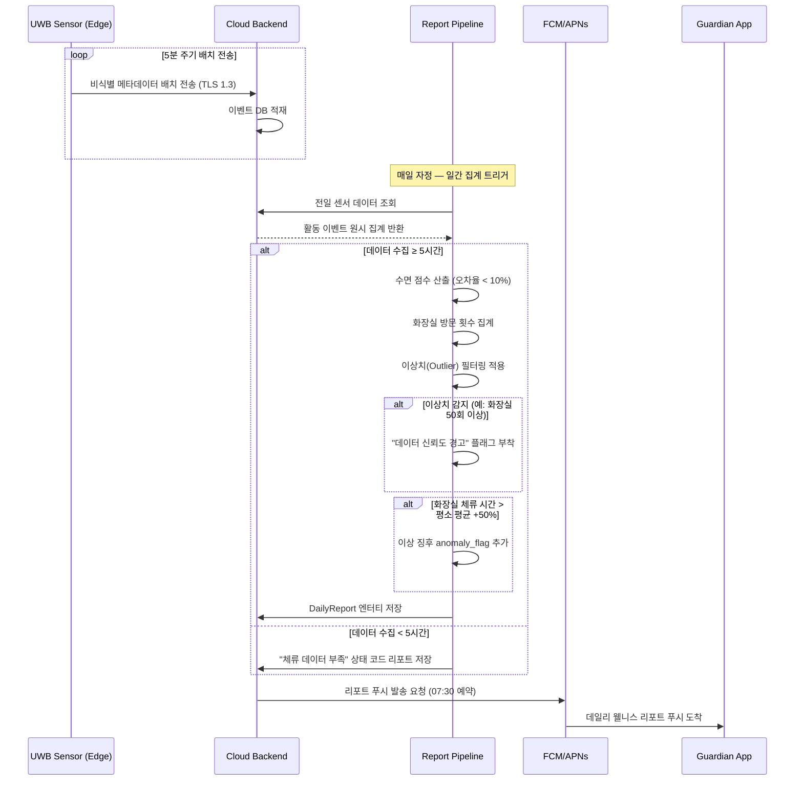
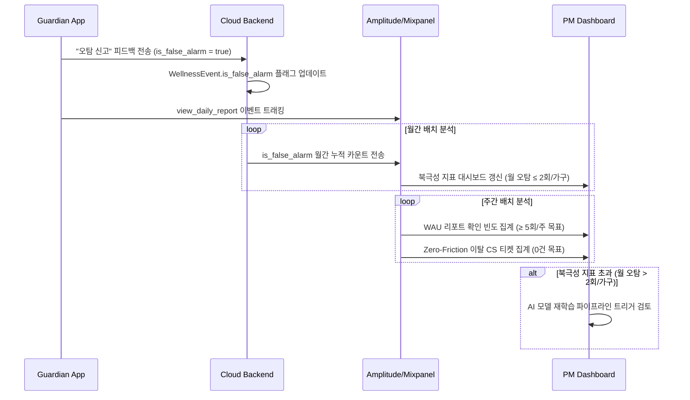
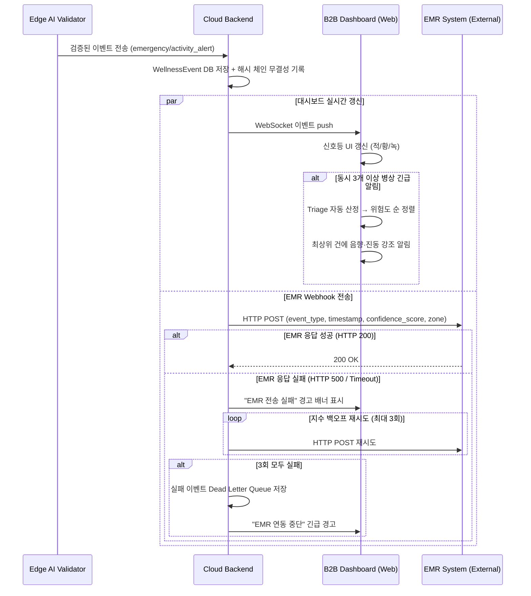
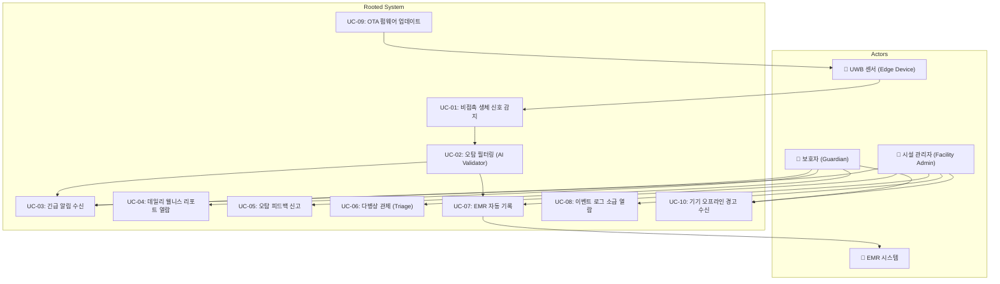
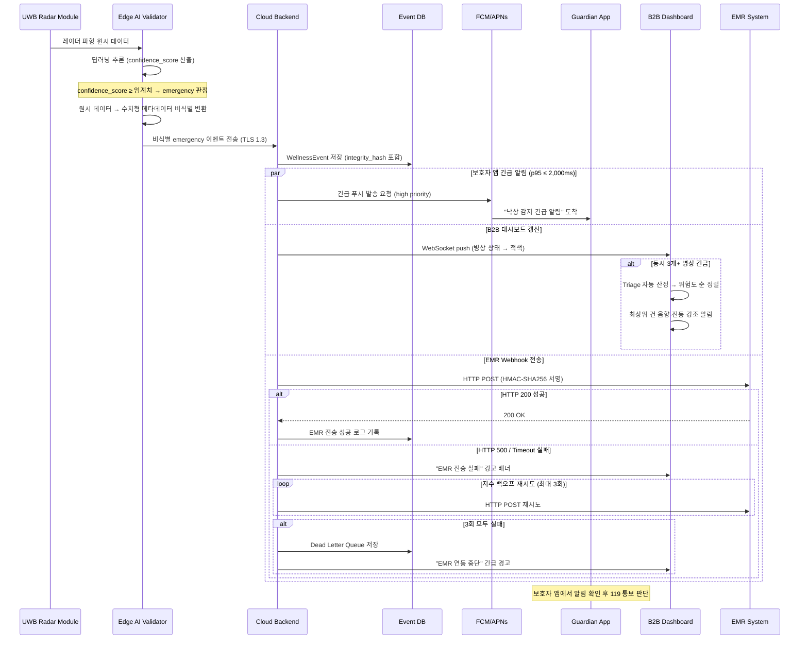
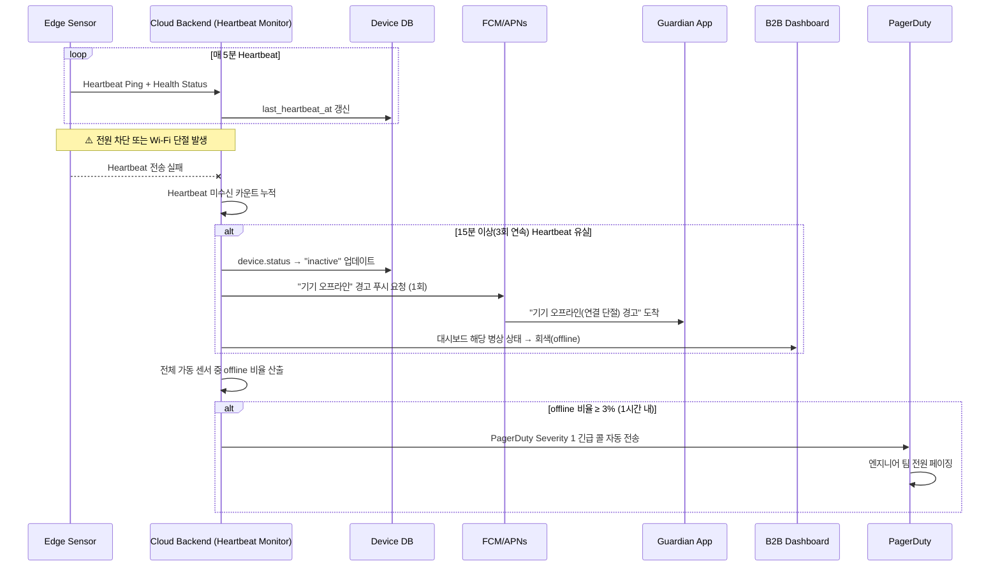
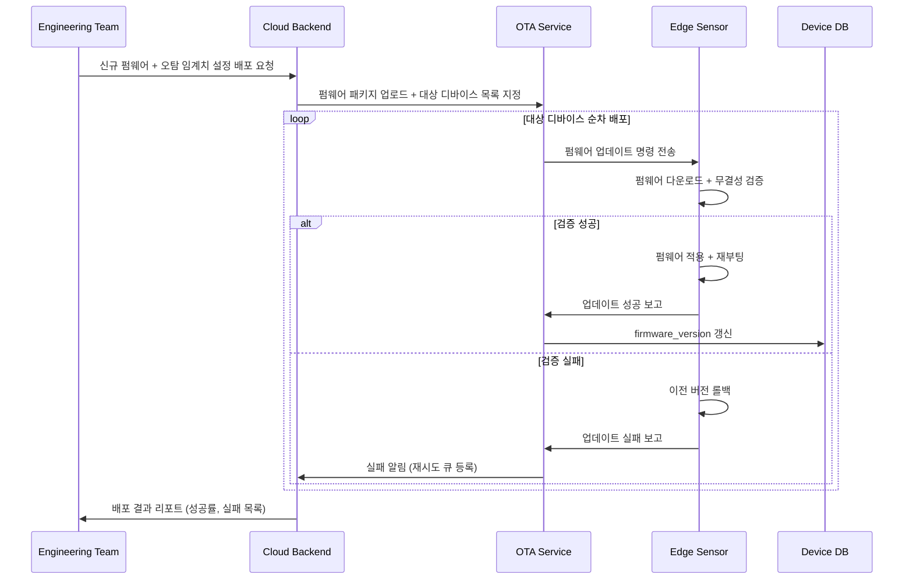

# Software Requirements Specification (SRS)

Document ID: SRS-001  
Revision: 1.0  
Date: 2026-04-18  
Standard: ISO/IEC/IEEE 29148:2018

---

## 1. Introduction

### 1.1 Purpose

본 SRS는 비접촉 AI 앰비언트 홈 안전 솔루션 **Rooted**의 MVP(Minimum Viable Product) 소프트웨어 시스템에 대한 기능·비기능·인터페이스·데이터 요구사항을 ISO/IEC/IEEE 29148:2018 표준에 따라 정의한다.

**해결 대상 문제:**

비접촉 앰비언트 케어 시장은 B2B·B2G·B2C 세 관점에서 구조적으로 미충족(Unmet Need) 상태에 놓여 있다.

- **B2B (요양시설):** 저가형 모션 센서의 하루 평균 오탐 12건이 알람 피로를 유발하여, 당직 중 오탐 11건 누적 → 알람 무시 → 사망사고라는 최악의 시나리오가 현실화되었다. EMR 전산망과의 데이터 단절로 이중 기록 업무가 강제된다. (PRD §1.1, §1.7 장영희 Extreme 사례)
- **B2G (지자체):** 한정된 예산으로 돌봄 사각지대를 해소해야 하나, 고스펙 장비는 단가 초과이고 저스펙 장비는 응급 징후를 놓치는 비용-효용 딜레마에 직면한다. (PRD §1.5)
- **B2C (보호자):** CCTV는 프라이버시 침해, 웨어러블은 충전 방치로 사실상 무용화되어, 독거 부모의 위급 상황을 즉각 인지할 방법이 없는 극도의 불안감과 데이터 부재를 겪고 있다. (PRD §1.5, §1.7, §1.10)

본 SRS의 대상 독자는 개발팀, QA팀, 프로젝트 관리자, 외부 감사자이며, 본 문서는 설계·구현·테스트·검수의 공식 기준 문서로 사용된다.

### 1.2 Scope (In-Scope / Out-of-Scope)

**시스템명:** Rooted — 비접촉 AI 앰비언트 홈 안전 솔루션

**정량적 목표 (Desired Outcome):**

| 목표 | 현재 상태 (As-Is) | 목표 상태 (To-Be) | PRD 출처 |
| :--- | :--- | :--- | :--- |
| 월간 AI 엔진 오탐 빈도 | 하루 12건 (= 월 360건/가구) | ≤ 0.3건/월/가구 | §1.9, §2.2.2 |
| 월간 사용자 체감 오탐 빈도 (북극성) | 월 360건/가구 | ≤ 2회/가구 | §1.3 |
| 어르신 기기 조작 횟수 | 웨어러블 충전/착용 마찰 상시 | 0회 (Zero-Friction) | §1.9 |
| 야간 수면/화장실 패턴 오차율 | 데이터 부재 | 10% 미만 | §1.9 |
| 프라이버시 침해 | CCTV/홈캠 감시 거부 반응 | 비영상(비식별) 방식, 침해 제로 | §1.10 |
| B2B EMR 이중 기록 | 수기 + 시스템 이중 입력 | EMR 자동 연동, 이중 기록 0건 | §1.10, §3.1 |

**In-Scope:**

| 항목 | 설명 | PRD 근거 |
| :--- | :--- | :--- |
| UWB 레이더 HW 연동 | 카메라 없이 레이더 파형으로 동선/호흡/심박/체류 시간 센싱하는 비접촉 센서 모듈 | §2.2.1 |
| 오탐 제로화 AI 엔진 | 딥러닝 기반 엣지 추론 모델로 뒤척임/착석과 낙상/무호흡을 정밀 구분 | §2.2.2, DOS 3.8 |
| B2C 보호자 앱 | iOS 우선 (Android는 Wave 2 이후). 긴급 알림, 데일리 리포트, 오탐 신고 기능 | §2.2.3 |
| B2B 관제 대시보드 (웹) | 신호등 방식(적/황/녹) 다병상 관제 UI + EMR Webhook 연동 | §2.2.3 |
| 웰니스 데일리 리포트 | 수면 점수, 화장실 방문 횟수, 이상 징후 플래그를 매일 07:30에 자동 발송 | §3.1 기능5 |

**Out-of-Scope:**

| 항목 | 배제 사유 | PRD 근거 |
| :--- | :--- | :--- |
| 스마트홈 제어 연동 (조명/가전) | 안전이라는 핵심 가치를 희석. 아카라라이프 방식 배제 | §2.3 #1 |
| '케어/돌봄' 마케팅 언어 사용 | Non-user 고태식형 ~44–54만 가구의 '노인 낙인' 거부 반응 방지 | §2.3 #2 |
| B2G 공공조달 최저가 입찰 SLA 스펙 | 론칭 시점 무기한 지연 초래. SOM S1 세그먼트 침투 검증 후 Q4에 재검토 | §2.3 #3 |

### 1.3 Definitions, Acronyms, Abbreviations

| 용어 | 정의 |
| :--- | :--- |
| UWB (Ultra-Wideband) | 초광대역 무선 기술. 카메라 없이 전파 반사 패턴으로 호흡·심박·동선을 센싱하는 레이더 기반 기술 |
| Zero-Friction | 사용자(어르신)가 충전, 착용, 버튼 조작 등 일체의 수동 개입 없이 시스템이 자율 작동하는 UX 원칙 |
| False Alarm (오탐) | 위급 상황이 아님에도(이불 뒤척임, 반려동물 이동 등) 시스템이 긴급으로 오인하여 알림을 발송하는 현상 |
| JTBD (Jobs to be Done) | 사용자가 특정 상황에서 달성하고자 하는 과업 또는 목표를 중심으로 제품 니즈를 분석하는 프레임워크 |
| AOS (Adjusted Opportunity Score) | 기회 발견 인터뷰에서 산출된 보정 기회 점수. 중요도와 만족도를 가중하여 시장 기회 크기를 정량화 |
| DOS (Discovered Opportunity Score) | 인터뷰에서 발굴된 기회 점수. 기존 대안 대비 미충족 정도를 0–5점 스케일로 수치화 |
| CJM (Customer Journey Map) | 고객이 서비스를 인지·구매·사용·이탈하는 전 여정의 경험과 감정을 시각화한 분석 도구 |
| Triage | 동시다발 긴급 상황에서 위험도를 자동 산정하여 대응 우선순위를 결정하는 알고리즘 |
| Edge (엣지) | 센서 디바이스 자체에서 AI 추론을 수행하는 로컬 컴퓨팅 환경. 원시 데이터가 클라우드 전송 전에 처리됨 |
| OTA (Over-the-Air) | 무선 네트워크를 통해 디바이스 펌웨어를 원격 업데이트하는 방식 |
| EMR (Electronic Medical Record) | 요양시설의 전자 의무 기록 시스템 |
| Webhook | 특정 이벤트 발생 시 사전 등록된 외부 URL로 HTTP POST를 자동 전송하는 서버 간 통신 방식 |
| MoSCoW | 우선순위 분류 기법: Must / Should / Could / Won't |
| Heartbeat | 디바이스가 정상 가동 중임을 서버에 주기적으로 알리는 신호 |
| Validator | AI 추론 결과의 신뢰도를 검증하고 오탐/정탐을 판별하는 로직 모듈 |
| PMF (Product-Market Fit) | 제품이 시장의 핵심 수요를 충족하는지를 측정하는 적합도 지표 |
| KSF (Key Success Factor) | 시장 내 경쟁 우위를 결정짓는 핵심 성공 요인 |

### 1.4 References (REF-XX)

| 참조 ID | 문서명 | 설명 |
| :--- | :--- | :--- |
| REF-01 | PRD v0.3 — Rooted 비접촉 AI 앰비언트 홈 안전 솔루션 | 본 SRS의 유일한 비즈니스/기능 요구 원천(Source of Truth) |
| REF-02 | KHIDI 시장 보고서 | 한국 시니어케어 시장 규모: 2020년 72조 원 → 2030년 168조 원 |
| REF-03 | 글로벌 AI 기반 고령자 돌봄 시장 분석 | 2025년 $568억 → 2034년 $3,294억 (CAGR 21.3%) |
| REF-04 | JTBD VoC 인터뷰 보고서 | 3개 그룹(최근 사용자/이탈 경험자/미사용 탐색자) 인터뷰 원문 및 AOS/DOS 분석 (§1.9) |
| REF-05 | Porter's Five Forces / 5개사 경쟁 구도 분석 | §1.1, §1.2 기반 산업 구조 및 경쟁사(케어벨, 오파스넷, 아카라라이프, 유메인, 비알랩) 분석 |
| REF-06 | 장영희 Extreme 사례 타임라인 | §1.7 — 2024.01.14 요양원 야간 낙상 사망 사고 근본 원인 분석 |
| REF-07 | ISO/IEC/IEEE 29148:2018 | Systems and software engineering — Life cycle processes — Requirements engineering |

### 1.5 Constraints and Assumptions

#### 1.5.1 Constraints (제약사항)

PRD §7.2의 리스크 항목에 대한 ADR(Architectural Decision Record) 결정 사항을 제약으로 통합한다.

| Constraint ID | 제약사항 | ADR 결정 | PRD 출처 |
| :--- | :--- | :--- | :--- |
| CON-01 | **의료기기법 분류 회피** — 맥박/호흡수 데이터 기반 알림이 '진단'으로 해석될 경우 식약처 인허가 필수. 발생확률 4/5, 영향도 5/5. | 제품을 '라이프케어 스마트홈 기기(웰니스/안전 확인용)'로 포지셔닝. 앱 UI/알림에 면책 조항(Disclaimer) 삽입. DB/API에서 `diagnosis`, `medical`, `patient` 단어 완전 배제. | R-01, §3.2 원칙2 |
| CON-02 | **개인정보보호법 준수** — 동선·생체 데이터의 서버 누적 시 민감정보 관리 지침 위반 우려. 발생확률 4/5, 영향도 4/5. | 엣지단에서 원시 데이터를 이진수/수치적 이벤트 결과값으로 비식별 변환 후 전송. 서버에는 식별 불가한 메타데이터만 저장. B2B용 다자 동의서 템플릿 제공. | R-02, §3.1 기능3 |
| CON-03 | **SI 전락 방지** — 대형 요양병원의 무리한 EMR 커스터마이징 요구 차단 필요. 발생확률 4/5, 영향도 4/5. | MVP 단계에서 독립형 SaaS 대시보드를 우선 공급. EMR 연동은 점유율 1위 벤더(케어포 등)와 전략적 제휴를 통한 '표준 플러그인(Webhook)'으로만 제한. 개별 SI 구축 요청은 거절. | R-04, §3.1 기능4 |
| CON-04 | **DB/API 네이밍 규칙** — `diagnosis`, `medical`, `patient` 등 규제 촉발 단어의 사용을 전면 금지하고, `wellness_score`, `activity_alert` 등으로 통일한다. | 전 시스템 구간 적용 | NFR-12 |
| CON-05 | **UWB 칩셋 공급 종속** — NXP/Infineon 등 소수 원천 부품사 종속. 발생확률 3/5, 영향도 4/5. | 단기 다중 소싱 전략 + 장기 독자 칩셋 설계 로드맵 병행 검토 (유메인 벤치마킹) | R-03, §1.1.4 |

#### 1.5.2 Assumptions (가정)

| Assumption ID | 가정 | 검증 시점 | PRD 출처 |
| :--- | :--- | :--- | :--- |
| ASM-01 | NXP/Infineon UWB 칩셋의 안정적 수급이 글로벌 반도체 공급 대란 없이 지속됨 | 지속 모니터링 | §1.1.4 |
| ASM-02 | TAM-SAM-SOM 산출 시 사용된 초기 침투율 가정(B2C 0.2%, B2B 2.0%, B2G 5.0%)이 유효함 | Wave 2 종료 후 검증 | §1.6 SOM |
| ASM-03 | 1실 1센서 기준(침실 천장 1개 + 화장실 문 상단 1개) 설치 시 주요 생활 구역의 동선을 충분히 커버 가능 | **Wave 1 베타 4주차에 설치 가구별 동선 커버리지 실측 데이터 분석** | §3.1 기능2 |

#### 1.5.3 Dependencies (의존성)

| Dependency ID | 의존 대상 | 설명 | PRD 출처 |
| :--- | :--- | :--- | :--- |
| DEP-01 | EMR 벤더(케어포 등) | 표준 플러그인(Webhook) 연동을 위한 B2B 기술 파트너십 체결 필수 | §3.1 기능4 |
| DEP-02 | KCC 무선 인증 | UWB 레이더 기기의 국내 전파 인증 통과 필요 | §3.2 Phase 2 |
| DEP-03 | FCM/APNs 푸시 서비스 | 긴급 알림의 즉시 전송을 위한 외부 푸시 인프라 의존 | §2.2.3 |

---

## 2. Stakeholders

PRD §2.1의 4대 페르소나를 이해관계자 역할로 변환한다.

| Role | Name (Persona) | Responsibility | Interest |
| :--- | :--- | :--- | :--- |
| **B2C 보호자 (Core)** | 박지수 (43세, 직장인 자녀) | 센서 설치 결정, 보호자 앱 사용, 긴급 상황 1차 대응, 오탐 신고 피드백 제출 | ① 실제 위급 상황에서만 알림 수신 (오탐 월 ≤ 2회). ② 어르신의 기기 조작/마찰 제로. ③ 야간 수면·화장실 패턴 데이터를 통한 건강 전조 조기 파악 |
| **B2G 지자체 조달 담당 (Adjacent)** | 정민석 (46세, 공무원) | 응급안전안심서비스 조달 예산 집행, 노후 장비(9만 대) 교체 평가, 도입 기기 오탐률 실증 수치 검증 | ① 한정 예산 내 비용-효용 극대화. ② 허위 출동(작년 847건 중 기기 오탐 189건) 감소. ③ 레퍼런스 규모의 실증 데이터 확보 |
| **유족/시설 재선택 수요층 (Extreme)** | 장영희 (63세, 낙상 사망 소송 가족) | 요양원 관제 시스템의 데이터 무결성 요구, 시설 재선택 시 안전 시스템 평가 | ① 사고 시점의 90일 이상 관제 데이터 보존 및 무결성 증명. ② 오탐으로 인한 알람 무시 방지 |
| **B2B 시설 관리자** | 요양시설 야간 당직 관리자 | 다병상 야간 관제, EMR 이벤트 기록 관리, 동시다발 긴급 상황 Triage 판단 | ① 하루 평균 12건의 오탐을 월 0.3건 이하로 감소. ② EMR 이중 수기 기록 제거. ③ Triage 기반 우선순위 관제 |
| **Non-user (잠재 전환 대상)** | 고태식 (71세, 은퇴 공무원) | 피관측 대상. 기기 거부 가능성을 결정하는 UX 수용도 핵심 변수 | ① '감시' 인식 없는 비영상 방식. ② 기기 조작 개입 0회. ③ '케어/돌봄' 등 낙인 언어 배제 |

---

## 3. System Context and Interfaces

### 3.1 External Systems

| 외부 시스템 | 연동 방식 | 역할 | PRD 출처 |
| :--- | :--- | :--- | :--- |
| **EMR 시스템 (케어포 등 1위 벤더)** | HTTP POST Webhook (JSON) | 웰니스 이벤트를 요양시설 전산망에 실시간 자동 기록하여 이중 수기 입력을 제거 | §3.1 기능4 |
| **FCM (Firebase Cloud Messaging)** | HTTP/2 Push | B2C 보호자 앱(iOS) 긴급 알림 및 데일리 리포트 푸시 발송 | §2.2.3 |
| **APNs (Apple Push Notification service)** | HTTP/2 Push | iOS 디바이스 대상 푸시 알림 최종 전달 | §2.2.3 |
| **AWS Cloud Infrastructure** | SDK/API | Lambda (이벤트 처리), S3/Glacier (아카이브), CloudWatch (모니터링) | §1.1.4, NFR-08 |
| **Amplitude / Mixpanel** | SDK Event Tracking | `view_daily_report`, `is_false_alarm` 등 제품 애널리틱스 이벤트 트래킹 | §1.3 |

### 3.2 Client Applications

| 클라이언트 | 플랫폼 | 주요 기능 | PRD 출처 |
| :--- | :--- | :--- | :--- |
| **B2C 보호자 앱** | iOS (MVP). Android: Wave 2 이후 | 긴급 푸시 알림 수신, 데일리 웰니스 리포트 열람, 오탐 신고 버튼, 수면 트렌드 그래프(Could), SMS/카카오톡 폴백 설정(Could) | §2.2.3, FR-05~07 |
| **B2B 관제 대시보드** | Web (SPA) | 신호등 방식(적/황/녹) 다병상 실시간 관제, Triage 기반 우선순위 정렬, EMR Webhook 연동 상태 모니터링, 이벤트 로그 90일 열람, 커스텀 필터링(Could) | §2.2.3, FR-04, FR-08 |
| **기사용 설치 앱** | 모바일 (내부용) | 센서 설치 위치 가이드, 캘리브레이션 상태 확인, 설치 오차 최소화 | NFR-11 |

### 3.3 API Overview

| API | 방향 | 설명 | 인증 방식 | 주요 사항 | PRD 출처 |
| :--- | :--- | :--- | :--- | :--- | :--- |
| **엣지 → 클라우드 인제스트 API** | Inbound (내부) | 센서 엣지에서 비식별 처리된 이벤트 메타데이터를 클라우드로 배치 전송 | TLS 1.3 Client Certificate | 원시 레이더 파형은 엣지단에서 처리 후 수치적 결과값만 전송. 5분 주기 배치. | §3.1 기능3 |
| **EMR Webhook API** | Outbound (외부) | 웰니스 이벤트를 요양시설 EMR에 실시간 전송 | API Key + HMAC-SHA256 서명 | JSON payload: event_type, timestamp, confidence_score, zone. Rate limit: 100 req/min/facility. 전송 실패 시 지수 백오프 최대 3회 재시도. | §3.1 기능4 |
| **FCM/APNs 푸시 발송 API** | Outbound (외부) | 보호자 앱에 긴급 알림 및 데일리 리포트 발송 | FCM Server Key / APNs Auth Key | 긴급: 즉시 전송 (high priority). 데일리 리포트: 매일 07:30 예약 발송. | §2.2.3 |
| **이벤트 로그 아카이브 열람 API** | Internal | 90일 이벤트 로그 보존 데이터의 보호자/관리자 권한 기반 열람 | JWT Bearer Token + RBAC | 90일 Hot → S3 Glacier Cold (3년 보존). 법적 분쟁 시 데이터 무결성 검증용 해시체인 적용. | §1.8 Q2 |
| **데일리 리포트 조회 API** | Internal | 보호자 앱에서 일별 수면 점수·화장실 방문 횟수·이상 징후 플래그 조회 | JWT Bearer Token | 결측 시 "체류 데이터 부족" 상태 코드 반환. 이상치 필터링 후 "데이터 신뢰도 경고" 플래그 부착. | FR-05 |
| **오탐 신고 피드백 API** | Internal | 보호자가 특정 알림을 오탐으로 신고하는 피드백 수집 | JWT Bearer Token | `is_false_alarm` 플래그 업데이트. 월간 배치 분석에 반영. | §1.3 |

### 3.4 Interaction Sequences

#### 3.4.1 데일리 웰니스 리포트 자동 생성 시퀀스

센서 데이터 수집 → 일간 집계 → 리포트 자동 생성 → 보호자 앱 푸시 발송의 전체 흐름을 나타낸다.

#### 3.4.2 오탐 제로화 AI Validator 실행 시퀀스

UWB 레이더 파형을 엣지단에서 분석하여 뒤척임/반려동물과 실제 낙상/무호흡을 구분하는 Validator 로직의 실행 흐름이다.

```mermaid
sequenceDiagram
    participant R as UWB Radar Module
    participant E as Edge AI Validator
    participant C as Cloud Backend
    participant P as FCM/APNs
    participant A as Guardian App

    R->>E: 레이더 파형 원시 데이터 전달

    E->>E: 딥러닝 추론 수행 (confidence_score 산출)

    alt confidence_score ≥ 임계치 (긴급 판정: 낙상/무호흡)
        E->>E: event_type = "emergency" 결정
        E->>C: 비식별 메타 이벤트 전송 (emergency)
        C->>P: 긴급 푸시 발송 요청 (high priority)
        P->>A: 긴급 알림 도착 (p95 ≤ 2,000ms E2E)
    else confidence_score < 임계치 (비긴급: 뒤척임/반려동물)
        E->>E: event_type = "activity_alert" (일반 활동)
        E->>E: 로컬 로그 기록 (클라우드 즉시 전송 안 함)
        Note over E: 오탐 알림 차단 → 월 오탐 ≤ 0.3건 달성
    end

    alt 반려동물 감지 (10kg 이하 체형 패턴)
        E->>E: 체형·생체 패턴 비교 → 사람과 구분
        E->>E: 구분 정확도 ≥ 99% 보장
        E--xC: 응급 이벤트 전송 차단
    end
```

#### 3.4.3 PMF 진단 시퀀스 (사용자 체감 지표 추적)

북극성 지표(월간 사용자 체감 오탐 ≤ 2회)와 보조 KPI(리포트 주 5회 확인)를 추적하여 PMF를 진단하는 흐름이다.

#### 3.4.4 EMR 시스템 동기화 시퀀스

B2B 관제 환경에서 이벤트 발생 → 대시보드 표시 → EMR Webhook 전송 → 실패 시 재시도까지의 전체 흐름이다.

### 3.5 Use Case Diagram

---

## 4. Specific Requirements

### 4.1 Functional Requirements

> **범례:** Source 컬럼은 PRD Story/FR 번호를 나타낸다. Priority는 MoSCoW 기준이다. AC는 Given/When/Then 형식으로 기술한다.

---

#### FR-01: 오탐 제로화 AI 필터링 엔진 (Must, DOS 3.8, XL — 3~4 Sprint)

| ID | Requirement Statement | Source | Acceptance Criteria | Priority |
| :--- | :--- | :--- | :--- | :--- |
| REQ-FUNC-001 | 엣지 AI Validator는 UWB 레이더 파형을 딥러닝으로 분석하여 이벤트를 `emergency` 또는 `activity_alert`로 분류한다. | Story 1, FR-01 | **Given** 센서가 정상 작동 중일 때 **When** 레이더 파형이 입력되면 **Then** AI 모델이 `confidence_score`(0–1)를 산출하고 임계치 기준으로 이벤트 유형을 결정한다. | **Must** |
| REQ-FUNC-002 | 시스템은 이불 뒤척임, 착석 등 비긴급 활동을 `activity_alert`로 분류하여 긴급 알림 발송을 차단한다. | Story 1 (AC-1.1), FR-01 | **Given** 센서가 정상 작동 중일 때 **When** 어르신이 이불을 뒤척이면 **Then** 오탐 알림이 발생하지 않는다. 월간 오탐 ≤ 0.3건/가구. | **Must** |
| REQ-FUNC-003 | 시스템은 반려동물(10kg 이하)의 움직임을 사람과 구분하여 응급 알림 발생을 차단한다. | Story 1 (AC-1.4), FR-01 | **Given** 센서 반경 내에 반려동물(10kg 이하)이 돌아다닐 때 **When** 센서가 움직임을 감지하면 **Then** 체형 및 생체 신호 패턴을 사람과 구분하여 응급 알림을 발생시키지 않는다. 구분 정확도 ≥ 99%. | **Must** |
| REQ-FUNC-004 | 실제 낙상(바닥에 5분 이상 움직임 약화 패턴) 감지 시, 보호자 앱으로 긴급 푸시 알림을 60초 이내에 발송한다. | Story 1 (AC-1.3), FR-01 | **Given** 실제 낙상이 발생하여 바닥에 5분 이상 움직임 약화 패턴이 감지될 때 **When** AI Validator가 confidence_score ≥ 임계치로 판정하면 **Then** 보호자 앱으로 긴급 푸시 알림이 60초 이내에 발송된다. | **Must** |
| REQ-FUNC-005 | 보호자는 수신된 알림을 '오탐'으로 신고할 수 있으며, 시스템은 해당 이벤트의 `is_false_alarm` 플래그를 `true`로 업데이트한다. | Story 1, §1.3 | **Given** 보호자가 긴급 알림을 수신한 후 **When** 앱 내 '오탐 신고' 버튼을 터치하면 **Then** 해당 WellnessEvent의 `is_false_alarm`이 `true`로 업데이트되고, 월간 배치 분석에 반영된다. | **Must** |

---

#### FR-02: Zero-Friction 비접촉 센서 모듈 (Must, DOS 3.6, L — 2~3 Sprint)

| ID | Requirement Statement | Source | Acceptance Criteria | Priority |
| :--- | :--- | :--- | :--- | :--- |
| REQ-FUNC-006 | 센서는 벽/천장 부착형으로 설치되며, 설치 완료 이후 어르신의 일체 수동 조작(충전, 착용, 버튼) 없이 자율 작동한다. | Story 1 (AC-1.2), FR-02 | **Given** 센서 설치가 완료된 후 **When** 어르신이 일상생활을 할 때 **Then** 기기에 대한 수동 조작(충전, 착용, 버튼 등) 횟수가 0회이다. | **Must** |
| REQ-FUNC-007 | 센서는 설치 후 자동 캘리브레이션을 수행하여 환경(가구 배치, 방 크기)에 맞는 기준선을 설정한다. | FR-02, NFR-11 | **Given** 센서가 신규 설치되면 **When** 전원 투입 후 초기 가동 시 **Then** 자동 캘리브레이션이 수행되어 `calibration_status`가 `calibrated`로 전환된다. | **Must** |
| REQ-FUNC-008 | 엣지 기기의 전원 차단 또는 Wi-Fi 단절로 15분 이상 Heartbeat 유실 시, 보호자/관리자 앱에 "기기 오프라인" 경고 푸시를 1회 발송한다. | Story 1 (AC-1.5), FR-02 | **Given** 엣지 기기의 전원이 차단되거나 Wi-Fi가 단절될 때 **When** 서버 측 Heartbeat가 15분 이상 연속 유실되면 **Then** 보호자/관리자 앱으로 "기기 오프라인(연결 단절) 경고" 푸시를 1회 발송한다. | **Must** |

---

#### FR-03: 비영상 프라이버시 보호 동선 추적 (Must, DOS 3.0, L — 2~3 Sprint)

| ID | Requirement Statement | Source | Acceptance Criteria | Priority |
| :--- | :--- | :--- | :--- | :--- |
| REQ-FUNC-009 | 시스템은 카메라 없이 UWB 레이더 기반으로 실내 동선(침실↔화장실↔거실)과 구역별 체류 시간을 추적한다. | FR-03, §1.4 KSF #2 | **Given** 센서가 정상 가동 중일 때 **When** 어르신이 방 사이를 이동하면 **Then** 이동 경로와 구역별 체류 시간이 비영상 방식으로 기록되며, 영상 데이터는 일체 수집되지 않는다. | **Must** |
| REQ-FUNC-010 | 엣지 디바이스는 원시 레이더 파형 데이터를 로컬에서 이진수/수치적 이벤트 결과값으로 변환한 후에만 클라우드로 전송한다. 원시 데이터의 서버 직접 전송은 전면 금지한다. | FR-03, CON-02 | **Given** 센서가 레이더 파형을 수집할 때 **When** 클라우드로 데이터를 전송하려 하면 **Then** 엣지단에서 비식별 변환이 완료된 수치형 메타데이터만 전송되며, 원시 파형은 클라우드에 도달하지 않는다. | **Must** |

---

#### FR-04: B2B 관제 대시보드 + EMR Webhook (Must, DOS 3.4, L — 2~3 Sprint)

| ID | Requirement Statement | Source | Acceptance Criteria | Priority |
| :--- | :--- | :--- | :--- | :--- |
| REQ-FUNC-011 | B2B 관제 대시보드는 신호등 방식(적/황/녹)으로 각 병상의 실시간 상태를 시각화한다. | Story 3, FR-04 | **Given** B2B 관제 대시보드가 가동 중일 때 **When** 센서에서 이벤트가 발생하면 **Then** 해당 병상의 상태가 적(긴급)/황(경고)/녹(정상) 중 하나로 실시간 갱신된다. | **Must** |
| REQ-FUNC-012 | 동시에 3개 이상 병상에서 긴급 알림 발생 시, 시스템이 Triage를 자동 산정하여 위험도 순으로 정렬하고 최상위 건에 음향·진동 강조 알림을 우선 배정한다. | Story 3 (AC-3.5), FR-04 | **Given** 관제 대시보드에 동시다발 긴급 알림이 유입될 때 **When** 3개 이상 병상에서 동시에 긴급 이벤트가 발생하면 **Then** 위험도 순위(Triage)를 자동 산정하여 위험도 순 정렬 목록을 표시하고, 최상위 건에 음향·진동 강조 알림을 우선 배정한다. | **Must** |
| REQ-FUNC-013 | EMR Webhook 연동이 활성화된 상태에서 이벤트 발생 시, 이벤트 데이터(event_type, timestamp, confidence_score, zone)를 EMR에 HTTP POST로 자동 전송한다. | Story 3 (AC-3.2), FR-04 | **Given** EMR Webhook 연동이 활성화된 상태에서 **When** 센서 이벤트(응급/경고/정상)가 발생하면 **Then** 이벤트 데이터가 EMR에 자동 기록되어 이중 수기 입력이 0건이 된다. | **Must** |
| REQ-FUNC-014 | EMR 서버 다운 또는 HTTP 500 응답 실패 시, 자체 대시보드에 즉시 긴급 알람을 띄우고 지수 백오프 방식으로 최대 3회 재시도한다. | Story 3 (AC-3.4), FR-04 | **Given** EMR 서버가 다운되거나 HTTP 500 응답 실패가 발생할 때 **When** Webhook 전송을 시도하면 **Then** ① 자체 대시보드에 즉시 "EMR 전송 실패" 경고 배너를 표시하고 ② 지수 백오프 방식으로 최대 3회 재시도하여 데이터 누실을 방지한다. | **Must** |
| REQ-FUNC-015 | 이벤트 로그는 90일간 클라우드 Hot Storage에 보존되며, 관리자가 과거 이벤트 로그를 조회할 수 있다. | Story 3 (AC-3.3), FR-04 | **Given** 사고 발생 후 데이터 열람이 요청될 때 **When** 관리자가 과거 이벤트 로그를 조회하면 **Then** 90일간의 이벤트 로그가 클라우드에 보존되어 법적 분쟁 시 데이터 무결성을 증명할 수 있다. | **Must** |

---

#### FR-05: 웰니스 데일리 리포트 — B2C (Should, DOS 2.85, M — 1~2 Sprint)

| ID | Requirement Statement | Source | Acceptance Criteria | Priority |
| :--- | :--- | :--- | :--- | :--- |
| REQ-FUNC-016 | 시스템은 매일 자정에 전일 센서 데이터를 집계하여 수면 점수(0–100)와 화장실 방문 횟수를 포함하는 데일리 리포트를 자동 생성한다. | Story 2 (AC-2.1), FR-05 | **Given** 센서가 24시간 가동 중일 때 **When** 하루가 종료되어 데일리 리포트 생성 시 **Then** 야간 수면 시간·화장실 방문 횟수의 오차율이 10% 미만으로 산출된다. | **Should** |
| REQ-FUNC-017 | 화장실 체류 시간이 평소 평균 대비 +50% 초과 시, 보호자 앱으로 1일 1회 사전 경고 리포트를 발송한다. | Story 2 (AC-2.2), FR-05 | **Given** 데일리 패턴 분석 결과 이상 징후가 감지되었을 때 **When** 화장실 체류 시간이 평소 평균 대비 +50% 초과 시 **Then** 보호자 앱으로 1일 1회 사전 경고 리포트가 발송된다. | **Should** |
| REQ-FUNC-018 | 24시간 동안 센서 인식 반경 외 체류(외출/외박/입원 등)로 데이터 수집이 5시간 미만인 경우, "체류 데이터 부족" 상태 코드 리포트를 발행한다. | Story 2 (AC-2.4), FR-05 | **Given** 어르신이 24시간 동안 센서 인식 반경을 벗어나 의미 있는 데이터가 수집되지 않았을 때 **When** 다음 날 아침 데일리 리포트 생성 시점에 **Then** "체류 데이터 부족(수집 5시간 미만)" 상태 코드 리포트가 결측 사유 안내와 함께 발행된다. | **Should** |
| REQ-FUNC-019 | 센서 HW 오류로 화장실 방문 횟수가 비정상적으로 높게(50회 이상) 집계될 경우, 이상치 필터링을 적용하여 "데이터 신뢰도 경고" 플래그를 리포트에 부착하고 "센서 점검 필요" 안내를 발송한다. | Story 2 (AC-2.5), FR-05 | **Given** 센서 HW 오류로 화장실 방문 횟수가 비정상적으로 높게(50회 이상) 집계될 때 **When** 데일리 리포트 생성 파이프라인에서 이상치 필터를 통과시키면 **Then** ① 해당 지표에 "데이터 신뢰도 경고" 플래그를 부착하고 ② "센서 점검 필요" 안내 메시지를 함께 발송한다. | **Should** |
| REQ-FUNC-020 | 생성된 데일리 리포트를 매일 아침 07:30에 FCM/APNs을 통해 보호자 앱으로 예약 푸시 발송한다. | FR-05, §2.2.3 | **Given** 데일리 리포트가 정상 생성 완료되었을 때 **When** 매일 아침 07:30이 되면 **Then** FCM/APNs을 통해 보호자 앱으로 리포트 푸시가 자동 발송된다. | **Should** |

---

#### FR-06: 수면 점수 트렌드 그래프 (Could, S — 1 Sprint)

| ID | Requirement Statement | Source | Acceptance Criteria | Priority |
| :--- | :--- | :--- | :--- | :--- |
| REQ-FUNC-021 | 보호자 앱은 7일 이상 축적된 데일리 리포트의 수면 점수를 주간/월간 시계열 차트로 시각화한다. | FR-06, §1.7 CJM P5 | **Given** 7일 이상의 데일리 리포트 데이터가 축적되었을 때 **When** 보호자가 앱 내 수면 트렌드 탭에 진입하면 **Then** 수면 점수의 주간/월간 추이가 시계열 차트로 표시된다. | **Could** |

---

#### FR-07: 보호자 다중 알림 채널 — SMS/카카오톡 (Could, S — 1 Sprint)

| ID | Requirement Statement | Source | Acceptance Criteria | Priority |
| :--- | :--- | :--- | :--- | :--- |
| REQ-FUNC-022 | 긴급 알림 발생 시 앱 푸시 외에 SMS 또는 카카오 알림톡을 폴백 채널로 추가 발송할 수 있다. | FR-07, §2.2.3 | **Given** 보호자가 알림 설정에서 SMS/카카오톡 채널을 활성화한 상태에서 **When** 긴급 알림이 발생하면 **Then** 앱 푸시와 동시에 지정된 전화번호로 SMS 또는 카카오 알림톡이 발송된다. | **Could** |

---

#### FR-08: 관제 대시보드 커스텀 필터링 (Could, S — 1 Sprint)

| ID | Requirement Statement | Source | Acceptance Criteria | Priority |
| :--- | :--- | :--- | :--- | :--- |
| REQ-FUNC-023 | B2B 관제 대시보드에서 시설 관리자가 병상 구역별, 이벤트 유형별, 시간대별 필터를 적용하여 관제 뷰를 커스터마이징할 수 있다. | FR-08, §3.1 기능4 확장 | **Given** B2B 관제 대시보드가 가동 중일 때 **When** 시설 관리자가 구역/이벤트유형/시간대 필터를 설정하면 **Then** 선택된 조건에 해당하는 이벤트만 필터링되어 대시보드에 표시된다. | **Could** |

---

### 4.2 Non-Functional Requirements

#### 4.2.1 Performance

| ID | Requirement Statement | Metric / Threshold | Monitoring | PRD Source |
| :--- | :--- | :--- | :--- | :--- |
| REQ-NF-001 | 낙상 감지 후 보호자/관제 앱 푸시 도착까지 엔드투엔드 지연 시간 | **p95 ≤ 2,000 ms** | Datadog APM p95 latency 실시간 대시보드. 2,500ms 초과 시 Slack `#ops-alert` 자동 알림 | NFR-01 |
| REQ-NF-002 | 오탐 제로화 알고리즘 정확도 (AI 엔진 기술 목표) | **월 오탐 ≤ 0.3건/가구** | 센서 DB `is_false_alarm` 플래그 주간 배치 집계 → Amplitude 대시보드 반영 | NFR-02 |
| REQ-NF-003 | 야간 수면/화장실 패턴 리포트 오차율 | **오차율 < 10%** | 주간 Ground-Truth 샘플링(베타 사용자 일지 대조) 기반 정확도 리포트 자동 생성 | NFR-03 |
| REQ-NF-004 | 동시 접속 센서 수 및 이벤트 처리 TPS | **동시 1,000 센서 접속 기준 이벤트 처리 p95 ≤ 500ms**. Wave 2 확장 시 5,000 센서까지 수평 스케일링 검증 완료 필요 | 월 1회 부하 테스트(Load Test). Grafana 대시보드 TPS/latency 실시간 추적 | NFR-14 |

#### 4.2.2 Availability / Reliability

| ID | Requirement Statement | Metric / Threshold | Monitoring | PRD Source |
| :--- | :--- | :--- | :--- | :--- |
| REQ-NF-005 | 클라우드 플랫폼 월간 가용성 | **SLA ≥ 99.9%** (월 허용 다운타임 43.8분) | Datadog Uptime Monitor + Synthetic Check 5분 주기 | NFR-04 |
| REQ-NF-006 | 센서 데이터 통신 오류율 및 유실율 | **≤ 0.1%** (패킷 재전송 프로토콜 설계) | 엣지 게이트웨이 로그에서 패킷 유실률 일간 자동 집계 | NFR-05 |
| REQ-NF-007 | 장애 긴급 알림(Alerting) — 1시간 내 전체 가동 센서 3% 이상 오프라인 감지 시 자동 에스컬레이션 | 센서 오프라인 비율 ≥ 3% 시 PagerDuty **Severity 1** 긴급 콜 자동 전송 | 실시간 Heartbeat 모니터링 | NFR-13 |

#### 4.2.3 Security

| ID | Requirement Statement | Metric / Threshold | Monitoring | PRD Source |
| :--- | :--- | :--- | :--- | :--- |
| REQ-NF-008 | 엣지-클라우드 간 통신은 TLS 1.3으로 암호화한다. 원시 감지 데이터의 서버 직접 전송은 전면 금지한다. | TLS 1.3 적용 여부 100% | 분기 1회 내부 보안 감사(Penetration Test). 연 1회 외부 보안 감사(3rd-party 업체 위탁) | NFR-06 |
| REQ-NF-009 | 개인정보보호법 준수 — 서버에는 식별 불가한 메타데이터만 저장. B2B 다자 동의서 템플릿 제공 | PII 저장 0건 | 분기 1회 내부 데이터 감사 | NFR-07 |
| REQ-NF-010 | EMR Webhook 인증은 API Key + HMAC-SHA256 서명을 적용한다 | 비인가 접근 0건 | 접근 로그 일간 검토 | §6.2 |
| REQ-NF-011 | 이벤트 로그 열람 API는 JWT Bearer Token + 역할 기반 접근 제어(RBAC)를 적용한다 | 비인가 열람 0건 | RBAC 정책 분기 리뷰 | §6.2 |

#### 4.2.4 Cost

| ID | Requirement Statement | Metric / Threshold | Monitoring | PRD Source |
| :--- | :--- | :--- | :--- | :--- |
| REQ-NF-012 | 클라우드 인프라 가구당 월 비용을 500원 이하로 통제한다 | **≤ 500원/가구/월**. 600원 초과 시 Slack `#cost-alert` 자동 알림 및 비용 최적화 리뷰 트리거 | AWS Cost Explorer 일간 추적 | NFR-08 |

#### 4.2.5 Operations / Monitoring

| ID | Requirement Statement | Metric / Threshold | Monitoring | PRD Source |
| :--- | :--- | :--- | :--- | :--- |
| REQ-NF-013 | OTA 펌웨어 업데이트를 통해 오탐 임계치를 원격 즉각 조정할 수 있다 | OTA 배포 성공률 ≥ 99% | OTA 배포 로그 모니터링 | NFR-09 |
| REQ-NF-014 | 북극성 지표(월간 사용자 체감 오탐 ≤ 2회/가구)를 측정·추적한다 | **≤ 2회/가구/월** (보호자 '오탐 신고' 피드백 기반) | `is_false_alarm` 월간 배치 분석 + 보호자 앱 '오탐 신고' 로그 | §1.3 |
| REQ-NF-015 | 보조 KPI — 앱 데일리 리포트 주간 확인 빈도 ≥ 5회/주를 달성한다 | WAU 기준 **주 5회 이상 리포트 확인** | Amplitude `view_daily_report` 이벤트 WAU 트래킹 | §1.3 |
| REQ-NF-016 | 보조 KPI — 어르신 기기 조작 요인에 의한 이탈율 = 0건을 유지한다 | '설치 거부감/불편함' 사유 CS 티켓 **0건** | CRM 해지 CS 티켓 사유 태깅 집계 | §1.3 |

#### 4.2.6 Data Retention

| ID | Requirement Statement | Metric / Threshold | Monitoring | PRD Source |
| :--- | :--- | :--- | :--- | :--- |
| REQ-NF-017 | 이벤트 로그를 90일간 클라우드 이중화(Hot Storage)로 보존한다. 90일 경과 후 S3 Glacier로 자동 이관하여 최소 3년 Cold Storage로 보존한다. 데이터 해싱(Hashing)을 적용하여 무결성을 보장한다. | Hot: 90일, Cold: 최소 3년 | Glacier 이관 배치 Job 일간 모니터링 | NFR-10 |

#### 4.2.7 Scalability / Maintainability

| ID | Requirement Statement | Metric / Threshold | Monitoring | PRD Source |
| :--- | :--- | :--- | :--- | :--- |
| REQ-NF-018 | Wave 2 확장 시 5,000 센서까지 수평 스케일링을 검증 완료한다 | 5,000 센서 동시 접속 부하 테스트 통과 | 월 1회 부하 테스트 | NFR-14 |
| REQ-NF-019 | DB/API 네이밍에서 `diagnosis`, `medical`, `patient` 등 규제 촉발 단어를 사용하지 않는다. `wellness_score`, `activity_alert` 등으로 통일한다. | 코드 리뷰 시 금지 단어 자동 검출 100% | CI/CD 파이프라인 Lint Rule 적용 | NFR-12 |
| REQ-NF-020 | 1실 1센서(침실 천장 1개 + 화장실 문 상단 1개) 기본 패키지 기준으로 기사용 앱을 통해 설치 위치 오차를 최소화한다 | 기사용 앱 설치 가이드 준수율 ≥ 95% | 설치 완료 후 캘리브레이션 결과 리뷰 | NFR-11 |

---

## 5. Traceability Matrix

| PRD Source (Story / FR / NFR) | Requirement ID | Requirement Type | Test Case ID | Test Case Summary |
| :--- | :--- | :--- | :--- | :--- |
| Story 1 (AC-1.1), FR-01 | REQ-FUNC-002 | Functional | TC-FUNC-001 | 이불 뒤척임 시뮬레이션 환경에서 긴급 알림 미발송 검증. 30일 누적 오탐 ≤ 0.3건 확인 |
| Story 1 (AC-1.4), FR-01 | REQ-FUNC-003 | Functional | TC-FUNC-002 | 반려동물(10kg 이하) 모션 패턴 주입 후 긴급 알림 미발송 검증. 구분 정확도 ≥ 99% 확인 |
| Story 1 (AC-1.3), FR-01 | REQ-FUNC-004 | Functional | TC-FUNC-003 | 실제 낙상 시뮬레이션(바닥 5분 이상) 후 긴급 푸시가 60초 이내 도착하는지 E2E 측정 |
| Story 1 (AC-1.2), FR-02 | REQ-FUNC-006 | Functional | TC-FUNC-004 | 7일 연속 운영 환경에서 어르신 수동 조작(충전/버튼 등) 발생 횟수 = 0회 확인 |
| Story 1 (AC-1.5), FR-02 | REQ-FUNC-008 | Functional | TC-FUNC-005 | 전원 차단/Wi-Fi 단절 시뮬레이션 후 15분 이내 "기기 오프라인" 푸시 알림 수신 확인 |
| Story 1, FR-01 | REQ-FUNC-005 | Functional | TC-FUNC-006 | 보호자 앱 '오탐 신고' 버튼 클릭 후 `is_false_alarm = true` DB 업데이트 확인 |
| Story 2 (AC-2.1), FR-05 | REQ-FUNC-016 | Functional | TC-FUNC-007 | Ground-Truth 일지 대비 수면 시간·화장실 횟수 오차율 < 10% 검증 |
| Story 2 (AC-2.2), FR-05 | REQ-FUNC-017 | Functional | TC-FUNC-008 | 화장실 체류 시간 +50% 초과 테스트 데이터 주입 후 경고 리포트 발송 확인 |
| Story 2 (AC-2.4), FR-05 | REQ-FUNC-018 | Functional | TC-FUNC-009 | 24시간 부재(0 데이터) 시 "체류 데이터 부족" 상태 코드 리포트 발행 확인 |
| Story 2 (AC-2.5), FR-05 | REQ-FUNC-019 | Functional | TC-FUNC-010 | 화장실 50회 이상 이상치 데이터 주입 후 "데이터 신뢰도 경고" 플래그 부착 및 "센서 점검" 안내 발송 확인 |
| Story 3 (AC-3.5), FR-04 | REQ-FUNC-012 | Functional | TC-FUNC-011 | 3개 병상 동시 긴급 이벤트 시뮬레이션 후 Triage 정렬 및 최상위 건 음향·진동 강조 확인 |
| Story 3 (AC-3.2), FR-04 | REQ-FUNC-013 | Functional | TC-FUNC-012 | EMR Webhook 활성 상태에서 이벤트 발생 → EMR 수신측 JSON payload 검증 + 수기 입력 필요 0건 확인 |
| Story 3 (AC-3.4), FR-04 | REQ-FUNC-014 | Functional | TC-FUNC-013 | EMR Mock 서버 HTTP 500 응답 설정 → 대시보드 경고 표시 + 3회 지수 백오프 재시도 로그 확인 |
| Story 3 (AC-3.3), FR-04 | REQ-FUNC-015 | Functional | TC-FUNC-014 | 89일 전 이벤트 데이터 쿼리 성공 + 90일 초과 후 Glacier 아카이브 이관 확인 |
| FR-06 | REQ-FUNC-021 | Functional | TC-FUNC-015 | 7일 이상 데이터 축적 후 수면 점수 시계열 차트 렌더링 확인 |
| FR-07 | REQ-FUNC-022 | Functional | TC-FUNC-016 | SMS/카카오톡 폴백 채널 활성 상태에서 긴급 알림 → 앱 푸시 + SMS/카카오톡 동시 수신 확인 |
| FR-08 | REQ-FUNC-023 | Functional | TC-FUNC-017 | 구역/이벤트유형/시간대 필터 적용 후 대시보드에 해당 조건만 표시되는지 검증 |
| NFR-01 | REQ-NF-001 | Non-Functional | TC-NF-001 | 1,000회 E2E 알림 전송 측정 → p95 latency ≤ 2,000ms 검증 |
| NFR-02 | REQ-NF-002 | Non-Functional | TC-NF-002 | 30일 운영 데이터에서 가구당 `is_false_alarm` 누적 ≤ 0.3건 확인 |
| NFR-04 | REQ-NF-005 | Non-Functional | TC-NF-003 | 30일 Datadog Uptime 리포트에서 가용성 ≥ 99.9% 검증 |
| NFR-14 | REQ-NF-004 | Non-Functional | TC-NF-004 | 1,000 센서 동시접속 부하 테스트 → p95 이벤트 처리 ≤ 500ms 확인 |
| NFR-06 | REQ-NF-008 | Non-Functional | TC-NF-005 | TLS 1.3 핸드셰이크 검증 + 원시 파형 서버 미도달 확인 (패킷 캡처 검증) |
| NFR-08 | REQ-NF-012 | Non-Functional | TC-NF-006 | 30일 AWS Cost Explorer 보고서에서 가구당 ≤ 500원 검증 |
| NFR-10 | REQ-NF-017 | Non-Functional | TC-NF-007 | 90일 경과 데이터의 S3 Glacier 자동 이관 확인 + 해시 무결성 검증 |
| §1.3 | REQ-NF-014 | Non-Functional | TC-NF-008 | 월간 '오탐 신고' 피드백 로그 배치 분석 → 가구당 ≤ 2회 확인 |
| §1.3 | REQ-NF-015 | Non-Functional | TC-NF-009 | Amplitude WAU 리포트에서 주 5회 이상 리포트 확인 사용자 비율 ≥ 60% 확인 |
| §1.3 | REQ-NF-016 | Non-Functional | TC-NF-010 | CRM 티켓 월간 집계에서 '설치 거부감/불편함' 사유 0건 확인 |

---

## 6. Appendix

### 6.1 API Endpoint List

| # | Endpoint | Method | Description | Auth | Rate Limit | PRD Source |
| :--- | :--- | :--- | :--- | :--- | :--- | :--- |
| 1 | `POST /api/v1/events/ingest` | POST | 엣지 → 클라우드 비식별 이벤트 데이터 배치 전송 (5분 주기) | TLS 1.3 Client Cert | - | §3.1 기능3 |
| 2 | `POST /api/v1/webhooks/emr` | POST | EMR 시스템으로 이벤트 데이터 Webhook 전송 | API Key + HMAC-SHA256 | 100 req/min/facility | §3.1 기능4 |
| 3 | `POST /api/v1/notifications/push` | POST | FCM/APNs를 통한 푸시 알림 발송 (긴급: 즉시. 리포트: 예약) | FCM Server Key / APNs Auth Key | - | §2.2.3 |
| 4 | `GET /api/v1/reports/daily/{device_id}/{date}` | GET | 특정 센서·날짜의 데일리 리포트 조회 | JWT Bearer Token | - | FR-05 |
| 5 | `GET /api/v1/reports/trend/{device_id}` | GET | 수면 점수 주간/월간 트렌드 데이터 조회 | JWT Bearer Token | - | FR-06 |
| 6 | `POST /api/v1/events/{event_id}/false-alarm` | POST | 특정 이벤트를 오탐으로 신고 | JWT Bearer Token | - | §1.3 |
| 7 | `GET /api/v1/events/archive` | GET | 이벤트 로그 소급 열람 (최대 90일, RBAC) | JWT Bearer Token + RBAC | - | §1.8 Q2 |
| 8 | `GET /api/v1/dashboard/status` | GET | B2B 대시보드 실시간 병상 상태 조회 (WebSocket 엔드포인트 포함) | JWT Bearer Token (Admin) | - | FR-04 |
| 9 | `PATCH /api/v1/dashboard/filters` | PATCH | 관제 대시보드 커스텀 필터 설정 저장 | JWT Bearer Token (Admin) | - | FR-08 |
| 10 | `POST /api/v1/devices/{device_id}/ota` | POST | OTA 펌웨어 업데이트 명령 전송 | Internal Service Auth | - | NFR-09 |
| 11 | `GET /api/v1/devices/{device_id}/heartbeat` | GET | 디바이스 Heartbeat 상태 조회 | Internal Service Auth | - | FR-02 |

### 6.2 Entity & Data Model

#### 6.2.1 SensorDevice (센서 디바이스)

| Field | Type | Constraint | Description |
| :--- | :--- | :--- | :--- |
| `device_id` | UUID | PK, NOT NULL | 센서 고유 식별자 |
| `location_zone` | ENUM (`bedroom`, `bathroom`, `living_room`) | NOT NULL | 설치 구역 |
| `firmware_version` | VARCHAR(20) | NOT NULL | 현재 펌웨어 버전 (OTA 업데이트 추적) |
| `installation_date` | DATETIME | NOT NULL | 설치 일자 |
| `status` | ENUM (`active`, `inactive`, `maintenance`) | NOT NULL, DEFAULT `active` | 센서 상태 |
| `calibration_status` | ENUM (`calibrated`, `pending`) | NOT NULL, DEFAULT `pending` | 자동 캘리브레이션 상태 |
| `last_heartbeat_at` | DATETIME | | 마지막 Heartbeat 수신 시각 |
| `facility_id` | UUID (FK → Facility) | NULLABLE | B2B 시설 연결 (B2C의 경우 NULL) |

#### 6.2.2 WellnessEvent (웰니스 이벤트)

| Field | Type | Constraint | Description |
| :--- | :--- | :--- | :--- |
| `event_id` | UUID | PK, NOT NULL | 이벤트 고유 식별자 |
| `device_id` | UUID (FK → SensorDevice) | NOT NULL | 연관 센서 |
| `event_type` | ENUM (`activity_alert`, `wellness_score`, `emergency`) | NOT NULL | 이벤트 유형 |
| `timestamp` | DATETIME | NOT NULL, INDEX | 이벤트 발생 시각 |
| `confidence_score` | FLOAT (0.0–1.0) | NOT NULL | AI 판단 신뢰도 점수 |
| `is_false_alarm` | BOOLEAN | NOT NULL, DEFAULT `false` | 오탐 여부 (보호자 피드백 기반) |
| `zone` | ENUM (`bedroom`, `bathroom`, `living_room`) | NOT NULL | 이벤트 발생 구역 |
| `integrity_hash` | VARCHAR(64) | NOT NULL | 데이터 무결성 검증용 SHA-256 해시 |

#### 6.2.3 UserAccount (사용자 계정)

| Field | Type | Constraint | Description |
| :--- | :--- | :--- | :--- |
| `user_id` | UUID | PK, NOT NULL | 사용자 고유 식별자 |
| `role` | ENUM (`guardian`, `facility_admin`) | NOT NULL | 역할: 보호자 / 시설 관리자 |
| `linked_devices` | UUID[] | | 연결된 센서 목록 |
| `notification_pref` | JSON | DEFAULT `{"push": true}` | 알림 설정 (push, sms, kakao, 시간대 등) |
| `facility_id` | UUID (FK → Facility) | NULLABLE | B2B 시설 연결 |

#### 6.2.4 DailyReport (데일리 리포트)

| Field | Type | Constraint | Description |
| :--- | :--- | :--- | :--- |
| `report_id` | UUID | PK, NOT NULL | 리포트 고유 식별자 |
| `device_id` | UUID (FK → SensorDevice) | NOT NULL | 연관 센서 |
| `date` | DATE | NOT NULL, INDEX | 리포트 기준 날짜 |
| `sleep_score` | INT (0–100) | NULLABLE | 수면 품질 점수 (결측 시 NULL) |
| `bathroom_visit_count` | INT | NULLABLE | 화장실 방문 횟수 (결측 시 NULL) |
| `anomaly_flags` | VARCHAR[] | DEFAULT `{}` | 이상 징후 플래그 목록 (e.g., `data_reliability_warning`, `insufficient_data`) |
| `status_code` | ENUM (`normal`, `insufficient_data`, `sensor_error`) | NOT NULL, DEFAULT `normal` | 리포트 상태 코드 |
| `generated_at` | DATETIME | NOT NULL | 리포트 생성 시각 |

### 6.3 Detailed Interaction Models

#### 6.3.1 상세 시퀀스 — 낙상 감지 → 긴급 알림 → EMR 동기화 E2E 흐름

#### 6.3.2 상세 시퀀스 — 기기 오프라인 감지 → PagerDuty 에스컬레이션

#### 6.3.3 상세 시퀀스 — OTA 펌웨어 업데이트 + 오탐 임계치 조정

### 6.4 Validation Plan (검증 계획)

PRD §8.2 실험 가설·측정·성공 기준을 기반으로 한 검증 계획이다.

| 실험 ID | 가설 | 측정 프로토콜 | 검증 기준 | 관련 요구사항 |
| :--- | :--- | :--- | :--- | :--- |
| **EXP-01** | B2B 현장의 오탐 제거가 계약 유지율과 만족도를 향상시킨다 | 1차 클로즈드 베타 요양원 5곳(총 150병상) 동시 구동. `is_false_alarm` 플래그를 4주 연속 트래킹 | 구형 모션센서 대조군 대비 오탐 **97.5% 이상 감소** (월간 병상당 2건 이하) | REQ-FUNC-002, REQ-NF-002 |
| **EXP-02** | B2C 데일리 리포트가 구독 해지 방어에 기여한다 | 2차 오픈 베타 100–200가구. Amplitude `view_daily_report` 조회율 4주간 트래킹 | WAU 집계 시 **주 5회 이상 확인 유저 ≥ 60%** | REQ-FUNC-016, REQ-NF-015 |
| **EXP-03** | Zero-Friction이 고령 사용자 거부감을 소멸시킨다 | Wave 2 전체 가입자 대상. CRM '어르신 조작 불편/기기 착용 거부' 사유 CS 티켓 텍스트 분석 | 해지·취소 컴플레인 누적 **0건** | REQ-FUNC-006, REQ-NF-016 |

---

**— End of SRS Document —**
