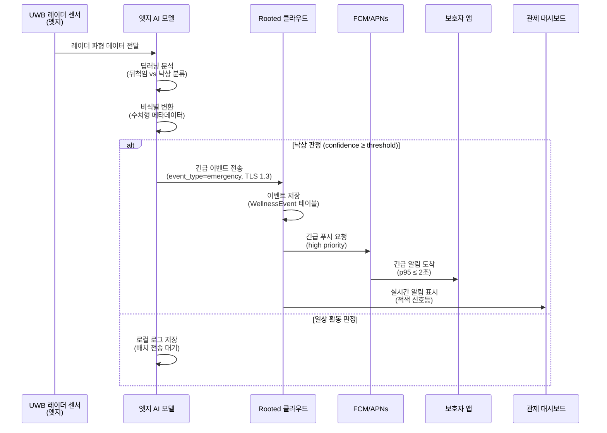
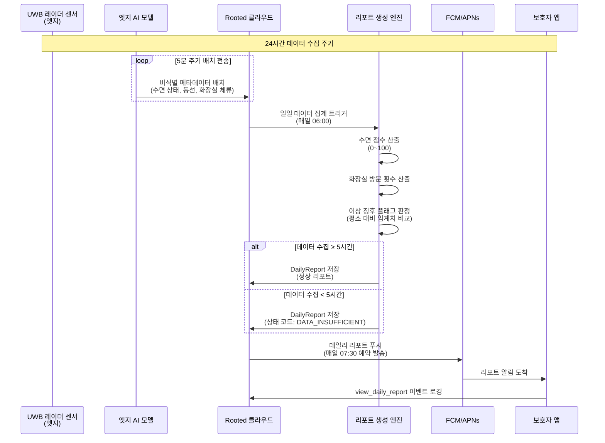
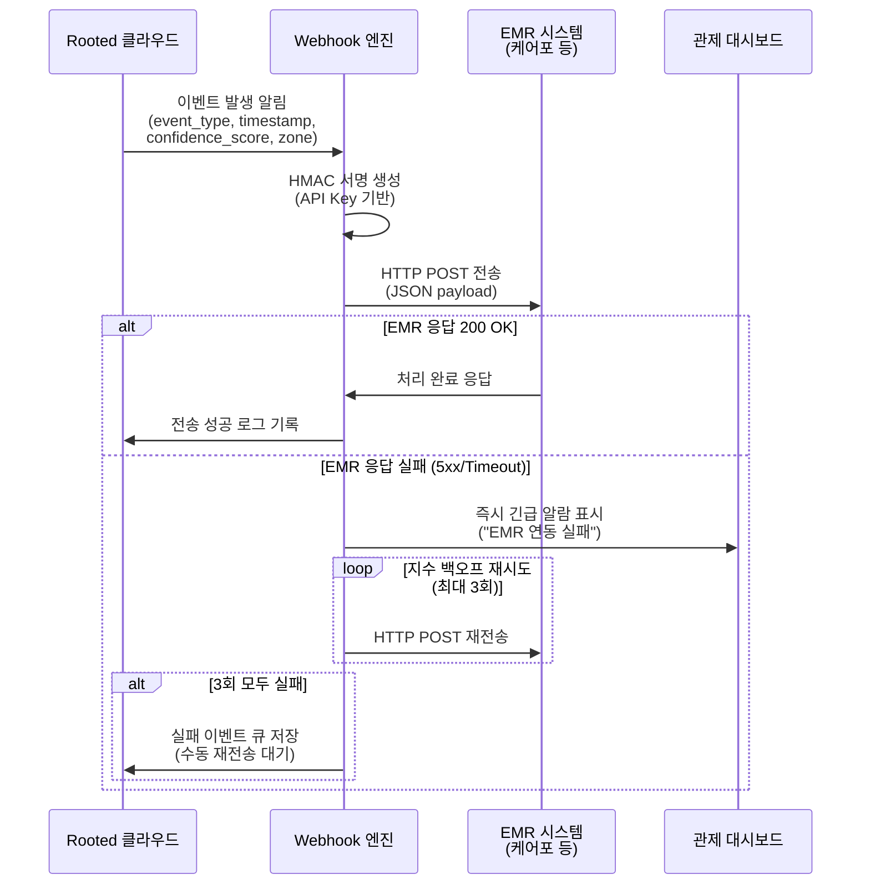
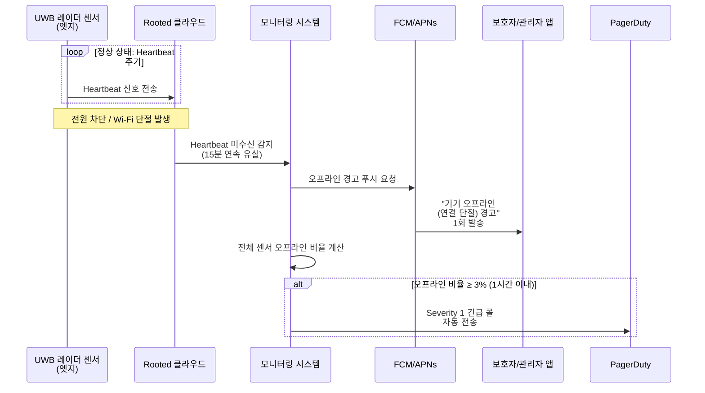
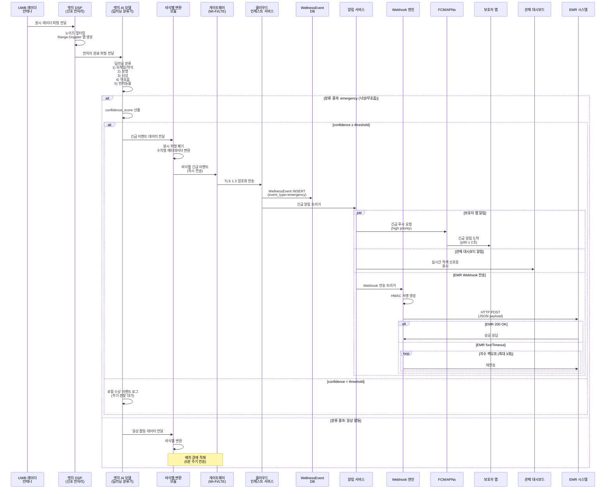
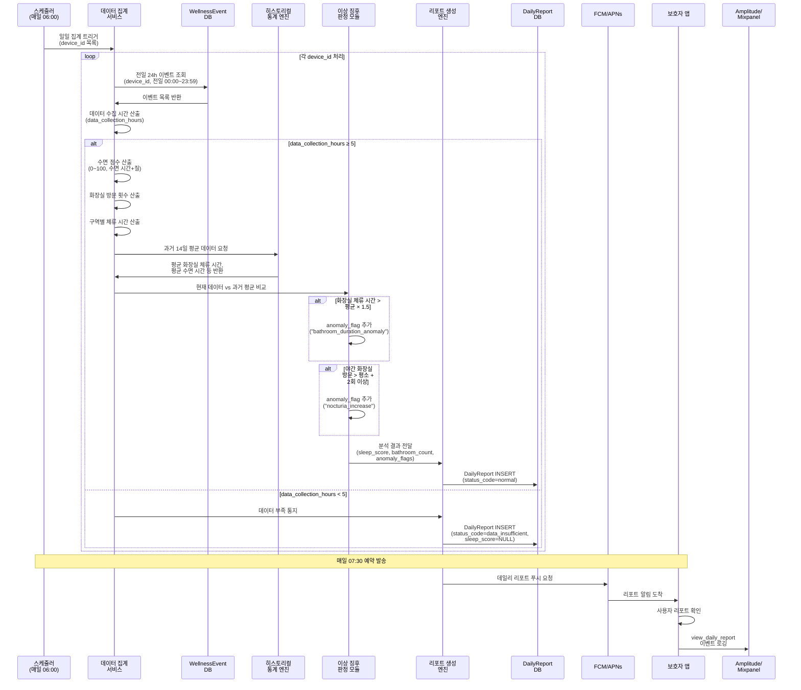
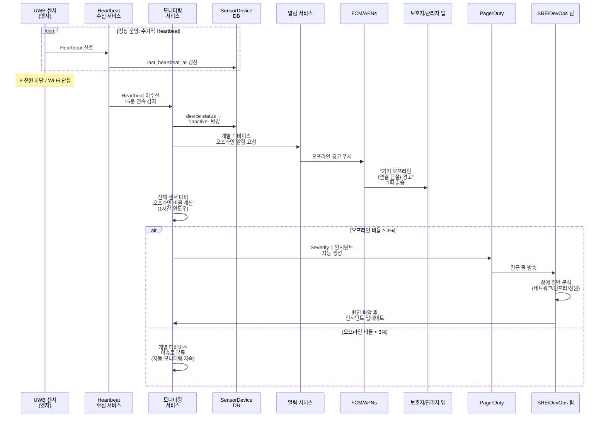
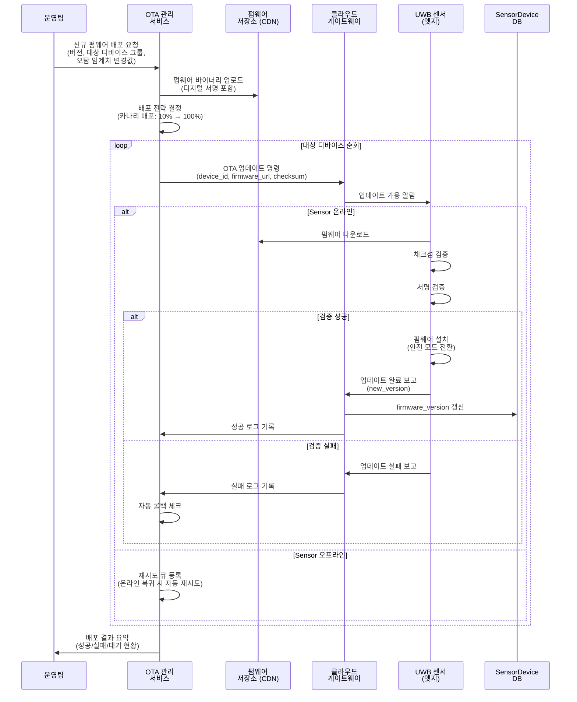

# Software Requirements Specification (SRS)

**Document ID:** SRS-001  
**Revision:** 1.0  
**Date:** 2026-04-16  
**Standard:** ISO/IEC/IEEE 29148:2018  
**기반 문서:** PRD_Rooted_V0.2.md

---

## 1. Introduction

### 1.1 Purpose

본 SRS는 **Rooted — 비접촉 AI 앰비언트 홈 안전 솔루션**의 소프트웨어 요구사항을 정의한다.

Rooted는 UWB 레이더 기반 비접촉·비영상 센서를 활용하여 독거 고령자의 낙상·응급 상황을 실시간 감지하고, 보호자 및 시설 관리자에게 정확한 알림을 제공하는 앰비언트 케어 솔루션이다.

본 문서는 다음의 구조적 문제를 해결하기 위한 소프트웨어 시스템의 기능·비기능·인터페이스·데이터 요구사항을 명세한다.

| 관점 | 핵심 문제 |
|------|-----------|
| **B2B 요양시설** | 저가형 모션 센서의 하루 평균 오탐 12건으로 인한 알람 피로 → 알람 무시 → 사망사고(장영희 Extreme 사례). EMR 데이터 단절로 인한 이중 기록 업무 |
| **B2G 지자체** | 고스펙(단가 초과) vs 저스펙(응급 징후 누락)의 비용-효용 딜레마 |
| **B2C 보호자** | CCTV 프라이버시 침해 거부, 웨어러블 충전 방치 → 원격지 부모님 위급 상황 인지 불가로 인한 극도의 불안감 |

### 1.2 Scope

#### 1.2.1 In-Scope

| 항목 | 설명 | 근거 |
|------|------|------|
| UWB 레이더 HW 연동 (비접촉 센서 모듈) | 카메라 없이 레이더 파형으로 동선/호흡/심박/체류 시간 센싱 | PRD §2.2.1 |
| 오탐 제로화 AI 엔진 (딥러닝 엣지 모델) | DOS 전체 1위(3.8점), MVP 최우선 R&D 목표 | PRD §2.2.2 |
| B2C 보호자 앱 | 데일리 리포트, 긴급 알림, 이벤트 로그 열람 기능 | PRD §2.2.3 |
| B2B 관제 대시보드 | 신호등 방식(적/황/녹) 직관 UI + EMR Webhook 연동 | PRD §2.2.3 |
| 웰니스 데일리 리포트 | 수면 점수, 화장실 이용 횟수, 이상 징후 플래그 자동 생성 | PRD §3.1 기능5 |
| 90일 이벤트 로그 보존 및 아카이빙 | 법적 분쟁 대비 데이터 무결성 검증용 해시체인 적용 | PRD §1.8 Q2 |

#### 1.2.2 Out-of-Scope

| 항목 | 배제 사유 | 근거 |
|------|-----------|------|
| 스마트홈 제어 연동 (조명·가전 제어) | 안전이라는 본질 희석. 아카라라이프 방식 배제 | PRD §2.3 #1 |
| '케어/돌봄' 마케팅 언어 사용 | Non-user 고태식형 ~44–54만 가구의 '낙인' 거부 방지 | PRD §2.3 #2 |
| B2G 공공조달 최저가 입찰 SLA 스펙 | Q4 선택적 투자 주의 영역(DOS 2.4), 론칭 시점 지연 초래 | PRD §2.3 #3 |

#### 1.2.3 Constraints / Assumptions

**Constraints:**

| ID | 제약사항 | 근거 |
|----|----------|------|
| CON-01 | 의료기기법 분류 리스크: 제품 포지셔닝을 '라이프케어 스마트홈 기기(웰니스/안전 확인용)'로 설계. 앱 UI 및 알림에 면책 조항(Disclaimer) 필수 삽입 | PRD R-01, §3.2 원칙2 |
| CON-02 | DB/API 네이밍에 'diagnosis', 'medical', 'patient' 등 규제 촉발 단어 사용 금지. 'wellness_score', 'activity_alert' 등으로 통일 | PRD NFR-12, §3.2 로드맵 원칙2 |
| CON-03 | 개인정보보호법 준수: 엣지단에서 원시 데이터를 비식별 변환 후 전송. 서버에는 식별 불가한 메타데이터만 저장 | PRD R-02, §3.1 기능3 |
| CON-04 | EMR Webhook 연동은 MVP 단계에서 점유율 1위 벤더(케어포 등)와 '표준 플러그인' 형태로만 제한. 개별 SI 구축 요청 거절 | PRD R-04 |
| CON-05 | UWB 레이더 기기의 KCC 인증 등 전파 관련 규제 클리어 필수 | PRD §3.2 Phase 2, 의존성 2 |

**Assumptions:**

| ID | 가정 | 근거 |
|----|------|------|
| ASM-01 | NXP/Infineon UWB 칩셋의 안정적 수급이 글로벌 반도체 공급 대란 없이 지속됨 | PRD §1.1.4 |
| ASM-02 | 초기 침투율 가정(B2C 0.2%, B2B 2.0%, B2G 5.0%)이 유효함 | PRD §1.6 SOM |
| ASM-03 | 1실 1센서 기준 침실/화장실 기본 2개 설치로 주요 생활 구역 동선을 충분히 커버 | PRD §3.1 기능2 Mitigation |
| ASM-04 | FCM/APNs 푸시 알림 인프라의 긴급 알림 즉시 전송 가용성이 보장됨 | PRD §2.2.3 |

### 1.3 Definitions, Acronyms, Abbreviations

| 용어 | 정의 |
|------|------|
| UWB | Ultra-Wideband. 초광대역 무선 기술로 정밀 거리 측정 및 레이더 파형 분석에 활용 |
| 오탐 (False Alarm) | 실제 응급 상황이 아닌데 응급으로 분류된 알림. 이불 뒤척임, 반려동물 활동 등이 원인 |
| Zero-Friction | 어르신(피모니터링자)이 기기에 대해 충전·착용·버튼 조작 등 일체의 수동 개입이 필요 없는 사용 경험 |
| 앰비언트 케어 (Ambient Care) | 환경에 내장된 센서를 통해 비침습적으로 거주자의 안전을 모니터링하는 방식 |
| JTBD (Jobs to be Done) | 사용자가 달성하고자 하는 핵심 과업 프레임워크 |
| AOS (Adjusted Opportunity Score) | 사용자가 인지하는 기회의 중요도를 반영한 보정 점수 |
| DOS (Discovered Opportunity Score) | 발견된 기회의 우선순위 점수. Q1(혁신 기회) 영역 배치 시 MVP 최우선 대상 |
| CJM (Customer Journey Map) | 고객 여정 지도. 인지→비교→구매→사용→충성 5단계로 Pain Point 도출 |
| EMR (Electronic Medical Record) | 시설 전자의무기록 시스템 |
| MoSCoW | Must / Should / Could / Won't 우선순위 분류 기법 |
| Webhook | 특정 이벤트 발생 시 사전 등록된 URL로 HTTP POST 요청을 자동 전송하는 메커니즘 |
| OTA (Over-The-Air) | 유선 연결 없이 무선 네트워크를 통해 펌웨어를 원격 업데이트하는 방식 |
| p95 | 95 백분위 응답 시간. 전체 요청의 95%가 이 시간 이내에 처리됨을 의미 |
| RPO (Recovery Point Objective) | 재해 복구 시 허용 가능한 최대 데이터 손실 시간 |
| RTO (Recovery Time Objective) | 재해 복구 시 서비스 복구까지의 최대 허용 시간 |
| TLS (Transport Layer Security) | 전송 계층 보안 프로토콜 |
| RBAC (Role-Based Access Control) | 역할 기반 접근 제어 |
| SLA (Service Level Agreement) | 서비스 수준 계약 |
| Heartbeat | 엣지 디바이스가 클라우드 서버에 주기적으로 전송하는 생존 확인 신호 |
| Validator | 제품·서비스의 가치 가설을 검증하는 실험 또는 그 주체 |
| PMF (Product-Market Fit) | 제품이 시장 수요에 적합한 상태를 달성했는지를 판단하는 지표 |
| Persona | 제품/서비스의 대상 사용자를 대표하는 가상의 전형적 인물상 |

### 1.4 References

| Ref ID | 문서/출처 | 설명 |
|--------|-----------|------|
| REF-01 | PRD_Rooted_V0.2.md | Rooted 비접촉 AI 앰비언트 홈 안전 솔루션 PRD v0.2 |
| REF-02 | PRD §1.6 TAM-SAM-SOM | 글로벌 AI 기반 고령자 돌봄 시장 규모 데이터 ($568억 → $3,294억, CAGR 21.3%) |
| REF-03 | PRD §1.9 JTBD VoC | 3개 그룹(최근 사용자, 이탈 경험자, 미사용 탐색자) 인터뷰 원문 |
| REF-04 | PRD §1.7 페르소나 스펙트럼 | 4대 페르소나(Core/Adjacent/Extreme/Non-user) 정의 및 CJM |
| REF-05 | PRD §1.8 AOS/DOS 사분면 | 12명 전원 Q1 분포 — 구조적 미충족 수요 입증 |
| REF-06 | PRD §1.1 Porter's Five Forces | 산업 구조 분석 결과 |
| REF-07 | PRD §1.2 경쟁사 분석 | 케어벨, 오파스넷, 아카라라이프, 유메인, 비알랩 5개사 분석 |
| REF-08 | PRD §1.4 Top 5 KSF | 핵심 성공 요인 순위 |
| REF-09 | ISO/IEC/IEEE 29148:2018 | Systems and software engineering — Life cycle processes — Requirements engineering |
| REF-10 | PRD §3.1 Job-Feature Map | 5개 기능 + MoSCoW 우선순위 + DOS 점수 기반 매핑 |

---

## 2. Stakeholders

| 역할 (Role) | 대표 페르소나 | 책임 (Responsibility) | 관심사 (Interest) | 근거 |
|-------------|--------------|----------------------|-------------------|------|
| **B2C 원격 보호자 (Guardian)** | 박지수 (43세) — Core 페르소나 | 독거 부모님의 원격 안전 모니터링, 데일리 리포트 확인, 긴급 알림 대응 | 오탐 제로, Zero-Friction 작동, 야간 수면/화장실 패턴 데이터 기반 조기 건강 이상 감지, 프라이버시 보호 | REF-04, PRD §1.7 |
| **B2B 시설 관리자 (Facility Admin)** | 정민석 (46세) — Adjacent 페르소나 | 야간 관제, 다수 입소자 동시 모니터링, EMR 연동 관리, 법적 분쟁 대비 로그 관리 | 오탐 97.5% 감소, EMR 자동 연동으로 이중 기록 제거, 90일 이벤트 로그 보존 | REF-04, PRD §1.7 |
| **사고 경험 가족 (Bereaved Family)** | 장영희 (63세) — Extreme 페르소나 | 시설 재선택 시 안전 시스템 검증, 데이터 무결성 요구 | 오탐 제로 알고리즘, 완전한 관제 데이터 로그, 법적 증거 활용 가능한 데이터 보존 | REF-04, PRD §1.7 |
| **비사용자 / 잠재 전환자** | 고태식 (71세) — Non-user 페르소나 | 배우자(68세) 동거. '감시 장치' 강력 거부 | '돌봄/케어' 언어 배제, 비영상 방식으로 프라이버시 100% 보호, 기기 존재감 최소화 | REF-04, PRD §1.7 |
| **Product / Engineering 팀** | 내부 팀 | 시스템 설계, 구현, 배포, 운영 | MVP 기술 실현 가능성, 비용 효율, OTA 업데이트, 스케일링 | REF-01, PRD §3.2 |
| **시스템 운영자 (DevOps/SRE)** | 내부 팀 | 클라우드 인프라 운영, 모니터링, 장애 대응 | SLA 99.9% 유지, 센서 오프라인 감지, PagerDuty 연동, 비용 통제 | PRD NFR-04, NFR-13 |

---

## 3. System Context and Interfaces

### 3.1 External Systems

| 외부 시스템 | 연동 방식 | 데이터 흐름 | 근거 |
|------------|-----------|-----------|------|
| EMR 시스템 (케어포 등 점유율 1위 벤더) | HTTP POST Webhook (JSON payload) | Rooted 클라우드 → EMR: event_type, timestamp, confidence_score, zone | PRD §3.1 기능4 |
| FCM (Firebase Cloud Messaging) | HTTP API (고우선순위 푸시) | Rooted 클라우드 → FCM → 보호자/관리자 Android 앱 | PRD §2.2.3 |
| APNs (Apple Push Notification service) | HTTP/2 API (고우선순위 푸시) | Rooted 클라우드 → APNs → 보호자/관리자 iOS 앱 | PRD §2.2.3 |
| PagerDuty | API 연동 | Rooted 모니터링 → PagerDuty: Severity 1 긴급 호출 (센서 3% 이상 오프라인 시) | PRD NFR-13 |
| Amplitude / Mixpanel (제품 애널리틱스) | SDK 내장 이벤트 로깅 | 보호자 앱 → 애널리틱스: view_daily_report, 오탐 신고 등 사용자 행동 이벤트 | PRD §1.3 성공 지표 |
| AWS Lambda / 클라우드 인프라 | 이벤트 드리븐 배치 처리 | 센서 데이터 인제스트, 리포트 생성, 로그 아카이빙 | PRD NFR-08 |

### 3.2 Client Applications

| 클라이언트 | 플랫폼 | 주요 기능 | 대상 사용자 |
|-----------|--------|----------|-----------|
| **보호자 앱 (Guardian App)** | iOS / Android | 긴급 알림 수신, 데일리 리포트 확인, 오탐 신고, 이벤트 로그 열람, 알림 설정 관리 | B2C 보호자 (박지수형) |
| **관제 대시보드 (Facility Dashboard)** | Web (브라우저) | 신호등 방식(적/황/녹) 다수 입소자 동시 모니터링, 이벤트 로그 조회, EMR 연동 상태 확인 | B2B 시설 관리자 (정민석형) |
| **기사용 설치 앱 (Installer App)** | iOS / Android | 센서 설치 위치 가이드, 캘리브레이션, 설치 완료 검증 | 설치 기사 |

### 3.3 API Overview

#### 3.3.1 외부 API

| API | Method | Endpoint (예시) | 인증 | Rate Limit | 설명 | 근거 |
|-----|--------|-----------------|------|-----------|------|------|
| EMR Webhook | POST | `{emr_vendor_url}/webhook/event` | API Key + HMAC 서명 | 100 req/min/facility | 이벤트 데이터(event_type, timestamp, confidence_score, zone)를 EMR 시스템에 실시간 전송 | PRD §6.2 |
| FCM/APNs 푸시 알림 | POST | FCM/APNs 표준 엔드포인트 | 서비스 인증서 기반 | 플랫폼 정책 준수 | 긴급 알림(즉시, high priority), 데일리 리포트(매일 07:30 예약 발송) | PRD §6.2 |

#### 3.3.2 내부 API

| API | Method | Endpoint (예시) | 프로토콜 | 설명 | 근거 |
|-----|--------|-----------------|---------|------|------|
| 엣지→클라우드 데이터 인제스트 | POST | `/api/v1/ingest/events` | TLS 1.3, 배치 전송 (5분 주기) | 엣지 디바이스에서 비식별 처리된 수치형 메타데이터를 클라우드로 전송 | PRD §6.2 |
| 90일 로그 아카이브 열람 | GET | `/api/v1/logs/{device_id}` | TLS 1.3, RBAC | 보호자/관리자 권한 기반 이벤트 로그 열람. 법적 분쟁 시 해시체인 기반 무결성 검증 | PRD §6.2 |
| 데일리 리포트 조회 | GET | `/api/v1/reports/{device_id}/{date}` | TLS 1.3, Bearer Token | 특정 날짜 데일리 리포트(수면 점수, 화장실 방문 횟수, 이상 징후) 조회 | PRD §6.1 |
| 센서 상태 관리 | GET/PUT | `/api/v1/devices/{device_id}/status` | TLS 1.3, Bearer Token | 센서 상태(active/inactive/maintenance) 조회 및 변경, 펌웨어 버전 확인 | PRD §6.1 |
| OTA 펌웨어 업데이트 | POST | `/api/v1/devices/{device_id}/ota` | TLS 1.3, 서명 검증 | 오탐 임계치 원격 조정 및 펌웨어 업데이트 배포 | PRD NFR-09 |
| 오탐 신고 피드백 | POST | `/api/v1/events/{event_id}/feedback` | TLS 1.3, Bearer Token | 보호자가 오탐을 신고하면 is_false_alarm 플래그 업데이트 | PRD §1.3 성공 지표 |
| 사용자 알림 설정 | GET/PUT | `/api/v1/users/{user_id}/notification-pref` | TLS 1.3, Bearer Token | 알림 채널(push, SMS), 시간대, 수신 여부 등 설정 관리 | PRD §6.1 |

### 3.4 Interaction Sequences

#### 3.4.1 낙상 감지 및 긴급 알림 시퀀스

#### 3.4.2 데일리 리포트 생성 시퀀스

#### 3.4.3 EMR Webhook 연동 시퀀스

#### 3.4.4 센서 오프라인 감지 시퀀스

---

## 4. Specific Requirements

### 4.1 Functional Requirements

#### 4.1.1 FR-01: 오탐 제로화 AI 필터링 엔진

| 필드 | 내용 |
|------|------|
| **Source** | Story 1 (AC-1.1, AC-1.4), Story 3 (AC-3.1) |
| **Priority** | Must |
| **DOS 점수** | 3.8 |

| Req ID | 요구사항 | Acceptance Criteria | 근거 |
|--------|---------|-------------------|------|
| REQ-FUNC-001 | 시스템은 UWB 레이더 파형 데이터를 엣지 딥러닝 모델로 실시간 분석하여 '뒤척임/착석'과 '낙상/무호흡'을 분류하여야 한다. | **Given** 센서가 정상 가동 중일 때 **When** 어르신이 이불을 뒤척일 때 **Then** 시스템은 해당 활동을 '일상 활동'으로 분류하고 응급 알림을 발생시키지 않는다 | PRD §3.1 기능1, AC-1.1 |
| REQ-FUNC-002 | 시스템은 월간 가구당 오탐을 0.3건 이하로 통제하여야 한다. | **Given** 시스템이 1개월 이상 가동 중일 때 **When** 월말 오탐 통계를 집계하면 **Then** 가구당 월간 오탐 건수가 0.3건 이하이다 | PRD §2.2.2, AC-1.1, AC-3.1 |
| REQ-FUNC-003 | 시스템은 반려동물(10kg 이하)의 움직임을 사람과 구분하여 응급 알림 오탐을 방지하여야 한다. | **Given** 실내 센서 반경 내에 반려동물(10kg 이하)이 돌아다닐 때 **When** 센서가 움직임을 감지하면 **Then** 체형 및 생체 신호 패턴을 사람과 구분하여 응급(낙상) 알림을 발생시키지 않는다 (구분 정확도 99% 이상) | PRD AC-1.4 |
| REQ-FUNC-004 | 시스템은 낙상 감지 시(바닥에 5분 이상 움직임 약화 패턴) 보호자 앱으로 긴급 푸시 알림을 60초 이내에 발송하여야 한다. | **Given** 실제 낙상이 발생하여 **When** 바닥에 5분 이상 움직임 약화 패턴이 감지되면 **Then** 보호자 앱으로 긴급 푸시 알림이 60초 이내에 발송된다 | PRD AC-1.3 |
| REQ-FUNC-005 | 시스템은 보호자가 앱 내 '오탐 신고' 버튼을 통해 오탐 피드백을 제출할 수 있도록 하여야 한다. | **Given** 보호자가 알림을 수신한 후 **When** 해당 알림이 오탐이라 판단하여 '오탐 신고' 버튼을 클릭하면 **Then** 해당 이벤트의 `is_false_alarm` 플래그가 true로 업데이트되고 피드백 로그에 기록된다 | PRD §1.3 북극성 지표 측정 경로 |
| REQ-FUNC-006 | 시스템은 오탐 피드백 데이터를 월간 배치로 분석하여 AI 모델 재훈련/임계치 조정에 활용하여야 한다. | **Given** 오탐 신고 피드백이 누적된 상태에서 **When** 월간 배치 분석 주기가 도래하면 **Then** `is_false_alarm=true` 이벤트가 집계되어 AI 모델 개선 파이프라인에 입력된다 | PRD §1.3 북극성 지표 측정 경로 |

#### 4.1.2 FR-02: Zero-Friction 비접촉 센서 모듈

| 필드 | 내용 |
|------|------|
| **Source** | Story 1 (AC-1.2, AC-1.5) |
| **Priority** | Must |
| **DOS 점수** | 3.6 |

| Req ID | 요구사항 | Acceptance Criteria | 근거 |
|--------|---------|-------------------|------|
| REQ-FUNC-010 | 시스템은 벽/천장 부착형 UWB 레이더 센서로 작동하여 어르신의 수동 조작(충전, 착용, 버튼 등)이 0회여야 한다. | **Given** 센서 설치가 완료된 후 **When** 어르신이 일상생활을 할 때 **Then** 기기에 대한 수동 조작 횟수가 0회이다 | PRD AC-1.2, §3.1 기능2 |
| REQ-FUNC-011 | 시스템은 1실 1센서 원칙으로 침실 천장 1개 + 화장실 문 상단 1개를 기본 설치 패키지로 지원하여야 한다. | **Given** 기사용 설치 앱이 활성화된 상태에서 **When** 설치 기사가 설치를 진행할 때 **Then** 침실 1개·화장실 1개(총 2개) 센서가 가이드에 따라 설치되고 위치 오차가 최소화된다 | PRD NFR-11, §3.1 기능2 Mitigation |
| REQ-FUNC-012 | 시스템은 센서 설치 후 자동 캘리브레이션을 수행하여 공간 환경(반려동물, 외풍 등)에 적응하여야 한다. | **Given** 센서가 새로 설치되었을 때 **When** 자동 캘리브레이션 프로세스가 완료되면 **Then** calibration_status가 'calibrated'로 변경되고 환경 노이즈가 필터링된다 | PRD NFR-09, §3.2 로드맵 원칙3 |
| REQ-FUNC-013 | 시스템은 엣지 기기의 전원 차단 또는 Wi-Fi 연결 단절 시, 15분 이상 Heartbeat 신호가 연속 유실되면 보호자/관리자 앱으로 "기기 오프라인(연결 단절) 경고" 푸시 알림을 1회 발송하여야 한다. | **Given** 엣지 기기의 전원이 물리적으로 차단되거나 Wi-Fi 연결이 단절될 때 **When** 15분 이상 서버 측 Heartbeat 신호가 연속 유실되면 **Then** 클라우드 서버에서 보호자/관리자 앱으로 "기기 오프라인(연결 단절) 경고" 푸시 알림을 1회 발송한다 | PRD AC-1.5 |

#### 4.1.3 FR-03: 비영상 프라이버시 보호 동선 추적

| 필드 | 내용 |
|------|------|
| **Source** | Story 1 (프라이버시 보호), Story 2 (패턴 데이터) |
| **Priority** | Must |
| **DOS 점수** | 3.0 |

| Req ID | 요구사항 | Acceptance Criteria | 근거 |
|--------|---------|-------------------|------|
| REQ-FUNC-020 | 시스템은 카메라 없이 UWB 레이더 기반으로 실내 동선(화장실 체류 시간, 침실-화장실 이동 경로)을 분석하여야 한다. | **Given** 센서가 정상 가동 중일 때 **When** 어르신이 침실에서 화장실로 이동하면 **Then** 시스템은 이동 경로와 각 구역 체류 시간을 비영상 방식으로 기록한다 | PRD §3.1 기능3 |
| REQ-FUNC-021 | 시스템은 원시 레이더 파형 데이터를 엣지단에서 비식별 처리하여 서버에는 수치형 메타데이터만 전송하여야 한다. | **Given** 센서가 레이더 파형 데이터를 수집할 때 **When** 엣지 디바이스에서 데이터를 처리하면 **Then** 원시 파형은 폐기되고 이진수/수치적 결과값만 TLS 1.3으로 암호화되어 서버로 전송된다 | PRD §3.1 기능3 Mitigation, NFR-06 |
| REQ-FUNC-022 | 시스템은 서버에 식별 가능한 개인정보(영상, 음성, 원시 생체 신호)를 저장하지 않아야 한다. | **Given** 클라우드 서버에 데이터가 저장될 때 **When** 저장 데이터를 검사하면 **Then** 식별 불가한 수치형 메타데이터만 존재하고 원시 감지 데이터는 존재하지 않는다 | PRD NFR-06, NFR-07 |

#### 4.1.4 FR-04: B2B 관제 대시보드 + EMR Webhook

| 필드 | 내용 |
|------|------|
| **Source** | Story 3 (AC-3.1, AC-3.2, AC-3.3, AC-3.4) |
| **Priority** | Must |
| **DOS 점수** | 3.4 |

| Req ID | 요구사항 | Acceptance Criteria | 근거 |
|--------|---------|-------------------|------|
| REQ-FUNC-030 | 시스템은 신호등 방식(적/황/녹) 직관 UI로 다수 입소자의 현재 상태를 동시에 표시하는 관제 대시보드를 제공하여야 한다. | **Given** 관제 대시보드에 접속한 시설 관리자가 **When** 대시보드 메인 화면을 조회하면 **Then** 모든 모니터링 대상 입소자의 현재 상태가 적(긴급)/황(주의)/녹(정상) 신호등으로 표시된다 | PRD §3.1 기능4 |
| REQ-FUNC-031 | 시스템은 센서 이벤트(응급/경고/정상) 발생 시 EMR Webhook을 통해 시설 전산망에 이벤트 데이터를 자동 전송하여야 한다. | **Given** EMR Webhook 연동이 활성화된 상태에서 **When** 센서 이벤트가 발생하면 **Then** event_type, timestamp, confidence_score, zone 데이터가 EMR에 자동 기록되어 이중 수기 입력이 0건이 된다 | PRD AC-3.2 |
| REQ-FUNC-032 | 시스템은 EMR 서버 응답 실패(HTTP 5xx/Timeout) 시 관제 대시보드에 즉시 긴급 알람을 표시하고, 지수 백오프 방식으로 최대 3회 재시도하여야 한다. | **Given** 시설 EMR 서버가 다운되거나 응답 실패가 발생할 때 **When** Webhook 전송을 시도하면 **Then** 대시보드 화면에 즉시 긴급 알람을 띄우고, 지수 백오프 방식으로 최대 3회 재전송하여 데이터 유실을 방지한다 | PRD AC-3.4 |
| REQ-FUNC-033 | 시스템은 EMR Webhook에 API Key + HMAC 서명 기반 인증을 적용하고, 시설당 100 req/min의 Rate Limit을 적용하여야 한다. | **Given** EMR Webhook 연동이 설정된 상태에서 **When** Webhook 요청을 전송할 때 **Then** 모든 요청에 API Key와 HMAC 서명이 포함되고, 시설당 분당 100건 초과 요청은 Rate Limit으로 차단된다 | PRD §6.2 |
| REQ-FUNC-034 | 시스템은 90일간의 이벤트 로그를 클라우드에 보존하여 관리자가 과거 이벤트를 조회할 수 있도록 하여야 한다. | **Given** 사고 발생 후 관리자가 데이터 열람을 요청할 때 **When** 과거 이벤트 로그를 조회하면 **Then** 90일간의 이벤트 로그가 보존되어 있고 법적 분쟁 시 데이터 무결성을 해시체인으로 증명할 수 있다 | PRD AC-3.3, NFR-10 |
| REQ-FUNC-035 | 시스템은 보호자/관리자의 역할(role)에 따라 이벤트 로그 열람 권한을 구분하여야 한다. | **Given** 사용자가 이벤트 로그 열람을 요청할 때 **When** 사용자의 role이 guardian이면 **Then** 해당 사용자의 linked_devices에 연결된 센서의 로그만 열람 가능하다 | PRD §6.2 |

#### 4.1.5 FR-05: 웰니스 데일리 리포트 (B2C)

| 필드 | 내용 |
|------|------|
| **Source** | Story 2 (AC-2.1, AC-2.2, AC-2.3, AC-2.4) |
| **Priority** | Should |
| **DOS 점수** | 2.85 |

| Req ID | 요구사항 | Acceptance Criteria | 근거 |
|--------|---------|-------------------|------|
| REQ-FUNC-040 | 시스템은 매일 자동으로 야간 수면시간·화장실 방문 횟수를 집계하여 데일리 리포트를 생성하여야 한다. | **Given** 센서가 24시간 가동 중일 때 **When** 하루가 종료되어 데일리 리포트 생성 시 **Then** 야간 수면시간·화장실 방문 횟수의 오차율이 10% 미만으로 산출된다 | PRD AC-2.1 |
| REQ-FUNC-041 | 시스템은 화장실 체류 시간이 평소 평균 대비 설정 임계치(+50%) 초과 시 보호자 앱으로 1일 1회 사전 경고 리포트를 발송하여야 한다. | **Given** 데일리 패턴 분석 결과 이상 징후가 감지될 때 **When** 화장실 체류 시간이 평소 평균 대비 +50% 초과하면 **Then** 보호자 앱으로 1일 1회 사전 경고 리포트가 발송된다 | PRD AC-2.2 |
| REQ-FUNC-042 | 시스템은 데일리 리포트를 매일 아침 07:30에 FCM/APNs를 통해 예약 발송하여야 한다. | **Given** 데일리 리포트가 정상 생성된 후 **When** 매일 아침 07:30이 되면 **Then** 보호자 앱으로 데일리 리포트 알림이 전송된다 | PRD §6.2 |
| REQ-FUNC-043 | 시스템은 데일리 리포트에 수면 점수(0~100), 화장실 방문 횟수, 이상 징후 플래그를 포함하여야 한다. | **Given** 데일리 리포트가 생성될 때 **When** 리포트 내용을 확인하면 **Then** sleep_score(0~100), bathroom_visit_count, anomaly_flags 필드가 모두 포함되어 있다 | PRD §6.1 DailyReport 엔터티 |
| REQ-FUNC-044 | 시스템은 24시간 동안 센서 인식 반경 이탈(외출/외박/입원 등, 수집 5시간 미만)로 의미 있는 데이터가 부족할 때, "체류 데이터 부족" 상태 코드로 변경하고 결측 사유를 안내하는 리포트를 발행하여야 한다. | **Given** 어르신이 24시간 동안 센서 인식 반경을 벗어나 데이터 수집이 5시간 미만일 때 **When** 다음 날 아침 데일리 리포트 자동 생성 시점에 **Then** 일반 수면 점수 대신 "체류 데이터 부족(수집 5시간 미만)" 상태 코드로 변경하고 결측(Null) 사유를 안내하는 리포트를 우선 발행한다 | PRD AC-2.4 |

#### 4.1.6 기사용 설치 앱 및 OTA 관리

| 필드 | 내용 |
|------|------|
| **Source** | NFR-09, NFR-11 (운영 지원) |
| **Priority** | Must |

| Req ID | 요구사항 | Acceptance Criteria | 근거 |
|--------|---------|-------------------|------|
| REQ-FUNC-050 | 시스템은 기사용 앱을 통해 센서 설치 위치 가이드, 캘리브레이션 실행, 설치 완료 검증을 지원하여야 한다. | **Given** 설치 기사가 기사용 앱에 로그인한 상태에서 **When** 센서 설치 프로세스를 시작하면 **Then** 설치 위치 가이드가 표시되고 캘리브레이션이 완료되면 설치 검증 결과가 표시된다 | PRD NFR-11 |
| REQ-FUNC-051 | 시스템은 OTA 메커니즘을 통해 오탐 임계치 및 펌웨어 버전을 원격으로 업데이트할 수 있어야 한다. | **Given** 운영팀이 OTA 업데이트를 배포할 때 **When** 엣지 디바이스가 온라인 상태이면 **Then** 새 펌웨어/임계치 설정이 자동으로 다운로드되어 적용되고 firmware_version 필드가 갱신된다 | PRD NFR-09 |

#### 4.1.7 B2B 다자 동의서 관리

| 필드 | 내용 |
|------|------|
| **Source** | NFR-07 (개인정보보호법 준수) |
| **Priority** | Must |

| Req ID | 요구사항 | Acceptance Criteria | 근거 |
|--------|---------|-------------------|------|
| REQ-FUNC-060 | 시스템은 B2B 시설에서 다자 동의서(개인정보 수집·이용 동의)를 템플릿 기반으로 관리하고, 동의 상태를 디바이스에 연결하여야 한다. | **Given** B2B 시설에서 새 입소자를 등록할 때 **When** 다자 동의서 프로세스를 실행하면 **Then** 동의 완료된 입소자의 디바이스에만 모니터링이 활성화된다 | PRD NFR-07 |

#### 4.1.8 앱 면책 조항(Disclaimer) 표시

| 필드 | 내용 |
|------|------|
| **Source** | CON-01 (의료기기법 우회) |
| **Priority** | Must |

| Req ID | 요구사항 | Acceptance Criteria | 근거 |
|--------|---------|-------------------|------|
| REQ-FUNC-070 | 시스템은 보호자 앱 및 관제 대시보드에 '본 서비스는 의료 진단 목적이 아닌 웰니스/안전 확인용입니다' 면책 조항을 명시적으로 표시하여야 한다. | **Given** 보호자 또는 관리자가 앱/대시보드에 최초 로그인할 때 **When** 서비스 이용 약관 화면이 표시되면 **Then** 면책 조항이 명시적으로 표시되고 사용자 동의 없이는 서비스 이용이 불가하다 | PRD R-01, CON-01 |

### 4.2 Non-Functional Requirements

| Req ID | 카테고리 | 요구사항 | 정량 목표 / 측정 기준 | 모니터링 방법 | 근거 |
|--------|---------|---------|---------------------|-------------|------|
| **REQ-NF-001** | 성능 (Latency) | 낙상 감지 후 보호자/관제 앱 푸시 알림 전송 지연 시간 (End-to-End) | **p95 ≤ 2,000 ms** | APM(Application Performance Monitoring) 도구로 엣지 감지 → 푸시 도착까지 지연 시간 트래킹 | PRD NFR-01 |
| **REQ-NF-002** | 성능 (Accuracy) | 오탐 제로화 알고리즘 정확도 | **월 오탐 ≤ 0.3건/가구** | 센서 DB `is_false_alarm` 플래그 누적 카운트 + 보호자 앱 '오탐 신고' 피드백 로그 월간 배치 분석 | PRD NFR-02, §1.3 |
| **REQ-NF-003** | 성능 (Accuracy) | 야간 수면/화장실 패턴 리포트 오차율 | **오차율 < 10%** | 실제 관찰값(수동 체크) 대비 시스템 산출값 비교 검증 (베타 기간) | PRD NFR-03 |
| **REQ-NF-004** | 성능 (Accuracy) | 반려동물(10kg 이하) 구분 정확도 | **≥ 99%** | 테스트 환경에서 반려동물 존재 시 오탐 발생률 측정 | PRD AC-1.4 |
| **REQ-NF-005** | 가용성 (SLA) | 클라우드 플랫폼 월간 가용성 | **≥ 99.9%** (월 누적 허용 다운타임 43.8분) | Datadog Uptime 모니터 | PRD NFR-04 |
| **REQ-NF-006** | 가용성 (RPO) | 센서 이벤트 데이터 손실 허용 범위 | **RPO ≤ 5분** (배치 전송 주기 기준) | 배치 전송 주기(5분) 내 최대 데이터 유실 허용 | PRD §6.2, NFR-05 |
| **REQ-NF-007** | 가용성 (RTO) | 클라우드 서비스 장애 복구 시간 | **RTO ≤ 30분** | 장애 발생 → 서비스 복구 완료까지 시간 측정 | 도출 보완 |
| **REQ-NF-008** | 신뢰성 | 센서 데이터 통신 오류율 및 유실율 | **≤ 0.1%** | 통신 장애 패킷 재전송 프로토콜 기반 통계 | PRD NFR-05 |
| **REQ-NF-009** | 보안 | 엣지-클라우드 간 데이터 전송 암호화 | **TLS 1.3** 필수. 원시 감지 데이터 서버 직접 전송 전면 금지 | 보안 감사 시 TLS 프로토콜 버전 확인 | PRD NFR-06 |
| **REQ-NF-010** | 보안 | 역할 기반 접근 제어 (RBAC) | guardian 역할은 자신의 linked_devices 로그만 열람. facility_admin은 시설 내 전체 열람 | 권한 테스트 자동화 | PRD §6.1 UserAccount |
| **REQ-NF-011** | 보안 | 개인정보보호법 준수 | 서버에는 식별 불가한 메타데이터만 저장. B2B 다자 동의서 템플릿 제공 | 정기 보안 감사 | PRD NFR-07 |
| **REQ-NF-012** | 보안 (감사 로그) | 시스템 접근 및 데이터 열람 감사 로그 | 모든 로그 열람, 설정 변경, 로그인 시도 기록. 감사 로그 90일 보존 | 감사 로그 대시보드 | 도출 보완 |
| **REQ-NF-013** | 비용 | 클라우드 인프라 가구당 운영 비용 | **월 500원/가구 이하** | AWS 빌링 대시보드 가구당 비용 추적 | PRD NFR-08 |
| **REQ-NF-014** | 데이터 보존 | 관제 이벤트 로그 보존 기간 | **90일 클라우드 이중화 보존 후 별도 아카이빙.** 데이터 해싱(Hashing) 적용 | 아카이빙 스케줄러 모니터링 | PRD NFR-10 |
| **REQ-NF-015** | 모니터링 | OTA 펌웨어 원격 업데이트 | 오탐 임계치 즉각 원격 조정 가능 | OTA 배포 성공률 트래킹 | PRD NFR-09 |
| **REQ-NF-016** | 모니터링 (Alerting) | 장애 긴급 알림 | 1시간 이내 전체 가동 센서 중 **3% 이상 오프라인** 감지 시 PagerDuty Severity 1 긴급 콜 자동 전송 | PagerDuty 인시던트 로그 | PRD NFR-13 |
| **REQ-NF-017** | 용어 규칙 | DB/API 네이밍 규칙 | 'diagnosis', 'medical', 'patient' 사용 금지. 'wellness_score', 'activity_alert' 등으로 통일 | 코드 리뷰 시 린터/정적 분석 확인 | PRD NFR-12 |
| **REQ-NF-018** | 설치성 | 1실 1센서 설치 가이드라인 | 침실 천장 1개 + 화장실 문 상단 1개 기본 패키지. 기사용 앱으로 설치 위치 오차 최소화 | 설치 완료 검증 결과 로그 | PRD NFR-11 |
| **REQ-NF-019** | Scalability | 동시 모니터링 디바이스 수 확장 | 초기 MVP: 최소 200가구(400센서) 동시 처리. Wave 2 종료 시점: 500가구(1,000센서) | 부하 테스트(Load Test) | 도출 보완, PRD §8.1 |
| **REQ-NF-020** | Maintainability | 마이크로서비스 모듈 독립 배포 | 각 서비스(인제스트, 알림, 리포트 생성, 로그 아카이브)를 독립적으로 배포·롤백 가능 | CI/CD 파이프라인 배포 로그 | 도출 보완 |
| **REQ-NF-021** | 성능 (KPI) | 북극성 지표: 월간 오탐 빈도 | **≤ 2회/가구** (보호자 체감 기준 허용 임계치) | 센서 DB `is_false_alarm` + 보호자 '오탐 신고' 로그 월간 배치 | PRD §1.3 성공 지표 |
| **REQ-NF-022** | 성능 (KPI) | 보조 KPI 1: 앱 데일리 리포트 주간 확인 빈도 | **≥ 5회/주** (WAU 트래킹) | Amplitude/Mixpanel `view_daily_report` 이벤트 유저 비율 | PRD §1.3 성공 지표 |
| **REQ-NF-023** | 성능 (KPI) | 보조 KPI 2: 기기 조작/불편감 기인 이탈률 | **0건** | 고객센터/CRM '설치 거부감/불편함' 태깅 CS 티켓 누적 집계 | PRD §1.3 성공 지표 |

---

## 5. Traceability Matrix

### 5.1 Story ↔ Requirement ID ↔ Test Case ID

| Story / Source | Req ID | 요구사항 요약 | Test Case ID | 테스트 유형 |
|---------------|--------|-------------|-------------|-----------|
| **Story 1** (AC-1.1) | REQ-FUNC-001 | UWB 파형 딥러닝 분석 — 뒤척임/낙상 분류 | TC-FUNC-001 | 통합 테스트 |
| Story 1 (AC-1.1) | REQ-FUNC-002 | 월 오탐 ≤ 0.3건/가구 통제 | TC-FUNC-002 | 성능 테스트 (4주) |
| Story 1 (AC-1.4) | REQ-FUNC-003 | 반려동물 구분 정확도 ≥ 99% | TC-FUNC-003 | 통합 테스트 |
| Story 1 (AC-1.3) | REQ-FUNC-004 | 낙상 감지 → 60초 이내 긴급 알림 | TC-FUNC-004 | E2E 테스트 |
| Story 1 (북극성) | REQ-FUNC-005 | 오탐 신고 버튼 피드백 기능 | TC-FUNC-005 | 기능 테스트 |
| Story 1 (북극성) | REQ-FUNC-006 | 오탐 피드백 월간 배치 분석 | TC-FUNC-006 | 배치 프로세스 테스트 |
| **Story 1** (AC-1.2) | REQ-FUNC-010 | 어르신 수동 조작 0회 | TC-FUNC-010 | 사용자 테스트 |
| Story 1 (NFR-11) | REQ-FUNC-011 | 1실 1센서 설치 패키지 | TC-FUNC-011 | 설치 검증 테스트 |
| Story 1 (NFR-09) | REQ-FUNC-012 | 자동 캘리브레이션 | TC-FUNC-012 | 통합 테스트 |
| Story 1 (AC-1.5) | REQ-FUNC-013 | 기기 오프라인 경고 (15분 Heartbeat 유실) | TC-FUNC-013 | E2E 테스트 |
| **Story 1** (프라이버시) | REQ-FUNC-020 | 비영상 동선 추적 | TC-FUNC-020 | 통합 테스트 |
| Story 1 (NFR-06) | REQ-FUNC-021 | 엣지단 비식별 변환 후 전송 | TC-FUNC-021 | 보안 테스트 |
| Story 1 (NFR-07) | REQ-FUNC-022 | 서버 식별 정보 미존재 검증 | TC-FUNC-022 | 보안 감사 |
| **Story 3** (AC-3.1) | REQ-FUNC-030 | 신호등 방식 관제 대시보드 | TC-FUNC-030 | UI 테스트 |
| Story 3 (AC-3.2) | REQ-FUNC-031 | EMR Webhook 자동 전송 | TC-FUNC-031 | 통합 테스트 |
| Story 3 (AC-3.4) | REQ-FUNC-032 | EMR 실패 시 재시도(지수 백오프 3회) | TC-FUNC-032 | 장애 주입 테스트 |
| Story 3 (§6.2) | REQ-FUNC-033 | Webhook 인증(HMAC) + Rate Limit | TC-FUNC-033 | 보안/성능 테스트 |
| Story 3 (AC-3.3) | REQ-FUNC-034 | 90일 이벤트 로그 보존 + 해시체인 | TC-FUNC-034 | 데이터 무결성 테스트 |
| Story 3 (§6.2) | REQ-FUNC-035 | RBAC 기반 로그 열람 권한 분리 | TC-FUNC-035 | 권한 테스트 |
| **Story 2** (AC-2.1) | REQ-FUNC-040 | 데일리 리포트 자동 생성 (오차율 <10%) | TC-FUNC-040 | 정확도 검증 테스트 |
| Story 2 (AC-2.2) | REQ-FUNC-041 | 이상 징후 사전 경고 리포트 (임계치 +50%) | TC-FUNC-041 | 기능 테스트 |
| Story 2 (§6.2) | REQ-FUNC-042 | 매일 07:30 리포트 예약 발송 | TC-FUNC-042 | 스케줄링 테스트 |
| Story 2 (§6.1) | REQ-FUNC-043 | 리포트 내 필수 필드 포함 검증 | TC-FUNC-043 | 단위 테스트 |
| Story 2 (AC-2.4) | REQ-FUNC-044 | 데이터 부족 시 결측 사유 안내 리포트 | TC-FUNC-044 | 기능 테스트 |
| NFR-11 | REQ-FUNC-050 | 기사용 설치 앱 | TC-FUNC-050 | 기능 테스트 |
| NFR-09 | REQ-FUNC-051 | OTA 펌웨어 원격 업데이트 | TC-FUNC-051 | 통합 테스트 |
| NFR-07 | REQ-FUNC-060 | B2B 다자 동의서 관리 | TC-FUNC-060 | 기능 테스트 |
| CON-01 | REQ-FUNC-070 | 앱 면책 조항 표시 | TC-FUNC-070 | UI 테스트 |

### 5.2 NFR ↔ Test Case ID

| Req ID | 요구사항 요약 | Test Case ID | 테스트 유형 |
|--------|-------------|-------------|-----------|
| REQ-NF-001 | 긴급 알림 p95 ≤ 2,000 ms | TC-NF-001 | 성능 테스트 |
| REQ-NF-002 | 월 오탐 ≤ 0.3건/가구 | TC-NF-002 | 장기 성능 테스트 |
| REQ-NF-003 | 수면/화장실 패턴 오차율 < 10% | TC-NF-003 | 정확도 검증 |
| REQ-NF-004 | 반려동물 구분 ≥ 99% | TC-NF-004 | 정확도 검증 |
| REQ-NF-005 | SLA ≥ 99.9% | TC-NF-005 | 가용성 모니터링 |
| REQ-NF-006 | RPO ≤ 5분 | TC-NF-006 | 장애 복구 테스트 |
| REQ-NF-007 | RTO ≤ 30분 | TC-NF-007 | 장애 복구 테스트 |
| REQ-NF-008 | 통신 오류율 ≤ 0.1% | TC-NF-008 | 네트워크 테스트 |
| REQ-NF-009 | TLS 1.3 암호화 | TC-NF-009 | 보안 스캔 |
| REQ-NF-010 | RBAC 접근 제어 | TC-NF-010 | 권한 테스트 |
| REQ-NF-011 | 개인정보보호법 준수 | TC-NF-011 | 보안 감사 |
| REQ-NF-012 | 감사 로그 기록 및 90일 보존 | TC-NF-012 | 감사 로그 테스트 |
| REQ-NF-013 | 가구당 월 500원 비용 통제 | TC-NF-013 | 비용 분석 |
| REQ-NF-014 | 90일 이벤트 로그 보존 + 해싱 | TC-NF-014 | 데이터 보존 테스트 |
| REQ-NF-015 | OTA 원격 업데이트 | TC-NF-015 | OTA 배포 테스트 |
| REQ-NF-016 | 3% 오프라인 시 PagerDuty 호출 | TC-NF-016 | 장애 주입 테스트 |
| REQ-NF-017 | DB/API 금지 단어 미사용 | TC-NF-017 | 정적 분석 |
| REQ-NF-018 | 설치 가이드라인 준수 | TC-NF-018 | 설치 검증 |
| REQ-NF-019 | 동시 500가구 확장 | TC-NF-019 | 부하 테스트 |
| REQ-NF-020 | 마이크로서비스 독립 배포 | TC-NF-020 | CI/CD 파이프라인 테스트 |
| REQ-NF-021 | 북극성: 월 오탐 ≤ 2회/가구 | TC-NF-021 | 장기 KPI 모니터링 |
| REQ-NF-022 | 데일리 리포트 주 5회 확인 | TC-NF-022 | 사용자 행동 분석 |
| REQ-NF-023 | 기기 조작 기인 이탈 0건 | TC-NF-023 | CRM 티켓 분석 |

---

## 6. Appendix

### 6.1 API Endpoint List

| # | Method | Endpoint | 설명 | 인증 | 연관 Req |
|---|--------|----------|------|------|---------|
| 1 | POST | `/api/v1/ingest/events` | 엣지→클라우드 비식별 이벤트 데이터 배치 전송 (5분 주기) | Device Certificate (TLS 1.3 mTLS) | REQ-FUNC-021 |
| 2 | GET | `/api/v1/devices/{device_id}/status` | 센서 상태(active/inactive/maintenance) 조회 | Bearer Token (RBAC) | REQ-FUNC-013 |
| 3 | PUT | `/api/v1/devices/{device_id}/status` | 센서 상태 변경 | Bearer Token (RBAC, admin only) | REQ-FUNC-050 |
| 4 | POST | `/api/v1/devices/{device_id}/ota` | OTA 펌웨어 업데이트 배포 | Bearer Token (RBAC, admin only) + 서명 검증 | REQ-FUNC-051 |
| 5 | POST | `/api/v1/devices/{device_id}/calibrate` | 센서 자동 캘리브레이션 트리거 | Bearer Token (installer role) | REQ-FUNC-012 |
| 6 | GET | `/api/v1/events?device_id={id}&from={date}&to={date}` | 이벤트 로그 조회 (90일 범위) | Bearer Token (RBAC) | REQ-FUNC-034, REQ-FUNC-035 |
| 7 | POST | `/api/v1/events/{event_id}/feedback` | 오탐 신고 피드백 제출 | Bearer Token (guardian role) | REQ-FUNC-005 |
| 8 | GET | `/api/v1/reports/{device_id}/{date}` | 특정 날짜 데일리 리포트 조회 | Bearer Token (RBAC) | REQ-FUNC-040, REQ-FUNC-043 |
| 9 | GET | `/api/v1/reports/{device_id}/latest` | 최신 데일리 리포트 조회 | Bearer Token (RBAC) | REQ-FUNC-042 |
| 10 | POST | `{emr_vendor_url}/webhook/event` | EMR Webhook 이벤트 전송 (외부) | API Key + HMAC 서명 | REQ-FUNC-031 |
| 11 | GET/PUT | `/api/v1/users/{user_id}/notification-pref` | 사용자 알림 설정 조회/변경 | Bearer Token | REQ-FUNC-070 |
| 12 | POST | `/api/v1/facilities/{facility_id}/consent` | B2B 다자 동의서 등록 | Bearer Token (facility_admin role) | REQ-FUNC-060 |
| 13 | GET | `/api/v1/dashboard/{facility_id}/overview` | 관제 대시보드 전체 현황 조회 (신호등 UI 데이터) | Bearer Token (facility_admin role) | REQ-FUNC-030 |
| 14 | GET | `/api/v1/monitoring/sensor-health` | 전체 센서 온라인/오프라인 현황 | Internal Service Token | REQ-NF-016 |

### 6.2 Entity & Data Model

#### 6.2.1 SensorDevice (센서 디바이스)

| 필드명 | 타입 | PK/FK | NULL 허용 | 설명 | 근거 |
|--------|------|-------|----------|------|------|
| `device_id` | UUID | PK | NOT NULL | 센서 고유 식별자 | PRD §6.1 |
| `location_zone` | ENUM (bedroom, bathroom, living_room) | — | NOT NULL | 설치 구역 | PRD §6.1 |
| `firmware_version` | VARCHAR(20) | — | NOT NULL | 현재 펌웨어 버전 (OTA 업데이트 추적) | PRD §6.1 |
| `installation_date` | DATETIME | — | NOT NULL | 설치 일자 | PRD §6.1 |
| `status` | ENUM (active, inactive, maintenance) | — | NOT NULL | 센서 상태 | PRD §6.1 |
| `calibration_status` | ENUM (calibrated, pending) | — | NOT NULL | 자동 캘리브레이션 상태 | PRD §6.1 |
| `last_heartbeat_at` | DATETIME | — | NULL | 마지막 Heartbeat 수신 시각 | REQ-FUNC-013 |
| `facility_id` | UUID | FK→Facility | NULL | B2B 시설 연결 (B2C는 NULL) | REQ-FUNC-030 |
| `created_at` | DATETIME | — | NOT NULL | 레코드 생성 시각 | — |
| `updated_at` | DATETIME | — | NOT NULL | 레코드 최종 수정 시각 | — |

#### 6.2.2 WellnessEvent (웰니스 이벤트)

| 필드명 | 타입 | PK/FK | NULL 허용 | 설명 | 근거 |
|--------|------|-------|----------|------|------|
| `event_id` | UUID | PK | NOT NULL | 이벤트 고유 식별자 | PRD §6.1 |
| `device_id` | UUID | FK→SensorDevice | NOT NULL | 연관 센서 | PRD §6.1 |
| `event_type` | ENUM (activity_alert, wellness_score, emergency) | — | NOT NULL | 이벤트 유형 | PRD §6.1 |
| `timestamp` | DATETIME | — | NOT NULL | 이벤트 발생 시각 | PRD §6.1 |
| `confidence_score` | FLOAT (0.0~1.0) | — | NOT NULL | AI 판단 신뢰도 점수 | PRD §6.1 |
| `is_false_alarm` | BOOLEAN | — | NOT NULL (default: false) | 오탐 여부 플래그 (피드백 기반) | PRD §6.1, REQ-FUNC-005 |
| `zone` | ENUM (bedroom, bathroom, living_room) | — | NOT NULL | 이벤트 발생 구역 | PRD §6.1 |
| `data_hash` | VARCHAR(64) | — | NOT NULL | 법적 무결성 검증용 SHA-256 해시 | REQ-NF-014 |
| `archived_at` | DATETIME | — | NULL | 90일 경과 후 아카이브 이전 시각 | REQ-FUNC-034 |
| `created_at` | DATETIME | — | NOT NULL | 레코드 생성 시각 | — |

#### 6.2.3 UserAccount (사용자 계정)

| 필드명 | 타입 | PK/FK | NULL 허용 | 설명 | 근거 |
|--------|------|-------|----------|------|------|
| `user_id` | UUID | PK | NOT NULL | 사용자 고유 식별자 | PRD §6.1 |
| `role` | ENUM (guardian, facility_admin, installer) | — | NOT NULL | 역할 | PRD §6.1 |
| `linked_devices` | UUID[] | FK→SensorDevice | NOT NULL | 연결된 센서 목록 | PRD §6.1 |
| `notification_pref` | JSONB | — | NOT NULL | 알림 설정 (push, SMS, 시간대 등) | PRD §6.1 |
| `facility_id` | UUID | FK→Facility | NULL | B2B 시설 소속 (B2C는 NULL) | REQ-FUNC-030 |
| `consent_agreed_at` | DATETIME | — | NULL | 면책 조항 동의 시각 | REQ-FUNC-070 |
| `created_at` | DATETIME | — | NOT NULL | 레코드 생성 시각 | — |
| `updated_at` | DATETIME | — | NOT NULL | 레코드 최종 수정 시각 | — |

#### 6.2.4 DailyReport (데일리 리포트)

| 필드명 | 타입 | PK/FK | NULL 허용 | 설명 | 근거 |
|--------|------|-------|----------|------|------|
| `report_id` | UUID | PK | NOT NULL | 리포트 고유 식별자 | PRD §6.1 |
| `device_id` | UUID | FK→SensorDevice | NOT NULL | 연관 센서 | PRD §6.1 |
| `date` | DATE | — | NOT NULL | 리포트 기준 날짜 | PRD §6.1 |
| `sleep_score` | INT (0~100) | — | NULL | 수면 품질 점수 (DATA_INSUFFICIENT 시 NULL) | PRD §6.1 |
| `bathroom_visit_count` | INT | — | NULL | 화장실 방문 횟수 | PRD §6.1 |
| `anomaly_flags` | VARCHAR[] | — | NOT NULL (default: []) | 이상 징후 플래그 목록 | PRD §6.1 |
| `status_code` | ENUM (normal, data_insufficient) | — | NOT NULL | 리포트 상태 | REQ-FUNC-044 |
| `data_collection_hours` | FLOAT | — | NOT NULL | 데이터 수집 시간 (시간 단위) | REQ-FUNC-044 |
| `generated_at` | DATETIME | — | NOT NULL | 리포트 생성 시각 | PRD §6.1 |

#### 6.2.5 Facility (시설) — B2B 전용

| 필드명 | 타입 | PK/FK | NULL 허용 | 설명 | 근거 |
|--------|------|-------|----------|------|------|
| `facility_id` | UUID | PK | NOT NULL | 시설 고유 식별자 | REQ-FUNC-030 |
| `facility_name` | VARCHAR(200) | — | NOT NULL | 시설명 | REQ-FUNC-030 |
| `emr_webhook_url` | VARCHAR(500) | — | NULL | EMR Webhook 엔드포인트 URL | REQ-FUNC-031 |
| `emr_api_key` | VARCHAR(256) | — | NULL | EMR Webhook 인증 API Key (암호화 저장) | REQ-FUNC-033 |
| `emr_webhook_enabled` | BOOLEAN | — | NOT NULL (default: false) | EMR 연동 활성화 여부 | REQ-FUNC-031 |
| `bed_count` | INT | — | NOT NULL | 병상 수 | REQ-01 §8.1 Wave 1 |
| `created_at` | DATETIME | — | NOT NULL | 레코드 생성 시각 | — |

#### 6.2.6 WebhookDeliveryLog (Webhook 전송 로그)

| 필드명 | 타입 | PK/FK | NULL 허용 | 설명 | 근거 |
|--------|------|-------|----------|------|------|
| `delivery_id` | UUID | PK | NOT NULL | 전송 시도 고유 식별자 | REQ-FUNC-032 |
| `event_id` | UUID | FK→WellnessEvent | NOT NULL | 전송 대상 이벤트 | REQ-FUNC-031 |
| `facility_id` | UUID | FK→Facility | NOT NULL | 대상 시설 | REQ-FUNC-031 |
| `http_status` | INT | — | NULL | EMR 응답 HTTP 상태 코드 | REQ-FUNC-032 |
| `attempt_count` | INT | — | NOT NULL | 전송 시도 횟수 (최대 3회) | REQ-FUNC-032 |
| `status` | ENUM (success, retrying, failed) | — | NOT NULL | 전송 상태 | REQ-FUNC-032 |
| `next_retry_at` | DATETIME | — | NULL | 다음 재시도 예정 시각 (지수 백오프) | REQ-FUNC-032 |
| `created_at` | DATETIME | — | NOT NULL | 최초 전송 시도 시각 | — |

### 6.3 Detailed Interaction Models

#### 6.3.1 상세 낙상 감지 E2E 시퀀스 (엣지 AI 분류 로직 포함)

#### 6.3.2 상세 데일리 리포트 생성 및 이상 징후 판정 시퀀스

#### 6.3.3 상세 센서 오프라인 감지 및 대규모 장애 에스컬레이션 시퀀스

#### 6.3.4 상세 OTA 펌웨어 업데이트 시퀀스

#### 6.3.5 Validation Plan (검증 계획)

PRD §8의 실험·롤아웃·측정 계획을 검증 절차로 변환한다.

| 실험 ID | 가설 | 검증 방법 | 성공 기준 | 연관 Req |
|---------|------|----------|----------|---------|
| **EXP-01** | B2B 현장의 오탐 제거가 계약 유지율과 만족도를 향상시킨다 | 1차 클로즈드 베타 요양원 5곳(총 150병상)에서 4주간 `is_false_alarm` 플래그 모니터링 | 구형 모션 센서 대조군 대비 오탐 **97.5% 이상 감소** (월간 병상당 2건 이하) | REQ-FUNC-002, REQ-NF-002 |
| **EXP-02** | B2C 데일리 리포트가 구독 해지 방어에 기여한다 | 오픈 베타 100~200가구 대상 Amplitude로 주 단위 `view_daily_report` 조회율 4주 트래킹 | **WAU 집계 시 주 5회 이상 능동 확인 유저 60% 이상** | REQ-FUNC-040, REQ-NF-022 |
| **EXP-03** | Zero-Friction 방식이 고령 사용자 거부감을 소멸시킨다 | Wave 2 전체 가입자 대상 CRM 내 '어르신 조작 불편/착용 거부' CS 티켓 분석 | 기기 미착용/방치 기인 해지·취소 **0건 유지** | REQ-FUNC-010, REQ-NF-023 |

---

*— End of SRS-001 v1.0 —*
