# Software Requirements Specification (SRS)

Document ID: SRS-001  
Revision: 1.0  
Date: 2026-04-18  
Standard: ISO/IEC/IEEE 29148:2018

---

## 1. Introduction

### 1.1 Purpose

This SRS defines the functional, non-functional, interface, and data requirements for the Minimum Viable Product (MVP) software system of **Rooted**, a contactless AI ambient home safety solution, in accordance with the ISO/IEC/IEEE 29148:2018 standard.

**Targeted Problem:**

The contactless ambient care market is structurally in an "Unmet Need" state from B2B, B2G, and B2C perspectives.

- **B2B (Nursing Facilities):** 12 false alarms per day on average from low-cost motion sensors cause alarm fatigue, leading to the accumulation of 11 false alarms during a night shift → ignoring alarms → the worst-case scenario of a fatal accident becoming reality. Moreover, the lack of data integration with EMR networks forces double-entry work. (PRD §1.1, §1.7 Jang Young-hee Extreme case)
- **B2G (Local Governments):** They must resolve care blind spots with limited budgets, but face a cost-utility dilemma where high-spec equipment exceeds unit costs and low-spec equipment misses emergency signs. (PRD §1.5)
- **B2C (Guardians):** CCTV infringes on privacy, and wearables become virtually useless when left uncharged, causing guardians to experience extreme anxiety and lack of data with no way to immediately recognize their elderly parents' emergencies living alone. (PRD §1.5, §1.7, §1.10)

The intended audience for this SRS includes the development team, QA team, project managers, and external auditors. This document serves as the official reference for design, implementation, testing, and acceptance.

### 1.2 Scope (In-Scope / Out-of-Scope)

**System Name:** Rooted — Contactless AI Ambient Home Safety Solution

**Quantitative Objectives (Desired Outcome):**

| Objective | Current State (As-Is) | Target State (To-Be) | PRD Source |
| :--- | :--- | :--- | :--- |
| Monthly AI engine false alarm frequency | 12 cases/day (= 360 cases/month/household) | ≤ 0.3 cases/month/household | §1.9, §2.2.2 |
| Monthly perceived false alarm frequency by user (North Star) | 360 cases/month/household | ≤ 2 cases/household | §1.3 |
| Frequency of elderly operating device | Constant friction with wearable charging/wearing | 0 times (Zero-Friction) | §1.9 |
| Error rate of night sleep/bathroom patterns | Lack of data | Less than 10% | §1.9 |
| Privacy infringement | Rejection of CCTV/home cam surveillance | Non-video (de-identified) method, zero infringement | §1.10 |
| B2B EMR double-entry | Double entry (Manual + System) | Automatic EMR integration, 0 cases of double-entry | §1.10, §3.1 |

**In-Scope:**

| Item | Description | PRD Source |
| :--- | :--- | :--- |
| UWB radar HW integration | Contactless sensor module that senses movement, respiration, heart rate, and dwell time via radar waveforms without a camera | §2.2.1 |
| Zero false alarm AI engine | Deep learning-based edge inference model that precisely distinguishes tossing/turning/sitting from falls/apnea | §2.2.2, DOS 3.8 |
| B2C Guardian App | iOS first (Android after Wave 2). Emergency alerts, daily reports, false alarm reporting function | §2.2.3 |
| B2B Monitoring Dashboard (Web) | Traffic light system (Red/Yellow/Green) multi-bed monitoring UI + EMR Webhook integration | §2.2.3 |
| Wellness Daily Report | Automatically sends sleep scores, bathroom visit frequency, and anomaly flags daily at 07:30 | §3.1 Feature 5 |

**Out-of-Scope:**

| Item | Reason for Exclusion | PRD Source |
| :--- | :--- | :--- |
| Smart home control integration (Lighting/Appliances) | Dilutes the core value of safety. Aqara Life method excluded. | §2.3 #1 |
| Use of 'Care' marketing language | Prevents rejection due to 'elderly stigma' from the non-user Ko Tae-sik type ~440K-540K households. | §2.3 #2 |
| B2G public procurement lowest price bidding SLA specs | Causes indefinite delay at launch time. Re-evaluate in Q4 after verifying SOM S1 segment penetration. | §2.3 #3 |

### 1.3 Definitions, Acronyms, Abbreviations

| Term | Definition |
| :--- | :--- |
| UWB (Ultra-Wideband) | Ultra-wideband wireless technology. Radar-based technology that senses respiration, heart rate, and movement patterns through radio wave reflection without a camera. |
| Zero-Friction | A UX principle where the system operates autonomously without any manual intervention by the user (elderly), such as charging, wearing, or button operation. |
| False Alarm | A phenomenon where the system mistakenly identifies a non-emergency situation (e.g., tossing in bed, pet movement) as an emergency and sends an alert. |
| JTBD (Jobs to be Done) | A framework that analyzes product needs centering around the tasks or goals a user wants to achieve in a specific situation. |
| AOS (Adjusted Opportunity Score) | An adjusted opportunity score calculated from opportunity discovery interviews. It quantifies the market opportunity size by weighting importance and satisfaction. |
| DOS (Discovered Opportunity Score) | An opportunity score discovered in interviews. Quantifies the degree of unmet need compared to existing alternatives on a 0-5 scale. |
| CJM (Customer Journey Map) | An analysis tool that visualizes the experiences and emotions of the customer's entire journey from awareness, purchase, usage, to churn. |
| Triage | An algorithm that automatically calculates the risk level and determines response priority during simultaneous emergencies. |
| Edge | A local computing environment that performs AI inference directly on the sensor device itself. Raw data is processed before being sent to the cloud. |
| OTA (Over-the-Air) | A method to remotely update device firmware over a wireless network. |
| EMR (Electronic Medical Record) | The electronic medical record system of nursing facilities. |
| Webhook | A server-to-server communication method that automatically sends an HTTP POST request to a pre-registered external URL when a specific event occurs. |
| MoSCoW | Prioritization technique: Must / Should / Could / Won't. |
| Heartbeat | A signal periodically notifying the server that the device is operating normally. |
| Validator | A logic module that verifies the reliability of AI inference results and discriminates between false alarms and true events. |
| PMF (Product-Market Fit) | A metric indicating whether a product adequately satisfies the core needs of a market. |
| KSF (Key Success Factor) | The core success factors that determine a competitive advantage in the market. |

### 1.4 References (REF-XX)

| Reference ID | Document Name | Description |
| :--- | :--- | :--- |
| REF-01 | PRD v0.3 — Rooted Contactless AI Ambient Home Safety Solution | The single source of truth for business/functional requirements of this SRS |
| REF-02 | KHIDI Market Report | Size of the Korean senior care market: 72T KRW (2020) → 168T KRW (2030) |
| REF-03 | Global AI-based Elderly Care Market Analysis | $56.8B (2025) → $329.4B (2034) (CAGR 21.3%) |
| REF-04 | JTBD VoC Interview Report | Original interview texts and AOS/DOS analysis from 3 groups (recent users/churners/non-using explorers) (§1.9) |
| REF-05 | Porter's Five Forces / 5-Company Competition Analysis | Structure and competitor analysis (Carebell, Opasnet, Aqara Life, Umain, BR Lab) based on §1.1, §1.2 |
| REF-06 | Jang Young-hee Extreme Case Timeline | Root cause analysis of a nursing home nighttime fall death incident on 2024.01.14 (§1.7) |
| REF-07 | ISO/IEC/IEEE 29148:2018 | Systems and software engineering — Life cycle processes — Requirements engineering |

### 1.5 Constraints and Assumptions

#### 1.5.1 Constraints

Integrates Architectural Decision Record (ADR) decisions regarding risk items in PRD §7.2 as constraints.

| Constraint ID | Constraint | ADR Decision | PRD Source |
| :--- | :--- | :--- | :--- |
| CON-01 | **Avoidance of Medical Device Classification** — Mandatory MFDS approval if notifications based on pulse/respiration data are interpreted as 'diagnosis'. Probability 4/5, Impact 5/5. | Position product as "Life Care Smart Home Device (For Wellness/Safety Check)". Insert disclaimers in App UI/Alerts. Completely exclude words like `diagnosis`, `medical`, `patient` in DB/API. | R-01, §3.2 Principle 2 |
| CON-02 | **Compliance with PIPA (Personal Information Protection Act)** — Concerns about violating sensitive info management guidelines if movement/biometric data accumulates on servers. Probability 4/5, Impact 4/5. | Convert raw data into non-identifiable binary/numerical event results at the edge. Only non-identifiable metadata is stored on the server. Provide templates for B2B multi-party consent forms. | R-02, §3.1 Feature 3 |
| CON-03 | **Prevention of Becoming SI (System Integration)** — Need to block unreasonable EMR customization requests from large nursing hospitals. Probability 4/5, Impact 4/5. | Prioritize supplying a standalone SaaS dashboard at the MVP stage. EMR integration restricted to standard plugins (Webhook) through strategic partnerships with #1 vendors (e.g., Carefor). Refuse individual SI build requests. | R-04, §3.1 Feature 4 |
| CON-04 | **DB/API Naming Convention** — Strictly prohibit the use of regulatory trigger words like `diagnosis`, `medical`, `patient`. Unify terms as `wellness_score`, `activity_alert`, etc. | Applied across the entire system. | NFR-12 |
| CON-05 | **Dependence on UWB Chipset Supply** — Dependence on a few primary component manufacturers like NXP/Infineon. Probability 3/5, Impact 4/5. | Concurrently review short-term multi-sourcing strategy + long-term proprietary chipset design roadmap (benchmarking Umain). | R-03, §1.1.4 |

#### 1.5.2 Assumptions

| Assumption ID | Assumption | Verification Point | PRD Source |
| :--- | :--- | :--- | :--- |
| ASM-01 | Stable supply of NXP/Infineon UWB chipsets continues without a global semiconductor supply crisis. | Continuous monitoring | §1.1.4 |
| ASM-02 | Initial penetration rate assumptions used for TAM-SAM-SOM calculation (B2C 0.2%, B2B 2.0%, B2G 5.0%) remain valid. | Verification after Wave 2 ends | §1.6 SOM |
| ASM-03 | Installation of 1 sensor per room (1 on bedroom ceiling + 1 above bathroom door) sufficiently covers major living areas' movements. | **Analysis of actual measured movement coverage data per household in Beta Week 4 of Wave 1** | §3.1 Feature 2 |

#### 1.5.3 Dependencies

| Dependency ID | Dependent Subject | Description | PRD Source |
| :--- | :--- | :--- | :--- |
| DEP-01 | EMR Vendors (Carefor, etc.) | Essential to finalize B2B technical partnerships for standard plugin (Webhook) integration. | §3.1 Feature 4 |
| DEP-02 | KCC Wireless Certification | Must pass domestic radio wave certification for UWB radar devices. | §3.2 Phase 2 |
| DEP-03 | FCM/APNs Push Services | Depends on external push infrastructure for immediate delivery of emergency alerts. | §2.2.3 |

---

## 2. Stakeholders

Translating the 4 core personas from PRD §2.1 into stakeholder roles.

| Role | Name (Persona) | Responsibility | Interest |
| :--- | :--- | :--- | :--- |
| **B2C Guardian (Core)** | Park Ji-soo (43, working child) | Decision to install sensor, use guardian app, primary response to emergencies, submit false alarm feedback. | ① Receive alerts only in actual emergencies (False alarms ≤ 2/month). ② Zero device operation/friction for the elderly. ③ Early detection of health preconditions via night sleep/bathroom pattern data. |
| **B2G Government Procurement Official (Adjacent)** | Jeong Min-seok (46, civil servant) | Execute Emergency Safety Assurance Service budget, evaluate replacement of obsolete equipment (90k units), verify actual false alarm rate of introduced devices. | ① Maximize cost-utility within a limited budget. ② Reduce false dispatches (189 of 847 cases last year due to device false alarms). ③ Secure large-scale reference verification data. |
| **Bereaved Family / Facility Reselection Seekers (Extreme)** | Jang Young-hee (63, family of fall fatality lawsuit) | Demands data integrity from the nursing home monitoring system, evaluates safety systems when reselecting facilities. | ① Preservation of monitoring data for 90+ days at the time of the accident and proof of integrity. ② Prevention of alarms being ignored due to false alarms. |
| **B2B Facility Administrator** | Night shift administrator in nursing homes | Multi-bed night monitoring, EMR event record management, triage decision-making during simultaneous emergencies. | ① Reduce daily average of 12 false alarms to ≤ 0.3/month. ② Eliminate double manual entry into EMR. ③ Priority operations via Triage. |
| **Non-user (Potential Conversion Target)** | Ko Tae-sik (71, retired civil servant) | Observed subject. UX acceptance that determines the potential of device rejection is a core variable. | ① Non-video method avoiding 'surveillance' perception. ② 0 manual interventions required. ③ Exclusion of stigmatizing language like 'care'. |

---

## 3. System Context and Interfaces

### 3.1 External Systems

| External System | Integration Method | Role | PRD Source |
| :--- | :--- | :--- | :--- |
| **EMR System (Carefor, etc. #1 vendor)** | HTTP POST Webhook (JSON) | Automatically record wellness events in real-time to nursing facility networks, eliminating double entry. | §3.1 Feature 4 |
| **FCM (Firebase Cloud Messaging)** | HTTP/2 Push | Push delivery of B2C Guardian App (iOS) emergency alerts and daily reports. | §2.2.3 |
| **APNs (Apple Push Notification service)** | HTTP/2 Push | Final push delivery targeting iOS devices. | §2.2.3 |
| **AWS Cloud Infrastructure** | SDK/API | Lambda (Event processing), S3/Glacier (Archive), CloudWatch (Monitoring) | §1.1.4, NFR-08 |
| **Amplitude / Mixpanel** | SDK Event Tracking | Tracking product analytics events like `view_daily_report`, `is_false_alarm`. | §1.3 |

### 3.2 Client Applications

| Client | Platform | Core Features | PRD Source |
| :--- | :--- | :--- | :--- |
| **B2C Guardian App** | iOS (MVP). Android: Wave 2+ | Receive emergency push alerts, view daily wellness reports, false alarm report button, sleep trend graph (Could), SMS/KakaoTalk fallback setup (Could). | §2.2.3, FR-05~07 |
| **B2B Monitoring Dashboard** | Web (SPA) | Real-time traffic light monitoring (Red/Yellow/Green) for multiple beds, Triage-based priority sorting, EMR Webhook connection monitoring, 90-day event log viewer, custom filtering (Could). | §2.2.3, FR-04, FR-08 |
| **Installer App** | Mobile (Internal) | Sensor install location guide, check calibration status, minimize installation errors. | NFR-11 |

### 3.3 API Overview

| API | Direction | Description | Authentication | Key Highlights | PRD Source |
| :--- | :--- | :--- | :--- | :--- | :--- |
| **Edge → Cloud Ingest API** | Inbound (Internal) | Batch transmission of de-identified event metadata from Edge to Cloud. | TLS 1.3 Client Certificate | Raw radar waveforms are converted to numerical results at the edge. 5-minute batch intervals. | §3.1 Feature 3 |
| **EMR Webhook API** | Outbound (External) | Real-time transfer of wellness events to facility EMRs. | API Key + HMAC-SHA256 Signature | JSON payload: event_type, timestamp, confidence_score, zone. Rate limit: 100 req/min/facility. Retry max 3 times with exponential backoff on failure. | §3.1 Feature 4 |
| **FCM/APNs Push API** | Outbound (External) | Deliver emergency alerts and daily reports to the Guardian App. | FCM Server Key / APNs Auth Key | Emergency: Immediate transfer (high priority). Daily Report: Scheduled daily at 07:30. | §2.2.3 |
| **Event Log Archive Viewer API** | Internal | Role-based viewing of preserved 90-day event logs. | JWT Bearer Token + RBAC | Hot for 90 days → S3 Glacier Cold (stored 3 years). Hash chain applied to prove integrity during legal disputes. | §1.8 Q2 |
| **Daily Report Query API** | Internal | Query daily sleep scores, bathroom visit count, and anomaly flags on the Guardian App. | JWT Bearer Token | Returns "insufficient dwell data" status code if missing. Attaches "data reliability warning" after outlier filtering. | FR-05 |
| **False Alarm Feedback API** | Internal | Collect guardian feedback reporting false alarms. | JWT Bearer Token | Updates `is_false_alarm` flag. Reflected in monthly batch analysis. | §1.3 |

### 3.4 Interaction Sequences

#### 3.4.1 Automatically Generating Daily Wellness Reports Sequence

Shows the full flow of collecting sensor data → daily aggregation → report automation → push notification to the guardian app.

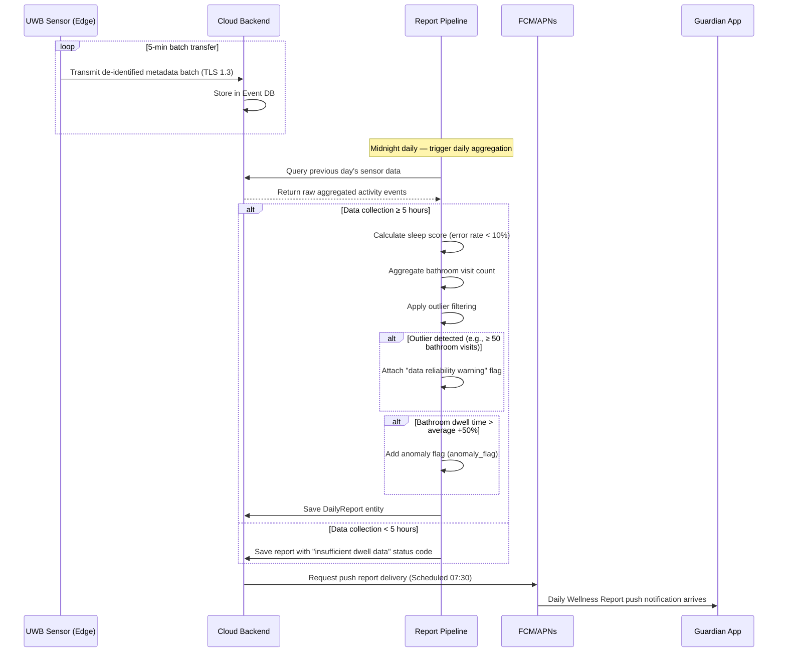

#### 3.4.2 Zero False Alarm AI Validator Execution Sequence

Execution flow of the Validator logic analyzing UWB radar signals at the edge to distinguish tossing/pets from a real fall/apnea.

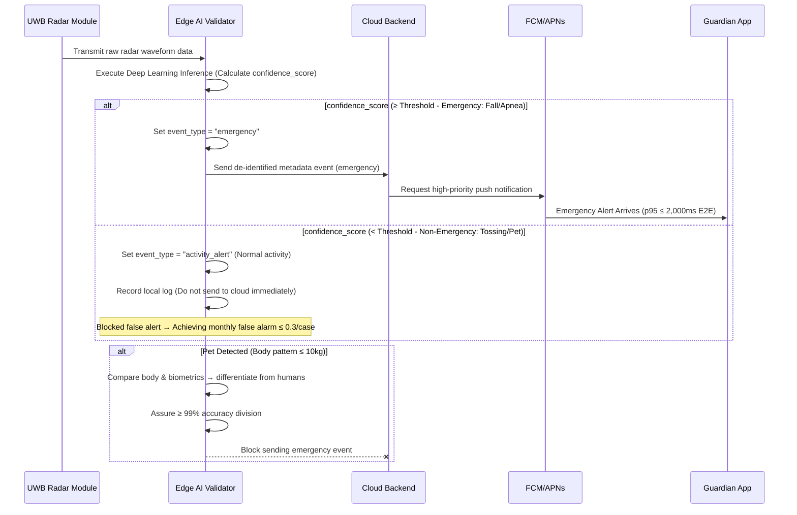

#### 3.4.3 PMF Diagnostic Sequence (Tracking User Experience Metrics)

Tracking the North Star metric (Monthly perceived false alarms ≤ 2 times) and secondary KPI (View report ≥ 5 times/week).

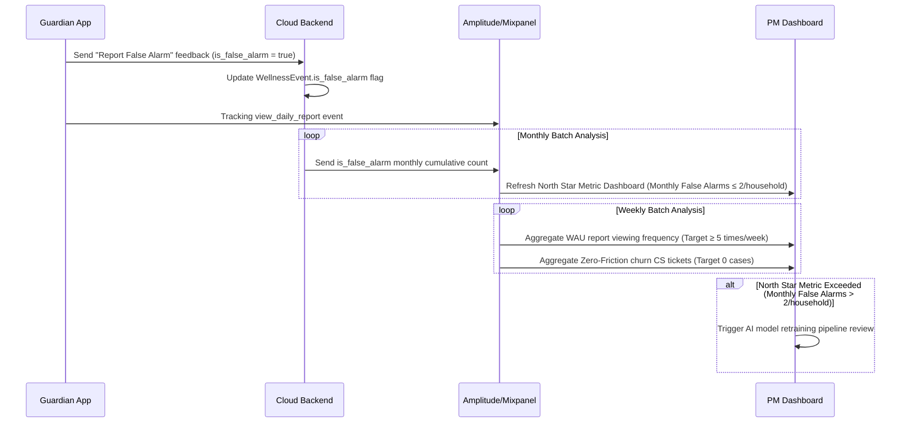

#### 3.4.4 EMR System Synchronization Sequence

Entire flow matching event generation → dashboard update → EMR Webhook transfer → retry on failure in the B2B context.

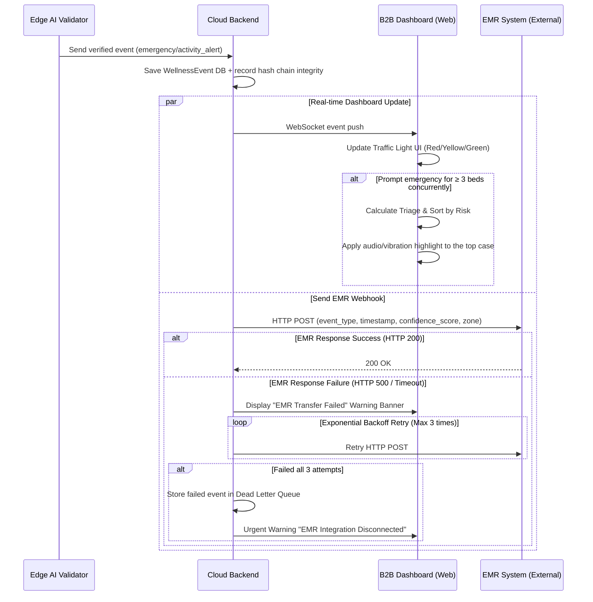

### 3.5 Use Case Diagram

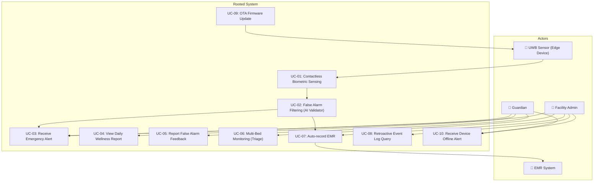

### 3.6 Entity-Relationship Diagram (ERD)

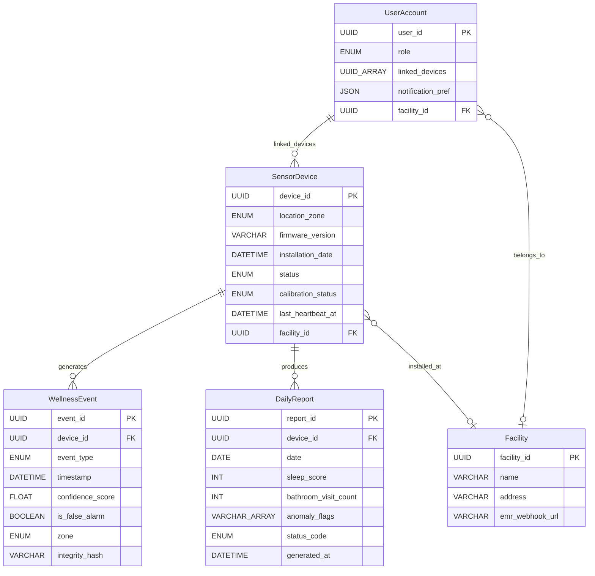

### 3.7 Class Diagram

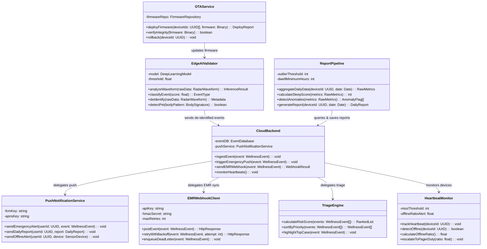

### 3.8 Component Diagram

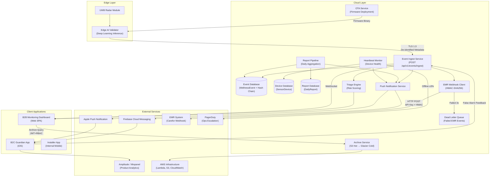

---

## 4. Specific Requirements

### 4.1 Functional Requirements

> **Legend:** The Source column refers to the PRD Story/FR number. Priority follows the MoSCoW criterion. ACs are written in Given/When/Then format.

---

#### FR-01: Zero False Alarm AI Filtering Engine (Must, DOS 3.8, XL — 3~4 Sprints)

| ID | Requirement Statement | Source | Acceptance Criteria | Priority |
| :--- | :--- | :--- | :--- | :--- |
| REQ-FUNC-001 | Edge AI Validator analyzes UWB radar waveforms via deep learning and classifies events as `emergency` or `activity_alert`. | Story 1, FR-01 | **Given** sensor is working normally **When** radar waveform is inputted **Then** the AI model calculates `confidence_score` (0-1) and decides the event type based on the threshold. | **Must** |
| REQ-FUNC-002 | The system strictly separates non-urgent activities like tossing and sitting as `activity_alert`, blocking immediate alerts. | Story 1 (AC-1.1), FR-01 | **Given** sensor is working normally **When** the elderly person tosses a blanket **Then** no false alarm occurs. Monthly false alarm rate ≤ 0.3/household. | **Must** |
| REQ-FUNC-003 | The system shall isolate the movement of pets (≤ 10kg) and differentiate from human patterns, ensuring no alarms are erroneously sent. | Story 1 (AC-1.4), FR-01 | **Given** pets are traversing the sensor area **When** movements are detected **Then** system accurately isolates pet signals with ≥ 99% accuracy and suppresses the alert. | **Must** |
| REQ-FUNC-004 | In real fall detections (feeble movement patterns continuously over 5 mins), send instantaneous high-priority alerts under 60 seconds. | Story 1 (AC-1.3), FR-01 | **Given** an actual fall happens with signs of weak movement **When** Validator marks `confidence_score` ≥ Threshold **Then** guardian push arrives under 60 seconds. | **Must** |
| REQ-FUNC-005 | The user app allows submitting "False Alarm" flags, and the database automatically marks the occurrence. | Story 1, §1.3 | **Given** guardian gets an urgent push **When** taps "Report False Alarm" **Then** backend updates `is_false_alarm` = `true` in DB for batch metrics. | **Must** |

---

#### FR-02: Zero-Friction Contactless Sensor Module (Must, DOS 3.6, L — 2~3 Sprints)

| ID | Requirement Statement | Source | Acceptance Criteria | Priority |
| :--- | :--- | :--- | :--- | :--- |
| REQ-FUNC-006 | Mounted correctly on wall/ceilings, the sensor must demand exactly 0 user manipulations once deployed. | Story 1 (AC-1.2), FR-02 | **Given** setup completes **When** everyday usage initiates **Then** elderly engagement frequency strictly equates to 0 (No charging/wearing/buttons). | **Must** |
| REQ-FUNC-007 | Perform automated calibrations immediately following fresh installations to map boundaries efficiently. | FR-02, NFR-11 | **Given** new placement operates **When** initialized **Then** calibration passes completely and logs as `calibrated`. | **Must** |
| REQ-FUNC-008 | Drop of power / missing Wi-Fi heartbeats beyond 15 minutes triggers a 1-time offline push. | Story 1 (AC-1.5), FR-02 | **Given** a device severs WiFi or power **When** continuous heartbeats fail > 15 minutes **Then** push message is fired one time to guardians/admins denoting offline parameters. | **Must** |

---

#### FR-03: Privacy-Preserving Non-Video Tracking (Must, DOS 3.0, L — 2~3 Sprints)

| ID | Requirement Statement | Source | Acceptance Criteria | Priority |
| :--- | :--- | :--- | :--- | :--- |
| REQ-FUNC-009 | Keep track of indoor paths using non-video sensors, registering dwell times and boundaries strictly ignoring camera solutions. | FR-03, §1.4 KSF #2 | **Given** sensor functions actively **When** users traverse between zones **Then** paths record sans explicit video storage guaranteeing 100% privacy compliance. | **Must** |
| REQ-FUNC-010 | The Edge device MUST manipulate raw radar arrays into numerical statistics inside its local CPU before shipping to Cloud. Direct uploading is prohibited. | FR-03, CON-02 | **Given** waveforms arrive **When** trying to move data to Cloud **Then** only fully de-identified digits are permitted through. | **Must** |

---

#### FR-04: B2B Multi-bed Dashboard + EMR Webhook (Must, DOS 3.4, L — 2~3 Sprints)

| ID | Requirement Statement | Source | Acceptance Criteria | Priority |
| :--- | :--- | :--- | :--- | :--- |
| REQ-FUNC-011 | Implement color-coded nodes for individual patient beds via B2B dashboards displaying synchronous status markers. | Story 3, FR-04 | **Given** dashboard active **When** receiving a warning event via websocket **Then** UI transitions matching node colors. | **Must** |
| REQ-FUNC-012 | If ≥ 3 simultaneous emergencies arrive, activate Triage module prioritizing dangerous elements first adding auditory signals to the top element. | Story 3 (AC-3.5), FR-04 | **Given** simultaneous alerts occur **When** evaluating arrays > 3 items **Then** highest ranked object gets primary sound/visual cues correctly organized in lists. | **Must** |
| REQ-FUNC-013 | With EMR Webhooks functional, event meta-data gets routed seamlessly dropping double manual entry down to 0. | Story 3 (AC-3.2), FR-04 | **Given** EMR config is verified **When** an alert emerges **Then** HTTP request transfers data perfectly logging without manual assistance. | **Must** |
| REQ-FUNC-014 | Handle offline EMR states or 500 errors gracefully with 3 back-off retries and visible front-end notices. | Story 3 (AC-3.4), FR-04 | **Given** external EMR yields connection loss **When** posting data **Then** alert displays "EMR Sync Failing" and tries 3 times on interval timeouts. | **Must** |
| REQ-FUNC-015 | Maintain 90-day archive searchability guaranteeing proof of integrity against lawsuit threats. | Story 3 (AC-3.3), FR-04 | **Given** a manager initiates backward searching **When** a date scope applies **Then** accurate log returns fetching from safe storage up to 90 days. | **Must** |

---

#### FR-05: B2C Daily Wellness Notification Pipeline (Should, DOS 2.85, M — 1~2 Sprints)

| ID | Requirement Statement | Source | Acceptance Criteria | Priority |
| :--- | :--- | :--- | :--- | :--- |
| REQ-FUNC-016 | Consolidate and summarize previous 24hr analytics executing precision sleeping and bathroom habits below a 10% discrepancy limit. | Story 2 (AC-2.1), FR-05 | **Given** constant operations **When** crossing midnight intervals **Then** accurately issue reports holding exact limits checking against established baseline truth. | **Should** |
| REQ-FUNC-017 | Push special daily alerts immediately if an individual's bathroom length metric breaches 50% above customary trends. | Story 2 (AC-2.2), FR-05 | **Given** normal patterns observed beforehand **When** current duration stretches > +50% expected threshold **Then** special report arrives denoting discrepancies early. | **Should** |
| REQ-FUNC-018 | Emit status notice "Missing Stay Metrics" failing < 5 hours threshold mapping for residents vacationing or hospitalized. | Story 2 (AC-2.4), FR-05 | **Given** subjects leave for extended visits **When** morning rollbacks fire **Then** the push mentions zero-action via insufficient tracking limits instead of blank outputs. | **Should** |
| REQ-FUNC-019 | Attach 'unreliable data' warning elements preventing anxiety if mechanical bugs force outlier results (ex. > 50 door checks). | Story 2 (AC-2.5), FR-05 | **Given** impossible counts trigger (50x door triggers) **When** sorting values **Then** system labels anomaly appending a warning message "Sensor Service Requires Inspection". | **Should** |
| REQ-FUNC-020 | Program consistent delivery mechanism routing formatted outputs specifically arriving 07:30 routinely to guardian mobiles. | FR-05, §2.2.3 | **Given** full daily generation **When** time hits defined morning parameter **Then** standard background queues empty to APNs passing correctly right on schedule. | **Should** |

---

#### FR-06: Sleep Tracking Charts (Could, S — 1 Sprint)

| ID | Requirement Statement | Source | Acceptance Criteria | Priority |
| :--- | :--- | :--- | :--- | :--- |
| REQ-FUNC-021 | Chart temporal sleep patterns leveraging accumulated points producing week/month timelines within the App tab. | FR-06, §1.7 CJM P5 | **Given** > 7 reports exist securely **When** the person browses the trend interface **Then** cleanly draws graph arrays showing variations predictably. | **Could** |

---

#### FR-07: Fallback Message Providers — SMS/Kakao (Could, S — 1 Sprint)

| ID | Requirement Statement | Source | Acceptance Criteria | Priority |
| :--- | :--- | :--- | :--- | :--- |
| REQ-FUNC-022 | Broadcast backup texts or Kakao alerts parallel to APN pushes accommodating network limits whenever set active. | FR-07, §2.2.3 | **Given** guardians turn feature True in config **When** critical pings originate **Then** user acquires regular internet notification plus mobile network texts flawlessly. | **Could** |

---

#### FR-08: Configurable Dashboards (Could, S — 1 Sprint)

| ID | Requirement Statement | Source | Acceptance Criteria | Priority |
| :--- | :--- | :--- | :--- | :--- |
| REQ-FUNC-023 | Afford administrators filtering options grouping displays using custom rulesets depending on assigned wards or priority. | FR-08, §3.1 Ext. Function 4 | **Given** staff members engage with UI **When** specific room tags or condition layers apply **Then** visual grid limits display perfectly mapping conditions immediately. | **Could** |

---

### 4.2 Non-Functional Requirements

#### 4.2.1 Performance

| ID | Requirement Statement | Metric / Threshold | Monitoring | PRD Source |
| :--- | :--- | :--- | :--- | :--- |
| REQ-NF-001 | End-to-end latency mapping fall detection straight to mobile delivery | **p95 ≤ 2,000 ms** | Datadog APM realtime panels. Break > 2.5s signals `#ops-alert` on Slack. | NFR-01 |
| REQ-NF-002 | Accuracy metrics proving False Alarm mitigation algorithm success | **≤ 0.3 events/month/home** | Weekend batches reading `is_false_alarm` via Amplitude counts. | NFR-02 |
| REQ-NF-003 | Deviation metrics against physical actuals regarding bathroom usage or sleep points | **Error value < 10%** | Manual comparison routines against beta testers ground-truth data points. | NFR-03 |
| REQ-NF-004 | Stress-test boundaries checking transaction responses and connection hold limits | **E2E p95 ≤ 500ms at 1,000 active nodes.** Scaling limits established testing 5k virtual instances matching Wave 2 requirements. | Monthly simulated stress check protocols. | NFR-14 |

#### 4.2.2 Availability / Reliability

| ID | Requirement Statement | Metric / Threshold | Monitoring | PRD Source |
| :--- | :--- | :--- | :--- | :--- |
| REQ-NF-005 | Guaranteed SLA coverage regarding application stability ensuring strict limits. | **SLA ≥ 99.9%** (Downtime 43.8m cap/month) | Constant synthetic checks running every 5 min. | NFR-04 |
| REQ-NF-006 | Max error bounds mapping packet drop elements between nodes over internet tunnels. | **≤ 0.1% loss limits** | Aggregation summaries verifying Edge proxy routing arrays. | NFR-05 |
| REQ-NF-007 | High priority network alerting mapping large systemic dropouts affecting base systems (>3%). | Auto page PagerDuty **Sev1** parameters | Persistent real-time ping trackers. | NFR-13 |

#### 4.2.3 Security

| ID | Requirement Statement | Metric / Threshold | Monitoring | PRD Source |
| :--- | :--- | :--- | :--- | :--- |
| REQ-NF-008 | Force strict security layers across network protocols using updated ciphers preventing snooping. | 100% adherence to TLS 1.3 standards. | Yearly 3rd party penetration checking / Monthly auditing. | NFR-06 |
| REQ-NF-009 | Execute pure compliance matching privacy clauses ensuring personal markers completely evade capture. | 0 identifiable markers. | Quarterly internal DB examination. | NFR-07 |
| REQ-NF-010 | Anchor endpoint EMR push capabilities restricting access exclusively resolving keys and custom hashes. | API Key + HMAC-SHA256, 0 broken access | Daily log monitoring. | §6.2 |
| REQ-NF-011 | Implement JWT verification plus hard RBAC limitations over historical database lookups. | RBAC, 0 broken access | Quarterly RBAC evaluation cycles. | §6.2 |

#### 4.2.4 Cost

| ID | Requirement Statement | Metric / Threshold | Monitoring | PRD Source |
| :--- | :--- | :--- | :--- | :--- |
| REQ-NF-012 | Limit runaway cloud cost profiles managing exact pricing structures across deployed household variables. | **≤ 500 KRW/Unit/Month.** Breaching triggers `#cost-alert`. | Daily check loops relying on AWS billing arrays. | NFR-08 |

#### 4.2.5 Operations / Monitoring

| ID | Requirement Statement | Metric / Threshold | Monitoring | PRD Source |
| :--- | :--- | :--- | :--- | :--- |
| REQ-NF-013 | Ensure seamless and accurate background firmware pushing over live environments guaranteeing reliability. | Deploy Success Rates ≥ 99% | Observing OTA system hooks natively. | NFR-09 |
| REQ-NF-014 | Keep exact tabs over PMF North Star markers ensuring limits reflect valid market assumptions. | **≤ 2 complaints / house / month.** | Aggregation of 'Report False' feedback loops. | §1.3 |
| REQ-NF-015 | Retain weekly viewing frequency values holding users steady above minimum attention spans. | WAU limits **≥ 5 report hits specific weekly interval**. | Amplitude `view_daily_report` tracker. | §1.3 |
| REQ-NF-016 | Prove friction elimination logic ensuring seniors exhibit absolute passivity omitting direct rejection. | Churn via explicit "Too uncomfortable" parameters at exactly **0**. | Reading tagged CRM markers dynamically. | §1.3 |

#### 4.2.6 Data Retention

| ID | Requirement Statement | Metric / Threshold | Monitoring | PRD Source |
| :--- | :--- | :--- | :--- | :--- |
| REQ-NF-017 | Push records into distinct archival cycles transitioning them reliably maintaining cryptologic protections verifying legality. | Hot limits: 90 Days / Cold parameters: > 3 Years | Batch monitoring checking transitions properly. | NFR-10 |

#### 4.2.7 Scalability / Maintainability

| ID | Requirement Statement | Metric / Threshold | Monitoring | PRD Source |
| :--- | :--- | :--- | :--- | :--- |
| REQ-NF-018 | Define horizontal expansion capacities readying backend pipelines surviving next wave projections. | Secure limits functioning beyond 5K simultaneous streams correctly. | Routine simulated arrays checking. | NFR-14 |
| REQ-NF-019 | Establish absolute hard rules isolating variable syntax prohibiting regulatory keywords entirely at compile phases. | Linter catches ruleset breaking structures preventing merging exactly 100%. | Specific CI checks tracking exact words. | NFR-12 |
| REQ-NF-020 | Support engineering staff applying positioning with precise internal software mitigating poor angles naturally. | Install matching angles executing ≥ 95% accurately | Read metrics reviewing automated config checks. | NFR-11 |

---

## 5. Traceability Matrix

| PRD Source (Story / FR / NFR) | Requirement ID | Requirement Type | Test Case ID | Test Case Summary |
| :--- | :--- | :--- | :--- | :--- |
| Story 1, FR-01 | REQ-FUNC-001 | Functional | TC-FUNC-018 | Inject various radar waveforms and verify Edge AI Validator classifies events correctly with appropriate confidence_score and event_type. |
| Story 1 (AC-1.1), FR-01 | REQ-FUNC-002 | Functional | TC-FUNC-001 | Verify absent flags when injecting blanket movement. Track 30d values ≤ 0.3. |
| Story 1 (AC-1.4), FR-01 | REQ-FUNC-003 | Functional | TC-FUNC-002 | Simulate ≤ 10kg objects traversing boundary. Note accuracy rates exceeding 99% logic mapping. |
| Story 1 (AC-1.3), FR-01 | REQ-FUNC-004 | Functional | TC-FUNC-003 | Run actual fall tests recording push duration consistently measuring under limits. |
| Story 1, §1.3 | REQ-FUNC-005 | Functional | TC-FUNC-006 | Run mock alert feedback via UI tests mapping `is_false_alarm` markers correctly. |
| Story 1 (AC-1.2), FR-02 | REQ-FUNC-006 | Functional | TC-FUNC-004 | Note device operational parameters during constant weekly bounds tracking friction limits at exactly nil. |
| FR-02, NFR-11 | REQ-FUNC-007 | Functional | TC-FUNC-019 | Deploy a new sensor and verify automated calibration completes successfully, logging status as `calibrated`. |
| Story 1 (AC-1.5), FR-02 | REQ-FUNC-008 | Functional | TC-FUNC-005 | Execute hard severing logic. Mark precise time mapping arrival of single disconnect pings. |
| FR-03, §1.4 KSF #2 | REQ-FUNC-009 | Functional | TC-FUNC-020 | Verify indoor path tracking records dwell times across zones using non-video sensors with 100% privacy compliance. |
| FR-03, CON-02 | REQ-FUNC-010 | Functional | TC-FUNC-021 | Confirm Edge device converts raw radar waveforms to numerical statistics locally; verify no raw data is transmitted to Cloud. |
| Story 3, FR-04 | REQ-FUNC-011 | Functional | TC-FUNC-022 | Verify dashboard displays color-coded bed nodes and updates status via WebSocket events. |
| Story 3 (AC-3.5), FR-04 | REQ-FUNC-012 | Functional | TC-FUNC-011 | Overload backend arrays parsing multiple events confirming prioritization arrays automatically display top marks. |
| Story 3 (AC-3.2), FR-04 | REQ-FUNC-013 | Functional | TC-FUNC-012 | Confirm standard Webhook pings against manual check counts ensuring parallel operations seamlessly map. |
| Story 3 (AC-3.4), FR-04 | REQ-FUNC-014 | Functional | TC-FUNC-013 | Simulate server connection failures noting retry configurations executing correctly before failing. |
| Story 3 (AC-3.3), FR-04 | REQ-FUNC-015 | Functional | TC-FUNC-014 | Scan values approaching timeline borders tracking successful archive queries and exact migrations. |
| Story 2 (AC-2.1), FR-05 | REQ-FUNC-016 | Functional | TC-FUNC-007 | Cross reference ground-truth papers tracking actual bathroom values confirming 90%+ similarity. |
| Story 2 (AC-2.2), FR-05 | REQ-FUNC-017 | Functional | TC-FUNC-008 | Program anomaly values surpassing strict values triggering immediate notification logic. |
| Story 2 (AC-2.4), FR-05 | REQ-FUNC-018 | Functional | TC-FUNC-009 | Ensure specific absence yields exact "Insufficient dwell data" notifications avoiding blank error states. |
| Story 2 (AC-2.5), FR-05 | REQ-FUNC-019 | Functional | TC-FUNC-010 | Trigger false machine positives confirming precise display values alongside warning flags efficiently. |
| FR-05, §2.2.3 | REQ-FUNC-020 | Functional | TC-FUNC-023 | Verify daily report push delivery is scheduled and arrives at 07:30 consistently via FCM/APNs queue. |
| FR-06 | REQ-FUNC-021 | Functional | TC-FUNC-015 | Render front end panels mapping collected point values onto visual timelines consistently. |
| FR-07 | REQ-FUNC-022 | Functional | TC-FUNC-016 | Initiate redundant SMS routes mimicking APNs limits checking receipt on dual paths successfully. |
| FR-08 | REQ-FUNC-023 | Functional | TC-FUNC-017 | Check filtering tools accurately hiding nodes violating conditions perfectly adjusting grid mapping. |
| NFR-01 | REQ-NF-001 | Non-Functional | TC-NF-001 | Automate 1k tests aggregating p95 limits under exact boundaries measuring effectively. |
| NFR-02 | REQ-NF-002 | Non-Functional | TC-NF-002 | Query monthly data strings validating performance limits keeping averages far below defined caps. |
| NFR-03 | REQ-NF-003 | Non-Functional | TC-NF-011 | Compare system-reported sleep scores and bathroom counts against ground-truth data; verify error rate < 10%. |
| NFR-14 | REQ-NF-004 | Non-Functional | TC-NF-004 | Spawn massive virtual arrays checking maximum transaction limits staying within strict rules effectively. |
| NFR-04 | REQ-NF-005 | Non-Functional | TC-NF-003 | Retrieve official host platform numbers affirming constant availability matches target numbers continuously. |
| NFR-05 | REQ-NF-006 | Non-Functional | TC-NF-012 | Measure packet loss rate between Edge and Cloud over sustained test periods; confirm ≤ 0.1% loss. |
| NFR-13 | REQ-NF-007 | Non-Functional | TC-NF-013 | Simulate >3% sensor offline rate within 1 hour and verify PagerDuty Sev1 alert is triggered automatically. |
| NFR-06 | REQ-NF-008 | Non-Functional | TC-NF-005 | Run strict packet evaluation reviewing cryptography compliance blocking unprotected layers completely. |
| NFR-07 | REQ-NF-009 | Non-Functional | TC-NF-014 | Perform quarterly DB scan to verify no personally identifiable markers exist; confirm 0 identifiable records. |
| §6.2 | REQ-NF-010 | Non-Functional | TC-NF-015 | Verify EMR Webhook endpoint enforces API Key + HMAC-SHA256 authentication; confirm 0 unauthorized access. |
| §6.2 | REQ-NF-011 | Non-Functional | TC-NF-016 | Test JWT + RBAC enforcement on event archive API; verify unauthorized role access is denied with 403. |
| NFR-08 | REQ-NF-012 | Non-Functional | TC-NF-006 | Confirm calculated expenditure parameters verifying structural cost boundaries efficiently mapping targets. |
| NFR-09 | REQ-NF-013 | Non-Functional | TC-NF-017 | Execute OTA firmware deployment to test devices; verify deployment success rate ≥ 99% with rollback on failure. |
| §1.3 | REQ-NF-014 | Non-Functional | TC-NF-008 | Automate reading complaint markers maintaining user thresholds exactly underneath specific count rates. |
| §1.3 | REQ-NF-015 | Non-Functional | TC-NF-009 | Review active hits checking numbers exceed specific baseline limits targeting positive usage percentages. |
| §1.3 | REQ-NF-016 | Non-Functional | TC-NF-010 | Aggregate churn parameters verifying lack of discomfort signals registering entirely null. |
| NFR-10 | REQ-NF-017 | Non-Functional | TC-NF-007 | Validate archival hash blocks maintaining identical string arrays assuring legal protections remain unbroken. |
| NFR-14 | REQ-NF-018 | Non-Functional | TC-NF-018 | Load test with 5,000 concurrent device streams; verify system scales horizontally without degradation. |
| NFR-12 | REQ-NF-019 | Non-Functional | TC-NF-019 | Run CI linter against entire codebase; verify 100% of regulatory-trigger words (diagnosis, medical, patient) are caught and blocked from merge. |
| NFR-11 | REQ-NF-020 | Non-Functional | TC-NF-020 | Deploy sensor using installer app; verify calibration guidance achieves ≥ 95% correct angle placement. |

---

## 6. Appendix

### 6.1 API Endpoint List

| # | Endpoint | Method | Description | Auth | Rate Limit | PRD Source |
| :--- | :--- | :--- | :--- | :--- | :--- | :--- |
| 1 | `POST /api/v1/events/ingest` | POST | Transmit de-identified events batch from edge to cloud (5 min). | TLS 1.3 Client Cert | - | §3.1 Feature 3 |
| 2 | `POST /api/v1/webhooks/emr` | POST | Webhook output sending system events targeting defined EMR pipelines. | API Key + HMAC | 100 req/min/fac | §3.1 Feature 4 |
| 3 | `POST /api/v1/notifications/push` | POST | FCM/APNs external execution. (Emergencies send asap, reports queue natively). | Provider Keys | - | §2.2.3 |
| 4 | `GET /api/v1/reports/daily/{device_id}/{date}` | GET | Request defined date point retrieving single report array details. | JWT | - | FR-05 |
| 5 | `GET /api/v1/reports/trend/{device_id}` | GET | Yield multi-point arrays mapping sleep and metrics tracking lines. | JWT | - | FR-06 |
| 6 | `POST /api/v1/events/{event_id}/false-alarm` | POST | Receive specific ping modifying db mapping event logic checking negative values. | JWT | - | §1.3 |
| 7 | `GET /api/v1/events/archive` | GET | Enable backward scanning of past records restricted behind strict access tokens securely. | JWT+RBAC | - | §1.8 Q2 |
| 8 | `GET /api/v1/dashboard/status` | GET | Return exact multi-node UI structures supporting continuous streaming paths via sockets parallelly. | JWT (Admin) | - | FR-04 |
| 9 | `PATCH /api/v1/dashboard/filters` | PATCH | Save grid configurations mapping logic filters efficiently saving manager properties precisely. | JWT (Admin) | - | FR-08 |
| 10 | `POST /api/v1/devices/{device_id}/ota` | POST | Execute external commands sending binary arrays pushing firmware reliably across air paths. | Internal Service Auth | - | NFR-09 |
| 11 | `GET /api/v1/devices/{device_id}/heartbeat` | GET | Read explicit status nodes predicting life-cycle patterns reporting connection states successfully. | Internal Service Auth | - | FR-02 |

### 6.2 Entity & Data Model

#### 6.2.1 SensorDevice

| Field | Type | Constraint | Description |
| :--- | :--- | :--- | :--- |
| `device_id` | UUID | PK, NOT NULL | Unique Device Identifiers |
| `location_zone` | ENUM (`bedroom`, `bathroom`, `living_room`) | NOT NULL | Configured room limits |
| `firmware_version` | VARCHAR(20) | NOT NULL | Current active ROM iteration mappings |
| `installation_date` | DATETIME | NOT NULL | Deployment timestamp logs |
| `status` | ENUM (`active`, `inactive`, `maintenance`) | NOT NULL, Default `active` | Hardware state value references |
| `calibration_status` | ENUM (`calibrated`, `pending`) | NOT NULL, Default `pending` | Mapping config completion parameters |
| `last_heartbeat_at` | DATETIME | | Timestamp registering most recent sign of life signals |
| `facility_id` | UUID (FK → Facility) | NULLABLE | Direct connection mapped tracking B2B arrays directly |

#### 6.2.2 WellnessEvent

| Field | Type | Constraint | Description |
| :--- | :--- | :--- | :--- |
| `event_id` | UUID | PK, NOT NULL | Single exact record strings |
| `device_id` | UUID (FK → SensorDevice) | NOT NULL | Correlating node |
| `event_type` | ENUM (`activity_alert`, `wellness_score`, `emergency`) | NOT NULL | Primary type classifications |
| `timestamp` | DATETIME | NOT NULL, INDEX | Execution timing references |
| `confidence_score` | FLOAT (0.0–1.0) | NOT NULL | Exact system judgement metrics |
| `is_false_alarm` | BOOLEAN | NOT NULL, Default `false` | Human verified reversal markers |
| `zone` | ENUM (`bedroom`, `bathroom`, `living_room`) | NOT NULL | Origin string values |
| `integrity_hash` | VARCHAR(64) | NOT NULL | Protective cryptographic string preserving truth limits explicitly |

#### 6.2.3 UserAccount

| Field | Type | Constraint | Description |
| :--- | :--- | :--- | :--- |
| `user_id` | UUID | PK, NOT NULL | Identity structures |
| `role` | ENUM (`guardian`, `facility_admin`) | NOT NULL | Permission limit definitions |
| `linked_devices` | UUID[] | | Group paths listing available access nodes |
| `notification_pref` | JSON | Default `{"push": true}` | Routing structure values toggling external pathways effectively |
| `facility_id` | UUID (FK → Facility) | NULLABLE | Organizational references tying managers into specific databases |

#### 6.2.4 DailyReport

| Field | Type | Constraint | Description |
| :--- | :--- | :--- | :--- |
| `report_id` | UUID | PK, NOT NULL | Unique summary markers |
| `device_id` | UUID (FK → SensorDevice) | NOT NULL | Related subject links |
| `date` | DATE | NOT NULL, INDEX | Metric timeline reference point |
| `sleep_score` | INT (0–100) | NULLABLE | Analytics value or null if metrics fail logic boundaries |
| `bathroom_visit_count` | INT | NULLABLE | Iteration tracking count integer boundaries successfully |
| `anomaly_flags` | VARCHAR[] | Default `{}` | Additional tagging references providing early stage insights efficiently |
| `status_code` | ENUM (`normal`, `insufficient_data`, `sensor_error`) | NOT NULL, Default `normal` | Validation structures describing exact health reporting correctly |
| `generated_at` | DATETIME | NOT NULL | Precise timestamp |

### 6.3 Detailed Interaction Models

#### 6.3.1 Detailed Sequence — Fall Detection → Emergency Alert → EMR Integration E2E Flow

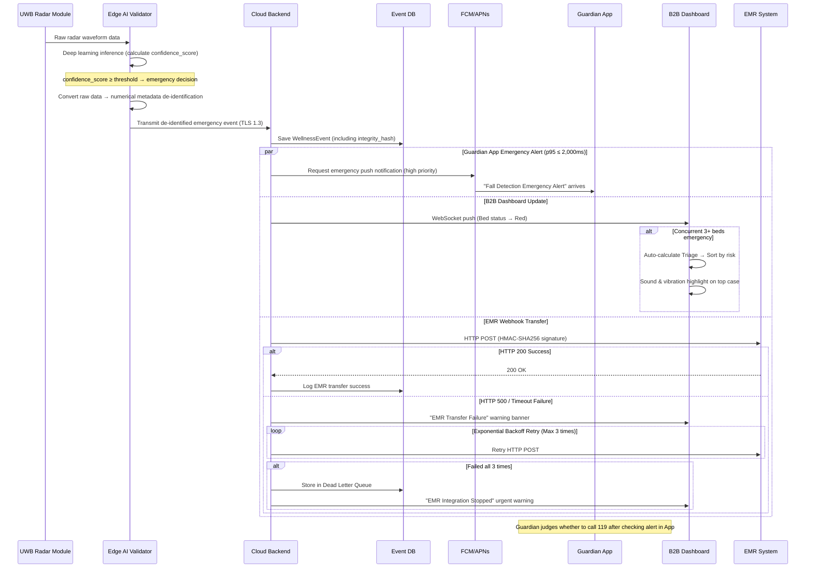

#### 6.3.2 Detailed Sequence — Device Offline Detection → PagerDuty Escalation

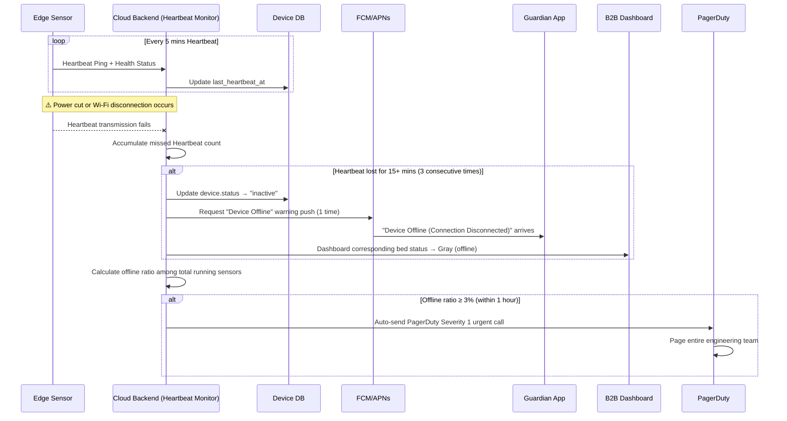

#### 6.3.3 Detailed Sequence — OTA Firmware Update + False Alarm Threshold Adjustment

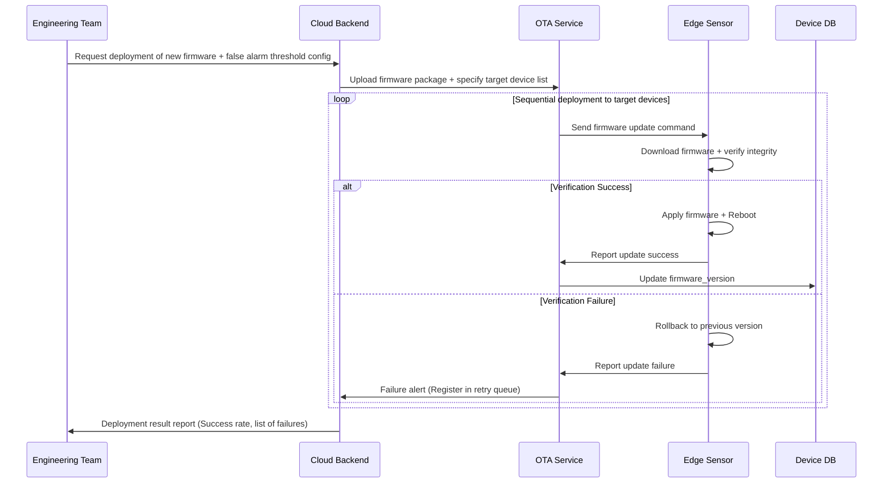

### 6.4 Validation Plan

Validation plan based on experiment hypothesis/measurement/success criteria in PRD §8.2.

| Experiment ID | Hypothesis | Measurement Protocol | Acceptance/Success Criteria | Related Requirements |
| :--- | :--- | :--- | :--- | :--- |
| **EXP-01** | Eliminating false alarms in B2B sites improves contract retention & satisfaction. | Run 1st closed beta in 5 nursing homes (150 beds total) concurrently. Track `is_false_alarm` flag continuously for 4 weeks. | False alarms **reduced by ≥ 97.5%** compared to old motion sensor control group (≤ 2 cases per bed/month). | REQ-FUNC-002, REQ-NF-002 |
| **EXP-02** | B2C daily reports contribute to preventing subscription churn. | 2nd open beta with 100–200 households. Track Amplitude `view_daily_report` views for 4 weeks. | WAU stats show **≥ 60% users checking ≥ 5 times/week**. | REQ-FUNC-016, REQ-NF-015 |
| **EXP-03** | Zero-Friction eliminates resistance among elderly users. | Entire subscriber base during Wave 2. Analyze text of CRM CS tickets for 'operation inconvenience/device wearing refusal'. | Accumulated churn/cancellation complaints = **0 cases**. | REQ-FUNC-006, REQ-NF-016 |

---

**— End of SRS Document —**
