# Software Requirements Specification (SRS)

Document ID: SRS-001  
Revision: 2.0  
Date: 2026-04-19  
Standard: ISO/IEC/IEEE 29148:2018  
Tech Stack: Next.js (App Router) + Prisma + Supabase + Vercel AI SDK + Vercel Deployment

---

### Revision History

| Version | Date | Description |
| :--- | :--- | :--- |
| 1.0 | 2026-04-18 | Initial SRS based on PRD v0.3 (AWS Cloud Architecture) |
| 2.0 | 2026-04-19 | Full MVP tech stack adaptation — Next.js App Router, Prisma + Supabase, Vercel AI SDK + Gemini, Vercel deployment. Applied per PLAN-SRS-001-MVP. |

---

## 1. Introduction

### 1.1 Purpose

This SRS defines the functional, non-functional, interface, and data requirements for the Minimum Viable Product (MVP) software system of **Rooted**, a contactless AI ambient home safety solution, in accordance with the ISO/IEC/IEEE 29148:2018 standard.

**Targeted Problem:**

The contactless ambient care market is structurally in an "Unmet Need" state from B2B, B2G, and B2C perspectives.

- **B2B (Nursing Facilities):** 12 false alarms per day on average from low-cost motion sensors cause alarm fatigue, leading to the accumulation of 11 false alarms during a night shift → ignoring alarms → the worst-case scenario of a fatal accident becoming reality. Moreover, the lack of data integration with EMR networks forces double-entry work. (PRD §1.1, §1.7 Jang Young-hee Extreme case)
- **B2G (Local Governments):** They must resolve care blind spots with limited budgets, but face a cost-utility dilemma where high-spec equipment exceeds unit costs and low-spec equipment misses emergency signs. (PRD §1.5)
- **B2C (Guardians):** CCTV infringes on privacy, and wearables become virtually useless when left uncharged, causing guardians to experience extreme anxiety and lack of data with no way to immediately recognize their elderly parents' emergencies living alone. (PRD §1.5, §1.7, §1.10)

The intended audience for this SRS includes the development team, QA team, project managers, and external auditors. This document serves as the official reference for design, implementation, testing, and acceptance.

### 1.2 Scope (In-Scope / Out-of-Scope)

**System Name:** Rooted — Contactless AI Ambient Home Safety Solution

**Quantitative Objectives (Desired Outcome):**

| Objective | Current State (As-Is) | Target State (To-Be) | PRD Source |
| :--- | :--- | :--- | :--- |
| Monthly AI engine false alarm frequency | 12 cases/day (= 360 cases/month/household) | ≤ 0.3 cases/month/household | §1.9, §2.2.2 |
| Monthly perceived false alarm frequency by user (North Star) | 360 cases/month/household | ≤ 2 cases/household | §1.3 |
| Frequency of elderly operating device | Constant friction with wearable charging/wearing | 0 times (Zero-Friction) | §1.9 |
| Error rate of night sleep/bathroom patterns | Lack of data | Less than 10% | §1.9 |
| Privacy infringement | Rejection of CCTV/home cam surveillance | Non-video (de-identified) method, zero infringement | §1.10 |
| B2B EMR double-entry | Double entry (Manual + System) | Automatic EMR integration, 0 cases of double-entry | §1.10, §3.1 |

**In-Scope:**

| Item | Description | PRD Source |
| :--- | :--- | :--- |
| UWB radar HW integration | Contactless sensor module that senses movement, respiration, heart rate, and dwell time via radar waveforms without a camera | §2.2.1 |
| Zero false alarm AI engine | Deep learning-based edge inference model that precisely distinguishes tossing/turning/sitting from falls/apnea | §2.2.2, DOS 3.8 |
| B2C Guardian Portal (PWA) | **Progressive Web App** built on Next.js App Router. Emergency alerts via Web Push API, daily reports, false alarm reporting function. iOS Native → PWA transition for MVP. | §2.2.3, C-TEC-001 |
| B2B Monitoring Dashboard (Web) | Next.js App Router + shadcn/ui. Traffic light system (Red/Yellow/Green) multi-bed monitoring UI + EMR Webhook integration. Real-time updates via Supabase Realtime. | §2.2.3, C-TEC-004 |
| Wellness Daily Report | Automatically sends sleep scores, bathroom visit frequency, and anomaly flags daily at 07:30 via Vercel Cron Job. **Includes Gemini AI natural language summary.** | §3.1 Feature 5, C-TEC-005 |

**Out-of-Scope:**

| Item | Reason for Exclusion | PRD Source |
| :--- | :--- | :--- |
| Smart home control integration (Lighting/Appliances) | Dilutes the core value of safety. Aqara Life method excluded. | §2.3 #1 |
| Use of 'Care' marketing language | Prevents rejection due to 'elderly stigma' from the non-user Ko Tae-sik type ~440K-540K households. | §2.3 #2 |
| B2G public procurement lowest price bidding SLA specs | Causes indefinite delay at launch time. Re-evaluate in Q4 after verifying SOM S1 segment penetration. | §2.3 #3 |
| iOS Native App | Deferred to Wave 2. MVP uses PWA with Web Push API (iOS Safari 16.4+ required). | C-TEC-001 |
| Android Native App | Deferred to Wave 2+. | §2.2.3 |
| Installer App (Mobile) | Out of MVP web stack scope. Replaceable with PWA-based installer guide. | C-TEC-001 |

### 1.3 Definitions, Acronyms, Abbreviations

| Term | Definition |
| :--- | :--- |
| UWB (Ultra-Wideband) | Ultra-wideband wireless technology. Radar-based technology that senses respiration, heart rate, and movement patterns through radio wave reflection without a camera. |
| Zero-Friction | A UX principle where the system operates autonomously without any manual intervention by the user (elderly), such as charging, wearing, or button operation. |
| False Alarm | A phenomenon where the system mistakenly identifies a non-emergency situation (e.g., tossing in bed, pet movement) as an emergency and sends an alert. |
| JTBD (Jobs to be Done) | A framework that analyzes product needs centering around the tasks or goals a user wants to achieve in a specific situation. |
| AOS (Adjusted Opportunity Score) | An adjusted opportunity score calculated from opportunity discovery interviews. It quantifies the market opportunity size by weighting importance and satisfaction. |
| DOS (Discovered Opportunity Score) | An opportunity score discovered in interviews. Quantifies the degree of unmet need compared to existing alternatives on a 0-5 scale. |
| CJM (Customer Journey Map) | An analysis tool that visualizes the experiences and emotions of the customer's entire journey from awareness, purchase, usage, to churn. |
| Triage | An algorithm that automatically calculates the risk level and determines response priority during simultaneous emergencies. |
| Edge | A local computing environment that performs AI inference directly on the sensor device itself. Raw data is processed before being sent to the cloud. |
| OTA (Over-the-Air) | A method to remotely update device firmware over a wireless network. |
| EMR (Electronic Medical Record) | The electronic medical record system of nursing facilities. |
| Webhook | A server-to-server communication method that automatically sends an HTTP POST request to a pre-registered external URL when a specific event occurs. |
| MoSCoW | Prioritization technique: Must / Should / Could / Won't. |
| Heartbeat | A signal periodically notifying the server that the device is operating normally. |
| Validator | A logic module that verifies the reliability of AI inference results and discriminates between false alarms and true events. |
| PMF (Product-Market Fit) | A metric indicating whether a product adequately satisfies the core needs of a market. |
| KSF (Key Success Factor) | The core success factors that determine a competitive advantage in the market. |
| PWA (Progressive Web App) | A web application that provides native app-like experience using Service Workers, Web Push API, and manifest.json for home screen installation. |
| Route Handler | Next.js App Router pattern for defining API endpoints within `app/api/` directory. Replaces traditional REST API backend servers. |
| Server Action | Next.js mechanism for executing server-side data mutations directly from React components without explicit API calls. |
| Supabase Realtime | WebSocket-based real-time subscription service built into Supabase that auto-broadcasts database changes to connected clients. |

### 1.4 References (REF-XX)

| Reference ID | Document Name | Description |
| :--- | :--- | :--- |
| REF-01 | PRD v0.3 — Rooted Contactless AI Ambient Home Safety Solution | The single source of truth for business/functional requirements of this SRS |
| REF-02 | KHIDI Market Report | Size of the Korean senior care market: 72T KRW (2020) → 168T KRW (2030) |
| REF-03 | Global AI-based Elderly Care Market Analysis | $56.8B (2025) → $329.4B (2034) (CAGR 21.3%) |
| REF-04 | JTBD VoC Interview Report | Original interview texts and AOS/DOS analysis from 3 groups (recent users/churners/non-using explorers) (§1.9) |
| REF-05 | Porter's Five Forces / 5-Company Competition Analysis | Structure and competitor analysis (Carebell, Opasnet, Aqara Life, Umain, BR Lab) based on §1.1, §1.2 |
| REF-06 | Jang Young-hee Extreme Case Timeline | Root cause analysis of a nursing home nighttime fall death incident on 2024.01.14 (§1.7) |
| REF-07 | ISO/IEC/IEEE 29148:2018 | Systems and software engineering — Life cycle processes — Requirements engineering |
| REF-08 | Next.js App Router Documentation | https://nextjs.org/docs/app — Foundation for fullstack framework (C-TEC-001) |
| REF-09 | Prisma ORM Documentation | https://www.prisma.io/docs — Database ORM for SQLite/PostgreSQL (C-TEC-003) |
| REF-10 | Supabase Documentation | https://supabase.com/docs — PostgreSQL, Storage, Realtime, Auth (C-TEC-003) |
| REF-11 | Vercel AI SDK Documentation | https://sdk.vercel.ai/docs — LLM orchestration framework (C-TEC-005) |
| REF-12 | Vercel Platform Documentation | https://vercel.com/docs — Deployment, Edge Functions, Cron Jobs (C-TEC-007) |

### 1.5 Constraints and Assumptions

#### 1.5.1 Constraints

Integrates Architectural Decision Record (ADR) decisions regarding risk items in PRD §7.2 and MVP tech stack constraints as constraints.

| Constraint ID | Constraint | ADR Decision | PRD Source |
| :--- | :--- | :--- | :--- |
| CON-01 | **Avoidance of Medical Device Classification** — Mandatory MFDS approval if notifications based on pulse/respiration data are interpreted as 'diagnosis'. Probability 4/5, Impact 5/5. | Position product as "Life Care Smart Home Device (For Wellness/Safety Check)". Insert disclaimers in App UI/Alerts. Completely exclude words like `diagnosis`, `medical`, `patient` in DB/API. | R-01, §3.2 Principle 2 |
| CON-02 | **Compliance with PIPA (Personal Information Protection Act)** — Concerns about violating sensitive info management guidelines if movement/biometric data accumulates on servers. Probability 4/5, Impact 4/5. | Convert raw data into non-identifiable binary/numerical event results at the edge. Only non-identifiable metadata is stored on the server. Provide templates for B2B multi-party consent forms. | R-02, §3.1 Feature 3 |
| CON-03 | **Prevention of Becoming SI (System Integration)** — Need to block unreasonable EMR customization requests from large nursing hospitals. Probability 4/5, Impact 4/5. | Prioritize supplying a standalone SaaS dashboard at the MVP stage. EMR integration restricted to standard plugins (Webhook) through strategic partnerships with #1 vendors (e.g., Carefor). Refuse individual SI build requests. | R-04, §3.1 Feature 4 |
| CON-04 | **DB/API Naming Convention** — Strictly prohibit the use of regulatory trigger words like `diagnosis`, `medical`, `patient`. Unify terms as `wellness_score`, `activity_alert`, etc. | Applied across the entire system. | NFR-12 |
| CON-05 | **Dependence on UWB Chipset Supply** — Dependence on a few primary component manufacturers like NXP/Infineon. Probability 3/5, Impact 4/5. | Concurrently review short-term multi-sourcing strategy + long-term proprietary chipset design roadmap (benchmarking Umain). | R-03, §1.1.4 |
| CON-06 | **C-TEC-001: Next.js Fullstack** — All services built on a single Next.js (App Router) fullstack framework. No separate frontend/backend. | Unified codebase for B2B Dashboard + B2C Guardian Portal + API Routes. | C-TEC-001 |
| CON-07 | **C-TEC-002: Server Actions / Route Handlers** — Server logic via Server Actions or Route Handlers only. No separate backend server. | DB mutations via Server Actions, external API via Route Handlers. | C-TEC-002 |
| CON-08 | **C-TEC-003: Prisma + SQLite/Supabase** — Prisma ORM with SQLite (local dev) / Supabase PostgreSQL (production). | cuid() string IDs (SQLite compat), String fields for ENUMs, UserDevice join table for M:N. | C-TEC-003 |
| CON-09 | **C-TEC-004: Tailwind CSS + shadcn/ui** — All UI/Styling via Tailwind CSS and shadcn/ui components. | Pre-built components accelerate B2B Dashboard and Guardian Portal development. | C-TEC-004 |
| CON-10 | **C-TEC-005: Vercel AI SDK** — LLM orchestration via Vercel AI SDK within Next.js. No Python server. | AI Wellness Narrative and Anomaly Explanation powered by Gemini via `@ai-sdk/google`. | C-TEC-005 |
| CON-11 | **C-TEC-006: Google Gemini API** — LLM calls use Google Gemini API with environment-variable-based model swapping. | AI_MODEL env var enables model swap without code changes. | C-TEC-006 |
| CON-12 | **C-TEC-007: Vercel Deployment** — Deployment on Vercel platform, CI/CD via Git Push only. | Git Push → auto-deploy, PR preview deployments, Edge Functions, Cron Jobs. | C-TEC-007 |

#### 1.5.2 Assumptions

| Assumption ID | Assumption | Verification Point | PRD Source |
| :--- | :--- | :--- | :--- |
| ASM-01 | Stable supply of NXP/Infineon UWB chipsets continues without a global semiconductor supply crisis. | Continuous monitoring | §1.1.4 |
| ASM-02 | Initial penetration rate assumptions used for TAM-SAM-SOM calculation (B2C 0.2%, B2B 2.0%, B2G 5.0%) remain valid. | Verification after Wave 2 ends | §1.6 SOM |
| ASM-03 | Installation of 1 sensor per room (1 on bedroom ceiling + 1 above bathroom door) sufficiently covers major living areas' movements. | **Analysis of actual measured movement coverage data per household in Beta Week 4 of Wave 1** | §3.1 Feature 2 |
| ASM-04 | Vercel Pro plan SLA of 99.99% uptime is maintained consistently. | Continuous monitoring via synthetic checks | C-TEC-007 |
| ASM-05 | Supabase Realtime connection limits (default: 200 concurrent connections per project) are sufficient for MVP scale (<500 devices). | Monitor connection utilization; upgrade to Supabase Pro if needed | C-TEC-003 |
| ASM-06 | Guardian users' iOS devices support Web Push API (requires iOS Safari 16.4+, released March 2023). As of 2026, the vast majority of iPhone users are on iOS 16.4+. | Track iOS version distribution of registered guardians | C-TEC-001 |

#### 1.5.3 Dependencies

| Dependency ID | Dependent Subject | Description | PRD Source |
| :--- | :--- | :--- | :--- |
| DEP-01 | EMR Vendors (Carefor, etc.) | Essential to finalize B2B technical partnerships for standard plugin (Webhook) integration. | §3.1 Feature 4 |
| DEP-02 | KCC Wireless Certification | Must pass domestic radio wave certification for UWB radar devices. | §3.2 Phase 2 |
| DEP-03 | FCM Push Services | Depends on Firebase Cloud Messaging for push delivery to both web and mobile contexts. | §2.2.3 |
| DEP-04 | Supabase Realtime | Depends on Supabase Realtime for WebSocket-equivalent real-time dashboard updates (replaces custom WebSocket). | C-TEC-003 |
| DEP-05 | Vercel Cron Jobs | Depends on Vercel Cron for scheduled task execution: daily report generation (midnight), push delivery (07:30), heartbeat monitoring (every 1 min). | C-TEC-007 |
| DEP-06 | Vercel AI SDK + Google Gemini API | Depends on Vercel AI SDK (`@ai-sdk/google`) for AI wellness narrative generation. ENV-based model swap is possible. | C-TEC-005, C-TEC-006 |

---

## 2. Stakeholders

Translating the 4 core personas from PRD §2.1 into stakeholder roles.

| Role | Name (Persona) | Responsibility | Interest |
| :--- | :--- | :--- | :--- |
| **B2C Guardian (Core)** | Park Ji-soo (43, working child) | Decision to install sensor, use guardian PWA portal, primary response to emergencies, submit false alarm feedback. | ① Receive alerts only in actual emergencies (False alarms ≤ 2/month). ② Zero device operation/friction for the elderly. ③ Early detection of health preconditions via night sleep/bathroom pattern data. |
| **B2G Government Procurement Official (Adjacent)** | Jeong Min-seok (46, civil servant) | Execute Emergency Safety Assurance Service budget, evaluate replacement of obsolete equipment (90k units), verify actual false alarm rate of introduced devices. | ① Maximize cost-utility within a limited budget. ② Reduce false dispatches (189 of 847 cases last year due to device false alarms). ③ Secure large-scale reference verification data. |
| **Bereaved Family / Facility Reselection Seekers (Extreme)** | Jang Young-hee (63, family of fall fatality lawsuit) | Demands data integrity from the nursing home monitoring system, evaluates safety systems when reselecting facilities. | ① Preservation of monitoring data for 90+ days at the time of the accident and proof of integrity. ② Prevention of alarms being ignored due to false alarms. |
| **B2B Facility Administrator** | Night shift administrator in nursing homes | Multi-bed night monitoring, EMR event record management, triage decision-making during simultaneous emergencies. | ① Reduce daily average of 12 false alarms to ≤ 0.3/month. ② Eliminate double manual entry into EMR. ③ Priority operations via Triage. |
| **Non-user (Potential Conversion Target)** | Ko Tae-sik (71, retired civil servant) | Observed subject. UX acceptance that determines the potential of device rejection is a core variable. | ① Non-video method avoiding 'surveillance' perception. ② 0 manual interventions required. ③ Exclusion of stigmatizing language like 'care'. |

---

## 3. System Context and Interfaces

### 3.1 External Systems

| External System | Integration Method | Role | PRD Source |
| :--- | :--- | :--- | :--- |
| **Supabase (PostgreSQL + Storage + Realtime)** | Prisma ORM / Supabase Client SDK | Primary database (PostgreSQL), file storage (event archives), and real-time subscriptions (WebSocket replacement for dashboard). | C-TEC-003 |
| **EMR System (Carefor, etc. #1 vendor)** | HTTP POST Webhook (JSON) via Next.js Route Handler | Automatically record wellness events in real-time to nursing facility networks, eliminating double entry. | §3.1 Feature 4 |
| **FCM (Firebase Cloud Messaging)** | HTTP/2 Push via Next.js Route Handler | Push delivery of B2C Guardian Portal and B2B Dashboard emergency alerts and daily reports. | §2.2.3 |
| **Web Push API** | Service Worker registration + VAPID keys | Browser-based push notifications for PWA Guardian Portal. Replaces APNs for MVP. Requires iOS Safari 16.4+. | C-TEC-001 |
| **Google Gemini API** | Vercel AI SDK (`@ai-sdk/google`) | Generate AI-powered wellness insight summaries and anomaly explanations in natural language. | C-TEC-005, C-TEC-006 |
| **Vercel Platform** | Git Push Auto-deploy | Hosting (serverless + Edge Functions), Cron Jobs (scheduled tasks), Analytics, CI/CD via Git Push. | C-TEC-007 |
| **Amplitude / Mixpanel** | SDK Event Tracking | Tracking product analytics events like `view_daily_report`, `is_false_alarm`. | §1.3 |

### 3.2 Client Applications

| Client | Platform | Tech Implementation | Core Features | PRD Source |
| :--- | :--- | :--- | :--- | :--- |
| **B2C Guardian Portal** | Web (PWA) | Next.js App Router + shadcn/ui + Tailwind CSS + Service Worker + Web Push API | Receive emergency push alerts, view daily wellness reports (with AI summary), false alarm report button, sleep trend graph (Could), SMS/KakaoTalk fallback setup (Should). | §2.2.3, FR-05~07, C-TEC-001 |
| **B2B Monitoring Dashboard** | Web | Next.js App Router + shadcn/ui + Tailwind CSS + Supabase Realtime | Real-time traffic light monitoring (Red/Yellow/Green) for multiple beds, Triage-based priority sorting, EMR Webhook connection monitoring, 90-day event log viewer, custom filtering (Could). | §2.2.3, FR-04, FR-08, C-TEC-004 |
| **Installer App** | Mobile (Internal) | Out of MVP scope | Deferred. Replaceable with PWA-based installer guide with QR scanning. | NFR-11 |

### 3.3 API Overview — Next.js Route Handlers

All API endpoints are implemented as **Next.js Route Handlers** under `app/api/` (C-TEC-002).

| # | Route | Method | Description | Authentication | Key Highlights | PRD Source |
| :--- | :--- | :--- | :--- | :--- | :--- | :--- |
| 1 | `app/api/events/ingest/route.ts` | POST | Batch transmission of de-identified event metadata from Edge to Next.js server. | TLS 1.3 + API Key | Raw radar waveforms are converted to numerical results at the edge. 5-minute batch intervals. Use Edge Runtime for latency optimization. | §3.1 Feature 3 |
| 2 | `app/api/webhooks/emr/route.ts` | POST | Real-time transfer of wellness events to facility EMRs. | API Key + HMAC-SHA256 Signature | JSON payload: event_type, timestamp, confidence_score, zone. Rate limit: 100 req/min/facility. Retry max 3 times with exponential backoff. Dead letter events stored in `DeadLetterEvent` model. | §3.1 Feature 4 |
| 3 | `app/api/notifications/push/route.ts` | POST | Deliver emergency alerts and daily reports via FCM and Web Push API. | Internal Service Auth | Emergency: Immediate transfer (high priority). Daily Report: Scheduled daily at 07:30 via Vercel Cron. | §2.2.3 |
| 4 | `app/api/reports/daily/[deviceId]/[date]/route.ts` | GET | Query daily sleep scores, bathroom visit count, AI summary, and anomaly flags. | JWT (NextAuth) | Returns "insufficient dwell data" status code if missing. Attaches "data reliability warning" after outlier filtering. Includes `aiSummary` from Gemini. | FR-05 |
| 5 | `app/api/reports/trend/[deviceId]/route.ts` | GET | Fetch multi-day trend data for sleep/bathroom charts. | JWT (NextAuth) | Returns data array for Chart.js/Recharts rendering. | FR-06 |
| 6 | `app/api/events/[eventId]/false-alarm/route.ts` | POST | Collect guardian feedback reporting false alarms. | JWT (NextAuth) | Updates `isFalseAlarm` flag via Prisma. Reflected in monthly batch analysis. | §1.3 |
| 7 | `app/api/events/archive/route.ts` | GET | Role-based viewing of preserved 90-day event logs. | JWT + RBAC (NextAuth) | Hot for 90 days in Supabase PostgreSQL. Cold archival (>90 days) to Supabase Storage via Cron. Hash chain applied to prove integrity. | §1.8 Q2 |
| 8 | `app/api/dashboard/status/route.ts` | GET | Return multi-bed status for traffic light dashboard. | JWT (Admin role) | Initial status load. Real-time updates via Supabase Realtime subscription (client-side). | FR-04 |
| 9 | `app/api/dashboard/filters/route.ts` | PATCH | Save admin dashboard filter configurations. | JWT (Admin role) | Persists filter preferences per admin via Prisma. | FR-08 |
| 10 | `app/api/devices/[deviceId]/heartbeat/route.ts` | GET/POST | Device heartbeat check-in and status query. | API Key | Updates `lastHeartbeatAt` via Prisma. Vercel Cron (1 min interval) checks for missed heartbeats. | FR-02 |
| 11 | `app/api/ai/wellness-summary/route.ts` | POST | 🆕 Generate AI wellness narrative via Vercel AI SDK + Gemini. | JWT (NextAuth) | Accepts daily metrics, returns natural language summary (e.g., "Mom slept well for 7.5 hours last night"). ENV-based model swap via `AI_MODEL`. | C-TEC-005, C-TEC-006 |

### 3.3.1 Server Actions Definitions

Server Actions handle data mutations that don't require external API exposure (C-TEC-002).

| # | Action Name | Location | Description | Input | Output |
| :--- | :--- | :--- | :--- | :--- | :--- |
| 1 | `createWellnessEvent` | `app/actions/events.ts` | Insert wellness event into DB via Prisma after Route Handler validation. | `WellnessEvent` data (deviceId, eventType, confidenceScore, zone, integrityHash) | Created event record |
| 2 | `updateFalseAlarmFlag` | `app/actions/events.ts` | Toggle `isFalseAlarm` boolean on a WellnessEvent record. | `eventId`, `isFalseAlarm` boolean | Updated event record |
| 3 | `generateDailyReport` | `app/actions/reports.ts` | Aggregate previous day's data → calculate sleep score, bathroom count → detect anomalies → invoke Gemini AI summary → create DailyReport record. | `deviceId`, `date` | Created DailyReport record (including `aiSummary`) |
| 4 | `updateDeviceStatus` | `app/actions/devices.ts` | Update device heartbeat timestamp and status via Prisma. | `deviceId`, `status`, heartbeat data | Updated device record |
| 5 | `saveDashboardFilter` | `app/actions/dashboard.ts` | Persist admin filter configuration (ward selection, priority filters). | `userId`, filter configuration JSON | Saved filter preferences |
| 6 | `createUser` | `app/actions/users.ts` | Register user account with role assignment (guardian / facility_admin). | User profile data + role | Created UserAccount record |

### 3.4 Interaction Sequences

#### 3.4.1 Automatically Generating Daily Wellness Reports Sequence

Shows the full flow of collecting sensor data → daily aggregation → Gemini AI summary generation → push notification to the guardian PWA portal.

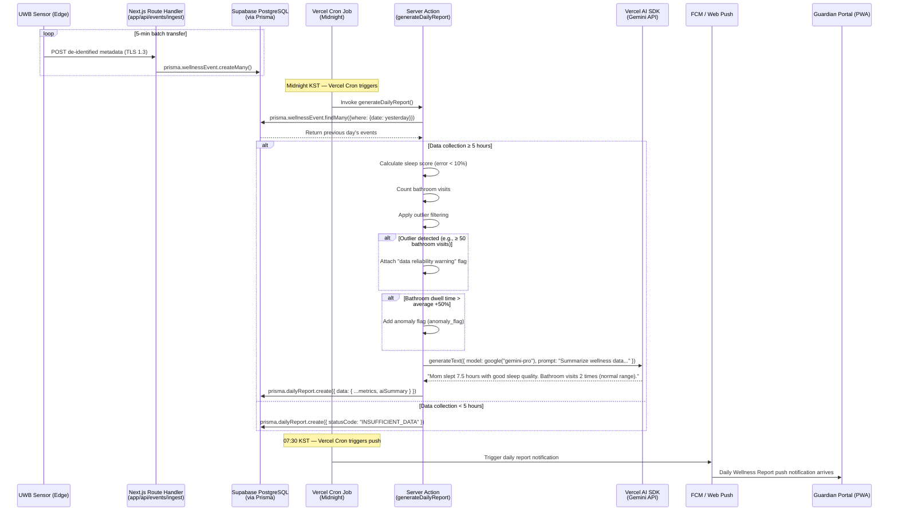

#### 3.4.2 Zero False Alarm AI Validator Execution Sequence

Execution flow of the Validator logic analyzing UWB radar signals at the edge to distinguish tossing/pets from a real fall/apnea.

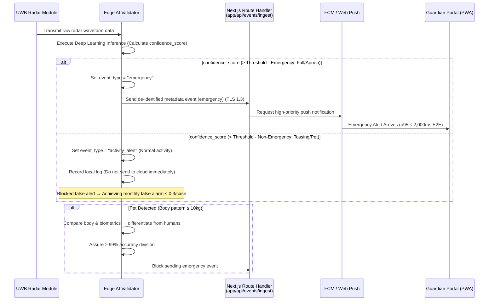

#### 3.4.3 PMF Diagnostic Sequence (Tracking User Experience Metrics)

Tracking the North Star metric (Monthly perceived false alarms ≤ 2 times) and secondary KPI (View report ≥ 5 times/week).

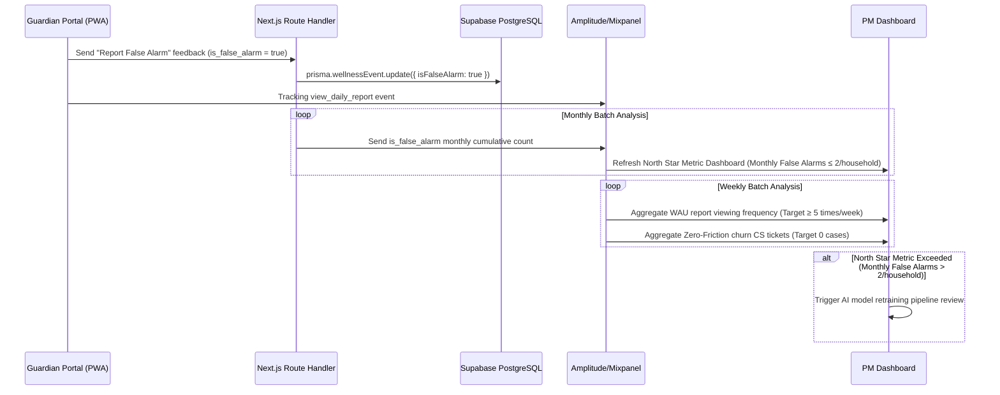

#### 3.4.4 EMR System Synchronization Sequence

Entire flow matching event generation → Supabase Realtime dashboard update → EMR Webhook transfer → retry on failure → dead letter event in the B2B context.

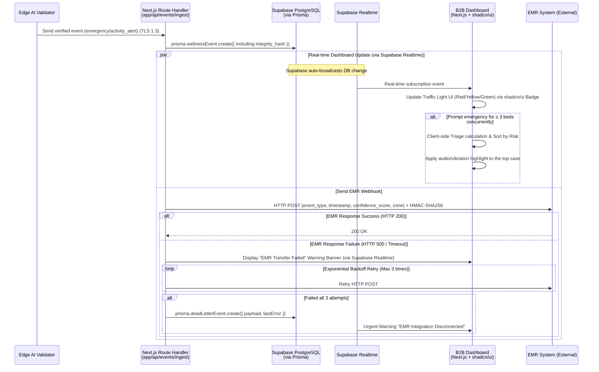

### 3.5 Use Case Diagram

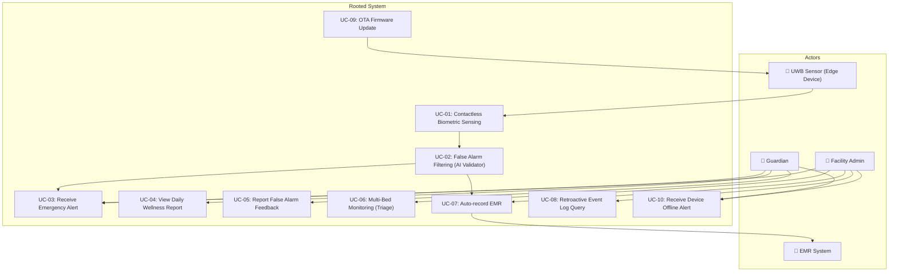

### 3.6 Entity-Relationship Diagram (ERD) — Prisma Schema-based

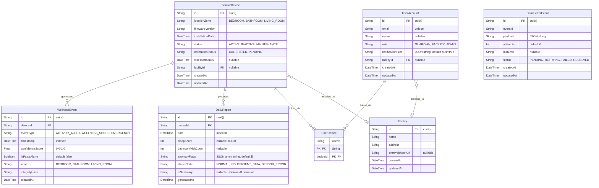

> **Key Changes from v1.0:**
> - UUID → `cuid()` string ID (SQLite compatible)
> - ENUM → String field + Application-level validation (SQLite compatible)
> - UUID[] array (`linked_devices`) → Normalized to `UserDevice` join table
> - JSON field → Stored as string in SQLite
> - 🆕 `DeadLetterEvent` model added (Store failed EMR Webhook events)
> - 🆕 `DailyReport.aiSummary` field added (Gemini AI-generated narrative)
> - When migrating to Supabase PostgreSQL for production, switch Prisma provider to `postgresql` and optionally convert String fields to native enum types.

### 3.7 Class Diagram

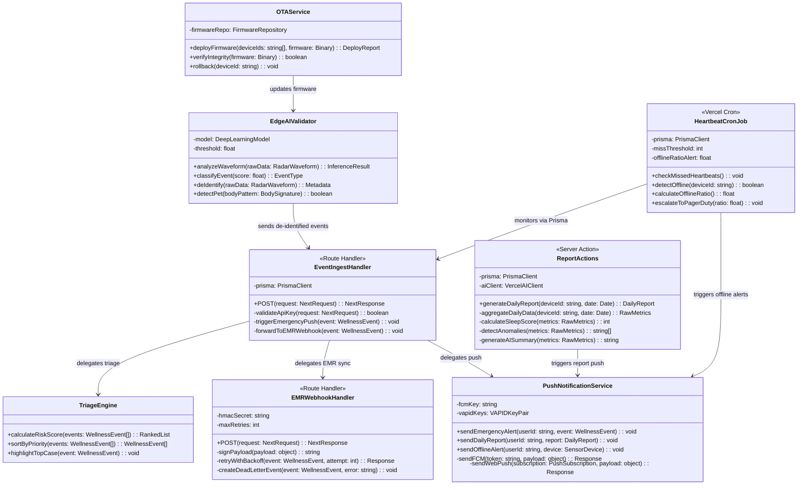

> **Key Changes from v1.0:**
> - `CloudBackend` → Decomposed into Next.js Route Handlers (`EventIngestHandler`, `EMRWebhookHandler`)
> - `ReportPipeline` → `ReportActions` (Server Action + Vercel AI SDK integration)
> - `PushNotificationService` → FCM + Web Push API integrated client (APNs removed)
> - `HeartbeatMonitor` → `HeartbeatCronJob` (Vercel Cron + Supabase Database Webhook)
> - `EdgeAIValidator` — Unchanged (Edge layer)
> - `TriageEngine` — Maintained (implemented client-side or in Server Action)
> - `EMRWebhookClient` → `EMRWebhookHandler` (Route Handler with HMAC-SHA256, includes DeadLetterEvent creation)

### 3.8 Component Diagram

```mermaid
graph TB
    subgraph "Edge Layer (Unchanged)"
        RADAR["UWB Radar Module"]
        EDGE["Edge AI Validator<br/>(Deep Learning Inference)"]
        RADAR --> EDGE
    end

    subgraph "Next.js App on Vercel (C-TEC-001, C-TEC-002, C-TEC-007)"
        subgraph "Route Handlers (app/api/)"
            INGEST["POST /api/events/ingest<br/>(Event Ingestion — Edge Runtime)"]
            REPORT_API["GET /api/reports/daily/[id]/[date]<br/>(Daily Report Query)"]
            TREND_API["GET /api/reports/trend/[id]<br/>(Trend Data)"]
            FALSEALARM["POST /api/events/[id]/false-alarm<br/>(Feedback)"]
            DASH_API["GET /api/dashboard/status<br/>(Dashboard Data)"]
            WEBHOOK_OUT["POST /api/webhooks/emr<br/>(EMR Webhook + HMAC-SHA256)"]
            PUSH_API["POST /api/notifications/push<br/>(FCM + Web Push)"]
            AI_API["POST /api/ai/wellness-summary<br/>(Gemini AI Summary)"]
            HEARTBEAT_API["POST /api/devices/[id]/heartbeat"]
        end

        subgraph "Server Actions (app/actions/)"
            SA_EVENT["createWellnessEvent()"]
            SA_REPORT["generateDailyReport()"]
            SA_DEVICE["updateDeviceStatus()"]
            SA_FILTER["saveDashboardFilter()"]
        end

        subgraph "Vercel Cron Jobs"
            CRON_REPORT["Midnight KST<br/>(Daily Report Generation)"]
            CRON_PUSH["07:30 KST<br/>(Report Push Delivery)"]
            CRON_HEARTBEAT["Every 1 min<br/>(Heartbeat Monitor)"]
            CRON_ARCHIVE["Monthly<br/>(Cold Archival Migration)"]
        end

        subgraph "Next.js Pages (app/)"
            GUARDIAN["B2C Guardian Portal<br/>(PWA + shadcn/ui + Service Worker)"]
            DASHBOARD["B2B Monitoring Dashboard<br/>(shadcn/ui + Supabase Realtime)"]
            AUTH["Auth Pages<br/>(NextAuth.js)"]
        end
    end

    subgraph "Supabase (C-TEC-003)"
        PGDB[("PostgreSQL<br/>(via Prisma ORM)")]
        STORAGE["Supabase Storage<br/>(Cold Event Archives)"]
        REALTIME["Supabase Realtime<br/>(WebSocket Replacement)"]
    end

    subgraph "AI / LLM (C-TEC-005, C-TEC-006)"
        GEMINI["Google Gemini API<br/>(via Vercel AI SDK)"]
    end

    subgraph "External Services"
        FCM["Firebase Cloud Messaging"]
        WEBPUSH["Web Push API<br/>(VAPID)"]
        EMRSYS["EMR System<br/>(Carefor Webhook)"]
        AMPLITUDE["Amplitude / Mixpanel<br/>(Product Analytics)"]
        PAGERDUTY["PagerDuty<br/>(Ops Escalation)"]
    end

    EDGE -->|"TLS 1.3<br/>De-identified Metadata"| INGEST
    INGEST --> SA_EVENT
    SA_EVENT --> PGDB
    INGEST --> PUSH_API
    INGEST --> WEBHOOK_OUT

    CRON_REPORT --> SA_REPORT
    SA_REPORT --> PGDB
    SA_REPORT --> AI_API
    AI_API --> GEMINI
    CRON_PUSH --> PUSH_API

    CRON_HEARTBEAT --> SA_DEVICE
    SA_DEVICE --> PGDB
    CRON_HEARTBEAT -->|"Offline ≥3%"| PAGERDUTY

    CRON_ARCHIVE --> STORAGE

    PUSH_API --> FCM
    PUSH_API --> WEBPUSH
    FCM --> GUARDIAN
    WEBPUSH --> GUARDIAN

    WEBHOOK_OUT -->|"HTTP POST<br/>API Key + HMAC"| EMRSYS
    WEBHOOK_OUT -->|"Failed 3x"| PGDB

    PGDB --> REALTIME
    REALTIME -->|"Real-time Subscriptions"| DASHBOARD

    REPORT_API --> PGDB
    TREND_API --> PGDB
    FALSEALARM --> PGDB
    DASH_API --> PGDB

    GUARDIAN -->|"False Alarm Feedback"| FALSEALARM
    GUARDIAN --> AMPLITUDE
    DASHBOARD --> AMPLITUDE
    DASHBOARD -->|"Archive Query<br/>JWT+RBAC"| STORAGE
```

---

## 4. Specific Requirements

### 4.1 Functional Requirements

> **Legend:** The Source column refers to the PRD Story/FR number. Priority follows the MoSCoW criterion. ACs are written in Given/When/Then format.

---

#### FR-01: Zero False Alarm AI Filtering Engine (Must, DOS 3.8, XL — 3~4 Sprints)

| ID | Requirement Statement | Source | Acceptance Criteria | Priority |
| :--- | :--- | :--- | :--- | :--- |
| REQ-FUNC-001 | Edge AI Validator analyzes UWB radar waveforms via deep learning and classifies events as `emergency` or `activity_alert`. | Story 1, FR-01 | **Given** sensor is working normally **When** radar waveform is inputted **Then** the AI model calculates `confidence_score` (0-1) and decides the event type based on the threshold. | **Must** |
| REQ-FUNC-002 | The system strictly separates non-urgent activities like tossing and sitting as `activity_alert`, blocking immediate alerts. | Story 1 (AC-1.1), FR-01 | **Given** sensor is working normally **When** the elderly person tosses a blanket **Then** no false alarm occurs. Monthly false alarm rate ≤ 0.3/household. | **Must** |
| REQ-FUNC-003 | The system shall isolate the movement of pets (≤ 10kg) and differentiate from human patterns, ensuring no alarms are erroneously sent. | Story 1 (AC-1.4), FR-01 | **Given** pets are traversing the sensor area **When** movements are detected **Then** system accurately isolates pet signals with ≥ 99% accuracy and suppresses the alert. | **Must** |
| REQ-FUNC-004 | In real fall detections (feeble movement patterns continuously over 5 mins), send instantaneous high-priority alerts under 60 seconds. | Story 1 (AC-1.3), FR-01 | **Given** an actual fall happens with signs of weak movement **When** Validator marks `confidence_score` ≥ Threshold **Then** guardian push arrives under 60 seconds via FCM/Web Push. | **Must** |
| REQ-FUNC-005 | The user app allows submitting "False Alarm" flags, and the database automatically marks the occurrence. | Story 1, §1.3 | **Given** guardian gets an urgent push **When** taps "Report False Alarm" in PWA **Then** Server Action `updateFalseAlarmFlag` sets `isFalseAlarm` = `true` via Prisma for batch metrics. | **Must** |

---

#### FR-02: Zero-Friction Contactless Sensor Module (Must, DOS 3.6, L — 2~3 Sprints)

| ID | Requirement Statement | Source | Acceptance Criteria | Priority |
| :--- | :--- | :--- | :--- | :--- |
| REQ-FUNC-006 | Mounted correctly on wall/ceilings, the sensor must demand exactly 0 user manipulations once deployed. | Story 1 (AC-1.2), FR-02 | **Given** setup completes **When** everyday usage initiates **Then** elderly engagement frequency strictly equates to 0 (No charging/wearing/buttons). | **Must** |
| REQ-FUNC-007 | Perform automated calibrations immediately following fresh installations to map boundaries efficiently. | FR-02, NFR-11 | **Given** new placement operates **When** initialized **Then** calibration passes completely and logs as `calibrated` via heartbeat Route Handler. | **Must** |
| REQ-FUNC-008 | Drop of power / missing Wi-Fi heartbeats beyond 15 minutes triggers a 1-time offline push. | Story 1 (AC-1.5), FR-02 | **Given** a device severs WiFi or power **When** Vercel Cron detects continuous heartbeats fail > 15 minutes (3 consecutive misses) **Then** push message is fired one time to guardians/admins via FCM/Web Push. | **Must** |

---

#### FR-03: Privacy-Preserving Non-Video Tracking (Must, DOS 3.0, L — 2~3 Sprints)

| ID | Requirement Statement | Source | Acceptance Criteria | Priority |
| :--- | :--- | :--- | :--- | :--- |
| REQ-FUNC-009 | Keep track of indoor paths using non-video sensors, registering dwell times and boundaries strictly ignoring camera solutions. | FR-03, §1.4 KSF #2 | **Given** sensor functions actively **When** users traverse between zones **Then** paths record sans explicit video storage guaranteeing 100% privacy compliance. | **Must** |
| REQ-FUNC-010 | The Edge device MUST manipulate raw radar arrays into numerical statistics inside its local CPU before shipping to Cloud. Direct uploading is prohibited. | FR-03, CON-02 | **Given** waveforms arrive **When** trying to move data to Next.js server **Then** only fully de-identified digits are permitted through. No PII fields exist in Prisma schema. | **Must** |

---

#### FR-04: B2B Multi-bed Dashboard + EMR Webhook (Must, DOS 3.4, M — 1~2 Sprints)

| ID | Requirement Statement | Source | Acceptance Criteria | Priority |
| :--- | :--- | :--- | :--- | :--- |
| REQ-FUNC-011 | Implement color-coded nodes for individual patient beds via B2B dashboards displaying synchronous status markers. | Story 3, FR-04 | **Given** dashboard active **When** receiving a status change via **Supabase Realtime** subscription **Then** UI transitions matching node colors using shadcn/ui Badge components. | **Must** |
| REQ-FUNC-012 | If ≥ 3 simultaneous emergencies arrive, activate Triage module prioritizing dangerous elements first adding auditory signals to the top element. | Story 3 (AC-3.5), FR-04 | **Given** simultaneous alerts occur **When** evaluating arrays > 3 items **Then** client-side Triage calculation sorts by risk; highest ranked object gets primary sound/visual cues. | **Must** |
| REQ-FUNC-013 | With EMR Webhooks functional, event meta-data gets routed seamlessly dropping double manual entry down to 0. | Story 3 (AC-3.2), FR-04 | **Given** EMR config is verified **When** an alert emerges **Then** Route Handler (`app/api/webhooks/emr/route.ts`) transfers data via HTTP POST with HMAC-SHA256 signature. | **Must** |
| REQ-FUNC-014 | Handle offline EMR states or 500 errors gracefully with 3 back-off retries and visible front-end notices. | Story 3 (AC-3.4), FR-04 | **Given** external EMR yields connection loss **When** posting data **Then** Route Handler retries 3 times with exponential backoff. On complete failure, creates `DeadLetterEvent` via Prisma and pushes warning via Supabase Realtime. | **Must** |
| REQ-FUNC-015 | Maintain 90-day archive searchability guaranteeing proof of integrity against lawsuit threats. | Story 3 (AC-3.3), FR-04 | **Given** a manager initiates backward searching **When** a date scope applies **Then** accurate log returns from Supabase PostgreSQL (hot, 90 days). Events >90 days are archived to Supabase Storage via monthly Vercel Cron with integrity hashes preserved. | **Must** |

---

#### FR-05: B2C Daily Wellness Notification Pipeline (Should, DOS 2.85, M — 1~2 Sprints)

| ID | Requirement Statement | Source | Acceptance Criteria | Priority |
| :--- | :--- | :--- | :--- | :--- |
| REQ-FUNC-016 | Consolidate and summarize previous 24hr analytics executing precision sleeping and bathroom habits below a 10% discrepancy limit. **Include Gemini AI natural language summary.** | Story 2 (AC-2.1), FR-05 | **Given** constant operations **When** Vercel Cron triggers at midnight **Then** Server Action `generateDailyReport` produces report with metrics + `aiSummary` (e.g., "Mom slept well for 7.5 hours last night"). Error rate < 10%. | **Should** |
| REQ-FUNC-017 | Push special daily alerts immediately if an individual's bathroom length metric breaches 50% above customary trends. | Story 2 (AC-2.2), FR-05 | **Given** normal patterns observed beforehand **When** current duration stretches > +50% expected threshold **Then** anomaly flag is set, and **AI anomaly explanation** is generated via Gemini (e.g., "Bathroom dwell time is 50% longer than usual. Recommend checking."). | **Should** |
| REQ-FUNC-018 | Emit status notice "Missing Stay Metrics" failing < 5 hours threshold mapping for residents vacationing or hospitalized. | Story 2 (AC-2.4), FR-05 | **Given** subjects leave for extended visits **When** Vercel Cron triggers report generation **Then** DailyReport created with `statusCode: "INSUFFICIENT_DATA"` instead of blank outputs. | **Should** |
| REQ-FUNC-019 | Attach 'unreliable data' warning elements preventing anxiety if mechanical bugs force outlier results (ex. > 50 door checks). | Story 2 (AC-2.5), FR-05 | **Given** impossible counts trigger (50x door triggers) **When** sorting values **Then** system sets `anomalyFlags` and displays warning via shadcn/ui Alert component: "Sensor Service Requires Inspection". | **Should** |
| REQ-FUNC-020 | Program consistent delivery mechanism routing formatted outputs specifically arriving 07:30 routinely to guardian devices. | FR-05, §2.2.3 | **Given** full daily generation **When** Vercel Cron triggers at 07:30 KST **Then** push Route Handler dispatches report notifications via FCM/Web Push to all linked guardians. | **Should** |

---

#### FR-06: Sleep Tracking Charts (Could, S — 1 Sprint)

| ID | Requirement Statement | Source | Acceptance Criteria | Priority |
| :--- | :--- | :--- | :--- | :--- |
| REQ-FUNC-021 | Chart temporal sleep patterns leveraging accumulated points producing week/month timelines within the Guardian Portal tab. | FR-06, §1.7 CJM P5 | **Given** > 7 reports exist securely **When** the person browses the trend interface **Then** Chart.js/Recharts renders graph arrays within Next.js page showing variations predictably. | **Could** |

---

#### FR-07: Fallback Message Providers — SMS/Kakao (Should, S — 1 Sprint)

> **Priority elevated from Could → Should** due to iOS PWA Web Push coverage limitations (requires iOS Safari 16.4+). SMS/KakaoTalk fallback serves as critical backup channel for guardians on older iOS devices.

| ID | Requirement Statement | Source | Acceptance Criteria | Priority |
| :--- | :--- | :--- | :--- | :--- |
| REQ-FUNC-022 | Broadcast backup texts or Kakao alerts parallel to Web Push/FCM notifications accommodating network limits whenever set active. | FR-07, §2.2.3 | **Given** guardians turn feature True in config **When** critical pings originate **Then** user acquires Web Push notification plus SMS/KakaoTalk via external API integration as fallback. | **Should** |

---

#### FR-08: Configurable Dashboards (Could, S — 0.5~1 Sprint)

| ID | Requirement Statement | Source | Acceptance Criteria | Priority |
| :--- | :--- | :--- | :--- | :--- |
| REQ-FUNC-023 | Afford administrators filtering options grouping displays using custom rulesets depending on assigned wards or priority. | FR-08, §3.1 Ext. Function 4 | **Given** staff members engage with UI **When** specific room tags or condition layers apply **Then** shadcn/ui DataTable with filter components limits display, and Server Action `saveDashboardFilter` persists configuration. | **Could** |

---

### 4.2 Non-Functional Requirements

#### 4.2.1 Performance

| ID | Requirement Statement | Metric / Threshold | Monitoring | PRD Source |
| :--- | :--- | :--- | :--- | :--- |
| REQ-NF-001 | End-to-end latency mapping fall detection straight to mobile delivery | **p95 ≤ 2,000 ms** | **Vercel Analytics + Edge Runtime** for latency-critical routes (event ingestion, push triggers). Break > 2.5s signals `#ops-alert` on Slack. Use synthetic heartbeats to pre-warm Edge Functions. | NFR-01 |
| REQ-NF-002 | Accuracy metrics proving False Alarm mitigation algorithm success | **≤ 0.3 events/month/home** | Weekend batches reading `isFalseAlarm` via Prisma aggregation queries + Amplitude counts. | NFR-02 |
| REQ-NF-003 | Deviation metrics against physical actuals regarding bathroom usage or sleep points | **Error value < 10%** | Manual comparison routines against beta testers ground-truth data points. | NFR-03 |
| REQ-NF-004 | Stress-test boundaries checking transaction responses and connection hold limits | **E2E p95 ≤ 500ms at 1,000 active nodes.** MVP target <500 devices is within Vercel Pro limits. Re-evaluate architecture at Wave 2 when approaching 5K. **Supabase PgBouncer** connection pooling is critical. | Monthly simulated stress check protocols. | NFR-14 |

#### 4.2.2 Availability / Reliability

| ID | Requirement Statement | Metric / Threshold | Monitoring | PRD Source |
| :--- | :--- | :--- | :--- | :--- |
| REQ-NF-005 | Guaranteed SLA coverage regarding application stability ensuring strict limits. | **SLA ≥ 99.9%** — Vercel Pro SLA is 99.99%, Supabase Pro SLA is 99.9%. Combined effective SLA ≥ 99.9%. | Constant synthetic checks running every 5 min via Vercel Analytics. | NFR-04 |
| REQ-NF-006 | Max error bounds mapping packet drop elements between nodes over internet tunnels. | **≤ 0.1% loss limits** | Aggregation summaries verifying Edge proxy routing arrays via Vercel edge network. | NFR-05 |
| REQ-NF-007 | High priority network alerting mapping large systemic dropouts affecting base systems (>3%). | Auto page PagerDuty **Sev1** parameters. Triggered via **Supabase Database Webhook** on device status changes or **Vercel Cron** batch offline detection (1 min intervals). | Persistent real-time monitoring via Cron + Supabase Webhook combination. | NFR-13 |

#### 4.2.3 Security

| ID | Requirement Statement | Metric / Threshold | Monitoring | PRD Source |
| :--- | :--- | :--- | :--- | :--- |
| REQ-NF-008 | Force strict security layers across network protocols using updated ciphers preventing snooping. | 100% adherence to TLS 1.3 standards. **Vercel enforces TLS 1.3 by default.** | Yearly 3rd party penetration checking / Monthly auditing. | NFR-06 |
| REQ-NF-009 | Execute pure compliance matching privacy clauses ensuring personal markers completely evade capture. | 0 identifiable markers. No PII fields in Prisma schema. | Quarterly internal DB examination via Prisma query scan. | NFR-07 |
| REQ-NF-010 | Anchor endpoint EMR push capabilities restricting access exclusively resolving keys and custom hashes. | API Key + HMAC-SHA256, 0 broken access | Daily log monitoring within Route Handler access logs. | §6.2 |
| REQ-NF-011 | Implement JWT verification plus hard RBAC limitations over historical database lookups. | RBAC via **NextAuth.js** role middleware, 0 broken access | Quarterly RBAC evaluation cycles. | §6.2 |

#### 4.2.4 Cost

| ID | Requirement Statement | Metric / Threshold | Monitoring | PRD Source |
| :--- | :--- | :--- | :--- | :--- |
| REQ-NF-012 | Limit runaway cloud cost profiles managing exact pricing structures across deployed household variables. | **≤ 500 KRW/Unit/Month.** Breaching triggers `#cost-alert`. Vercel + Supabase expected to be cheaper than AWS for MVP scale. | Daily check loops relying on **Vercel + Supabase billing dashboards**. | NFR-08 |

#### 4.2.5 Operations / Monitoring

| ID | Requirement Statement | Metric / Threshold | Monitoring | PRD Source |
| :--- | :--- | :--- | :--- | :--- |
| REQ-NF-013 | Ensure seamless and accurate background firmware pushing over live environments guaranteeing reliability. | Deploy Success Rates ≥ 99% | Observing OTA system hooks natively. (Edge/firmware layer, outside web stack scope.) | NFR-09 |
| REQ-NF-014 | Keep exact tabs over PMF North Star markers ensuring limits reflect valid market assumptions. | **≤ 2 complaints / house / month.** | Prisma aggregation of `isFalseAlarm` flags + Amplitude 'Report False' feedback loops. | §1.3 |
| REQ-NF-015 | Retain weekly viewing frequency values holding users steady above minimum attention spans. | WAU limits **≥ 5 report hits specific weekly interval**. | Amplitude `view_daily_report` tracker. | §1.3 |
| REQ-NF-016 | Prove friction elimination logic ensuring seniors exhibit absolute passivity omitting direct rejection. | Churn via explicit "Too uncomfortable" parameters at exactly **0**. | Reading tagged CRM markers dynamically. | §1.3 |

#### 4.2.6 Data Retention

| ID | Requirement Statement | Metric / Threshold | Monitoring | PRD Source |
| :--- | :--- | :--- | :--- | :--- |
| REQ-NF-017 | Push records into distinct archival cycles transitioning them reliably maintaining cryptologic protections verifying legality. | Hot: 90 Days (Supabase PostgreSQL) / Cold: > 3 Years (**Supabase Storage** via monthly Vercel Cron migration script). Integrity hashes preserved. | Batch monitoring checking Cron execution and migration completeness. | NFR-10 |

#### 4.2.7 Scalability / Maintainability

| ID | Requirement Statement | Metric / Threshold | Monitoring | PRD Source |
| :--- | :--- | :--- | :--- | :--- |
| REQ-NF-018 | Define horizontal expansion capacities readying backend pipelines surviving next wave projections. | MVP: **<500 devices** is within Vercel Pro limits. Wave 2: Re-evaluate architecture at 5K simultaneous streams. Document exit strategy to Vercel Enterprise or self-hosted infrastructure. | Routine simulated arrays checking. | NFR-14 |
| REQ-NF-019 | Establish absolute hard rules isolating variable syntax prohibiting regulatory keywords entirely at compile phases. | Linter catches ruleset breaking structures preventing merging exactly 100%. | GitHub Actions or **Vercel pre-deploy hook** CI checks tracking exact words. | NFR-12 |
| REQ-NF-020 | Support engineering staff applying positioning with precise internal software mitigating poor angles naturally. | Install matching angles executing ≥ 95% accurately | Read metrics reviewing automated config checks. (Installer app deferred; PWA-based guide as interim.) | NFR-11 |

---

## 5. Traceability Matrix

| PRD Source (Story / FR / NFR) | Requirement ID | Requirement Type | Test Case ID | Test Case Summary |
| :--- | :--- | :--- | :--- | :--- |
| Story 1, FR-01 | REQ-FUNC-001 | Functional | TC-FUNC-018 | Inject various radar waveforms and verify Edge AI Validator classifies events correctly with appropriate confidence_score and event_type. |
| Story 1 (AC-1.1), FR-01 | REQ-FUNC-002 | Functional | TC-FUNC-001 | Verify absent flags when injecting blanket movement. Track 30d values ≤ 0.3 via Prisma aggregation. |
| Story 1 (AC-1.4), FR-01 | REQ-FUNC-003 | Functional | TC-FUNC-002 | Simulate ≤ 10kg objects traversing boundary. Note accuracy rates exceeding 99% logic mapping. |
| Story 1 (AC-1.3), FR-01 | REQ-FUNC-004 | Functional | TC-FUNC-003 | Run actual fall tests recording push duration consistently measuring under 60 seconds via FCM/Web Push. |
| Story 1, §1.3 | REQ-FUNC-005 | Functional | TC-FUNC-006 | Run mock alert feedback via PWA UI tests mapping `isFalseAlarm` markers correctly via Server Action. |
| Story 1 (AC-1.2), FR-02 | REQ-FUNC-006 | Functional | TC-FUNC-004 | Note device operational parameters during constant weekly bounds tracking friction limits at exactly nil. |
| FR-02, NFR-11 | REQ-FUNC-007 | Functional | TC-FUNC-019 | Deploy a new sensor and verify automated calibration completes successfully, logged via heartbeat Route Handler as `calibrated`. |
| Story 1 (AC-1.5), FR-02 | REQ-FUNC-008 | Functional | TC-FUNC-005 | Execute hard severing logic. Verify Vercel Cron detects >15 min heartbeat loss and triggers single offline push via FCM/Web Push. |
| FR-03, §1.4 KSF #2 | REQ-FUNC-009 | Functional | TC-FUNC-020 | Verify indoor path tracking records dwell times across zones using non-video sensors with 100% privacy compliance. |
| FR-03, CON-02 | REQ-FUNC-010 | Functional | TC-FUNC-021 | Confirm Edge device converts raw radar waveforms to numerical statistics locally; verify no raw data reaches Next.js server. Confirm 0 PII fields in Prisma schema. |
| Story 3, FR-04 | REQ-FUNC-011 | Functional | TC-FUNC-022 | Verify dashboard displays color-coded bed nodes via shadcn/ui and updates status via **Supabase Realtime** subscription events. |
| Story 3 (AC-3.5), FR-04 | REQ-FUNC-012 | Functional | TC-FUNC-011 | Send >3 concurrent emergency events; verify client-side Triage calculation sorts by risk and applies audio/visual cues to top case. |
| Story 3 (AC-3.2), FR-04 | REQ-FUNC-013 | Functional | TC-FUNC-012 | Confirm EMR Route Handler sends HTTP POST with HMAC-SHA256 signature; verify 0 manual entry required. |
| Story 3 (AC-3.4), FR-04 | REQ-FUNC-014 | Functional | TC-FUNC-013 | Simulate EMR failure; verify Route Handler retries 3x with exponential backoff, then creates `DeadLetterEvent` via Prisma on complete failure. |
| Story 3 (AC-3.3), FR-04 | REQ-FUNC-015 | Functional | TC-FUNC-014 | Query events from 90 days ago; verify successful retrieval from Supabase PostgreSQL. Test Cron-based archival to Supabase Storage for >90 day events. |
| Story 2 (AC-2.1), FR-05 | REQ-FUNC-016 | Functional | TC-FUNC-007 | Cross-reference ground-truth data; verify Vercel Cron + Server Action produces report with <10% error + Gemini AI summary. |
| Story 2 (AC-2.2), FR-05 | REQ-FUNC-017 | Functional | TC-FUNC-008 | Inject +50% bathroom anomaly; verify anomaly flag + AI explanation generated via Gemini. |
| Story 2 (AC-2.4), FR-05 | REQ-FUNC-018 | Functional | TC-FUNC-009 | Ensure <5 hour data yields `INSUFFICIENT_DATA` status in Prisma DailyReport record. |
| Story 2 (AC-2.5), FR-05 | REQ-FUNC-019 | Functional | TC-FUNC-010 | Trigger >50 door events; verify `anomalyFlags` set and shadcn/ui Alert warning displayed. |
| FR-05, §2.2.3 | REQ-FUNC-020 | Functional | TC-FUNC-023 | Verify Vercel Cron triggers at 07:30 KST; confirm push Route Handler dispatches report via FCM/Web Push on schedule. |
| FR-06 | REQ-FUNC-021 | Functional | TC-FUNC-015 | Render Chart.js/Recharts chart in Next.js page mapping collected data points onto visual timelines. |
| FR-07 | REQ-FUNC-022 | Functional | TC-FUNC-016 | Toggle SMS/Kakao fallback on; verify Route Handler dispatches parallel SMS + Web Push on critical event. |
| FR-08 | REQ-FUNC-023 | Functional | TC-FUNC-017 | Apply dashboard filters via shadcn/ui DataTable; verify Server Action `saveDashboardFilter` persists configuration and grid updates. |
| NFR-01 | REQ-NF-001 | Non-Functional | TC-NF-001 | Automate 1k fall detection events; verify p95 E2E latency ≤ 2,000ms using Vercel Edge Runtime. |
| NFR-02 | REQ-NF-002 | Non-Functional | TC-NF-002 | Query monthly `isFalseAlarm` counts via Prisma; verify ≤ 0.3/household. |
| NFR-03 | REQ-NF-003 | Non-Functional | TC-NF-011 | Compare system-reported sleep scores and bathroom counts against ground-truth data; verify error rate < 10%. |
| NFR-14 | REQ-NF-004 | Non-Functional | TC-NF-004 | Load test with 1,000 concurrent devices; verify p95 ≤ 500ms with Supabase PgBouncer connection pooling. |
| NFR-04 | REQ-NF-005 | Non-Functional | TC-NF-003 | Verify Vercel Pro (99.99%) + Supabase Pro (99.9%) combined SLA ≥ 99.9% via synthetic monitoring. |
| NFR-05 | REQ-NF-006 | Non-Functional | TC-NF-012 | Measure packet loss rate between Edge and Vercel over sustained test periods; confirm ≤ 0.1% loss. |
| NFR-13 | REQ-NF-007 | Non-Functional | TC-NF-013 | Simulate >3% sensor offline rate within 1 hour; verify Supabase Database Webhook + Cron triggers PagerDuty Sev1 alert. |
| NFR-06 | REQ-NF-008 | Non-Functional | TC-NF-005 | Confirm Vercel enforces TLS 1.3 by default; run packet evaluation verifying cryptography compliance. |
| NFR-07 | REQ-NF-009 | Non-Functional | TC-NF-014 | Perform quarterly DB scan via Prisma query; verify 0 PII fields exist in any model. |
| §6.2 | REQ-NF-010 | Non-Functional | TC-NF-015 | Verify EMR Route Handler enforces API Key + HMAC-SHA256 authentication; confirm 0 unauthorized access. |
| §6.2 | REQ-NF-011 | Non-Functional | TC-NF-016 | Test NextAuth.js JWT + RBAC middleware on event archive Route Handler; verify unauthorized role access is denied with 403. |
| NFR-08 | REQ-NF-012 | Non-Functional | TC-NF-006 | Monitor Vercel + Supabase billing dashboards; verify unit cost ≤ 500 KRW/month. |
| NFR-09 | REQ-NF-013 | Non-Functional | TC-NF-017 | Execute OTA firmware deployment to test devices; verify deployment success rate ≥ 99% with rollback on failure. (Edge scope.) |
| §1.3 | REQ-NF-014 | Non-Functional | TC-NF-008 | Aggregate `isFalseAlarm` counts via Prisma; verify ≤ 2 per household per month. |
| §1.3 | REQ-NF-015 | Non-Functional | TC-NF-009 | Verify Amplitude `view_daily_report` WAU ≥ 5 times/week. |
| §1.3 | REQ-NF-016 | Non-Functional | TC-NF-010 | Aggregate CRM churn parameters; verify 0 "Too uncomfortable" signals. |
| NFR-10 | REQ-NF-017 | Non-Functional | TC-NF-007 | Validate Vercel Cron archives events >90 days to Supabase Storage; verify integrity hashes match original records. |
| NFR-14 | REQ-NF-018 | Non-Functional | TC-NF-018 | Load test with 500 concurrent device streams (MVP target); verify no degradation. Document Wave 2 scaling plan for 5K. |
| NFR-12 | REQ-NF-019 | Non-Functional | TC-NF-019 | Run GitHub Actions / Vercel pre-deploy CI linter; verify 100% of regulatory-trigger words (diagnosis, medical, patient) are caught and blocked. |
| NFR-11 | REQ-NF-020 | Non-Functional | TC-NF-020 | Deploy sensor using PWA-based installer guide (interim); verify calibration guidance achieves ≥ 95% correct angle placement. |

---

## 6. Appendix

### 6.1 API Endpoint List — Next.js Route Handlers

| # | Route | Method | Description | Auth | Rate Limit | PRD Source |
| :--- | :--- | :--- | :--- | :--- | :--- | :--- |
| 1 | `app/api/events/ingest/route.ts` | POST | Transmit de-identified events batch from edge to server (5 min). **Edge Runtime.** | TLS 1.3 + API Key | - | §3.1 Feature 3 |
| 2 | `app/api/webhooks/emr/route.ts` | POST | Webhook output sending system events targeting defined EMR pipelines. Includes exponential backoff retry and DeadLetterEvent creation. | API Key + HMAC-SHA256 | 100 req/min/fac | §3.1 Feature 4 |
| 3 | `app/api/notifications/push/route.ts` | POST | FCM + Web Push API execution. (Emergencies send immediately, reports queue via Vercel Cron at 07:30). | Internal Service Auth | - | §2.2.3 |
| 4 | `app/api/reports/daily/[deviceId]/[date]/route.ts` | GET | Request defined date point retrieving single report array details including `aiSummary`. | JWT (NextAuth) | - | FR-05 |
| 5 | `app/api/reports/trend/[deviceId]/route.ts` | GET | Yield multi-point arrays mapping sleep and metrics tracking lines for Chart.js/Recharts. | JWT (NextAuth) | - | FR-06 |
| 6 | `app/api/events/[eventId]/false-alarm/route.ts` | POST | Receive specific feedback modifying `isFalseAlarm` field via Prisma. | JWT (NextAuth) | - | §1.3 |
| 7 | `app/api/events/archive/route.ts` | GET | Enable backward scanning of past records (90-day hot in PostgreSQL, cold in Supabase Storage). | JWT + RBAC (NextAuth) | - | §1.8 Q2 |
| 8 | `app/api/dashboard/status/route.ts` | GET | Return multi-bed status for traffic light dashboard. Real-time updates via Supabase Realtime (client-side subscription). | JWT (Admin role) | - | FR-04 |
| 9 | `app/api/dashboard/filters/route.ts` | PATCH | Save dashboard filter configurations via Prisma. | JWT (Admin role) | - | FR-08 |
| 10 | `app/api/devices/[deviceId]/heartbeat/route.ts` | GET/POST | Device heartbeat check-in. Updates `lastHeartbeatAt` via Prisma. | API Key | - | FR-02 |
| 11 | `app/api/ai/wellness-summary/route.ts` | POST | 🆕 Generate AI wellness narrative via Vercel AI SDK + Gemini. ENV-based model swap (`AI_MODEL`). | JWT (NextAuth) | - | C-TEC-005 |

### 6.2 Entity & Data Model — Prisma Schema

#### 6.2.1 SensorDevice

| Field | Type (Prisma) | Constraint | Description |
| :--- | :--- | :--- | :--- |
| `id` | String | `@id @default(cuid())` | Unique Device Identifier (cuid for SQLite compatibility) |
| `locationZone` | String | NOT NULL | Configured room: `BEDROOM`, `BATHROOM`, `LIVING_ROOM` |
| `firmwareVersion` | String | NOT NULL | Current active firmware version |
| `installationDate` | DateTime | NOT NULL | Deployment timestamp |
| `status` | String | NOT NULL, `@default("ACTIVE")` | Device state: `ACTIVE`, `INACTIVE`, `MAINTENANCE` |
| `calibrationStatus` | String | NOT NULL, `@default("PENDING")` | Calibration state: `CALIBRATED`, `PENDING` |
| `lastHeartbeatAt` | DateTime? | NULLABLE | Timestamp of most recent heartbeat signal |
| `facilityId` | String? | FK → Facility, NULLABLE | B2B facility reference |
| `createdAt` | DateTime | `@default(now())` | Record creation timestamp |
| `updatedAt` | DateTime | `@updatedAt` | Auto-updated timestamp |

#### 6.2.2 WellnessEvent

| Field | Type (Prisma) | Constraint | Description |
| :--- | :--- | :--- | :--- |
| `id` | String | `@id @default(cuid())` | Unique event record identifier |
| `deviceId` | String | FK → SensorDevice, NOT NULL | Originating device reference |
| `eventType` | String | NOT NULL | Type: `ACTIVITY_ALERT`, `WELLNESS_SCORE`, `EMERGENCY` |
| `timestamp` | DateTime | NOT NULL, `@@index` | Event timing (indexed for query performance) |
| `confidenceScore` | Float | NOT NULL, 0.0–1.0 | AI model confidence metric |
| `isFalseAlarm` | Boolean | NOT NULL, `@default(false)` | Human-verified reversal flag (updated via Server Action) |
| `zone` | String | NOT NULL | Origin zone: `BEDROOM`, `BATHROOM`, `LIVING_ROOM` |
| `integrityHash` | String | NOT NULL | SHA-256 hash chain for legal integrity proof |
| `createdAt` | DateTime | `@default(now())` | Record creation timestamp |

#### 6.2.3 UserAccount

| Field | Type (Prisma) | Constraint | Description |
| :--- | :--- | :--- | :--- |
| `id` | String | `@id @default(cuid())` | User identity |
| `email` | String | `@unique` | Login email address |
| `name` | String? | NULLABLE | Display name |
| `role` | String | NOT NULL | Role: `GUARDIAN`, `FACILITY_ADMIN` |
| `notificationPref` | String | `@default("{\"push\": true}")` | JSON string for notification routing preferences |
| `facilityId` | String? | FK → Facility, NULLABLE | Organizational reference for B2B users |
| `createdAt` | DateTime | `@default(now())` | Record creation timestamp |
| `updatedAt` | DateTime | `@updatedAt` | Auto-updated timestamp |

#### 6.2.4 UserDevice (Join Table)

| Field | Type (Prisma) | Constraint | Description |
| :--- | :--- | :--- | :--- |
| `userId` | String | `@@id([userId, deviceId])`, FK → UserAccount | User reference |
| `deviceId` | String | `@@id([userId, deviceId])`, FK → SensorDevice | Device reference |

> Replaces original `UUID[] linked_devices` array field. Normalized M:N relationship for SQLite compatibility.

#### 6.2.5 DailyReport

| Field | Type (Prisma) | Constraint | Description |
| :--- | :--- | :--- | :--- |
| `id` | String | `@id @default(cuid())` | Unique report identifier |
| `deviceId` | String | FK → SensorDevice, NOT NULL | Related device |
| `date` | DateTime | NOT NULL, `@@index` | Report date (indexed) |
| `sleepScore` | Int? | NULLABLE, 0–100 | Sleep quality score or null if metrics insufficient |
| `bathroomVisitCount` | Int? | NULLABLE | Bathroom visit count |
| `anomalyFlags` | String | `@default("[]")` | JSON array as string (SQLite compat): anomaly tags |
| `statusCode` | String | NOT NULL, `@default("NORMAL")` | Status: `NORMAL`, `INSUFFICIENT_DATA`, `SENSOR_ERROR` |
| `aiSummary` | String? | NULLABLE | 🆕 Gemini AI-generated natural language wellness narrative |
| `generatedAt` | DateTime | NOT NULL | Report generation timestamp |

#### 6.2.6 Facility

| Field | Type (Prisma) | Constraint | Description |
| :--- | :--- | :--- | :--- |
| `id` | String | `@id @default(cuid())` | Facility identifier |
| `name` | String | NOT NULL | Facility name |
| `address` | String | NOT NULL | Physical address |
| `emrWebhookUrl` | String? | NULLABLE | Configured EMR Webhook endpoint URL |
| `createdAt` | DateTime | `@default(now())` | Record creation timestamp |
| `updatedAt` | DateTime | `@updatedAt` | Auto-updated timestamp |

#### 6.2.7 DeadLetterEvent (🆕 New)

| Field | Type (Prisma) | Constraint | Description |
| :--- | :--- | :--- | :--- |
| `id` | String | `@id @default(cuid())` | Dead letter record identifier |
| `eventId` | String | NOT NULL | Reference to the original WellnessEvent that failed |
| `payload` | String | NOT NULL | JSON string of the original webhook payload |
| `attempts` | Int | `@default(0)` | Number of retry attempts made |
| `lastError` | String? | NULLABLE | Description of the last error encountered |
| `status` | String | `@default("PENDING")` | Status: `PENDING`, `RETRYING`, `FAILED`, `RESOLVED` |
| `createdAt` | DateTime | `@default(now())` | Record creation timestamp |
| `updatedAt` | DateTime | `@updatedAt` | Auto-updated timestamp |

> Stores failed EMR Webhook events for admin dashboard inspection and manual retry. Visible on B2B Dashboard via Supabase Realtime subscription.

### 6.3 Detailed Interaction Models

#### 6.3.1 Detailed Sequence — Fall Detection → Emergency Alert → EMR Integration E2E Flow

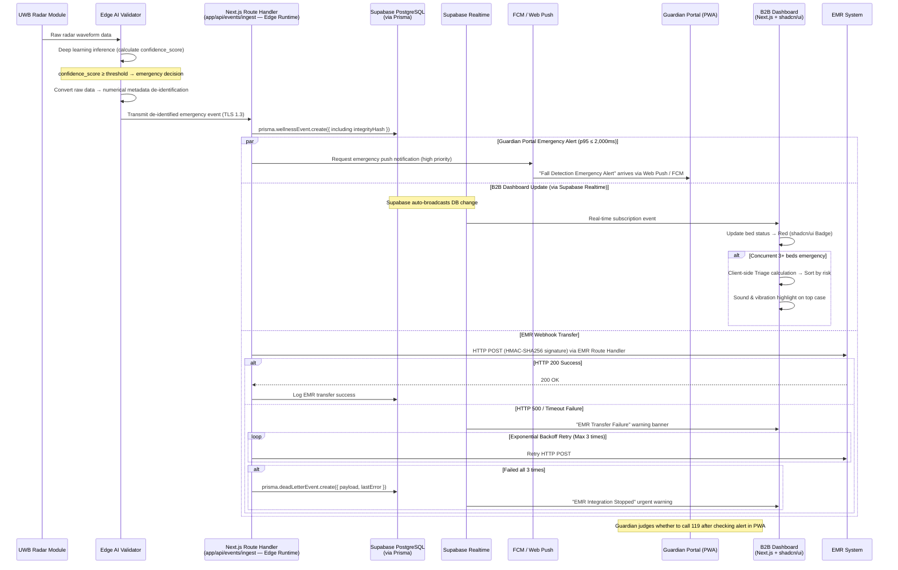

#### 6.3.2 Detailed Sequence — Device Offline Detection → PagerDuty Escalation

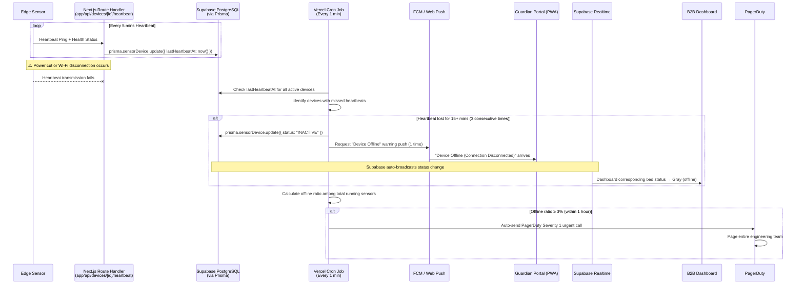

#### 6.3.3 Detailed Sequence — OTA Firmware Update + False Alarm Threshold Adjustment

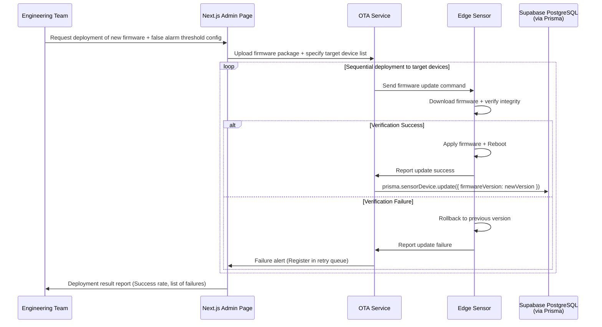

### 6.4 Validation Plan

Validation plan based on experiment hypothesis/measurement/success criteria in PRD §8.2.

| Experiment ID | Hypothesis | Measurement Protocol | Acceptance/Success Criteria | Related Requirements |
| :--- | :--- | :--- | :--- | :--- |
| **EXP-01** | Eliminating false alarms in B2B sites improves contract retention & satisfaction. | Run 1st closed beta in 5 nursing homes (150 beds total) concurrently. Track `isFalseAlarm` flag via Prisma aggregation continuously for 4 weeks. | False alarms **reduced by ≥ 97.5%** compared to old motion sensor control group (≤ 2 cases per bed/month). | REQ-FUNC-002, REQ-NF-002 |
| **EXP-02** | B2C daily reports (with AI summaries) contribute to preventing subscription churn. | 2nd open beta with 100–200 households using PWA Guardian Portal. Track Amplitude `view_daily_report` views for 4 weeks. | WAU stats show **≥ 60% users checking ≥ 5 times/week**. | REQ-FUNC-016, REQ-NF-015 |
| **EXP-03** | Zero-Friction eliminates resistance among elderly users. | Entire subscriber base during Wave 2. Analyze text of CRM CS tickets for 'operation inconvenience/device wearing refusal'. | Accumulated churn/cancellation complaints = **0 cases**. | REQ-FUNC-006, REQ-NF-016 |

---

## 7. AI Integration Specification (🆕 New Section)

### 7.1 Vercel AI SDK + Google Gemini Integration

| Item | Specification |
| :--- | :--- |
| **SDK** | Vercel AI SDK (`ai` package + `@ai-sdk/google` provider) |
| **Model** | Google Gemini Pro (default). Swappable via `AI_MODEL` environment variable. |
| **Route** | `app/api/ai/wellness-summary/route.ts` |
| **Invocation** | `generateText({ model: google(process.env.AI_MODEL), prompt, system })` |
| **Caching** | AI summaries cached in `DailyReport.aiSummary` field. One generation per device per day. |
| **Fallback** | If Gemini API fails, report is created without `aiSummary` (null). No user-facing error. |

### 7.2 AI Use Cases

| # | Use Case | Input | Output Example | Trigger |
| :--- | :--- | :--- | :--- | :--- |
| **NEW-01** | AI Wellness Narrative | Sleep score, bathroom count, anomaly flags, dwell times | "Mom slept well for 7.5 hours last night. Used the bathroom 2 times (within normal range). No anomalies detected." | `generateDailyReport` Server Action at midnight |
| **NEW-02** | AI Anomaly Explanation | Anomaly flag type, deviation percentage, historical baseline | "Bathroom dwell time is 50% longer than usual. Recommend checking." | When anomaly flag is detected during report generation |

### 7.3 Prompt Structure

```
System: You are an AI wellness assistant for the Rooted ambient care system. 
Generate a brief, warm, easy-to-understand summary of the daily wellness data 
for a family member (guardian). Use natural, caring language. 
Do NOT use medical terminology. Refer to the observed person as "your family member" 
or use the provided name. Keep the summary under 100 words.

User: 
Device: {deviceId}
Date: {date}
Sleep Score: {sleepScore}/100
Sleep Duration: {sleepHours} hours
Bathroom Visits: {bathroomCount} times
Anomaly Flags: {anomalyFlags}
Status: {statusCode}
```

### 7.4 Model Swap Strategy

| Environment | `AI_MODEL` Value | Purpose |
| :--- | :--- | :--- |
| Development | `gemini-1.5-flash` | Fast, low-cost for testing |
| Staging | `gemini-1.5-pro` | Quality validation |
| Production | `gemini-1.5-pro` | Best quality for user-facing summaries |

---

## 8. Recommended Project Structure (🆕 New Section)

```
rooted-mvp/
├── app/
│   ├── (auth)/
│   │   ├── login/page.tsx
│   │   └── register/page.tsx
│   ├── (guardian)/                  # B2C Guardian Portal (PWA)
│   │   ├── dashboard/page.tsx       # Guardian home — daily summary + AI narrative
│   │   ├── reports/
│   │   │   ├── [date]/page.tsx      # Daily report detail
│   │   │   └── trends/page.tsx      # Sleep trend charts (Recharts/Chart.js)
│   │   └── layout.tsx
│   ├── (admin)/                     # B2B Monitoring Dashboard
│   │   ├── dashboard/page.tsx       # Traffic light multi-bed view (Supabase Realtime)
│   │   ├── events/
│   │   │   └── archive/page.tsx     # 90-day event log viewer
│   │   ├── emr/page.tsx             # EMR webhook status + DeadLetterEvent viewer
│   │   └── layout.tsx
│   ├── api/
│   │   ├── events/
│   │   │   ├── ingest/route.ts      # Edge → Server event ingestion (Edge Runtime)
│   │   │   ├── [eventId]/
│   │   │   │   └── false-alarm/route.ts
│   │   │   └── archive/route.ts
│   │   ├── reports/
│   │   │   ├── daily/[deviceId]/[date]/route.ts
│   │   │   └── trend/[deviceId]/route.ts
│   │   ├── webhooks/
│   │   │   └── emr/route.ts         # EMR Webhook + HMAC-SHA256
│   │   ├── notifications/
│   │   │   └── push/route.ts        # FCM + Web Push
│   │   ├── devices/
│   │   │   └── [deviceId]/
│   │   │       └── heartbeat/route.ts
│   │   ├── dashboard/
│   │   │   ├── status/route.ts
│   │   │   └── filters/route.ts
│   │   └── ai/
│   │       └── wellness-summary/route.ts  # Gemini AI Summary
│   ├── actions/                     # Server Actions
│   │   ├── events.ts                # createWellnessEvent, updateFalseAlarmFlag
│   │   ├── reports.ts               # generateDailyReport
│   │   ├── devices.ts               # updateDeviceStatus
│   │   ├── dashboard.ts             # saveDashboardFilter
│   │   └── users.ts                 # createUser
│   ├── layout.tsx                   # Root layout
│   ├── page.tsx                     # Landing page
│   └── globals.css                  # Tailwind CSS
├── components/
│   ├── ui/                          # shadcn/ui components
│   │   ├── button.tsx
│   │   ├── card.tsx
│   │   ├── badge.tsx
│   │   ├── alert.tsx
│   │   ├── data-table.tsx
│   │   └── ...
│   ├── dashboard/
│   │   ├── traffic-light-card.tsx   # Red/Yellow/Green bed status
│   │   ├── triage-list.tsx          # Priority-sorted events
│   │   └── emr-status-banner.tsx    # EMR connection status
│   ├── reports/
│   │   ├── daily-report-card.tsx    # Includes AI summary display
│   │   ├── sleep-trend-chart.tsx
│   │   └── anomaly-alert.tsx
│   └── shared/
│       ├── push-notification-prompt.tsx
│       └── device-status-indicator.tsx
├── lib/
│   ├── prisma.ts                    # Prisma client singleton
│   ├── auth.ts                      # NextAuth.js config
│   ├── ai.ts                        # Vercel AI SDK + Gemini setup
│   ├── push.ts                      # FCM / Web Push utility
│   ├── emr-webhook.ts               # HMAC-SHA256 webhook client
│   ├── triage.ts                    # Triage scoring algorithm
│   └── utils.ts                     # General utilities
├── prisma/
│   ├── schema.prisma                # Database schema (see §3.6)
│   ├── seed.ts                      # Seed data for development
│   └── migrations/
├── public/
│   ├── manifest.json                # PWA manifest
│   ├── sw.js                        # Service Worker (Web Push)
│   └── icons/
├── .env.local                       # Environment variables (see §9)
├── .env.example
├── next.config.ts
├── tailwind.config.ts
├── components.json                  # shadcn/ui config
├── package.json
├── tsconfig.json
└── vercel.json                      # Vercel Cron configuration
```

---

## 9. Environment Variables (🆕 New Section)

```env
# ==========================================
# Database (C-TEC-003)
# ==========================================
DATABASE_URL="file:./dev.db"                    # Local SQLite (development)
# DATABASE_URL="postgresql://..."               # Supabase PostgreSQL (production)

# ==========================================
# Authentication (NextAuth.js)
# ==========================================
NEXTAUTH_SECRET="your-secret-here"
NEXTAUTH_URL="http://localhost:3000"

# ==========================================
# Google Gemini AI (C-TEC-005, C-TEC-006)
# ==========================================
GOOGLE_GENERATIVE_AI_API_KEY="your-gemini-api-key"
AI_MODEL="gemini-1.5-pro"                      # Swappable via env var (see §7.4)

# ==========================================
# Push Notifications
# ==========================================
FCM_SERVER_KEY="your-fcm-server-key"
NEXT_PUBLIC_VAPID_PUBLIC_KEY="your-vapid-public-key"
VAPID_PRIVATE_KEY="your-vapid-private-key"

# ==========================================
# EMR Webhook
# ==========================================
EMR_WEBHOOK_API_KEY="your-emr-api-key"
EMR_WEBHOOK_HMAC_SECRET="your-hmac-secret"

# ==========================================
# Analytics
# ==========================================
NEXT_PUBLIC_AMPLITUDE_KEY="your-amplitude-key"

# ==========================================
# Supabase (Production)
# ==========================================
NEXT_PUBLIC_SUPABASE_URL="https://your-project.supabase.co"
NEXT_PUBLIC_SUPABASE_ANON_KEY="your-anon-key"
SUPABASE_SERVICE_ROLE_KEY="your-service-role-key"
```

---

## 10. Sprint Estimation — MVP (🆕 New Section)

The MVP tech stack simplification significantly reduces infrastructure setup overhead.

| Feature Group | Original Estimate | MVP Estimate | Rationale for Change |
| :--- | :--- | :--- | :--- |
| **FR-01: AI Filtering Engine** | XL (3-4 Sprints) | XL (3-4 Sprints) | ⚪ Unchanged. Edge AI development is independent of web stack. |
| **FR-02: Sensor Module** | L (2-3 Sprints) | L (2-3 Sprints) | ⚪ Unchanged. Hardware/firmware work. |
| **FR-03: Privacy-Preserving Tracking** | L (2-3 Sprints) | L (2-3 Sprints) | ⚪ Unchanged. Edge processing. |
| **FR-04: B2B Dashboard + EMR** | L (2-3 Sprints) | **M (1-2 Sprints)** | 🟢 shadcn/ui provides pre-built components. Supabase Realtime replaces custom WebSocket. Prisma reduces DB boilerplate. |
| **FR-05: Daily Wellness Pipeline** | M (1-2 Sprints) | **M (1-2 Sprints)** | ⚪ Similar effort. Vercel Cron replaces custom scheduler, but Gemini integration adds scope. |
| **FR-06: Sleep Trend Charts** | S (1 Sprint) | S (1 Sprint) | ⚪ Unchanged. Chart library integration. |
| **FR-07: SMS/Kakao Fallback** | S (1 Sprint) | S (1 Sprint) | ⚪ Unchanged. API integration. |
| **FR-08: Configurable Dashboard** | S (1 Sprint) | **S (0.5-1 Sprint)** | 🟢 shadcn/ui DataTable + filter components reduce effort. |
| **NEW: PWA Guardian Portal** | N/A (was iOS native) | **M (1-2 Sprints)** | 🆕 Build PWA with Next.js + Service Worker + Web Push. |
| **NEW: AI Wellness Summary** | N/A | **S (0.5-1 Sprint)** | 🆕 Vercel AI SDK integration with Gemini. |
| **Infrastructure Setup** | L (2-3 Sprints) | **S (0.5-1 Sprint)** | 🟢 **Major reduction.** No AWS setup, no separate backend. `npx create-next-app` + Prisma + Vercel deploy. |

> **Net Sprint Savings:** Infrastructure setup reduced from L (2-3 sprints) to S (0.5-1 sprint). B2B Dashboard reduced by ~1 sprint. Total estimated savings: **2-3 sprints** for the web/cloud portion of the MVP.

---

## 11. Risk Assessment (🆕 New Section)

| Risk ID | Description | Probability | Impact | Mitigation Strategy |
| :--- | :--- | :--- | :--- | :--- |
| **RISK-01** | Vercel serverless cold starts → p95 latency on emergency alerts may exceed 2,000ms | 3/5 | 4/5 | Use **Vercel Edge Runtime** for latency-critical routes (event ingestion, push triggers). Pre-warm with synthetic heartbeats. |
| **RISK-02** | iOS Safari Web Push API coverage gap (requires iOS 16.4+) | 3/5 | 3/5 | Elevate SMS/KakaoTalk fallback (FR-07) to **Should** priority. Document minimum iOS version requirement. Track guardian iOS version distribution. |
| **RISK-03** | Supabase Realtime connection limits at scale (200 concurrent per project default) | 2/5 | 3/5 | MVP target <500 devices is within limits. Monitor connection utilization. Upgrade to Supabase Pro/Enterprise as needed. |
| **RISK-04** | Scalability ceiling at 5K devices — Vercel serverless concurrency limits | 2/5 | 3/5 | Safe within MVP scope (<500 devices). Document exit strategy to Vercel Enterprise or self-hosted infrastructure. Re-evaluate at Wave 2. |
| **RISK-05** | SQLite → PostgreSQL migration issues during dev-to-production transition | 2/5 | 2/5 | Prisma abstracts DB differences. Test with both providers in CI pipeline. Minimize direct SQL usage. |
| **RISK-06** | Gemini API rate limits, cost, or latency bottlenecks at scale | 2/5 | 2/5 | Batch report generation (1 per device per day). Cache AI summaries in `DailyReport.aiSummary`. ENV-based model swap (`AI_MODEL`) if cost/speed issues arise. |

---

## 12. Gap Analysis & Mitigation (🆕 New Section)

### 12.1 Identified Gaps

| Gap ID | Gap Description | Severity | Mitigation Strategy |
| :--- | :--- | :--- | :--- |
| **GAP-01** | **WebSocket for real-time dashboard** — Vercel serverless doesn't support persistent WebSocket connections natively. | 🟡 Medium | Use **Supabase Realtime** (built-in WebSocket) for real-time event subscriptions. Dashboard subscribes to Supabase Realtime channels for bed status updates. |
| **GAP-02** | **B2C iOS Native App deferred** — No iOS native development in the web stack. Push notification UX differs on PWA vs native. | 🔴 High | MVP uses **PWA with Web Push API**. Implement `manifest.json` and Service Worker for installable web app experience. Web Push on iOS Safari requires iOS 16.4+. Elevated SMS/Kakao fallback to Should priority. |
| **GAP-03** | **Cold archival (>3 years)** — No direct equivalent to S3 Glacier lifecycle policies. | 🟡 Medium | Implement a **Vercel Cron Job** that runs monthly to move events older than 90 days to **Supabase Storage** as compressed JSON exports. Integrity hashes preserved. |
| **GAP-04** | **Scalability ceiling at 5K devices** — Vercel serverless functions have concurrency limits. | 🟡 Medium | MVP target is <500 devices (Wave 1). Well within Vercel Pro limits. Re-evaluate architecture at Wave 2. Supabase connection pooling (PgBouncer) is critical. |
| **GAP-05** | **PagerDuty real-time monitoring** — Vercel Cron has minimum 1-minute intervals; original SRS requires continuous heartbeat tracking. | 🟡 Medium | Use **Supabase Database Webhooks** triggered on device status changes to call PagerDuty API. Vercel Cron (1 min) as fallback for batch offline detection. |
| **GAP-06** | **OTA Firmware Management** — No web stack component for OTA. | ⚪ Low | OTA is firmware/Edge concern. Admin UI page in Next.js triggers OTA commands; actual firmware delivery remains on device infrastructure. |
| **GAP-07** | **Installer App** — Mobile internal tool not part of web stack. | ⚪ Low | Defer to a separate mobile project or build a simple PWA-based installer guide with camera-based QR scanning for sensor pairing. |
| **GAP-08** | **Dead Letter Queue** — Original uses dedicated DLQ infrastructure. | 🟢 Low | `DeadLetterEvent` Prisma model stores failed EMR webhook events. Admin dashboard shows retry status via Supabase Realtime. |

### 12.2 New Capabilities Added by MVP Tech Stack

| # | New Capability | Description | Business Value |
| :--- | :--- | :--- | :--- |
| **NEW-01** | **AI Wellness Narrative** | Vercel AI SDK + Gemini generates human-readable daily report summaries (e.g., "Mom slept well last night, 7.5 hours. Bathroom visits were normal at 2 times.") | Increases guardian engagement with reports (impacts WAU target ≥ 5/week). |
| **NEW-02** | **AI Anomaly Explanation** | Gemini explains anomaly flags in natural language instead of raw codes. | Reduces guardian anxiety, improves UX. |
| **NEW-03** | **Rapid Deployment Cycle** | Git Push → Vercel auto-deploy with preview deployments per PR. | **Saves 2-3 sprints** compared to AWS infra setup. Accelerates iteration. |
| **NEW-04** | **Unified Codebase** | Single Next.js repo for B2B Dashboard + B2C Guardian Portal + all APIs. | Reduces maintenance overhead and context-switching. |
| **NEW-05** | **Edge Runtime** | Vercel Edge Functions for latency-sensitive routes (event ingestion, push triggers). | Helps meet p95 ≤ 2,000ms requirement by eliminating cold starts. |

---

**— End of SRS Document —**
