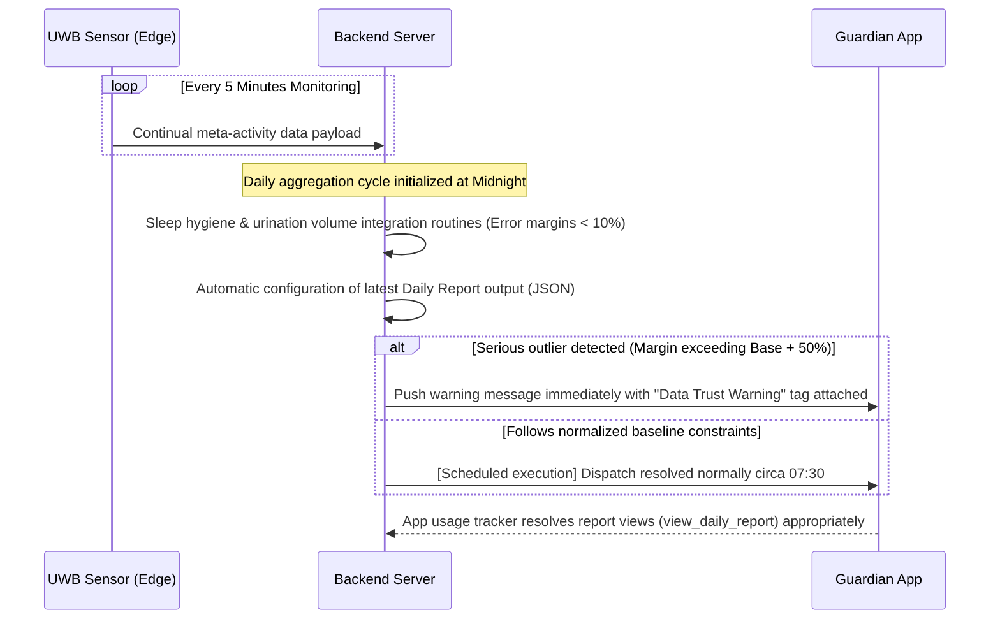
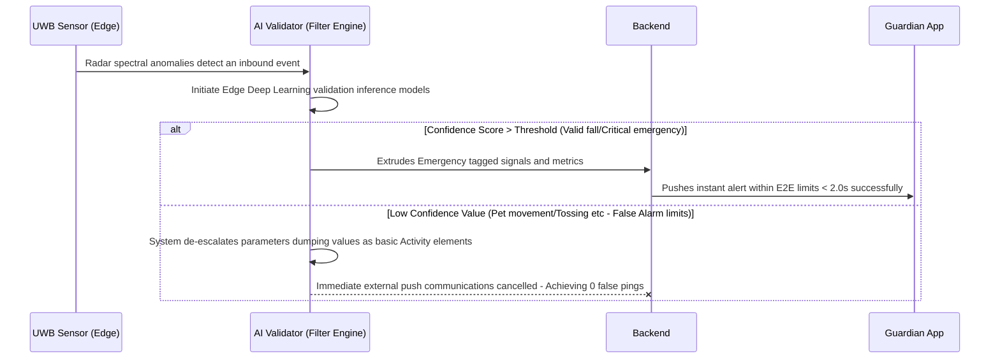
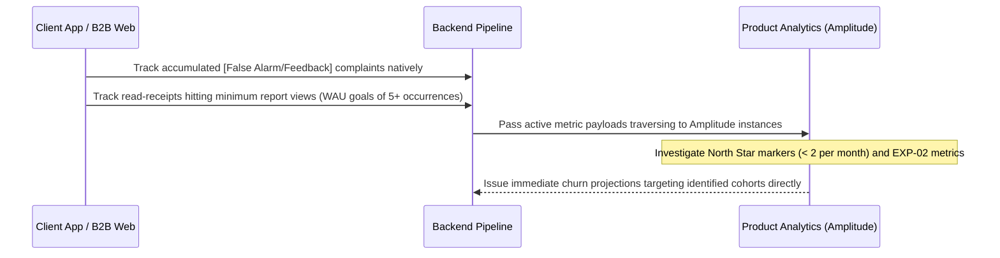
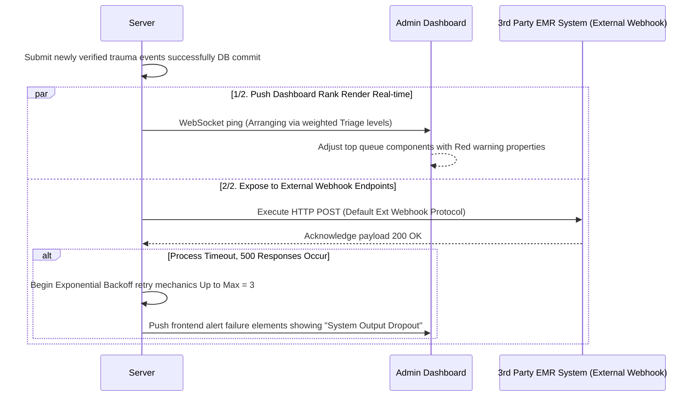
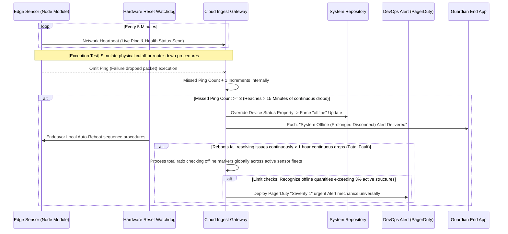

# Software Requirements Specification (SRS)
Document ID: SRS-001
Revision: 1.0
Date: 2026-04-18
Standard: ISO/IEC/IEEE 29148:2018

-------------------------------------------------

## 1. Introduction

### 1.1 Purpose
The purpose of this SRS is to specify the complete and traceable requirements for 'Rooted', a contactless AI ambient home safety solution, to guide the development organization in implementing a Minimum Viable Product (MVP) that resolves unmet needs in the B2B, B2G, and B2C markets. Specifically, it focuses on zeroing out frequent false alarms (average of 12 per day) occurring in motion sensor-based systems (Zero-Friction), preventing casualties caused by nighttime falls, and continuously providing wellness value through daily reports.

### 1.2 Scope (In-Scope / Out-of-Scope)
This system provides UWB radar-based contactless biometric signal monitoring capabilities and a cloud-based control system.
- **Desired Outcome**
  - Reach a perceived monthly user false alarm frequency of ≤ 2 times per household (System upper tolerance limit: 0.3/month)
  - Zero manual interactions with the device by the user (Zero-Friction)
  - Sleep and bathroom dwell time analysis error rate < 10%
  - Complete elimination of manual double-entry into EMR in B2B environments
- **In-Scope**
  - UWB radar hardware integration and contactless sensor data processing
  - Zero false alarm AI filtering engine (Deep learning inference at the edge)
  - Mobile application for B2C guardians (MVP: iOS first, Android terminals considered for Wave 2)
  - B2B control web dashboard and Webhook implementation for EMR transmission
- **Out-of-Scope**
  - Development of a smart home control integration platform including lighting and appliance control
  - Exposure of marketing terminology such as 'elderly/dementia/care/patient' in the service name and app UI
  - Expansion of SLA infrastructure exclusively for B2G public procurement based on lowest-price bidding (To be reassessed in Q4 after penetrating the SOM S1 segment post-launch)

### 1.3 Definitions, Acronyms, Abbreviations
- **UWB (Ultra-Wide Band) Radar**: A non-video sensor that tracks respiration, heart rate, and movement paths using radio waves without a camera.
- **Zero-Friction**: A state where the system operates autonomously without any physical or cognitive intervention by the user, such as charging, wearing, or button operation.
- **JTBD (Jobs to be Done)**: A task or ultimate goal that a user attempts to accomplish or achieve in a specific situation.
- **AOS (Adjusted Opportunity Score)** / **DOS (Discovered Opportunity Score)**: Opportunity scores identified through potential customer interviews, serving as metrics to quantitatively identify unmet user needs.
- **Validator**: A module-based logic system that determines the accuracy of overall system operations and events inferred by AI.
- **False Alarm**: A phenomenon where the system mistakenly identifies a non-emergency situation (e.g., tossing and turning in bed) as an emergency and dispatches an alert.

### 1.4 References (REF-XX)
- **REF-01 (Market Data)**: KHIDI (Korea Health Industry Development Institute) domestic senior care market forecast (Scale of 168 trillion KRW by 2030) and statistics defining the TAM-SAM-SOM.
- **REF-02 (VoC Report)**: Original JTBD VoC analysis targeting existing low-cost motion sensor user groups, wearable churn groups, and non-user explorer groups.
- **REF-03 (Extreme Case Data)**: Jang Young-hee case-based timeline report establishing the root cause of "System ignorance due to false alarm fatigue -> Nursing home fatality."

### 1.5 Constraints and Assumptions
- **Constraints (Constraint / ADR-based Integrated Decisions)**
  - To evade the risk of MFDS (Ministry of Food and Drug Safety) medical device classification issues (R-01), the device's UI and feature specs must be bypass-designed for 'life care/wellness' use rather than diagnostic use. Words like `medical`, `diagnosis`, and `patient` are strictly prohibited across all system segments.
  - To overcome the risk of devolving into SI (System Integration) through custom setups for large nursing hospitals (R-04), a strategic partnership will be formed with the #1 EMR vendor by market share. Other specific custom build requests will not be permitted, and integration will be strictly limited to the 'Standard Plugin (Webhook)'.
  - To address violations of personal information protection laws (R-02), physical radar waveforms will not be transmitted directly to the cloud. Instead, they will be converted into non-identifiable binary data and values at the edge before being saved to the server strictly via HTTPS TLS 1.3 encryption.
- **Assumptions**
  - The global supply chain for UWB chipset components (e.g., NXP/Infineon) will be maintained smoothly, enabling volume supply of hardware.
  - The fundamental 1-sensor-per-room package (attaching one to the bedroom ceiling and one to the bathroom door concurrently) will sufficiently cover the user's operational boundaries. This will be successfully verified during the 4th week of the open beta.

---

## 2. Stakeholders

| Stakeholder Name | Role | Responsibility | Interest |
| :--- | :--- | :--- | :--- |
| **Park Ji-soo (Core)** | Remote Guardian | End-to-end response such as setting up the device module in the elderly parent's residence, managing the subscription, and calling 119 in an emergency. | Contactless (no charging abandonment issues) frictionless monitoring system, operational reliability without false alarm stress, early detection of signs via daily data. |
| **Jeong Min-seok (Adjacent)**| B2G Municipal Procurement Officer | Distributing public budgets to replace and deploy home systems for elderly living alone/vulnerable groups. | Confirmed resolution of false alarms (a side-effect of lowest bidding), checking for a decline in false dispatches, maximized efficiency vs. introduction cost, and proof of metrics. |
| **Jang Young-hee (Extreme)**| Bereaved Family Representative seeking Care | Requires verification to remove negligence risks in care infrastructure and makes facility relocation decisions. | Integrity preservation of event data > 90 days to prove case truth, facility conditions that prevent monitoring shift worker fatigue. |
| **Facility Admin**| B2B System Administrator | Managing safety modules installed on all beds in the facility, monitoring external EMR synchronization channels. | Reasonable alleviation of the workload on a handful of night shifts, prevention of duplicate EMR creation, providing clear situational awareness based on Emergency Triage ranking. |
| **Ko Tae-sik (Non-user)** | Observed Elderly Subject | Passively overriding the monitoring status via family recommendation. | Strong resistance against the introduction of CCTV, privacy-invading devices, or uncomfortable wearable tools that label them as targets of "protection and surveillance." |

---

## 3. System Context and Interfaces

### 3.1 External Systems
- **External EMR System in Nursing Facilities (3rd Party EMR)**: An external dependency network that receives emergency and pattern data generated and transmitted by the Rooted server and loads it into its internal IT database.
- **FCM (Firebase Cloud Messaging) / APNs**: A cloud relay service system that pushes emergency alerts and scheduled daily wellness pattern reports to mobile terminals in real-time.

### 3.2 Client Applications
- **B2C Guardian App (iOS)**: A mobile app client where guardians manage product setup, link sensors to devices, verify daily sleep/urination reports, and issue False Alarm Feedback.
- **B2B Web Admin Dashboard (Web Admin View)**: A functional web SPA where nursing facility administrators verify the states of hundreds of sensors in sequence and traffic light structure, and control emergency Triage rankings.

### 3.3 API Overview

| API Name | Type | Description | Security / Format |
| :--- | :--- | :--- | :--- |
| **Edge → Cloud Ingest API** | Inbound | Permits transmission of de-identified activity indexes and waveform inference meta-states from device endpoints. | TLS 1.3 / Batch JSON |
| **FCM / APNs Push API Send** | Outbound | Sends error or normal reports extracted from the analytics pipeline to the guardian app's push identification token. | High Priority JSON HTTP |
| **EMR Webhook Integration Sender** | Outbound | Sends POST responses immediately adhering to the #1 EMR vendor standards when emergency events occur, exclusive to B2B mode. | HTTP POST / HMAC Signature |

### 3.4 Interaction Sequences (Including Mermaid System Flow Charts)

*(Maintaining the original template's structure but reflecting AmbieCARE domain constraints)*

#### 3.4.1 Document Generation Automation Sequence (Auto-dispatch Daily Wellness Report)
A sequence where the user's dwell and sleep contexts are digitized by the system and produced as a "Report Document."



#### 3.4.2 Validator Engine Operations Sequence (Zero False Alarm Filter)
A sequence targeting zero interference routines deflecting true falls versus animals/standard deviations to deter UWB anomalies.



#### 3.4.3 PMF Diagnostic Sequence (Active Retention Trajectories)
Architecture assessing functional viability logging direct system exits and uninstalls to track retention capabilities.



#### 3.4.4 Notification Sync Sequence (Automated EMR Network Output)
Integrating external web hook infrastructure targeting synchronization structures actively relaying network events securely to private EMR databases.



### 3.5 Use Case Diagram

```mermaid
usecaseDiagram
  actor "Guardian (App User)" as C
  actor "Nursing Facility Admin (Admin)" as M
  actor "UWB Sensor Device" as S
  actor "EMR Backend System" as EMR

  package "AmbieCARE (Rooted) System Framework" {
    usecase "Analyze environment waveforms & confirm false alarm/apnea" as UC1
    usecase "Dispatch AI Validator verdict alerts" as UC2
    usecase "Track wellness pattern statistics such as travel time" as UC3
    usecase "Visual confirmation of daily reports based on week/day" as UC4
    usecase "Risk-based Triage monitoring of emergency beds" as UC5
    usecase "Webhook transmission and duplicate document replacement" as UC6
  }

  S --> UC1
  S --> UC3
  UC1 --> UC2
  UC3 --> UC4
  C --> UC4
  C --> UC2
  M --> UC5
  M --> UC2
  UC2 --> UC6
  UC6 --> EMR
```

---

## 4. Specific Requirements

### 4.1 Functional Requirements

| ID | Title / Statement | Source | Acceptance Criteria (Given / When / Then) | Priority (MoSCoW) |
| :--- | :--- | :--- | :--- | :--- |
| **REQ-FUNC-001** | **Execute Zero False Alarm AI Filtering**<br>Blocks false-positive emergency processes by filtering out blanket tossing/pets at the sensor edge. | Story 1 / FR-01 | **Given** indoor measurements during normal system operation<br>**When** an individual tosses a blanket or sporadic pet movements are captured<br>**Then** the system will not misidentify them as emergency signals and will successfully pass the false alarm upper limit threshold of ≤ 0.3 cases per month. (Confirm Accuracy) | **Must** |
| **REQ-FUNC-002** | **Frictionless Contactless Sensing (Zero-Friction)**<br>Scans resident biometric events without requiring them to wear any wearables. | Story 1 / FR-02 | **Given** the devices have been completely attached to the user's bedroom and walls<br>**When** the elderly person progresses through all daily life cycle patterns<br>**Then** the frequency of explicit charging/operation/control (e.g., buttons) will ultimately result in exactly 0 times. | **Must** |
| **REQ-FUNC-003** | **Emergency Fall Push Transmission**<br>Transfers emergency situations via the guardian's mobile channel immediately upon an actual emergency fall signal. | Story 1 / FR-01 | **Given** the occurrence of cardiac apnea and an inescapable floor fall lasting > 5 minutes<br>**When** the Validator deduces and establishes the risk of the event<br>**Then** a clear push notification text will be displayed and delivered via the related guardian's app token within 60 seconds. | **Must** |
| **REQ-FUNC-004** | **Auto-generate Daily Wellness Pattern Reports**<br>Aggregates daily collected urination and sleep pattern metrics to issue morning daily data. | Story 2 / FR-05 | **Given** when de-identified sensor metadata collected over 24 hours has been dumped<br>**When** the daily report aggregation pipeline is executed successfully at arbitrary early morning hours<br>**Then** sleep and dwell data reports ensuring a precision margin of < 10% error rate are created. | **Should** |
| **REQ-FUNC-005** | **Dispatch Early Warning Reports for Abnormal Patterns**<br>Exposes warning data when a user's dwell volume breaches the upper average threshold limits. | Story 2 / FR-05 | **Given** an environment that calibrates the average activity threshold levels of the elderly at night<br>**When** newly aggregated metrics display abnormal retention stats hitting > 50% above the average threshold<br>**Then** generates and sends a specialized daily report attaching degraded data credibility/health warning flags. | **Should** |
| **REQ-FUNC-006** | **Long-term Missing Data (No-Data) Exception Filtering**<br>Instead of inputting meaningless metrics as 0 due to travel or hospitalization, substitutes them with status codes. | Story 2 / FR-05 | **Given** when the target senior is totally absent and out of the sensor zone continuous over 24hrs<br>**When** server-side daily routine pipelines try launching aggregation algorithms<br>**Then** pauses compiling a raw 0 mark modifying statistical tracking and substitutes an exception marker dictating "Insufficient Stay Metrics Collected". | **Should** |
| **REQ-FUNC-007** | **B2B Dashboard Risk Triage UI**<br>Forces the immediate sorting of incoming emergency threats as high-priority elements supporting multi-user observation. | Story 3 / FR-04 | **Given** night-duty operators surveil a single combined web dashboard<br>**When** varying motion/emergency events stream from 3+ independent patient areas concurrently<br>**Then** the backend assesses risk Triage lists, elevating priority groups straight into the highest visible index modifying audible notification scales correctly. | **Must** |
| **REQ-FUNC-008** | **Automatic EMR Webhook Integration**<br>Transmits verified events straight into EMR grids bypassing redundant physical data logging inputs. | Story 3 / FR-04 | **Given** active B2B internal systems supporting enabled configurations for external EMR transmission<br>**When** emergency incident markers pass fully verified onto internal DB data archives<br>**Then** automatically and unconditionally broadcast defined JSONs onto external EMR Webhook receivers successfully removing human entry needs completely. | **Must** |
| **REQ-FUNC-009** | **Long-Term Log Data Archival Integrity Queries**<br>Affords B2B administrators retroactive data query mechanisms to view specific archived timelines securely. | Story 3 / FR-04 | **Given** accountability or legal investigations activate involving negligence claims against said facilities<br>**When** authorized parties generate search strings operating the internal event query portal<br>**Then** supplies untampered raw past data limits spanning a 90 day limit without dropping metrics to preserve transparent visibility. | **Must** |
| **REQ-FUNC-010** | **Process Sleep Trend Visual Graphs**<br>Merges previous baseline reports producing unified time-based visual plots. (Estimated 1 Sprint) | Story 2 / FR-06 | **Given** accumulation hitting limits over 7 consecutive active monitoring points onto personal accounts<br>**When** opening interface selections leading towards UI sleep visualization chart components<br>**Then** accurately display visual loading tracking trend variables efficiently driving prolonged platform value. | **Could** |
| **REQ-FUNC-011** | **MMS/Kakao Fallback Dual Channels**<br>Integrates SMS capabilities overriding natural internet and application delivery weaknesses. (Estimated 1 Sprint) | Story 1 / FR-07 | **Given** operational zones locking 3G/LTE traffic or environments operating lacking active Push settings<br>**When** parental emergency routines enter the backend attempting to push notifications<br>**Then** parallel lines stream pure SMS payloads / Kakao messages skipping network blocking directly into native phones without dropping logic. | **Could** |
| **REQ-FUNC-012** | **B2B Admin Output Ward Custom Filtering**<br>Provides structural layout modifications helping multi-story grid setups sort excessive loads intelligently. (Estimated 1 Sprint) | Story 3 / FR-08 | **Given** dense dashboard screens reflecting 100+ patient wards existing on multi-story zones<br>**When** administrators implement logic filters assigning personal limits specific to assigned areas (e.g. Block B, Fl 2)<br>**Then** only mapped items matching selected areas load UI event lights concentrating response targets. | **Could** |
 
### 4.2 Non-Functional Requirements

| ID | Category | Requirement Description | Threshold / Measurement Criteria (Metric) | Source / Proof |
| :--- | :--- | :--- | :--- | :--- |
| **REQ-NF-001** | Performance | **Emergency System Response Latency Limits**<br>Preserve system speeds attaining 'Golden Time' targets bridging fall detection to guardian devices. | **p95 ≤ 2,000 ms**. (Includes immediate automated `#ops-alert` dispatch upon measuring points above 2.5s utilizing Datadog APM metrics). | NFR-01 |
| **REQ-NF-002** | Precision | **Guaranteed Maximum Cap on False Alarm Tolerance**<br>Prevent cancellation rates by perfectly mitigating errors passing environmental noise filters. | Hit operational goals suppressing mechanical misfires **≤ 0.3 instances per month.** Track direct UI inputs resolving total App complaints reaching **≤ 2 inputs limiting noise.** | NFR-02 |
| **REQ-NF-003** | Precision | **Error Rate Parameter Margin Values**<br>Prove internal metrics establishing correct distinction separating bed occupancy against routine bathroom usage. | Pilot ground-truth validations vs tracker output results mapping **margin values ≤ 10% tolerance max.** | NFR-03 |
| **REQ-NF-004** | SLA | **Maximum Cloud Service Uptime Availability**<br>Build resistance structures managing infrastructural decay and minimize network dropout events accurately. | Standard runtime stability **≥ 99.9%** (Maximum monthly interruption limit set to 43.8 mins leveraging Datadog uptime probes running 5 min increments). | NFR-04 |
| **REQ-NF-005** | Reliability | **Network Delay Resiliency Limitations**<br>Manage physical connection failures parsing sub node gateways towards central points aggressively. | Sustain permanent loss margins managing re-transmission values ensuring total fails run **≤ 0.1% drops**. | NFR-05 |
| **REQ-NF-006** | Security | **De-identification Processes on Sensitive Human Strings**<br>Confirm security verification mandates regulating privacy limits and data access compliance rules safely. | Strict ban on raw wave transfers externally. Output converted values exclusively in native binaries/metrics. **(Constant TLS 1.3 streams alongside yearly & quarterly penetration/audit bounds metrics)**. | NFR-06 / NFR-07 |
| **REQ-NF-007** | Cost | **Per Unit Architecture Cloud Operating Economics**<br>Halt infrastructure spending bloat avoiding exponential budget creep mapping event streams appropriately. | Per resident structural limits constrained **Maximum Monthly Volume ≤ 500 KRW.** Deploy automatic Slack routines `#cost-alert` triggered at AWS thresholds surpassing 600 KRW dynamically. | NFR-08 |
| **REQ-NF-008** | Archiving | **Long Form Redundant Log Cold Data Migration Values**<br>Policy dictates Hot / Cold separation methods to prove precise logs mapping extreme physical events cleanly. | Ensure Tier 1 cloud logs retain data > **90 Days**. Map transition triggers launching automatic movements toward AWS Glacier limiting final duration variables at **> 3 Years securely.** | NFR-10 |
| **REQ-NF-009** | Scalability | **Event Request Surges Threshold Fortification Ratings**<br>Ensure stabilized operational conditions enduring parallel influx from mass consumer acquisitions correctly. | Penetration/Stress limits tested via JMeter checking constraints **managing > 1,000 node volumes hitting maximum output latency parameters ≤ 500ms.** | NFR-14 |
| **REQ-NF-010** | Monitor | **Catastrophic Infrastructure Disconnect Alarm Procedures**<br>Create direct response frameworks deploying human support assets facing extensive server failures rapidly. | Trigger PagerDuty Severity 1 metrics pushing engineers immediately tracking conditions crossing **> 3% entire sensor bases disconnecting uniformly offline.** | NFR-13 |
| **REQ-NF-011** | KPI | **Elderly Zero-Interaction Tracking Goals Metrics**<br>Accumulate maximum CRM complaints parsing explicit launch friction establishing the success bounds of zero interaction models. | Evaluate text attributes upon cancellation proving occurrences matched strictly under "Inconvenient Setup/Charging/Rejection of Form-factor" hit **exactly 0 valid entries successfully.** | EXP-03 |
| **REQ-NF-012** | KPI | **Product Market Fit (PMF) Active Engagement Confirmations**<br>Utility usage points tracking app daily statistics breaking barriers exceeding "Lack of incident=Lack of use" loops effectively. | Extract Wave 2 B2C public retention values verifying structural WAU (Weekly Active Users) hitting **> 60% total users engaging with app documents > 5 separate entries weekly.** | EXP-02 |

---

## 5. Traceability Matrix

This is a traceability matrix proving how the stories defined above are ultimately converted into codebase features and verified with explicit test scenarios.

| Original Story / PRD Goal | Requirement ID | Requirement Type | Test Case ID | Test Case Execution Overview (Summary) |
| :--- | :--- | :--- | :--- | :--- |
| **Story 1 (Safety/Durability)** | REQ-FUNC-001 | Functional | TC-FUNC-001 | Under mock environment debugging, inject forced blanket dragging simulations testing null output responses accurately without issuing app pings. |
| **Story 1 (Safety/Durability)** | REQ-FUNC-002 | Functional | TC-FUNC-002 | Setup tester structures avoiding artificial interaction attributes (like battery cycles) mapping complete functionality successfully capturing values over 7+ days correctly. |
| **Story 1 (Safety/Durability)** | REQ-FUNC-003 | Functional | TC-FUNC-003 | Record packet reception periods delivering End-To-End completion matching boundaries < 60 seconds tracking physical crash responses into supervisor endpoints. |
| **Story 2 (Data Defense)** | REQ-FUNC-004 | Functional | TC-FUNC-004 | Utilize custom data sets pushing sleep/wake intervals into midnight Cron generation limits securing precision margins checking output errors inside nominal +/- 10% bounds. |
| **Story 2 (Data Defense)** | REQ-FUNC-005 | Functional | TC-FUNC-005 | Inject intentional anomalies overriding specific user duration properties manually breaching limits > 50% proving system delivery flags appropriately inside notification channels. |
| **Story 3 (Efficiency B2B)**| REQ-FUNC-007 | Functional | TC-FUNC-006 | Introduce risk variables sequentially inside separated bed modules monitoring multi-node states prioritizing danger tags placing top indicators efficiently updating grid mechanics immediately |
| **Story 3 (Efficiency B2B)**| REQ-FUNC-008 | Functional | TC-FUNC-007 | Attach mock receiver networks receiving emergency hits validating output HTTP body formats recognizing incoming 200 checks logging actions correctly bypassing external gaps. |
| **Story 3 (Efficiency B2B)**| REQ-FUNC-009 | Functional | TC-FUNC-008 | Synthesize > 89 days of historical spikes logging backend repository systems executing administrator portal tests parsing queries accurately receiving unbroken archive properties cleanly. |
| **PRD §5. NFR KPI Prop** | REQ-NF-001 | Non-Functional | TC-NF-001 | Initialize 10,000 automated ping requests examining transit latency metrics monitoring output values correctly settling strictly beneath the maximum bounds of 2,000 ms. |
| **PRD §5. NFR KPI Prop** | REQ-NF-009 | Non-Functional | TC-NF-002 | Simulate intensive traffic blocks injecting 1,000 virtual requests/per sec validating server constraints running zero breakdown periods maintaining data throughput precisely over JMeter. |

---

## 6. Appendix

### 6.1 API Endpoint List

Mandatory interfaces supporting the main endpoints that underpin seamless network control among the MVP system architectures.

| API Endpoint URI | Method | Header / Auth Security | Payload / Request Constraints | Expected Behavior |
| :--- | :--- | :--- | :--- | :--- |
| `/api/v1/sensors/ingest` | POST | Edge Generated TLS Client Cert | `device_id` (UUID), `event_type`, `meta_metrics` | Secured bulk upload mechanism moving native de-identified stats logging internally onto backend endpoints. |
| `/api/v1/pushes/send_alert`| POST | Cloud Key (FCM Server Key) | `user_id`, `critical_level`, `push_body_payload` | Deliver urgent messages communicating through platform (FCM/APNs) APIs directly reaching devices quickly. |
| `[EMR_PROVIDER_URL]/sync` | POST | Authorized HMAC-SHA256 Sig | `patient_zone`, `event`, `confidence` | Direct injection routine placing meta indicators safely within local 3rd-party medical endpoints awaiting specific 200 acknowledgements. |
| `/api/v1/reports/daily` | GET | Valid Bearer Auth Block (JWT) | `device_id` (UUID), `date` | Allows client devices querying aggregated outputs retrieving scores mapping events targeting specifically dated variables. |
| `/api/v1/events/archive_qa`| GET | Valid Admin RBAC Identity Blocks | `start_date`, `end_date`, `facility_b2b_id` | Permits managerial accounts executing chronological search bounds observing historic data correctly resolving up to rolling 90 day values transparently. |

### 6.2 Entity & Data Model (Table Specification)

| Entity Structure Name | Field (Column) Name | Constraint | DB Data Type | Entity Description |
| :--- | :--- | :--- | :--- | :--- |
| **SensorDevice**<br>(Sensor Metadata)| `device_id`<br>`location_zone`<br>`firmware_version`<br>`installation_date`<br>`status` | Primary Key<br>Enum(bedroom, bathroom..)<br>Nullable String<br>Past Limit Date<br>Enum(active/inactive) | UUID<br>STRING<br>STRING<br>DATETIME<br>STRING | Unique device base identifying functional facility sections, managing software updates, and handling UWB node network identities. |
| **WellnessEvent**<br>(Incident & Event Logs)| `event_id`<br>`device_id`<br>`event_type`<br>`confidence_score`<br>`is_false_alarm`<br>`timestamp` | Primary Key<br>Foreign Key(Sensor)<br>Enum(activity, emergency..)<br>Limit(0~1.0)<br>Default Parameter (false)<br>Time Index | UUID<br>UUID<br>STRING<br>FLOAT<br>BOOLEAN<br>DATETIME | Central tracking archive capturing all event outputs scoring generic items versus serious risks tracking feedback mechanics universally. |
| **UserAccount**<br>(Admin & Family Acc)| `user_id`<br>`role`<br>`notification_pref`<br>`linked_devices[]` | Primary Key<br>Enum(guardian, admin)<br>Json Data Blob<br>Array Map (Foreign Key) | UUID<br>STRING<br>JSON<br>UUID Array | Core hierarchy structural array categorizing client parameters logging explicit relationships associating targets over complex N to 1 bounds. |
| **DailyReport**<br>(Analytics Summaries)| `report_id`<br>`device_id`<br>`date`<br>`sleep_score`<br>`bathroom_count`<br>`anomaly_flags[]` | Primary Key<br>Foreign Key(Sensor)<br>Index Key<br>Score Range(0~100)<br>Positive Num<br>Null Array Element | UUID<br>UUID<br>DATE<br>INT<br>INT<br>STRING Array | Comprehensive metric array displaying finalized chronological health indicators sorting anomalies correctly formatting reports for user observation directly. |

### 6.3 Detailed Interaction Models

**Detailed Sequence Diagram (Edge Network Failure Resolution Methodology)**
A detailed sequence showing PagerDuty escalation logistics satisfying NFR-10 structures, observing offline statuses passing specific gaps to enforce prompt organizational updates managing major connection breakdowns effectively.


