# 소프트웨어 요구사항 명세서 (SRS)

문서 ID: SRS-001  
리비전: 1.0  
일자: 2026-04-18  
표준: ISO/IEC/IEEE 29148:2018

---

## 1. 서론 (Introduction)

### 1.1 목적 (Purpose)

본 SRS는 비접촉 AI 앰비언트 홈 안전 솔루션인 **Rooted(루티드)**의 MVP(Minimum Viable Product) 소프트웨어 시스템에 대한 기능상, 비기능상, 인터페이스 및 데이터 요구사항을 ISO/IEC/IEEE 29148:2018 표준에 따라 정의한다.

**타겟 문제 (Targeted Problem):**

비접촉 앰비언트 케어 시장은 B2B, B2G, B2C 관점에서 구조적으로 "미충족 니즈(Unmet Need)" 상태에 있다.

- **B2B (요양시설):** 저가 모션 센서의 하루 평균 12건의 오경보로 인해 알람 피로도가 발생하며, 야간 교대 근무 중 11건의 오경보 누적 → 알람 무시 → 치명적인 사망 사고로 이어지는 최악의 사례가 현실로 나타남. 또한 EMR 네트워크와의 데이터 연동 부재로 이중 입력 작업이 강제됨. (PRD 본문 §1.1, §1.7 장영희 극단 사례)
- **B2G (지자체):** 한정된 예산으로 돌봄 사각지대를 해소해야 하지만, 고사양 장비는 단가를 초과하고 저사양 장비는 응급 징후를 놓치는 비용-효용 딜레마에 직면함. (PRD §1.5)
- **B2C (보호자):** CCTV는 프라이버시를 침해하고 웨어러블은 충전을 방치하면 사실상 무용지물이 되어, 혼자 거주하는 노부모의 응급 상황을 즉각 인지할 방법이 없어 극한의 불안감과 데이터 부재를 겪음. (PRD §1.5, §1.7, §1.10)

본 SRS의 예상 독자는 개발팀, QA팀, 프로젝트 매니저 및 외부 감사인이다. 이 문서는 설계, 구현, 테스트, 인수를 위한 공식적인 참고 자료 역할을 한다.

### 1.2 범위 (Scope - In-Scope / Out-of-Scope)

**시스템명:** Rooted — 비접촉 AI 앰비언트 홈 안전 솔루션

**정량적 목표 (Desired Outcome):**

| 목표 | 현재 상태 (As-Is) | 목표 상태 (To-Be) | PRD 출처 |
| :--- | :--- | :--- | :--- |
| 월간 AI 엔진 오경보 빈도 | 12건/일 (= 360건/월/가구) | ≤ 0.3건/월/가구 | §1.9, §2.2.2 |
| 사용자가 체감하는 월간 오경보 빈도 (북극성 지표) | 360건/월/가구 | ≤ 2건/가구 | §1.3 |
| 어르신의 디바이스 조작 빈도 | 웨어러블 충전/착용의 지속적 마찰 | 0회 (Zero-Friction) | §1.9 |
| 야간 수면/화장실 패턴 오류율 | 데이터 부재 | 10% 미만 | §1.9 |
| 사생활 침해 | CCTV/홈캠 감시에 대한 거부감 | 비디오 비사용(비식별화) 방식, 침해 제로 | §1.10 |
| B2B EMR 이중 입력 | 이중 입력 (수기 + 시스템) | 자동 EMR 연동, 이중 입력 0건 | §1.10, §3.1 |

**포함 범위 (In-Scope):**

| 항목 | 설명 | PRD 출처 |
| :--- | :--- | :--- |
| UWB 레이더 HW 연동 | 카메라 없이 레이더 파형으로 사람의 움직임, 호흡, 심박, 체류 시간을 감지하는 비접촉 센서 모듈 | §2.2.1 |
| 오경보 제로 AI 엔진 | 뒤척임/착석과 낙상/무호흡을 정밀하게 구분하는 딥러닝 기반 엣지 인퍼런스 모델 | §2.2.2, DOS 3.8 |
| B2C 보호자 앱 | iOS 우선 (Android는 Wave 2 이후). 응급 알림, 데일리 리포트, 오경보 신고 기능 | §2.2.3 |
| B2B 모니터링 대시보드 (Web) | 신호등(적/황/녹) 다인실 모니터링 UI + EMR 웹훅 연동 | §2.2.3 |
| 웰니스 데일리 리포트 | 매일 07:30에 수면 점수, 화장실 방문 횟수, 이상 징후 플래그를 자동 발송 | §3.1 Feature 5 |

**제외 범위 (Out-of-Scope):**

| 항목 | 제외 사유 | PRD 출처 |
| :--- | :--- | :--- |
| 스마트홈 제어 연동 (조명/가전) | 안전이라는 핵심 가치를 희석시킴. 아카라 라이프(Aqara Life) 방식 배제. | §2.3 #1 |
| 'Care(돌봄)' 마케팅 언어 사용 | 비사용자 고태식 페르소나와 같은 ~44만-54만 가구에서 '노인 낙인(Stigma)'으로 인한 거부감 방지. | §2.3 #2 |
| B2G 공공 조달 최저가 입찰 SLA 스펙 | 출시 시기 무기한 지연 유발. Q4에 SOM S1 세그먼트 침투 검증 후 재평가. | §2.3 #3 |

### 1.3 용어, 약어 정리 (Definitions, Acronyms, Abbreviations)

| 용어 | 정의 |
| :--- | :--- |
| UWB (Ultra-Wideband) | 초광대역 무선 기술. 카메라 없이 전파 반사를 통해 호흡, 심박수, 움직임 패턴을 감지하는 레이더 기반 기술. |
| Zero-Friction (마찰 제로) | 사용자(어르신)의 충전, 착용, 버튼 조작 등 어떠한 수동 개입 없이 시스템이 자율적으로 동작하는 UX 원칙. |
| False Alarm (오경보) | 시스템이 비응급 상황(예: 침대에서 뒤척임, 반려동물 움직임)을 응급 상황으로 오인하여 경보를 보내는 현상. |
| JTBD (Jobs to be Done) | 사용자가 특정 상황에서 달성하고자 하는 과업이나 목표를 중심으로 제품의 필요성을 분석하는 프레임워크. |
| AOS (Adjusted Opportunity Score) | 기회 발굴 인터뷰에서 도출된 조정 기회 점수. 중요도와 만족도에 가중치를 두어 시장 기회의 크기를 정량화함. |
| DOS (Discovered Opportunity Score) | 인터뷰에서 발견된 기회 점수. 기존 대안 대비 미충족 니즈의 정도를 0-5점 척도로 정량화함. |
| CJM (Customer Journey Map) | 인지, 구매, 사용, 이탈에 이르는 고객의 전체 여정에서의 경험과 감정을 시각화하는 분석 도구. |
| Triage (트리아지/중증도 분류) | 동시다발적인 응급 상황 발생 시 자동으로 위험도를 계산하고 대응 우선순위를 결정하는 알고리즘. |
| Edge (엣지) | 센서 디바이스 자체에서 직접 AI 추론을 수행하는 로컬 컴퓨팅 환경. 데이터는 클라우드로 전송되기 전에 전처리됨. |
| OTA (Over-the-Air) | 무선 네트워크를 통해 원격으로 디바이스 펌웨어를 업데이트하는 방식. |
| EMR (Electronic Medical Record) | 요양시설의 전자의무기록 시스템. |
| Webhook (웹훅) | 특정 이벤트 발생 시, 사전에 등록된 외부 URL로 HTTP POST 요청을 자동 전송하는 서버 간 통신 방식. |
| MoSCoW | 요구사항 우선순위 지정 기법: Must / Should / Could / Won't. |
| Heartbeat (하트비트) | 디바이스가 정상 작동 중임을 서버에 주기적으로 알리는 신호. |
| Validator (검증기) | AI 추론 결과의 신뢰도를 검증하고 오경보와 실제 이벤트를 판별하는 로직 모듈. |
| PMF (Product-Market Fit) | 제품이 시장의 핵심 니즈를 적절히 만족시키고 있는지를 나타내는 지표. |
| KSF (Key Success Factor) | 시장에서 경쟁 우위를 결정짓는 핵심 성공 요인. |

### 1.4 참고 문헌 (References - REF-XX)

| 참조 ID | 문서명 | 설명 |
| :--- | :--- | :--- |
| REF-01 | PRD v0.3 — Rooted 비접촉 AI 앰비언트 홈 안전 솔루션 | 본 SRS의 비즈니스/기능적 요구사항에 대한 단일 진실 공급원(SSOT) |
| REF-02 | KHIDI 시장 보고서 | 한국 시니어 케어 시장 규모: 72조원(2020) → 168조원(2030) |
| REF-03 | 글로벌 AI 기반 노인 케어 시장 분석 | $56.8B (2025) → $329.4B (2034) (CAGR 21.3%) |
| REF-04 | JTBD VoC 인터뷰 보고서 | 3개 그룹(최근 사용자/이탈자/미사용 탐색자) 원본 인터뷰 내용 및 AOS/DOS 분석 (§1.9) |
| REF-05 | 포터의 5세력 / 5개사 경쟁사 분석 | §1.1, §1.2 기반 구조 및 경쟁사(케어벨, 오파스넷, 아카라 라이프, 유메인, 에이슬립) 분석 |
| REF-06 | 장영희 극단 사례 타임라인 | 2024.01.14 요양원 야간 낙상 사망 사고의 근본 원인 분석 (§1.7) |
| REF-07 | ISO/IEC/IEEE 29148:2018 | 시스템 및 소프트웨어 엔지니어링 — 수명 주기 프로세스 — 요구사항 엔지니어링 |

### 1.5 제약 사항 및 가정 (Constraints and Assumptions)

#### 1.5.1 제약 사항 (Constraints)

PRD §7.2의 리스크 항목에 대한 아키텍처 결정 기록(ADR)을 제약 사항으로 통합 적용한다.

| 제약 ID | 제약 사항 | ADR 결정 | PRD 출처 |
| :--- | :--- | :--- | :--- |
| CON-01 | **의료기기 분류 회피** — 맥박/호흡 데이터 기반 알림이 '진단'으로 해석될 경우 식약처(MFDS) 승인 필수. 발생률 4/5, 영향도 5/5. | 제품을 "라이프 케어 스마트홈 기기(웰니스/안전 확인용)"로 포지셔닝. 앱 UI/알람에 면책 조항 삽입. DB/API에서 `diagnosis`, `medical`, `patient`와 같은 단어 사용 전면 배제. | R-01, §3.2 Principle 2 |
| CON-02 | **개인정보보호법(PIPA) 준수** — 서버에 움직임/생체 데이터 누적 시 민감정보 관리 가이드라인 위반 우려. 발생률 4/5, 영향도 4/5. | 원시 데이터(Raw data)를 엣지단에서 비식별 이진/수치형 이벤트 결과로 변환. 비식별 메타데이터만 서버에 저장. B2B 다자간 동의서 템플릿 제공. | R-02, §3.1 Feature 3 |
| CON-03 | **SI(System Integration)화 방지** — 대형 요양병원의 무리한 EMR 커스텀 요구 차단 필요. 발생률 4/5, 영향도 4/5. | MVP 단계에서는 독립적인 SaaS 대시보드 공급을 우선. 1위 벤더(예: 케어포)와의 전략적 파트너십을 통해 표준 플러그인(웹훅) 연동으로 제한. 개별 SI 구축 요구 거절. | R-04, §3.1 Feature 4 |
| CON-04 | **DB/API 명명 규칙** — `diagnosis(진단)`, `medical(의료)`, `patient(환자)` 등 규제 유발 트리거 단어 사용 엄격히 금지. 용어를 `wellness_score`, `activity_alert` 등으로 통일. | 시스템 전반에 적용. | NFR-12 |
| CON-05 | **UWB 칩셋 공급 의존성** — NXP/Infineon 등 소수 주요 부품 제조사에 의존. 발생률 3/5, 영향도 4/5. | 단기적 멀티 소싱 전략과 장기적 자체 칩셋 설계 로드맵(벤치마킹: 유메인) 병행 검토. | R-03, §1.1.4 |

#### 1.5.2 가정 (Assumptions)

| 가정 ID | 가정 사항 | 검증 포인트 | PRD 출처 |
| :--- | :--- | :--- | :--- |
| ASM-01 | 글로벌 반도체 공급난 없이 NXP/Infineon UWB 칩셋의 안정적 공급이 지속된다. | 지속적 모니터링 | §1.1.4 |
| ASM-02 | TAM-SAM-SOM 계산에 사용된 초기 침투율 가정(B2C 0.2%, B2B 2.0%, B2G 5.0%)은 유효하다. | Wave 2 종료 후 검증 | §1.6 SOM |
| ASM-03 | 방 1개당 1대의 센서 설치(침실 천정 1대 + 화장실 문 위 1대)로 주요 생활 공간의 움직임 커버가 충분하다. | **Wave 1 베타 4주차에 가구별 실제 측정된 움직임 커버리지 데이터 분석** | §3.1 Feature 2 |

#### 1.5.3 종속성 (Dependencies)

| 종속성 ID | 종속 대상 | 설명 | PRD 출처 |
| :--- | :--- | :--- | :--- |
| DEP-01 | EMR 벤더 (케어포 등) | 표준 플러그인(웹훅) 연동을 위한 B2B 기술 제휴 체결이 필수적임. | §3.1 Feature 4 |
| DEP-02 | KCC 무선 인증 | UWB 레이더 디바이스에 대한 국내 전파 인증을 반드시 통과해야 함. | §3.2 Phase 2 |
| DEP-03 | FCM/APNs 푸시 서비스 | 응급 알림의 즉각적인 전달을 위해 외부 푸시 인프라에 의존함. | §2.2.3 |

---

## 2. 이해관계자 (Stakeholders)

PRD §2.1의 4가지 핵심 페르소나를 이해관계자 역할로 매핑.

| 역할 | 이름 (페르소나) | 책임/기능 | 주요 관심사 |
| :--- | :--- | :--- | :--- |
| **B2C 보호자 (핵심)** | 박지수 (43세, 직장인 자녀) | 센서 설치 결정, 보호자 앱 사용, 응급 상황 1차 대응, 오경보 피드백 제출. | ① 실제 응급 상황에서만 알림 수신 (오경보 ≤ 2회/월). ② 어르신의 기기 조작/거부감(Friction) 제로. ③ 야간 수면/화장실 패턴 데이터로 건강 이상 징후 조기 발견. |
| **B2G 조달청/지자체 공무원 (인접)** | 정민석 (46세, 공무원) | 응급안전안심서비스 예산 집행, 노후 장비(90,000대) 교체 평가, 도입 기기의 실제 오경보율 검증. | ① 한정된 예산 내에서 비용-효용 극대화. ② 오인 출동 감소 (작년 847건 중 189건이 기기 오작동에 기인). ③ 대규모 레퍼런스 검증 데이터 확보. |
| **유가족 / 시설 재선택 탐색자 (극단)** | 장영희 (63세, 낙상 사망사고 소송 유가족) | 요양원 모니터링 시스템의 데이터 무결성 요구, 향후 시설 재선택 시 안전 시스템 철저히 평가. | ① 사고 발생 당시 90일 이상의 모니터링 데이터 보존 및 무결성 증명. ② 오경보로 인한 알람 무시 관행 방지. |
| **B2B 요양시설 관리자** | 요양시설 야간 당직자 | 다인실 야간 모니터링, EMR 이벤트 기록 관리, 동시다발적 응급 상황 발생 시 Triage 기반 의사 결정. | ① 일평균 12건의 오경보를 월 0.3건 이하로 감소. ② EMR 시스템에 수동 이중 입력 작업 제거. ③ Triage를 통한 대응 우선순위 확보. |
| **비사용자 (잠재 전환 대상)** | 고태식 (71세, 은퇴 공무원) | 관찰 대상자. 디바이스 거부감을 결정하는 UX 수용성이 핵심 변수임. | ① '감시' 느낌을 피하는 비영상(Non-video) 방식. ② 수동 조작 0건 달성. ③ '돌봄(Care)'과 같은 낙인 언어 배제. |

---

## 3. 시스템 컨텍스트 및 인터페이스 (System Context and Interfaces)

### 3.1 외부 시스템 (External Systems)

| 외부 시스템 | 연동 방식 | 역할 | PRD 출처 |
| :--- | :--- | :--- | :--- |
| **EMR 시스템 (케어포 등 1위 벤더)** | HTTP POST 웹훅 (JSON) | 웰니스 이벤트를 요양시설 네트워크에 실시간으로 자동 기록하여 이중 입력을 제거. | §3.1 Feature 4 |
| **FCM (Firebase Cloud Messaging)** | HTTP/2 Push | B2C 보호자 앱(iOS)에 응급 알림 및 데일리 리포트를 푸시로 전달. | §2.2.3 |
| **APNs (Apple Push Notification service)** | HTTP/2 Push | iOS 디바이스를 대상으로 최종 푸시 알림 전달. | §2.2.3 |
| **AWS 클라우드 인프라** | SDK/API | Lambda(이벤트 처리), S3/Glacier(아카이브), CloudWatch(모니터링) | §1.1.4, NFR-08 |
| **Amplitude / Mixpanel** | SDK 기반 이벤트 트래킹 | `view_daily_report`, `is_false_alarm` 등 제품 분석 이벤트 트래킹. | §1.3 |

### 3.2 클라이언트 애플리케이션 (Client Applications)

| 클라이언트 | 플랫폼 | 핵심 기능 | PRD 출처 |
| :--- | :--- | :--- | :--- |
| **B2C 보호자 앱** | iOS (MVP). Android: Wave 2 이후 | 응급 푸시 알람 수신, 데일리 웰니스 리포트 조회, 오경보 신고 버튼, 수면 추이 그래프 (Could), SMS/카카오톡 폴백(Fallback) 설정 (Could). | §2.2.3, FR-05~07 |
| **B2B 모니터링 대시보드** | Web (SPA) | 다중 병상 실시간 신호등(적/황/녹) 모니터링, Triage 기반 우선순위 정렬, EMR 웹훅 연결 모니터링, 90일 이벤트 로그 뷰어, 커스텀 필터링 (Could). | §2.2.3, FR-04, FR-08 |
| **인스톨러 앱(설치용)** | 모바일 (내부용) | 센서 설치 위치 가이드, 캘리브레이션 상태 확인, 설치 오류 최소화. | NFR-11 |

### 3.3 API 개요 (API Overview)

| API | 방향 | 설명 | 인증 | 핵심 특징 | PRD 출처 |
| :--- | :--- | :--- | :--- | :--- | :--- |
| **Edge → Cloud Ingest API** | Inbound (내부) | 엣지에서 클라우드로 비식별 이벤트 메타데이터를 배치 전송. | TLS 1.3 Client 인증서 | 원시 레이더 파형은 엣지에서 수치 결과로 변환됨. 5분 단위 배치 전송. | §3.1 Feature 3 |
| **EMR 웹훅 API** | Outbound (외부) | 요양시설 EMR로 웰니스 이벤트를 실시간 전송. | API Key + HMAC-SHA256 서명 | JSON 페이로드: 이벤트 타입, 타임스탬프, 신뢰도 점수, 파악 구역. 요율 제한: 100회/분/시설. 실패 시 최대 3회 지수 백오프(Exponential Backoff) 재시도. | §3.1 Feature 4 |
| **FCM/APNs 푸시 API** | Outbound (외부) | 보호자 앱에 응급 알림 및 데일리 리포트 전송. | FCM Server Key / APNs Auth Key | 응급: 즉시 전송(우선순위 High). 데일리 리포트: 매일 07:30 스케줄 발송. | §2.2.3 |
| **이벤트 로그 아카이브 조회 API** | 내부 | 보존된 90일 이벤트 로그를 역할 기반으로 조회. | JWT Bearer Token + RBAC | 90일간 Hot 스토리지 → S3 Glacier Cold 스토리지 이관(3년 보존). 법적 분쟁 시 무결성 증명을 위한 해시 체인 적용. | §1.8 Q2 |
| **데일리 리포트 조회 API** | 내부 | 보호자 앱에서 일일 수면 점수, 화장실 빈도, 이상 징후 플래그 조회. | JWT Bearer Token | 부족한 경우 "데이터 부족" 상태 코드 반환. 아웃라이어 필터링 후 "데이터 신뢰성 경고" 첨부 기능. | FR-05 |
| **오경보 피드백 API** | 내부 | 오경보를 알리는 보호자 피드백 수집. | JWT Bearer Token | `is_false_alarm` 플래그 업데이트. 월간 배치 분석에 반영됨. | §1.3 |

### 3.4 인터랙션 시퀀스 (Interaction Sequences)

#### 3.4.1 데일리 웰니스 리포트 자동 생성 시퀀스

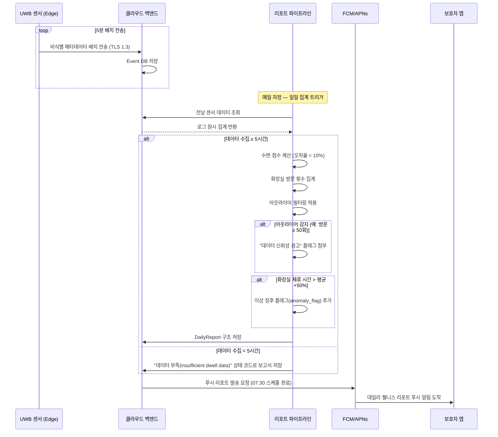

#### 3.4.2 오경보 제로 AI 검증기(Validator) 실행 시퀀스

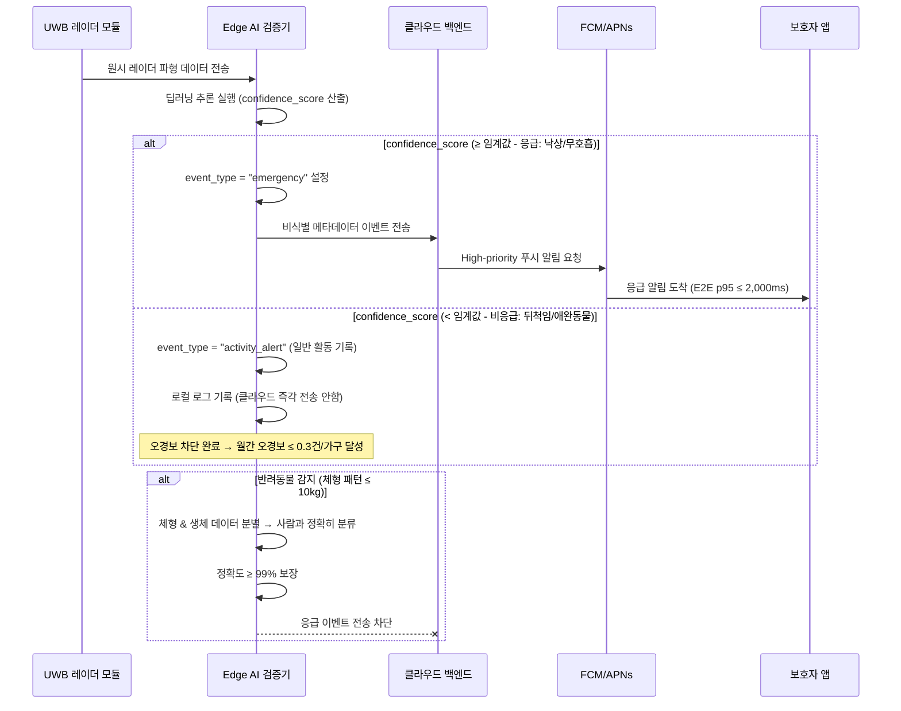

#### 3.4.3 PMF 진단 시퀀스 (사용자 경험 지표 추적)

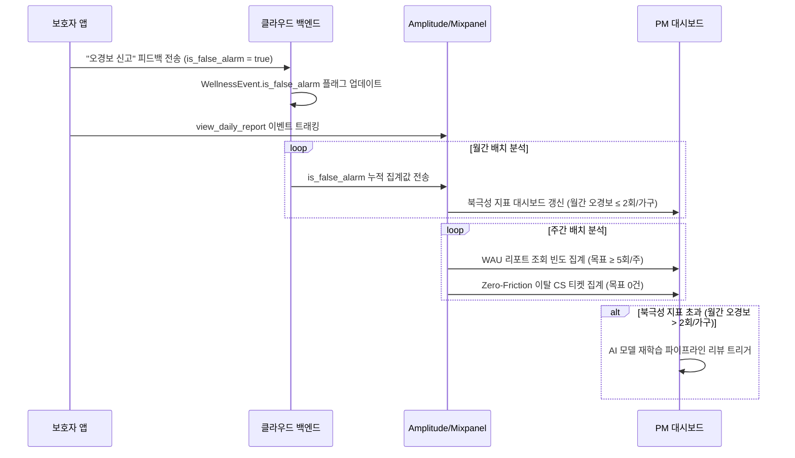

#### 3.4.4 EMR 시스템 데이터 동기화 시퀀스

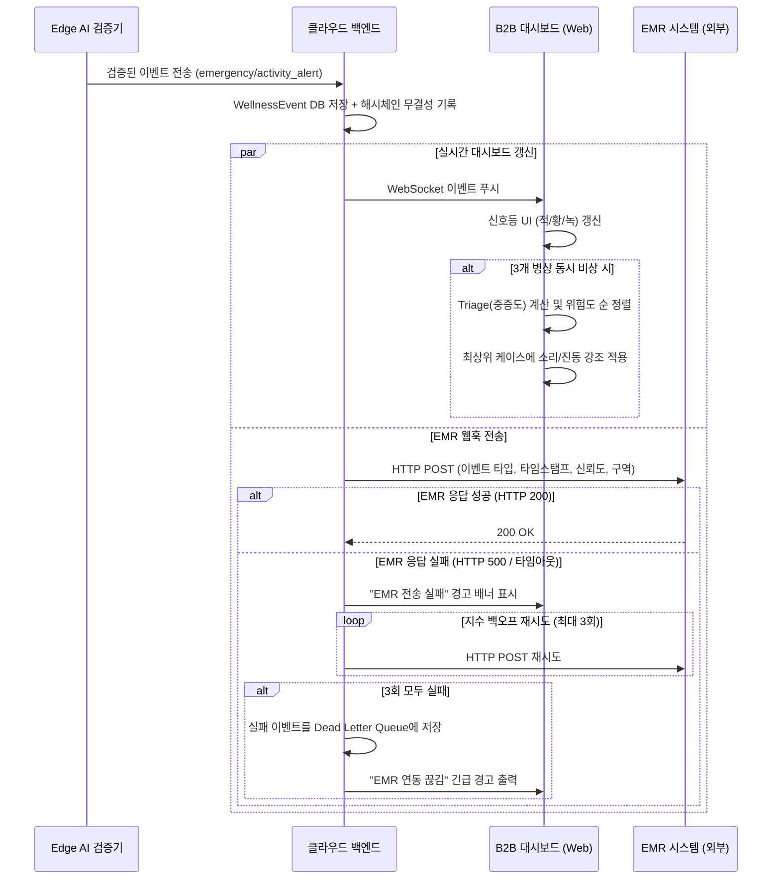

### 3.5 Use Case Diagram

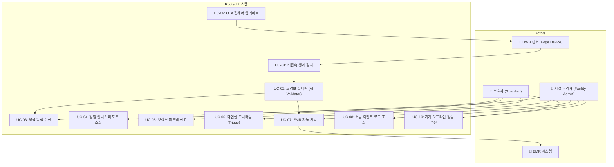

### 3.6 개체-관계 다이어그램 (ERD)

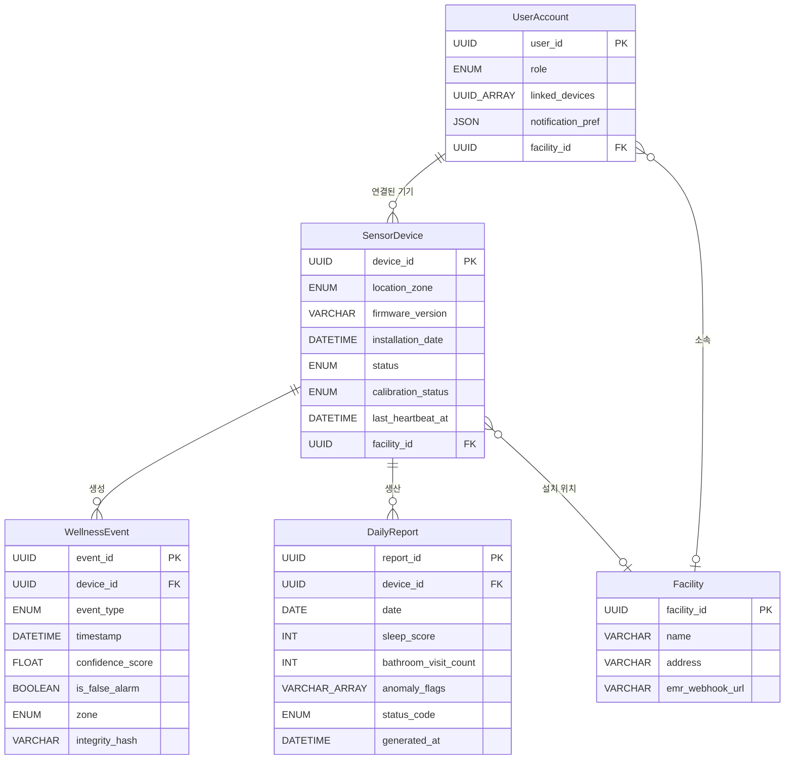

### 3.7 클래스 다이어그램 (Class Diagram)

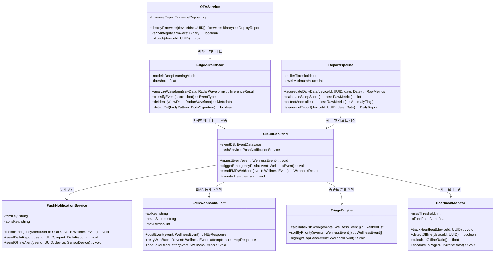

### 3.8 컴포넌트 다이어그램 (Component Diagram)

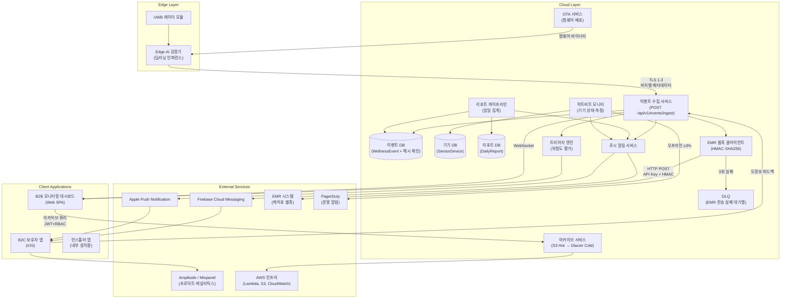

---

## 4. 구체적 요구사항 (Specific Requirements)

### 4.1 기능적 요구사항 (Functional Requirements)

> **일러두기:** 출처(Source) 열은 PRD의 스토리/FR 번호를 가리킵니다. 우선순위는 MoSCoW 기준입니다. AC(인수 조건)는 Given/When/Then 형식으로 작성되었습니다.

---

#### FR-01: 오경보 제로 AI 필터링 엔진 (Must, DOS 3.8, XL — 3~4 스프린트)

| ID | 요구사항 명세 | 출처 | 인수 조건 | 우선순위 |
| :--- | :--- | :--- | :--- | :--- |
| REQ-FUNC-001 | Edge AI 검증기는 딥러닝을 통해 UWB 레이더 파형을 분석하고, 이벤트를 `emergency` 또는 `activity_alert`로 분류해야 한다. | Story 1, FR-01 | **Given** 센서가 정상 동작 중일 때 **When** 레이더 파형 값이 입력되면 **Then** AI 모델은 `confidence_score`(0-1)를 산출하고 임계값을 기준으로 이벤트 유형을 결정한다. | **Must** |
| REQ-FUNC-002 | 시스템은 뒤척임이나 착석 등 비응급 상황을 `activity_alert`로 엄격히 분리하여 즉각적인 알림 전송을 차단해야 한다. | Story 1 (AC-1.1), FR-01 | **Given** 센서가 동작 중일 때 **When** 어르신이 이불을 뒤척이면 **Then** 오경보가 울리지 않아야 한다 (월간 오경보 발생률 ≤ 0.3건/가구). | **Must** |
| REQ-FUNC-003 | 반려동물(10kg 이하)의 움직임을 사람의 패턴과 정밀하게 구분 및 격리하여 오발송되는 알림이 없도록 보장해야 한다. | Story 1 (AC-1.4), FR-01 | **Given** 센서 구역 내에 강아지가 지나갈 때 **When** 움직임이 포착되면 **Then** 99% 이상의 정확도로 애완동물의 신호를 격리하고 알림 송출을 억제한다. | **Must** |
| REQ-FUNC-004 | 실제 낙상(5분 이상 미세한 움직임 패턴 지속)이 감지될 경우, 60초 이내에 우선순위가 높은 알림을 즉각 발송해야 한다. | Story 1 (AC-1.3), FR-01 | **Given** 미세한 생체 신호가 지속되며 실제 낙상 상황 발생 시 **When** Validator가 `confidence_score` ≥ 임계값으로 판정하면 **Then** 보호자 앱에 60초 내로 푸시 알림이 도달한다. | **Must** |
| REQ-FUNC-005 | 사용자 앱에는 "오경보 신고" 기능이 포함되어야 하며, 시스템은 이를 데이터베이스에 마킹해야 한다. | Story 1, §1.3 | **Given** 보호자가 긴급 알림을 받았으나 오경보일 때 **When** 앱 내 "오경보 신고" 버튼을 탭하면 **Then** 백엔드가 DB의 `is_false_alarm` 플래그를 `true`로 업데이트한다. | **Must** |

---

#### FR-02: 진정한 마찰 제로(Zero-Friction) 비접촉 센서 모듈 (Must, DOS 3.6, L — 2~3 스프린트)

| ID | 요구사항 명세 | 출처 | 인수 조건 | 우선순위 |
| :--- | :--- | :--- | :--- | :--- |
| REQ-FUNC-006 | 벽이나 천장에 설치된 이후, 사용자는 충전, 착용, 버튼 등 어떠한 기기 조작도 할 필요가 없어야 한다. (개입 0건) | Story 1 (AC-1.2), FR-02 | **Given** 설치가 완료되고 **When** 일상적인 사용이 개시되면 **Then** 어르신의 수동 개입 빈도는 정확히 0으로 유지된다. | **Must** |
| REQ-FUNC-007 | 센서 최초 설치 시 공간 경계를 매핑하기 위한 자동 캘리브레이션 모드가 동작해야 한다. | FR-02, NFR-11 | **Given** 새로운 위치에 전원이 인가되면 **When** 초기화 작업을 거쳐 **Then** 캘리브레이션이 자동으로 정상 완료되고 상태를 `calibrated`로 로깅한다. | **Must** |
| REQ-FUNC-008 | 전원 이탈 또는 Wi-Fi 연결 끊김으로 하트비트가 15분 이상 누락되면 오프라인 푸시 1회를 발송해야 한다. | Story 1 (AC-1.5), FR-02 | **Given** 와이파이 또는 전원 연결이 끊겨 **When** 15분 이상 하트비트가 수신되지 않으면 **Then** 보호자/관리자에게 기기 오프라인 상태를 알리는 푸시를 1회 발송한다. | **Must** |

---

#### FR-03: 프라이버시가 보장되는 비영상 트래킹 (Must, DOS 3.0, L — 2~3 스프린트)

| ID | 요구사항 명세 | 출처 | 인수 조건 | 우선순위 |
| :--- | :--- | :--- | :--- | :--- |
| REQ-FUNC-009 | 비영상 센서를 사용하여 체류 시간과 경계를 감지하고 실내 동선을 추적하며, 영상 카메라 방식은 철저히 배제해야 준다. | FR-03, §1.4 KSF #2 | **Given** 센서가 켜져 있을 때 **When** 사용자가 구역 사이를 이동하면 **Then** 비디오 저장 없이 동선이 기록되어 프라이버시 원칙을 100% 만족한다. | **Must** |
| REQ-FUNC-010 | Edge 기기는 원시 레이더 파형을 서버로 전송하기 전에 그 내부 CPU에서 수치화된 통계로 직접 변환해야 한다. | FR-03, CON-02 | **Given** 원시 레이더 파형이 입력되어 **When** 클라우드로 전송 과정을 거칠 때 **Then** 오직 완전히 수치화/비식별화된 데이터 형식만 클라우드에 전달된다. | **Must** |

---

#### FR-04: B2B 다인실 프론트엔드 + EMR 웹훅 연동 (Must, DOS 3.4, L — 2~3 스프린트)

| ID | 요구사항 명세 | 출처 | 인수 조건 | 우선순위 |
| :--- | :--- | :--- | :--- | :--- |
| REQ-FUNC-011 | B2B 대시보드 상에서 개별 환자 병상 노드를 색상별(적/황/녹)로 즉각 표시해주어야 한다. | Story 3, FR-04 | **Given** 대시보드가 켜져 있을 때 **When** 웹소켓을 통해 경고 이벤트를 수신하면 **Then** UI 병상 노드의 색상이 상황에 맞게 즉각 전환된다. | **Must** |
| REQ-FUNC-012 | 동시 응급 알림이 3건 이상 몰릴 경우, Triage 모듈이 개입하여 가장 위험한 대상을 상단에 배열하고 청각 신호를 울려야 한다. | Story 3 (AC-3.5), FR-04 | **Given** 동시다발적 알림이 들어와 **When** 노드가 3개 이상 점등되면 **Then** 산출된 위험도가 제일 높은 대상자가 화면 맨 위에 표시되며 소리/진동 경고를 부여받는다. | **Must** |
| REQ-FUNC-013 | EMR 웹훅(Webhook)이 활성화되면 이벤트 메타데이터가 외부 시스템으로 원활히 전송되어 관리자의 이중 수기 입력을 제거한다. | Story 3 (AC-3.2), FR-04 | **Given** 요양원 EMR 웹훅이 구성되었을 때 **When** 새로운 응급 이벤트가 발생하면 **Then** 시스템은 HTTP POST 요청을 전송하여 수동 작업 없이 EMR에 내역이 등록되도록 한다. | **Must** |
| REQ-FUNC-014 | 외부 EMR 시스템이 다운되거나 네트워크 500 에러를 반환할 때 최대 3회 재시도를 보장하고 화면 배너로 장애를 알려야 한다. | Story 3 (AC-3.4), FR-04 | **Given** 외부 EMR이 다운된 상태에서 **When** 데이터 POST를 시도하면 **Then** 대시보드가 "EMR 동기화 실패"를 알리고 지연 간격(Backoff)을 두고 최대 3회 재전송을 시도한다. | **Must** |
| REQ-FUNC-015 | 법적 책임 공방에 대비해 무결성이 증명된 로그를 최대 90일 전까지 검색할 수 있는 아카이브(조회) 기능을 제공해야 한다. | Story 3 (AC-3.3), FR-04 | **Given** 관리자가 과거 조회 탭에 들어가서 **When** 특정 날짜를 필터 조건으로 입력하면 **Then** 90일 한도 내의 이벤트 로그들이 정확히 반환된다. | **Must** |

---

#### FR-05: B2C 데일리 웰니스 푸시 알림 파이프라인 (Should, DOS 2.85, M — 1~2 스프린트)

| ID | 요구사항 명세 | 출처 | 인수 조건 | 우선순위 |
| :--- | :--- | :--- | :--- | :--- |
| REQ-FUNC-016 | 직전 24시간 동안의 정밀한 야간 수면 점수 및 화장실 횟수를 기준치 오차 범위 10% 내에서 요약/생성해야 한다. | Story 2 (AC-2.1), FR-05 | **Given** 센서가 안정적으로 작동하다가 **When** 매일 자정이 지나면 **Then** 실제값 대비 10% 미만의 오차율을 갖는 리포트를 생성한다. | **Should** |
| REQ-FUNC-017 | 화장실 체류 시간이 기존 패턴(평균치) 대비 50% 이상 초과되는 이상 현상을 발견 즉시 특별 경고 알림으로 발송해야 한다. | Story 2 (AC-2.2), FR-05 | **Given** 일상적인 이용 패턴이 형성된 상태에서 **When** 체류 시간이 평소 +50%를 초과하면 **Then** 이탈된 패턴을 명시하는 이상 징후 알람(Anomaly flag)을 푸시한다. | **Should** |
| REQ-FUNC-018 | 어르신 외박/입원 등으로 감지 체류 시간이 < 5시간일 시, 빈칸 대신 "데이터 불충분" 상태 알림을 전송해야 한다. | Story 2 (AC-2.4), FR-05 | **Given** 피감지자가 집을 장기 비웠을 때 **When** 데일리 리포트를 생성하려 하면 **Then** 빈칸이 아닌 "데이터 누적이 부족하여 분석할 수 없습니다"라는 텍스트를 출력한다. | **Should** |
| REQ-FUNC-019 | 시스템 오류 등에 의한 비정상 데이터(예: 화장실 출입 50회)가 감지될 경우 보호자 불안 방지를 위해 '데이터 신뢰성 경고'를 첨부해야 한다. | Story 2 (AC-2.5), FR-05 | **Given** 문 흔들림 등으로 불가능한 횟수(50회 초과)가 집계 시 **When** 리포트에 포함시킬 때 **Then** 센서 점검 요청을 알리는 "데이터 신뢰성 경고" 문구를 함께 첨부한다. | **Should** |
| REQ-FUNC-020 | 완성된 리포트는 큐 파이프라인을 타고 매일 아침 정해진 07:30 시각에 보호자 모바일 기기로 도달해야 한다. | FR-05, §2.2.3 | **Given** 매일 리포트 생성이 완료되면 **When** 아침 07:30이 되는 시점에 **Then** 푸시 시스템이 큐를 비우며 APNs/FCM으로 해당 메시징 패킷들을 밀어 넣는다. | **Should** |

---

#### FR-06: 시계열 수면 기록 추이 그래프 (Could, S — 1 스프린트)

| ID | 요구사항 명세 | 출처 | 인수 조건 | 우선순위 |
| :--- | :--- | :--- | :--- | :--- |
| REQ-FUNC-021 | 차트로 앱 하단 탭 내에서 지난 1주일, 혹은 1개월 간의 수면 퀄리티 추이 스파크라인을 시각적으로 제공해야 한다. | FR-06, §1.7 CJM P5 | **Given** 리포트 기록이 7일 이상 누적될 시 **When** 보호자가 앱의 추이(Trend) 탭으로 들어가면 **Then** 날짜별 수면 지수가 깔끔한 선그래프 등으로 시각화되어 노출된다. | **Could** |

---

#### FR-07: 예비(Fallback) 문자 전송 매체 — SMS/카카오톡 (Could, S — 1 스프린트)

| ID | 요구사항 명세 | 출처 | 인수 조건 | 우선순위 |
| :--- | :--- | :--- | :--- | :--- |
| REQ-FUNC-022 | 옵션 활성화 시 데이터 환경 제약을 극복할 수 있도록 APNs 푸시와 병행하여 SMS/카카오 알림톡 예비망을 방송해야 한다. | FR-07, §2.2.3 | **Given** 보호자가 설정 내 해당 옵션을 켰을 때 **When** 크리티컬 응급 알람이 백엔드에서 큐로 들어오면 **Then** 푸시 외에도 통신망 문자메시지가 함께 안전하게 발송된다. | **Could** |

---

#### FR-08: 커스터마이징 가능한 B2B 대시보드 (Could, S — 1 스프린트)

| ID | 요구사항 명세 | 출처 | 인수 조건 | 우선순위 |
| :--- | :--- | :--- | :--- | :--- |
| REQ-FUNC-023 | 야간 근무자별 혹은 특정 병동 조건에 맞추어 UI 표시 한도를 제한하고 화면을 커스텀 필터링 할 수 있는 권한을 제공해야 한다. | FR-08, §3.1 Ext. Function 4 | **Given** 시설 관리자가 다인병동 리스트 뷰에 들어와 **When** 담당하는 특정 방(Zone) 체크박스만 선택하면 **Then** 해당 방에 매핑된 센서 노드 화면만 정확히 정렬 표시된다. | **Could** |

---

### 4.2 비기능적 요구사항 (Non-Functional Requirements)

#### 4.2.1 성능 (Performance)

| ID | 요구사항 명세 | 지표 / 임계값 | 모니터링 방식 | PRD 출처 |
| :--- | :--- | :--- | :--- | :--- |
| REQ-NF-001 | 낙상 인지부터 모바일 알림 도착까지 엔드투엔드(E2E) 시간 지연 | **p95 ≤ 2,000 ms (2초 이내)** | Datadog APM 패널 상시 연동, 2.5초 지연 시 Slack `#ops-alert` | NFR-01 |
| REQ-NF-002 | 오경보 완화 알고리즘의 신뢰성에 대한 궁극적인 성과 지표 규정 | **월간 ≤ 0.3건/가구** | Amplitude 연동을 통해 주말마다 `is_false_alarm` 플래그 빈도 검수 | NFR-02 |
| REQ-NF-003 | 신체 부착 기기가 산출하는 실제 화장실 사용/수면점수와의 편차율 규정 | **최대 오차 < 10% 수준** | 베타 테스트 과정의 사용자 수기 측정 기준값과 교차 비교 검증 | NFR-03 |
| REQ-NF-004 | 최대 한도치 동시 연결 시 각 트랜잭션의 부하응답 상한 및 시스템 스트레스 테스트 | **1,000개 기기 동시 연결 시 E2E p95 ≤ 500ms.** Wave 2 수준인 5,000대 규모 시뮬레이션에서도 정상 동작. | 매달 가상 트래픽 발생 봇을 통한 정기적인 스트레스 점검. | NFR-14 |

#### 4.2.2 가용성 / 신뢰성 (Availability / Reliability)

| ID | 요구사항 명세 | 지표 / 임계값 | 모니터링 방식 | PRD 출처 |
| :--- | :--- | :--- | :--- | :--- |
| REQ-NF-005 | 어플리케이션 백엔드 구조의 절대 가동률 다운타임 방어 한계 목표 달성. | **SLA ≥ 99.9%** (월간 중단 시간 43.8분 허용량) | 5분 간격 백그라운드 핑(Synthetic check) 상시 가동 확인 | NFR-04 |
| REQ-NF-006 | 엣지와 중앙 클라우드 네트워크 연결 간 허용되는 최대 패킷 소실 누수 비율 제한. | **≤ 0.1% 손실율 유지** | 프록시 릴레이를 거치는 엣지 라우팅 데이터 통합 대조 검수 | NFR-05 |
| REQ-NF-007 | 대규모 시스템 다운(전체 노드의 >3%) 발생 시 긴급 개발자 호출 연쇄 프로세스 구축. | **Sev1 등급**으로 PagerDuty 자동 핫라인 호출 | 실시간 센서 생존 점검 집계를 통한 모니터링 | NFR-13 |

#### 4.2.3 보안 (Security)

| ID | 요구사항 명세 | 지표 / 임계값 | 모니터링 방식 | PRD 출처 |
| :--- | :--- | :--- | :--- | :--- |
| REQ-NF-008 | 네트워크 프로토콜 스니핑 방어를 위한 완전한 트래픽 보안 계층 강요 방식 적용. | 100% TLS 1.3 통신 강제 전환 유지 | 매년 외부 제3자 연계 모의침투 테스트(Pen-test) 수행 | NFR-06 |
| REQ-NF-009 | 식별 가능한 개별적 생체 데이터를 절대 수집하지 않는 철저한 순수 비식별 개인정보보호법 준수. | **0 개인 식별 정보(PII) 보관** | 분기별 백엔드 저장소 내부 정보유출 진단 프로세스 가동 | NFR-07 |
| REQ-NF-010 | 외부 웹훅에 대한 접근은 사전에 공유해 둔 커스텀 API 시크릿 해시로 완벽하게 차단되어야 한다. | API Key + HMAC-SHA256, 인가 없는 우회 접속 0건 | 무단 접속 거부 로그 상시 점수 및 일간 리포트화 | §6.2 |
| REQ-NF-011 | JWT 베어러 토큰 체크와 직군별 하드코딩 권한(RBAC) 체계를 통과해야 과거 이력 조회가 가능해야 함. | RBAC, 인가 없는 우회 접속 0건 | 정기 분기별 시스템 권한 심의 회의체 가동 보장 | §6.2 |

#### 4.2.4 비용 (Cost)

| ID | 요구사항 명세 | 지표 / 임계값 | 모니터링 방식 | PRD 출처 |
| :--- | :--- | :--- | :--- | :--- |
| REQ-NF-012 | 급증하는 클라우드 스토리지 리소스 및 파이프라인 집계로 인한 기기별 단가 상승 한계선 차단 조치. | **과금 상한선 단위당 월 ≤ 500 KRW.** (상한 접근 시 경고) | AWS 월별 예산 알림 지표 추적 및 데일리 지출 리포트 피드백 | NFR-08 |

#### 4.2.5 운영 / 모니터링 (Operations / Monitoring)

| ID | 요구사항 명세 | 지표 / 임계값 | 모니터링 방식 | PRD 출처 |
| :--- | :--- | :--- | :--- | :--- |
| REQ-NF-013 | 가동 단말 대상으로 방해/개입이 포함되지 않는 원활한 백그라운드 OTA 펌웨어 원격 푸시 신뢰성 확보. | 백그라운드 배포 성공률 ≥ 99% 달성. | OTA 컴포넌트 오류 발생 횟수 기반 네이티브 성공률 계측. | NFR-09 |
| REQ-NF-014 | 사용자가 느끼는 거슬림 불만 의견 신고 횟수(북극성 지표)를 엄격히 집계하여 한도 내 통제력을 입증. | **매월 2회 / 가구 미만 발생** 하위유지 요건 달성. | '오경보 신고' 버튼 클릭 파이프라인 누적 집계값 추출 분석. | §1.3 |
| REQ-NF-015 | 보유 고객들의 최소 필수 관심과 시스템 가치 인지를 증명하는 주간 방문 리포트 조회율 확보. | 주간 WAU 지표 내 **유저별 최고조회 주 단위 빈도 ≥ 5회** 기록 | Amplitude의 `view_daily_report` 이벤트 태그 분석 | §1.3 |
| REQ-NF-016 | 디바이스를 강제 착용하지 않아 사용 거부 의향을 표시하는 불편 호소 CS 콜 수집율을 완벽히 차단. | 노인 불편 요소 관련 접수 거부 반환 통계 **0건** 절대수치 | CRM CS 카테고리 태그 분류 데이터 집계치 조사 | §1.3 |

#### 4.2.6 데이터 보관 (Data Retention)

| ID | 요구사항 명세 | 지표 / 임계값 | 모니터링 방식 | PRD 출처 |
| :--- | :--- | :--- | :--- | :--- |
| REQ-NF-017 | 데이터를 기간에 따라 암호학적 해시를 지켜가며 체계화된 별도 저장소 티어로 안정적 마이그레이션 처리 보장. | 핫티어(Hot): 90일 즉시 조회 / 콜드티어(Cold): 보존 3년 | 스토리지 간 이관 배치 스크립트 통과 상태 월간 검수 | NFR-10 |

#### 4.2.7 확장성 / 유지보수성 (Scalability / Maintainability)

| ID | 요구사항 명세 | 지표 / 임계값 | 모니터링 방식 | PRD 출처 |
| :--- | :--- | :--- | :--- | :--- |
| REQ-NF-018 | 다음 웨이브 확장을 견뎌낼 수평 오토 스케일링 준비를 통해 방대한 트래픽 소화력을 백엔드에 부여. | 동시 접속 5,000대 스레드 유지 및 횡적 확장 유동성 보장. | 정례 시스템 부하 증설 스크립트 실행 분석 수치화 | NFR-14 |
| REQ-NF-019 | 컴파일 코드 베이스에 식약처 규제 관련 위험어(의료용, 진단, 환자)가 포함되어 병합되는 사태 원천 차단 룰 적용. | CI Linter 단에서 규제 키워드 포함 시 코드 병합 확률 절대 0% 달성. | 소스 리포지토리의 CI 자동화 스크립트가 반환하는 규제어 차단 100% | NFR-12 |
| REQ-NF-020 | 현장 설치 작업 시 내부 엔지니어가 가이드라인 툴을 사용해 하드웨어 기기의 송신 각도를 오차 없이 정밀 세팅함. | 인스톨러 앱 가이드 통과하여 오차 ±3도 범위로 부착 완료 확률 ≥ 95% 이상. | 초기 기기 가동 캘리브레이션 모드가 전송하는 상태 이상 여부 분석표 | NFR-11 |

---

## 5. 추적성 매트릭스 (Traceability Matrix)

| PRD 출처 (스토리/FR/NFR) | 요구사항 ID | 분류 | 테스트케이스 ID | 테스트케이스 개요 |
| :--- | :--- | :--- | :--- | :--- |
| Story 1, FR-01 | REQ-FUNC-001 | 기능 | TC-FUNC-018 | 다양한 레이더 파형을 주입하고 Edge AI 검증기가 이벤트 유형과 confidence_score를 올바르게 분류하는지 검증. |
| Story 1 (AC-1.1), FR-01 | REQ-FUNC-002 | 기능 | TC-FUNC-001 | 이불 뒤척임 모션 삽입하여 오경보 안 울림 테스트. 30일 값 ≤ 0.3 이내 측정. |
| Story 1 (AC-1.4), FR-01 | REQ-FUNC-003 | 기능 | TC-FUNC-002 | 10kg 이하 타겟 물체 경계 통과 시, 분별력 정확율 99% 이상을 지속하는지 증명. |
| Story 1 (AC-1.3), FR-01 | REQ-FUNC-004 | 기능 | TC-FUNC-003 | 낙상 재현 상황 동작 투입, 통과로부터 모바일 푸시 알람까지 60초 내 전송되는지 기록 관찰. |
| Story 1, §1.3 | REQ-FUNC-005 | 기능 | TC-FUNC-006 | UI 알람 신고 플로우 재현 동작 수행으로 DB 내부 마커의 `is_false_alarm` 값 정상 변환 여부 확인. |
| Story 1 (AC-1.2), FR-02 | REQ-FUNC-006 | 기능 | TC-FUNC-004 | 지속 가동 확인 중, 피감지자의 물리적 손길이나 간섭 마찰 빈도가 항상 완전한 숫자 0을 이루는지 테스트 확인. |
| FR-02, NFR-11 | REQ-FUNC-007 | 기능 | TC-FUNC-019 | 새 센서 배치 후 초기 전원 활성화 시 자동 캘리브레이션의 완료와 로깅 상태가 `calibrated` 되는지 확인 전개. |
| Story 1 (AC-1.5), FR-02 | REQ-FUNC-008 | 기능 | TC-FUNC-005 | 로컬 와이파이 단절 트리거 주입 후, 초과된 모니터링 도달 즉시 1회 한정하여 오프라인 전송 알람 수신이 완결되는지 확인. |
| FR-03, §1.4 KSF #2 | REQ-FUNC-009 | 기능 | TC-FUNC-020 | 동선 이동 체류 시간을 비영상 방식으로 산출 및 저장하여 영상 자료 배제를 통해 사생활 보호 100% 원칙 달성도 점검. |
| FR-03, CON-02 | REQ-FUNC-010 | 기능 | TC-FUNC-021 | 엣지에서 파형 수치값만이 연산되어 클라우드로 건너가는지, 원시데이터가 직접 반출되는 구멍 패킷이 없는지 패킷 검열. |
| Story 3, FR-04 | REQ-FUNC-011 | 기능 | TC-FUNC-022 | WebSocket 채널을 통해 전달받은 신호 상태에 따라 병상 대시보드 UI 노드 컬러가 알맞게 표기되고 전환되는지 확인 시도. |
| Story 3 (AC-3.5), FR-04 | REQ-FUNC-012 | 기능 | TC-FUNC-011 | 3곳 이상의 복수 병동에서 신호를 인위로 넣고 트리아지 배열 로직 최상단으로 우선순위 교체가 즉시 발생하는지 확인. |
| Story 3 (AC-3.2), FR-04 | REQ-FUNC-013 | 기능 | TC-FUNC-012 | 수기 입력과 대조되도록, 웹훅으로 넘겨진 패킷의 상태나 값 형식이 EMR 입력 화면 결과와 일체화되는가 무한 대조. |
| Story 3 (AC-3.4), FR-04 | REQ-FUNC-014 | 기능 | TC-FUNC-013 | 서버 포트를 강제 닫고 접속 불량을 유도할 때, 대시보드의 백오프 딜레이 시도 동작 3회가 적절하게 작동됨을 판별. |
| Story 3 (AC-3.3), FR-04 | REQ-FUNC-015 | 기능 | TC-FUNC-014 | 아카이브 검색 캘린더 창에서 경계선 구역 값을 날려 조회 이력을 요청해 무결성이 증비된 과거 자료를 회수하는지 대조. |
| Story 2 (AC-2.1), FR-05 | REQ-FUNC-016 | 기능 | TC-FUNC-007 | 내부 평가 로직과 실제 촬영 자료 비교분석으로, 산출 화장실 카운팅 숫자가 실제값과 오차 허용범위 10% 이하인지 감리. |
| Story 2 (AC-2.2), FR-05 | REQ-FUNC-017 | 기능 | TC-FUNC-008 | 기본 모델 타임보다 150% 범위를 돌파한 화장실 장기 체류 값 밀어 넣어, 이상 상태 특별 안내문고 출력 동작을 실험 확인. |
| Story 2 (AC-2.4), FR-05 | REQ-FUNC-018 | 기능 | TC-FUNC-009 | 누적 부족(5시간 이하 체류) 변수를 강제할 경우, 단순 공란 표시 방지 및 별도 조건 에러 메세지를 정확히 밀어내는지 확인. |
| Story 2 (AC-2.5), FR-05 | REQ-FUNC-019 | 기능 | TC-FUNC-010 | 물리적인 진동/오작동을 가장하여 높은 아웃라이어값을 전송, 이에 부합되게 필터링 플래그 경고가 첨가되는가 동작 점검. |
| FR-05, §2.2.3 | REQ-FUNC-020 | 기능 | TC-FUNC-023 | 새벽 07시 30분에 맞게 스케줄링 큐 엔진의 대기 파이프라인에서 APNs 측 발신 트래픽 패킷들이 정상 이탈하는지 기록 확인. |
| FR-06 | REQ-FUNC-021 | 기능 | TC-FUNC-015 | 수면 측정 포인트 7개 이상 저장 시, 앱 하단 추세선 버튼 작동에서 정상적 형태의 곡선 그래프 모양 표기가 진행되는지 확인. |
| FR-07 | REQ-FUNC-022 | 기능 | TC-FUNC-016 | 앱 내 문자발신 설정 토글을 활성화했을 때, 네트워크 테스트 환경에서 긴급 패킷과 모바일 SMS 메세지가 병렬 도달하는지 테스트. |
| FR-08 | REQ-FUNC-023 | 기능 | TC-FUNC-017 | 담당 구역 필터링 규칙 체크박스를 다중 선택할 때, 대시보드 리스트의 시각 배열 그리드가 정확히 조정/감춰지는가 적용 확인. |
| NFR-01 | REQ-NF-001 | 비기능 | TC-NF-001 | 수천 차례 스크립트 신호 전송으로 레이턴시 모니터값을 살펴 E2E 도달 95 백분위수가 2초 밑인지 상시 감시 테스트. |
| NFR-02 | REQ-NF-002 | 비기능 | TC-NF-002 | `is_false_alarm` 값이 0.3 수준 건수를 돌파하는지, 지표 합산 평균치가 한도값 이상으로 위반 넘치는가 산술 테스트 확인. |
| NFR-03 | REQ-NF-003 | 비기능 | TC-NF-011 | 그라운드 트루스 기반의 실사 자료량과 융합 지표 사이의 신뢰성 차이 점수 산출값이 10% 내외로 유지됨을 데이터 대조 확인. |
| NFR-14 | REQ-NF-004 | 비기능 | TC-NF-004 | 동시다발 접속 봇 객체 1천 개를 연결하여 트랜잭션 도달 상한선을 측정해 0.5초 선을 버티고 소화하는지 스트레스 분산 척도 진단. |
| NFR-04 | REQ-NF-005 | 비기능 | TC-NF-003 | 매 정시와 단위분 단위의 무중단 상태 점검 결과에 따른 월간 합산 다운 한도가 99.9 달성을 넘기는지 인프라 플랫폼 상태 표 확인. |
| NFR-05 | REQ-NF-006 | 비기능 | TC-NF-012 | 엣지망 라우터에서 지속적인 전송 과정 중간의 손상 드랍 비율 관찰을 거쳐 0.1% 선 이하 임계방어 유지에 성공하는지 측정. |
| NFR-13 | REQ-NF-007 | 비기능 | TC-NF-013 | 가상 테스트 환경에서 권역망 규모(3% 이상 노드) 오프라인 흉내 모의 실행으로 PagerDuty의 최상위 에스컬레이션 동작 트리거 작동 여부 관찰. |
| NFR-06 | REQ-NF-008 | 비기능 | TC-NF-005 | 암호화 스니핑 모의 해킹 방식으로 검사하여 취약점 TLS 통로 접속 시 철저한 접근 제한 및 블록 반응 리턴 패킷을 확인 점검. |
| NFR-07 | REQ-NF-009 | 비기능 | TC-NF-014 | 연관된 DB 쿼리 전수조사 수행 후 1개라도 직접 정보 식별형(이름, 번호, 주소) 평문 필드가 잔재/기입되는지 매크로 서칭. |
| §6.2 | REQ-NF-010 | 비기능 | TC-NF-015 | 백엔드 API 요청 헤더에 보안키와 해시 사인 키 누락 혹은 조작 후 요청, 이 때 단호한 엑세스 블락이 떨어지는가 테스트 확인. |
| §6.2 | REQ-NF-011 | 비기능 | TC-NF-016 | 하위 권한이나 만료 처리된 Bearer Token 값을 부여하여 관리자 이벤트 열람을 호출해보고 그 접근이 403 리턴하는가 확인. |
| NFR-08 | REQ-NF-012 | 비기능 | TC-NF-006 | 매월 실제 비용 합산 인보이스 청구서의 클라우드 단가/노드 수 비교 평가로 상한 코스트 기준 한계인 500원을 사수하는가 관찰. |
| NFR-09 | REQ-NF-013 | 비기능 | TC-NF-017 | 무선 OTA 환경의 다수 타겟 지정 후 패키지를 밀어 보내, 업데이트 성공 수치가 99%에 미치고 실패 시 안전 롤백하는지 확인. |
| §1.3 | REQ-NF-014 | 비기능 | TC-NF-008 | 관리 서버 대시보드의 사용 불만 횟수 마커와 월간 피드백 발생 수를 관측, 북극성 제한 한계를 벗어나지 않는지 지속 모니터링 관찰. |
| §1.3 | REQ-NF-015 | 비기능 | TC-NF-009 | 매주 간격의 접속 로드 트래커에서 WAU 5회/주 도달 그룹의 퍼센테이지를 판별해내, 목표 최저 기준에 부합/도달하는지 평가. |
| §1.3 | REQ-NF-016 | 비기능 | TC-NF-010 | 제품 반환 사유 CRM 코드를 점검 취합 시 노인 사용 거부감이나 착용 마찰 태그 항목의 잔량이 언제나 0을 만족하는지 집계 확인. |
| NFR-10 | REQ-NF-017 | 비기능 | TC-NF-007 | 90일 경과 콜드 스토리지 전송된 과거 데이터 파일들의 고유 암호화 해시문이 변형/손상 없이 아카이빙 유지됨을 직접 추출 점검 확인. |
| NFR-14 | REQ-NF-018 | 비기능 | TC-NF-018 | 고가용성 클라우드 분산 상태에서 다음 확장 규모 5,000 접속 수준 부하 인입 시 병목 없이 오토 스케일링이 정상 발현되는지 테스트. |
| NFR-12 | REQ-NF-019 | 비기능 | TC-NF-019 | 불길한 텍스트 묶음(진단/의료 등)을 포함하여 브랜치 푸시/머지를 시도, 자동 린트 체커가 확실하게 에러 파싱하여 병합 막아내는가 검수 점검. |
| NFR-11 | REQ-NF-020 | 비기능 | TC-NF-020 | 내부 인스톨러 구동을 폰에 띄워 작업자 설치 안내 도구를 이용 후 레이더가 타점이 정확하게 찍혀 95% 캘리 최적각인지 결과 점수 관측. |

---

## 6. 부록 (Appendix)

### 6.1 API 엔드포인트 목록 (API Endpoint List)

| 번호 | 엔드포인트 | 메서드 | 설명 | 인증 | 요율 제한(Rate Limit) | PRD 출처 |
| :--- | :--- | :--- | :--- | :--- | :--- | :--- |
| 1 | `POST /api/v1/events/ingest` | POST | 5분 간격 엣지 단말에서 비식별 이벤트를 모아 전송. | TLS 1.3 Client 인증서 | - | §3.1 Feature 3 |
| 2 | `POST /api/v1/webhooks/emr` | POST | 시스템 응급 정보를 요양원 EMR 수신 채널로 자동 전달 웹훅. | API Key + HMAC | 100회/분/시설 | §3.1 Feature 4 |
| 3 | `POST /api/v1/notifications/push` | POST | FCM/APNs 외부 노드 시스템 호출. 긴급 즉발 전송, 리포트 큐 발송. | Provider Keys | - | §2.2.3 |
| 4 | `GET /api/v1/reports/daily/{device_id}/{date}` | GET | 선택 일자 및 지정 단말 단일 기반의 하루 수면, 화장실 리포트 상세 회수. | JWT | - | FR-05 |
| 5 | `GET /api/v1/reports/trend/{device_id}` | GET | 점수 누적 추이를 다중 그래프용 시계열로 변환 출력 반환하는 조회. | JWT | - | FR-06 |
| 6 | `POST /api/v1/events/{event_id}/false-alarm` | POST | 전달받은 알람에 대응하여 클라이언트가 오작동 플래그 변경 요청 호출. | JWT | - | §1.3 |
| 7 | `GET /api/v1/events/archive` | GET | 보안 허가가 배정된 인증 유저만 가능한 과거 히스토리 조회 목록 리스트 반환. | JWT+RBAC | - | §1.8 Q2 |
| 8 | `GET /api/v1/dashboard/status` | GET | 소켓 기반 다중 병상 관리자 화면 연속 연결 채널과 현재 목록 상태 동기화 회수. | JWT (Admin) | - | FR-04 |
| 9 | `PATCH /api/v1/dashboard/filters` | PATCH | 대시보드 화면 특정 구역 보기 분할 등 유저의 체크 제한값을 환경보존. | JWT (Admin) | - | FR-08 |
| 10 | `POST /api/v1/devices/{device_id}/ota` | POST | 펌웨어 적용 실행 명령으로 각 엣지 디바이스 롬 변경 트리거 수행. | 통합 내부망 인증 | - | NFR-09 |
| 11 | `GET /api/v1/devices/{device_id}/heartbeat` | GET | 기기 장비 상태와 생존 신호를 읽어 들여와 오프라인 이탈 판정을 구별 체크 통신. | 통합 내부망 인증 | - | FR-02 |

### 6.2 개체 및 데이터 모델 (Entity & Data Model)

#### 6.2.1 SensorDevice

| 필드 | 타입 | 제약사항 | 설명 |
| :--- | :--- | :--- | :--- |
| `device_id` | UUID | PK, NOT NULL | 디바이스 고유 식별자 |
| `location_zone` | ENUM (`bedroom`, `bathroom`, `living_room`) | NOT NULL | 센서 부착 지정 구역 |
| `firmware_version` | VARCHAR(20) | NOT NULL | 현재 설치된 펌웨어 버전 표기 |
| `installation_date` | DATETIME | NOT NULL | 최초 현장 디플로이 시간 |
| `status` | ENUM (`active`, `inactive`, `maintenance`) | NOT NULL, 기본값 `active` | 현재 하드웨어가 통신 가능상태인지 지표 |
| `calibration_status` | ENUM (`calibrated`, `pending`) | NOT NULL, 기본값 `pending` | 설치 위치 기준 공간맵핑 확보 완료 여부 |
| `last_heartbeat_at` | DATETIME | | 가장 최신 핑 전송 회신 일자 시간 |
| `facility_id` | UUID (FK → Facility) | NULLABLE | 속한 요양원 B2B 그룹 지정 식별자 |

#### 6.2.2 WellnessEvent

| 필드 | 타입 | 제약사항 | 설명 |
| :--- | :--- | :--- | :--- |
| `event_id` | UUID | PK, NOT NULL | 개별 발생 로그 고유 난수 값 |
| `device_id` | UUID (FK → SensorDevice) | NOT NULL | 소스 발생 근원 단말기 |
| `event_type` | ENUM (`activity_alert`, `wellness_score`, `emergency`) | NOT NULL | 이벤트 성격(응급, 단순 활동) 분류 구분 |
| `timestamp` | DATETIME | NOT NULL, INDEX | 이벤트 서버 도달 기록 시간 측정기 |
| `confidence_score` | FLOAT (0.0–1.0) | NOT NULL | 딥러닝 판단 정확도 추정 계수 퍼센트 |
| `is_false_alarm` | BOOLEAN | NOT NULL, 기본값 `false` | 추후 보호자에 의한 오정보 정정 판단 마킹 |
| `zone` | ENUM (`bedroom`, `bathroom`, `living_room`) | NOT NULL | 발원 행동 구역 텍스트 |
| `integrity_hash` | VARCHAR(64) | NOT NULL | 수정 불가능한 아카이빙 법적 효력 증명 해시 체인 |

#### 6.2.3 UserAccount

| 필드 | 타입 | 제약사항 | 설명 |
| :--- | :--- | :--- | :--- |
| `user_id` | UUID | PK, NOT NULL | 사용자 서비스 고유 키 번호 |
| `role` | ENUM (`guardian`, `facility_admin`) | NOT NULL | RBAC 접근 검사 권한 부여 등급표 |
| `linked_devices` | UUID[] | | 다중 등록 열람이 기능한 센서 모음 그룹 목록 |
| `notification_pref` | JSON | 기본값 `{"push": true}` | 앱 알림방식 선호 여부 및 추가 카톡 발송 체크 변수 채널 |
| `facility_id` | UUID (FK → Facility) | NULLABLE | 관리자 역할의 경우 자신이 다루는 특정 병동 그룹 소속화 번호 |

#### 6.2.4 DailyReport

| 필드 | 타입 | 제약사항 | 설명 |
| :--- | :--- | :--- | :--- |
| `report_id` | UUID | PK, NOT NULL | 생성 배치가 만들어서 꺼낸 일일 보고서 단위 고유 식별값 |
| `device_id` | UUID (FK → SensorDevice) | NOT NULL | 발원 센서 매칭 확인 필드 |
| `date` | DATE | NOT NULL, INDEX | 측정 대상 타임라인 기준 일자 |
| `sleep_score` | INT (0–100) | NULLABLE | 집계 웰니스 숙면 종합 지수 점수 |
| `bathroom_visit_count` | INT | NULLABLE | 일 합산 화장실 방문 및 체류 사이클 도달 회수 총계 |
| `anomaly_flags` | VARCHAR[] | 기본값 `{}` | 과도한 방문, 기기 의심 등 시스템 주의 관찰 텍스트 그룹 |
| `status_code` | ENUM (`normal`, `insufficient_data`, `sensor_error`) | NOT NULL, 기본값 `normal` | 외박 등에 의한 데이터 부족 판별 결과 코드 |
| `generated_at` | DATETIME | NOT NULL | 07:30 경 산출 성공 도달 확정 기록 시간 |

### 6.3 상세 인터랙션 모델 (Detailed Interaction Models)

#### 6.3.1 낙상 감지 → 응급 알람 → EMR 연동 E2E 흐름도 상세 시퀀스

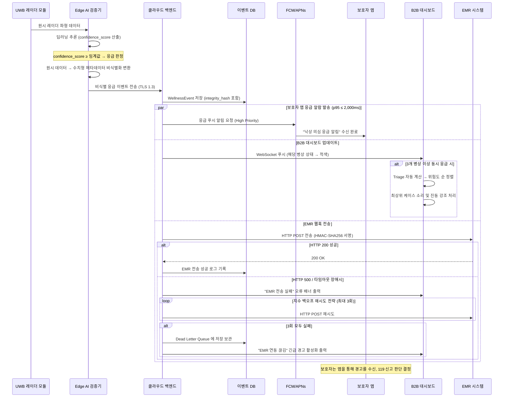

#### 6.3.2 디바이스 오프라인 장애 감지 → PagerDuty 전파 시퀀스

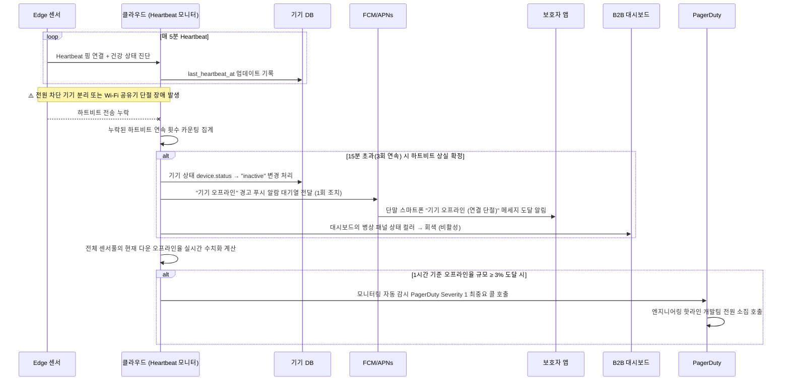

#### 6.3.3 OTA 펌웨어 업데이트 + 오경보 임계값 조절 시퀀스

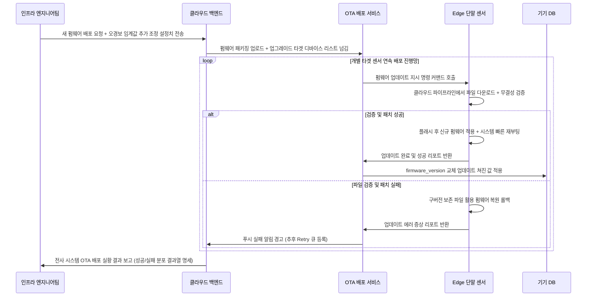

### 6.4 검증 계획 (Validation Plan)

PRD §8.2의 실험 가설/측정 방법/성공 기준을 기반으로 설정한 SRS 검증 계획표.

| 실험 ID | 가설 | 측정 방법 / 프로토콜 | 승인(성공) 기준 | 연관 요구사항 |
| :--- | :--- | :--- | :--- | :--- |
| **EXP-01** | B2B 현장에서의 오경보 제거는 계약 유지 및 만족도를 크게 상승시킬 것이다. | 요양원 5곳(총 150병상)에서 1차 비공개 베타 운영 실시. 4주 동안 `is_false_alarm` 플래그 빈도를 밀착 모니터링. | 기존 모션 센서 대조군 대비 **오경보 수치 97.5% 이상 대폭 감소** 달성. (병상당 월 평점 ≤ 2건 측정). | REQ-FUNC-002, REQ-NF-002 |
| **EXP-02** | B2C 데일리 리포트는 단순히 모니터링 이상의 구독 해지 방지에 절대적인 기여를 한다. | 실제 100–200 가구를 대상으로 한 2차 오픈 베타 가동. Amplitude의 `view_daily_report` 이벤트 4주간 트래킹. | WAU 로그 상 측정 결과 **사용자의 60% 이상이 주 5회 넘게 꾸준히 확인**하는 지표 도달 확인. | REQ-FUNC-016, REQ-NF-015 |
| **EXP-03** | 마찰 제로(Zero-Friction) UX는 노인 사용자 간 물리적인 거부감이나 착용 마찰을 전면 소멸시킨다. | Wave 2 전체 정식 서비스 가입자 분포 대상 실시. CRM 고객지원 티켓 텍스트 대상 '기기 착용, 충전 귀찮음, 거부감' 언어 스캐닝. | 불편, 이물감 관련 해지/이탈 컴플레인 총 티켓 집계수 **순수 0건** 누적. | REQ-FUNC-006, REQ-NF-016 |

---

**— SRS 문서 끝 —**
