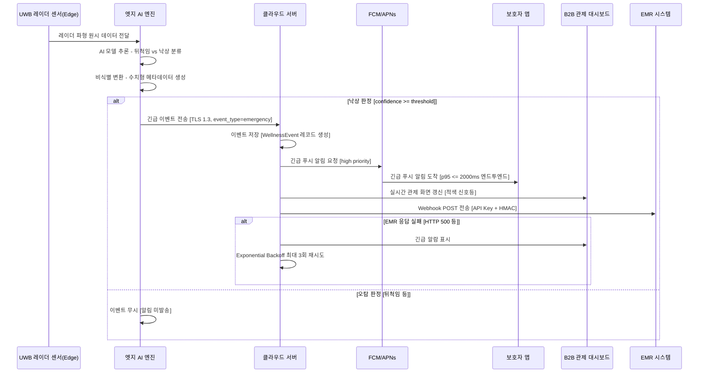
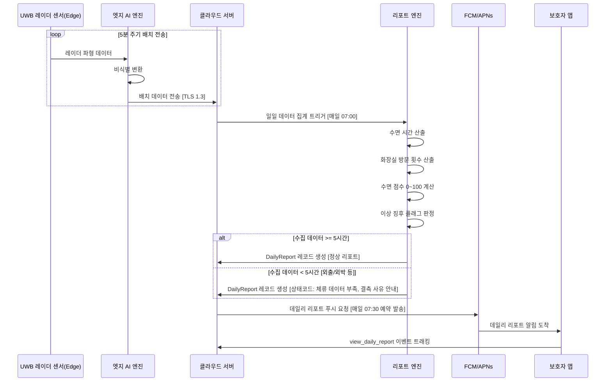
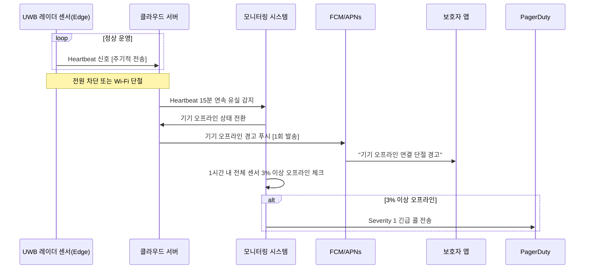
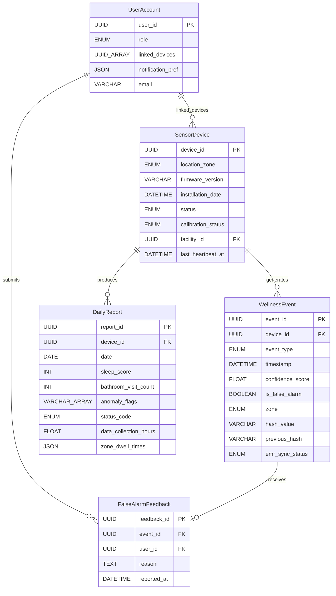
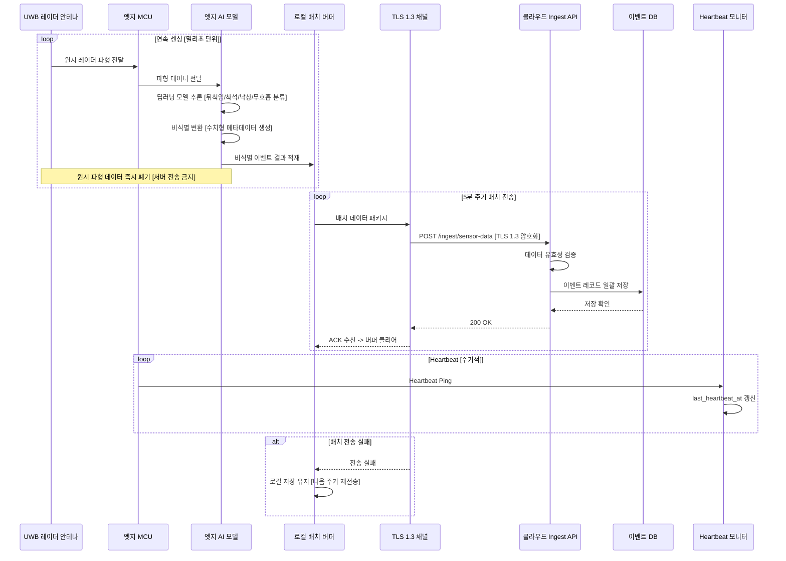
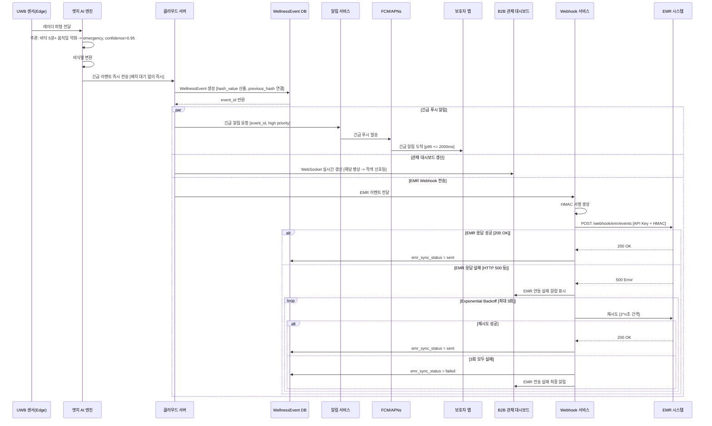
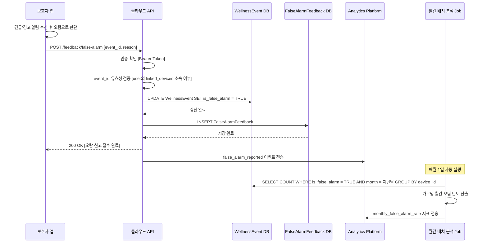
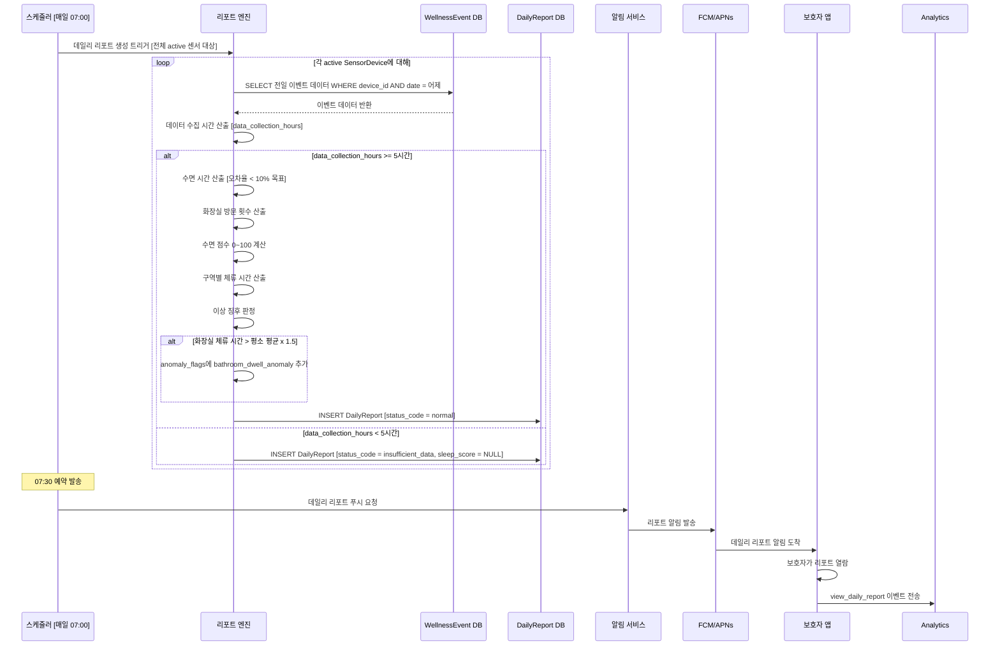
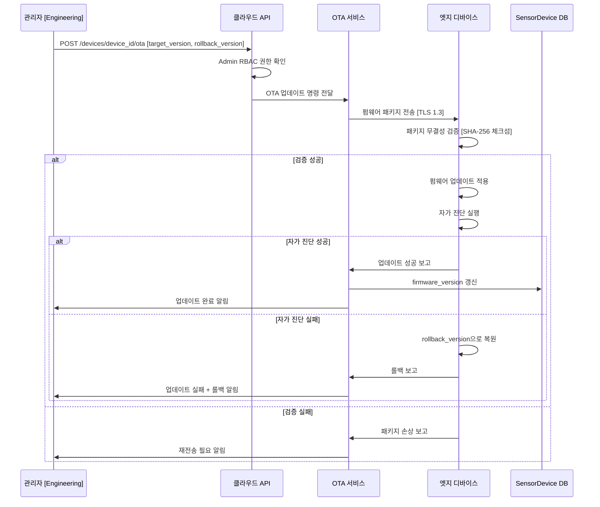

# Software Requirements Specification (SRS)

**Document ID:** SRS-001  
**Revision:** 1.0  
**Date:** 2026-04-15  
**Standard:** ISO/IEC/IEEE 29148:2018  

**Product:** Rooted — 비접촉 AI 앰비언트 홈 안전 솔루션  
**Owner:** Product / Engineering  

---

## 1. Introduction

### 1.1 Purpose

본 문서는 **Rooted** 비접촉 AI 앰비언트 홈 안전 솔루션의 소프트웨어 요구사항 명세서(SRS)로서, ISO/IEC/IEEE 29148:2018 표준에 따라 시스템이 충족해야 하는 기능 요구사항, 비기능 요구사항, 인터페이스 요구사항, 데이터 모델 및 제약사항을 정의한다.

본 SRS가 해결하고자 하는 핵심 문제는 다음과 같다:

| 관점 | 핵심 문제 | 정량적 현황 |
|------|-----------|------------|
| **B2B 요양시설** | 저가 모션 센서의 잦은 오탐으로 인한 알람 피로 → 응급 알림 무시 → 사망 사고 | 하루 평균 오탐 12건; 관내 보급 기기 42%가 5년 초과; 연간 허위 출동 847건 중 189건 기기 오탐 |
| **B2G 지자체** | 고스펙 장비는 단가 초과, 저스펙 장비는 응급 징후 누락 — 비용 대 효용 딜레마 | 한정 예산 내 돌봄 사각지대 해소 불가 |
| **B2C 보호자** | CCTV 프라이버시 침해 거부 + 웨어러블 충전 방치 → 위급 상황 인지 수단 부재 | 오탐 월 2회 이상 반복 시 해지 의향 급등; CJM P4 새벽 오탐이 최대 위기 지점 |

### 1.2 Scope

#### 1.2.1 In-Scope

| ID | 항목 | 설명 | 근거 |
|----|------|------|------|
| IS-01 | UWB 레이더 HW 연동 (비접촉 센서 모듈) | 카메라 없이 레이더 파형으로 동선/호흡/심박/체류 시간 센싱 | PRD §2.2.1 |
| IS-02 | 오탐 제로화 AI 엔진 (딥러닝 엣지 모델) | DOS 전체 1위(3.8점), MVP 최우선 R&D 목표 | PRD §2.2.2 |
| IS-03 | B2C 보호자 앱 | 긴급 알림 수신, 데일리 웰니스 리포트 확인 | PRD §2.2.3 |
| IS-04 | B2B 관제 대시보드 | 신호등 방식(적/황/녹) 직관 UI, 다수 병상 동시 관제 | PRD §2.2.3 |
| IS-05 | EMR Webhook 연동 | 요양시설 EMR 시스템에 이벤트 데이터 자동 전송 | PRD §3.1 기능4 |
| IS-06 | 웰니스 데일리 리포트 생성 엔진 | 야간 수면/화장실 패턴 자동 분석 및 리포트 발행 | PRD §3.1 기능5 |
| IS-07 | 90일 이벤트 로그 클라우드 보존 | 법적 분쟁 대응 데이터 무결성, 해시체인 적용 | PRD §1.8 Q2 |

#### 1.2.2 Out-of-Scope

| ID | 항목 | 배제 근거 |
|----|------|-----------|
| OS-01 | 스마트홈 제어 연동 (조명/가전 제어) | 안전이라는 본질 희석. 아카라라이프 방식 배제 (PRD §2.3 #1) |
| OS-02 | '케어/돌봄' 마케팅 언어 사용 | Non-user 고태식형 ~44~54만 가구의 '노인 낙인' 거부 반응 방지 (PRD §2.3 #2) |
| OS-03 | B2G 최저가 입찰 SLA 스펙 | DOS 2.4 Q4 선택적 투자 주의 영역, 론칭 시점 지연 초래 (PRD §2.3 #3) |

#### 1.2.3 Constraints

| ID | 제약사항 | 유형 | 근거 |
|----|----------|------|------|
| CON-01 | 의료기기법 분류 우회 — 제품 포지셔닝을 '라이프케어 스마트홈 기기(웰니스/안전 확인용)'로 설계. 앱 UI 및 알림에 면책 조항(Disclaimer) 필수 삽입 | 규제 | PRD R-01, §3.2 원칙2 |
| CON-02 | DB/API 필드 네이밍에 'diagnosis', 'medical', 'patient' 단어 사용 전면 금지 | 규제 | PRD NFR-12, §3.2 원칙2 |
| CON-03 | 개인정보보호법 준수 — 엣지단에서 원시 데이터를 비식별 변환 후 전송. 서버에는 식별 불가 메타데이터만 저장 | 규제 | PRD R-02, §3.1 기능3 |
| CON-04 | UWB 칩셋 글로벌 공급 종속 — NXP/Infineon 등 소수 원천 부품사에 대한 HW 종속성. 다중 소싱 전략 적용 필수 | 공급망 | PRD R-03, §1.1.4 |
| CON-05 | SI 전락 방지 — MVP 단계에서 독립형 SaaS 대시보드 우선 공급. 개별 SI 구축 요청 거절. EMR 점유율 1위 벤더와 '표준 플러그인'으로만 연동 제한 | 아키텍처 | PRD R-04, §3.1 기능4 |
| CON-06 | KCC 인증 등 전파 관련 규제 — UWB 레이더 기기의 국내 무선 인증 통과 필요 | 규제 | PRD §3.2 Phase 2 |

#### 1.2.4 Assumptions

| ID | 가정 | 근거 |
|----|------|------|
| ASM-01 | NXP/Infineon UWB 칩셋의 안정적 수급이 글로벌 반도체 공급 대란 없이 지속됨 | PRD §1.1.4 |
| ASM-02 | 초기 침투율 가정(B2C 0.2%, B2B 2.0%, B2G 5.0%)이 유효함 | PRD §1.6 SOM |
| ASM-03 | 1실 1센서 기준으로 침실/화장실 기본 2개 설치 시 주요 생활 구역의 동선을 충분히 커버 가능 | PRD §3.1 기능2 |

### 1.3 Definitions, Acronyms, Abbreviations

| 용어 | 정의 |
|------|------|
| **UWB (Ultra-Wideband)** | 초광대역 무선 기술. 레이더 파형을 이용해 비접촉으로 동선, 호흡, 심박, 체류 시간을 센싱하는 핵심 기반 기술 |
| **Zero-Friction** | 어르신이 기기에 대해 충전, 착용, 버튼 조작 등 어떠한 수동 개입도 필요 없는 완전 비접촉 사용 환경 |
| **오탐 (False Alarm)** | 실제 응급 상황이 아닌데 시스템이 응급으로 잘못 판단하여 발생시킨 알림. 이불 뒤척임, 반려동물 움직임 등이 원인 |
| **Ambient Care** | 카메라/웨어러블 없이 환경에 내장된 센서를 통해 거주자의 건강 상태와 안전을 비침습적으로 모니터링하는 방식 |
| **JTBD (Jobs-to-be-Done)** | 고객이 특정 상황에서 달성하고자 하는 과업(Job)을 중심으로 제품 요구를 도출하는 프레임워크 |
| **AOS (Adjusted Opportunity Score)** | 페르소나 가중치를 반영한 기회 점수. 시장 기회의 크기를 정량적으로 평가 |
| **DOS (Discovered Opportunity Score)** | 인터뷰 기반으로 도출한 기회 점수. 실제 고객 니즈의 강도를 측정 |
| **MoSCoW** | Must / Should / Could / Won't로 요구사항 우선순위를 분류하는 방법론 |
| **EMR (Electronic Medical Record)** | 전자의무기록. 요양시설의 환자 관리 전산 시스템 |
| **CJM (Customer Journey Map)** | 고객 여정 지도. 서비스 이용 전체 단계에서 Pain Point를 식별하는 도구 |
| **Wellness Score** | 수면 품질, 활동 패턴 등을 종합한 일일 건강 상태 점수. '진단(diagnosis)' 용어를 대체 |
| **Activity Alert** | 비정상 활동 패턴 감지 시 발생하는 알림. '의료(medical)' 용어를 대체 |
| **Heartbeat (Ping)** | 엣지 기기가 서버에 주기적으로 전송하는 정상 작동 확인 신호 |
| **OTA (Over-The-Air)** | 무선 네트워크를 통한 펌웨어 원격 업데이트 |
| **Validator** | 요구사항 또는 가설을 검증하는 데 사용되는 실험/측정 기준 |
| **Edge Computing** | 클라우드가 아닌 센서 디바이스 로컬에서 데이터를 처리하는 컴퓨팅 방식. 프라이버시 보호 및 지연 시간 감소 목적 |
| **Exponential Backoff** | 재시도 간격을 지수적으로 증가시키는 오류 복구 전략 |
| **HMAC** | Hash-based Message Authentication Code. API 요청의 무결성과 인증을 보장하는 서명 방식 |
| **RPO (Recovery Point Objective)** | 장애 발생 시 허용 가능한 최대 데이터 손실 시간 |
| **RTO (Recovery Time Objective)** | 장애 발생 후 시스템 복구까지 허용 가능한 최대 시간 |

### 1.4 References

| ID | 문서/자료 | 설명 |
|----|-----------|------|
| REF-01 | PRD_Rooted_V0.2.md | Rooted 비접촉 AI 앰비언트 홈 안전 솔루션 PRD v0.2 — 본 SRS의 유일한 비즈니스/기능 요구 원천 문서 |
| REF-02 | PRD §1.1 — Porter's Five Forces 분석 | 5 Forces 기반 시장 구조 분석 (기존 경쟁 High, 대체재 Very High 등) |
| REF-03 | PRD §1.2 — 5개사 경쟁 구도 | 케어벨, 오파스넷, 아카라라이프, 유메인, 비알랩 경쟁사 분석 |
| REF-04 | PRD §1.4 — Top 5 KSF | 오탐 제로화 AI, 공간 맥락 지표 Moat 등 핵심 성공 요인 |
| REF-05 | PRD §1.6 — TAM-SAM-SOM 시장 규모 | 글로벌 $568억(2025), 국내 SAM 0.99조원, SOM 63.0억원 |
| REF-06 | PRD §1.7 — 페르소나 스펙트럼 및 CJM | 4대 페르소나(Core/Adjacent/Extreme/Non-user) 및 CJM P1~P5 |
| REF-07 | PRD §1.8 — AOS/DOS 사분면 분석 | 12명 전원 Q1 분포, 오탐 제로화(DOS 3.8) 최우선 |
| REF-08 | PRD §1.9 — JTBD 인터뷰 VoC | 최근 사용자, 이탈 경험자, 미사용 탐색자 3개 그룹 인터뷰 결과 |
| REF-09 | PRD §1.10 — VP 종합 테이블 | 3개 Job Statement, Pain/Needs, Outcome, Proof 종합 |
| REF-10 | PRD §2.2 — MVP 핵심 스펙 | HW 센서, AI 엔진, 앱/대시보드 기술 사양 |
| REF-11 | PRD §3.1 — Job-Feature 맵 | 5개 기능의 상세 명세, 리스크, Mitigation |
| REF-12 | PRD §3.2 — 로드맵 원칙 | OTA 업데이트, 웰니스 포지셔닝, 민간 데이터 우선 등 |
| REF-13 | ISO/IEC/IEEE 29148:2018 | Systems and software engineering — Life cycle processes — Requirements engineering |

---

## 2. Stakeholders

PRD §1.7 페르소나 스펙트럼 및 §2.1 4대 페르소나에서 도출한 이해관계자 역할이다.

| ID | 역할 (Role) | 대표 페르소나 | 책임 (Responsibility) | 관심사 (Interest) |
|----|-------------|--------------|----------------------|------------------|
| STK-01 | **B2C 보호자 (Guardian)** | 박지수 (43세, 원격 보호자 자녀) | 서비스 가입, 보호자 앱 통한 일일 모니터링, 긴급 알림 수신 및 대응, 오탐 신고 피드백 제공 | 오탐 없는 긴급 알림(월 ≤ 0.3건), Zero-Friction(어르신 조작 0회), 데일리 웰니스 리포트, 비영상 프라이버시 보호 |
| STK-02 | **B2G 지자체 조달 담당자** | 정민석 (46세, 지자체 공무원) | 응급안전안심서비스 조달/평가, 시범 사업 현장 검증, 관내 장비 교체 예산 편성 | 비용 대비 오탐률 실증 수치, 노후 장비 9만대 교체 레퍼런스, 허위 출동 감소 |
| STK-03 | **B2B 요양시설 관리자 (Facility Admin)** | (야간 관제 담당자) | B2B 관제 대시보드 운용, EMR 연동 설정/관리, 야간 관제 응급 대응, 과거 이벤트 로그 열람 | 오탐 97.5% 감소, EMR 이중 기록 제거, 90일 로그 보존(법적 증거), 야간 관제 효율화 |
| STK-04 | **Extreme 사례 관련자** | 장영희 (63세, 낙상 사망 소송 가족) | (시설 재선택 시) 관제 데이터 투명성 및 로그 보존 여부 평가 | 데이터 공백 없는 관제 기록, 법적 분쟁 시 데이터 무결성 증명, 오탐으로 인한 알람 무시 방지 |
| STK-05 | **Non-user (잠재 전환 대상)** | 고태식 (71세, 은퇴 공무원) | 서비스 거부/수용 결정, 배우자 건강 이상 시 전환 | '감시 장치' 낙인 제거, 비영상·비착용·비조작 방식, 배우자 건강 이상 시 전환율 78% |
| STK-06 | **어르신 (피모니터링 거주자)** | (독거 부모님, 74세 이상) | 일상생활 수행 (별도 조작 불필요) | 기기 인지 불가(Invisible UX), 프라이버시 비침해, Zero-Friction |
| STK-07 | **Product / Engineering 팀** | (내부) | 시스템 설계, 개발, 배포, 운영, AI 모델 학습 및 최적화 | 기술 실현 가능성, OTA 업데이트, 클라우드 비용 통제, 규제 준수 |
| STK-08 | **CS / 운영 팀** | (내부) | 설치 기사 관리, 고객 문의 대응, 오탐 신고 처리, CRM 분석 | 설치 가이드라인 표준화, 어르신 대응 스크립트, CS 티켓 분석 |

---

## 3. System Context and Interfaces

### 3.1 External Systems

| ID | 외부 시스템 | 연동 방식 | 설명 |
|----|------------|-----------|------|
| EXT-01 | **EMR 시스템 (케어포 등)** | HTTP POST Webhook (JSON) | 요양시설 전산망에 센서 이벤트 데이터 자동 전송. API Key + HMAC 서명 인증. Rate limit: 100 req/min/facility |
| EXT-02 | **FCM (Firebase Cloud Messaging)** | HTTPS Push | Android 보호자 앱 긴급 알림 및 데일리 리포트 푸시 발송 |
| EXT-03 | **APNs (Apple Push Notification service)** | HTTPS Push | iOS 보호자 앱 긴급 알림 및 데일리 리포트 푸시 발송 |
| EXT-04 | **PagerDuty** | API Integration | 센서 오프라인 3% 이상 감지 시 엔지니어 팀 Severity 1 긴급 콜 자동 전송 |
| EXT-05 | **Analytics Platform (Amplitude/Mixpanel)** | SDK / Event API | `view_daily_report`, `is_false_alarm` 등 제품 이벤트 트래킹 |

### 3.2 Client Applications

| ID | 클라이언트 | 대상 이용자 | 핵심 기능 |
|----|-----------|-------------|-----------|
| CLI-01 | **B2C 보호자 앱 (Mobile)** | 박지수형 보호자(STK-01) | 긴급 알림 수신, 데일리 웰니스 리포트 열람, 오탐 신고, 알림 설정, 과거 이벤트 로그 열람 |
| CLI-02 | **B2B 관제 대시보드 (Web)** | 요양시설 관리자(STK-03) | 다수 병상 실시간 관제(신호등 UI), EMR 연동 설정, 이벤트 로그 검색/열람, 센서 상태 관리 |
| CLI-03 | **설치 기사용 앱 (Mobile)** | CS/운영 팀(STK-08) | 센서 설치 위치 가이드, 캘리브레이션 실행, 설치 완료 확인 |

### 3.3 API Overview

#### 3.3.1 External APIs

| API ID | 엔드포인트 | 메서드 | 설명 | 인증 | Rate Limit |
|--------|-----------|--------|------|------|------------|
| API-EXT-01 | `/webhook/emr/events` | POST | EMR 시스템에 이벤트 데이터 전송 (event_type, timestamp, confidence_score, zone) | API Key + HMAC | 100 req/min/facility |
| API-EXT-02 | FCM/APNs 서버 | POST | 긴급 알림 (high priority 즉시) 및 데일리 리포트 (매일 07:30 예약) 푸시 발송 | FCM/APNs 인증토큰 | 플랫폼 제한 준수 |

#### 3.3.2 Internal APIs

| API ID | 엔드포인트 | 메서드 | 설명 | 보안 | 주기 |
|--------|-----------|--------|------|------|------|
| API-INT-01 | `/ingest/sensor-data` | POST | 엣지 → 클라우드 비식별 데이터 인제스트. 원시 레이더 파형은 엣지단 처리 후 수치형 결과값만 전송 | TLS 1.3 | 5분 배치 |
| API-INT-02 | `/events/{event_id}` | GET | 개별 이벤트 상세 조회 | Bearer Token + RBAC | On-demand |
| API-INT-03 | `/reports/daily/{device_id}/{date}` | GET | 특정 기기/날짜의 데일리 리포트 조회 | Bearer Token + RBAC | On-demand |
| API-INT-04 | `/logs/archive` | GET | 90일 이벤트 로그 아카이브 열람. 보호자/관리자 권한 기반 | Bearer Token + RBAC | On-demand |
| API-INT-05 | `/devices/{device_id}/status` | GET | 센서 디바이스 상태 조회 (active/inactive/maintenance) | Bearer Token | On-demand |
| API-INT-06 | `/devices/{device_id}/ota` | POST | OTA 펌웨어 업데이트 명령 전송 | Bearer Token + Admin RBAC | On-demand |
| API-INT-07 | `/alerts/push` | POST | 긴급/경고 푸시 알림 생성 및 FCM/APNs 발송 트리거 | Internal Service Auth | Event-driven |
| API-INT-08 | `/feedback/false-alarm` | POST | 보호자의 오탐 신고 피드백 접수 | Bearer Token | On-demand |

### 3.4 Interaction Sequences (핵심 시퀀스 다이어그램)

#### 3.4.1 핵심 흐름 1: 낙상 감지 → 긴급 알림 발송

#### 3.4.2 핵심 흐름 2: 데일리 웰니스 리포트 생성 및 발송

#### 3.4.3 핵심 흐름 3: 기기 오프라인 감지 및 경고

---

## 4. Specific Requirements

### 4.1 Functional Requirements

모든 기능 요구사항은 PRD의 User Story(§3)와 Feature(§4)를 원천(Source)으로 하여 atomic requirement 단위로 분해하였다.

---

#### 4.1.1 FR-01: 오탐 제로화 AI 필터링 엔진 (Source: Story 1, Story 3)

| 속성 | 값 |
|------|-----|
| **Priority** | Must |
| **DOS Score** | 3.8 |
| **Source Stories** | Story 1 (AC-1.1, AC-1.4), Story 3 (AC-3.1) |

| Req ID | 요구사항 | Acceptance Criteria | Source |
|--------|----------|-------------------|--------|
| **REQ-FUNC-001** | 시스템은 UWB 레이더 파형 데이터를 입력으로 받아 딥러닝 모델을 통해 이벤트를 '뒤척임/착석(비응급)'과 '낙상/무호흡(응급)'으로 분류해야 한다. | **Given** 센서가 정상 작동 중이고 UWB 레이더 파형 데이터가 수신될 때 **When** AI 모델이 파형 데이터에 대한 추론을 수행하면 **Then** 이벤트를 emergency / activity_alert / wellness_score 중 하나로 분류하고, 해당 분류에 대한 confidence_score(0~1)를 함께 산출해야 한다. | Story 1, PRD FR-01, §2.2.2 |
| **REQ-FUNC-002** | 시스템은 이불 뒤척임, 착석, 기상 등 일상 동작을 오탐으로 분류하지 않아야 하며, 월간 오탐 빈도를 가구당 0.3건 이하로 유지해야 한다. | **Given** 센서가 정상 작동 중일 때 **When** 어르신이 이불을 뒤척이거나 착석/기상 등 일상 동작을 수행하면 **Then** 해당 동작에 대해 응급(emergency) 알림이 발생하지 않으며, 월간 오탐 빈도가 가구당 0.3건 이하이다. | AC-1.1, §1.9, §2.2.2 |
| **REQ-FUNC-003** | 시스템은 반려동물(10kg 이하)의 움직임을 사람과 구분하여 응급 알림을 발생시키지 않아야 하며, 구분 정확도 99% 이상을 보장해야 한다. | **Given** 실내 센서 반경 내에 반려동물(10kg 이하)이 돌아다닐 때 **When** 센서가 움직임을 감지하면 **Then** 체형 및 생체 신호 패턴 기반으로 사람과 구분하여 응급(낙상) 알림이 발생하지 않아야 한다 (구분 정확도 >= 99%). | AC-1.4, §1.9 |
| **REQ-FUNC-004** | 시스템은 바닥에 5분 이상 움직임 약화 패턴이 감지되면 낙상으로 판정하여 긴급 이벤트를 생성해야 한다. | **Given** 실제 낙상이 발생하여 바닥에 5분 이상 움직임 약화 패턴이 감지될 때 **When** AI 모델이 해당 패턴을 분석하면 **Then** event_type=emergency인 WellnessEvent가 생성되고 긴급 알림 프로세스가 시작되어야 한다. | AC-1.3, §3.1 기능1 |
| **REQ-FUNC-005** | 시스템은 낙상 판정 후 보호자 앱으로 긴급 푸시 알림을 60초 이내에 발송해야 한다. | **Given** AI 모델이 낙상(emergency)으로 판정한 경우 **When** 긴급 이벤트가 클라우드에 수신되면 **Then** FCM/APNs를 통해 보호자 앱으로 긴급 푸시 알림이 60초 이내에 발송되어야 한다. | AC-1.3, §3.1 기능1 |

---

#### 4.1.2 FR-02: Zero-Friction 비접촉 센서 모듈 (Source: Story 1)

| 속성 | 값 |
|------|-----|
| **Priority** | Must |
| **DOS Score** | 3.6 |
| **Source Stories** | Story 1 (AC-1.2, AC-1.5) |

| Req ID | 요구사항 | Acceptance Criteria | Source |
|--------|----------|-------------------|--------|
| **REQ-FUNC-006** | 센서 모듈은 벽/천장 부착형으로 설치되며, 설치 완료 후 어르신의 수동 조작(충전, 착용, 버튼 조작) 횟수가 0회여야 한다. | **Given** 센서 설치가 완료된 후 **When** 어르신이 일상생활을 수행할 때 **Then** 기기에 대한 수동 조작(충전, 착용, 버튼 등) 횟수가 0회이다. | AC-1.2, §1.9 이탈 경험 |
| **REQ-FUNC-007** | 시스템은 센서 설치 시 자동 캘리브레이션을 수행하여, 기사용 앱에서 설치 위치 적합성을 확인하고 오차를 최소화해야 한다. | **Given** 설치 기사가 기사용 앱을 통해 센서 설치를 수행할 때 **When** 센서가 지정된 위치(침실 천장 또는 화장실 문 상단)에 부착되면 **Then** 자동 캘리브레이션이 실행되고, calibration_status가 'calibrated'로 전환되며, 기사용 앱에 설치 완료 확인이 표시되어야 한다. | §3.1 기능2 Mitigation, NFR-11 |
| **REQ-FUNC-008** | 엣지 기기의 전원이 차단되거나 Wi-Fi 연결이 단절되어 15분 이상 Heartbeat 신호가 연속 유실되면, 클라우드 서버에서 보호자/관리자 앱으로 '기기 오프라인(연결 단절) 경고' 푸시 알림을 1회 발송해야 한다. | **Given** 설치된 엣지 기기의 전원이 물리적으로 차단되거나 Wi-Fi 연결이 단절될 때 **When** 15분 이상 서버 측 Heartbeat 신호가 연속 유실되면 **Then** 클라우드 서버에서 보호자/관리자 앱으로 '기기 오프라인(연결 단절) 경고' 푸시 알림을 1회 발송한다. | AC-1.5 |

---

#### 4.1.3 FR-03: 비영상 프라이버시 보호 동선 추적 (Source: Story 1, Story 2)

| 속성 | 값 |
|------|-----|
| **Priority** | Must |
| **DOS Score** | 3.0 |
| **Source Stories** | Story 1, Story 2 |

| Req ID | 요구사항 | Acceptance Criteria | Source |
|--------|----------|-------------------|--------|
| **REQ-FUNC-009** | 시스템은 카메라 없이 UWB 레이더 기반으로 실내 동선(화장실 체류 시간, 야간 동선 패턴 등)을 추적해야 하며, 영상 데이터를 일체 생성하지 않아야 한다. | **Given** UWB 레이더 센서가 설치된 환경에서 **When** 어르신이 실내에서 이동할 때 **Then** 카메라/영상 없이 레이더 파형 기반으로 구역별 체류 시간, 이동 경로를 추적하며, 시스템 전체에서 영상 데이터가 생성/저장/전송되지 않아야 한다. | §3.1 기능3, §1.10 |
| **REQ-FUNC-010** | 엣지 디바이스는 원시 레이더 파형 데이터를 로컬에서 처리한 후, 이진수/수치적 결과값(비식별 메타데이터)만 클라우드 서버로 전송해야 한다. 원시 감지 데이터의 서버 직접 전송은 전면 금지한다. | **Given** 센서가 레이더 파형 원시 데이터를 수집할 때 **When** 엣지 디바이스에서 데이터 처리가 완료되면 **Then** 원시 파형 데이터는 엣지단에서 폐기되고, 비식별 처리된 수치형 메타데이터만 TLS 1.3 암호화를 통해 서버로 전송되어야 한다. | §3.1 기능3 Mitigation, NFR-06 |
| **REQ-FUNC-011** | 시스템은 구역별(침실/화장실/거실) 체류 시간을 산출하여 공간 맥락 지표(Spatial Context Metrics)를 생성해야 한다. | **Given** UWB 레이더 센서가 정상 작동 중이고 어르신이 실내에 체류할 때 **When** 각 구역(bedroom/bathroom/living_room) 간 이동이 발생하면 **Then** 구역별 체류 시간이 분 단위로 기록되어, DailyReport의 입력 데이터로 활용 가능해야 한다. | §1.4 KSF #2, §3.1 기능3 |

---

#### 4.1.4 FR-04: B2B 관제 대시보드 + EMR Webhook (Source: Story 3)

| 속성 | 값 |
|------|-----|
| **Priority** | Must |
| **DOS Score** | 3.4 |
| **Source Stories** | Story 3 (AC-3.1, AC-3.2, AC-3.3, AC-3.4) |

| Req ID | 요구사항 | Acceptance Criteria | Source |
|--------|----------|-------------------|--------|
| **REQ-FUNC-012** | B2B 관제 대시보드는 다수 병상의 실시간 상태를 신호등 방식(적색=응급, 황색=경고, 녹색=정상)으로 동시 표시해야 한다. | **Given** B2B 관제 대시보드가 가동 중일 때 **When** 각 병상(센서)의 이벤트 상태가 변경되면 **Then** 해당 병상의 상태 표시등이 즉시 적색(emergency)/황색(activity_alert)/녹색(정상)으로 갱신되어야 한다. | §2.2.3, §3.1 기능4 |
| **REQ-FUNC-013** | 관제 대시보드는 오탐 알림을 기존 하루 평균 12건에서 월 0.3건 이하로 감소시킨 상태에서 야간 관제를 운영해야 한다. | **Given** B2B 관제 대시보드가 가동 중일 때 **When** 당직 근무 시간 동안 **Then** 오탐 알림이 기존 하루 평균 12건에서 월 0.3건 이하로 감소한다 (97.5% 감소). | AC-3.1, §1.9, §2.2.2 |
| **REQ-FUNC-014** | 시스템은 센서 이벤트(응급/경고/정상) 발생 시 EMR Webhook을 통해 이벤트 데이터를 시설의 전산망(EMR)에 자동 기록해야 하며, 이중 수기 입력을 완전히 제거해야 한다. | **Given** EMR Webhook 연동이 활성화된 상태에서 **When** 센서 이벤트(응급/경고/정상)가 발생하면 **Then** 이벤트 데이터(event_type, timestamp, confidence_score, zone)가 EMR에 HTTP POST로 자동 기록되어, 이중 수기 입력이 0건이 된다. | AC-3.2, §3.1 기능4 |
| **REQ-FUNC-015** | EMR Webhook 전송 시 API Key + HMAC 서명으로 인증하고, Rate limit은 시설당 100 req/min을 초과하지 않아야 한다. | **Given** EMR Webhook이 설정된 상태에서 **When** 이벤트 데이터를 EMR에 전송할 때 **Then** 모든 요청은 API Key + HMAC 서명으로 인증되며, 시설당 100 req/min 제한을 초과하지 않아야 한다. | §6.2 EMR Webhook |
| **REQ-FUNC-016** | EMR 서버 응답 실패(HTTP 500 등) 시, 시스템은 자체 대시보드에 즉시 긴급 알람을 표시하고, EMR 전송은 Exponential Backoff 방식으로 최대 3회 재시도해야 한다. | **Given** 시설 외부 EMR 서버가 다운되거나 응답 실패(HTTP 500 등)가 발생할 때 **When** 센서 이벤트 발생 후 Webhook 전송을 시도하면 **Then** 자체 대시보드 화면에 즉시 긴급 알람을 띄우고, EMR 전송은 Exponential Backoff 방식으로 최대 3회 재시도하여 데이터 누실을 방지한다. | AC-3.4, §3.1 기능4 |
| **REQ-FUNC-017** | 시스템은 90일간의 이벤트 로그를 클라우드에 보존하고, 관리자가 과거 이벤트 로그를 조회할 수 있어야 하며, 법적 분쟁 시 데이터 무결성을 해시체인으로 증명할 수 있어야 한다. | **Given** 사고 발생 후 데이터 열람 요청 시 **When** 관리자가 과거 이벤트 로그를 조회할 때 **Then** 90일간의 이벤트 로그가 클라우드에 보존되어 열람 가능하며, 각 로그는 해시체인이 적용되어 무결성을 검증할 수 있어야 한다. | AC-3.3, §1.8 Q2, NFR-10 |
| **REQ-FUNC-018** | MVP 단계에서 EMR 연동은 점유율 1위 벤더(케어포 등)와 '표준 플러그인' 형태로만 제한하며, 개별 SI 구축 요청은 거절해야 한다. | **Given** B2B 고객이 EMR 연동을 요청할 때 **When** 커스텀 SI 구축이 아닌 표준 플러그인 방식인 경우 **Then** 케어포 등 점유율 1위 EMR 벤더와의 표준 플러그인 형태로만 연동을 제공하며, 개별 SI 구축 요청은 시스템적으로 지원하지 않는다. | CON-05, PRD R-04 |

---

#### 4.1.5 FR-05: 웰니스 데일리 리포트 — B2C (Source: Story 2)

| 속성 | 값 |
|------|-----|
| **Priority** | Should |
| **DOS Score** | 2.85 |
| **Source Stories** | Story 2 (AC-2.1, AC-2.2, AC-2.3, AC-2.4) |

| Req ID | 요구사항 | Acceptance Criteria | Source |
|--------|----------|-------------------|--------|
| **REQ-FUNC-019** | 시스템은 매일 07:00에 전일 데이터를 자동 집계하여 DailyReport를 생성하고, 야간 수면시간과 화장실 방문 횟수의 오차율을 10% 미만으로 산출해야 한다. | **Given** 센서가 24시간 가동 중일 때 **When** 하루가 종료되어 데일리 리포트 생성 시(07:00) **Then** 야간 수면시간과 화장실 방문 횟수의 오차율이 10% 미만으로 산출되어야 한다. | AC-2.1, §1.9 |
| **REQ-FUNC-020** | 화장실 체류 시간이 평소 평균 대비 설정 임계치(+50%) 초과 시, 보호자 앱으로 1일 1회 사전 경고 리포트를 발송해야 한다. | **Given** 데일리 패턴 분석 결과 이상 징후가 감지될 때 **When** 화장실 체류 시간이 평소 평균 대비 설정 임계치(+50%) 초과하면 **Then** 보호자 앱으로 1일 1회 사전 경고 리포트가 발송되어야 한다. | AC-2.2, §1.9 Outcome |
| **REQ-FUNC-021** | 데일리 리포트에는 수면 점수(0~100), 화장실 방문 횟수, 구역별 체류 시간, 이상 징후 플래그를 포함해야 한다. | **Given** DailyReport가 정상적으로 생성되었을 때 **When** 보호자가 앱에서 해당 리포트를 열람하면 **Then** 수면 점수(0~100), 화장실 방문 횟수(INT), 구역별 체류 시간, 이상 징후 플래그(anomaly_flags[])가 모두 표시되어야 한다. | §6.1 DailyReport 엔터티 |
| **REQ-FUNC-022** | 어르신이 24시간 동안 센서 인식 반경을 벗어나(외출/외박 등) 의미 있는 데이터가 5시간 미만으로 수집된 경우, 일반 수면 점수 대신 '체류 데이터 부족(수집 5시간 미만)' 상태 코드로 변경하고 결측 사유를 안내하는 리포트를 우선 발행해야 한다. | **Given** 어르신이 24시간 동안 센서 인식 반경을 벗어나 의미 있는 데이터가 수집되지 않았을 때(수집 5시간 미만) **When** 다음 날 아침 데일리 리포트를 자동 생성하는 시점에 **Then** 일반 수면 점수 대신 '체류 데이터 부족(수집 5시간 미만)' 상태 코드로 변경하고 결측(Null) 사유를 안내하는 리포트를 우선 발행한다. | AC-2.4, §1.9 |
| **REQ-FUNC-023** | 데일리 리포트는 매일 07:30에 FCM/APNs를 통해 보호자 앱으로 예약 발송되어야 한다. | **Given** DailyReport가 정상 생성 완료된 상태에서 **When** 매일 07:30이 되면 **Then** FCM/APNs를 통해 보호자 앱으로 데일리 리포트 알림이 예약 발송되어야 한다. | §6.2 FCM/APNs |
| **REQ-FUNC-024** | 보호자 앱은 `view_daily_report` 이벤트를 Analytics Platform에 전송하여, 주간 리포트 확인 빈도를 트래킹해야 한다. | **Given** 보호자가 앱 데일리 리포트를 수신한 후 **When** 리포트 내 수면 점수 및 화장실 이용 내역을 확인할 때 **Then** `view_daily_report` 이벤트가 Analytics Platform(Amplitude/Mixpanel)에 전송되어, 주 5회 이상 확인 습관 형성 여부를 측정할 수 있어야 한다. | AC-2.3, §2.5 |

---

#### 4.1.6 보호자 오탐 피드백 (Source: Story 1, 성공 지표)

| Req ID | 요구사항 | Acceptance Criteria | Source | Priority |
|--------|----------|-------------------|--------|----------|
| **REQ-FUNC-025** | 보호자 앱은 '오탐 신고' 버튼을 제공하여, 보호자가 특정 알림을 오탐으로 신고할 수 있어야 하며, 해당 피드백은 WellnessEvent의 `is_false_alarm` 플래그에 반영되어 월간 배치 분석에 활용되어야 한다. | **Given** 보호자가 긴급/경고 알림을 수신한 후 **When** 해당 알림이 오탐이라고 판단하여 '오탐 신고' 버튼을 누르면 **Then** 해당 WellnessEvent의 `is_false_alarm`이 TRUE로 갱신되고, 피드백 로그가 저장되어 월간 배치 분석에 활용 가능해야 한다. | §1.3 북극성 지표 측정 경로 | Must |

---

### 4.2 Non-Functional Requirements

PRD §5, §1.3 성공 지표, §3.1 리스크 방어 전략으로부터 도출한 비기능 요구사항이다.

#### 4.2.1 성능 (Performance)

| Req ID | 카테고리 | 요구사항 | 목표/임계치 | 측정 방법 | Source |
|--------|---------|----------|------------|-----------|--------|
| **REQ-NF-001** | 응답 지연 | 낙상 감지 후 알림 전송 엔드투엔드 지연 시간 | **p95 <= 2,000ms** (센서 최초 감지 시점 ~ 보호자/관제 앱 푸시 도착 시점) | APM 도구를 통한 엔드투엔드 지연 시간 분포 모니터링 | PRD NFR-01, §3.1 기능1 |
| **REQ-NF-002** | 정확도 | 오탐 제로화 알고리즘 월간 오탐 빈도 | **<= 0.3건/월/가구** | 센서 DB의 `is_false_alarm` 플래그 누적 카운트 + 보호자 앱 '오탐 신고' 피드백 로그 월간 배치 분석 | PRD NFR-02, §1.3 북극성 지표 |
| **REQ-NF-003** | 정확도 | 야간 수면/화장실 패턴 리포트 오차율 | **< 10%** | 수동 관측 대조군 대비 리포트 산출값 편차 측정 (베타 기간) | PRD NFR-03, §1.9 |
| **REQ-NF-004** | 정확도 | 반려동물(10kg 이하) 구분 정확도 | **>= 99%** | 반려동물 동거 가구 테스트 환경에서 오판정 빈도 측정 | AC-1.4 |
| **REQ-NF-005** | Throughput | EMR Webhook 처리량 | **<= 100 req/min/facility** | 시설별 Webhook 요청 카운터 모니터링 | PRD §6.2 |

#### 4.2.2 가용성 및 신뢰성 (Availability & Reliability)

| Req ID | 카테고리 | 요구사항 | 목표/임계치 | 측정 방법 | Source |
|--------|---------|----------|------------|-----------|--------|
| **REQ-NF-006** | SLA | 클라우드 플랫폼 월간 가용성 | **>= 99.9%** (월 누적 허용 다운타임 <= 43.8분) | Datadog Uptime 모니터 | PRD NFR-04 |
| **REQ-NF-007** | 데이터 무결성 | 센서 데이터 통신 오류율 및 유실율 | **<= 0.1%** | 패킷 재전송 프로토콜 기반 전송 성공률 모니터링 | PRD NFR-05 |
| **REQ-NF-008** | RPO | 장애 발생 시 허용 최대 데이터 손실 시간 | **<= 5분** (5분 배치 전송 주기 기준) | 장애 복구 시뮬레이션 테스트 | 도출 |
| **REQ-NF-009** | RTO | 장애 발생 후 시스템 복구 시간 | **<= 30분** | 장애 복구 드릴 시간 측정 | 도출 |

#### 4.2.3 보안 (Security)

| Req ID | 카테고리 | 요구사항 | 목표/임계치 | 측정 방법 | Source |
|--------|---------|----------|------------|-----------|--------|
| **REQ-NF-010** | 데이터 보호 | 엣지단 데이터 비식별 처리 — 원시 감지 데이터의 서버 직접 전송 전면 금지 | 서버에서는 TLS 1.3 기반 수치형 메타데이터만 수신/보관 | 코드 리뷰 + 네트워크 트래픽 검증 | PRD NFR-06 |
| **REQ-NF-011** | 규제 준수 | 개인정보보호법 준수 — B2B 다자 동의서 템플릿 제공, 서버에는 식별 불가 메타데이터만 저장 | 동의서 템플릿 완비, 식별 데이터 서버 미저장 검증 | 개인정보 영향 평가(PIA) 수행 | PRD NFR-07 |
| **REQ-NF-012** | 인증/인가 | RBAC(Role-Based Access Control) 기반 권한 관리 — guardian, facility_admin 역할별 접근 권한 분리 | 역할별 API 접근 권한 매트릭스 100% 적용 | 침투 테스트 및 권한 에스컬레이션 검증 | 도출 |
| **REQ-NF-013** | 감사 로그 | 모든 관리자 조작 및 데이터 열람 이력 감사 로그 기록 | 모든 관리 API 호출에 대해 감사 로그 생성 100% | 감사 로그 누락률 모니터링 | 도출 |

#### 4.2.4 비용 (Cost)

| Req ID | 카테고리 | 요구사항 | 목표/임계치 | 측정 방법 | Source |
|--------|---------|----------|------------|-----------|--------|
| **REQ-NF-014** | 인프라 비용 | 클라우드 인프라 아키텍처 가구당 월 비용 | **<= 500원/가구/월** | AWS Cost Explorer 가구당 단가 산출 | PRD NFR-08, §1.1.4 |

#### 4.2.5 데이터 보존 (Data Retention)

| Req ID | 카테고리 | 요구사항 | 목표/임계치 | 측정 방법 | Source |
|--------|---------|----------|------------|-----------|--------|
| **REQ-NF-015** | 로그 보존 | 관제 이벤트 로그 90일 클라우드 이중화 보존 후 별도 아카이빙 | 90일 이내 로그 즉시 조회 가능, 90일 초과 로그 아카이브 스토리지 이관 | 로그 보존 기간 검증 + 아카이브 복원 테스트 | PRD NFR-10 |
| **REQ-NF-016** | 데이터 무결성 | 법적 분쟁 지원을 위한 이벤트 로그 해싱(Hashing) 적용 | 모든 이벤트 로그에 해시체인 적용, 변조 불가 검증 | 해시체인 무결성 검증 자동화 테스트 | PRD NFR-10 |

#### 4.2.6 모니터링 및 운영 (Monitoring & Operations)

| Req ID | 카테고리 | 요구사항 | 목표/임계치 | 측정 방법 | Source |
|--------|---------|----------|------------|-----------|--------|
| **REQ-NF-017** | OTA | 펌웨어 원격 업데이트(OTA) 지원 — 오탐 임계치 즉각 원격 조정 가능 | 펌웨어 업데이트 성공률 >= 99%, 배포 후 24시간 내 전체 적용 | OTA 배포 성공률 및 적용률 대시보드 | PRD NFR-09 |
| **REQ-NF-018** | Alerting | 1시간 이내 전체 가동 센서 중 3% 이상 오프라인 감지 시 PagerDuty Severity 1 긴급 콜 자동 전송 | 감지 후 5분 이내 PagerDuty 콜 발송 | PagerDuty 인시던트 로그 | PRD NFR-13 |

#### 4.2.7 확장성 (Scalability)

| Req ID | 카테고리 | 요구사항 | 목표/임계치 | 측정 방법 | Source |
|--------|---------|----------|------------|-----------|--------|
| **REQ-NF-019** | 수평 확장 | 시스템은 Wave 1(5~10개 시설, 150병상) → Wave 2(100~200 B2C 가구) 규모로 수평 확장이 가능해야 한다 | Wave 2 피크 부하 시에도 REQ-NF-001(p95 <= 2,000ms) 및 REQ-NF-006(가용성 99.9%) 유지 | 부하 테스트(Load Test) — Wave 2 예상 트래픽 2배 기준 | PRD §8.1 |

#### 4.2.8 유지보수성 (Maintainability)

| Req ID | 카테고리 | 요구사항 | 목표/임계치 | 측정 방법 | Source |
|--------|---------|----------|------------|-----------|--------|
| **REQ-NF-020** | 네이밍 규칙 | DB/API 필드 네이밍에 'diagnosis', 'medical', 'patient' 단어 사용 금지. 'wellness_score', 'activity_alert' 등으로 통일 | 금지 단어 사용 건수 0건 | 코드 정적 분석(Linting) 규칙 적용 | PRD NFR-12, §3.2 원칙2 |
| **REQ-NF-021** | 설치 표준 | 1실 1센서 설치 가이드라인 — 침실 천장 1개 + 화장실 문 상단 1개 기본 패키지. 기사용 앱으로 설치 위치 오차 최소화 | 설치 기사 가이드라인 준수율 100% | 설치 완료 보고서 내 위치 데이터 검증 | PRD NFR-11 |

#### 4.2.9 KPI 기반 비기능 요구사항 (성공 지표)

| Req ID | 카테고리 | 요구사항 | 목표/임계치 | 측정 방법 | Source |
|--------|---------|----------|------------|-----------|--------|
| **REQ-NF-022** | 북극성 지표 | 월간 오탐 빈도 | **<= 2회/가구** | 센서 DB `is_false_alarm` 플래그 누적 카운트 + 보호자 앱 '오탐 신고' 피드백 로그 월간 배치 분석 | PRD §1.3 |
| **REQ-NF-023** | 보조 KPI 1 | 앱 데일리 리포트 주간 확인 빈도 | **>= 5회/주** (WAU 기준 60% 이상 유저) | Analytics `view_daily_report` 이벤트 발생 유저 비율(WAU) 트래킹 | PRD §1.3 |
| **REQ-NF-024** | 보조 KPI 2 | 어르신 사용자 불만/기기 조작에 의한 이탈율 | **0건** | 고객센터/CRM 환불/해지 CS 티켓 사유 내 '설치 거부감/불편함' 태깅 누적 집계 | PRD §1.3 |

---

## 5. Traceability Matrix

### 5.1 Story - Requirement ID - Test Case ID

| Story | AC ID | Req ID | Test Case ID | Priority |
|-------|-------|--------|--------------|----------|
| Story 1 (안심/지속성) | AC-1.1 | REQ-FUNC-002 | TC-FUNC-002 | Must |
| Story 1 | AC-1.2 | REQ-FUNC-006 | TC-FUNC-006 | Must |
| Story 1 | AC-1.3 | REQ-FUNC-004, REQ-FUNC-005 | TC-FUNC-004, TC-FUNC-005 | Must |
| Story 1 | AC-1.4 | REQ-FUNC-003 | TC-FUNC-003 | Must |
| Story 1 | AC-1.5 | REQ-FUNC-008 | TC-FUNC-008 | Must |
| Story 2 (데이터 예방) | AC-2.1 | REQ-FUNC-019 | TC-FUNC-019 | Should |
| Story 2 | AC-2.2 | REQ-FUNC-020 | TC-FUNC-020 | Should |
| Story 2 | AC-2.3 | REQ-FUNC-024 | TC-FUNC-024 | Should |
| Story 2 | AC-2.4 | REQ-FUNC-022 | TC-FUNC-022 | Should |
| Story 3 (운영 효율 B2B) | AC-3.1 | REQ-FUNC-013 | TC-FUNC-013 | Must |
| Story 3 | AC-3.2 | REQ-FUNC-014 | TC-FUNC-014 | Must |
| Story 3 | AC-3.3 | REQ-FUNC-017 | TC-FUNC-017 | Must |
| Story 3 | AC-3.4 | REQ-FUNC-016 | TC-FUNC-016 | Must |

### 5.2 Feature - Requirement ID Map

| PRD Feature | REQ-FUNC IDs | REQ-NF IDs |
|-------------|-------------|------------|
| FR-01 (오탐 제로화 AI) | REQ-FUNC-001 ~ 005, REQ-FUNC-025 | REQ-NF-001, REQ-NF-002, REQ-NF-004, REQ-NF-022 |
| FR-02 (Zero-Friction 센서) | REQ-FUNC-006 ~ 008 | REQ-NF-017, REQ-NF-018, REQ-NF-021, REQ-NF-024 |
| FR-03 (비영상 프라이버시) | REQ-FUNC-009 ~ 011 | REQ-NF-003, REQ-NF-010, REQ-NF-011, REQ-NF-020 |
| FR-04 (B2B 대시보드 + EMR) | REQ-FUNC-012 ~ 018 | REQ-NF-005, REQ-NF-006, REQ-NF-007, REQ-NF-012, REQ-NF-013, REQ-NF-015, REQ-NF-016 |
| FR-05 (웰니스 데일리 리포트) | REQ-FUNC-019 ~ 024 | REQ-NF-003, REQ-NF-014, REQ-NF-023 |

### 5.3 Risk - Constraint/Requirement Map

| PRD Risk ID | SRS Constraint ID | 관련 REQ IDs |
|-------------|-------------------|-------------|
| R-01 (의료기기법) | CON-01, CON-02 | REQ-NF-020 |
| R-02 (개인정보보호법) | CON-03 | REQ-FUNC-010, REQ-NF-010, REQ-NF-011 |
| R-03 (UWB 칩셋 공급) | CON-04 | ASM-01 |
| R-04 (SI 전락) | CON-05 | REQ-FUNC-018 |
| R-05 (웨어러블 대체재 위협) | — | REQ-FUNC-009, REQ-FUNC-011 |

---

## 6. Appendix

### 6.1 API Endpoint List

#### 6.1.1 External APIs

| # | API ID | HTTP Method | Endpoint | 인증 | Rate Limit | 설명 |
|---|--------|-------------|----------|------|------------|------|
| 1 | API-EXT-01 | POST | `/webhook/emr/events` | API Key + HMAC 서명 | 100 req/min/facility | EMR 시스템에 이벤트 데이터 자동 전송. Payload: `{event_type, timestamp, confidence_score, zone, device_id}` |
| 2 | API-EXT-02 | POST | FCM / APNs 서버 | FCM/APNs 인증토큰 | 플랫폼 제한 준수 | 긴급 알림(high priority, 즉시) + 데일리 리포트(매일 07:30 예약) 푸시 발송 |

#### 6.1.2 Internal APIs

| # | API ID | HTTP Method | Endpoint | 인증 | 주기/트리거 | 설명 |
|---|--------|-------------|----------|------|-----------|------|
| 1 | API-INT-01 | POST | `/ingest/sensor-data` | TLS 1.3 (Mutual TLS) | 5분 배치 | 엣지 → 클라우드 비식별 데이터 인제스트. 원시 파형은 엣지단 처리 후 수치형 결과값만 전송 |
| 2 | API-INT-02 | GET | `/events/{event_id}` | Bearer Token + RBAC | On-demand | 개별 WellnessEvent 상세 조회. guardian은 linked_devices 범위, facility_admin은 시설 내 전체 |
| 3 | API-INT-03 | GET | `/reports/daily/{device_id}/{date}` | Bearer Token + RBAC | On-demand | 특정 기기/날짜의 DailyReport 조회 |
| 4 | API-INT-04 | GET | `/logs/archive` | Bearer Token + RBAC | On-demand | 90일 이벤트 로그 아카이브 열람. Query params: start_date, end_date, device_id. 해시체인 무결성 검증 포함 |
| 5 | API-INT-05 | GET | `/devices/{device_id}/status` | Bearer Token | On-demand | 센서 디바이스 상태(active/inactive/maintenance), 펌웨어 버전, 캘리브레이션 상태 조회 |
| 6 | API-INT-06 | POST | `/devices/{device_id}/ota` | Bearer Token + Admin RBAC | On-demand | OTA 펌웨어 업데이트 명령 전송. Payload: `{target_version, rollback_version}` |
| 7 | API-INT-07 | POST | `/alerts/push` | Internal Service Auth | Event-driven | 긴급/경고 푸시 알림 생성 및 FCM/APNs 발송 트리거. Payload: `{user_id, alert_type, event_id, priority}` |
| 8 | API-INT-08 | POST | `/feedback/false-alarm` | Bearer Token | On-demand | 보호자의 오탐 신고 접수. Payload: `{event_id, reason}`. WellnessEvent.is_false_alarm 갱신 |

### 6.2 Entity & Data Model

#### 6.2.1 SensorDevice (센서 디바이스)

> 필드 네이밍에 'diagnosis', 'medical', 'patient' 사용 금지 (CON-02, REQ-NF-020)

| # | 필드명 | 데이터 타입 | 제약조건 | 설명 |
|---|--------|-----------|---------|------|
| 1 | `device_id` | UUID | PK, NOT NULL | 센서 고유 식별자 |
| 2 | `location_zone` | ENUM | NOT NULL, IN(bedroom, bathroom, living_room) | 설치 구역 |
| 3 | `firmware_version` | VARCHAR(20) | NOT NULL | 현재 펌웨어 버전 (OTA 업데이트 추적) |
| 4 | `installation_date` | DATETIME | NOT NULL | 설치 일자 |
| 5 | `status` | ENUM | NOT NULL, DEFAULT 'active', IN(active, inactive, maintenance) | 센서 상태 |
| 6 | `calibration_status` | ENUM | NOT NULL, DEFAULT 'pending', IN(calibrated, pending) | 자동 캘리브레이션 상태 |
| 7 | `facility_id` | UUID | FK(Facility), NULLABLE | B2B 시설 연결 (B2C는 NULL) |
| 8 | `last_heartbeat_at` | DATETIME | NULLABLE | 마지막 Heartbeat 수신 시각 |
| 9 | `created_at` | DATETIME | NOT NULL, DEFAULT NOW() | 레코드 생성 시각 |
| 10 | `updated_at` | DATETIME | NOT NULL, DEFAULT NOW() | 레코드 갱신 시각 |

#### 6.2.2 WellnessEvent (웰니스 이벤트)

| # | 필드명 | 데이터 타입 | 제약조건 | 설명 |
|---|--------|-----------|---------|------|
| 1 | `event_id` | UUID | PK, NOT NULL | 이벤트 고유 식별자 |
| 2 | `device_id` | UUID | FK(SensorDevice), NOT NULL | 연관 센서 |
| 3 | `event_type` | ENUM | NOT NULL, IN(activity_alert, wellness_score, emergency) | 이벤트 유형 |
| 4 | `timestamp` | DATETIME | NOT NULL | 이벤트 발생 시각 |
| 5 | `confidence_score` | FLOAT(0~1) | NOT NULL | AI 판단 신뢰도 점수 |
| 6 | `is_false_alarm` | BOOLEAN | NOT NULL, DEFAULT FALSE | 오탐 여부 플래그 (보호자 피드백 기반) |
| 7 | `zone` | ENUM | NOT NULL, IN(bedroom, bathroom, living_room) | 이벤트 발생 구역 |
| 8 | `hash_value` | VARCHAR(64) | NOT NULL | 해시체인용 SHA-256 해시값 (법적 무결성) |
| 9 | `previous_hash` | VARCHAR(64) | NULLABLE | 이전 이벤트의 해시값 (해시체인) |
| 10 | `emr_sync_status` | ENUM | DEFAULT 'not_applicable', IN(not_applicable, pending, sent, failed) | EMR 전송 상태 |
| 11 | `created_at` | DATETIME | NOT NULL, DEFAULT NOW() | 레코드 생성 시각 |

#### 6.2.3 UserAccount (사용자 계정)

| # | 필드명 | 데이터 타입 | 제약조건 | 설명 |
|---|--------|-----------|---------|------|
| 1 | `user_id` | UUID | PK, NOT NULL | 사용자 고유 식별자 |
| 2 | `role` | ENUM | NOT NULL, IN(guardian, facility_admin) | 역할 (보호자 / 시설 관리자) |
| 3 | `linked_devices` | UUID[] | NOT NULL | 연결된 센서 목록 |
| 4 | `notification_pref` | JSON | NOT NULL | 알림 설정 (push, SMS, 시간대 등) |
| 5 | `email` | VARCHAR(255) | UNIQUE, NOT NULL | 이메일 주소 |
| 6 | `created_at` | DATETIME | NOT NULL, DEFAULT NOW() | 계정 생성 시각 |
| 7 | `updated_at` | DATETIME | NOT NULL, DEFAULT NOW() | 계정 갱신 시각 |

#### 6.2.4 DailyReport (데일리 리포트)

| # | 필드명 | 데이터 타입 | 제약조건 | 설명 |
|---|--------|-----------|---------|------|
| 1 | `report_id` | UUID | PK, NOT NULL | 리포트 고유 식별자 |
| 2 | `device_id` | UUID | FK(SensorDevice), NOT NULL | 연관 센서 |
| 3 | `date` | DATE | NOT NULL | 리포트 기준 날짜 |
| 4 | `sleep_score` | INT(0~100) | NULLABLE | 수면 품질 점수 (데이터 부족 시 NULL) |
| 5 | `bathroom_visit_count` | INT | NULLABLE | 화장실 방문 횟수 (데이터 부족 시 NULL) |
| 6 | `anomaly_flags` | VARCHAR[] | DEFAULT '{}' | 이상 징후 플래그 목록 |
| 7 | `status_code` | ENUM | NOT NULL, DEFAULT 'normal', IN(normal, insufficient_data) | 리포트 상태 (normal / insufficient_data: 수집 5시간 미만) |
| 8 | `data_collection_hours` | FLOAT | NOT NULL | 실제 데이터 수집 시간 (시간 단위) |
| 9 | `zone_dwell_times` | JSON | NULLABLE | 구역별 체류 시간 `{bedroom: min, bathroom: min, living_room: min}` |
| 10 | `generated_at` | DATETIME | NOT NULL | 리포트 생성 시각 |

#### 6.2.5 FalseAlarmFeedback (오탐 피드백)

| # | 필드명 | 데이터 타입 | 제약조건 | 설명 |
|---|--------|-----------|---------|------|
| 1 | `feedback_id` | UUID | PK, NOT NULL | 피드백 고유 식별자 |
| 2 | `event_id` | UUID | FK(WellnessEvent), NOT NULL | 오탐 신고 대상 이벤트 |
| 3 | `user_id` | UUID | FK(UserAccount), NOT NULL | 신고한 보호자/관리자 |
| 4 | `reason` | TEXT | NULLABLE | 오탐 신고 사유 |
| 5 | `reported_at` | DATETIME | NOT NULL, DEFAULT NOW() | 신고 시각 |

#### 6.2.6 ER Diagram

### 6.3 Detailed Interaction Models (상세 시퀀스 다이어그램)

#### 6.3.1 상세 흐름 1: 엣지 → 클라우드 5분 배치 데이터 인제스트 전체 과정

#### 6.3.2 상세 흐름 2: 긴급 알림 — 낙상 감지부터 EMR 기록까지 전체 과정

#### 6.3.3 상세 흐름 3: 보호자 오탐 피드백 처리

#### 6.3.4 상세 흐름 4: 데일리 리포트 생성 — 정상/데이터 부족 분기

#### 6.3.5 상세 흐름 5: OTA 펌웨어 업데이트

### 6.4 Validation Plan (검증 계획)

PRD §8의 실험/롤아웃/측정 계획을 SRS 관점에서 정리한 검증 계획이다.

#### 6.4.1 롤아웃 전략

| Wave | 대상 | 규모 | 가격 모델 | 핵심 검증 목적 |
|------|------|------|----------|--------------|
| **Wave 1** (Closed Beta — B2B Lite) | 30병상 이하 중소 요양원 | 5~10곳 (총 150병상) | 설치비 0원 + 월 10만원 Lite 구독 | AI 데이터 대량 수집 + 오탐 제거 검증 |
| **Wave 2** (Open Beta — B2C Niche) | 웨어러블/CCTV 실패 후 원격지 직장인 자녀 | 100~200가구 | 월 30,000원 + 설치비 49,000원 | 데일리 리포트 구독 유지 검증 |

#### 6.4.2 실험 가설 및 성공 기준

| 실험 ID | 가설 | 측정 대상/방식 | 성공 기준 | 관련 REQ |
|---------|------|--------------|----------|----------|
| EXP-01 | B2B 오탐 제거가 계약 유지율/만족도를 향상시킨다 | 1차 클로즈드 베타 요양원 5곳(150병상), `is_false_alarm` 플래그 4주 연속 트래킹 | 구형 대조군 대비 오탐 **97.5% 이상 감소** (월 병상당 2건 이하) | REQ-FUNC-002, REQ-NF-002 |
| EXP-02 | B2C 데일리 리포트가 구독 해지를 방어한다 | 2차 오픈 베타 B2C 100~200가구, `view_daily_report` 조회율 4주 트래킹 | WAU 집계 시 **주 5회 이상 능동 확인 유저 60% 이상** 유지 | REQ-FUNC-024, REQ-NF-023 |
| EXP-03 | Zero-Friction 방식이 고령 사용자 거부감을 소멸시킨다 | Wave 2 전체 B2C 가입자, CRM '기기 착용 거부/반환' CS 티켓 텍스트 분석 | '어르신 조작 불편' 사유 해지/취소 컴플레인 **누적 0건** | REQ-FUNC-006, REQ-NF-024 |

---

*— End of Document —*
