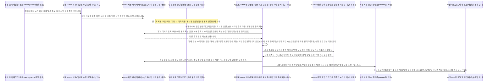

# 소프트웨어 요구사항 명세서 (SRS)

문서 ID: SRS-001  
리비전: 3.0  
날짜: 2026-04-20  
표준: ISO/IEC/IEEE 29148:2018  
기술 스택: Next.js (App Router) + Prisma + Supabase Free + Vercel AI SDK + Vercel Hobby 배포  
개발 방식: 바이브 코딩 (Vibe-Coding, AI 코딩 어시스턴트 기반)

---

### 리비전 이력

| 버전 | 날짜 | 설명 |
| :--- | :--- | :--- |
| 1.0 | 2026-04-18 | PRD v0.3 기반 초기 SRS (AWS 클라우드 아키텍처) |
| 2.0 | 2026-04-19 | 전면적인 MVP 기술 스택 변환 — Next.js App Router, Prisma + Supabase, Vercel AI SDK + Gemini, Vercel 배포. PLAN-SRS-001-MVP에 따라 적용. |
| 3.0 | 2026-04-20 | 바이브 코딩 MVP 최적화 — 무료 티어 인프라 적용, 난이도 조정, 기술적 모순 해결. PLAN-SRS-002-VIBE에 따라 적용. 승인된 4가지 항목: (1) MVP에서 실시간 푸시 제외 → 이메일(Resend Free)로 대체, (2) SLA Best Effort ~99%로 완화, (3) 데이터 보관 90일→30일 축소, (4) EMR 연동 Wave 2로 연기. Route Handler 11개→6개, Prisma 모델 7개→5개 축소, §13–§15 새 섹션 추가. |

---

## 1. 소개

### 1.1 목적

이 SRS는 ISO/IEC/IEEE 29148:2018 표준에 따라 비접촉식 AI 안심 홈 세이프티 솔루션 **루티드(Rooted)**의 MVP(최소 기능 제품) 소프트웨어 시스템에 대한 기능적, 비기능적, 인터페이스 및 데이터 요구사항을 정의합니다.

**개발 환경 (v3.0):**

이 문서는 3개월의 SW 개발 경험을 가진 1인 개발자가 AI 코딩 어시스턴트(예: Cursor, Copilot, Antigravity)를 사용하여 웹 애플리케이션을 구축하는 **바이브 코딩(vibe-coding)** 개발 방식에 맞춰 특별히 설계되었습니다. 모든 요구사항은 명시적인 **Phase 태그**로 구조화되어 개발자가 각 단계에서 "지금 무엇을 만들어야 하는지" 즉각적으로 식별할 수 있습니다.

**타겟 문제:**

비접촉식 안심 케어 시장은 B2B, B2G, B2C 관점에서 구조적으로 "미충족 니즈(Unmet Need)" 상태에 있습니다.

- **B2B (요양시설):** 저가형 모션 센서의 야간 1일 평균 12건 오알람 발생은 알람 피로를 유발하며, 이는 실제 낙상 사고 등 최악의 상황 시 알람 무시로 이어질 수 있습니다. 또한 EMR 통합 부재는 수기 및 시스템 이중 입력 작업을 강제합니다. (PRD §1.1, §1.7 장영희 극단 상황)
- **B2G (지자체):** 극히 제한된 예산 안에서 돌봄 사각지대를 해소해야 하나, 고사양 장비는 단가를 초과하고 저사양 장비는 응급 징후를 놓치는 비용-효용성 딜레마에 처해 있습니다. (PRD §1.5)
- **B2C (보호자):** CCTV는 사생활 침해 논란이 있고 웨어러블은 충전 없이 방치되면 무용지물이 되며, 이로 인해 보호자는 독거 노인의 응급 상황을 즉시 인지하지 못해 극심한 불안을 경험합니다. (PRD §1.5, §1.7, §1.10)

이 SRS의 대상 독자는 개발팀, QA팀, 프로젝트 매니저 및 외부 감사를 포함합니다. 이 문서는 설계, 구현, 테스트 및 검수의 공식적인 기준으로 역할을 합니다.

### 1.2 범위 (범위 내 / 범위 외)

**시스템명:** Rooted — 비접촉식 AI 안심 홈 세이프티 솔루션

**개발자 프로필:**

| 항목 | 제한 사항 |
| :--- | :--- |
| 개발 경험 | SW 개발 학습 3개월 (초보 수준) |
| 전문 지식 | IT 기획 3년 경력 |
| 구동 방식 | **전수 바이브 코딩** (AI 생성 도구 의존 모델) |
| 인프라 비용 예산 | **플랜비 0원 (완전 무료)** (기본 무료 제공 플랫폼 한정) |
| 소프트웨어 도구 | AI 도우미 서비스 정액제 구독료 정도만 제외됨 |

**정량적 목표 (기대 효과):**

| 목표 명 | 기존 한계 체계 (As-Is) | 설정 목표 단계 (To-Be) | PRD 참조원 |
| :--- | :--- | :--- | :--- |
| 한 달 단위의 엔진 오인 알람 건수 | 1가구당 월별 360회 알림 / 하루당 12회 이상 | 특정 가구당 통계 평균 월 0.3건 내외 방어 체계 | §1.9, §2.2.2 |
| 보호자가 느끼는 월별 실제 피로 알림(북극성 지표) | 가구 합산 360건 수준의 폭탄 메시지 | 사용자 체감상 월 2회 이하 달성 기준치 적용 | §1.3 |
| 사용 타겟(노령층) 기기 직접 조작 빈도 지수 | 배터리 충전 등 기기 탈의 방식 착용 불만 수시 발생 | 어떠한 관리도 허용치 않는 0회 (제로 마찰 적용) | §1.9 |
| 화장실 및 수면 등 생체 동작 지표 추적의 한계치 오류 도달율 | 아예 통계 확인도 되지 못하는 부족 단계 | 판별 오차율을 허용 마지노선인 10% 단위 미만 하락 기준 도달 | §1.9 |
| 민감 자료의 사생활 관찰 분쟁 소지 여부 제어 | CCTV 및 홈 카메라 등 사각 노출 극도 기피 불만 통계 확보 | 시각 영상 제어 전면 금지 조율 통계치 (침해 0의 비디오 배제 등) | §1.10 |
| 사업 환경 대상 정보 이중 작업 오류 해결 빈도 | 수기 및 시스템 전산 기입 동시 작업 요구의 현실 한계 도달 문제 제기 | 웹 훅 기능을 사용한 전자 의료 연계 데이터 이중 기록 건수 발생 목표 제로 수렴 환경 구축 (**Wave 2 확장 목표로 이월 적용**) | §1.10, §3.1 |

**MVP 범위 정의 (3계층 구성 기준):**

| 계층 (Tier) | 개발 주요 모델 요약 본 | 개발 일정 예상 분기 | 배포 서버 구조 상태 인프라 | 구현 엔지니어 자원 |
| :--- | :--- | :--- | :--- | :--- |
| **MVP 코어 (Phase 0–3 단계 적용안)** | 웹 콘솔 관리 포털 + 자체 생성 AI 보고서 평가표 요약 + 리포트 이메일링 체계 안내 결합 모델 + 시뮬 기반 데이터 생성망 | 5주 – 7주 소요 | 무료 지원 Vercel Hobby 단 및 DB 무료 연계 생태 플랜(비용 지출 $0 보장성 확보) | 1인 개인 AI 코딩 (바이브 코딩) 기반 도출 |
| **Phase 2 전용 연계 부속 요소 (차트 등)** | 일간 상태 누적 기간 그래프 모듈 + 폰 연동 진보된 웹(PWA) + 화면 조건 스크리닝 기능 정립 + 외부 무료 접속 분석 툴 등 | 추가 구현 시 보통 1–2주 배정 처리 조건 확보 등 | 단독 인프라로 유지 변경 불요 시 적용함 | 개발자 본래의 바이브 코어 엔진 방식 조달 체계 시스템 보완 도입 운영 |
| **미래 구성 추가 확충 시스템 (Wave 2 구성 전담 항목들)** | 완전 하드웨어 융합 엔진 기기 결합 구도 적용 설계 + 내부망 인증 웹훅 구축 모형 (EMR) 및 모바일/스마트톡 비용망 호출 알람 연계 및 롤 제어 서버 보안 모델 통제 방식 보완 구축 망 연동 프로젝트 | 다음 프로젝트 개설일 차수 지정 대기 라인 | Vercel의 Pro 구독 지원망 + 딥 스토리지 유지 시스템 확장 구축 시스템 (비용 수반 발생 구조) | **해당 전담 직군 인력 배분 필요성 요구됨 (전문가 수준)** |

**MVP 범위 내 포함 모델 (In-Scope 기능 구조 적용 요소):**

| 도출 기능 제목 분류 구성 명 | 항목별 개괄적 해설 묘사 지침 모델 기반 | 현재 지정 단계 (Phase) | 기준 문헌 참조 구성 |
| :--- | :--- | :--- | :--- |
| 자동 발생 모의 신호 장치 개발 본 | 센서 단말망의 하드웨어 부재를 우회해 작동. 데모 확인 및 동작 평가 위한 자동 모의 발생 시드 모델 개발 지원 구성 등 | **Phase 0 최초 구축 시기** | NEW (명세에 따른 신기능) |
| 주 사용자 (보호자) 웹 구성 모델 (포털 시스템 UI 구현 적용) | 단일 웹 기준 App Router 기반 방식 화면 구현 제어 방식 체계 결합 시스템 UI 생성 및 일간 알림 보고서 버튼 체계 도입 제어 항목 포함. (**PWA 모듈 연동 확장 제안 기준 요소는 Phase 3으로 대기 보류 제안함.**) | **Phase 1 단위 단계** | §2.2.3, C-TEC-001 |
| B2B 환경 사용 목적 화면 모니터링 관리 전용 모드 (대시보드 UI 스크리닝 계열) | App Router 제어 방안의 복합 베드(신호 상태) 3단 시각 색채 점검 모듈(UI 모드 shadcn 보조 포함 적용 구조). **상태 실시간 관제 목적은 DB 연결망 통신 API 30초 대기 응답 모드를 임시 체용해 구현(폴링 기법 모드).** | **Phase 1 단위 단계** | §2.2.3, C-TEC-004 |
| 리포팅 분석 일간 통계 요약 시스템 모델 | 서버 환경 예약 엔진(Cron) 기능을 빌어 일정 타임에 구동시켜 수면 등 활동 통계 점수 오류 도출 감시 제어 실행 구조 생성 모델 제어 시스템 구성 단위. **(Gemini 평가 시스템에 포함시켜 융합 시도 기반 작동 구축.)** | **Phase 2 단계 진행** | §3.1 Feature 5, C-TEC-005 |
| 상태 및 경보 요약 대상 통보 발송 연계망 구조 구축 모델 | FCM 메시징 엔진 등의 도입 대체 모듈(Resend 모델) 발신 기반을 통한 최대 무료 발송 허가량 안 범위 내 작동 시스템화 추진. | **Phase 2 단위 단계** | NEW |
| 메인 레이더 융합 구성용(HW) 스펙 정의 구조화 등 | UWB 레이더 등 시스템 구동 방식 기반 구조 결합 요소 및 분석 기반 체제 기전. (**직접 코딩 등 적용 보류됨으로 외주나 Wave 2 차기 구조 지침 항목 편입 대기 모델 적용.**) | **완전 보류, 차후 확장 모델(Wave 2)** | §2.2.1 |
| 감지 구별 인지 구동 목적 AI 알고리즘 패턴 | 하드웨어 엣지 컴퓨팅망 기반. (**역시 비전문가로 접근성 한계 존재, Wave 2 이동 처리됨.**) | **보류 - 차후(Wave 2) 진입** | §2.2.2, DOS 3.8 |

**개발 보류(제외) 항목 (MVP 축소 사유 발생 요인):**

| 항목 | v02 위치 | 제외 사유 | 연기 시점 |
| :--- | :--- | :--- | :--- |
| EMR Webhook (HMAC-SHA256) | FR-04 Must | 파트너십 미체결(DEP-01) + 보안 전문가 부재 | **Wave 2** |
| SMS/카카오톡 예비 발송망 (FR-07) | Should | 완전 무료 제약 위배 (유료 서비스) | **Wave 2** |
| PagerDuty 인티그레이션 | REQ-NF-007 | 1인당 21달러 월 결제 비용 발생 사유로 거절 처리 | **Wave 2** |
| 실시간 앱/모바일 푸시 동기 호출 플랫폼 (FCM) 연동 작업 | §2.2.3 | 모바일 이메일 발송 구조로 우회 적용 확정 지음으로 동기 모듈 호출 배제됨 | **Phase 2 (Resend) / Wave 2 (앱 설치형)** |
| 3달을 초과하여 장기 관제 보존 백업되는 저장 엔진 시스템 구축 | REQ-NF-017 | 당분간 데이터 압박을 회피코자 운영 초과 90일까지 무사 적용 시 도입 판단으로 보류함 | **Wave 2** |
| 해시 체인 증빙 암호 무결 정보 체인지 구성 적용망 설계 | REQ-FUNC-015 부분 | 최초 생산 모델 단계부터 법적 효력 도입은 개발 부하로 인한 판단 후진 조치시킴 | **Wave 2** |
| Rate Limiting (초당 제어 기능망/속도 제한 모델 서버) 적용 체계 | §3.3 #2 | 소규모 접속 상황에서 불필요한 시스템 보안 지출 요소 차단 목적으로 보류판정 됨 | **Wave 2** |

**기존 제외 대상 목록 (이전 정책 유지):**

| 항목 | 제외 사유 | PRD 출처 |
| :--- | :--- | :--- |
| 스마트 홈 통신 제어 등(불/전자 제품 연동 기반 동작 통신망 등) 시스템 융통 목적 구도 체계 마련 연동 작업 포함 여부 모델 등 | 현재 제공 시스템의 절대 목적(기본 생활 안전망 검수)이 희석 우려 발생 가능하므로 완전 제거 및 고려 중단 | §2.3 #1 |
| 용어상 문제 발생 "케어(돌봄 대상자) 등" 언급 지칭 수단에 대한 강경 대응 정책 사용 | 실 사용자 등의 기피 불만족 접수 사유로 발생 통계 처리되므로 사용 원천 봉쇄 적용 규제 | §2.3 #2 |
| 입찰 공공재 참여 사업 등을 위한 저원가 통제 목적 배제 환경 유지 관리 요망 기조 조건 구성 요소 | 배포 단계에서의 불필요한 기간 및 제품 한도 저하 조건 지양/제품 출시 시기 보당 보장을 위해 보류 결의됨 | §2.3 #3 |
| iOS 앱 배포 출시 목적용 제품 구상(환경 조성 요소) | 웹 표준 체제 PWA가 모바일 배포 과정을 일차 담당하므로 차기 버전에 전용망 적용 연계 처리 유도됨 | C-TEC-001 |
| 전문 설비 시공 전용 스마트 모바일 안내 구체 앱 구성 건 | 모바일 전용이 아니라 일반 웹뷰나 포털 안내 방식 연동 조작법으로 단순화 대체하여 해결함 | C-TEC-001 |

### 1.3 정의, 두문자어 및 약어명 해설

| 용어 | 정의 |
| :--- | :--- |
| UWB (Ultra-Wideband) | 초광대역 레이더 체계. 영상(카메라) 기반이 아님에도 대상의 심박 및 체류 이동망 등의 환경 지수 판독 관측 가능 기술. |
| 제로 동작(Zero-Friction) 기준안 | 신체의 접촉 없이 동작하며 고령 세대가 일절 조작하지 않아도 상시 작동이 유지되는 구동 기술 적용을 의미함. |
| 오류 진동/알람 호출 발생 상황(False Alarm) | 대상체의 불안정, 혹은 오동작 물체 등의 빗나간 구별 등 조건상 상황이 응급 상태인 것처럼 오인해 호출되는 시스템적 이상 환경. |
| JTBD (Jobs to be Done) | 시스템 기획 과정 간 타겟의 욕구 분출 목적성을 찾아 제공 가능점 기반 서비스 해결 요건 개발 등 설계 근거로 사용되는 모델 프레임 기법. |
| 엣지 (Edge) | 단순 서버 전송 전에 단말 보드에서 선제적 데이터 처리 검증 과정 시스템 연산을 진행하여 대역 및 불량 판단을 차단케 하는 현장 처리 제어 방식. |
| Triage (긴급 우선 배정 규칙 체계) | 2건이 중복 이상 시스템 발생할 경우 긴급 요건도를 시스템 통계로 조율 후 호출 표출 순서를 변경 배치 조종 제공 기술 기능. |
| PWA (진보된 웹 애플리케이션) | 단순 인터넷 접속 프로그램이 백그라운드 구동 환경 및 화면에 모바일 폰 런처 설치 기능 체계를 부여 받아 구동케 해주는 모바일 앱의 라이트 대체 버전화 모델. |
| 바이브 코딩 (Vibe-Coding) | 🆕 사람이 소스를 0에서부터 직접 텍스트 코딩 작업하지 아니하고 대화형 개발 지원 엔진 툴을 통해 구문 지시 등으로 시스템 프로그램을 축조케 하는 개발 시스템 구현 신규 언어 지향 모델 체계. |

### 1.4 참고자료 (REF-XX)

| 문헌 인식 기호 | 항목 타이틀 | 문서상 의존 기술적 구성 목적 서술 설명 |
| :--- | :--- | :--- |
| REF-01 | PRD v0.3 — 비접촉식 분석 제품 론칭 요건 기획 규격 명세서 문서 정보 | 이 모든 기획 개발 문서 요건의 출발점 문서(통합 기준 문건 본). |
| REF-07 | 국제 품질 문서 구격(ISO/IEC/IEEE 29148:2018) 정의 구조 통칙 서약 문서 사항 | 소프트웨어와 시스템 공학상의 생명 주기에 따른 요구 명세 구조 체계 기본 형식 지원 안내 매뉴얼. |
| REF-08 | Next.js 구동 관련 공식 튜토리얼 API 메뉴얼 웹사이트 참조 자료 | 핵심 제품망 배포 기능 구성체 구현 안내를 위한 주 참조 안내 경로 정보 명세(C-TEC-001 보강 적용 지원 목적 도구로 사용 등). |
| REF-13 | 🆕 Resend 무료 배포 서비스 플랫폼 공식 문서 안내 연결 등 시스템 관련 정보 문건 모음처 | 메시지 무상 발송 시스템의 구축 구조 안내 등 제공 (https://resend.com/docs). |
| REF-14 | 🆕 Supabase 환경 도입 제약 명시 규정 등 정책표 공지 사항 | 장기 미접속(7일) 시 계정 및 리소스 제공 강제 동결(Pause) 조치 및 시스템 공간 제약 조항 등 숙지 가이드 위치 연결부 항목 존재 알림(C-TEC 연동 주의 사항 알림 기능 참조). |

### 1.5 제약 및 가정사항

#### 1.5.1 제약사항

| 식별 기호 지정(ID) | 개발 간 유의 시스템 제약 명세 | 적용 이유 또는 결정 방안 (ADR 결정 방식 유도 근거본 도출 기반 사유서) | 참고 문서 연번 위치 (PRD 등) |
| :--- | :--- | :--- | :--- |
| **CON-13** | 🆕 **월별 Vercel 호스팅망 플랜 자원 지출 시스템 한계 용량 방어선 체계망 구성 주의 조치 적용(Hobby 제한 선 적용 방식 채택)** | 시스템 유지 자원 기준치인 라우터 개수 하락 통제망 운영 요구 등 서버 한도 용량 미초과 요망 기능 구현 등 주의 (Cron 1회 제한 구조 등 숙지). | CTR-01~09 (아키텍처 제약사항) |
| **CON-14** | 🆕 **공용 DB 프로젝트 단 미작동 강제 休眠 시스템 돌입 제한 조치 발동 주의 등 Supabase 시스템 규칙 숙지 모드 적용** | DB 제공 한계선 500MB 대비 저장 데이터 주기를 낮추는 구조(30일 통제망 체제화 연동 구축 등) 운영 유지 체제 확보 기전 수반. | CTR-10 |
| **CON-16** | 🆕 **유료 운영 지출 요소 완전 사전 셧다운 차단 개발 운영 기준망 지침 적용(결제 0달러 고수 정책망 지위 확보 등) 운영** | 기조 유지 목적성에 기반한 무비용 통신망만 선택 채제 (알림 체계망의 오픈형 등 외부 비용 지출 원천 배제 조작망의 구속 모드 구성 실행망 유지. | P-02 기반 목표 강령 제어 모드 |

#### 1.5.2 가정사항

| 식별 기호 지정(ID) | 제안된 추정 예측 가정 사실 설명 | 점검 시기 방식 등 기전 | 위치 근거 |
| :--- | :--- | :--- | :--- |
| **ASM-07** | 🆕 Vercel Hobby 환경 모델 구성 시 제공되는 자원 시스템상 50대 남짓의 기동 운영에 대한 100GB 수준의 월별 소요 시스템 동작에 이상 지체 장애가 미발생될 예상 가능성에 근거함. | 2단계 오픈 시 모니터 수직 누적 점검 측정 결과 대입 활용 수단 기능 체인 진행 상황 지속 분석 및 판독 구조 검토. | CON-13 |
| **ASM-09** | 🆕 보고 요약 구동이 이루어지는 AI 환경 콜 부하에 있어 일 무료 제한 범위 한도 여유 수치(1,500회) 안에서 시스템 운용이 충분히 작동 방어선을 지원해줄 가정 추측 방식 의존형 모델 진행. | 일 평균 수십 회 빈도 소모 테스트 중계 확인 및 트래픽 체크 실시. | CON-15 |

---

## 2. 이해관계자 (Stakeholders)

| 분류 | 대상자 구분 (사용 주체 명칭 구별망 등) | 수행 임무 목적 권한과 요구 | 관심 대상 주요 판독 기준 지표 (흥미 만족 조건 확인 목표망) |
| :--- | :--- | :--- | :--- |
| **B2C 핵심 이용망** | 보호자 목적층 (박지수 인물 등 가족 구성원 지시 그룹 모드) | 시스템 알림의 즉각적 확인자. 센서 설치 허가 및 이상 오판별 상황 제보 수행 모니터 통제 기능 주요 열람 주체 등 목적 동작 기능망 시스템. | ① 일상 점검의 단순 반복 노출 스트레스 기피(월 단순 고장 통보 알림율 매우 축소 지향). ② 대상자 조작 거부감 타파 기능 작동(장치 손대기 금지 구동 지향). |
| **시설 관리 감독 등 전위 통제 부서 연계 라인업 타겟층 등** | 사업 야간 지원 요양 담당 등 층계 시스템 실무자 등 | 현장 다수 인원 상태 파악. 실상 문제 우선 체크 통제 지침 판가름 등 수기 입력 배제 기회 도입 모색 환경 적용 및 관리 요망 체계 운영 등 관리망 활용 그룹. | ① 거짓 정보 통보에 따른 관리 지침 방해 공작 체감 해명 및 요망 방어선 통제. ② 위기 순서 표출 확인 기능 모색 제공 환경. |
| **기존 시스템 불신 이탈/불만 체계 집단 등** | 장영희 캐릭터 기반 통제망 적용 (불확신 성토자 등) | 사고 발생 이전 로그를 통한 확인 절차 유지 권한 보장. 체제 기능에 대한 미심쩍은 반응 검토 대상 유의 체리. | 시스템 데이터베이스 유지 확인 증거 도출 기전 연관 목적망 (단 금번 축소 기준에 의해 장기 보관 시스템 보장은 파기 보류 적용 처리됨: 주의 알림망). |

---

## 3. 시스템 コンテキスト 및 인터페이스 구성 설계 조작 시스템

### 3.1 외부망 도입 연결 구조 시스템 설계 기준 모델

| 외부망 시스템 도입 모듈 명칭 | 연계망 방식 지정 연결망 구조 제안 | 맡은 임무 기전 명세 설명 구동 내용 모드 | 도입기 (Phase) | 지시 기준 시스템 위치 구조 원천 |
| :--- | :--- | :--- | :--- | :--- |
| **Supabase 연계 구축 모델망** | Prisma 제어 시스템 및 클라이언트 도구 체인망 등 | 저장 관리 DB. 스토리지 체계망 (500MB 통제 제한 수단 범위 등 무료판 구축 시스템 용도 제어용 등 적용망 기준). | **Phase 0 지정 구동** | C-TEC-003 |
| **Gemini AI 호출 인지/결합 체인 스크립트 도구망 (Vercel 연계 포맷 지정 등)** | Vercel 전담 라이브러리(`@ai-sdk/google` 제어 시스템) 통신 체인 API 방식 등 응용 시스템 구성 도입 모델 환경. | 텍스트 요약 지원. 건강 정보 해독 자연어 엔진 지원기 (플래시 1.5 제약 무료 구조 기반 구동 제안 모델망 체인 환경 기준 제공 체계 적용용). | **Phase 2 전담 개발** | C-TEC-005, C-TEC-006 |
| **Resend 기반 메일 엔진 호출 전담 모듈 망** | 🆕 REST 기반 자체 통신 규격망 발신 알람 지원 통제 수단 구비 모드 사용. | 오직 알림 통지를 무료 범위(일 100건 등) 내에 전송하기 위한 유일 메인 전송 수단 툴킷 역할 대체 모드 환경망 도입(메시지 전송 서비스 전담 시스템 구역). | **Phase 2 단 개발 망** | NEW (신규 항목 등 기조 반영 모델) |
| **Vercel Webhook 및 자체 분석 제공망(Umami 적용망 도입 환경 포함 통제망)** | 자체 수집 SDK 구성 등 및 웝훅 모드 등 복합. | 기존의 거대 마케팅 분석 유료 툴 대체 도입 목적 로그 취합 통계 엔진 플랫폼 모드 기반 설계 (이탈률 피드백 분석 목적 용도 등 관리 구도 모드 환경망 보조). | **Phase 3 차등 구조** | §1.3 (사용 구동 분석망 대체 목적 기준) |

### 3.2 클라이언트 구동 앱 스택 정의 모델 구축망 체인 구성

| 배포판 구분 | 실행 스택 장비 구분 환경 | 엔진 구동 환경 기술 기반 스펙 명세서 | 제공 메뉴/핵심 제공 화면 (뷰 컨트롤 묘사 기능 안내 모델) | 해당 (Phase) | PRD 참조 체계 |
| :--- | :--- | :--- | :--- | :--- | :--- |
| **보호자 전용 (B2C) 사이트/모바일 웹 체제망 구조 웹사이트 등** | 기본 웹 플랫폼 (후일 PWA 체계 기반 확장 모델 구도 전환 조치) | Next.js 구동 기반, shadcn 등 테마 조합 구현 모드 기반 조작 등 구축 시스템. | 그날의 일보 제공(인공지능 코멘트 합산 결합 뷰 구성 포함). 알림 차단(오류 접수) 버튼 컨트롤 구형 시스템. 향후 차트 구성망 등 포함 개발 모델 뷰 환경 포함 체계 등 체인망 시스템 조립 적용 등 구현 환경 목적. | **Phase 1 단위 구획망** | 제반 사항 위치(FR-05, C-TEC 문서망 참조 제어) |
| **다자 관리 콘솔 (B2B 지향 대시 모니터 뷰 적용 체계 모듈망)** | 웹 대시 뷰 포맷 구동 전용망(관리자 해상도 호환망) 적용 | 웹 단과 공용되는 프레임워크 베이스 환경 등 기반 구도 (API 등 공용 체인 사용). | 신호등 기반 정렬. 30초 내 재확인 폴링 방식 통신 (API) 정보 표출 UI 구성망 구현 등 트리아지 도입 목적 환경 준비 모델 구조 지원 툴체인 등 구비 모듈망 등. | **Phase 1 단계 처리 과정** | FR-04 등 등지 참조 |

### 3.3 백엔드 API 시스템 통합 개설 항목 및 인터페이스

내장 `app/api/` 폴더 기반 작동 구축망 운영 지침 적용. 서버망 배제된 API 환경 구동 체인 전담 모듈 동작 체계 등.

#### 핵심 API 항목 리스트 (총 6선 구축망 지정 가이드라인 시스템망)

| 번호 | 동작 경로 지정 명칭 (API Path) 및 메서드 표기망 | 지정 통신망 역할 전경 통제 환경 범위 통달 지시 목적망 및 검증 조건 인증 등 체인 모드 결합 모델 구성안 등 | Phase | 참조 영역망 |
| :--- | :--- | :--- | :--- | :--- |
| 1 | `app/api/events/ingest/route.ts` (POST) | 자동 더미 데이터 주입 생성 엔진 채널망 모의 발생 서버 엔진 루트. 키 기반 환경 제한 구동망 결합 모델 등 보호망 구조 조치 체결형식 구조 모델 인증 환경 설정 등 구현 | **Phase 0 지정기** | §3.1 등 (모의망 구동 보강) |
| 2 | `app/api/reports/daily/[deviceId]/[date]/route.ts` (GET) | 저장된 당일 기준 평가 수치/엔진 요약망 보고서 열람 전용 뷰 데이터 공급선로 루트 구조 결합 모델 처리 체결망 연동. 구동망 결합 전담 구성 조건 토큰(JWT 등 모드 구비망) 체결 구조 모델 등 전담 | **Phase 1** | FR-05 항목 |
| 4 | `app/api/ai/wellness-summary/route.ts` (POST) | 내부 동작 기반 AI(Gemini 1.5) 평가 호출/메시지 응답 도출 결합 엔진 단 단일 API 컨트롤 노드 (응용망 내 토큰 통제망 작동 툴 제어) 처리 기능 지원 인프라 | **Phase 2 전용** | 자체 엔진 호출망 결합 기전(인터페이스 보강 신호 구성망 모드) 적용용 (C-TEC 기준) |

#### 제외된 보류 API 목록 정리 요약본 모드 등

- 푸시 및 수면 차트용/조건 검색망 제어 API : Phase 3/2 등 후일로 차등 미뤄진 모델의 하위 호환 구조물 시스템으로 축소 배제 적용 결정 (보류 시스템 구조 목록 모델).
- EMR 결속 백엔드 라우터 체계망 및 90일 스토리지 백업 이관 구조 처리 시스템 등망 체계 : Wave 2로 완전 이탈 처리로 개발망 내 배제(삭제 보류 상태).

### 3.4 상호 작용 절차망 다이어그램 (시퀀스 도식표 구성 가이드망 보충자료 모델 모음 등)

#### 3.4.1 핵심 기능 (가디언 통보 엔진 동작) 시퀀스 도표 구성안



### 3.5 Use Case Diagram 명세

```mermaid
graph TB
    subgraph 동작 시스템 모듈 (Actors) 모델 범위
        G["👤 보호자 (가족 등 구성원망 모드 등 주체 적용 모델 대상자)"]
        FA["👤 병동 직원 (B2B 등 시설내 관제 관리 조작 단망 대상 타겟 제어 사용자 등)"]
    end

    subgraph "Rooted 시스템망 구현 환경 시스템 범위망 체인"
        UC4["UC-04: 일일 웰니스 분석 정보 보기<br/>⟨Phase 1 구현망 – 메인 기능 모듈 구동단 시스템망 구성안 모델 체계⟩"]
        UC5["UC-05: 거짓 오작동 제보 알림<br/>⟨Phase 2 기능단 시스템 도입망 구조 제어 체계 도입망 구성 등 모델⟩"]
        UC6["UC-06: 시각/점수별 관제망(모니터 시스템 등) 열람 통제 모듈망<br/>⟨Phase 1 기본 기능 구조 채널 등 조작망 적용 시스템 체계 연결 구성 모델 체계 구현단 망 등⟩"]
    end

    G --> UC4
    G --> UC5
    FA --> UC6
```

