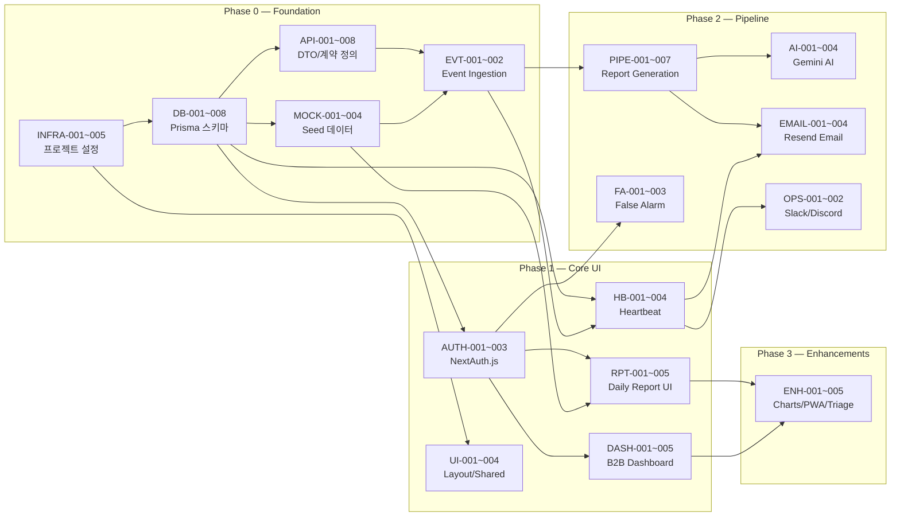

# Rooted MVP — SRS V01 Development Task List

**Source:** SRS_V01(ENG_OPUS).md (Revision 1.0, 2026-04-20)  
**Extracted By:** Technical PM / System Architect  
**Date:** 2026-04-22  
**Methodology:** 4-Step Task Extraction (Contract → Logic → Test → NFR)

---

> **⚠️ 태스크 실행 순서 원칙:**  
> Step 1 (데이터/계약) → Step 2 (로직/상태변경) → Step 3 (테스트) → Step 4 (인프라/비기능)  
> 각 Phase 내에서도 이 순서를 준수하여 SSOT(Single Source of Truth)를 먼저 확보한 뒤 로직을 구현합니다.

> **Phase 범례:** Phase 0 (Foundation, Week 1) → Phase 1 (Core UI, Weeks 2–3) → Phase 2 (Pipeline, Weeks 4–5) → Phase 3 (Enhancements, Weeks 6–7) → Wave 2 (Separate, Professional Developer Required)

---

## Step 1. 계약 및 데이터 명세 Task (Contract & Data)

### Epic: Database Schema & Migration

| Task ID | Epic | Feature (기능명) | 관련 SRS 섹션 | 선행 태스크 (Dependencies) | 복잡도 |
|---|---|---|---|---|---|
| DB-001 | Database | Prisma 스키마 정의 — SensorDevice 모델 (cuid PK, locationZone, firmwareVersion, status, calibrationStatus, lastHeartbeatAt) | §3.6 ERD, §6.2.1 | None | L |
| DB-002 | Database | Prisma 스키마 정의 — WellnessEvent 모델 (deviceId FK, eventType, timestamp index, confidenceScore, isFalseAlarm, integrityHash) | §3.6 ERD, §6.2.2 | DB-001 | L |
| DB-003 | Database | Prisma 스키마 정의 — UserAccount 모델 (email unique, role, notificationPref JSON string) | §3.6 ERD, §6.2.3 | None | L |
| DB-004 | Database | Prisma 스키마 정의 — UserDevice 조인 테이블 (복합 PK: userId + deviceId) | §3.6 ERD, §6.2.4 | DB-001, DB-003 | L |
| DB-005 | Database | Prisma 스키마 정의 — DailyReport 모델 (deviceId FK, date index, sleepScore, bathroomVisitCount, anomalyFlags JSON, statusCode, aiSummary) | §3.6 ERD, §6.2.5 | DB-001 | L |
| DB-006 | Database | Supabase Free PostgreSQL 연결 설정 + Prisma Client 싱글턴 (`lib/prisma.ts`) | §9 ENV, CON-08 | DB-001 ~ DB-005 | L |
| DB-007 | Database | Prisma 마이그레이션 스크립트 생성 및 Supabase 배포 실행 | §3.6, CON-08, CON-14 | DB-006 | M |
| DB-008 | Database | 30일 초과 데이터 자동 삭제 SQL/Prisma 쿼리 작성 (Daily Cleanup) | §4.2.6 REQ-NF-017, REQ-FUNC-015 | DB-007 | M |

### Epic: API Contract & DTO Definition

| Task ID | Epic | Feature (기능명) | 관련 SRS 섹션 | 선행 태스크 (Dependencies) | 복잡도 |
|---|---|---|---|---|---|
| API-001 | API Spec | [Phase 0] POST `/api/events/ingest` — Request DTO (eventType, confidenceScore, zone, integrityHash) + Response DTO (201/400/401) + API Key 인증 규격 정의 | §3.3 Route #1, §6.1 | DB-002 | L |
| API-002 | API Spec | [Phase 1] GET `/api/reports/daily/[deviceId]/[date]` — Response DTO (sleepScore, bathroomVisitCount, anomalyFlags, statusCode, aiSummary) + 에러 코드 정의 (404 Not Found, 403 Forbidden) | §3.3 Route #2, §6.1 | DB-005 | L |
| API-003 | API Spec | [Phase 1] GET `/api/dashboard/status` — Response DTO (devices[]: {id, status, locationZone, lastHeartbeatAt, latestEvent}) + JWT 인증 규격 | §3.3 Route #5, §6.1 | DB-001, DB-002 | L |
| API-004 | API Spec | [Phase 1] POST `/api/devices/[deviceId]/heartbeat` — Request DTO (healthStatus) + Response DTO (200/404) + API Key 인증 규격 | §3.3 Route #6, §6.1 | DB-001 | L |
| API-005 | API Spec | [Phase 2] POST `/api/events/[eventId]/false-alarm` — Request DTO + Response DTO (200/404) + JWT 인증 규격 | §3.3 Route #3, §6.1 | DB-002 | L |
| API-006 | API Spec | [Phase 2] POST `/api/ai/wellness-summary` — Request DTO (deviceId, date, metrics) + Response DTO (aiSummary string) + Gemini 에러 Fallback 규격 | §3.3 Route #4, §7.1 | DB-005 | M |
| API-007 | API Spec | [Phase 0] POST `/api/mock/generate` — Mock 이벤트 자동 생성 API Request/Response 규격 정의 | §8 Project Structure, §14.1 | API-001 | L |
| API-008 | API Spec | Server Action 인터페이스 정의 — `createWellnessEvent`, `updateFalseAlarmFlag`, `generateDailyReport`, `updateDeviceStatus` 입출력 타입 | §3.3.1 Server Actions | DB-001 ~ DB-005 | M |

### Epic: Mock Data

| Task ID | Epic | Feature (기능명) | 관련 SRS 섹션 | 선행 태스크 (Dependencies) | 복잡도 |
|---|---|---|---|---|---|
| MOCK-001 | Mock Data | `prisma/seed.ts` — Mock SensorDevice 3~5개 + Mock UserAccount 3개 (Guardian 2, Admin 1) + UserDevice 연결 데이터 생성 스크립트 작성 | §14.1 Seed Script, §14.2 Sample Data | DB-007 | M |
| MOCK-002 | Mock Data | `prisma/seed.ts` — Mock WellnessEvent 7일치 생성 (5분 간격 288개/일/디바이스, eventType 분포: ACTIVITY_ALERT 95%, WELLNESS_SCORE 4%, EMERGENCY 1%) | §14.1, §14.2 | MOCK-001 | M |
| MOCK-003 | Mock Data | `prisma/seed.ts` — Mock DailyReport 7일치 생성 (sleepScore 60~95 랜덤, bathroomVisitCount 1~5 랜덤, 하드코딩된 AI 요약 3~5개 문장) | §14.1, §14.2 | MOCK-001 | M |
| MOCK-004 | Mock Data | POST `/api/events/ingest` — `mock=true` 파라미터 시 자동 생성 모드 구현 (프론트엔드 개발용 Mocking API) | §14.1 Event Generation API | API-001, MOCK-001 | M |

---

## Step 2. 로직 및 상태 변경 Task (Logic & Mutation — CQRS)

### Epic: Infrastructure & Foundation (Phase 0)

| Task ID | Epic | Feature (기능명) | 관련 SRS 섹션 | 선행 태스크 (Dependencies) | 복잡도 |
|---|---|---|---|---|---|
| INFRA-001 | Infra | `npx create-next-app@latest` + Tailwind CSS + shadcn/ui 초기 프로젝트 설정 | §8, CON-06, CON-09, §13.2 | None | L |
| INFRA-002 | Infra | Vercel Hobby 배포 설정 (Git Push 자동 배포 + PR Preview) | CON-12, CON-13, §13.2 | INFRA-001 | L |
| INFRA-003 | Infra | `vercel.json` — Vercel Cron Job 설정 (1일 1회, Hobby 제한) | CON-13, DEP-05, §13.2 | INFRA-002 | L |
| INFRA-004 | Infra | `.env.local` / `.env.example` — 환경 변수 8개 설정 (DATABASE_URL, NEXTAUTH_SECRET, GOOGLE_GENERATIVE_AI_API_KEY, AI_MODEL, RESEND_API_KEY, SLACK_WEBHOOK_URL 등) | §9 Environment Variables | INFRA-001 | L |
| INFRA-005 | Infra | Supabase Free 프로젝트 7일 비활성 일시정지 방지 — UptimeRobot Free 또는 GitHub Actions daily ping 설정 | RISK-07, §13.2 | INFRA-002, DB-007 | L |

### Epic: Authentication (Phase 1)

| Task ID | Epic | Feature (기능명) | 관련 SRS 섹션 | 선행 태스크 (Dependencies) | 복잡도 |
|---|---|---|---|---|---|
| AUTH-001 | Auth | [Command] NextAuth.js 기본 설정 — `lib/auth.ts` JWT 싱글 인증 구성 + 데모 자격 증명 | §8, REQ-NF-011, CON-07, RISK-10, §13.2 | INFRA-001, DB-006 | M |
| AUTH-002 | Auth | [Command] Login 페이지 UI — `app/(auth)/login/page.tsx` (shadcn/ui Form 컴포넌트) | §8 Project Structure | AUTH-001, INFRA-001 | M |
| AUTH-003 | Auth | [Command] Register 페이지 UI — `app/(auth)/register/page.tsx` (shadcn/ui Form 컴포넌트) | §8 Project Structure | AUTH-001 | L |

### Epic: Event Ingestion (Phase 0)

| Task ID | Epic | Feature (기능명) | 관련 SRS 섹션 | 선행 태스크 (Dependencies) | 복잡도 |
|---|---|---|---|---|---|
| EVT-001 | Event Ingestion | [Command] POST `/api/events/ingest/route.ts` — API Key 인증 + 요청 유효성 검증 + `createWellnessEvent` Server Action 호출 | §3.3 Route #1, §3.3.1 SA #1, §13.2 | API-001, DB-007, INFRA-001 | M |
| EVT-002 | Event Ingestion | [Command] `app/actions/events.ts` — `createWellnessEvent` Server Action 구현 (Prisma `wellnessEvent.createMany()`) | §3.3.1 SA #1, §3.4.1 Sequence | DB-007 | M |

### Epic: Device Heartbeat (Phase 1)

| Task ID | Epic | Feature (기능명) | 관련 SRS 섹션 | 선행 태스크 (Dependencies) | 복잡도 |
|---|---|---|---|---|---|
| HB-001 | Heartbeat | [Command] POST `/api/devices/[deviceId]/heartbeat/route.ts` — API Key 인증 + `updateDeviceStatus` Server Action 호출 | §3.3 Route #6, §6.3.2, §13.3 | API-004, DB-007 | M |
| HB-002 | Heartbeat | [Command] `app/actions/devices.ts` — `updateDeviceStatus` Server Action 구현 (lastHeartbeatAt 업데이트 + status 변경) | §3.3.1 SA #4 | DB-007 | M |
| HB-003 | Heartbeat | [Query] Heartbeat 요청 시 전체 활성 디바이스의 `lastHeartbeatAt` 확인 → 15분 초과 미수신 디바이스 식별 로직 | §6.3.2 Sequence, REQ-FUNC-008 | HB-001 | M |
| HB-004 | Heartbeat | [Command] 15분 이상 Heartbeat 미수신 시 디바이스 status → `INACTIVE` 업데이트 | §6.3.2, REQ-FUNC-008 | HB-003 | L |

### Epic: B2B Dashboard (Phase 1)

| Task ID | Epic | Feature (기능명) | 관련 SRS 섹션 | 선행 태스크 (Dependencies) | 복잡도 |
|---|---|---|---|---|---|
| DASH-001 | B2B Dashboard | [Query] GET `/api/dashboard/status/route.ts` — 전체 디바이스 상태 + 최신 이벤트 조회 (Prisma `sensorDevice.findMany()` + latest events) | §3.3 Route #5, §13.3 | API-003, DB-007, AUTH-001 | M |
| DASH-002 | B2B Dashboard | [UI/Query] `app/(admin)/dashboard/page.tsx` — Traffic Light 다중 침대 모니터링 UI (shadcn/ui Badge: Red/Yellow/Green) | REQ-FUNC-011, §3.2 Client Apps, §13.3 | DASH-001, INFRA-001 | H |
| DASH-003 | B2B Dashboard | [UI] API Polling 구현 (30초 간격 자동 갱신 — `setInterval` 또는 SWR/React Query) | REQ-FUNC-011, GAP-01, §13.3 | DASH-002, DASH-001 | M |
| DASH-004 | B2B Dashboard | [UI] `components/dashboard/traffic-light-card.tsx` — 개별 침대 상태 카드 컴포넌트 (status 색상 매핑) | §8 Project Structure | DASH-002 | M |
| DASH-005 | B2B Dashboard | [Query] 이벤트 로그 역추적 조회 기능 — 30일 범위 내 날짜 범위 검색 (Prisma `wellnessEvent.findMany` + date filter) | REQ-FUNC-015, §13.3 | DB-007, AUTH-001 | M |

### Epic: Daily Report Query (Phase 1)

| Task ID | Epic | Feature (기능명) | 관련 SRS 섹션 | 선행 태스크 (Dependencies) | 복잡도 |
|---|---|---|---|---|---|
| RPT-001 | Daily Report | [Query] GET `/api/reports/daily/[deviceId]/[date]/route.ts` — 일간 보고서 조회 (sleepScore, bathroomVisitCount, anomalyFlags, aiSummary) | §3.3 Route #2, §13.3 | API-002, DB-007, AUTH-001 | M |
| RPT-002 | Daily Report | [UI] `app/(guardian)/dashboard/page.tsx` — Guardian 홈 대시보드 (일일 요약 + AI 서술 표시) | §3.2, FR-05 (UI), §13.3 | RPT-001, INFRA-001 | H |
| RPT-003 | Daily Report | [UI] `app/(guardian)/reports/[date]/page.tsx` — 일간 보고서 상세 페이지 | §8 Project Structure, §13.3 | RPT-001 | M |
| RPT-004 | Daily Report | [UI] `components/reports/daily-report-card.tsx` — 일간 보고서 카드 컴포넌트 (AI 요약 표시 포함) | §8 Project Structure | RPT-002 | M |
| RPT-005 | Daily Report | [UI] `components/reports/anomaly-alert.tsx` — 이상 징후 경고 컴포넌트 (shadcn/ui Alert) | §8, REQ-FUNC-019 | RPT-002 | L |

### Epic: Layout & Shared Components (Phase 1)

| Task ID | Epic | Feature (기능명) | 관련 SRS 섹션 | 선행 태스크 (Dependencies) | 복잡도 |
|---|---|---|---|---|---|
| UI-001 | Shared UI | Root Layout (`app/layout.tsx`) + 전역 스타일 (`globals.css`) + Landing 페이지 (`app/page.tsx`) | §8 Project Structure | INFRA-001 | L |
| UI-002 | Shared UI | Guardian Layout (`app/(guardian)/layout.tsx`) — 사이드바/네비게이션 | §8 Project Structure | AUTH-001, INFRA-001 | M |
| UI-003 | Shared UI | Admin Layout (`app/(admin)/layout.tsx`) — 관리자 네비게이션 | §8 Project Structure | AUTH-001, INFRA-001 | M |
| UI-004 | Shared UI | `components/shared/device-status-indicator.tsx` — 디바이스 상태 표시 공유 컴포넌트 | §8 Project Structure | INFRA-001 | L |

### Epic: Daily Report Generation Pipeline (Phase 2)

| Task ID | Epic | Feature (기능명) | 관련 SRS 섹션 | 선행 태스크 (Dependencies) | 복잡도 |
|---|---|---|---|---|---|
| PIPE-001 | Report Pipeline | [Command] `app/actions/reports.ts` — `generateDailyReport` Server Action: 전일 데이터 집계 (Prisma `wellnessEvent.findMany({where: {date: yesterday}})`) | §3.3.1 SA #3, §3.4.1 Sequence, §13.4 | DB-007, EVT-002 | H |
| PIPE-002 | Report Pipeline | [Command] `generateDailyReport` — 수면 점수(sleepScore) 계산 로직 (오차율 < 10%) | REQ-FUNC-016, REQ-NF-003, §3.4.1 | PIPE-001 | H |
| PIPE-003 | Report Pipeline | [Command] `generateDailyReport` — 화장실 방문 횟수(bathroomVisitCount) 카운팅 + 이상치 필터링 (≥50회 시 데이터 신뢰도 경고 플래그) | REQ-FUNC-019, §3.4.1 | PIPE-001 | M |
| PIPE-004 | Report Pipeline | [Command] `generateDailyReport` — 이상 징후 감지 로직: 화장실 체류 시간 > 평균 +50% 시 `anomaly_flag` 설정 | REQ-FUNC-017, §3.4.1 | PIPE-001 | M |
| PIPE-005 | Report Pipeline | [Command] `generateDailyReport` — 데이터 수집 < 5시간 시 `statusCode: "INSUFFICIENT_DATA"` 처리 분기 | REQ-FUNC-018, §3.4.1 | PIPE-001 | L |
| PIPE-006 | Report Pipeline | [Command] `generateDailyReport` — Prisma `dailyReport.create()` 저장 (metrics + aiSummary) | §3.4.1 Sequence | PIPE-002 ~ PIPE-005 | M |
| PIPE-007 | Report Pipeline | [Command] Vercel Cron Job → `generateDailyReport` 트리거 연동 (1일 1회 실행) | CON-13, DEP-05, §13.4, REQ-FUNC-020 | PIPE-006, INFRA-003 | M |

### Epic: AI Integration (Phase 2)

| Task ID | Epic | Feature (기능명) | 관련 SRS 섹션 | 선행 태스크 (Dependencies) | 복잡도 |
|---|---|---|---|---|---|
| AI-001 | AI Integration | `lib/ai.ts` — Vercel AI SDK + `@ai-sdk/google` 설정 (Gemini 1.5 Flash 기본, AI_MODEL 환경변수로 모델 교체 가능) | §7.1, §7.4, CON-10, CON-11 | INFRA-004 | M |
| AI-002 | AI Integration | [Command] POST `/api/ai/wellness-summary/route.ts` — `generateText()` 호출 + 프롬프트 구조 적용 (§7.3 Prompt Structure) | §7.1, §7.3, §3.3 Route #4, §13.4 | AI-001, API-006, AUTH-001 | H |
| AI-003 | AI Integration | [Command] `generateDailyReport` 내 AI 요약 생성 통합 — Gemini API 호출 + aiSummary 필드 저장 + Fallback (실패 시 null 저장, 사용자 에러 없음) | §7.1 Fallback, NEW-01 | AI-002, PIPE-006 | H |
| AI-004 | AI Integration | [Command] 이상 징후 AI 설명 생성 — anomaly flag 감지 시 Gemini로 자연어 설명문 생성 (NEW-02) | §7.2 NEW-02, REQ-FUNC-017 | AI-002, PIPE-004 | M |

### Epic: Email Notification (Phase 2)

| Task ID | Epic | Feature (기능명) | 관련 SRS 섹션 | 선행 태스크 (Dependencies) | 복잡도 |
|---|---|---|---|---|---|
| EMAIL-001 | Notification | `lib/email.ts` — Resend API 유틸리티 설정 (Free: 100통/일 제한) | §8, REF-13, §13.4 | INFRA-004 | L |
| EMAIL-002 | Notification | [Command] 일간 보고서 생성 완료 시 Guardian에게 이메일 알림 전송 (`sendDailyReport`) | REQ-FUNC-020, §3.4.1 Sequence, §13.4 | EMAIL-001, PIPE-006 | M |
| EMAIL-003 | Notification | [Command] 디바이스 15분 이상 오프라인 시 Guardian에게 이메일 알림 전송 (`sendOfflineAlert`) — 1회성 | REQ-FUNC-008, §6.3.2 Sequence | EMAIL-001, HB-004 | M |
| EMAIL-004 | Notification | [Command] 긴급 이벤트(EMERGENCY) 수신 시 Guardian에게 이메일 알림 전송 (`sendEmergencyAlert`) — 5분 이내 | REQ-FUNC-004, §6.3.1 Sequence | EMAIL-001, EVT-001 | M |

### Epic: False Alarm Feedback (Phase 2)

| Task ID | Epic | Feature (기능명) | 관련 SRS 섹션 | 선행 태스크 (Dependencies) | 복잡도 |
|---|---|---|---|---|---|
| FA-001 | False Alarm | [Command] POST `/api/events/[eventId]/false-alarm/route.ts` — JWT 인증 + `updateFalseAlarmFlag` Server Action 호출 | §3.3 Route #3, §13.4 | API-005, AUTH-001 | M |
| FA-002 | False Alarm | [Command] `app/actions/events.ts` — `updateFalseAlarmFlag` Server Action (Prisma `wellnessEvent.update({ isFalseAlarm: true })`) | §3.3.1 SA #2, REQ-FUNC-005 | DB-007 | L |
| FA-003 | False Alarm | [UI] Guardian Portal "Report False Alarm" 버튼 + 피드백 제출 UI | REQ-FUNC-005, §3.4.3 PMF Sequence | RPT-002, FA-001 | M |

### Epic: Operational Monitoring (Phase 2)

| Task ID | Epic | Feature (기능명) | 관련 SRS 섹션 | 선행 태스크 (Dependencies) | 복잡도 |
|---|---|---|---|---|---|
| OPS-001 | Ops | `lib/slack.ts` — Slack/Discord Incoming Webhook 유틸리티 설정 | §8, §13.4 | INFRA-004 | L |
| OPS-002 | Ops | [Command] 오프라인 디바이스 비율 ≥ 10% 시 Slack/Discord Webhook 운영 알림 전송 | REQ-NF-007, §6.3.2 Sequence, §13.4 | OPS-001, HB-003 | M |

### Epic: Phase 3 — Enhancements

| Task ID | Epic | Feature (기능명) | 관련 SRS 섹션 | 선행 태스크 (Dependencies) | 복잡도 |
|---|---|---|---|---|---|
| ENH-001 | Enhancements | [UI/Query] 수면 트렌드 차트 — Recharts 기반 주간/월간 타임라인 시각화 (7일+ 데이터 필요) | FR-06, REQ-FUNC-021, §13.5 | RPT-001 | M |
| ENH-002 | Enhancements | [UI] 대시보드 필터 — shadcn/ui DataTable 필터 컴포넌트 (병실/우선순위 기준 그룹핑) | FR-08, REQ-FUNC-023, §13.5 | DASH-002 | M |
| ENH-003 | Enhancements | [Command] Triage 엔진 — 클라이언트 사이드 위험도 계산 + 우선순위 정렬 + 최상위 케이스 사운드/시각 큐 | REQ-FUNC-012, `lib/triage.ts`, §13.5 | DASH-002 | H |
| ENH-004 | Enhancements | [Infra] PWA 전환 — `manifest.json` + Service Worker 기본 설정 | GAP-02, §13.5 | INFRA-001 | M |
| ENH-005 | Enhancements | [Infra] Vercel Analytics / Umami 연동 — `view_daily_report` 이벤트 추적 | REQ-NF-014, REQ-NF-015, §13.5 | INFRA-002 | L |

---

## Step 3. 완료 조건(AC) → 테스트 Task 변환 (Test)

### Epic: Phase 0 Tests

| Task ID | Epic | Feature (기능명) | 관련 SRS 섹션 | 선행 태스크 (Dependencies) | 복잡도 |
|---|---|---|---|---|---|
| TEST-001 | Test | [Unit] Event Ingestion 유효성 검증 테스트 — API Key 미전송 시 401, 필수 필드 누락 시 400, eventType 유효하지 않은 값 시 400 반환 검증 | REQ-FUNC-001(MVP: mock), API-001 AC | EVT-001 | M |
| TEST-002 | Test | [Unit] Prisma 스키마 무결성 테스트 — 5개 모델의 cuid() PK 생성, FK 관계, unique 제약, index 적용 검증 | §3.6, §6.2 | DB-007 | L |
| TEST-003 | Test | [Unit] Mock Seed 데이터 생성 검증 — 디바이스 3~5개, 사용자 3명, 7일 이벤트 데이터 정상 생성 확인 | §14.1 | MOCK-001 ~ MOCK-003 | L |

### Epic: Phase 1 Tests

| Task ID | Epic | Feature (기능명) | 관련 SRS 섹션 | 선행 태스크 (Dependencies) | 복잡도 |
|---|---|---|---|---|---|
| TEST-004 | Test | [Unit] Daily Report 조회 API 테스트 — 존재하는 deviceId+date 200 OK, 존재하지 않는 조합 404, 타 사용자 디바이스 접근 시 403 검증 | API-002 AC | RPT-001 | M |
| TEST-005 | Test | [Unit] Dashboard Status API 테스트 — 정상 JWT 시 200 + 전체 디바이스 목록, 인증 미제공 시 401, 각 디바이스의 status/lastHeartbeatAt 포함 여부 | API-003 AC | DASH-001 | M |
| TEST-006 | Test | [Unit] Heartbeat API 테스트 — 유효한 deviceId 시 200 + lastHeartbeatAt 업데이트, 존재하지 않는 deviceId 시 404 | API-004 AC, REQ-FUNC-008 | HB-001 | M |
| TEST-007 | Test | [Unit] 30일 초과 데이터 자동 삭제 테스트 — 삭제 쿼리 실행 후 30일 초과 WellnessEvent 0건, 30일 이내 데이터 보존 검증 | REQ-NF-017, REQ-FUNC-015 AC | DB-008 | M |
| TEST-008 | Test | [Unit] NextAuth.js JWT 인증 테스트 — 데모 자격증명 로그인 성공 시 JWT 발급, 잘못된 자격증명 시 401, 만료 토큰 시 403 | REQ-NF-011 AC | AUTH-001 | M |
| TEST-009 | Test | [Integration] B2B Dashboard API Polling 테스트 — 30초 간격 호출 시 최신 상태 반영, 디바이스 상태 Red/Yellow/Green 매핑 정확성 | REQ-FUNC-011 AC | DASH-002, DASH-003 | M |

### Epic: Phase 2 Tests

| Task ID | Epic | Feature (기능명) | 관련 SRS 섹션 | 선행 태스크 (Dependencies) | 복잡도 |
|---|---|---|---|---|---|
| TEST-010 | Test | [Unit] `generateDailyReport` 수면 점수 계산 정확도 테스트 — Mock 데이터 기반 sleepScore 오차율 < 10% 검증 (GWT: Given 정상 7일 데이터, When Cron 실행, Then 오차 < 10%) | REQ-FUNC-016, REQ-NF-003 AC | PIPE-002 | H |
| TEST-011 | Test | [Unit] `generateDailyReport` 데이터 부족 처리 테스트 — 5시간 미만 데이터 시 `statusCode: "INSUFFICIENT_DATA"` 생성 검증 | REQ-FUNC-018 AC | PIPE-005 | M |
| TEST-012 | Test | [Unit] `generateDailyReport` 이상치 필터링 테스트 — 화장실 ≥ 50회 시 `anomalyFlags`에 경고 플래그 + "데이터 신뢰도 경고" 설정 검증 | REQ-FUNC-019 AC | PIPE-003 | M |
| TEST-013 | Test | [Unit] 이상 징후 감지 테스트 — 화장실 체류 시간 > 평균 +50% 시 `anomaly_flag` 설정 + AI 설명문 생성 호출 검증 | REQ-FUNC-017 AC | PIPE-004, AI-004 | M |
| TEST-014 | Test | [Unit] False Alarm 피드백 테스트 — 유효한 eventId 시 `isFalseAlarm=true` 업데이트 200, 존재하지 않는 eventId 시 404, JWT 미인증 시 401 | REQ-FUNC-005 AC | FA-001, FA-002 | M |
| TEST-015 | Test | [Unit] Gemini AI 요약 Fallback 테스트 — API 호출 성공 시 aiSummary 저장, API 실패 시 aiSummary=null 저장 + 사용자 에러 미노출 | §7.1 Fallback | AI-003 | M |
| TEST-016 | Test | [Unit] 이메일 알림 전송 테스트 — 일간 보고서 생성 시 Resend API 호출 검증, 디바이스 오프라인 시 1회 알림 전송 검증, 100통/일 한도 초과 방지 | REQ-FUNC-020, REQ-FUNC-008, RISK-09 AC | EMAIL-002, EMAIL-003 | M |
| TEST-017 | Test | [Unit] Heartbeat 오프라인 감지 테스트 — 15분(3회 연속) 미수신 시 status→INACTIVE 변경 + 이메일 발송 + 10% 이상 오프라인 시 Slack Webhook 전송 | REQ-FUNC-008, REQ-NF-007 AC | HB-003, HB-004, EMAIL-003, OPS-002 | H |

### Epic: Phase 3 Tests

| Task ID | Epic | Feature (기능명) | 관련 SRS 섹션 | 선행 태스크 (Dependencies) | 복잡도 |
|---|---|---|---|---|---|
| TEST-018 | Test | [Unit] Triage 정렬 테스트 — ≥ 3건 동시 긴급 이벤트 시 risk score 기반 정렬 + 최상위 케이스 하이라이트 검증 | REQ-FUNC-012 AC | ENH-003 | M |
| TEST-019 | Test | [UI] 수면 트렌드 차트 렌더링 테스트 — 7일+ 데이터 시 Recharts 그래프 정상 렌더, 데이터 부족 시 안내 메시지 표시 | REQ-FUNC-021 AC | ENH-001 | L |

---

## Step 4. 비기능 제약(NFR) Task 및 의존성 매핑

### Epic: Security & Compliance

| Task ID | Epic | Feature (기능명) | 관련 SRS 섹션 | 선행 태스크 (Dependencies) | 복잡도 |
|---|---|---|---|---|---|
| SEC-001 | Security | [Infra] TLS 1.3 적용 확인 — Vercel Hobby 기본 강제 TLS 1.3 인증서 검증 | REQ-NF-008, CON-16 | INFRA-002 | L |
| SEC-002 | Security | [Code Review] Prisma 스키마 PII 필드 0건 검증 — DB에 식별 가능 마커 부재 확인 (쿼터리 내부 DB 스캔) | REQ-NF-009, CON-02 | DB-007 | L |
| SEC-003 | Security | [CI] 규제 키워드 Linter 설정 — `diagnosis`, `medical`, `patient` 등 금지어 감지 시 머지 차단 GitHub Actions CI 체크 | REQ-NF-019, CON-04 | INFRA-002 | M |
| SEC-004 | Security | [Phase 2] RBAC 미들웨어 역할 기반 접근 제어 — role 필드 기반 API 라우트 보호 (Guardian vs FACILITY_ADMIN 분리) | REQ-NF-011 (Phase 2 RBAC) | AUTH-001 | H |

### Epic: Performance & Scalability

| Task ID | Epic | Feature (기능명) | 관련 SRS 섹션 | 선행 태스크 (Dependencies) | 복잡도 |
|---|---|---|---|---|---|
| PERF-001 | Performance | [Test] E2E 응답 지연 검증 — Report/Dashboard 쿼리 p95 ≤ 5,000ms (Serverless cold start 허용) 수동 부하 테스트 | REQ-NF-001 | RPT-001, DASH-001 | M |
| PERF-002 | Performance | [Test] 50 동시 디바이스 스트레스 테스트 — p95 ≤ 1,000ms 응답 시간 검증 (Supabase Free DB 기준) | REQ-NF-004, REQ-NF-018 | DB-007, DASH-001 | H |
| PERF-003 | Performance | [Monitoring] Vercel Analytics (Hobby 포함) 응답 시간 모니터링 설정 | REQ-NF-001 | INFRA-002 | L |

### Epic: Availability & Monitoring

| Task ID | Epic | Feature (기능명) | 관련 SRS 섹션 | 선행 태스크 (Dependencies) | 복잡도 |
|---|---|---|---|---|---|
| AVAIL-001 | Availability | [Infra] UptimeRobot Free 합성 모니터링 설정 (5분 간격) — Best Effort ~99% 가용성 추적 | REQ-NF-005, §13.2 | INFRA-002 | L |
| AVAIL-002 | Availability | [Monitoring] Vercel + Supabase 빌링 대시보드 $0 비용 확인 프로세스 | REQ-NF-012 | INFRA-002, DB-007 | L |

---

## 전체 태스크 요약 (Summary)

| Step | 구분 | 태스크 수 | Phase 0 | Phase 1 | Phase 2 | Phase 3 | Wave 2 |
|---|---|---|---|---|---|---|---|
| Step 1 | Contract & Data | 20 | 11 | 4 | 5 | - | - |
| Step 2 | Logic & Mutation (CQRS) | 42 | 8 | 15 | 14 | 5 | - |
| Step 3 | Test (AC → Test Code) | 19 | 3 | 6 | 8 | 2 | - |
| Step 4 | NFR & Infra | 10 | 4 | 2 | 2 | - | 2 |
| **합계** | | **91** | **26** | **27** | **29** | **7** | **2** |

> **Note:**
> Wave 2 태스크(Edge AI/HW, EMR, SMS/KakaoTalk, PagerDuty, Cold Archival, OTA 등)는 SRS에 명시된 대로 **별도 타임라인 + 전문 개발자**가 필요하므로 본 태스크 목록에서는 참조만 포함하고 세부 분해하지 않았습니다.

---

## 핵심 의존성 체인 (Critical Dependency Chains)

---

## Wave 2 참조 태스크 (별도 타임라인 — 전문 개발자 필수)

> **⚠️ Warning:**
> 아래는 SRS에 명시된 Wave 2 범위로, MVP Core 바이브코딩 범위를 벗어납니다. 전문 개발자와 별도 예산이 필요합니다.

| 참조 ID | 도메인 | 기능명 | 관련 SRS 섹션 | 비고 |
|---|---|---|---|---|
| W2-REF-001 | Edge AI/HW | UWB 레이더 + 딥러닝 Edge AI Validator | FR-01, FR-02, FR-03 | ML 엔지니어 필수 |
| W2-REF-002 | EMR Integration | EMR Webhook (HMAC-SHA256) + DeadLetterEvent | FR-04 EMR, REQ-FUNC-013~014 | DEP-01 벤더 파트너십 + 보안 전문가 |
| W2-REF-003 | Messaging | SMS/KakaoTalk fallback | FR-07, REQ-FUNC-022 | 유료 서비스 예산 필요 |
| W2-REF-004 | Push | FCM/Web Push 실시간 알림 | §3.4.2 | Firebase 설정 + VAPID 키 |
| W2-REF-005 | Ops | PagerDuty Sev1 에스컬레이션 | REQ-NF-007 | $21/user/month 예산 |
| W2-REF-006 | Data | Cold Archival (90일 hot + 3년+ cold) | REQ-NF-017 | Supabase Pro ($25/month) |
| W2-REF-007 | Security | Full RBAC 미들웨어 + DeadLetterEvent | REQ-NF-011 | 보안 리뷰 |
| W2-REF-008 | OTA | OTA 펌웨어 업데이트 | REQ-NF-013 | 펌웨어 엔지니어링 팀 |

---

**— End of Task Document —**
