# TASK 상세 의존성 다이어그램

- 기준 디렉터리: `TASKs/all`
- 노드 수: 101개
- 의존성 엣지 수: 326개
- 엣지 방향: `선행 TASK --> 후속 TASK`
- 파싱 기준: 각 상세 파일의 `Depends on` 및 `Blocks` 항목에서 TASK ID를 추출하고 범위 표기를 확장

## 범례
- 파란색: Phase 0
- 초록색: Phase 1
- 주황색: Phase 2
- 보라색: Phase 3
- 회색: phase 라벨 없음 또는 기타

## 핵심 의존성 체인

`INFRA-001 -> DB-001 -> DB-002 -> DB-006 -> DB-007 -> HB-002 -> HB-001 -> HB-003 -> HB-004 -> DASH-001 -> DASH-002 -> ENH-002 -> ENH-003 -> TEST-018`

## 전체 상세 다이어그램

```mermaid
flowchart LR
  subgraph INFRA[INFRA]
    N_INFRA_001["INFRA-001<br/>Next.js + Tailwind CSS + shadcn/ui 초기 프로젝트 설정"]
    N_INFRA_002["INFRA-002<br/>Vercel Hobby 배포 설정 (Git Push 자동 배포 + PR Previ…"]
    N_INFRA_003["INFRA-003<br/>Vercel Cron Job 설정 (1일 1회, Hobby 제한)"]
    N_INFRA_004["INFRA-004<br/>환경 변수 8개 설정 (.env.local / .env.example)"]
    N_INFRA_005["INFRA-005<br/>Supabase Free 7일 비활성 일시정지 방지 설정"]
  end
  subgraph DB[DB]
    N_DB_001["DB-001<br/>Prisma 스키마 정의 — SensorDevice 모델"]
    N_DB_002["DB-002<br/>Prisma 스키마 정의 — WellnessEvent 모델"]
    N_DB_003["DB-003<br/>Prisma 스키마 정의 — UserAccount 모델"]
    N_DB_004["DB-004<br/>Prisma 스키마 정의 — UserDevice 조인 테이블"]
    N_DB_005["DB-005<br/>Prisma 스키마 정의 — DailyReport 모델"]
    N_DB_006["DB-006<br/>Supabase Free PostgreSQL 연결 + Prisma Client 싱…"]
    N_DB_007["DB-007<br/>Prisma 마이그레이션 스크립트 생성 및 Supabase 배포 실행"]
    N_DB_008["DB-008<br/>30일 초과 데이터 자동 삭제 SQL/Prisma 쿼리 작성"]
  end
  subgraph API[API]
    N_API_001["API-001<br/>POST /api/events/ingest — Request/Response DT…"]
    N_API_002["API-002<br/>GET /api/reports/daily/[deviceId]/[date] — Re…"]
    N_API_003["API-003<br/>GET /api/dashboard/status — Response DTO + JW…"]
    N_API_004["API-004<br/>POST /api/devices/[deviceId]/heartbeat — Requ…"]
    N_API_005["API-005<br/>POST /api/events/[eventId]/false-alarm — Requ…"]
    N_API_006["API-006<br/>POST /api/ai/wellness-summary — Request/Respo…"]
    N_API_007["API-007<br/>POST /api/mock/generate — Mock 이벤트 자동 생성 API …"]
    N_API_008["API-008<br/>Server Action 인터페이스 정의 — 4개 Core Server Actio…"]
  end
  subgraph MOCK[MOCK]
    N_MOCK_001["MOCK-001<br/>prisma/seed.ts — Mock SensorDevice + UserAcco…"]
    N_MOCK_002["MOCK-002<br/>prisma/seed.ts — Mock WellnessEvent 7일치 생성"]
    N_MOCK_003["MOCK-003<br/>prisma/seed.ts — Mock DailyReport 7일치 생성"]
    N_MOCK_004["MOCK-004<br/>POST /api/events/ingest — mock=true 자동 생성 모드 …"]
  end
  subgraph AUTH[AUTH]
    N_AUTH_001["AUTH-001<br/>NextAuth.js 기본 설정 — JWT 싱글 인증 구성 + 데모 자격 증명"]
    N_AUTH_002["AUTH-002<br/>Login 페이지 UI — shadcn/ui Form 적용"]
    N_AUTH_003["AUTH-003<br/>Register 페이지 UI — shadcn/ui Form 적용"]
  end
  subgraph EVT[EVT]
    N_EVT_001["EVT-001<br/>POST /api/events/ingest/route.ts — API Route …"]
    N_EVT_002["EVT-002<br/>createWellnessEvent Server Action 구현"]
  end
  subgraph HB[HB]
    N_HB_001["HB-001<br/>POST /api/devices/[deviceId]/heartbeat/route.…"]
    N_HB_002["HB-002<br/>updateDeviceStatus Server Action 구현"]
    N_HB_003["HB-003<br/>15분 초과 Heartbeat 미수신 디바이스 식별 로직"]
    N_HB_004["HB-004<br/>15분 이상 Heartbeat 미수신 시 디바이스 INACTIVE 상태 업데이트"]
  end
  subgraph DASH[DASH]
    N_DASH_001["DASH-001<br/>GET /api/dashboard/status — 전체 디바이스 상태 + 최신 이…"]
    N_DASH_002["DASH-002<br/>B2B Dashboard — Traffic Light 다중 침대 모니터링 UI"]
    N_DASH_003["DASH-003<br/>Dashboard API Polling — 30초 간격 자동 갱신 구현"]
    N_DASH_004["DASH-004<br/>TrafficLightCard — 개별 침대 상태 카드 컴포넌트"]
    N_DASH_005["DASH-005<br/>이벤트 로그 역추적 조회 — 30일 범위 날짜 검색"]
  end
  subgraph RPT[RPT]
    N_RPT_001["RPT-001<br/>GET /api/reports/daily/[deviceId]/[date] — 일간…"]
    N_RPT_002["RPT-002<br/>Guardian 홈 대시보드 — 일일 요약 + AI 서술 표시 UI"]
    N_RPT_003["RPT-003<br/>일간 보고서 상세 페이지 — app/(guardian)/reports/[date]…"]
    N_RPT_004["RPT-004<br/>DailyReportCard — 일간 보고서 카드 컴포넌트 (AI 요약 포함)"]
    N_RPT_005["RPT-005<br/>AnomalyAlert — 이상 징후 경고 컴포넌트 (shadcn/ui Alert)"]
  end
  subgraph UI[UI]
    N_UI_001["UI-001<br/>Root Layout + 전역 스타일 + Landing 페이지 구성"]
    N_UI_002["UI-002<br/>Guardian Layout — 사이드바/네비게이션 구현"]
    N_UI_003["UI-003<br/>Admin Layout — 시설 관리자 네비게이션 구현"]
    N_UI_004["UI-004<br/>DeviceStatusIndicator — 디바이스 상태 표시 공유 컴포넌트"]
  end
  subgraph PIPE[PIPE]
    N_PIPE_001["PIPE-001<br/>generateDailyReport Server Action — 전일 데이터 집계…"]
    N_PIPE_002["PIPE-002<br/>generateDailyReport — 수면 점수(sleepScore) 계산 로직"]
    N_PIPE_003["PIPE-003<br/>generateDailyReport — 화장실 방문 횟수 카운팅 + 이상치 필터링"]
    N_PIPE_004["PIPE-004<br/>generateDailyReport — 이상 징후 감지 (체류 시간 평균 +50%)"]
    N_PIPE_005["PIPE-005<br/>generateDailyReport — 데이터 부족 처리 (INSUFFICIENT…"]
    N_PIPE_006["PIPE-006<br/>generateDailyReport — Prisma dailyReport.crea…"]
    N_PIPE_007["PIPE-007<br/>Vercel Cron Job → generateDailyReport 트리거 연동"]
  end
  subgraph AI[AI]
    N_AI_001["AI-001<br/>lib/ai.ts — Vercel AI SDK + @ai-sdk/google (G…"]
    N_AI_002["AI-002<br/>POST /api/ai/wellness-summary — Gemini genera…"]
    N_AI_003["AI-003<br/>generateDailyReport 내 AI 요약 생성 통합 + Fallback"]
    N_AI_004["AI-004<br/>이상 징후 AI 설명 생성 — anomaly_flag 감지 시 Gemini 자연어…"]
  end
  subgraph EMAIL[EMAIL]
    N_EMAIL_001["EMAIL-001<br/>lib/email.ts — Resend API 이메일 유틸리티 설정"]
    N_EMAIL_002["EMAIL-002<br/>일간 보고서 생성 완료 시 Guardian 이메일 알림 (sendDailyRepo…"]
    N_EMAIL_003["EMAIL-003<br/>디바이스 15분 오프라인 시 Guardian 이메일 알림 (sendOfflineA…"]
    N_EMAIL_004["EMAIL-004<br/>긴급 이벤트(EMERGENCY) 수신 시 Guardian 이메일 알림 (sendE…"]
  end
  subgraph FA[FA]
    N_FA_001["FA-001<br/>POST /api/events/[eventId]/false-alarm — 거짓 경…"]
    N_FA_002["FA-002<br/>updateFalseAlarmFlag Server Action — isFalseA…"]
    N_FA_003["FA-003<br/>Guardian Portal — Report False Alarm 버튼 + 피드백…"]
  end
  subgraph OPS[OPS]
    N_OPS_001["OPS-001<br/>lib/slack.ts — Slack/Discord Incoming Webhook…"]
    N_OPS_002["OPS-002<br/>오프라인 디바이스 비율 ≥10% 시 Slack/Discord 운영 알림"]
  end
  subgraph SEC[SEC]
    N_SEC_001["SEC-001<br/>TLS 1.3 Vercel 인증서 검증"]
    N_SEC_002["SEC-002<br/>Prisma 스키마 PII 필드 0건 검증"]
    N_SEC_003["SEC-003<br/>규제 키워드 Linter GitHub Actions CI"]
    N_SEC_004["SEC-004<br/>RBAC 미들웨어 역할 기반 접근 제어 (Phase 2)"]
  end
  subgraph PERF[PERF]
    N_PERF_001["PERF-001<br/>E2E 응답 지연 p95 ≤ 5,000ms 검증"]
    N_PERF_002["PERF-002<br/>50 동시 디바이스 스트레스 테스트"]
    N_PERF_003["PERF-003<br/>Vercel Analytics 응답 시간 모니터링"]
  end
  subgraph AVAIL[AVAIL]
    N_AVAIL_001["AVAIL-001<br/>UptimeRobot Free 합성 모니터링 (5분 간격)"]
    N_AVAIL_002["AVAIL-002<br/>Vercel + Supabase $0 비용 확인 프로세스"]
  end
  subgraph ENH[ENH]
    N_ENH_001["ENH-001<br/>수면 트렌드 차트 — Recharts 기반 주간/월간 타임라인 시각화"]
    N_ENH_002["ENH-002<br/>대시보드 필터 — shadcn/ui DataTable (병실/우선순위 그룹핑)"]
    N_ENH_003["ENH-003<br/>Triage 엔진 — 클라이언트 위험도 계산 + 우선순위 정렬 + 시각/사운드 큐"]
    N_ENH_004["ENH-004<br/>PWA 전환 — manifest.json + Service Worker 기본 설정"]
    N_ENH_005["ENH-005<br/>Vercel Analytics / Umami — view_daily_report …"]
  end
  subgraph TEST[TEST]
    N_TEST_001["TEST-001<br/>[Unit] Event Ingestion 유효성 검증 테스트"]
    N_TEST_002["TEST-002<br/>[Unit] Prisma 스키마 무결성 테스트"]
    N_TEST_003["TEST-003<br/>[Unit] Mock Seed 데이터 생성 검증 테스트"]
    N_TEST_004["TEST-004<br/>[Unit] Daily Report 조회 API 테스트"]
    N_TEST_005["TEST-005<br/>[Unit] Dashboard Status API 테스트"]
    N_TEST_006["TEST-006<br/>[Unit] Heartbeat API 테스트"]
    N_TEST_007["TEST-007<br/>[Unit] 30일 초과 데이터 삭제 테스트"]
    N_TEST_008["TEST-008<br/>[Unit] NextAuth.js JWT 인증 테스트"]
    N_TEST_009["TEST-009<br/>[Integration] B2B Dashboard Polling 통합 테스트"]
    N_TEST_010["TEST-010<br/>[Unit] sleepScore 정확도 테스트 (오차율 10%)"]
    N_TEST_011["TEST-011<br/>[Unit] generateDailyReport 데이터 부족 처리 테스트"]
    N_TEST_012["TEST-012<br/>[Unit] generateDailyReport 이상치 필터링 테스트"]
    N_TEST_013["TEST-013<br/>[Unit] 이상 징후 감지 + AI 설명 호출 테스트"]
    N_TEST_014["TEST-014<br/>[Unit] False Alarm 피드백 처리 테스트"]
    N_TEST_015["TEST-015<br/>[Unit] Gemini AI Fallback 테스트"]
    N_TEST_016["TEST-016<br/>[Unit] 이메일 알림 전송 테스트"]
    N_TEST_017["TEST-017<br/>[Integration] Heartbeat 오프라인 감지 통합 테스트"]
    N_TEST_018["TEST-018<br/>[Unit] Triage 정렬 테스트"]
    N_TEST_019["TEST-019<br/>[Unit] 수면 트렌드 차트 렌더링 테스트"]
  end
  N_AI_001 --> N_AI_002
  N_AI_001 --> N_AI_003
  N_AI_001 --> N_AI_004
  N_AI_001 --> N_TEST_015
  N_AI_002 --> N_AI_003
  N_AI_002 --> N_AI_004
  N_AI_003 --> N_TEST_013
  N_AI_003 --> N_TEST_015
  N_AI_004 --> N_TEST_013
  N_API_001 --> N_API_007
  N_API_001 --> N_EVT_001
  N_API_001 --> N_EVT_002
  N_API_001 --> N_MOCK_004
  N_API_001 --> N_TEST_001
  N_API_002 --> N_RPT_001
  N_API_002 --> N_RPT_002
  N_API_002 --> N_RPT_003
  N_API_002 --> N_RPT_004
  N_API_002 --> N_RPT_005
  N_API_002 --> N_TEST_004
  N_API_003 --> N_DASH_001
  N_API_003 --> N_DASH_002
  N_API_003 --> N_DASH_003
  N_API_003 --> N_DASH_004
  N_API_003 --> N_TEST_005
  N_API_003 --> N_TEST_009
  N_API_004 --> N_HB_001
  N_API_004 --> N_HB_002
  N_API_004 --> N_HB_003
  N_API_004 --> N_HB_004
  N_API_004 --> N_TEST_006
  N_API_005 --> N_FA_001
  N_API_005 --> N_FA_002
  N_API_005 --> N_TEST_003
  N_API_006 --> N_AI_001
  N_API_006 --> N_AI_002
  N_API_006 --> N_AI_003
  N_API_006 --> N_PIPE_005
  N_API_007 --> N_MOCK_004
  N_API_008 --> N_EVT_002
  N_API_008 --> N_FA_002
  N_API_008 --> N_HB_001
  N_API_008 --> N_HB_002
  N_API_008 --> N_PIPE_001
  N_API_008 --> N_PIPE_002
  N_API_008 --> N_PIPE_003
  N_API_008 --> N_PIPE_004
  N_API_008 --> N_PIPE_005
  N_API_008 --> N_PIPE_006
  N_AUTH_001 --> N_AI_002
  N_AUTH_001 --> N_AUTH_002
  N_AUTH_001 --> N_AUTH_003
  N_AUTH_001 --> N_DASH_001
  N_AUTH_001 --> N_DASH_005
  N_AUTH_001 --> N_FA_001
  N_AUTH_001 --> N_RPT_001
  N_AUTH_001 --> N_TEST_008
  N_AUTH_001 --> N_UI_002
  N_AUTH_001 --> N_UI_003
  N_AUTH_002 --> N_SEC_004
  N_AUTH_002 --> N_TEST_008
  N_AUTH_003 --> N_SEC_004
  N_AUTH_003 --> N_TEST_008
  N_AVAIL_001 --> N_AVAIL_002
  N_DASH_001 --> N_DASH_002
  N_DASH_001 --> N_DASH_003
  N_DASH_001 --> N_DASH_005
  N_DASH_001 --> N_TEST_005
  N_DASH_002 --> N_DASH_003
  N_DASH_002 --> N_DASH_005
  N_DASH_002 --> N_ENH_002
  N_DASH_002 --> N_ENH_003
  N_DASH_002 --> N_TEST_009
  N_DASH_003 --> N_TEST_009
  N_DASH_004 --> N_DASH_002
  N_DASH_004 --> N_ENH_002
  N_DASH_004 --> N_ENH_003
  N_DB_001 --> N_API_003
  N_DB_001 --> N_API_004
  N_DB_001 --> N_API_008
  N_DB_001 --> N_DASH_001
  N_DB_001 --> N_DB_002
  N_DB_001 --> N_DB_004
  N_DB_001 --> N_DB_005
  N_DB_001 --> N_DB_006
  N_DB_001 --> N_DB_007
  N_DB_001 --> N_EMAIL_003
  N_DB_001 --> N_HB_002
  N_DB_001 --> N_PERF_001
  N_DB_001 --> N_SEC_002
  N_DB_001 --> N_UI_004
  N_DB_002 --> N_API_001
  N_DB_002 --> N_API_003
  N_DB_002 --> N_API_005
  N_DB_002 --> N_API_008
  N_DB_002 --> N_DASH_001
  N_DB_002 --> N_DASH_005
  N_DB_002 --> N_DB_006
  N_DB_002 --> N_DB_007
  N_DB_002 --> N_DB_008
  N_DB_002 --> N_EVT_001
  N_DB_002 --> N_EVT_002
  N_DB_002 --> N_FA_001
  N_DB_002 --> N_FA_002
  N_DB_002 --> N_MOCK_002
  N_DB_002 --> N_PERF_001
  N_DB_002 --> N_PIPE_002
  N_DB_002 --> N_PIPE_003
  N_DB_002 --> N_SEC_002
  N_DB_003 --> N_API_008
  N_DB_003 --> N_AUTH_001
  N_DB_003 --> N_AUTH_003
  N_DB_003 --> N_DB_004
  N_DB_003 --> N_DB_006
  N_DB_003 --> N_DB_007
  N_DB_003 --> N_EMAIL_002
  N_DB_003 --> N_EMAIL_003
  N_DB_003 --> N_EMAIL_004
  N_DB_003 --> N_MOCK_001
  N_DB_003 --> N_PERF_001
  N_DB_003 --> N_SEC_002
  N_DB_004 --> N_API_008
  N_DB_004 --> N_DB_006
  N_DB_004 --> N_DB_007
  N_DB_004 --> N_EMAIL_002
  N_DB_004 --> N_MOCK_001
  N_DB_004 --> N_PERF_001
  N_DB_004 --> N_SEC_002
  N_DB_005 --> N_API_002
  N_DB_005 --> N_API_006
  N_DB_005 --> N_API_008
  N_DB_005 --> N_DB_006
  N_DB_005 --> N_DB_007
  N_DB_005 --> N_ENH_001
  N_DB_005 --> N_MOCK_003
  N_DB_005 --> N_PERF_001
  N_DB_005 --> N_PIPE_001
  N_DB_005 --> N_PIPE_002
  N_DB_005 --> N_PIPE_003
  N_DB_005 --> N_PIPE_004
  N_DB_005 --> N_PIPE_005
  N_DB_005 --> N_PIPE_006
  N_DB_005 --> N_PIPE_007
  N_DB_005 --> N_RPT_001
  N_DB_005 --> N_RPT_002
  N_DB_005 --> N_RPT_003
  N_DB_005 --> N_RPT_004
  N_DB_005 --> N_RPT_005
  N_DB_005 --> N_SEC_002
  N_DB_005 --> N_TEST_011
  N_DB_005 --> N_TEST_012
  N_DB_006 --> N_DB_007
  N_DB_007 --> N_DASH_001
  N_DB_007 --> N_DASH_005
  N_DB_007 --> N_DB_008
  N_DB_007 --> N_EVT_001
  N_DB_007 --> N_EVT_002
  N_DB_007 --> N_FA_002
  N_DB_007 --> N_HB_001
  N_DB_007 --> N_HB_002
  N_DB_007 --> N_HB_003
  N_DB_007 --> N_HB_004
  N_DB_007 --> N_INFRA_005
  N_DB_007 --> N_MOCK_001
  N_DB_007 --> N_MOCK_002
  N_DB_007 --> N_MOCK_003
  N_DB_007 --> N_PIPE_001
  N_DB_007 --> N_RPT_001
  N_DB_007 --> N_TEST_002
  N_DB_008 --> N_AVAIL_002
  N_DB_008 --> N_DASH_005
  N_DB_008 --> N_TEST_007
  N_EMAIL_001 --> N_EMAIL_002
  N_EMAIL_001 --> N_EMAIL_003
  N_EMAIL_001 --> N_EMAIL_004
  N_EMAIL_001 --> N_TEST_016
  N_EMAIL_002 --> N_TEST_016
  N_EMAIL_003 --> N_TEST_016
  N_EMAIL_003 --> N_TEST_017
  N_EMAIL_004 --> N_TEST_016
  N_ENH_001 --> N_TEST_019
  N_ENH_002 --> N_ENH_003
  N_ENH_003 --> N_TEST_018
  N_ENH_005 --> N_PERF_003
  N_EVT_001 --> N_EMAIL_004
  N_EVT_001 --> N_PERF_002
  N_EVT_001 --> N_TEST_001
  N_EVT_002 --> N_EMAIL_004
  N_EVT_002 --> N_EVT_001
  N_EVT_002 --> N_PIPE_001
  N_FA_001 --> N_FA_003
  N_FA_001 --> N_TEST_014
  N_FA_002 --> N_FA_001
  N_FA_002 --> N_TEST_014
  N_FA_003 --> N_ENH_005
  N_HB_001 --> N_HB_003
  N_HB_001 --> N_HB_004
  N_HB_001 --> N_PERF_002
  N_HB_001 --> N_TEST_006
  N_HB_002 --> N_HB_001
  N_HB_002 --> N_HB_003
  N_HB_002 --> N_HB_004
  N_HB_002 --> N_TEST_006
  N_HB_002 --> N_TEST_017
  N_HB_003 --> N_EMAIL_003
  N_HB_003 --> N_HB_004
  N_HB_003 --> N_OPS_002
  N_HB_003 --> N_TEST_017
  N_HB_004 --> N_DASH_001
  N_HB_004 --> N_EMAIL_003
  N_HB_004 --> N_OPS_002
  N_HB_004 --> N_TEST_017
  N_INFRA_001 --> N_AUTH_001
  N_INFRA_001 --> N_AUTH_002
  N_INFRA_001 --> N_AVAIL_001
  N_INFRA_001 --> N_AVAIL_002
  N_INFRA_001 --> N_DASH_002
  N_INFRA_001 --> N_DASH_004
  N_INFRA_001 --> N_DB_001
  N_INFRA_001 --> N_DB_002
  N_INFRA_001 --> N_DB_003
  N_INFRA_001 --> N_DB_004
  N_INFRA_001 --> N_DB_005
  N_INFRA_001 --> N_DB_006
  N_INFRA_001 --> N_ENH_004
  N_INFRA_001 --> N_FA_003
  N_INFRA_001 --> N_INFRA_002
  N_INFRA_001 --> N_INFRA_003
  N_INFRA_001 --> N_INFRA_004
  N_INFRA_001 --> N_PERF_001
  N_INFRA_001 --> N_PERF_002
  N_INFRA_001 --> N_PERF_003
  N_INFRA_001 --> N_RPT_002
  N_INFRA_001 --> N_RPT_004
  N_INFRA_001 --> N_RPT_005
  N_INFRA_001 --> N_SEC_001
  N_INFRA_001 --> N_UI_001
  N_INFRA_001 --> N_UI_002
  N_INFRA_001 --> N_UI_003
  N_INFRA_001 --> N_UI_004
  N_INFRA_002 --> N_AVAIL_001
  N_INFRA_002 --> N_AVAIL_002
  N_INFRA_002 --> N_ENH_004
  N_INFRA_002 --> N_ENH_005
  N_INFRA_002 --> N_INFRA_003
  N_INFRA_002 --> N_INFRA_005
  N_INFRA_002 --> N_PERF_002
  N_INFRA_002 --> N_PERF_003
  N_INFRA_002 --> N_SEC_001
  N_INFRA_003 --> N_PIPE_007
  N_INFRA_003 --> N_SEC_003
  N_INFRA_004 --> N_AI_001
  N_INFRA_004 --> N_AUTH_001
  N_INFRA_004 --> N_AVAIL_001
  N_INFRA_004 --> N_DB_006
  N_INFRA_004 --> N_EMAIL_001
  N_INFRA_004 --> N_OPS_001
  N_INFRA_004 --> N_PIPE_007
  N_INFRA_005 --> N_AVAIL_001
  N_MOCK_001 --> N_API_007
  N_MOCK_001 --> N_AUTH_001
  N_MOCK_001 --> N_MOCK_002
  N_MOCK_001 --> N_MOCK_003
  N_MOCK_001 --> N_MOCK_004
  N_MOCK_001 --> N_TEST_003
  N_MOCK_002 --> N_MOCK_003
  N_MOCK_002 --> N_MOCK_004
  N_MOCK_002 --> N_TEST_003
  N_MOCK_003 --> N_DASH_002
  N_MOCK_003 --> N_RPT_001
  N_MOCK_003 --> N_RPT_002
  N_MOCK_003 --> N_RPT_003
  N_MOCK_003 --> N_RPT_004
  N_MOCK_003 --> N_RPT_005
  N_MOCK_003 --> N_TEST_003
  N_OPS_001 --> N_OPS_002
  N_OPS_002 --> N_TEST_017
  N_PIPE_001 --> N_AI_003
  N_PIPE_001 --> N_EMAIL_002
  N_PIPE_001 --> N_PIPE_002
  N_PIPE_001 --> N_PIPE_003
  N_PIPE_001 --> N_PIPE_004
  N_PIPE_001 --> N_PIPE_005
  N_PIPE_001 --> N_PIPE_006
  N_PIPE_001 --> N_PIPE_007
  N_PIPE_002 --> N_PIPE_006
  N_PIPE_002 --> N_TEST_010
  N_PIPE_003 --> N_PIPE_004
  N_PIPE_003 --> N_PIPE_006
  N_PIPE_003 --> N_TEST_012
  N_PIPE_004 --> N_AI_004
  N_PIPE_004 --> N_PIPE_006
  N_PIPE_004 --> N_TEST_013
  N_PIPE_005 --> N_PIPE_006
  N_PIPE_005 --> N_TEST_011
  N_PIPE_006 --> N_AI_003
  N_PIPE_006 --> N_EMAIL_002
  N_PIPE_006 --> N_PIPE_007
  N_PIPE_007 --> N_EMAIL_002
  N_RPT_001 --> N_ENH_001
  N_RPT_001 --> N_RPT_002
  N_RPT_001 --> N_RPT_003
  N_RPT_001 --> N_TEST_004
  N_RPT_002 --> N_FA_003
  N_RPT_002 --> N_TEST_009
  N_RPT_003 --> N_ENH_005
  N_RPT_003 --> N_FA_003
  N_RPT_004 --> N_RPT_002
  N_RPT_004 --> N_RPT_003
  N_RPT_005 --> N_RPT_002
  N_RPT_005 --> N_RPT_003
  N_SEC_002 --> N_SEC_003
  N_TEST_011 --> N_PIPE_006
  N_TEST_012 --> N_PIPE_006
  N_TEST_012 --> N_TEST_013
  N_UI_001 --> N_AUTH_002
  N_UI_001 --> N_UI_002
  N_UI_001 --> N_UI_003
  N_UI_002 --> N_FA_003
  N_UI_002 --> N_RPT_002
  N_UI_002 --> N_RPT_003
  N_UI_003 --> N_DASH_001
  N_UI_003 --> N_DASH_002
  N_UI_003 --> N_DASH_005
  N_UI_004 --> N_DASH_004
  N_UI_004 --> N_UI_002
  classDef p0 fill:#e7f5ff,stroke:#1c7ed6,color:#0b2545
  classDef p1 fill:#ebfbee,stroke:#2f9e44,color:#102a14
  classDef p2 fill:#fff4e6,stroke:#f08c00,color:#3b2500
  classDef p3 fill:#f3f0ff,stroke:#7048e8,color:#21123d
  classDef px fill:#f8f9fa,stroke:#868e96,color:#212529
  class N_AI_001 p2
  class N_AI_002 p2
  class N_AI_003 p2
  class N_AI_004 p2
  class N_API_001 p0
  class N_API_002 p1
  class N_API_003 p1
  class N_API_004 p1
  class N_API_005 p2
  class N_API_006 p2
  class N_API_007 p0
  class N_API_008 p0
  class N_AUTH_001 p1
  class N_AUTH_002 p1
  class N_AUTH_003 p1
  class N_AVAIL_001 p1
  class N_AVAIL_002 p1
  class N_DASH_001 p1
  class N_DASH_002 p1
  class N_DASH_003 p1
  class N_DASH_004 p1
  class N_DASH_005 p1
  class N_DB_001 p0
  class N_DB_002 p0
  class N_DB_003 p0
  class N_DB_004 p0
  class N_DB_005 p0
  class N_DB_006 p0
  class N_DB_007 p0
  class N_DB_008 p0
  class N_EMAIL_001 p2
  class N_EMAIL_002 p2
  class N_EMAIL_003 p2
  class N_EMAIL_004 p2
  class N_ENH_001 p3
  class N_ENH_002 p3
  class N_ENH_003 p3
  class N_ENH_004 p3
  class N_ENH_005 p3
  class N_EVT_001 p0
  class N_EVT_002 p0
  class N_FA_001 p2
  class N_FA_002 p2
  class N_FA_003 p2
  class N_HB_001 p1
  class N_HB_002 p1
  class N_HB_003 p1
  class N_HB_004 p1
  class N_INFRA_001 p0
  class N_INFRA_002 p0
  class N_INFRA_003 p0
  class N_INFRA_004 p0
  class N_INFRA_005 p0
  class N_MOCK_001 p0
  class N_MOCK_002 p0
  class N_MOCK_003 p0
  class N_MOCK_004 p0
  class N_OPS_001 p2
  class N_OPS_002 p2
  class N_PERF_001 p1
  class N_PERF_002 p1
  class N_PERF_003 p2
  class N_PIPE_001 p2
  class N_PIPE_002 p2
  class N_PIPE_003 p2
  class N_PIPE_004 p2
  class N_PIPE_005 p2
  class N_PIPE_006 p2
  class N_PIPE_007 p2
  class N_RPT_001 p1
  class N_RPT_002 p1
  class N_RPT_003 p1
  class N_RPT_004 p1
  class N_RPT_005 p1
  class N_SEC_001 p0
  class N_SEC_002 p0
  class N_SEC_003 p0
  class N_SEC_004 p2
  class N_TEST_001 p0
  class N_TEST_002 p0
  class N_TEST_003 p0
  class N_TEST_004 p1
  class N_TEST_005 p1
  class N_TEST_006 p0
  class N_TEST_007 p0
  class N_TEST_008 p0
  class N_TEST_009 p1
  class N_TEST_010 p1
  class N_TEST_011 p2
  class N_TEST_012 p2
  class N_TEST_013 p2
  class N_TEST_014 p2
  class N_TEST_015 p2
  class N_TEST_016 p1
  class N_TEST_017 p1
  class N_TEST_018 p3
  class N_TEST_019 p3
  class N_UI_001 p1
  class N_UI_002 p1
  class N_UI_003 p1
  class N_UI_004 p1
```

## Phase별 상세 다이어그램

### Phase 0


```mermaid
flowchart LR
  subgraph INFRA[INFRA]
    N_INFRA_001["INFRA-001<br/>Next.js + Tailwind CSS + shadcn/ui 초기 프로젝트 설정"]
    N_INFRA_002["INFRA-002<br/>Vercel Hobby 배포 설정 (Git Push 자동 배포 + PR Previ…"]
    N_INFRA_003["INFRA-003<br/>Vercel Cron Job 설정 (1일 1회, Hobby 제한)"]
    N_INFRA_004["INFRA-004<br/>환경 변수 8개 설정 (.env.local / .env.example)"]
    N_INFRA_005["INFRA-005<br/>Supabase Free 7일 비활성 일시정지 방지 설정"]
  end
  subgraph DB[DB]
    N_DB_001["DB-001<br/>Prisma 스키마 정의 — SensorDevice 모델"]
    N_DB_002["DB-002<br/>Prisma 스키마 정의 — WellnessEvent 모델"]
    N_DB_003["DB-003<br/>Prisma 스키마 정의 — UserAccount 모델"]
    N_DB_004["DB-004<br/>Prisma 스키마 정의 — UserDevice 조인 테이블"]
    N_DB_005["DB-005<br/>Prisma 스키마 정의 — DailyReport 모델"]
    N_DB_006["DB-006<br/>Supabase Free PostgreSQL 연결 + Prisma Client 싱…"]
    N_DB_007["DB-007<br/>Prisma 마이그레이션 스크립트 생성 및 Supabase 배포 실행"]
    N_DB_008["DB-008<br/>30일 초과 데이터 자동 삭제 SQL/Prisma 쿼리 작성"]
  end
  subgraph API[API]
    N_API_001["API-001<br/>POST /api/events/ingest — Request/Response DT…"]
    N_API_002["API-002<br/>GET /api/reports/daily/[deviceId]/[date] — Re…"]
    N_API_003["API-003<br/>GET /api/dashboard/status — Response DTO + JW…"]
    N_API_004["API-004<br/>POST /api/devices/[deviceId]/heartbeat — Requ…"]
    N_API_005["API-005<br/>POST /api/events/[eventId]/false-alarm — Requ…"]
    N_API_006["API-006<br/>POST /api/ai/wellness-summary — Request/Respo…"]
    N_API_007["API-007<br/>POST /api/mock/generate — Mock 이벤트 자동 생성 API …"]
    N_API_008["API-008<br/>Server Action 인터페이스 정의 — 4개 Core Server Actio…"]
  end
  subgraph MOCK[MOCK]
    N_MOCK_001["MOCK-001<br/>prisma/seed.ts — Mock SensorDevice + UserAcco…"]
    N_MOCK_002["MOCK-002<br/>prisma/seed.ts — Mock WellnessEvent 7일치 생성"]
    N_MOCK_003["MOCK-003<br/>prisma/seed.ts — Mock DailyReport 7일치 생성"]
    N_MOCK_004["MOCK-004<br/>POST /api/events/ingest — mock=true 자동 생성 모드 …"]
  end
  subgraph AUTH[AUTH]
    N_AUTH_001["AUTH-001<br/>NextAuth.js 기본 설정 — JWT 싱글 인증 구성 + 데모 자격 증명"]
    N_AUTH_002["AUTH-002<br/>Login 페이지 UI — shadcn/ui Form 적용"]
    N_AUTH_003["AUTH-003<br/>Register 페이지 UI — shadcn/ui Form 적용"]
  end
  subgraph EVT[EVT]
    N_EVT_001["EVT-001<br/>POST /api/events/ingest/route.ts — API Route …"]
    N_EVT_002["EVT-002<br/>createWellnessEvent Server Action 구현"]
  end
  subgraph HB[HB]
    N_HB_001["HB-001<br/>POST /api/devices/[deviceId]/heartbeat/route.…"]
    N_HB_002["HB-002<br/>updateDeviceStatus Server Action 구현"]
    N_HB_003["HB-003<br/>15분 초과 Heartbeat 미수신 디바이스 식별 로직"]
    N_HB_004["HB-004<br/>15분 이상 Heartbeat 미수신 시 디바이스 INACTIVE 상태 업데이트"]
  end
  subgraph DASH[DASH]
    N_DASH_001["DASH-001<br/>GET /api/dashboard/status — 전체 디바이스 상태 + 최신 이…"]
    N_DASH_002["DASH-002<br/>B2B Dashboard — Traffic Light 다중 침대 모니터링 UI"]
    N_DASH_004["DASH-004<br/>TrafficLightCard — 개별 침대 상태 카드 컴포넌트"]
    N_DASH_005["DASH-005<br/>이벤트 로그 역추적 조회 — 30일 범위 날짜 검색"]
  end
  subgraph RPT[RPT]
    N_RPT_001["RPT-001<br/>GET /api/reports/daily/[deviceId]/[date] — 일간…"]
    N_RPT_002["RPT-002<br/>Guardian 홈 대시보드 — 일일 요약 + AI 서술 표시 UI"]
    N_RPT_003["RPT-003<br/>일간 보고서 상세 페이지 — app/(guardian)/reports/[date]…"]
    N_RPT_004["RPT-004<br/>DailyReportCard — 일간 보고서 카드 컴포넌트 (AI 요약 포함)"]
    N_RPT_005["RPT-005<br/>AnomalyAlert — 이상 징후 경고 컴포넌트 (shadcn/ui Alert)"]
  end
  subgraph UI[UI]
    N_UI_001["UI-001<br/>Root Layout + 전역 스타일 + Landing 페이지 구성"]
    N_UI_002["UI-002<br/>Guardian Layout — 사이드바/네비게이션 구현"]
    N_UI_003["UI-003<br/>Admin Layout — 시설 관리자 네비게이션 구현"]
    N_UI_004["UI-004<br/>DeviceStatusIndicator — 디바이스 상태 표시 공유 컴포넌트"]
  end
  subgraph PIPE[PIPE]
    N_PIPE_001["PIPE-001<br/>generateDailyReport Server Action — 전일 데이터 집계…"]
    N_PIPE_002["PIPE-002<br/>generateDailyReport — 수면 점수(sleepScore) 계산 로직"]
    N_PIPE_003["PIPE-003<br/>generateDailyReport — 화장실 방문 횟수 카운팅 + 이상치 필터링"]
    N_PIPE_004["PIPE-004<br/>generateDailyReport — 이상 징후 감지 (체류 시간 평균 +50%)"]
    N_PIPE_005["PIPE-005<br/>generateDailyReport — 데이터 부족 처리 (INSUFFICIENT…"]
    N_PIPE_006["PIPE-006<br/>generateDailyReport — Prisma dailyReport.crea…"]
    N_PIPE_007["PIPE-007<br/>Vercel Cron Job → generateDailyReport 트리거 연동"]
  end
  subgraph AI[AI]
    N_AI_001["AI-001<br/>lib/ai.ts — Vercel AI SDK + @ai-sdk/google (G…"]
  end
  subgraph EMAIL[EMAIL]
    N_EMAIL_001["EMAIL-001<br/>lib/email.ts — Resend API 이메일 유틸리티 설정"]
    N_EMAIL_002["EMAIL-002<br/>일간 보고서 생성 완료 시 Guardian 이메일 알림 (sendDailyRepo…"]
    N_EMAIL_003["EMAIL-003<br/>디바이스 15분 오프라인 시 Guardian 이메일 알림 (sendOfflineA…"]
    N_EMAIL_004["EMAIL-004<br/>긴급 이벤트(EMERGENCY) 수신 시 Guardian 이메일 알림 (sendE…"]
  end
  subgraph FA[FA]
    N_FA_001["FA-001<br/>POST /api/events/[eventId]/false-alarm — 거짓 경…"]
    N_FA_002["FA-002<br/>updateFalseAlarmFlag Server Action — isFalseA…"]
    N_FA_003["FA-003<br/>Guardian Portal — Report False Alarm 버튼 + 피드백…"]
  end
  subgraph OPS[OPS]
    N_OPS_001["OPS-001<br/>lib/slack.ts — Slack/Discord Incoming Webhook…"]
  end
  subgraph SEC[SEC]
    N_SEC_001["SEC-001<br/>TLS 1.3 Vercel 인증서 검증"]
    N_SEC_002["SEC-002<br/>Prisma 스키마 PII 필드 0건 검증"]
    N_SEC_003["SEC-003<br/>규제 키워드 Linter GitHub Actions CI"]
  end
  subgraph PERF[PERF]
    N_PERF_001["PERF-001<br/>E2E 응답 지연 p95 ≤ 5,000ms 검증"]
    N_PERF_002["PERF-002<br/>50 동시 디바이스 스트레스 테스트"]
    N_PERF_003["PERF-003<br/>Vercel Analytics 응답 시간 모니터링"]
  end
  subgraph AVAIL[AVAIL]
    N_AVAIL_001["AVAIL-001<br/>UptimeRobot Free 합성 모니터링 (5분 간격)"]
    N_AVAIL_002["AVAIL-002<br/>Vercel + Supabase $0 비용 확인 프로세스"]
  end
  subgraph ENH[ENH]
    N_ENH_001["ENH-001<br/>수면 트렌드 차트 — Recharts 기반 주간/월간 타임라인 시각화"]
    N_ENH_004["ENH-004<br/>PWA 전환 — manifest.json + Service Worker 기본 설정"]
    N_ENH_005["ENH-005<br/>Vercel Analytics / Umami — view_daily_report …"]
  end
  subgraph TEST[TEST]
    N_TEST_001["TEST-001<br/>[Unit] Event Ingestion 유효성 검증 테스트"]
    N_TEST_002["TEST-002<br/>[Unit] Prisma 스키마 무결성 테스트"]
    N_TEST_003["TEST-003<br/>[Unit] Mock Seed 데이터 생성 검증 테스트"]
    N_TEST_006["TEST-006<br/>[Unit] Heartbeat API 테스트"]
    N_TEST_007["TEST-007<br/>[Unit] 30일 초과 데이터 삭제 테스트"]
    N_TEST_008["TEST-008<br/>[Unit] NextAuth.js JWT 인증 테스트"]
    N_TEST_011["TEST-011<br/>[Unit] generateDailyReport 데이터 부족 처리 테스트"]
    N_TEST_012["TEST-012<br/>[Unit] generateDailyReport 이상치 필터링 테스트"]
  end
  N_API_001 --> N_API_007
  N_API_001 --> N_EVT_001
  N_API_001 --> N_EVT_002
  N_API_001 --> N_MOCK_004
  N_API_001 --> N_TEST_001
  N_API_002 --> N_RPT_001
  N_API_002 --> N_RPT_002
  N_API_002 --> N_RPT_003
  N_API_002 --> N_RPT_004
  N_API_002 --> N_RPT_005
  N_API_003 --> N_DASH_001
  N_API_003 --> N_DASH_002
  N_API_003 --> N_DASH_004
  N_API_004 --> N_HB_001
  N_API_004 --> N_HB_002
  N_API_004 --> N_HB_003
  N_API_004 --> N_HB_004
  N_API_004 --> N_TEST_006
  N_API_005 --> N_FA_001
  N_API_005 --> N_FA_002
  N_API_005 --> N_TEST_003
  N_API_006 --> N_AI_001
  N_API_006 --> N_PIPE_005
  N_API_007 --> N_MOCK_004
  N_API_008 --> N_EVT_002
  N_API_008 --> N_FA_002
  N_API_008 --> N_HB_001
  N_API_008 --> N_HB_002
  N_API_008 --> N_PIPE_001
  N_API_008 --> N_PIPE_002
  N_API_008 --> N_PIPE_003
  N_API_008 --> N_PIPE_004
  N_API_008 --> N_PIPE_005
  N_API_008 --> N_PIPE_006
  N_AUTH_001 --> N_AUTH_002
  N_AUTH_001 --> N_AUTH_003
  N_AUTH_001 --> N_DASH_001
  N_AUTH_001 --> N_DASH_005
  N_AUTH_001 --> N_FA_001
  N_AUTH_001 --> N_RPT_001
  N_AUTH_001 --> N_TEST_008
  N_AUTH_001 --> N_UI_002
  N_AUTH_001 --> N_UI_003
  N_AUTH_002 --> N_TEST_008
  N_AUTH_003 --> N_TEST_008
  N_AVAIL_001 --> N_AVAIL_002
  N_DASH_001 --> N_DASH_002
  N_DASH_001 --> N_DASH_005
  N_DASH_002 --> N_DASH_005
  N_DASH_004 --> N_DASH_002
  N_DB_001 --> N_API_003
  N_DB_001 --> N_API_004
  N_DB_001 --> N_API_008
  N_DB_001 --> N_DASH_001
  N_DB_001 --> N_DB_002
  N_DB_001 --> N_DB_004
  N_DB_001 --> N_DB_005
  N_DB_001 --> N_DB_006
  N_DB_001 --> N_DB_007
  N_DB_001 --> N_EMAIL_003
  N_DB_001 --> N_HB_002
  N_DB_001 --> N_PERF_001
  N_DB_001 --> N_SEC_002
  N_DB_001 --> N_UI_004
  N_DB_002 --> N_API_001
  N_DB_002 --> N_API_003
  N_DB_002 --> N_API_005
  N_DB_002 --> N_API_008
  N_DB_002 --> N_DASH_001
  N_DB_002 --> N_DASH_005
  N_DB_002 --> N_DB_006
  N_DB_002 --> N_DB_007
  N_DB_002 --> N_DB_008
  N_DB_002 --> N_EVT_001
  N_DB_002 --> N_EVT_002
  N_DB_002 --> N_FA_001
  N_DB_002 --> N_FA_002
  N_DB_002 --> N_MOCK_002
  N_DB_002 --> N_PERF_001
  N_DB_002 --> N_PIPE_002
  N_DB_002 --> N_PIPE_003
  N_DB_002 --> N_SEC_002
  N_DB_003 --> N_API_008
  N_DB_003 --> N_AUTH_001
  N_DB_003 --> N_AUTH_003
  N_DB_003 --> N_DB_004
  N_DB_003 --> N_DB_006
  N_DB_003 --> N_DB_007
  N_DB_003 --> N_EMAIL_002
  N_DB_003 --> N_EMAIL_003
  N_DB_003 --> N_EMAIL_004
  N_DB_003 --> N_MOCK_001
  N_DB_003 --> N_PERF_001
  N_DB_003 --> N_SEC_002
  N_DB_004 --> N_API_008
  N_DB_004 --> N_DB_006
  N_DB_004 --> N_DB_007
  N_DB_004 --> N_EMAIL_002
  N_DB_004 --> N_MOCK_001
  N_DB_004 --> N_PERF_001
  N_DB_004 --> N_SEC_002
  N_DB_005 --> N_API_002
  N_DB_005 --> N_API_006
  N_DB_005 --> N_API_008
  N_DB_005 --> N_DB_006
  N_DB_005 --> N_DB_007
  N_DB_005 --> N_ENH_001
  N_DB_005 --> N_MOCK_003
  N_DB_005 --> N_PERF_001
  N_DB_005 --> N_PIPE_001
  N_DB_005 --> N_PIPE_002
  N_DB_005 --> N_PIPE_003
  N_DB_005 --> N_PIPE_004
  N_DB_005 --> N_PIPE_005
  N_DB_005 --> N_PIPE_006
  N_DB_005 --> N_PIPE_007
  N_DB_005 --> N_RPT_001
  N_DB_005 --> N_RPT_002
  N_DB_005 --> N_RPT_003
  N_DB_005 --> N_RPT_004
  N_DB_005 --> N_RPT_005
  N_DB_005 --> N_SEC_002
  N_DB_005 --> N_TEST_011
  N_DB_005 --> N_TEST_012
  N_DB_006 --> N_DB_007
  N_DB_007 --> N_DASH_001
  N_DB_007 --> N_DASH_005
  N_DB_007 --> N_DB_008
  N_DB_007 --> N_EVT_001
  N_DB_007 --> N_EVT_002
  N_DB_007 --> N_FA_002
  N_DB_007 --> N_HB_001
  N_DB_007 --> N_HB_002
  N_DB_007 --> N_HB_003
  N_DB_007 --> N_HB_004
  N_DB_007 --> N_INFRA_005
  N_DB_007 --> N_MOCK_001
  N_DB_007 --> N_MOCK_002
  N_DB_007 --> N_MOCK_003
  N_DB_007 --> N_PIPE_001
  N_DB_007 --> N_RPT_001
  N_DB_007 --> N_TEST_002
  N_DB_008 --> N_AVAIL_002
  N_DB_008 --> N_DASH_005
  N_DB_008 --> N_TEST_007
  N_EMAIL_001 --> N_EMAIL_002
  N_EMAIL_001 --> N_EMAIL_003
  N_EMAIL_001 --> N_EMAIL_004
  N_ENH_005 --> N_PERF_003
  N_EVT_001 --> N_EMAIL_004
  N_EVT_001 --> N_PERF_002
  N_EVT_001 --> N_TEST_001
  N_EVT_002 --> N_EMAIL_004
  N_EVT_002 --> N_EVT_001
  N_EVT_002 --> N_PIPE_001
  N_FA_001 --> N_FA_003
  N_FA_002 --> N_FA_001
  N_FA_003 --> N_ENH_005
  N_HB_001 --> N_HB_003
  N_HB_001 --> N_HB_004
  N_HB_001 --> N_PERF_002
  N_HB_001 --> N_TEST_006
  N_HB_002 --> N_HB_001
  N_HB_002 --> N_HB_003
  N_HB_002 --> N_HB_004
  N_HB_002 --> N_TEST_006
  N_HB_003 --> N_EMAIL_003
  N_HB_003 --> N_HB_004
  N_HB_004 --> N_DASH_001
  N_HB_004 --> N_EMAIL_003
  N_INFRA_001 --> N_AUTH_001
  N_INFRA_001 --> N_AUTH_002
  N_INFRA_001 --> N_AVAIL_001
  N_INFRA_001 --> N_AVAIL_002
  N_INFRA_001 --> N_DASH_002
  N_INFRA_001 --> N_DASH_004
  N_INFRA_001 --> N_DB_001
  N_INFRA_001 --> N_DB_002
  N_INFRA_001 --> N_DB_003
  N_INFRA_001 --> N_DB_004
  N_INFRA_001 --> N_DB_005
  N_INFRA_001 --> N_DB_006
  N_INFRA_001 --> N_ENH_004
  N_INFRA_001 --> N_FA_003
  N_INFRA_001 --> N_INFRA_002
  N_INFRA_001 --> N_INFRA_003
  N_INFRA_001 --> N_INFRA_004
  N_INFRA_001 --> N_PERF_001
  N_INFRA_001 --> N_PERF_002
  N_INFRA_001 --> N_PERF_003
  N_INFRA_001 --> N_RPT_002
  N_INFRA_001 --> N_RPT_004
  N_INFRA_001 --> N_RPT_005
  N_INFRA_001 --> N_SEC_001
  N_INFRA_001 --> N_UI_001
  N_INFRA_001 --> N_UI_002
  N_INFRA_001 --> N_UI_003
  N_INFRA_001 --> N_UI_004
  N_INFRA_002 --> N_AVAIL_001
  N_INFRA_002 --> N_AVAIL_002
  N_INFRA_002 --> N_ENH_004
  N_INFRA_002 --> N_ENH_005
  N_INFRA_002 --> N_INFRA_003
  N_INFRA_002 --> N_INFRA_005
  N_INFRA_002 --> N_PERF_002
  N_INFRA_002 --> N_PERF_003
  N_INFRA_002 --> N_SEC_001
  N_INFRA_003 --> N_PIPE_007
  N_INFRA_003 --> N_SEC_003
  N_INFRA_004 --> N_AI_001
  N_INFRA_004 --> N_AUTH_001
  N_INFRA_004 --> N_AVAIL_001
  N_INFRA_004 --> N_DB_006
  N_INFRA_004 --> N_EMAIL_001
  N_INFRA_004 --> N_OPS_001
  N_INFRA_004 --> N_PIPE_007
  N_INFRA_005 --> N_AVAIL_001
  N_MOCK_001 --> N_API_007
  N_MOCK_001 --> N_AUTH_001
  N_MOCK_001 --> N_MOCK_002
  N_MOCK_001 --> N_MOCK_003
  N_MOCK_001 --> N_MOCK_004
  N_MOCK_001 --> N_TEST_003
  N_MOCK_002 --> N_MOCK_003
  N_MOCK_002 --> N_MOCK_004
  N_MOCK_002 --> N_TEST_003
  N_MOCK_003 --> N_DASH_002
  N_MOCK_003 --> N_RPT_001
  N_MOCK_003 --> N_RPT_002
  N_MOCK_003 --> N_RPT_003
  N_MOCK_003 --> N_RPT_004
  N_MOCK_003 --> N_RPT_005
  N_MOCK_003 --> N_TEST_003
  N_PIPE_001 --> N_EMAIL_002
  N_PIPE_001 --> N_PIPE_002
  N_PIPE_001 --> N_PIPE_003
  N_PIPE_001 --> N_PIPE_004
  N_PIPE_001 --> N_PIPE_005
  N_PIPE_001 --> N_PIPE_006
  N_PIPE_001 --> N_PIPE_007
  N_PIPE_002 --> N_PIPE_006
  N_PIPE_003 --> N_PIPE_004
  N_PIPE_003 --> N_PIPE_006
  N_PIPE_003 --> N_TEST_012
  N_PIPE_004 --> N_PIPE_006
  N_PIPE_005 --> N_PIPE_006
  N_PIPE_005 --> N_TEST_011
  N_PIPE_006 --> N_EMAIL_002
  N_PIPE_006 --> N_PIPE_007
  N_PIPE_007 --> N_EMAIL_002
  N_RPT_001 --> N_ENH_001
  N_RPT_001 --> N_RPT_002
  N_RPT_001 --> N_RPT_003
  N_RPT_002 --> N_FA_003
  N_RPT_003 --> N_ENH_005
  N_RPT_003 --> N_FA_003
  N_RPT_004 --> N_RPT_002
  N_RPT_004 --> N_RPT_003
  N_RPT_005 --> N_RPT_002
  N_RPT_005 --> N_RPT_003
  N_SEC_002 --> N_SEC_003
  N_TEST_011 --> N_PIPE_006
  N_TEST_012 --> N_PIPE_006
  N_UI_001 --> N_AUTH_002
  N_UI_001 --> N_UI_002
  N_UI_001 --> N_UI_003
  N_UI_002 --> N_FA_003
  N_UI_002 --> N_RPT_002
  N_UI_002 --> N_RPT_003
  N_UI_003 --> N_DASH_001
  N_UI_003 --> N_DASH_002
  N_UI_003 --> N_DASH_005
  N_UI_004 --> N_DASH_004
  N_UI_004 --> N_UI_002
  classDef p0 fill:#e7f5ff,stroke:#1c7ed6,color:#0b2545
  classDef p1 fill:#ebfbee,stroke:#2f9e44,color:#102a14
  classDef p2 fill:#fff4e6,stroke:#f08c00,color:#3b2500
  classDef p3 fill:#f3f0ff,stroke:#7048e8,color:#21123d
  classDef px fill:#f8f9fa,stroke:#868e96,color:#212529
  class N_INFRA_001 p0
  class N_INFRA_002 p0
  class N_INFRA_003 p0
  class N_INFRA_004 p0
  class N_INFRA_005 p0
  class N_DB_001 p0
  class N_DB_002 p0
  class N_DB_003 p0
  class N_DB_004 p0
  class N_DB_005 p0
  class N_DB_006 p0
  class N_DB_007 p0
  class N_DB_008 p0
  class N_API_001 p0
  class N_API_002 p1
  class N_API_003 p1
  class N_API_004 p1
  class N_API_005 p2
  class N_API_006 p2
  class N_API_007 p0
  class N_API_008 p0
  class N_MOCK_001 p0
  class N_MOCK_002 p0
  class N_MOCK_003 p0
  class N_MOCK_004 p0
  class N_AUTH_001 p1
  class N_AUTH_002 p1
  class N_AUTH_003 p1
  class N_EVT_001 p0
  class N_EVT_002 p0
  class N_HB_001 p1
  class N_HB_002 p1
  class N_HB_003 p1
  class N_HB_004 p1
  class N_DASH_001 p1
  class N_DASH_002 p1
  class N_DASH_004 p1
  class N_DASH_005 p1
  class N_RPT_001 p1
  class N_RPT_002 p1
  class N_RPT_003 p1
  class N_RPT_004 p1
  class N_RPT_005 p1
  class N_UI_001 p1
  class N_UI_002 p1
  class N_UI_003 p1
  class N_UI_004 p1
  class N_PIPE_001 p2
  class N_PIPE_002 p2
  class N_PIPE_003 p2
  class N_PIPE_004 p2
  class N_PIPE_005 p2
  class N_PIPE_006 p2
  class N_PIPE_007 p2
  class N_AI_001 p2
  class N_EMAIL_001 p2
  class N_EMAIL_002 p2
  class N_EMAIL_003 p2
  class N_EMAIL_004 p2
  class N_FA_001 p2
  class N_FA_002 p2
  class N_FA_003 p2
  class N_OPS_001 p2
  class N_SEC_001 p0
  class N_SEC_002 p0
  class N_SEC_003 p0
  class N_PERF_001 p1
  class N_PERF_002 p1
  class N_PERF_003 p2
  class N_AVAIL_001 p1
  class N_AVAIL_002 p1
  class N_ENH_001 p3
  class N_ENH_004 p3
  class N_ENH_005 p3
  class N_TEST_001 p0
  class N_TEST_002 p0
  class N_TEST_003 p0
  class N_TEST_006 p0
  class N_TEST_007 p0
  class N_TEST_008 p0
  class N_TEST_011 p2
  class N_TEST_012 p2
```

### Phase 1


```mermaid
flowchart LR
  subgraph INFRA[INFRA]
    N_INFRA_001["INFRA-001<br/>Next.js + Tailwind CSS + shadcn/ui 초기 프로젝트 설정"]
    N_INFRA_002["INFRA-002<br/>Vercel Hobby 배포 설정 (Git Push 자동 배포 + PR Previ…"]
    N_INFRA_004["INFRA-004<br/>환경 변수 8개 설정 (.env.local / .env.example)"]
    N_INFRA_005["INFRA-005<br/>Supabase Free 7일 비활성 일시정지 방지 설정"]
  end
  subgraph DB[DB]
    N_DB_001["DB-001<br/>Prisma 스키마 정의 — SensorDevice 모델"]
    N_DB_002["DB-002<br/>Prisma 스키마 정의 — WellnessEvent 모델"]
    N_DB_003["DB-003<br/>Prisma 스키마 정의 — UserAccount 모델"]
    N_DB_004["DB-004<br/>Prisma 스키마 정의 — UserDevice 조인 테이블"]
    N_DB_005["DB-005<br/>Prisma 스키마 정의 — DailyReport 모델"]
    N_DB_007["DB-007<br/>Prisma 마이그레이션 스크립트 생성 및 Supabase 배포 실행"]
    N_DB_008["DB-008<br/>30일 초과 데이터 자동 삭제 SQL/Prisma 쿼리 작성"]
  end
  subgraph API[API]
    N_API_002["API-002<br/>GET /api/reports/daily/[deviceId]/[date] — Re…"]
    N_API_003["API-003<br/>GET /api/dashboard/status — Response DTO + JW…"]
    N_API_004["API-004<br/>POST /api/devices/[deviceId]/heartbeat — Requ…"]
    N_API_008["API-008<br/>Server Action 인터페이스 정의 — 4개 Core Server Actio…"]
  end
  subgraph MOCK[MOCK]
    N_MOCK_001["MOCK-001<br/>prisma/seed.ts — Mock SensorDevice + UserAcco…"]
    N_MOCK_003["MOCK-003<br/>prisma/seed.ts — Mock DailyReport 7일치 생성"]
  end
  subgraph AUTH[AUTH]
    N_AUTH_001["AUTH-001<br/>NextAuth.js 기본 설정 — JWT 싱글 인증 구성 + 데모 자격 증명"]
    N_AUTH_002["AUTH-002<br/>Login 페이지 UI — shadcn/ui Form 적용"]
    N_AUTH_003["AUTH-003<br/>Register 페이지 UI — shadcn/ui Form 적용"]
  end
  subgraph EVT[EVT]
    N_EVT_001["EVT-001<br/>POST /api/events/ingest/route.ts — API Route …"]
  end
  subgraph HB[HB]
    N_HB_001["HB-001<br/>POST /api/devices/[deviceId]/heartbeat/route.…"]
    N_HB_002["HB-002<br/>updateDeviceStatus Server Action 구현"]
    N_HB_003["HB-003<br/>15분 초과 Heartbeat 미수신 디바이스 식별 로직"]
    N_HB_004["HB-004<br/>15분 이상 Heartbeat 미수신 시 디바이스 INACTIVE 상태 업데이트"]
  end
  subgraph DASH[DASH]
    N_DASH_001["DASH-001<br/>GET /api/dashboard/status — 전체 디바이스 상태 + 최신 이…"]
    N_DASH_002["DASH-002<br/>B2B Dashboard — Traffic Light 다중 침대 모니터링 UI"]
    N_DASH_003["DASH-003<br/>Dashboard API Polling — 30초 간격 자동 갱신 구현"]
    N_DASH_004["DASH-004<br/>TrafficLightCard — 개별 침대 상태 카드 컴포넌트"]
    N_DASH_005["DASH-005<br/>이벤트 로그 역추적 조회 — 30일 범위 날짜 검색"]
  end
  subgraph RPT[RPT]
    N_RPT_001["RPT-001<br/>GET /api/reports/daily/[deviceId]/[date] — 일간…"]
    N_RPT_002["RPT-002<br/>Guardian 홈 대시보드 — 일일 요약 + AI 서술 표시 UI"]
    N_RPT_003["RPT-003<br/>일간 보고서 상세 페이지 — app/(guardian)/reports/[date]…"]
    N_RPT_004["RPT-004<br/>DailyReportCard — 일간 보고서 카드 컴포넌트 (AI 요약 포함)"]
    N_RPT_005["RPT-005<br/>AnomalyAlert — 이상 징후 경고 컴포넌트 (shadcn/ui Alert)"]
  end
  subgraph UI[UI]
    N_UI_001["UI-001<br/>Root Layout + 전역 스타일 + Landing 페이지 구성"]
    N_UI_002["UI-002<br/>Guardian Layout — 사이드바/네비게이션 구현"]
    N_UI_003["UI-003<br/>Admin Layout — 시설 관리자 네비게이션 구현"]
    N_UI_004["UI-004<br/>DeviceStatusIndicator — 디바이스 상태 표시 공유 컴포넌트"]
  end
  subgraph PIPE[PIPE]
    N_PIPE_002["PIPE-002<br/>generateDailyReport — 수면 점수(sleepScore) 계산 로직"]
  end
  subgraph AI[AI]
    N_AI_002["AI-002<br/>POST /api/ai/wellness-summary — Gemini genera…"]
  end
  subgraph EMAIL[EMAIL]
    N_EMAIL_001["EMAIL-001<br/>lib/email.ts — Resend API 이메일 유틸리티 설정"]
    N_EMAIL_002["EMAIL-002<br/>일간 보고서 생성 완료 시 Guardian 이메일 알림 (sendDailyRepo…"]
    N_EMAIL_003["EMAIL-003<br/>디바이스 15분 오프라인 시 Guardian 이메일 알림 (sendOfflineA…"]
    N_EMAIL_004["EMAIL-004<br/>긴급 이벤트(EMERGENCY) 수신 시 Guardian 이메일 알림 (sendE…"]
  end
  subgraph FA[FA]
    N_FA_001["FA-001<br/>POST /api/events/[eventId]/false-alarm — 거짓 경…"]
    N_FA_003["FA-003<br/>Guardian Portal — Report False Alarm 버튼 + 피드백…"]
  end
  subgraph OPS[OPS]
    N_OPS_002["OPS-002<br/>오프라인 디바이스 비율 ≥10% 시 Slack/Discord 운영 알림"]
  end
  subgraph SEC[SEC]
    N_SEC_004["SEC-004<br/>RBAC 미들웨어 역할 기반 접근 제어 (Phase 2)"]
  end
  subgraph PERF[PERF]
    N_PERF_001["PERF-001<br/>E2E 응답 지연 p95 ≤ 5,000ms 검증"]
    N_PERF_002["PERF-002<br/>50 동시 디바이스 스트레스 테스트"]
  end
  subgraph AVAIL[AVAIL]
    N_AVAIL_001["AVAIL-001<br/>UptimeRobot Free 합성 모니터링 (5분 간격)"]
    N_AVAIL_002["AVAIL-002<br/>Vercel + Supabase $0 비용 확인 프로세스"]
  end
  subgraph ENH[ENH]
    N_ENH_001["ENH-001<br/>수면 트렌드 차트 — Recharts 기반 주간/월간 타임라인 시각화"]
    N_ENH_002["ENH-002<br/>대시보드 필터 — shadcn/ui DataTable (병실/우선순위 그룹핑)"]
    N_ENH_003["ENH-003<br/>Triage 엔진 — 클라이언트 위험도 계산 + 우선순위 정렬 + 시각/사운드 큐"]
    N_ENH_005["ENH-005<br/>Vercel Analytics / Umami — view_daily_report …"]
  end
  subgraph TEST[TEST]
    N_TEST_004["TEST-004<br/>[Unit] Daily Report 조회 API 테스트"]
    N_TEST_005["TEST-005<br/>[Unit] Dashboard Status API 테스트"]
    N_TEST_006["TEST-006<br/>[Unit] Heartbeat API 테스트"]
    N_TEST_008["TEST-008<br/>[Unit] NextAuth.js JWT 인증 테스트"]
    N_TEST_009["TEST-009<br/>[Integration] B2B Dashboard Polling 통합 테스트"]
    N_TEST_010["TEST-010<br/>[Unit] sleepScore 정확도 테스트 (오차율 10%)"]
    N_TEST_016["TEST-016<br/>[Unit] 이메일 알림 전송 테스트"]
    N_TEST_017["TEST-017<br/>[Integration] Heartbeat 오프라인 감지 통합 테스트"]
  end
  N_API_002 --> N_RPT_001
  N_API_002 --> N_RPT_002
  N_API_002 --> N_RPT_003
  N_API_002 --> N_RPT_004
  N_API_002 --> N_RPT_005
  N_API_002 --> N_TEST_004
  N_API_003 --> N_DASH_001
  N_API_003 --> N_DASH_002
  N_API_003 --> N_DASH_003
  N_API_003 --> N_DASH_004
  N_API_003 --> N_TEST_005
  N_API_003 --> N_TEST_009
  N_API_004 --> N_HB_001
  N_API_004 --> N_HB_002
  N_API_004 --> N_HB_003
  N_API_004 --> N_HB_004
  N_API_004 --> N_TEST_006
  N_API_008 --> N_HB_001
  N_API_008 --> N_HB_002
  N_API_008 --> N_PIPE_002
  N_AUTH_001 --> N_AI_002
  N_AUTH_001 --> N_AUTH_002
  N_AUTH_001 --> N_AUTH_003
  N_AUTH_001 --> N_DASH_001
  N_AUTH_001 --> N_DASH_005
  N_AUTH_001 --> N_FA_001
  N_AUTH_001 --> N_RPT_001
  N_AUTH_001 --> N_TEST_008
  N_AUTH_001 --> N_UI_002
  N_AUTH_001 --> N_UI_003
  N_AUTH_002 --> N_SEC_004
  N_AUTH_002 --> N_TEST_008
  N_AUTH_003 --> N_SEC_004
  N_AUTH_003 --> N_TEST_008
  N_AVAIL_001 --> N_AVAIL_002
  N_DASH_001 --> N_DASH_002
  N_DASH_001 --> N_DASH_003
  N_DASH_001 --> N_DASH_005
  N_DASH_001 --> N_TEST_005
  N_DASH_002 --> N_DASH_003
  N_DASH_002 --> N_DASH_005
  N_DASH_002 --> N_ENH_002
  N_DASH_002 --> N_ENH_003
  N_DASH_002 --> N_TEST_009
  N_DASH_003 --> N_TEST_009
  N_DASH_004 --> N_DASH_002
  N_DASH_004 --> N_ENH_002
  N_DASH_004 --> N_ENH_003
  N_DB_001 --> N_API_003
  N_DB_001 --> N_API_004
  N_DB_001 --> N_API_008
  N_DB_001 --> N_DASH_001
  N_DB_001 --> N_DB_002
  N_DB_001 --> N_DB_004
  N_DB_001 --> N_DB_005
  N_DB_001 --> N_DB_007
  N_DB_001 --> N_EMAIL_003
  N_DB_001 --> N_HB_002
  N_DB_001 --> N_PERF_001
  N_DB_001 --> N_UI_004
  N_DB_002 --> N_API_003
  N_DB_002 --> N_API_008
  N_DB_002 --> N_DASH_001
  N_DB_002 --> N_DASH_005
  N_DB_002 --> N_DB_007
  N_DB_002 --> N_DB_008
  N_DB_002 --> N_EVT_001
  N_DB_002 --> N_FA_001
  N_DB_002 --> N_PERF_001
  N_DB_002 --> N_PIPE_002
  N_DB_003 --> N_API_008
  N_DB_003 --> N_AUTH_001
  N_DB_003 --> N_AUTH_003
  N_DB_003 --> N_DB_004
  N_DB_003 --> N_DB_007
  N_DB_003 --> N_EMAIL_002
  N_DB_003 --> N_EMAIL_003
  N_DB_003 --> N_EMAIL_004
  N_DB_003 --> N_MOCK_001
  N_DB_003 --> N_PERF_001
  N_DB_004 --> N_API_008
  N_DB_004 --> N_DB_007
  N_DB_004 --> N_EMAIL_002
  N_DB_004 --> N_MOCK_001
  N_DB_004 --> N_PERF_001
  N_DB_005 --> N_API_002
  N_DB_005 --> N_API_008
  N_DB_005 --> N_DB_007
  N_DB_005 --> N_ENH_001
  N_DB_005 --> N_MOCK_003
  N_DB_005 --> N_PERF_001
  N_DB_005 --> N_PIPE_002
  N_DB_005 --> N_RPT_001
  N_DB_005 --> N_RPT_002
  N_DB_005 --> N_RPT_003
  N_DB_005 --> N_RPT_004
  N_DB_005 --> N_RPT_005
  N_DB_007 --> N_DASH_001
  N_DB_007 --> N_DASH_005
  N_DB_007 --> N_DB_008
  N_DB_007 --> N_EVT_001
  N_DB_007 --> N_HB_001
  N_DB_007 --> N_HB_002
  N_DB_007 --> N_HB_003
  N_DB_007 --> N_HB_004
  N_DB_007 --> N_INFRA_005
  N_DB_007 --> N_MOCK_001
  N_DB_007 --> N_MOCK_003
  N_DB_007 --> N_RPT_001
  N_DB_008 --> N_AVAIL_002
  N_DB_008 --> N_DASH_005
  N_EMAIL_001 --> N_EMAIL_002
  N_EMAIL_001 --> N_EMAIL_003
  N_EMAIL_001 --> N_EMAIL_004
  N_EMAIL_001 --> N_TEST_016
  N_EMAIL_002 --> N_TEST_016
  N_EMAIL_003 --> N_TEST_016
  N_EMAIL_003 --> N_TEST_017
  N_EMAIL_004 --> N_TEST_016
  N_ENH_002 --> N_ENH_003
  N_EVT_001 --> N_EMAIL_004
  N_EVT_001 --> N_PERF_002
  N_FA_001 --> N_FA_003
  N_FA_003 --> N_ENH_005
  N_HB_001 --> N_HB_003
  N_HB_001 --> N_HB_004
  N_HB_001 --> N_PERF_002
  N_HB_001 --> N_TEST_006
  N_HB_002 --> N_HB_001
  N_HB_002 --> N_HB_003
  N_HB_002 --> N_HB_004
  N_HB_002 --> N_TEST_006
  N_HB_002 --> N_TEST_017
  N_HB_003 --> N_EMAIL_003
  N_HB_003 --> N_HB_004
  N_HB_003 --> N_OPS_002
  N_HB_003 --> N_TEST_017
  N_HB_004 --> N_DASH_001
  N_HB_004 --> N_EMAIL_003
  N_HB_004 --> N_OPS_002
  N_HB_004 --> N_TEST_017
  N_INFRA_001 --> N_AUTH_001
  N_INFRA_001 --> N_AUTH_002
  N_INFRA_001 --> N_AVAIL_001
  N_INFRA_001 --> N_AVAIL_002
  N_INFRA_001 --> N_DASH_002
  N_INFRA_001 --> N_DASH_004
  N_INFRA_001 --> N_DB_001
  N_INFRA_001 --> N_DB_002
  N_INFRA_001 --> N_DB_003
  N_INFRA_001 --> N_DB_004
  N_INFRA_001 --> N_DB_005
  N_INFRA_001 --> N_FA_003
  N_INFRA_001 --> N_INFRA_002
  N_INFRA_001 --> N_INFRA_004
  N_INFRA_001 --> N_PERF_001
  N_INFRA_001 --> N_PERF_002
  N_INFRA_001 --> N_RPT_002
  N_INFRA_001 --> N_RPT_004
  N_INFRA_001 --> N_RPT_005
  N_INFRA_001 --> N_UI_001
  N_INFRA_001 --> N_UI_002
  N_INFRA_001 --> N_UI_003
  N_INFRA_001 --> N_UI_004
  N_INFRA_002 --> N_AVAIL_001
  N_INFRA_002 --> N_AVAIL_002
  N_INFRA_002 --> N_ENH_005
  N_INFRA_002 --> N_INFRA_005
  N_INFRA_002 --> N_PERF_002
  N_INFRA_004 --> N_AUTH_001
  N_INFRA_004 --> N_AVAIL_001
  N_INFRA_004 --> N_EMAIL_001
  N_INFRA_005 --> N_AVAIL_001
  N_MOCK_001 --> N_AUTH_001
  N_MOCK_001 --> N_MOCK_003
  N_MOCK_003 --> N_DASH_002
  N_MOCK_003 --> N_RPT_001
  N_MOCK_003 --> N_RPT_002
  N_MOCK_003 --> N_RPT_003
  N_MOCK_003 --> N_RPT_004
  N_MOCK_003 --> N_RPT_005
  N_OPS_002 --> N_TEST_017
  N_PIPE_002 --> N_TEST_010
  N_RPT_001 --> N_ENH_001
  N_RPT_001 --> N_RPT_002
  N_RPT_001 --> N_RPT_003
  N_RPT_001 --> N_TEST_004
  N_RPT_002 --> N_FA_003
  N_RPT_002 --> N_TEST_009
  N_RPT_003 --> N_ENH_005
  N_RPT_003 --> N_FA_003
  N_RPT_004 --> N_RPT_002
  N_RPT_004 --> N_RPT_003
  N_RPT_005 --> N_RPT_002
  N_RPT_005 --> N_RPT_003
  N_UI_001 --> N_AUTH_002
  N_UI_001 --> N_UI_002
  N_UI_001 --> N_UI_003
  N_UI_002 --> N_FA_003
  N_UI_002 --> N_RPT_002
  N_UI_002 --> N_RPT_003
  N_UI_003 --> N_DASH_001
  N_UI_003 --> N_DASH_002
  N_UI_003 --> N_DASH_005
  N_UI_004 --> N_DASH_004
  N_UI_004 --> N_UI_002
  classDef p0 fill:#e7f5ff,stroke:#1c7ed6,color:#0b2545
  classDef p1 fill:#ebfbee,stroke:#2f9e44,color:#102a14
  classDef p2 fill:#fff4e6,stroke:#f08c00,color:#3b2500
  classDef p3 fill:#f3f0ff,stroke:#7048e8,color:#21123d
  classDef px fill:#f8f9fa,stroke:#868e96,color:#212529
  class N_INFRA_001 p0
  class N_INFRA_002 p0
  class N_INFRA_004 p0
  class N_INFRA_005 p0
  class N_DB_001 p0
  class N_DB_002 p0
  class N_DB_003 p0
  class N_DB_004 p0
  class N_DB_005 p0
  class N_DB_007 p0
  class N_DB_008 p0
  class N_API_002 p1
  class N_API_003 p1
  class N_API_004 p1
  class N_API_008 p0
  class N_MOCK_001 p0
  class N_MOCK_003 p0
  class N_AUTH_001 p1
  class N_AUTH_002 p1
  class N_AUTH_003 p1
  class N_EVT_001 p0
  class N_HB_001 p1
  class N_HB_002 p1
  class N_HB_003 p1
  class N_HB_004 p1
  class N_DASH_001 p1
  class N_DASH_002 p1
  class N_DASH_003 p1
  class N_DASH_004 p1
  class N_DASH_005 p1
  class N_RPT_001 p1
  class N_RPT_002 p1
  class N_RPT_003 p1
  class N_RPT_004 p1
  class N_RPT_005 p1
  class N_UI_001 p1
  class N_UI_002 p1
  class N_UI_003 p1
  class N_UI_004 p1
  class N_PIPE_002 p2
  class N_AI_002 p2
  class N_EMAIL_001 p2
  class N_EMAIL_002 p2
  class N_EMAIL_003 p2
  class N_EMAIL_004 p2
  class N_FA_001 p2
  class N_FA_003 p2
  class N_OPS_002 p2
  class N_SEC_004 p2
  class N_PERF_001 p1
  class N_PERF_002 p1
  class N_AVAIL_001 p1
  class N_AVAIL_002 p1
  class N_ENH_001 p3
  class N_ENH_002 p3
  class N_ENH_003 p3
  class N_ENH_005 p3
  class N_TEST_004 p1
  class N_TEST_005 p1
  class N_TEST_006 p0
  class N_TEST_008 p0
  class N_TEST_009 p1
  class N_TEST_010 p1
  class N_TEST_016 p1
  class N_TEST_017 p1
```

### Phase 2


```mermaid
flowchart LR
  subgraph INFRA[INFRA]
    N_INFRA_001["INFRA-001<br/>Next.js + Tailwind CSS + shadcn/ui 초기 프로젝트 설정"]
    N_INFRA_002["INFRA-002<br/>Vercel Hobby 배포 설정 (Git Push 자동 배포 + PR Previ…"]
    N_INFRA_003["INFRA-003<br/>Vercel Cron Job 설정 (1일 1회, Hobby 제한)"]
    N_INFRA_004["INFRA-004<br/>환경 변수 8개 설정 (.env.local / .env.example)"]
  end
  subgraph DB[DB]
    N_DB_001["DB-001<br/>Prisma 스키마 정의 — SensorDevice 모델"]
    N_DB_002["DB-002<br/>Prisma 스키마 정의 — WellnessEvent 모델"]
    N_DB_003["DB-003<br/>Prisma 스키마 정의 — UserAccount 모델"]
    N_DB_004["DB-004<br/>Prisma 스키마 정의 — UserDevice 조인 테이블"]
    N_DB_005["DB-005<br/>Prisma 스키마 정의 — DailyReport 모델"]
    N_DB_007["DB-007<br/>Prisma 마이그레이션 스크립트 생성 및 Supabase 배포 실행"]
  end
  subgraph API[API]
    N_API_005["API-005<br/>POST /api/events/[eventId]/false-alarm — Requ…"]
    N_API_006["API-006<br/>POST /api/ai/wellness-summary — Request/Respo…"]
    N_API_008["API-008<br/>Server Action 인터페이스 정의 — 4개 Core Server Actio…"]
  end
  subgraph AUTH[AUTH]
    N_AUTH_001["AUTH-001<br/>NextAuth.js 기본 설정 — JWT 싱글 인증 구성 + 데모 자격 증명"]
    N_AUTH_002["AUTH-002<br/>Login 페이지 UI — shadcn/ui Form 적용"]
    N_AUTH_003["AUTH-003<br/>Register 페이지 UI — shadcn/ui Form 적용"]
  end
  subgraph EVT[EVT]
    N_EVT_001["EVT-001<br/>POST /api/events/ingest/route.ts — API Route …"]
    N_EVT_002["EVT-002<br/>createWellnessEvent Server Action 구현"]
  end
  subgraph HB[HB]
    N_HB_003["HB-003<br/>15분 초과 Heartbeat 미수신 디바이스 식별 로직"]
    N_HB_004["HB-004<br/>15분 이상 Heartbeat 미수신 시 디바이스 INACTIVE 상태 업데이트"]
  end
  subgraph RPT[RPT]
    N_RPT_002["RPT-002<br/>Guardian 홈 대시보드 — 일일 요약 + AI 서술 표시 UI"]
    N_RPT_003["RPT-003<br/>일간 보고서 상세 페이지 — app/(guardian)/reports/[date]…"]
  end
  subgraph UI[UI]
    N_UI_002["UI-002<br/>Guardian Layout — 사이드바/네비게이션 구현"]
  end
  subgraph PIPE[PIPE]
    N_PIPE_001["PIPE-001<br/>generateDailyReport Server Action — 전일 데이터 집계…"]
    N_PIPE_002["PIPE-002<br/>generateDailyReport — 수면 점수(sleepScore) 계산 로직"]
    N_PIPE_003["PIPE-003<br/>generateDailyReport — 화장실 방문 횟수 카운팅 + 이상치 필터링"]
    N_PIPE_004["PIPE-004<br/>generateDailyReport — 이상 징후 감지 (체류 시간 평균 +50%)"]
    N_PIPE_005["PIPE-005<br/>generateDailyReport — 데이터 부족 처리 (INSUFFICIENT…"]
    N_PIPE_006["PIPE-006<br/>generateDailyReport — Prisma dailyReport.crea…"]
    N_PIPE_007["PIPE-007<br/>Vercel Cron Job → generateDailyReport 트리거 연동"]
  end
  subgraph AI[AI]
    N_AI_001["AI-001<br/>lib/ai.ts — Vercel AI SDK + @ai-sdk/google (G…"]
    N_AI_002["AI-002<br/>POST /api/ai/wellness-summary — Gemini genera…"]
    N_AI_003["AI-003<br/>generateDailyReport 내 AI 요약 생성 통합 + Fallback"]
    N_AI_004["AI-004<br/>이상 징후 AI 설명 생성 — anomaly_flag 감지 시 Gemini 자연어…"]
  end
  subgraph EMAIL[EMAIL]
    N_EMAIL_001["EMAIL-001<br/>lib/email.ts — Resend API 이메일 유틸리티 설정"]
    N_EMAIL_002["EMAIL-002<br/>일간 보고서 생성 완료 시 Guardian 이메일 알림 (sendDailyRepo…"]
    N_EMAIL_003["EMAIL-003<br/>디바이스 15분 오프라인 시 Guardian 이메일 알림 (sendOfflineA…"]
    N_EMAIL_004["EMAIL-004<br/>긴급 이벤트(EMERGENCY) 수신 시 Guardian 이메일 알림 (sendE…"]
  end
  subgraph FA[FA]
    N_FA_001["FA-001<br/>POST /api/events/[eventId]/false-alarm — 거짓 경…"]
    N_FA_002["FA-002<br/>updateFalseAlarmFlag Server Action — isFalseA…"]
    N_FA_003["FA-003<br/>Guardian Portal — Report False Alarm 버튼 + 피드백…"]
  end
  subgraph OPS[OPS]
    N_OPS_001["OPS-001<br/>lib/slack.ts — Slack/Discord Incoming Webhook…"]
    N_OPS_002["OPS-002<br/>오프라인 디바이스 비율 ≥10% 시 Slack/Discord 운영 알림"]
  end
  subgraph SEC[SEC]
    N_SEC_004["SEC-004<br/>RBAC 미들웨어 역할 기반 접근 제어 (Phase 2)"]
  end
  subgraph PERF[PERF]
    N_PERF_003["PERF-003<br/>Vercel Analytics 응답 시간 모니터링"]
  end
  subgraph ENH[ENH]
    N_ENH_005["ENH-005<br/>Vercel Analytics / Umami — view_daily_report …"]
  end
  subgraph TEST[TEST]
    N_TEST_003["TEST-003<br/>[Unit] Mock Seed 데이터 생성 검증 테스트"]
    N_TEST_010["TEST-010<br/>[Unit] sleepScore 정확도 테스트 (오차율 10%)"]
    N_TEST_011["TEST-011<br/>[Unit] generateDailyReport 데이터 부족 처리 테스트"]
    N_TEST_012["TEST-012<br/>[Unit] generateDailyReport 이상치 필터링 테스트"]
    N_TEST_013["TEST-013<br/>[Unit] 이상 징후 감지 + AI 설명 호출 테스트"]
    N_TEST_014["TEST-014<br/>[Unit] False Alarm 피드백 처리 테스트"]
    N_TEST_015["TEST-015<br/>[Unit] Gemini AI Fallback 테스트"]
    N_TEST_016["TEST-016<br/>[Unit] 이메일 알림 전송 테스트"]
    N_TEST_017["TEST-017<br/>[Integration] Heartbeat 오프라인 감지 통합 테스트"]
  end
  N_AI_001 --> N_AI_002
  N_AI_001 --> N_AI_003
  N_AI_001 --> N_AI_004
  N_AI_001 --> N_TEST_015
  N_AI_002 --> N_AI_003
  N_AI_002 --> N_AI_004
  N_AI_003 --> N_TEST_013
  N_AI_003 --> N_TEST_015
  N_AI_004 --> N_TEST_013
  N_API_005 --> N_FA_001
  N_API_005 --> N_FA_002
  N_API_005 --> N_TEST_003
  N_API_006 --> N_AI_001
  N_API_006 --> N_AI_002
  N_API_006 --> N_AI_003
  N_API_006 --> N_PIPE_005
  N_API_008 --> N_EVT_002
  N_API_008 --> N_FA_002
  N_API_008 --> N_PIPE_001
  N_API_008 --> N_PIPE_002
  N_API_008 --> N_PIPE_003
  N_API_008 --> N_PIPE_004
  N_API_008 --> N_PIPE_005
  N_API_008 --> N_PIPE_006
  N_AUTH_001 --> N_AI_002
  N_AUTH_001 --> N_AUTH_002
  N_AUTH_001 --> N_AUTH_003
  N_AUTH_001 --> N_FA_001
  N_AUTH_001 --> N_UI_002
  N_AUTH_002 --> N_SEC_004
  N_AUTH_003 --> N_SEC_004
  N_DB_001 --> N_API_008
  N_DB_001 --> N_DB_002
  N_DB_001 --> N_DB_004
  N_DB_001 --> N_DB_005
  N_DB_001 --> N_DB_007
  N_DB_001 --> N_EMAIL_003
  N_DB_002 --> N_API_005
  N_DB_002 --> N_API_008
  N_DB_002 --> N_DB_007
  N_DB_002 --> N_EVT_001
  N_DB_002 --> N_EVT_002
  N_DB_002 --> N_FA_001
  N_DB_002 --> N_FA_002
  N_DB_002 --> N_PIPE_002
  N_DB_002 --> N_PIPE_003
  N_DB_003 --> N_API_008
  N_DB_003 --> N_AUTH_001
  N_DB_003 --> N_AUTH_003
  N_DB_003 --> N_DB_004
  N_DB_003 --> N_DB_007
  N_DB_003 --> N_EMAIL_002
  N_DB_003 --> N_EMAIL_003
  N_DB_003 --> N_EMAIL_004
  N_DB_004 --> N_API_008
  N_DB_004 --> N_DB_007
  N_DB_004 --> N_EMAIL_002
  N_DB_005 --> N_API_006
  N_DB_005 --> N_API_008
  N_DB_005 --> N_DB_007
  N_DB_005 --> N_PIPE_001
  N_DB_005 --> N_PIPE_002
  N_DB_005 --> N_PIPE_003
  N_DB_005 --> N_PIPE_004
  N_DB_005 --> N_PIPE_005
  N_DB_005 --> N_PIPE_006
  N_DB_005 --> N_PIPE_007
  N_DB_005 --> N_RPT_002
  N_DB_005 --> N_RPT_003
  N_DB_005 --> N_TEST_011
  N_DB_005 --> N_TEST_012
  N_DB_007 --> N_EVT_001
  N_DB_007 --> N_EVT_002
  N_DB_007 --> N_FA_002
  N_DB_007 --> N_HB_003
  N_DB_007 --> N_HB_004
  N_DB_007 --> N_PIPE_001
  N_EMAIL_001 --> N_EMAIL_002
  N_EMAIL_001 --> N_EMAIL_003
  N_EMAIL_001 --> N_EMAIL_004
  N_EMAIL_001 --> N_TEST_016
  N_EMAIL_002 --> N_TEST_016
  N_EMAIL_003 --> N_TEST_016
  N_EMAIL_003 --> N_TEST_017
  N_EMAIL_004 --> N_TEST_016
  N_ENH_005 --> N_PERF_003
  N_EVT_001 --> N_EMAIL_004
  N_EVT_002 --> N_EMAIL_004
  N_EVT_002 --> N_EVT_001
  N_EVT_002 --> N_PIPE_001
  N_FA_001 --> N_FA_003
  N_FA_001 --> N_TEST_014
  N_FA_002 --> N_FA_001
  N_FA_002 --> N_TEST_014
  N_FA_003 --> N_ENH_005
  N_HB_003 --> N_EMAIL_003
  N_HB_003 --> N_HB_004
  N_HB_003 --> N_OPS_002
  N_HB_003 --> N_TEST_017
  N_HB_004 --> N_EMAIL_003
  N_HB_004 --> N_OPS_002
  N_HB_004 --> N_TEST_017
  N_INFRA_001 --> N_AUTH_001
  N_INFRA_001 --> N_AUTH_002
  N_INFRA_001 --> N_DB_001
  N_INFRA_001 --> N_DB_002
  N_INFRA_001 --> N_DB_003
  N_INFRA_001 --> N_DB_004
  N_INFRA_001 --> N_DB_005
  N_INFRA_001 --> N_FA_003
  N_INFRA_001 --> N_INFRA_002
  N_INFRA_001 --> N_INFRA_003
  N_INFRA_001 --> N_INFRA_004
  N_INFRA_001 --> N_PERF_003
  N_INFRA_001 --> N_RPT_002
  N_INFRA_001 --> N_UI_002
  N_INFRA_002 --> N_ENH_005
  N_INFRA_002 --> N_INFRA_003
  N_INFRA_002 --> N_PERF_003
  N_INFRA_003 --> N_PIPE_007
  N_INFRA_004 --> N_AI_001
  N_INFRA_004 --> N_AUTH_001
  N_INFRA_004 --> N_EMAIL_001
  N_INFRA_004 --> N_OPS_001
  N_INFRA_004 --> N_PIPE_007
  N_OPS_001 --> N_OPS_002
  N_OPS_002 --> N_TEST_017
  N_PIPE_001 --> N_AI_003
  N_PIPE_001 --> N_EMAIL_002
  N_PIPE_001 --> N_PIPE_002
  N_PIPE_001 --> N_PIPE_003
  N_PIPE_001 --> N_PIPE_004
  N_PIPE_001 --> N_PIPE_005
  N_PIPE_001 --> N_PIPE_006
  N_PIPE_001 --> N_PIPE_007
  N_PIPE_002 --> N_PIPE_006
  N_PIPE_002 --> N_TEST_010
  N_PIPE_003 --> N_PIPE_004
  N_PIPE_003 --> N_PIPE_006
  N_PIPE_003 --> N_TEST_012
  N_PIPE_004 --> N_AI_004
  N_PIPE_004 --> N_PIPE_006
  N_PIPE_004 --> N_TEST_013
  N_PIPE_005 --> N_PIPE_006
  N_PIPE_005 --> N_TEST_011
  N_PIPE_006 --> N_AI_003
  N_PIPE_006 --> N_EMAIL_002
  N_PIPE_006 --> N_PIPE_007
  N_PIPE_007 --> N_EMAIL_002
  N_RPT_002 --> N_FA_003
  N_RPT_003 --> N_ENH_005
  N_RPT_003 --> N_FA_003
  N_TEST_011 --> N_PIPE_006
  N_TEST_012 --> N_PIPE_006
  N_TEST_012 --> N_TEST_013
  N_UI_002 --> N_FA_003
  N_UI_002 --> N_RPT_002
  N_UI_002 --> N_RPT_003
  classDef p0 fill:#e7f5ff,stroke:#1c7ed6,color:#0b2545
  classDef p1 fill:#ebfbee,stroke:#2f9e44,color:#102a14
  classDef p2 fill:#fff4e6,stroke:#f08c00,color:#3b2500
  classDef p3 fill:#f3f0ff,stroke:#7048e8,color:#21123d
  classDef px fill:#f8f9fa,stroke:#868e96,color:#212529
  class N_INFRA_001 p0
  class N_INFRA_002 p0
  class N_INFRA_003 p0
  class N_INFRA_004 p0
  class N_DB_001 p0
  class N_DB_002 p0
  class N_DB_003 p0
  class N_DB_004 p0
  class N_DB_005 p0
  class N_DB_007 p0
  class N_API_005 p2
  class N_API_006 p2
  class N_API_008 p0
  class N_AUTH_001 p1
  class N_AUTH_002 p1
  class N_AUTH_003 p1
  class N_EVT_001 p0
  class N_EVT_002 p0
  class N_HB_003 p1
  class N_HB_004 p1
  class N_RPT_002 p1
  class N_RPT_003 p1
  class N_UI_002 p1
  class N_PIPE_001 p2
  class N_PIPE_002 p2
  class N_PIPE_003 p2
  class N_PIPE_004 p2
  class N_PIPE_005 p2
  class N_PIPE_006 p2
  class N_PIPE_007 p2
  class N_AI_001 p2
  class N_AI_002 p2
  class N_AI_003 p2
  class N_AI_004 p2
  class N_EMAIL_001 p2
  class N_EMAIL_002 p2
  class N_EMAIL_003 p2
  class N_EMAIL_004 p2
  class N_FA_001 p2
  class N_FA_002 p2
  class N_FA_003 p2
  class N_OPS_001 p2
  class N_OPS_002 p2
  class N_SEC_004 p2
  class N_PERF_003 p2
  class N_ENH_005 p3
  class N_TEST_003 p0
  class N_TEST_010 p1
  class N_TEST_011 p2
  class N_TEST_012 p2
  class N_TEST_013 p2
  class N_TEST_014 p2
  class N_TEST_015 p2
  class N_TEST_016 p1
  class N_TEST_017 p1
```

### Phase 3

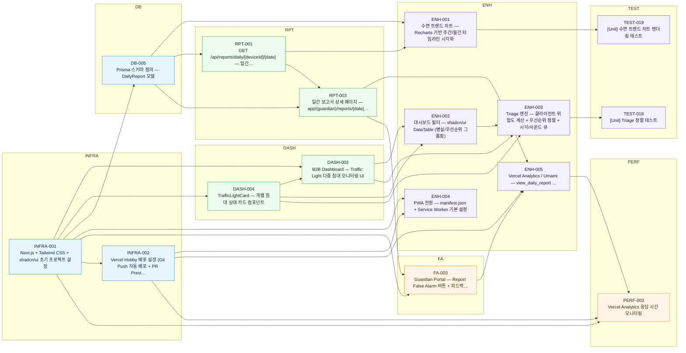
```mermaid
flowchart LR
  subgraph INFRA[INFRA]
    N_INFRA_001["INFRA-001<br/>Next.js + Tailwind CSS + shadcn/ui 초기 프로젝트 설정"]
    N_INFRA_002["INFRA-002<br/>Vercel Hobby 배포 설정 (Git Push 자동 배포 + PR Previ…"]
  end
  subgraph DB[DB]
    N_DB_005["DB-005<br/>Prisma 스키마 정의 — DailyReport 모델"]
  end
  subgraph DASH[DASH]
    N_DASH_002["DASH-002<br/>B2B Dashboard — Traffic Light 다중 침대 모니터링 UI"]
    N_DASH_004["DASH-004<br/>TrafficLightCard — 개별 침대 상태 카드 컴포넌트"]
  end
  subgraph RPT[RPT]
    N_RPT_001["RPT-001<br/>GET /api/reports/daily/[deviceId]/[date] — 일간…"]
    N_RPT_003["RPT-003<br/>일간 보고서 상세 페이지 — app/(guardian)/reports/[date]…"]
  end
  subgraph FA[FA]
    N_FA_003["FA-003<br/>Guardian Portal — Report False Alarm 버튼 + 피드백…"]
  end
  subgraph PERF[PERF]
    N_PERF_003["PERF-003<br/>Vercel Analytics 응답 시간 모니터링"]
  end
  subgraph ENH[ENH]
    N_ENH_001["ENH-001<br/>수면 트렌드 차트 — Recharts 기반 주간/월간 타임라인 시각화"]
    N_ENH_002["ENH-002<br/>대시보드 필터 — shadcn/ui DataTable (병실/우선순위 그룹핑)"]
    N_ENH_003["ENH-003<br/>Triage 엔진 — 클라이언트 위험도 계산 + 우선순위 정렬 + 시각/사운드 큐"]
    N_ENH_004["ENH-004<br/>PWA 전환 — manifest.json + Service Worker 기본 설정"]
    N_ENH_005["ENH-005<br/>Vercel Analytics / Umami — view_daily_report …"]
  end
  subgraph TEST[TEST]
    N_TEST_018["TEST-018<br/>[Unit] Triage 정렬 테스트"]
    N_TEST_019["TEST-019<br/>[Unit] 수면 트렌드 차트 렌더링 테스트"]
  end
  N_DASH_002 --> N_ENH_002
  N_DASH_002 --> N_ENH_003
  N_DASH_004 --> N_DASH_002
  N_DASH_004 --> N_ENH_002
  N_DASH_004 --> N_ENH_003
  N_DB_005 --> N_ENH_001
  N_DB_005 --> N_RPT_001
  N_DB_005 --> N_RPT_003
  N_ENH_001 --> N_TEST_019
  N_ENH_002 --> N_ENH_003
  N_ENH_003 --> N_TEST_018
  N_ENH_005 --> N_PERF_003
  N_FA_003 --> N_ENH_005
  N_INFRA_001 --> N_DASH_002
  N_INFRA_001 --> N_DASH_004
  N_INFRA_001 --> N_DB_005
  N_INFRA_001 --> N_ENH_004
  N_INFRA_001 --> N_FA_003
  N_INFRA_001 --> N_INFRA_002
  N_INFRA_001 --> N_PERF_003
  N_INFRA_002 --> N_ENH_004
  N_INFRA_002 --> N_ENH_005
  N_INFRA_002 --> N_PERF_003
  N_RPT_001 --> N_ENH_001
  N_RPT_001 --> N_RPT_003
  N_RPT_003 --> N_ENH_005
  N_RPT_003 --> N_FA_003
  classDef p0 fill:#e7f5ff,stroke:#1c7ed6,color:#0b2545
  classDef p1 fill:#ebfbee,stroke:#2f9e44,color:#102a14
  classDef p2 fill:#fff4e6,stroke:#f08c00,color:#3b2500
  classDef p3 fill:#f3f0ff,stroke:#7048e8,color:#21123d
  classDef px fill:#f8f9fa,stroke:#868e96,color:#212529
  class N_INFRA_001 p0
  class N_INFRA_002 p0
  class N_DB_005 p0
  class N_DASH_002 p1
  class N_DASH_004 p1
  class N_RPT_001 p1
  class N_RPT_003 p1
  class N_FA_003 p2
  class N_PERF_003 p2
  class N_ENH_001 p3
  class N_ENH_002 p3
  class N_ENH_003 p3
  class N_ENH_004 p3
  class N_ENH_005 p3
  class N_TEST_018 p3
  class N_TEST_019 p3
```

## Epic별 상세 다이어그램

### INFRA


```mermaid
flowchart LR
  subgraph INFRA[INFRA]
    N_INFRA_001["INFRA-001<br/>Next.js + Tailwind CSS + shadcn/ui 초기 프로젝트 설정"]
    N_INFRA_002["INFRA-002<br/>Vercel Hobby 배포 설정 (Git Push 자동 배포 + PR Previ…"]
    N_INFRA_003["INFRA-003<br/>Vercel Cron Job 설정 (1일 1회, Hobby 제한)"]
    N_INFRA_004["INFRA-004<br/>환경 변수 8개 설정 (.env.local / .env.example)"]
    N_INFRA_005["INFRA-005<br/>Supabase Free 7일 비활성 일시정지 방지 설정"]
  end
  subgraph DB[DB]
    N_DB_001["DB-001<br/>Prisma 스키마 정의 — SensorDevice 모델"]
    N_DB_002["DB-002<br/>Prisma 스키마 정의 — WellnessEvent 모델"]
    N_DB_003["DB-003<br/>Prisma 스키마 정의 — UserAccount 모델"]
    N_DB_004["DB-004<br/>Prisma 스키마 정의 — UserDevice 조인 테이블"]
    N_DB_005["DB-005<br/>Prisma 스키마 정의 — DailyReport 모델"]
    N_DB_006["DB-006<br/>Supabase Free PostgreSQL 연결 + Prisma Client 싱…"]
    N_DB_007["DB-007<br/>Prisma 마이그레이션 스크립트 생성 및 Supabase 배포 실행"]
  end
  subgraph AUTH[AUTH]
    N_AUTH_001["AUTH-001<br/>NextAuth.js 기본 설정 — JWT 싱글 인증 구성 + 데모 자격 증명"]
    N_AUTH_002["AUTH-002<br/>Login 페이지 UI — shadcn/ui Form 적용"]
  end
  subgraph DASH[DASH]
    N_DASH_002["DASH-002<br/>B2B Dashboard — Traffic Light 다중 침대 모니터링 UI"]
    N_DASH_004["DASH-004<br/>TrafficLightCard — 개별 침대 상태 카드 컴포넌트"]
  end
  subgraph RPT[RPT]
    N_RPT_002["RPT-002<br/>Guardian 홈 대시보드 — 일일 요약 + AI 서술 표시 UI"]
    N_RPT_004["RPT-004<br/>DailyReportCard — 일간 보고서 카드 컴포넌트 (AI 요약 포함)"]
    N_RPT_005["RPT-005<br/>AnomalyAlert — 이상 징후 경고 컴포넌트 (shadcn/ui Alert)"]
  end
  subgraph UI[UI]
    N_UI_001["UI-001<br/>Root Layout + 전역 스타일 + Landing 페이지 구성"]
    N_UI_002["UI-002<br/>Guardian Layout — 사이드바/네비게이션 구현"]
    N_UI_003["UI-003<br/>Admin Layout — 시설 관리자 네비게이션 구현"]
    N_UI_004["UI-004<br/>DeviceStatusIndicator — 디바이스 상태 표시 공유 컴포넌트"]
  end
  subgraph PIPE[PIPE]
    N_PIPE_007["PIPE-007<br/>Vercel Cron Job → generateDailyReport 트리거 연동"]
  end
  subgraph AI[AI]
    N_AI_001["AI-001<br/>lib/ai.ts — Vercel AI SDK + @ai-sdk/google (G…"]
  end
  subgraph EMAIL[EMAIL]
    N_EMAIL_001["EMAIL-001<br/>lib/email.ts — Resend API 이메일 유틸리티 설정"]
  end
  subgraph FA[FA]
    N_FA_003["FA-003<br/>Guardian Portal — Report False Alarm 버튼 + 피드백…"]
  end
  subgraph OPS[OPS]
    N_OPS_001["OPS-001<br/>lib/slack.ts — Slack/Discord Incoming Webhook…"]
  end
  subgraph SEC[SEC]
    N_SEC_001["SEC-001<br/>TLS 1.3 Vercel 인증서 검증"]
    N_SEC_003["SEC-003<br/>규제 키워드 Linter GitHub Actions CI"]
  end
  subgraph PERF[PERF]
    N_PERF_001["PERF-001<br/>E2E 응답 지연 p95 ≤ 5,000ms 검증"]
    N_PERF_002["PERF-002<br/>50 동시 디바이스 스트레스 테스트"]
    N_PERF_003["PERF-003<br/>Vercel Analytics 응답 시간 모니터링"]
  end
  subgraph AVAIL[AVAIL]
    N_AVAIL_001["AVAIL-001<br/>UptimeRobot Free 합성 모니터링 (5분 간격)"]
    N_AVAIL_002["AVAIL-002<br/>Vercel + Supabase $0 비용 확인 프로세스"]
  end
  subgraph ENH[ENH]
    N_ENH_004["ENH-004<br/>PWA 전환 — manifest.json + Service Worker 기본 설정"]
    N_ENH_005["ENH-005<br/>Vercel Analytics / Umami — view_daily_report …"]
  end
  N_AUTH_001 --> N_AUTH_002
  N_AUTH_001 --> N_UI_002
  N_AUTH_001 --> N_UI_003
  N_AVAIL_001 --> N_AVAIL_002
  N_DASH_004 --> N_DASH_002
  N_DB_001 --> N_DB_002
  N_DB_001 --> N_DB_004
  N_DB_001 --> N_DB_005
  N_DB_001 --> N_DB_006
  N_DB_001 --> N_DB_007
  N_DB_001 --> N_PERF_001
  N_DB_001 --> N_UI_004
  N_DB_002 --> N_DB_006
  N_DB_002 --> N_DB_007
  N_DB_002 --> N_PERF_001
  N_DB_003 --> N_AUTH_001
  N_DB_003 --> N_DB_004
  N_DB_003 --> N_DB_006
  N_DB_003 --> N_DB_007
  N_DB_003 --> N_PERF_001
  N_DB_004 --> N_DB_006
  N_DB_004 --> N_DB_007
  N_DB_004 --> N_PERF_001
  N_DB_005 --> N_DB_006
  N_DB_005 --> N_DB_007
  N_DB_005 --> N_PERF_001
  N_DB_005 --> N_PIPE_007
  N_DB_005 --> N_RPT_002
  N_DB_005 --> N_RPT_004
  N_DB_005 --> N_RPT_005
  N_DB_006 --> N_DB_007
  N_DB_007 --> N_INFRA_005
  N_ENH_005 --> N_PERF_003
  N_FA_003 --> N_ENH_005
  N_INFRA_001 --> N_AUTH_001
  N_INFRA_001 --> N_AUTH_002
  N_INFRA_001 --> N_AVAIL_001
  N_INFRA_001 --> N_AVAIL_002
  N_INFRA_001 --> N_DASH_002
  N_INFRA_001 --> N_DASH_004
  N_INFRA_001 --> N_DB_001
  N_INFRA_001 --> N_DB_002
  N_INFRA_001 --> N_DB_003
  N_INFRA_001 --> N_DB_004
  N_INFRA_001 --> N_DB_005
  N_INFRA_001 --> N_DB_006
  N_INFRA_001 --> N_ENH_004
  N_INFRA_001 --> N_FA_003
  N_INFRA_001 --> N_INFRA_002
  N_INFRA_001 --> N_INFRA_003
  N_INFRA_001 --> N_INFRA_004
  N_INFRA_001 --> N_PERF_001
  N_INFRA_001 --> N_PERF_002
  N_INFRA_001 --> N_PERF_003
  N_INFRA_001 --> N_RPT_002
  N_INFRA_001 --> N_RPT_004
  N_INFRA_001 --> N_RPT_005
  N_INFRA_001 --> N_SEC_001
  N_INFRA_001 --> N_UI_001
  N_INFRA_001 --> N_UI_002
  N_INFRA_001 --> N_UI_003
  N_INFRA_001 --> N_UI_004
  N_INFRA_002 --> N_AVAIL_001
  N_INFRA_002 --> N_AVAIL_002
  N_INFRA_002 --> N_ENH_004
  N_INFRA_002 --> N_ENH_005
  N_INFRA_002 --> N_INFRA_003
  N_INFRA_002 --> N_INFRA_005
  N_INFRA_002 --> N_PERF_002
  N_INFRA_002 --> N_PERF_003
  N_INFRA_002 --> N_SEC_001
  N_INFRA_003 --> N_PIPE_007
  N_INFRA_003 --> N_SEC_003
  N_INFRA_004 --> N_AI_001
  N_INFRA_004 --> N_AUTH_001
  N_INFRA_004 --> N_AVAIL_001
  N_INFRA_004 --> N_DB_006
  N_INFRA_004 --> N_EMAIL_001
  N_INFRA_004 --> N_OPS_001
  N_INFRA_004 --> N_PIPE_007
  N_INFRA_005 --> N_AVAIL_001
  N_RPT_002 --> N_FA_003
  N_RPT_004 --> N_RPT_002
  N_RPT_005 --> N_RPT_002
  N_UI_001 --> N_AUTH_002
  N_UI_001 --> N_UI_002
  N_UI_001 --> N_UI_003
  N_UI_002 --> N_FA_003
  N_UI_002 --> N_RPT_002
  N_UI_003 --> N_DASH_002
  N_UI_004 --> N_DASH_004
  N_UI_004 --> N_UI_002
  classDef p0 fill:#e7f5ff,stroke:#1c7ed6,color:#0b2545
  classDef p1 fill:#ebfbee,stroke:#2f9e44,color:#102a14
  classDef p2 fill:#fff4e6,stroke:#f08c00,color:#3b2500
  classDef p3 fill:#f3f0ff,stroke:#7048e8,color:#21123d
  classDef px fill:#f8f9fa,stroke:#868e96,color:#212529
  class N_INFRA_001 p0
  class N_INFRA_002 p0
  class N_INFRA_003 p0
  class N_INFRA_004 p0
  class N_INFRA_005 p0
  class N_DB_001 p0
  class N_DB_002 p0
  class N_DB_003 p0
  class N_DB_004 p0
  class N_DB_005 p0
  class N_DB_006 p0
  class N_DB_007 p0
  class N_AUTH_001 p1
  class N_AUTH_002 p1
  class N_DASH_002 p1
  class N_DASH_004 p1
  class N_RPT_002 p1
  class N_RPT_004 p1
  class N_RPT_005 p1
  class N_UI_001 p1
  class N_UI_002 p1
  class N_UI_003 p1
  class N_UI_004 p1
  class N_PIPE_007 p2
  class N_AI_001 p2
  class N_EMAIL_001 p2
  class N_FA_003 p2
  class N_OPS_001 p2
  class N_SEC_001 p0
  class N_SEC_003 p0
  class N_PERF_001 p1
  class N_PERF_002 p1
  class N_PERF_003 p2
  class N_AVAIL_001 p1
  class N_AVAIL_002 p1
  class N_ENH_004 p3
  class N_ENH_005 p3
```

### DB


```mermaid
flowchart LR
  subgraph INFRA[INFRA]
    N_INFRA_001["INFRA-001<br/>Next.js + Tailwind CSS + shadcn/ui 초기 프로젝트 설정"]
    N_INFRA_004["INFRA-004<br/>환경 변수 8개 설정 (.env.local / .env.example)"]
    N_INFRA_005["INFRA-005<br/>Supabase Free 7일 비활성 일시정지 방지 설정"]
  end
  subgraph DB[DB]
    N_DB_001["DB-001<br/>Prisma 스키마 정의 — SensorDevice 모델"]
    N_DB_002["DB-002<br/>Prisma 스키마 정의 — WellnessEvent 모델"]
    N_DB_003["DB-003<br/>Prisma 스키마 정의 — UserAccount 모델"]
    N_DB_004["DB-004<br/>Prisma 스키마 정의 — UserDevice 조인 테이블"]
    N_DB_005["DB-005<br/>Prisma 스키마 정의 — DailyReport 모델"]
    N_DB_006["DB-006<br/>Supabase Free PostgreSQL 연결 + Prisma Client 싱…"]
    N_DB_007["DB-007<br/>Prisma 마이그레이션 스크립트 생성 및 Supabase 배포 실행"]
    N_DB_008["DB-008<br/>30일 초과 데이터 자동 삭제 SQL/Prisma 쿼리 작성"]
  end
  subgraph API[API]
    N_API_001["API-001<br/>POST /api/events/ingest — Request/Response DT…"]
    N_API_002["API-002<br/>GET /api/reports/daily/[deviceId]/[date] — Re…"]
    N_API_003["API-003<br/>GET /api/dashboard/status — Response DTO + JW…"]
    N_API_004["API-004<br/>POST /api/devices/[deviceId]/heartbeat — Requ…"]
    N_API_005["API-005<br/>POST /api/events/[eventId]/false-alarm — Requ…"]
    N_API_006["API-006<br/>POST /api/ai/wellness-summary — Request/Respo…"]
    N_API_008["API-008<br/>Server Action 인터페이스 정의 — 4개 Core Server Actio…"]
  end
  subgraph MOCK[MOCK]
    N_MOCK_001["MOCK-001<br/>prisma/seed.ts — Mock SensorDevice + UserAcco…"]
    N_MOCK_002["MOCK-002<br/>prisma/seed.ts — Mock WellnessEvent 7일치 생성"]
    N_MOCK_003["MOCK-003<br/>prisma/seed.ts — Mock DailyReport 7일치 생성"]
  end
  subgraph AUTH[AUTH]
    N_AUTH_001["AUTH-001<br/>NextAuth.js 기본 설정 — JWT 싱글 인증 구성 + 데모 자격 증명"]
    N_AUTH_003["AUTH-003<br/>Register 페이지 UI — shadcn/ui Form 적용"]
  end
  subgraph EVT[EVT]
    N_EVT_001["EVT-001<br/>POST /api/events/ingest/route.ts — API Route …"]
    N_EVT_002["EVT-002<br/>createWellnessEvent Server Action 구현"]
  end
  subgraph HB[HB]
    N_HB_001["HB-001<br/>POST /api/devices/[deviceId]/heartbeat/route.…"]
    N_HB_002["HB-002<br/>updateDeviceStatus Server Action 구현"]
    N_HB_003["HB-003<br/>15분 초과 Heartbeat 미수신 디바이스 식별 로직"]
    N_HB_004["HB-004<br/>15분 이상 Heartbeat 미수신 시 디바이스 INACTIVE 상태 업데이트"]
  end
  subgraph DASH[DASH]
    N_DASH_001["DASH-001<br/>GET /api/dashboard/status — 전체 디바이스 상태 + 최신 이…"]
    N_DASH_005["DASH-005<br/>이벤트 로그 역추적 조회 — 30일 범위 날짜 검색"]
  end
  subgraph RPT[RPT]
    N_RPT_001["RPT-001<br/>GET /api/reports/daily/[deviceId]/[date] — 일간…"]
    N_RPT_002["RPT-002<br/>Guardian 홈 대시보드 — 일일 요약 + AI 서술 표시 UI"]
    N_RPT_003["RPT-003<br/>일간 보고서 상세 페이지 — app/(guardian)/reports/[date]…"]
    N_RPT_004["RPT-004<br/>DailyReportCard — 일간 보고서 카드 컴포넌트 (AI 요약 포함)"]
    N_RPT_005["RPT-005<br/>AnomalyAlert — 이상 징후 경고 컴포넌트 (shadcn/ui Alert)"]
  end
  subgraph UI[UI]
    N_UI_004["UI-004<br/>DeviceStatusIndicator — 디바이스 상태 표시 공유 컴포넌트"]
  end
  subgraph PIPE[PIPE]
    N_PIPE_001["PIPE-001<br/>generateDailyReport Server Action — 전일 데이터 집계…"]
    N_PIPE_002["PIPE-002<br/>generateDailyReport — 수면 점수(sleepScore) 계산 로직"]
    N_PIPE_003["PIPE-003<br/>generateDailyReport — 화장실 방문 횟수 카운팅 + 이상치 필터링"]
    N_PIPE_004["PIPE-004<br/>generateDailyReport — 이상 징후 감지 (체류 시간 평균 +50%)"]
    N_PIPE_005["PIPE-005<br/>generateDailyReport — 데이터 부족 처리 (INSUFFICIENT…"]
    N_PIPE_006["PIPE-006<br/>generateDailyReport — Prisma dailyReport.crea…"]
    N_PIPE_007["PIPE-007<br/>Vercel Cron Job → generateDailyReport 트리거 연동"]
  end
  subgraph EMAIL[EMAIL]
    N_EMAIL_002["EMAIL-002<br/>일간 보고서 생성 완료 시 Guardian 이메일 알림 (sendDailyRepo…"]
    N_EMAIL_003["EMAIL-003<br/>디바이스 15분 오프라인 시 Guardian 이메일 알림 (sendOfflineA…"]
    N_EMAIL_004["EMAIL-004<br/>긴급 이벤트(EMERGENCY) 수신 시 Guardian 이메일 알림 (sendE…"]
  end
  subgraph FA[FA]
    N_FA_001["FA-001<br/>POST /api/events/[eventId]/false-alarm — 거짓 경…"]
    N_FA_002["FA-002<br/>updateFalseAlarmFlag Server Action — isFalseA…"]
  end
  subgraph SEC[SEC]
    N_SEC_002["SEC-002<br/>Prisma 스키마 PII 필드 0건 검증"]
  end
  subgraph PERF[PERF]
    N_PERF_001["PERF-001<br/>E2E 응답 지연 p95 ≤ 5,000ms 검증"]
  end
  subgraph AVAIL[AVAIL]
    N_AVAIL_002["AVAIL-002<br/>Vercel + Supabase $0 비용 확인 프로세스"]
  end
  subgraph ENH[ENH]
    N_ENH_001["ENH-001<br/>수면 트렌드 차트 — Recharts 기반 주간/월간 타임라인 시각화"]
  end
  subgraph TEST[TEST]
    N_TEST_002["TEST-002<br/>[Unit] Prisma 스키마 무결성 테스트"]
    N_TEST_007["TEST-007<br/>[Unit] 30일 초과 데이터 삭제 테스트"]
    N_TEST_011["TEST-011<br/>[Unit] generateDailyReport 데이터 부족 처리 테스트"]
    N_TEST_012["TEST-012<br/>[Unit] generateDailyReport 이상치 필터링 테스트"]
  end
  N_API_001 --> N_EVT_001
  N_API_001 --> N_EVT_002
  N_API_002 --> N_RPT_001
  N_API_002 --> N_RPT_002
  N_API_002 --> N_RPT_003
  N_API_002 --> N_RPT_004
  N_API_002 --> N_RPT_005
  N_API_003 --> N_DASH_001
  N_API_004 --> N_HB_001
  N_API_004 --> N_HB_002
  N_API_004 --> N_HB_003
  N_API_004 --> N_HB_004
  N_API_005 --> N_FA_001
  N_API_005 --> N_FA_002
  N_API_006 --> N_PIPE_005
  N_API_008 --> N_EVT_002
  N_API_008 --> N_FA_002
  N_API_008 --> N_HB_001
  N_API_008 --> N_HB_002
  N_API_008 --> N_PIPE_001
  N_API_008 --> N_PIPE_002
  N_API_008 --> N_PIPE_003
  N_API_008 --> N_PIPE_004
  N_API_008 --> N_PIPE_005
  N_API_008 --> N_PIPE_006
  N_AUTH_001 --> N_AUTH_003
  N_AUTH_001 --> N_DASH_001
  N_AUTH_001 --> N_DASH_005
  N_AUTH_001 --> N_FA_001
  N_AUTH_001 --> N_RPT_001
  N_DASH_001 --> N_DASH_005
  N_DB_001 --> N_API_003
  N_DB_001 --> N_API_004
  N_DB_001 --> N_API_008
  N_DB_001 --> N_DASH_001
  N_DB_001 --> N_DB_002
  N_DB_001 --> N_DB_004
  N_DB_001 --> N_DB_005
  N_DB_001 --> N_DB_006
  N_DB_001 --> N_DB_007
  N_DB_001 --> N_EMAIL_003
  N_DB_001 --> N_HB_002
  N_DB_001 --> N_PERF_001
  N_DB_001 --> N_SEC_002
  N_DB_001 --> N_UI_004
  N_DB_002 --> N_API_001
  N_DB_002 --> N_API_003
  N_DB_002 --> N_API_005
  N_DB_002 --> N_API_008
  N_DB_002 --> N_DASH_001
  N_DB_002 --> N_DASH_005
  N_DB_002 --> N_DB_006
  N_DB_002 --> N_DB_007
  N_DB_002 --> N_DB_008
  N_DB_002 --> N_EVT_001
  N_DB_002 --> N_EVT_002
  N_DB_002 --> N_FA_001
  N_DB_002 --> N_FA_002
  N_DB_002 --> N_MOCK_002
  N_DB_002 --> N_PERF_001
  N_DB_002 --> N_PIPE_002
  N_DB_002 --> N_PIPE_003
  N_DB_002 --> N_SEC_002
  N_DB_003 --> N_API_008
  N_DB_003 --> N_AUTH_001
  N_DB_003 --> N_AUTH_003
  N_DB_003 --> N_DB_004
  N_DB_003 --> N_DB_006
  N_DB_003 --> N_DB_007
  N_DB_003 --> N_EMAIL_002
  N_DB_003 --> N_EMAIL_003
  N_DB_003 --> N_EMAIL_004
  N_DB_003 --> N_MOCK_001
  N_DB_003 --> N_PERF_001
  N_DB_003 --> N_SEC_002
  N_DB_004 --> N_API_008
  N_DB_004 --> N_DB_006
  N_DB_004 --> N_DB_007
  N_DB_004 --> N_EMAIL_002
  N_DB_004 --> N_MOCK_001
  N_DB_004 --> N_PERF_001
  N_DB_004 --> N_SEC_002
  N_DB_005 --> N_API_002
  N_DB_005 --> N_API_006
  N_DB_005 --> N_API_008
  N_DB_005 --> N_DB_006
  N_DB_005 --> N_DB_007
  N_DB_005 --> N_ENH_001
  N_DB_005 --> N_MOCK_003
  N_DB_005 --> N_PERF_001
  N_DB_005 --> N_PIPE_001
  N_DB_005 --> N_PIPE_002
  N_DB_005 --> N_PIPE_003
  N_DB_005 --> N_PIPE_004
  N_DB_005 --> N_PIPE_005
  N_DB_005 --> N_PIPE_006
  N_DB_005 --> N_PIPE_007
  N_DB_005 --> N_RPT_001
  N_DB_005 --> N_RPT_002
  N_DB_005 --> N_RPT_003
  N_DB_005 --> N_RPT_004
  N_DB_005 --> N_RPT_005
  N_DB_005 --> N_SEC_002
  N_DB_005 --> N_TEST_011
  N_DB_005 --> N_TEST_012
  N_DB_006 --> N_DB_007
  N_DB_007 --> N_DASH_001
  N_DB_007 --> N_DASH_005
  N_DB_007 --> N_DB_008
  N_DB_007 --> N_EVT_001
  N_DB_007 --> N_EVT_002
  N_DB_007 --> N_FA_002
  N_DB_007 --> N_HB_001
  N_DB_007 --> N_HB_002
  N_DB_007 --> N_HB_003
  N_DB_007 --> N_HB_004
  N_DB_007 --> N_INFRA_005
  N_DB_007 --> N_MOCK_001
  N_DB_007 --> N_MOCK_002
  N_DB_007 --> N_MOCK_003
  N_DB_007 --> N_PIPE_001
  N_DB_007 --> N_RPT_001
  N_DB_007 --> N_TEST_002
  N_DB_008 --> N_AVAIL_002
  N_DB_008 --> N_DASH_005
  N_DB_008 --> N_TEST_007
  N_EVT_001 --> N_EMAIL_004
  N_EVT_002 --> N_EMAIL_004
  N_EVT_002 --> N_EVT_001
  N_EVT_002 --> N_PIPE_001
  N_FA_002 --> N_FA_001
  N_HB_001 --> N_HB_003
  N_HB_001 --> N_HB_004
  N_HB_002 --> N_HB_001
  N_HB_002 --> N_HB_003
  N_HB_002 --> N_HB_004
  N_HB_003 --> N_EMAIL_003
  N_HB_003 --> N_HB_004
  N_HB_004 --> N_DASH_001
  N_HB_004 --> N_EMAIL_003
  N_INFRA_001 --> N_AUTH_001
  N_INFRA_001 --> N_AVAIL_002
  N_INFRA_001 --> N_DB_001
  N_INFRA_001 --> N_DB_002
  N_INFRA_001 --> N_DB_003
  N_INFRA_001 --> N_DB_004
  N_INFRA_001 --> N_DB_005
  N_INFRA_001 --> N_DB_006
  N_INFRA_001 --> N_INFRA_004
  N_INFRA_001 --> N_PERF_001
  N_INFRA_001 --> N_RPT_002
  N_INFRA_001 --> N_RPT_004
  N_INFRA_001 --> N_RPT_005
  N_INFRA_001 --> N_UI_004
  N_INFRA_004 --> N_AUTH_001
  N_INFRA_004 --> N_DB_006
  N_INFRA_004 --> N_PIPE_007
  N_MOCK_001 --> N_AUTH_001
  N_MOCK_001 --> N_MOCK_002
  N_MOCK_001 --> N_MOCK_003
  N_MOCK_002 --> N_MOCK_003
  N_MOCK_003 --> N_RPT_001
  N_MOCK_003 --> N_RPT_002
  N_MOCK_003 --> N_RPT_003
  N_MOCK_003 --> N_RPT_004
  N_MOCK_003 --> N_RPT_005
  N_PIPE_001 --> N_EMAIL_002
  N_PIPE_001 --> N_PIPE_002
  N_PIPE_001 --> N_PIPE_003
  N_PIPE_001 --> N_PIPE_004
  N_PIPE_001 --> N_PIPE_005
  N_PIPE_001 --> N_PIPE_006
  N_PIPE_001 --> N_PIPE_007
  N_PIPE_002 --> N_PIPE_006
  N_PIPE_003 --> N_PIPE_004
  N_PIPE_003 --> N_PIPE_006
  N_PIPE_003 --> N_TEST_012
  N_PIPE_004 --> N_PIPE_006
  N_PIPE_005 --> N_PIPE_006
  N_PIPE_005 --> N_TEST_011
  N_PIPE_006 --> N_EMAIL_002
  N_PIPE_006 --> N_PIPE_007
  N_PIPE_007 --> N_EMAIL_002
  N_RPT_001 --> N_ENH_001
  N_RPT_001 --> N_RPT_002
  N_RPT_001 --> N_RPT_003
  N_RPT_004 --> N_RPT_002
  N_RPT_004 --> N_RPT_003
  N_RPT_005 --> N_RPT_002
  N_RPT_005 --> N_RPT_003
  N_TEST_011 --> N_PIPE_006
  N_TEST_012 --> N_PIPE_006
  classDef p0 fill:#e7f5ff,stroke:#1c7ed6,color:#0b2545
  classDef p1 fill:#ebfbee,stroke:#2f9e44,color:#102a14
  classDef p2 fill:#fff4e6,stroke:#f08c00,color:#3b2500
  classDef p3 fill:#f3f0ff,stroke:#7048e8,color:#21123d
  classDef px fill:#f8f9fa,stroke:#868e96,color:#212529
  class N_INFRA_001 p0
  class N_INFRA_004 p0
  class N_INFRA_005 p0
  class N_DB_001 p0
  class N_DB_002 p0
  class N_DB_003 p0
  class N_DB_004 p0
  class N_DB_005 p0
  class N_DB_006 p0
  class N_DB_007 p0
  class N_DB_008 p0
  class N_API_001 p0
  class N_API_002 p1
  class N_API_003 p1
  class N_API_004 p1
  class N_API_005 p2
  class N_API_006 p2
  class N_API_008 p0
  class N_MOCK_001 p0
  class N_MOCK_002 p0
  class N_MOCK_003 p0
  class N_AUTH_001 p1
  class N_AUTH_003 p1
  class N_EVT_001 p0
  class N_EVT_002 p0
  class N_HB_001 p1
  class N_HB_002 p1
  class N_HB_003 p1
  class N_HB_004 p1
  class N_DASH_001 p1
  class N_DASH_005 p1
  class N_RPT_001 p1
  class N_RPT_002 p1
  class N_RPT_003 p1
  class N_RPT_004 p1
  class N_RPT_005 p1
  class N_UI_004 p1
  class N_PIPE_001 p2
  class N_PIPE_002 p2
  class N_PIPE_003 p2
  class N_PIPE_004 p2
  class N_PIPE_005 p2
  class N_PIPE_006 p2
  class N_PIPE_007 p2
  class N_EMAIL_002 p2
  class N_EMAIL_003 p2
  class N_EMAIL_004 p2
  class N_FA_001 p2
  class N_FA_002 p2
  class N_SEC_002 p0
  class N_PERF_001 p1
  class N_AVAIL_002 p1
  class N_ENH_001 p3
  class N_TEST_002 p0
  class N_TEST_007 p0
  class N_TEST_011 p2
  class N_TEST_012 p2
```

### API


```mermaid
flowchart LR
  subgraph DB[DB]
    N_DB_001["DB-001<br/>Prisma 스키마 정의 — SensorDevice 모델"]
    N_DB_002["DB-002<br/>Prisma 스키마 정의 — WellnessEvent 모델"]
    N_DB_003["DB-003<br/>Prisma 스키마 정의 — UserAccount 모델"]
    N_DB_004["DB-004<br/>Prisma 스키마 정의 — UserDevice 조인 테이블"]
    N_DB_005["DB-005<br/>Prisma 스키마 정의 — DailyReport 모델"]
  end
  subgraph API[API]
    N_API_001["API-001<br/>POST /api/events/ingest — Request/Response DT…"]
    N_API_002["API-002<br/>GET /api/reports/daily/[deviceId]/[date] — Re…"]
    N_API_003["API-003<br/>GET /api/dashboard/status — Response DTO + JW…"]
    N_API_004["API-004<br/>POST /api/devices/[deviceId]/heartbeat — Requ…"]
    N_API_005["API-005<br/>POST /api/events/[eventId]/false-alarm — Requ…"]
    N_API_006["API-006<br/>POST /api/ai/wellness-summary — Request/Respo…"]
    N_API_007["API-007<br/>POST /api/mock/generate — Mock 이벤트 자동 생성 API …"]
    N_API_008["API-008<br/>Server Action 인터페이스 정의 — 4개 Core Server Actio…"]
  end
  subgraph MOCK[MOCK]
    N_MOCK_001["MOCK-001<br/>prisma/seed.ts — Mock SensorDevice + UserAcco…"]
    N_MOCK_004["MOCK-004<br/>POST /api/events/ingest — mock=true 자동 생성 모드 …"]
  end
  subgraph EVT[EVT]
    N_EVT_001["EVT-001<br/>POST /api/events/ingest/route.ts — API Route …"]
    N_EVT_002["EVT-002<br/>createWellnessEvent Server Action 구현"]
  end
  subgraph HB[HB]
    N_HB_001["HB-001<br/>POST /api/devices/[deviceId]/heartbeat/route.…"]
    N_HB_002["HB-002<br/>updateDeviceStatus Server Action 구현"]
    N_HB_003["HB-003<br/>15분 초과 Heartbeat 미수신 디바이스 식별 로직"]
    N_HB_004["HB-004<br/>15분 이상 Heartbeat 미수신 시 디바이스 INACTIVE 상태 업데이트"]
  end
  subgraph DASH[DASH]
    N_DASH_001["DASH-001<br/>GET /api/dashboard/status — 전체 디바이스 상태 + 최신 이…"]
    N_DASH_002["DASH-002<br/>B2B Dashboard — Traffic Light 다중 침대 모니터링 UI"]
    N_DASH_003["DASH-003<br/>Dashboard API Polling — 30초 간격 자동 갱신 구현"]
    N_DASH_004["DASH-004<br/>TrafficLightCard — 개별 침대 상태 카드 컴포넌트"]
  end
  subgraph RPT[RPT]
    N_RPT_001["RPT-001<br/>GET /api/reports/daily/[deviceId]/[date] — 일간…"]
    N_RPT_002["RPT-002<br/>Guardian 홈 대시보드 — 일일 요약 + AI 서술 표시 UI"]
    N_RPT_003["RPT-003<br/>일간 보고서 상세 페이지 — app/(guardian)/reports/[date]…"]
    N_RPT_004["RPT-004<br/>DailyReportCard — 일간 보고서 카드 컴포넌트 (AI 요약 포함)"]
    N_RPT_005["RPT-005<br/>AnomalyAlert — 이상 징후 경고 컴포넌트 (shadcn/ui Alert)"]
  end
  subgraph PIPE[PIPE]
    N_PIPE_001["PIPE-001<br/>generateDailyReport Server Action — 전일 데이터 집계…"]
    N_PIPE_002["PIPE-002<br/>generateDailyReport — 수면 점수(sleepScore) 계산 로직"]
    N_PIPE_003["PIPE-003<br/>generateDailyReport — 화장실 방문 횟수 카운팅 + 이상치 필터링"]
    N_PIPE_004["PIPE-004<br/>generateDailyReport — 이상 징후 감지 (체류 시간 평균 +50%)"]
    N_PIPE_005["PIPE-005<br/>generateDailyReport — 데이터 부족 처리 (INSUFFICIENT…"]
    N_PIPE_006["PIPE-006<br/>generateDailyReport — Prisma dailyReport.crea…"]
  end
  subgraph AI[AI]
    N_AI_001["AI-001<br/>lib/ai.ts — Vercel AI SDK + @ai-sdk/google (G…"]
    N_AI_002["AI-002<br/>POST /api/ai/wellness-summary — Gemini genera…"]
    N_AI_003["AI-003<br/>generateDailyReport 내 AI 요약 생성 통합 + Fallback"]
  end
  subgraph FA[FA]
    N_FA_001["FA-001<br/>POST /api/events/[eventId]/false-alarm — 거짓 경…"]
    N_FA_002["FA-002<br/>updateFalseAlarmFlag Server Action — isFalseA…"]
  end
  subgraph TEST[TEST]
    N_TEST_001["TEST-001<br/>[Unit] Event Ingestion 유효성 검증 테스트"]
    N_TEST_003["TEST-003<br/>[Unit] Mock Seed 데이터 생성 검증 테스트"]
    N_TEST_004["TEST-004<br/>[Unit] Daily Report 조회 API 테스트"]
    N_TEST_005["TEST-005<br/>[Unit] Dashboard Status API 테스트"]
    N_TEST_006["TEST-006<br/>[Unit] Heartbeat API 테스트"]
    N_TEST_009["TEST-009<br/>[Integration] B2B Dashboard Polling 통합 테스트"]
  end
  N_AI_001 --> N_AI_002
  N_AI_001 --> N_AI_003
  N_AI_002 --> N_AI_003
  N_API_001 --> N_API_007
  N_API_001 --> N_EVT_001
  N_API_001 --> N_EVT_002
  N_API_001 --> N_MOCK_004
  N_API_001 --> N_TEST_001
  N_API_002 --> N_RPT_001
  N_API_002 --> N_RPT_002
  N_API_002 --> N_RPT_003
  N_API_002 --> N_RPT_004
  N_API_002 --> N_RPT_005
  N_API_002 --> N_TEST_004
  N_API_003 --> N_DASH_001
  N_API_003 --> N_DASH_002
  N_API_003 --> N_DASH_003
  N_API_003 --> N_DASH_004
  N_API_003 --> N_TEST_005
  N_API_003 --> N_TEST_009
  N_API_004 --> N_HB_001
  N_API_004 --> N_HB_002
  N_API_004 --> N_HB_003
  N_API_004 --> N_HB_004
  N_API_004 --> N_TEST_006
  N_API_005 --> N_FA_001
  N_API_005 --> N_FA_002
  N_API_005 --> N_TEST_003
  N_API_006 --> N_AI_001
  N_API_006 --> N_AI_002
  N_API_006 --> N_AI_003
  N_API_006 --> N_PIPE_005
  N_API_007 --> N_MOCK_004
  N_API_008 --> N_EVT_002
  N_API_008 --> N_FA_002
  N_API_008 --> N_HB_001
  N_API_008 --> N_HB_002
  N_API_008 --> N_PIPE_001
  N_API_008 --> N_PIPE_002
  N_API_008 --> N_PIPE_003
  N_API_008 --> N_PIPE_004
  N_API_008 --> N_PIPE_005
  N_API_008 --> N_PIPE_006
  N_DASH_001 --> N_DASH_002
  N_DASH_001 --> N_DASH_003
  N_DASH_001 --> N_TEST_005
  N_DASH_002 --> N_DASH_003
  N_DASH_002 --> N_TEST_009
  N_DASH_003 --> N_TEST_009
  N_DASH_004 --> N_DASH_002
  N_DB_001 --> N_API_003
  N_DB_001 --> N_API_004
  N_DB_001 --> N_API_008
  N_DB_001 --> N_DASH_001
  N_DB_001 --> N_DB_002
  N_DB_001 --> N_DB_004
  N_DB_001 --> N_DB_005
  N_DB_001 --> N_HB_002
  N_DB_002 --> N_API_001
  N_DB_002 --> N_API_003
  N_DB_002 --> N_API_005
  N_DB_002 --> N_API_008
  N_DB_002 --> N_DASH_001
  N_DB_002 --> N_EVT_001
  N_DB_002 --> N_EVT_002
  N_DB_002 --> N_FA_001
  N_DB_002 --> N_FA_002
  N_DB_002 --> N_PIPE_002
  N_DB_002 --> N_PIPE_003
  N_DB_003 --> N_API_008
  N_DB_003 --> N_DB_004
  N_DB_003 --> N_MOCK_001
  N_DB_004 --> N_API_008
  N_DB_004 --> N_MOCK_001
  N_DB_005 --> N_API_002
  N_DB_005 --> N_API_006
  N_DB_005 --> N_API_008
  N_DB_005 --> N_PIPE_001
  N_DB_005 --> N_PIPE_002
  N_DB_005 --> N_PIPE_003
  N_DB_005 --> N_PIPE_004
  N_DB_005 --> N_PIPE_005
  N_DB_005 --> N_PIPE_006
  N_DB_005 --> N_RPT_001
  N_DB_005 --> N_RPT_002
  N_DB_005 --> N_RPT_003
  N_DB_005 --> N_RPT_004
  N_DB_005 --> N_RPT_005
  N_EVT_001 --> N_TEST_001
  N_EVT_002 --> N_EVT_001
  N_EVT_002 --> N_PIPE_001
  N_FA_002 --> N_FA_001
  N_HB_001 --> N_HB_003
  N_HB_001 --> N_HB_004
  N_HB_001 --> N_TEST_006
  N_HB_002 --> N_HB_001
  N_HB_002 --> N_HB_003
  N_HB_002 --> N_HB_004
  N_HB_002 --> N_TEST_006
  N_HB_003 --> N_HB_004
  N_HB_004 --> N_DASH_001
  N_MOCK_001 --> N_API_007
  N_MOCK_001 --> N_MOCK_004
  N_MOCK_001 --> N_TEST_003
  N_PIPE_001 --> N_AI_003
  N_PIPE_001 --> N_PIPE_002
  N_PIPE_001 --> N_PIPE_003
  N_PIPE_001 --> N_PIPE_004
  N_PIPE_001 --> N_PIPE_005
  N_PIPE_001 --> N_PIPE_006
  N_PIPE_002 --> N_PIPE_006
  N_PIPE_003 --> N_PIPE_004
  N_PIPE_003 --> N_PIPE_006
  N_PIPE_004 --> N_PIPE_006
  N_PIPE_005 --> N_PIPE_006
  N_PIPE_006 --> N_AI_003
  N_RPT_001 --> N_RPT_002
  N_RPT_001 --> N_RPT_003
  N_RPT_001 --> N_TEST_004
  N_RPT_002 --> N_TEST_009
  N_RPT_004 --> N_RPT_002
  N_RPT_004 --> N_RPT_003
  N_RPT_005 --> N_RPT_002
  N_RPT_005 --> N_RPT_003
  classDef p0 fill:#e7f5ff,stroke:#1c7ed6,color:#0b2545
  classDef p1 fill:#ebfbee,stroke:#2f9e44,color:#102a14
  classDef p2 fill:#fff4e6,stroke:#f08c00,color:#3b2500
  classDef p3 fill:#f3f0ff,stroke:#7048e8,color:#21123d
  classDef px fill:#f8f9fa,stroke:#868e96,color:#212529
  class N_DB_001 p0
  class N_DB_002 p0
  class N_DB_003 p0
  class N_DB_004 p0
  class N_DB_005 p0
  class N_API_001 p0
  class N_API_002 p1
  class N_API_003 p1
  class N_API_004 p1
  class N_API_005 p2
  class N_API_006 p2
  class N_API_007 p0
  class N_API_008 p0
  class N_MOCK_001 p0
  class N_MOCK_004 p0
  class N_EVT_001 p0
  class N_EVT_002 p0
  class N_HB_001 p1
  class N_HB_002 p1
  class N_HB_003 p1
  class N_HB_004 p1
  class N_DASH_001 p1
  class N_DASH_002 p1
  class N_DASH_003 p1
  class N_DASH_004 p1
  class N_RPT_001 p1
  class N_RPT_002 p1
  class N_RPT_003 p1
  class N_RPT_004 p1
  class N_RPT_005 p1
  class N_PIPE_001 p2
  class N_PIPE_002 p2
  class N_PIPE_003 p2
  class N_PIPE_004 p2
  class N_PIPE_005 p2
  class N_PIPE_006 p2
  class N_AI_001 p2
  class N_AI_002 p2
  class N_AI_003 p2
  class N_FA_001 p2
  class N_FA_002 p2
  class N_TEST_001 p0
  class N_TEST_003 p0
  class N_TEST_004 p1
  class N_TEST_005 p1
  class N_TEST_006 p0
  class N_TEST_009 p1
```

### MOCK

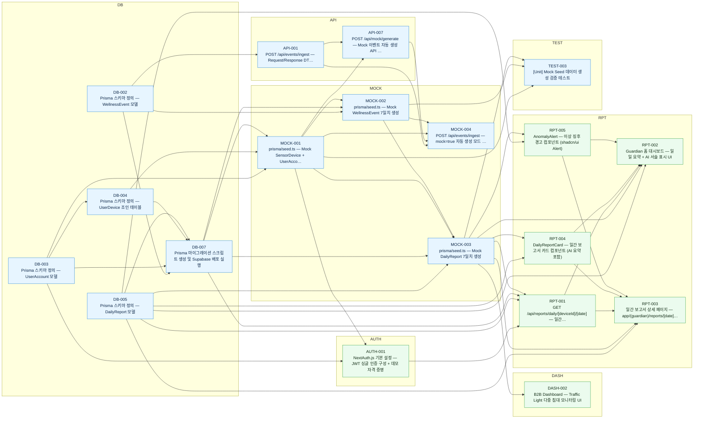
```mermaid
flowchart LR
  subgraph DB[DB]
    N_DB_002["DB-002<br/>Prisma 스키마 정의 — WellnessEvent 모델"]
    N_DB_003["DB-003<br/>Prisma 스키마 정의 — UserAccount 모델"]
    N_DB_004["DB-004<br/>Prisma 스키마 정의 — UserDevice 조인 테이블"]
    N_DB_005["DB-005<br/>Prisma 스키마 정의 — DailyReport 모델"]
    N_DB_007["DB-007<br/>Prisma 마이그레이션 스크립트 생성 및 Supabase 배포 실행"]
  end
  subgraph API[API]
    N_API_001["API-001<br/>POST /api/events/ingest — Request/Response DT…"]
    N_API_007["API-007<br/>POST /api/mock/generate — Mock 이벤트 자동 생성 API …"]
  end
  subgraph MOCK[MOCK]
    N_MOCK_001["MOCK-001<br/>prisma/seed.ts — Mock SensorDevice + UserAcco…"]
    N_MOCK_002["MOCK-002<br/>prisma/seed.ts — Mock WellnessEvent 7일치 생성"]
    N_MOCK_003["MOCK-003<br/>prisma/seed.ts — Mock DailyReport 7일치 생성"]
    N_MOCK_004["MOCK-004<br/>POST /api/events/ingest — mock=true 자동 생성 모드 …"]
  end
  subgraph AUTH[AUTH]
    N_AUTH_001["AUTH-001<br/>NextAuth.js 기본 설정 — JWT 싱글 인증 구성 + 데모 자격 증명"]
  end
  subgraph DASH[DASH]
    N_DASH_002["DASH-002<br/>B2B Dashboard — Traffic Light 다중 침대 모니터링 UI"]
  end
  subgraph RPT[RPT]
    N_RPT_001["RPT-001<br/>GET /api/reports/daily/[deviceId]/[date] — 일간…"]
    N_RPT_002["RPT-002<br/>Guardian 홈 대시보드 — 일일 요약 + AI 서술 표시 UI"]
    N_RPT_003["RPT-003<br/>일간 보고서 상세 페이지 — app/(guardian)/reports/[date]…"]
    N_RPT_004["RPT-004<br/>DailyReportCard — 일간 보고서 카드 컴포넌트 (AI 요약 포함)"]
    N_RPT_005["RPT-005<br/>AnomalyAlert — 이상 징후 경고 컴포넌트 (shadcn/ui Alert)"]
  end
  subgraph TEST[TEST]
    N_TEST_003["TEST-003<br/>[Unit] Mock Seed 데이터 생성 검증 테스트"]
  end
  N_API_001 --> N_API_007
  N_API_001 --> N_MOCK_004
  N_API_007 --> N_MOCK_004
  N_AUTH_001 --> N_RPT_001
  N_DB_002 --> N_API_001
  N_DB_002 --> N_DB_007
  N_DB_002 --> N_MOCK_002
  N_DB_003 --> N_AUTH_001
  N_DB_003 --> N_DB_004
  N_DB_003 --> N_DB_007
  N_DB_003 --> N_MOCK_001
  N_DB_004 --> N_DB_007
  N_DB_004 --> N_MOCK_001
  N_DB_005 --> N_DB_007
  N_DB_005 --> N_MOCK_003
  N_DB_005 --> N_RPT_001
  N_DB_005 --> N_RPT_002
  N_DB_005 --> N_RPT_003
  N_DB_005 --> N_RPT_004
  N_DB_005 --> N_RPT_005
  N_DB_007 --> N_MOCK_001
  N_DB_007 --> N_MOCK_002
  N_DB_007 --> N_MOCK_003
  N_DB_007 --> N_RPT_001
  N_MOCK_001 --> N_API_007
  N_MOCK_001 --> N_AUTH_001
  N_MOCK_001 --> N_MOCK_002
  N_MOCK_001 --> N_MOCK_003
  N_MOCK_001 --> N_MOCK_004
  N_MOCK_001 --> N_TEST_003
  N_MOCK_002 --> N_MOCK_003
  N_MOCK_002 --> N_MOCK_004
  N_MOCK_002 --> N_TEST_003
  N_MOCK_003 --> N_DASH_002
  N_MOCK_003 --> N_RPT_001
  N_MOCK_003 --> N_RPT_002
  N_MOCK_003 --> N_RPT_003
  N_MOCK_003 --> N_RPT_004
  N_MOCK_003 --> N_RPT_005
  N_MOCK_003 --> N_TEST_003
  N_RPT_001 --> N_RPT_002
  N_RPT_001 --> N_RPT_003
  N_RPT_004 --> N_RPT_002
  N_RPT_004 --> N_RPT_003
  N_RPT_005 --> N_RPT_002
  N_RPT_005 --> N_RPT_003
  classDef p0 fill:#e7f5ff,stroke:#1c7ed6,color:#0b2545
  classDef p1 fill:#ebfbee,stroke:#2f9e44,color:#102a14
  classDef p2 fill:#fff4e6,stroke:#f08c00,color:#3b2500
  classDef p3 fill:#f3f0ff,stroke:#7048e8,color:#21123d
  classDef px fill:#f8f9fa,stroke:#868e96,color:#212529
  class N_DB_002 p0
  class N_DB_003 p0
  class N_DB_004 p0
  class N_DB_005 p0
  class N_DB_007 p0
  class N_API_001 p0
  class N_API_007 p0
  class N_MOCK_001 p0
  class N_MOCK_002 p0
  class N_MOCK_003 p0
  class N_MOCK_004 p0
  class N_AUTH_001 p1
  class N_DASH_002 p1
  class N_RPT_001 p1
  class N_RPT_002 p1
  class N_RPT_003 p1
  class N_RPT_004 p1
  class N_RPT_005 p1
  class N_TEST_003 p0
```

### AUTH

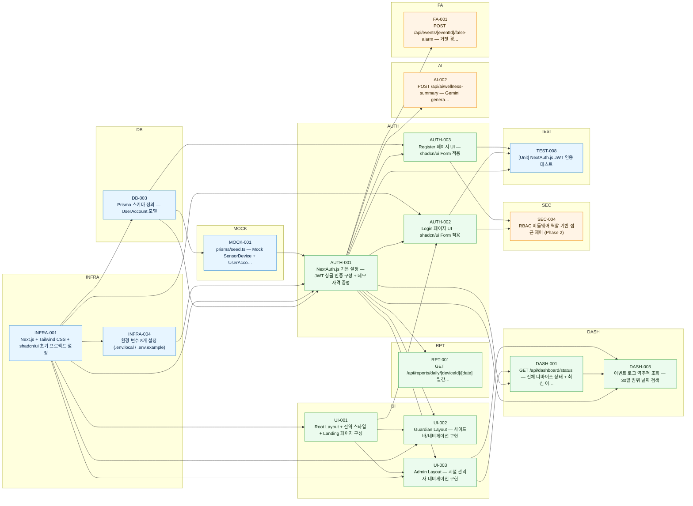
```mermaid
flowchart LR
  subgraph INFRA[INFRA]
    N_INFRA_001["INFRA-001<br/>Next.js + Tailwind CSS + shadcn/ui 초기 프로젝트 설정"]
    N_INFRA_004["INFRA-004<br/>환경 변수 8개 설정 (.env.local / .env.example)"]
  end
  subgraph DB[DB]
    N_DB_003["DB-003<br/>Prisma 스키마 정의 — UserAccount 모델"]
  end
  subgraph MOCK[MOCK]
    N_MOCK_001["MOCK-001<br/>prisma/seed.ts — Mock SensorDevice + UserAcco…"]
  end
  subgraph AUTH[AUTH]
    N_AUTH_001["AUTH-001<br/>NextAuth.js 기본 설정 — JWT 싱글 인증 구성 + 데모 자격 증명"]
    N_AUTH_002["AUTH-002<br/>Login 페이지 UI — shadcn/ui Form 적용"]
    N_AUTH_003["AUTH-003<br/>Register 페이지 UI — shadcn/ui Form 적용"]
  end
  subgraph DASH[DASH]
    N_DASH_001["DASH-001<br/>GET /api/dashboard/status — 전체 디바이스 상태 + 최신 이…"]
    N_DASH_005["DASH-005<br/>이벤트 로그 역추적 조회 — 30일 범위 날짜 검색"]
  end
  subgraph RPT[RPT]
    N_RPT_001["RPT-001<br/>GET /api/reports/daily/[deviceId]/[date] — 일간…"]
  end
  subgraph UI[UI]
    N_UI_001["UI-001<br/>Root Layout + 전역 스타일 + Landing 페이지 구성"]
    N_UI_002["UI-002<br/>Guardian Layout — 사이드바/네비게이션 구현"]
    N_UI_003["UI-003<br/>Admin Layout — 시설 관리자 네비게이션 구현"]
  end
  subgraph AI[AI]
    N_AI_002["AI-002<br/>POST /api/ai/wellness-summary — Gemini genera…"]
  end
  subgraph FA[FA]
    N_FA_001["FA-001<br/>POST /api/events/[eventId]/false-alarm — 거짓 경…"]
  end
  subgraph SEC[SEC]
    N_SEC_004["SEC-004<br/>RBAC 미들웨어 역할 기반 접근 제어 (Phase 2)"]
  end
  subgraph TEST[TEST]
    N_TEST_008["TEST-008<br/>[Unit] NextAuth.js JWT 인증 테스트"]
  end
  N_AUTH_001 --> N_AI_002
  N_AUTH_001 --> N_AUTH_002
  N_AUTH_001 --> N_AUTH_003
  N_AUTH_001 --> N_DASH_001
  N_AUTH_001 --> N_DASH_005
  N_AUTH_001 --> N_FA_001
  N_AUTH_001 --> N_RPT_001
  N_AUTH_001 --> N_TEST_008
  N_AUTH_001 --> N_UI_002
  N_AUTH_001 --> N_UI_003
  N_AUTH_002 --> N_SEC_004
  N_AUTH_002 --> N_TEST_008
  N_AUTH_003 --> N_SEC_004
  N_AUTH_003 --> N_TEST_008
  N_DASH_001 --> N_DASH_005
  N_DB_003 --> N_AUTH_001
  N_DB_003 --> N_AUTH_003
  N_DB_003 --> N_MOCK_001
  N_INFRA_001 --> N_AUTH_001
  N_INFRA_001 --> N_AUTH_002
  N_INFRA_001 --> N_DB_003
  N_INFRA_001 --> N_INFRA_004
  N_INFRA_001 --> N_UI_001
  N_INFRA_001 --> N_UI_002
  N_INFRA_001 --> N_UI_003
  N_INFRA_004 --> N_AUTH_001
  N_MOCK_001 --> N_AUTH_001
  N_UI_001 --> N_AUTH_002
  N_UI_001 --> N_UI_002
  N_UI_001 --> N_UI_003
  N_UI_003 --> N_DASH_001
  N_UI_003 --> N_DASH_005
  classDef p0 fill:#e7f5ff,stroke:#1c7ed6,color:#0b2545
  classDef p1 fill:#ebfbee,stroke:#2f9e44,color:#102a14
  classDef p2 fill:#fff4e6,stroke:#f08c00,color:#3b2500
  classDef p3 fill:#f3f0ff,stroke:#7048e8,color:#21123d
  classDef px fill:#f8f9fa,stroke:#868e96,color:#212529
  class N_INFRA_001 p0
  class N_INFRA_004 p0
  class N_DB_003 p0
  class N_MOCK_001 p0
  class N_AUTH_001 p1
  class N_AUTH_002 p1
  class N_AUTH_003 p1
  class N_DASH_001 p1
  class N_DASH_005 p1
  class N_RPT_001 p1
  class N_UI_001 p1
  class N_UI_002 p1
  class N_UI_003 p1
  class N_AI_002 p2
  class N_FA_001 p2
  class N_SEC_004 p2
  class N_TEST_008 p0
```

### EVT

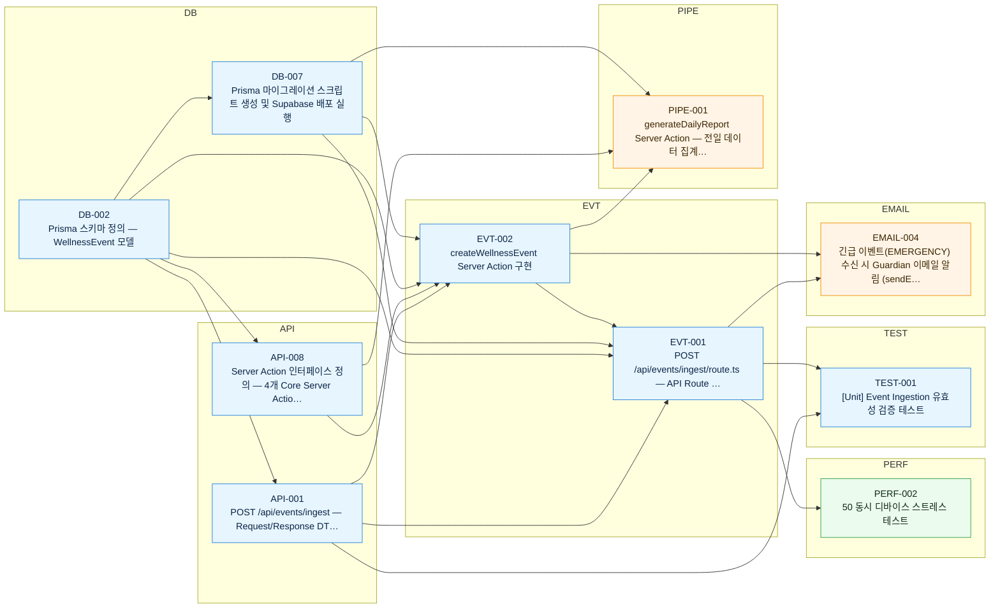
```mermaid
flowchart LR
  subgraph DB[DB]
    N_DB_002["DB-002<br/>Prisma 스키마 정의 — WellnessEvent 모델"]
    N_DB_007["DB-007<br/>Prisma 마이그레이션 스크립트 생성 및 Supabase 배포 실행"]
  end
  subgraph API[API]
    N_API_001["API-001<br/>POST /api/events/ingest — Request/Response DT…"]
    N_API_008["API-008<br/>Server Action 인터페이스 정의 — 4개 Core Server Actio…"]
  end
  subgraph EVT[EVT]
    N_EVT_001["EVT-001<br/>POST /api/events/ingest/route.ts — API Route …"]
    N_EVT_002["EVT-002<br/>createWellnessEvent Server Action 구현"]
  end
  subgraph PIPE[PIPE]
    N_PIPE_001["PIPE-001<br/>generateDailyReport Server Action — 전일 데이터 집계…"]
  end
  subgraph EMAIL[EMAIL]
    N_EMAIL_004["EMAIL-004<br/>긴급 이벤트(EMERGENCY) 수신 시 Guardian 이메일 알림 (sendE…"]
  end
  subgraph PERF[PERF]
    N_PERF_002["PERF-002<br/>50 동시 디바이스 스트레스 테스트"]
  end
  subgraph TEST[TEST]
    N_TEST_001["TEST-001<br/>[Unit] Event Ingestion 유효성 검증 테스트"]
  end
  N_API_001 --> N_EVT_001
  N_API_001 --> N_EVT_002
  N_API_001 --> N_TEST_001
  N_API_008 --> N_EVT_002
  N_API_008 --> N_PIPE_001
  N_DB_002 --> N_API_001
  N_DB_002 --> N_API_008
  N_DB_002 --> N_DB_007
  N_DB_002 --> N_EVT_001
  N_DB_002 --> N_EVT_002
  N_DB_007 --> N_EVT_001
  N_DB_007 --> N_EVT_002
  N_DB_007 --> N_PIPE_001
  N_EVT_001 --> N_EMAIL_004
  N_EVT_001 --> N_PERF_002
  N_EVT_001 --> N_TEST_001
  N_EVT_002 --> N_EMAIL_004
  N_EVT_002 --> N_EVT_001
  N_EVT_002 --> N_PIPE_001
  classDef p0 fill:#e7f5ff,stroke:#1c7ed6,color:#0b2545
  classDef p1 fill:#ebfbee,stroke:#2f9e44,color:#102a14
  classDef p2 fill:#fff4e6,stroke:#f08c00,color:#3b2500
  classDef p3 fill:#f3f0ff,stroke:#7048e8,color:#21123d
  classDef px fill:#f8f9fa,stroke:#868e96,color:#212529
  class N_DB_002 p0
  class N_DB_007 p0
  class N_API_001 p0
  class N_API_008 p0
  class N_EVT_001 p0
  class N_EVT_002 p0
  class N_PIPE_001 p2
  class N_EMAIL_004 p2
  class N_PERF_002 p1
  class N_TEST_001 p0
```

### HB

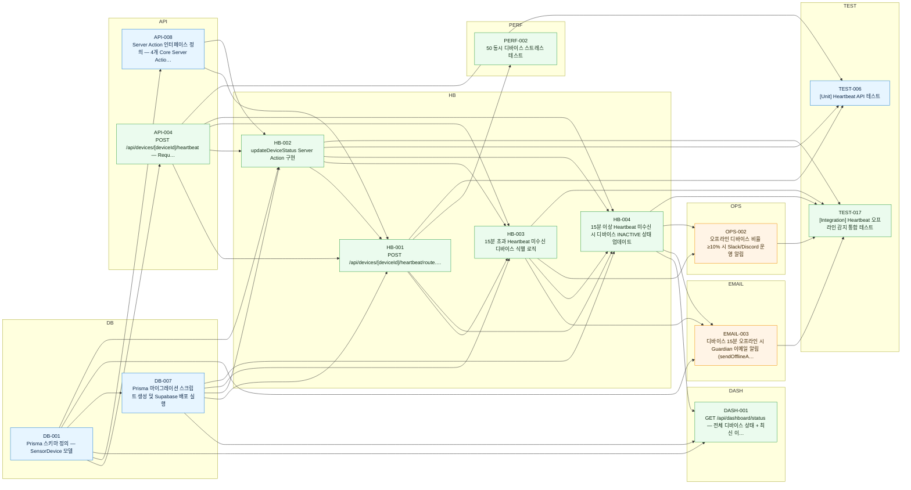
```mermaid
flowchart LR
  subgraph DB[DB]
    N_DB_001["DB-001<br/>Prisma 스키마 정의 — SensorDevice 모델"]
    N_DB_007["DB-007<br/>Prisma 마이그레이션 스크립트 생성 및 Supabase 배포 실행"]
  end
  subgraph API[API]
    N_API_004["API-004<br/>POST /api/devices/[deviceId]/heartbeat — Requ…"]
    N_API_008["API-008<br/>Server Action 인터페이스 정의 — 4개 Core Server Actio…"]
  end
  subgraph HB[HB]
    N_HB_001["HB-001<br/>POST /api/devices/[deviceId]/heartbeat/route.…"]
    N_HB_002["HB-002<br/>updateDeviceStatus Server Action 구현"]
    N_HB_003["HB-003<br/>15분 초과 Heartbeat 미수신 디바이스 식별 로직"]
    N_HB_004["HB-004<br/>15분 이상 Heartbeat 미수신 시 디바이스 INACTIVE 상태 업데이트"]
  end
  subgraph DASH[DASH]
    N_DASH_001["DASH-001<br/>GET /api/dashboard/status — 전체 디바이스 상태 + 최신 이…"]
  end
  subgraph EMAIL[EMAIL]
    N_EMAIL_003["EMAIL-003<br/>디바이스 15분 오프라인 시 Guardian 이메일 알림 (sendOfflineA…"]
  end
  subgraph OPS[OPS]
    N_OPS_002["OPS-002<br/>오프라인 디바이스 비율 ≥10% 시 Slack/Discord 운영 알림"]
  end
  subgraph PERF[PERF]
    N_PERF_002["PERF-002<br/>50 동시 디바이스 스트레스 테스트"]
  end
  subgraph TEST[TEST]
    N_TEST_006["TEST-006<br/>[Unit] Heartbeat API 테스트"]
    N_TEST_017["TEST-017<br/>[Integration] Heartbeat 오프라인 감지 통합 테스트"]
  end
  N_API_004 --> N_HB_001
  N_API_004 --> N_HB_002
  N_API_004 --> N_HB_003
  N_API_004 --> N_HB_004
  N_API_004 --> N_TEST_006
  N_API_008 --> N_HB_001
  N_API_008 --> N_HB_002
  N_DB_001 --> N_API_004
  N_DB_001 --> N_API_008
  N_DB_001 --> N_DASH_001
  N_DB_001 --> N_DB_007
  N_DB_001 --> N_EMAIL_003
  N_DB_001 --> N_HB_002
  N_DB_007 --> N_DASH_001
  N_DB_007 --> N_HB_001
  N_DB_007 --> N_HB_002
  N_DB_007 --> N_HB_003
  N_DB_007 --> N_HB_004
  N_EMAIL_003 --> N_TEST_017
  N_HB_001 --> N_HB_003
  N_HB_001 --> N_HB_004
  N_HB_001 --> N_PERF_002
  N_HB_001 --> N_TEST_006
  N_HB_002 --> N_HB_001
  N_HB_002 --> N_HB_003
  N_HB_002 --> N_HB_004
  N_HB_002 --> N_TEST_006
  N_HB_002 --> N_TEST_017
  N_HB_003 --> N_EMAIL_003
  N_HB_003 --> N_HB_004
  N_HB_003 --> N_OPS_002
  N_HB_003 --> N_TEST_017
  N_HB_004 --> N_DASH_001
  N_HB_004 --> N_EMAIL_003
  N_HB_004 --> N_OPS_002
  N_HB_004 --> N_TEST_017
  N_OPS_002 --> N_TEST_017
  classDef p0 fill:#e7f5ff,stroke:#1c7ed6,color:#0b2545
  classDef p1 fill:#ebfbee,stroke:#2f9e44,color:#102a14
  classDef p2 fill:#fff4e6,stroke:#f08c00,color:#3b2500
  classDef p3 fill:#f3f0ff,stroke:#7048e8,color:#21123d
  classDef px fill:#f8f9fa,stroke:#868e96,color:#212529
  class N_DB_001 p0
  class N_DB_007 p0
  class N_API_004 p1
  class N_API_008 p0
  class N_HB_001 p1
  class N_HB_002 p1
  class N_HB_003 p1
  class N_HB_004 p1
  class N_DASH_001 p1
  class N_EMAIL_003 p2
  class N_OPS_002 p2
  class N_PERF_002 p1
  class N_TEST_006 p0
  class N_TEST_017 p1
```

### DASH

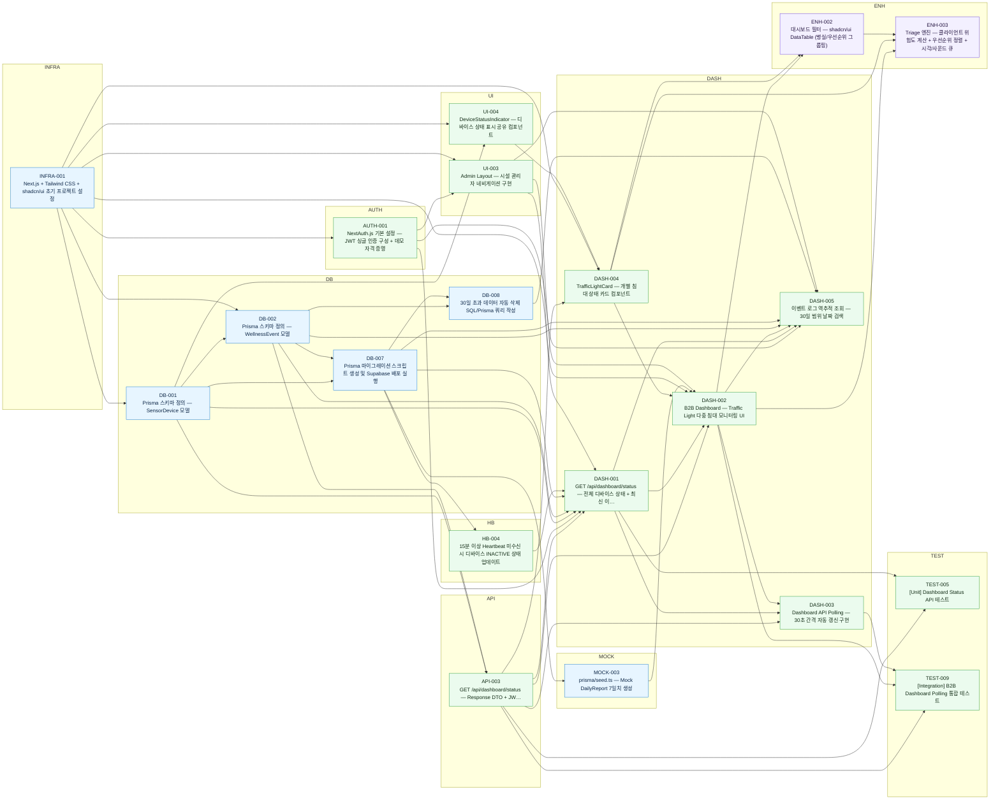
```mermaid
flowchart LR
  subgraph INFRA[INFRA]
    N_INFRA_001["INFRA-001<br/>Next.js + Tailwind CSS + shadcn/ui 초기 프로젝트 설정"]
  end
  subgraph DB[DB]
    N_DB_001["DB-001<br/>Prisma 스키마 정의 — SensorDevice 모델"]
    N_DB_002["DB-002<br/>Prisma 스키마 정의 — WellnessEvent 모델"]
    N_DB_007["DB-007<br/>Prisma 마이그레이션 스크립트 생성 및 Supabase 배포 실행"]
    N_DB_008["DB-008<br/>30일 초과 데이터 자동 삭제 SQL/Prisma 쿼리 작성"]
  end
  subgraph API[API]
    N_API_003["API-003<br/>GET /api/dashboard/status — Response DTO + JW…"]
  end
  subgraph MOCK[MOCK]
    N_MOCK_003["MOCK-003<br/>prisma/seed.ts — Mock DailyReport 7일치 생성"]
  end
  subgraph AUTH[AUTH]
    N_AUTH_001["AUTH-001<br/>NextAuth.js 기본 설정 — JWT 싱글 인증 구성 + 데모 자격 증명"]
  end
  subgraph HB[HB]
    N_HB_004["HB-004<br/>15분 이상 Heartbeat 미수신 시 디바이스 INACTIVE 상태 업데이트"]
  end
  subgraph DASH[DASH]
    N_DASH_001["DASH-001<br/>GET /api/dashboard/status — 전체 디바이스 상태 + 최신 이…"]
    N_DASH_002["DASH-002<br/>B2B Dashboard — Traffic Light 다중 침대 모니터링 UI"]
    N_DASH_003["DASH-003<br/>Dashboard API Polling — 30초 간격 자동 갱신 구현"]
    N_DASH_004["DASH-004<br/>TrafficLightCard — 개별 침대 상태 카드 컴포넌트"]
    N_DASH_005["DASH-005<br/>이벤트 로그 역추적 조회 — 30일 범위 날짜 검색"]
  end
  subgraph UI[UI]
    N_UI_003["UI-003<br/>Admin Layout — 시설 관리자 네비게이션 구현"]
    N_UI_004["UI-004<br/>DeviceStatusIndicator — 디바이스 상태 표시 공유 컴포넌트"]
  end
  subgraph ENH[ENH]
    N_ENH_002["ENH-002<br/>대시보드 필터 — shadcn/ui DataTable (병실/우선순위 그룹핑)"]
    N_ENH_003["ENH-003<br/>Triage 엔진 — 클라이언트 위험도 계산 + 우선순위 정렬 + 시각/사운드 큐"]
  end
  subgraph TEST[TEST]
    N_TEST_005["TEST-005<br/>[Unit] Dashboard Status API 테스트"]
    N_TEST_009["TEST-009<br/>[Integration] B2B Dashboard Polling 통합 테스트"]
  end
  N_API_003 --> N_DASH_001
  N_API_003 --> N_DASH_002
  N_API_003 --> N_DASH_003
  N_API_003 --> N_DASH_004
  N_API_003 --> N_TEST_005
  N_API_003 --> N_TEST_009
  N_AUTH_001 --> N_DASH_001
  N_AUTH_001 --> N_DASH_005
  N_AUTH_001 --> N_UI_003
  N_DASH_001 --> N_DASH_002
  N_DASH_001 --> N_DASH_003
  N_DASH_001 --> N_DASH_005
  N_DASH_001 --> N_TEST_005
  N_DASH_002 --> N_DASH_003
  N_DASH_002 --> N_DASH_005
  N_DASH_002 --> N_ENH_002
  N_DASH_002 --> N_ENH_003
  N_DASH_002 --> N_TEST_009
  N_DASH_003 --> N_TEST_009
  N_DASH_004 --> N_DASH_002
  N_DASH_004 --> N_ENH_002
  N_DASH_004 --> N_ENH_003
  N_DB_001 --> N_API_003
  N_DB_001 --> N_DASH_001
  N_DB_001 --> N_DB_002
  N_DB_001 --> N_DB_007
  N_DB_001 --> N_UI_004
  N_DB_002 --> N_API_003
  N_DB_002 --> N_DASH_001
  N_DB_002 --> N_DASH_005
  N_DB_002 --> N_DB_007
  N_DB_002 --> N_DB_008
  N_DB_007 --> N_DASH_001
  N_DB_007 --> N_DASH_005
  N_DB_007 --> N_DB_008
  N_DB_007 --> N_HB_004
  N_DB_007 --> N_MOCK_003
  N_DB_008 --> N_DASH_005
  N_ENH_002 --> N_ENH_003
  N_HB_004 --> N_DASH_001
  N_INFRA_001 --> N_AUTH_001
  N_INFRA_001 --> N_DASH_002
  N_INFRA_001 --> N_DASH_004
  N_INFRA_001 --> N_DB_001
  N_INFRA_001 --> N_DB_002
  N_INFRA_001 --> N_UI_003
  N_INFRA_001 --> N_UI_004
  N_MOCK_003 --> N_DASH_002
  N_UI_003 --> N_DASH_001
  N_UI_003 --> N_DASH_002
  N_UI_003 --> N_DASH_005
  N_UI_004 --> N_DASH_004
  classDef p0 fill:#e7f5ff,stroke:#1c7ed6,color:#0b2545
  classDef p1 fill:#ebfbee,stroke:#2f9e44,color:#102a14
  classDef p2 fill:#fff4e6,stroke:#f08c00,color:#3b2500
  classDef p3 fill:#f3f0ff,stroke:#7048e8,color:#21123d
  classDef px fill:#f8f9fa,stroke:#868e96,color:#212529
  class N_INFRA_001 p0
  class N_DB_001 p0
  class N_DB_002 p0
  class N_DB_007 p0
  class N_DB_008 p0
  class N_API_003 p1
  class N_MOCK_003 p0
  class N_AUTH_001 p1
  class N_HB_004 p1
  class N_DASH_001 p1
  class N_DASH_002 p1
  class N_DASH_003 p1
  class N_DASH_004 p1
  class N_DASH_005 p1
  class N_UI_003 p1
  class N_UI_004 p1
  class N_ENH_002 p3
  class N_ENH_003 p3
  class N_TEST_005 p1
  class N_TEST_009 p1
```

### RPT

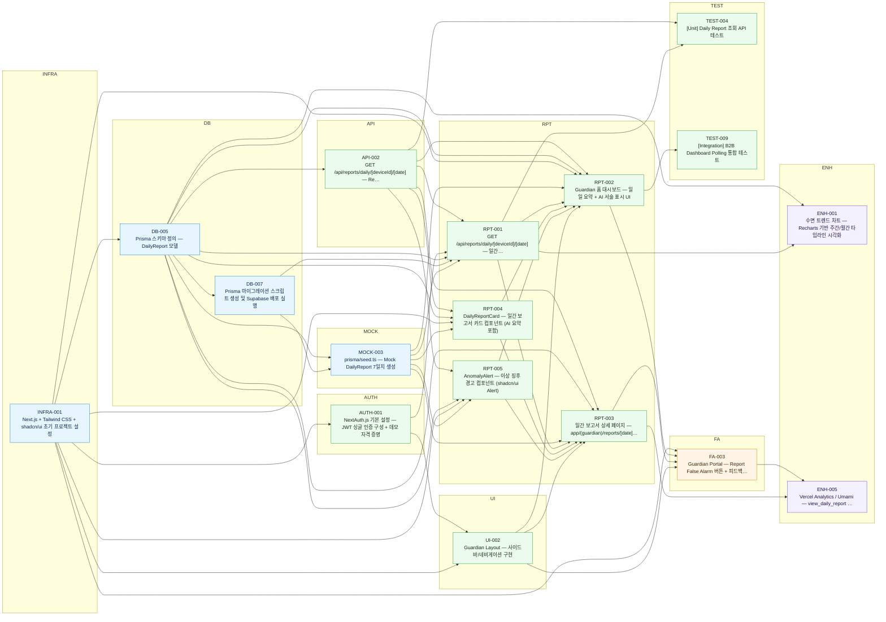
```mermaid
flowchart LR
  subgraph INFRA[INFRA]
    N_INFRA_001["INFRA-001<br/>Next.js + Tailwind CSS + shadcn/ui 초기 프로젝트 설정"]
  end
  subgraph DB[DB]
    N_DB_005["DB-005<br/>Prisma 스키마 정의 — DailyReport 모델"]
    N_DB_007["DB-007<br/>Prisma 마이그레이션 스크립트 생성 및 Supabase 배포 실행"]
  end
  subgraph API[API]
    N_API_002["API-002<br/>GET /api/reports/daily/[deviceId]/[date] — Re…"]
  end
  subgraph MOCK[MOCK]
    N_MOCK_003["MOCK-003<br/>prisma/seed.ts — Mock DailyReport 7일치 생성"]
  end
  subgraph AUTH[AUTH]
    N_AUTH_001["AUTH-001<br/>NextAuth.js 기본 설정 — JWT 싱글 인증 구성 + 데모 자격 증명"]
  end
  subgraph RPT[RPT]
    N_RPT_001["RPT-001<br/>GET /api/reports/daily/[deviceId]/[date] — 일간…"]
    N_RPT_002["RPT-002<br/>Guardian 홈 대시보드 — 일일 요약 + AI 서술 표시 UI"]
    N_RPT_003["RPT-003<br/>일간 보고서 상세 페이지 — app/(guardian)/reports/[date]…"]
    N_RPT_004["RPT-004<br/>DailyReportCard — 일간 보고서 카드 컴포넌트 (AI 요약 포함)"]
    N_RPT_005["RPT-005<br/>AnomalyAlert — 이상 징후 경고 컴포넌트 (shadcn/ui Alert)"]
  end
  subgraph UI[UI]
    N_UI_002["UI-002<br/>Guardian Layout — 사이드바/네비게이션 구현"]
  end
  subgraph FA[FA]
    N_FA_003["FA-003<br/>Guardian Portal — Report False Alarm 버튼 + 피드백…"]
  end
  subgraph ENH[ENH]
    N_ENH_001["ENH-001<br/>수면 트렌드 차트 — Recharts 기반 주간/월간 타임라인 시각화"]
    N_ENH_005["ENH-005<br/>Vercel Analytics / Umami — view_daily_report …"]
  end
  subgraph TEST[TEST]
    N_TEST_004["TEST-004<br/>[Unit] Daily Report 조회 API 테스트"]
    N_TEST_009["TEST-009<br/>[Integration] B2B Dashboard Polling 통합 테스트"]
  end
  N_API_002 --> N_RPT_001
  N_API_002 --> N_RPT_002
  N_API_002 --> N_RPT_003
  N_API_002 --> N_RPT_004
  N_API_002 --> N_RPT_005
  N_API_002 --> N_TEST_004
  N_AUTH_001 --> N_RPT_001
  N_AUTH_001 --> N_UI_002
  N_DB_005 --> N_API_002
  N_DB_005 --> N_DB_007
  N_DB_005 --> N_ENH_001
  N_DB_005 --> N_MOCK_003
  N_DB_005 --> N_RPT_001
  N_DB_005 --> N_RPT_002
  N_DB_005 --> N_RPT_003
  N_DB_005 --> N_RPT_004
  N_DB_005 --> N_RPT_005
  N_DB_007 --> N_MOCK_003
  N_DB_007 --> N_RPT_001
  N_FA_003 --> N_ENH_005
  N_INFRA_001 --> N_AUTH_001
  N_INFRA_001 --> N_DB_005
  N_INFRA_001 --> N_FA_003
  N_INFRA_001 --> N_RPT_002
  N_INFRA_001 --> N_RPT_004
  N_INFRA_001 --> N_RPT_005
  N_INFRA_001 --> N_UI_002
  N_MOCK_003 --> N_RPT_001
  N_MOCK_003 --> N_RPT_002
  N_MOCK_003 --> N_RPT_003
  N_MOCK_003 --> N_RPT_004
  N_MOCK_003 --> N_RPT_005
  N_RPT_001 --> N_ENH_001
  N_RPT_001 --> N_RPT_002
  N_RPT_001 --> N_RPT_003
  N_RPT_001 --> N_TEST_004
  N_RPT_002 --> N_FA_003
  N_RPT_002 --> N_TEST_009
  N_RPT_003 --> N_ENH_005
  N_RPT_003 --> N_FA_003
  N_RPT_004 --> N_RPT_002
  N_RPT_004 --> N_RPT_003
  N_RPT_005 --> N_RPT_002
  N_RPT_005 --> N_RPT_003
  N_UI_002 --> N_FA_003
  N_UI_002 --> N_RPT_002
  N_UI_002 --> N_RPT_003
  classDef p0 fill:#e7f5ff,stroke:#1c7ed6,color:#0b2545
  classDef p1 fill:#ebfbee,stroke:#2f9e44,color:#102a14
  classDef p2 fill:#fff4e6,stroke:#f08c00,color:#3b2500
  classDef p3 fill:#f3f0ff,stroke:#7048e8,color:#21123d
  classDef px fill:#f8f9fa,stroke:#868e96,color:#212529
  class N_INFRA_001 p0
  class N_DB_005 p0
  class N_DB_007 p0
  class N_API_002 p1
  class N_MOCK_003 p0
  class N_AUTH_001 p1
  class N_RPT_001 p1
  class N_RPT_002 p1
  class N_RPT_003 p1
  class N_RPT_004 p1
  class N_RPT_005 p1
  class N_UI_002 p1
  class N_FA_003 p2
  class N_ENH_001 p3
  class N_ENH_005 p3
  class N_TEST_004 p1
  class N_TEST_009 p1
```

### UI

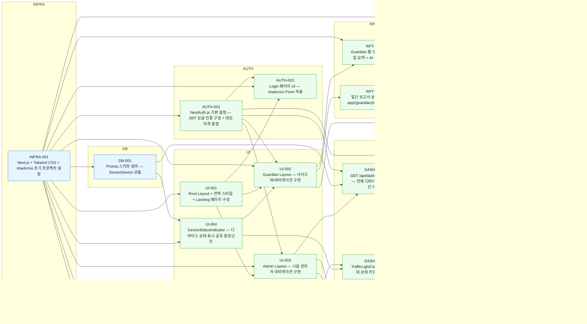
```mermaid
flowchart LR
  subgraph INFRA[INFRA]
    N_INFRA_001["INFRA-001<br/>Next.js + Tailwind CSS + shadcn/ui 초기 프로젝트 설정"]
  end
  subgraph DB[DB]
    N_DB_001["DB-001<br/>Prisma 스키마 정의 — SensorDevice 모델"]
  end
  subgraph AUTH[AUTH]
    N_AUTH_001["AUTH-001<br/>NextAuth.js 기본 설정 — JWT 싱글 인증 구성 + 데모 자격 증명"]
    N_AUTH_002["AUTH-002<br/>Login 페이지 UI — shadcn/ui Form 적용"]
  end
  subgraph DASH[DASH]
    N_DASH_001["DASH-001<br/>GET /api/dashboard/status — 전체 디바이스 상태 + 최신 이…"]
    N_DASH_002["DASH-002<br/>B2B Dashboard — Traffic Light 다중 침대 모니터링 UI"]
    N_DASH_004["DASH-004<br/>TrafficLightCard — 개별 침대 상태 카드 컴포넌트"]
    N_DASH_005["DASH-005<br/>이벤트 로그 역추적 조회 — 30일 범위 날짜 검색"]
  end
  subgraph RPT[RPT]
    N_RPT_002["RPT-002<br/>Guardian 홈 대시보드 — 일일 요약 + AI 서술 표시 UI"]
    N_RPT_003["RPT-003<br/>일간 보고서 상세 페이지 — app/(guardian)/reports/[date]…"]
  end
  subgraph UI[UI]
    N_UI_001["UI-001<br/>Root Layout + 전역 스타일 + Landing 페이지 구성"]
    N_UI_002["UI-002<br/>Guardian Layout — 사이드바/네비게이션 구현"]
    N_UI_003["UI-003<br/>Admin Layout — 시설 관리자 네비게이션 구현"]
    N_UI_004["UI-004<br/>DeviceStatusIndicator — 디바이스 상태 표시 공유 컴포넌트"]
  end
  subgraph FA[FA]
    N_FA_003["FA-003<br/>Guardian Portal — Report False Alarm 버튼 + 피드백…"]
  end
  N_AUTH_001 --> N_AUTH_002
  N_AUTH_001 --> N_DASH_001
  N_AUTH_001 --> N_DASH_005
  N_AUTH_001 --> N_UI_002
  N_AUTH_001 --> N_UI_003
  N_DASH_001 --> N_DASH_002
  N_DASH_001 --> N_DASH_005
  N_DASH_002 --> N_DASH_005
  N_DASH_004 --> N_DASH_002
  N_DB_001 --> N_DASH_001
  N_DB_001 --> N_UI_004
  N_INFRA_001 --> N_AUTH_001
  N_INFRA_001 --> N_AUTH_002
  N_INFRA_001 --> N_DASH_002
  N_INFRA_001 --> N_DASH_004
  N_INFRA_001 --> N_DB_001
  N_INFRA_001 --> N_FA_003
  N_INFRA_001 --> N_RPT_002
  N_INFRA_001 --> N_UI_001
  N_INFRA_001 --> N_UI_002
  N_INFRA_001 --> N_UI_003
  N_INFRA_001 --> N_UI_004
  N_RPT_002 --> N_FA_003
  N_RPT_003 --> N_FA_003
  N_UI_001 --> N_AUTH_002
  N_UI_001 --> N_UI_002
  N_UI_001 --> N_UI_003
  N_UI_002 --> N_FA_003
  N_UI_002 --> N_RPT_002
  N_UI_002 --> N_RPT_003
  N_UI_003 --> N_DASH_001
  N_UI_003 --> N_DASH_002
  N_UI_003 --> N_DASH_005
  N_UI_004 --> N_DASH_004
  N_UI_004 --> N_UI_002
  classDef p0 fill:#e7f5ff,stroke:#1c7ed6,color:#0b2545
  classDef p1 fill:#ebfbee,stroke:#2f9e44,color:#102a14
  classDef p2 fill:#fff4e6,stroke:#f08c00,color:#3b2500
  classDef p3 fill:#f3f0ff,stroke:#7048e8,color:#21123d
  classDef px fill:#f8f9fa,stroke:#868e96,color:#212529
  class N_INFRA_001 p0
  class N_DB_001 p0
  class N_AUTH_001 p1
  class N_AUTH_002 p1
  class N_DASH_001 p1
  class N_DASH_002 p1
  class N_DASH_004 p1
  class N_DASH_005 p1
  class N_RPT_002 p1
  class N_RPT_003 p1
  class N_UI_001 p1
  class N_UI_002 p1
  class N_UI_003 p1
  class N_UI_004 p1
  class N_FA_003 p2
```

### PIPE

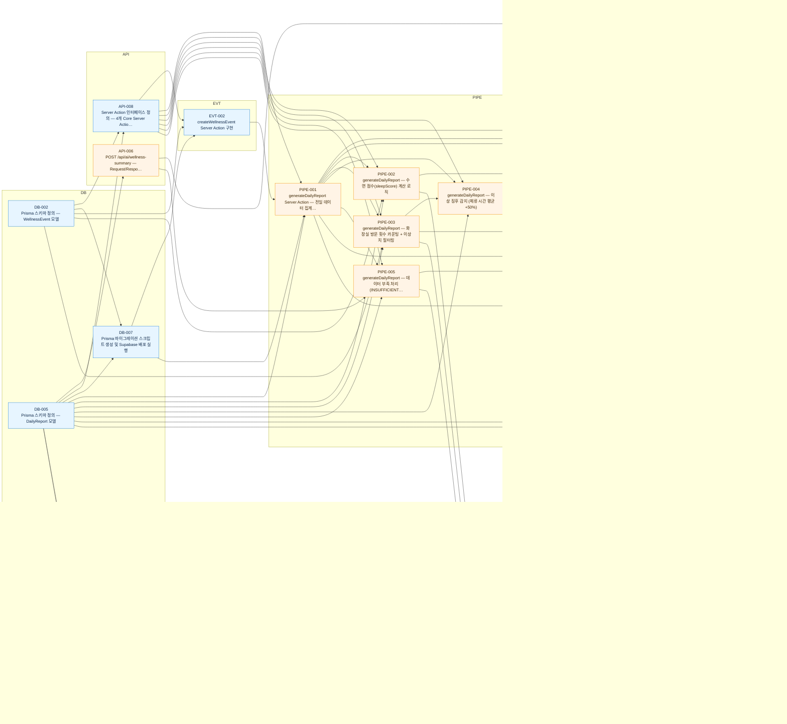
```mermaid
flowchart LR
  subgraph INFRA[INFRA]
    N_INFRA_003["INFRA-003<br/>Vercel Cron Job 설정 (1일 1회, Hobby 제한)"]
    N_INFRA_004["INFRA-004<br/>환경 변수 8개 설정 (.env.local / .env.example)"]
  end
  subgraph DB[DB]
    N_DB_002["DB-002<br/>Prisma 스키마 정의 — WellnessEvent 모델"]
    N_DB_005["DB-005<br/>Prisma 스키마 정의 — DailyReport 모델"]
    N_DB_007["DB-007<br/>Prisma 마이그레이션 스크립트 생성 및 Supabase 배포 실행"]
  end
  subgraph API[API]
    N_API_006["API-006<br/>POST /api/ai/wellness-summary — Request/Respo…"]
    N_API_008["API-008<br/>Server Action 인터페이스 정의 — 4개 Core Server Actio…"]
  end
  subgraph EVT[EVT]
    N_EVT_002["EVT-002<br/>createWellnessEvent Server Action 구현"]
  end
  subgraph PIPE[PIPE]
    N_PIPE_001["PIPE-001<br/>generateDailyReport Server Action — 전일 데이터 집계…"]
    N_PIPE_002["PIPE-002<br/>generateDailyReport — 수면 점수(sleepScore) 계산 로직"]
    N_PIPE_003["PIPE-003<br/>generateDailyReport — 화장실 방문 횟수 카운팅 + 이상치 필터링"]
    N_PIPE_004["PIPE-004<br/>generateDailyReport — 이상 징후 감지 (체류 시간 평균 +50%)"]
    N_PIPE_005["PIPE-005<br/>generateDailyReport — 데이터 부족 처리 (INSUFFICIENT…"]
    N_PIPE_006["PIPE-006<br/>generateDailyReport — Prisma dailyReport.crea…"]
    N_PIPE_007["PIPE-007<br/>Vercel Cron Job → generateDailyReport 트리거 연동"]
  end
  subgraph AI[AI]
    N_AI_003["AI-003<br/>generateDailyReport 내 AI 요약 생성 통합 + Fallback"]
    N_AI_004["AI-004<br/>이상 징후 AI 설명 생성 — anomaly_flag 감지 시 Gemini 자연어…"]
  end
  subgraph EMAIL[EMAIL]
    N_EMAIL_002["EMAIL-002<br/>일간 보고서 생성 완료 시 Guardian 이메일 알림 (sendDailyRepo…"]
  end
  subgraph TEST[TEST]
    N_TEST_010["TEST-010<br/>[Unit] sleepScore 정확도 테스트 (오차율 10%)"]
    N_TEST_011["TEST-011<br/>[Unit] generateDailyReport 데이터 부족 처리 테스트"]
    N_TEST_012["TEST-012<br/>[Unit] generateDailyReport 이상치 필터링 테스트"]
    N_TEST_013["TEST-013<br/>[Unit] 이상 징후 감지 + AI 설명 호출 테스트"]
  end
  N_AI_003 --> N_TEST_013
  N_AI_004 --> N_TEST_013
  N_API_006 --> N_AI_003
  N_API_006 --> N_PIPE_005
  N_API_008 --> N_EVT_002
  N_API_008 --> N_PIPE_001
  N_API_008 --> N_PIPE_002
  N_API_008 --> N_PIPE_003
  N_API_008 --> N_PIPE_004
  N_API_008 --> N_PIPE_005
  N_API_008 --> N_PIPE_006
  N_DB_002 --> N_API_008
  N_DB_002 --> N_DB_007
  N_DB_002 --> N_EVT_002
  N_DB_002 --> N_PIPE_002
  N_DB_002 --> N_PIPE_003
  N_DB_005 --> N_API_006
  N_DB_005 --> N_API_008
  N_DB_005 --> N_DB_007
  N_DB_005 --> N_PIPE_001
  N_DB_005 --> N_PIPE_002
  N_DB_005 --> N_PIPE_003
  N_DB_005 --> N_PIPE_004
  N_DB_005 --> N_PIPE_005
  N_DB_005 --> N_PIPE_006
  N_DB_005 --> N_PIPE_007
  N_DB_005 --> N_TEST_011
  N_DB_005 --> N_TEST_012
  N_DB_007 --> N_EVT_002
  N_DB_007 --> N_PIPE_001
  N_EVT_002 --> N_PIPE_001
  N_INFRA_003 --> N_PIPE_007
  N_INFRA_004 --> N_PIPE_007
  N_PIPE_001 --> N_AI_003
  N_PIPE_001 --> N_EMAIL_002
  N_PIPE_001 --> N_PIPE_002
  N_PIPE_001 --> N_PIPE_003
  N_PIPE_001 --> N_PIPE_004
  N_PIPE_001 --> N_PIPE_005
  N_PIPE_001 --> N_PIPE_006
  N_PIPE_001 --> N_PIPE_007
  N_PIPE_002 --> N_PIPE_006
  N_PIPE_002 --> N_TEST_010
  N_PIPE_003 --> N_PIPE_004
  N_PIPE_003 --> N_PIPE_006
  N_PIPE_003 --> N_TEST_012
  N_PIPE_004 --> N_AI_004
  N_PIPE_004 --> N_PIPE_006
  N_PIPE_004 --> N_TEST_013
  N_PIPE_005 --> N_PIPE_006
  N_PIPE_005 --> N_TEST_011
  N_PIPE_006 --> N_AI_003
  N_PIPE_006 --> N_EMAIL_002
  N_PIPE_006 --> N_PIPE_007
  N_PIPE_007 --> N_EMAIL_002
  N_TEST_011 --> N_PIPE_006
  N_TEST_012 --> N_PIPE_006
  N_TEST_012 --> N_TEST_013
  classDef p0 fill:#e7f5ff,stroke:#1c7ed6,color:#0b2545
  classDef p1 fill:#ebfbee,stroke:#2f9e44,color:#102a14
  classDef p2 fill:#fff4e6,stroke:#f08c00,color:#3b2500
  classDef p3 fill:#f3f0ff,stroke:#7048e8,color:#21123d
  classDef px fill:#f8f9fa,stroke:#868e96,color:#212529
  class N_INFRA_003 p0
  class N_INFRA_004 p0
  class N_DB_002 p0
  class N_DB_005 p0
  class N_DB_007 p0
  class N_API_006 p2
  class N_API_008 p0
  class N_EVT_002 p0
  class N_PIPE_001 p2
  class N_PIPE_002 p2
  class N_PIPE_003 p2
  class N_PIPE_004 p2
  class N_PIPE_005 p2
  class N_PIPE_006 p2
  class N_PIPE_007 p2
  class N_AI_003 p2
  class N_AI_004 p2
  class N_EMAIL_002 p2
  class N_TEST_010 p1
  class N_TEST_011 p2
  class N_TEST_012 p2
  class N_TEST_013 p2
```

### AI

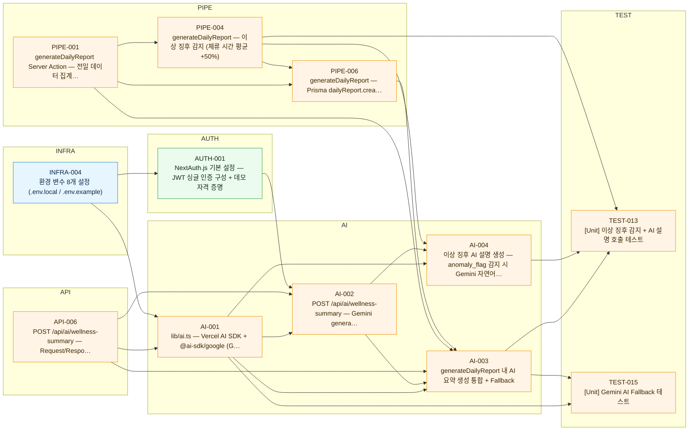
```mermaid
flowchart LR
  subgraph INFRA[INFRA]
    N_INFRA_004["INFRA-004<br/>환경 변수 8개 설정 (.env.local / .env.example)"]
  end
  subgraph API[API]
    N_API_006["API-006<br/>POST /api/ai/wellness-summary — Request/Respo…"]
  end
  subgraph AUTH[AUTH]
    N_AUTH_001["AUTH-001<br/>NextAuth.js 기본 설정 — JWT 싱글 인증 구성 + 데모 자격 증명"]
  end
  subgraph PIPE[PIPE]
    N_PIPE_001["PIPE-001<br/>generateDailyReport Server Action — 전일 데이터 집계…"]
    N_PIPE_004["PIPE-004<br/>generateDailyReport — 이상 징후 감지 (체류 시간 평균 +50%)"]
    N_PIPE_006["PIPE-006<br/>generateDailyReport — Prisma dailyReport.crea…"]
  end
  subgraph AI[AI]
    N_AI_001["AI-001<br/>lib/ai.ts — Vercel AI SDK + @ai-sdk/google (G…"]
    N_AI_002["AI-002<br/>POST /api/ai/wellness-summary — Gemini genera…"]
    N_AI_003["AI-003<br/>generateDailyReport 내 AI 요약 생성 통합 + Fallback"]
    N_AI_004["AI-004<br/>이상 징후 AI 설명 생성 — anomaly_flag 감지 시 Gemini 자연어…"]
  end
  subgraph TEST[TEST]
    N_TEST_013["TEST-013<br/>[Unit] 이상 징후 감지 + AI 설명 호출 테스트"]
    N_TEST_015["TEST-015<br/>[Unit] Gemini AI Fallback 테스트"]
  end
  N_AI_001 --> N_AI_002
  N_AI_001 --> N_AI_003
  N_AI_001 --> N_AI_004
  N_AI_001 --> N_TEST_015
  N_AI_002 --> N_AI_003
  N_AI_002 --> N_AI_004
  N_AI_003 --> N_TEST_013
  N_AI_003 --> N_TEST_015
  N_AI_004 --> N_TEST_013
  N_API_006 --> N_AI_001
  N_API_006 --> N_AI_002
  N_API_006 --> N_AI_003
  N_AUTH_001 --> N_AI_002
  N_INFRA_004 --> N_AI_001
  N_INFRA_004 --> N_AUTH_001
  N_PIPE_001 --> N_AI_003
  N_PIPE_001 --> N_PIPE_004
  N_PIPE_001 --> N_PIPE_006
  N_PIPE_004 --> N_AI_004
  N_PIPE_004 --> N_PIPE_006
  N_PIPE_004 --> N_TEST_013
  N_PIPE_006 --> N_AI_003
  classDef p0 fill:#e7f5ff,stroke:#1c7ed6,color:#0b2545
  classDef p1 fill:#ebfbee,stroke:#2f9e44,color:#102a14
  classDef p2 fill:#fff4e6,stroke:#f08c00,color:#3b2500
  classDef p3 fill:#f3f0ff,stroke:#7048e8,color:#21123d
  classDef px fill:#f8f9fa,stroke:#868e96,color:#212529
  class N_INFRA_004 p0
  class N_API_006 p2
  class N_AUTH_001 p1
  class N_PIPE_001 p2
  class N_PIPE_004 p2
  class N_PIPE_006 p2
  class N_AI_001 p2
  class N_AI_002 p2
  class N_AI_003 p2
  class N_AI_004 p2
  class N_TEST_013 p2
  class N_TEST_015 p2
```

### EMAIL

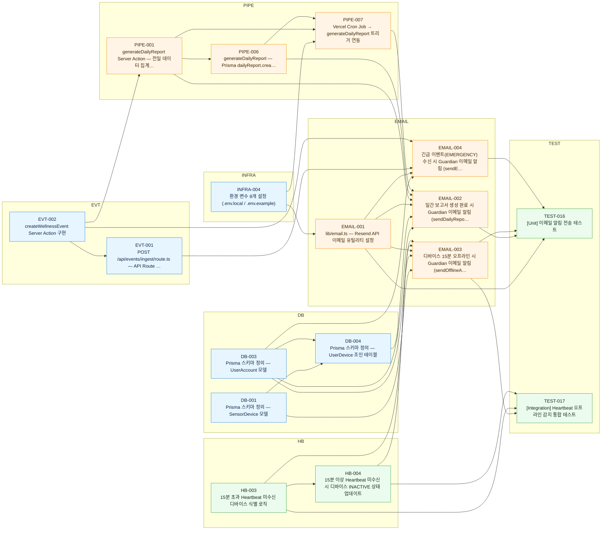
```mermaid
flowchart LR
  subgraph INFRA[INFRA]
    N_INFRA_004["INFRA-004<br/>환경 변수 8개 설정 (.env.local / .env.example)"]
  end
  subgraph DB[DB]
    N_DB_001["DB-001<br/>Prisma 스키마 정의 — SensorDevice 모델"]
    N_DB_003["DB-003<br/>Prisma 스키마 정의 — UserAccount 모델"]
    N_DB_004["DB-004<br/>Prisma 스키마 정의 — UserDevice 조인 테이블"]
  end
  subgraph EVT[EVT]
    N_EVT_001["EVT-001<br/>POST /api/events/ingest/route.ts — API Route …"]
    N_EVT_002["EVT-002<br/>createWellnessEvent Server Action 구현"]
  end
  subgraph HB[HB]
    N_HB_003["HB-003<br/>15분 초과 Heartbeat 미수신 디바이스 식별 로직"]
    N_HB_004["HB-004<br/>15분 이상 Heartbeat 미수신 시 디바이스 INACTIVE 상태 업데이트"]
  end
  subgraph PIPE[PIPE]
    N_PIPE_001["PIPE-001<br/>generateDailyReport Server Action — 전일 데이터 집계…"]
    N_PIPE_006["PIPE-006<br/>generateDailyReport — Prisma dailyReport.crea…"]
    N_PIPE_007["PIPE-007<br/>Vercel Cron Job → generateDailyReport 트리거 연동"]
  end
  subgraph EMAIL[EMAIL]
    N_EMAIL_001["EMAIL-001<br/>lib/email.ts — Resend API 이메일 유틸리티 설정"]
    N_EMAIL_002["EMAIL-002<br/>일간 보고서 생성 완료 시 Guardian 이메일 알림 (sendDailyRepo…"]
    N_EMAIL_003["EMAIL-003<br/>디바이스 15분 오프라인 시 Guardian 이메일 알림 (sendOfflineA…"]
    N_EMAIL_004["EMAIL-004<br/>긴급 이벤트(EMERGENCY) 수신 시 Guardian 이메일 알림 (sendE…"]
  end
  subgraph TEST[TEST]
    N_TEST_016["TEST-016<br/>[Unit] 이메일 알림 전송 테스트"]
    N_TEST_017["TEST-017<br/>[Integration] Heartbeat 오프라인 감지 통합 테스트"]
  end
  N_DB_001 --> N_DB_004
  N_DB_001 --> N_EMAIL_003
  N_DB_003 --> N_DB_004
  N_DB_003 --> N_EMAIL_002
  N_DB_003 --> N_EMAIL_003
  N_DB_003 --> N_EMAIL_004
  N_DB_004 --> N_EMAIL_002
  N_EMAIL_001 --> N_EMAIL_002
  N_EMAIL_001 --> N_EMAIL_003
  N_EMAIL_001 --> N_EMAIL_004
  N_EMAIL_001 --> N_TEST_016
  N_EMAIL_002 --> N_TEST_016
  N_EMAIL_003 --> N_TEST_016
  N_EMAIL_003 --> N_TEST_017
  N_EMAIL_004 --> N_TEST_016
  N_EVT_001 --> N_EMAIL_004
  N_EVT_002 --> N_EMAIL_004
  N_EVT_002 --> N_EVT_001
  N_EVT_002 --> N_PIPE_001
  N_HB_003 --> N_EMAIL_003
  N_HB_003 --> N_HB_004
  N_HB_003 --> N_TEST_017
  N_HB_004 --> N_EMAIL_003
  N_HB_004 --> N_TEST_017
  N_INFRA_004 --> N_EMAIL_001
  N_INFRA_004 --> N_PIPE_007
  N_PIPE_001 --> N_EMAIL_002
  N_PIPE_001 --> N_PIPE_006
  N_PIPE_001 --> N_PIPE_007
  N_PIPE_006 --> N_EMAIL_002
  N_PIPE_006 --> N_PIPE_007
  N_PIPE_007 --> N_EMAIL_002
  classDef p0 fill:#e7f5ff,stroke:#1c7ed6,color:#0b2545
  classDef p1 fill:#ebfbee,stroke:#2f9e44,color:#102a14
  classDef p2 fill:#fff4e6,stroke:#f08c00,color:#3b2500
  classDef p3 fill:#f3f0ff,stroke:#7048e8,color:#21123d
  classDef px fill:#f8f9fa,stroke:#868e96,color:#212529
  class N_INFRA_004 p0
  class N_DB_001 p0
  class N_DB_003 p0
  class N_DB_004 p0
  class N_EVT_001 p0
  class N_EVT_002 p0
  class N_HB_003 p1
  class N_HB_004 p1
  class N_PIPE_001 p2
  class N_PIPE_006 p2
  class N_PIPE_007 p2
  class N_EMAIL_001 p2
  class N_EMAIL_002 p2
  class N_EMAIL_003 p2
  class N_EMAIL_004 p2
  class N_TEST_016 p1
  class N_TEST_017 p1
```

### FA

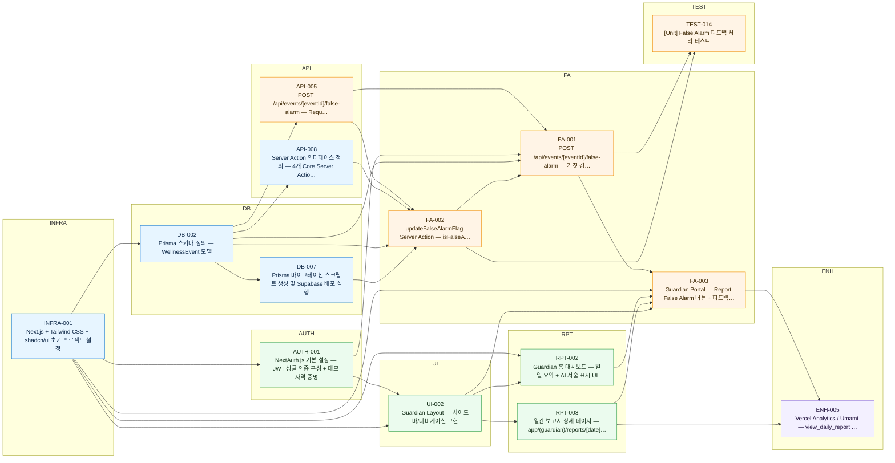
```mermaid
flowchart LR
  subgraph INFRA[INFRA]
    N_INFRA_001["INFRA-001<br/>Next.js + Tailwind CSS + shadcn/ui 초기 프로젝트 설정"]
  end
  subgraph DB[DB]
    N_DB_002["DB-002<br/>Prisma 스키마 정의 — WellnessEvent 모델"]
    N_DB_007["DB-007<br/>Prisma 마이그레이션 스크립트 생성 및 Supabase 배포 실행"]
  end
  subgraph API[API]
    N_API_005["API-005<br/>POST /api/events/[eventId]/false-alarm — Requ…"]
    N_API_008["API-008<br/>Server Action 인터페이스 정의 — 4개 Core Server Actio…"]
  end
  subgraph AUTH[AUTH]
    N_AUTH_001["AUTH-001<br/>NextAuth.js 기본 설정 — JWT 싱글 인증 구성 + 데모 자격 증명"]
  end
  subgraph RPT[RPT]
    N_RPT_002["RPT-002<br/>Guardian 홈 대시보드 — 일일 요약 + AI 서술 표시 UI"]
    N_RPT_003["RPT-003<br/>일간 보고서 상세 페이지 — app/(guardian)/reports/[date]…"]
  end
  subgraph UI[UI]
    N_UI_002["UI-002<br/>Guardian Layout — 사이드바/네비게이션 구현"]
  end
  subgraph FA[FA]
    N_FA_001["FA-001<br/>POST /api/events/[eventId]/false-alarm — 거짓 경…"]
    N_FA_002["FA-002<br/>updateFalseAlarmFlag Server Action — isFalseA…"]
    N_FA_003["FA-003<br/>Guardian Portal — Report False Alarm 버튼 + 피드백…"]
  end
  subgraph ENH[ENH]
    N_ENH_005["ENH-005<br/>Vercel Analytics / Umami — view_daily_report …"]
  end
  subgraph TEST[TEST]
    N_TEST_014["TEST-014<br/>[Unit] False Alarm 피드백 처리 테스트"]
  end
  N_API_005 --> N_FA_001
  N_API_005 --> N_FA_002
  N_API_008 --> N_FA_002
  N_AUTH_001 --> N_FA_001
  N_AUTH_001 --> N_UI_002
  N_DB_002 --> N_API_005
  N_DB_002 --> N_API_008
  N_DB_002 --> N_DB_007
  N_DB_002 --> N_FA_001
  N_DB_002 --> N_FA_002
  N_DB_007 --> N_FA_002
  N_FA_001 --> N_FA_003
  N_FA_001 --> N_TEST_014
  N_FA_002 --> N_FA_001
  N_FA_002 --> N_TEST_014
  N_FA_003 --> N_ENH_005
  N_INFRA_001 --> N_AUTH_001
  N_INFRA_001 --> N_DB_002
  N_INFRA_001 --> N_FA_003
  N_INFRA_001 --> N_RPT_002
  N_INFRA_001 --> N_UI_002
  N_RPT_002 --> N_FA_003
  N_RPT_003 --> N_ENH_005
  N_RPT_003 --> N_FA_003
  N_UI_002 --> N_FA_003
  N_UI_002 --> N_RPT_002
  N_UI_002 --> N_RPT_003
  classDef p0 fill:#e7f5ff,stroke:#1c7ed6,color:#0b2545
  classDef p1 fill:#ebfbee,stroke:#2f9e44,color:#102a14
  classDef p2 fill:#fff4e6,stroke:#f08c00,color:#3b2500
  classDef p3 fill:#f3f0ff,stroke:#7048e8,color:#21123d
  classDef px fill:#f8f9fa,stroke:#868e96,color:#212529
  class N_INFRA_001 p0
  class N_DB_002 p0
  class N_DB_007 p0
  class N_API_005 p2
  class N_API_008 p0
  class N_AUTH_001 p1
  class N_RPT_002 p1
  class N_RPT_003 p1
  class N_UI_002 p1
  class N_FA_001 p2
  class N_FA_002 p2
  class N_FA_003 p2
  class N_ENH_005 p3
  class N_TEST_014 p2
```

### OPS

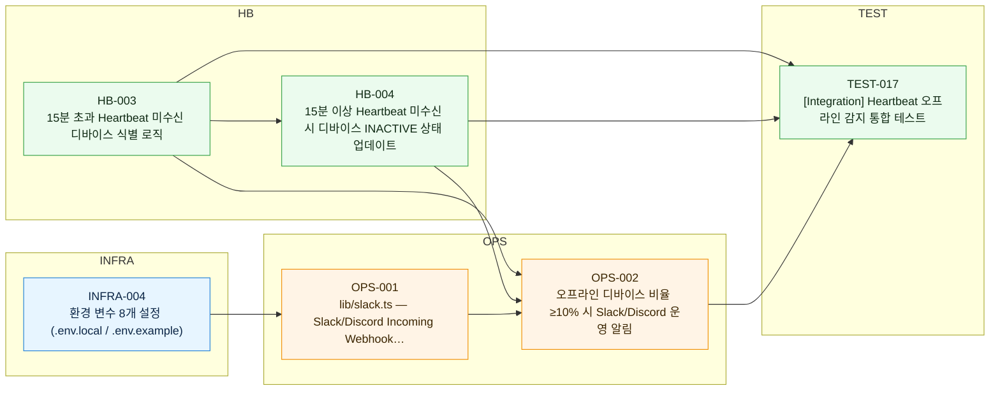
```mermaid
flowchart LR
  subgraph INFRA[INFRA]
    N_INFRA_004["INFRA-004<br/>환경 변수 8개 설정 (.env.local / .env.example)"]
  end
  subgraph HB[HB]
    N_HB_003["HB-003<br/>15분 초과 Heartbeat 미수신 디바이스 식별 로직"]
    N_HB_004["HB-004<br/>15분 이상 Heartbeat 미수신 시 디바이스 INACTIVE 상태 업데이트"]
  end
  subgraph OPS[OPS]
    N_OPS_001["OPS-001<br/>lib/slack.ts — Slack/Discord Incoming Webhook…"]
    N_OPS_002["OPS-002<br/>오프라인 디바이스 비율 ≥10% 시 Slack/Discord 운영 알림"]
  end
  subgraph TEST[TEST]
    N_TEST_017["TEST-017<br/>[Integration] Heartbeat 오프라인 감지 통합 테스트"]
  end
  N_HB_003 --> N_HB_004
  N_HB_003 --> N_OPS_002
  N_HB_003 --> N_TEST_017
  N_HB_004 --> N_OPS_002
  N_HB_004 --> N_TEST_017
  N_INFRA_004 --> N_OPS_001
  N_OPS_001 --> N_OPS_002
  N_OPS_002 --> N_TEST_017
  classDef p0 fill:#e7f5ff,stroke:#1c7ed6,color:#0b2545
  classDef p1 fill:#ebfbee,stroke:#2f9e44,color:#102a14
  classDef p2 fill:#fff4e6,stroke:#f08c00,color:#3b2500
  classDef p3 fill:#f3f0ff,stroke:#7048e8,color:#21123d
  classDef px fill:#f8f9fa,stroke:#868e96,color:#212529
  class N_INFRA_004 p0
  class N_HB_003 p1
  class N_HB_004 p1
  class N_OPS_001 p2
  class N_OPS_002 p2
  class N_TEST_017 p1
```

### SEC

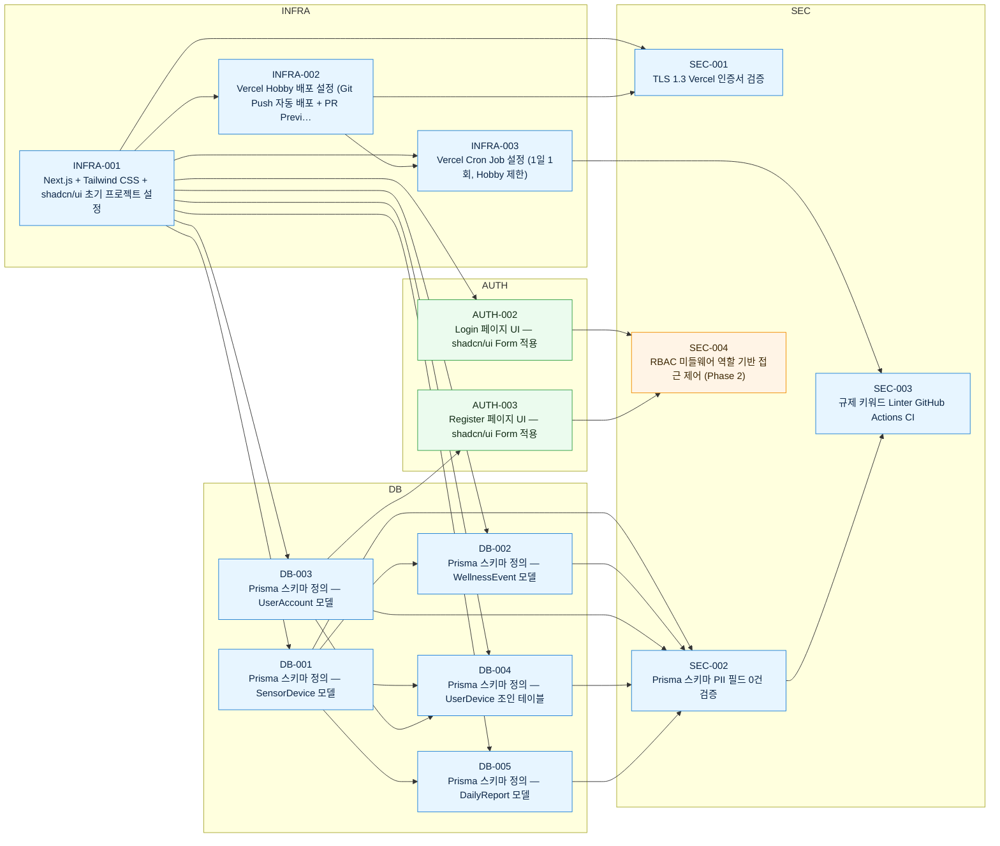
```mermaid
flowchart LR
  subgraph INFRA[INFRA]
    N_INFRA_001["INFRA-001<br/>Next.js + Tailwind CSS + shadcn/ui 초기 프로젝트 설정"]
    N_INFRA_002["INFRA-002<br/>Vercel Hobby 배포 설정 (Git Push 자동 배포 + PR Previ…"]
    N_INFRA_003["INFRA-003<br/>Vercel Cron Job 설정 (1일 1회, Hobby 제한)"]
  end
  subgraph DB[DB]
    N_DB_001["DB-001<br/>Prisma 스키마 정의 — SensorDevice 모델"]
    N_DB_002["DB-002<br/>Prisma 스키마 정의 — WellnessEvent 모델"]
    N_DB_003["DB-003<br/>Prisma 스키마 정의 — UserAccount 모델"]
    N_DB_004["DB-004<br/>Prisma 스키마 정의 — UserDevice 조인 테이블"]
    N_DB_005["DB-005<br/>Prisma 스키마 정의 — DailyReport 모델"]
  end
  subgraph AUTH[AUTH]
    N_AUTH_002["AUTH-002<br/>Login 페이지 UI — shadcn/ui Form 적용"]
    N_AUTH_003["AUTH-003<br/>Register 페이지 UI — shadcn/ui Form 적용"]
  end
  subgraph SEC[SEC]
    N_SEC_001["SEC-001<br/>TLS 1.3 Vercel 인증서 검증"]
    N_SEC_002["SEC-002<br/>Prisma 스키마 PII 필드 0건 검증"]
    N_SEC_003["SEC-003<br/>규제 키워드 Linter GitHub Actions CI"]
    N_SEC_004["SEC-004<br/>RBAC 미들웨어 역할 기반 접근 제어 (Phase 2)"]
  end
  N_AUTH_002 --> N_SEC_004
  N_AUTH_003 --> N_SEC_004
  N_DB_001 --> N_DB_002
  N_DB_001 --> N_DB_004
  N_DB_001 --> N_DB_005
  N_DB_001 --> N_SEC_002
  N_DB_002 --> N_SEC_002
  N_DB_003 --> N_AUTH_003
  N_DB_003 --> N_DB_004
  N_DB_003 --> N_SEC_002
  N_DB_004 --> N_SEC_002
  N_DB_005 --> N_SEC_002
  N_INFRA_001 --> N_AUTH_002
  N_INFRA_001 --> N_DB_001
  N_INFRA_001 --> N_DB_002
  N_INFRA_001 --> N_DB_003
  N_INFRA_001 --> N_DB_004
  N_INFRA_001 --> N_DB_005
  N_INFRA_001 --> N_INFRA_002
  N_INFRA_001 --> N_INFRA_003
  N_INFRA_001 --> N_SEC_001
  N_INFRA_002 --> N_INFRA_003
  N_INFRA_002 --> N_SEC_001
  N_INFRA_003 --> N_SEC_003
  N_SEC_002 --> N_SEC_003
  classDef p0 fill:#e7f5ff,stroke:#1c7ed6,color:#0b2545
  classDef p1 fill:#ebfbee,stroke:#2f9e44,color:#102a14
  classDef p2 fill:#fff4e6,stroke:#f08c00,color:#3b2500
  classDef p3 fill:#f3f0ff,stroke:#7048e8,color:#21123d
  classDef px fill:#f8f9fa,stroke:#868e96,color:#212529
  class N_INFRA_001 p0
  class N_INFRA_002 p0
  class N_INFRA_003 p0
  class N_DB_001 p0
  class N_DB_002 p0
  class N_DB_003 p0
  class N_DB_004 p0
  class N_DB_005 p0
  class N_AUTH_002 p1
  class N_AUTH_003 p1
  class N_SEC_001 p0
  class N_SEC_002 p0
  class N_SEC_003 p0
  class N_SEC_004 p2
```

### PERF

```mermaid
flowchart LR
  subgraph INFRA[INFRA]
    N_INFRA_001["INFRA-001<br/>Next.js + Tailwind CSS + shadcn/ui 초기 프로젝트 설정"]
    N_INFRA_002["INFRA-002<br/>Vercel Hobby 배포 설정 (Git Push 자동 배포 + PR Previ…"]
  end
  subgraph DB[DB]
    N_DB_001["DB-001<br/>Prisma 스키마 정의 — SensorDevice 모델"]
    N_DB_002["DB-002<br/>Prisma 스키마 정의 — WellnessEvent 모델"]
    N_DB_003["DB-003<br/>Prisma 스키마 정의 — UserAccount 모델"]
    N_DB_004["DB-004<br/>Prisma 스키마 정의 — UserDevice 조인 테이블"]
    N_DB_005["DB-005<br/>Prisma 스키마 정의 — DailyReport 모델"]
  end
  subgraph EVT[EVT]
    N_EVT_001["EVT-001<br/>POST /api/events/ingest/route.ts — API Route …"]
  end
  subgraph HB[HB]
    N_HB_001["HB-001<br/>POST /api/devices/[deviceId]/heartbeat/route.…"]
  end
  subgraph PERF[PERF]
    N_PERF_001["PERF-001<br/>E2E 응답 지연 p95 ≤ 5,000ms 검증"]
    N_PERF_002["PERF-002<br/>50 동시 디바이스 스트레스 테스트"]
    N_PERF_003["PERF-003<br/>Vercel Analytics 응답 시간 모니터링"]
  end
  subgraph ENH[ENH]
    N_ENH_005["ENH-005<br/>Vercel Analytics / Umami — view_daily_report …"]
  end
  N_DB_001 --> N_DB_002
  N_DB_001 --> N_DB_004
  N_DB_001 --> N_DB_005
  N_DB_001 --> N_PERF_001
  N_DB_002 --> N_EVT_001
  N_DB_002 --> N_PERF_001
  N_DB_003 --> N_DB_004
  N_DB_003 --> N_PERF_001
  N_DB_004 --> N_PERF_001
  N_DB_005 --> N_PERF_001
  N_ENH_005 --> N_PERF_003
  N_EVT_001 --> N_PERF_002
  N_HB_001 --> N_PERF_002
  N_INFRA_001 --> N_DB_001
  N_INFRA_001 --> N_DB_002
  N_INFRA_001 --> N_DB_003
  N_INFRA_001 --> N_DB_004
  N_INFRA_001 --> N_DB_005
  N_INFRA_001 --> N_INFRA_002
  N_INFRA_001 --> N_PERF_001
  N_INFRA_001 --> N_PERF_002
  N_INFRA_001 --> N_PERF_003
  N_INFRA_002 --> N_ENH_005
  N_INFRA_002 --> N_PERF_002
  N_INFRA_002 --> N_PERF_003
  classDef p0 fill:#e7f5ff,stroke:#1c7ed6,color:#0b2545
  classDef p1 fill:#ebfbee,stroke:#2f9e44,color:#102a14
  classDef p2 fill:#fff4e6,stroke:#f08c00,color:#3b2500
  classDef p3 fill:#f3f0ff,stroke:#7048e8,color:#21123d
  classDef px fill:#f8f9fa,stroke:#868e96,color:#212529
  class N_INFRA_001 p0
  class N_INFRA_002 p0
  class N_DB_001 p0
  class N_DB_002 p0
  class N_DB_003 p0
  class N_DB_004 p0
  class N_DB_005 p0
  class N_EVT_001 p0
  class N_HB_001 p1
  class N_PERF_001 p1
  class N_PERF_002 p1
  class N_PERF_003 p2
  class N_ENH_005 p3
```

### AVAIL

```mermaid
flowchart LR
  subgraph INFRA[INFRA]
    N_INFRA_001["INFRA-001<br/>Next.js + Tailwind CSS + shadcn/ui 초기 프로젝트 설정"]
    N_INFRA_002["INFRA-002<br/>Vercel Hobby 배포 설정 (Git Push 자동 배포 + PR Previ…"]
    N_INFRA_004["INFRA-004<br/>환경 변수 8개 설정 (.env.local / .env.example)"]
    N_INFRA_005["INFRA-005<br/>Supabase Free 7일 비활성 일시정지 방지 설정"]
  end
  subgraph DB[DB]
    N_DB_008["DB-008<br/>30일 초과 데이터 자동 삭제 SQL/Prisma 쿼리 작성"]
  end
  subgraph AVAIL[AVAIL]
    N_AVAIL_001["AVAIL-001<br/>UptimeRobot Free 합성 모니터링 (5분 간격)"]
    N_AVAIL_002["AVAIL-002<br/>Vercel + Supabase $0 비용 확인 프로세스"]
  end
  N_AVAIL_001 --> N_AVAIL_002
  N_DB_008 --> N_AVAIL_002
  N_INFRA_001 --> N_AVAIL_001
  N_INFRA_001 --> N_AVAIL_002
  N_INFRA_001 --> N_INFRA_002
  N_INFRA_001 --> N_INFRA_004
  N_INFRA_002 --> N_AVAIL_001
  N_INFRA_002 --> N_AVAIL_002
  N_INFRA_002 --> N_INFRA_005
  N_INFRA_004 --> N_AVAIL_001
  N_INFRA_005 --> N_AVAIL_001
  classDef p0 fill:#e7f5ff,stroke:#1c7ed6,color:#0b2545
  classDef p1 fill:#ebfbee,stroke:#2f9e44,color:#102a14
  classDef p2 fill:#fff4e6,stroke:#f08c00,color:#3b2500
  classDef p3 fill:#f3f0ff,stroke:#7048e8,color:#21123d
  classDef px fill:#f8f9fa,stroke:#868e96,color:#212529
  class N_INFRA_001 p0
  class N_INFRA_002 p0
  class N_INFRA_004 p0
  class N_INFRA_005 p0
  class N_DB_008 p0
  class N_AVAIL_001 p1
  class N_AVAIL_002 p1
```

### ENH

```mermaid
flowchart LR
  subgraph INFRA[INFRA]
    N_INFRA_001["INFRA-001<br/>Next.js + Tailwind CSS + shadcn/ui 초기 프로젝트 설정"]
    N_INFRA_002["INFRA-002<br/>Vercel Hobby 배포 설정 (Git Push 자동 배포 + PR Previ…"]
  end
  subgraph DB[DB]
    N_DB_005["DB-005<br/>Prisma 스키마 정의 — DailyReport 모델"]
  end
  subgraph DASH[DASH]
    N_DASH_002["DASH-002<br/>B2B Dashboard — Traffic Light 다중 침대 모니터링 UI"]
    N_DASH_004["DASH-004<br/>TrafficLightCard — 개별 침대 상태 카드 컴포넌트"]
  end
  subgraph RPT[RPT]
    N_RPT_001["RPT-001<br/>GET /api/reports/daily/[deviceId]/[date] — 일간…"]
    N_RPT_003["RPT-003<br/>일간 보고서 상세 페이지 — app/(guardian)/reports/[date]…"]
  end
  subgraph FA[FA]
    N_FA_003["FA-003<br/>Guardian Portal — Report False Alarm 버튼 + 피드백…"]
  end
  subgraph PERF[PERF]
    N_PERF_003["PERF-003<br/>Vercel Analytics 응답 시간 모니터링"]
  end
  subgraph ENH[ENH]
    N_ENH_001["ENH-001<br/>수면 트렌드 차트 — Recharts 기반 주간/월간 타임라인 시각화"]
    N_ENH_002["ENH-002<br/>대시보드 필터 — shadcn/ui DataTable (병실/우선순위 그룹핑)"]
    N_ENH_003["ENH-003<br/>Triage 엔진 — 클라이언트 위험도 계산 + 우선순위 정렬 + 시각/사운드 큐"]
    N_ENH_004["ENH-004<br/>PWA 전환 — manifest.json + Service Worker 기본 설정"]
    N_ENH_005["ENH-005<br/>Vercel Analytics / Umami — view_daily_report …"]
  end
  subgraph TEST[TEST]
    N_TEST_018["TEST-018<br/>[Unit] Triage 정렬 테스트"]
    N_TEST_019["TEST-019<br/>[Unit] 수면 트렌드 차트 렌더링 테스트"]
  end
  N_DASH_002 --> N_ENH_002
  N_DASH_002 --> N_ENH_003
  N_DASH_004 --> N_DASH_002
  N_DASH_004 --> N_ENH_002
  N_DASH_004 --> N_ENH_003
  N_DB_005 --> N_ENH_001
  N_DB_005 --> N_RPT_001
  N_DB_005 --> N_RPT_003
  N_ENH_001 --> N_TEST_019
  N_ENH_002 --> N_ENH_003
  N_ENH_003 --> N_TEST_018
  N_ENH_005 --> N_PERF_003
  N_FA_003 --> N_ENH_005
  N_INFRA_001 --> N_DASH_002
  N_INFRA_001 --> N_DASH_004
  N_INFRA_001 --> N_DB_005
  N_INFRA_001 --> N_ENH_004
  N_INFRA_001 --> N_FA_003
  N_INFRA_001 --> N_INFRA_002
  N_INFRA_001 --> N_PERF_003
  N_INFRA_002 --> N_ENH_004
  N_INFRA_002 --> N_ENH_005
  N_INFRA_002 --> N_PERF_003
  N_RPT_001 --> N_ENH_001
  N_RPT_001 --> N_RPT_003
  N_RPT_003 --> N_ENH_005
  N_RPT_003 --> N_FA_003
  classDef p0 fill:#e7f5ff,stroke:#1c7ed6,color:#0b2545
  classDef p1 fill:#ebfbee,stroke:#2f9e44,color:#102a14
  classDef p2 fill:#fff4e6,stroke:#f08c00,color:#3b2500
  classDef p3 fill:#f3f0ff,stroke:#7048e8,color:#21123d
  classDef px fill:#f8f9fa,stroke:#868e96,color:#212529
  class N_INFRA_001 p0
  class N_INFRA_002 p0
  class N_DB_005 p0
  class N_DASH_002 p1
  class N_DASH_004 p1
  class N_RPT_001 p1
  class N_RPT_003 p1
  class N_FA_003 p2
  class N_PERF_003 p2
  class N_ENH_001 p3
  class N_ENH_002 p3
  class N_ENH_003 p3
  class N_ENH_004 p3
  class N_ENH_005 p3
  class N_TEST_018 p3
  class N_TEST_019 p3
```

### TEST

```mermaid
flowchart LR
  subgraph DB[DB]
    N_DB_005["DB-005<br/>Prisma 스키마 정의 — DailyReport 모델"]
    N_DB_007["DB-007<br/>Prisma 마이그레이션 스크립트 생성 및 Supabase 배포 실행"]
    N_DB_008["DB-008<br/>30일 초과 데이터 자동 삭제 SQL/Prisma 쿼리 작성"]
  end
  subgraph API[API]
    N_API_001["API-001<br/>POST /api/events/ingest — Request/Response DT…"]
    N_API_002["API-002<br/>GET /api/reports/daily/[deviceId]/[date] — Re…"]
    N_API_003["API-003<br/>GET /api/dashboard/status — Response DTO + JW…"]
    N_API_004["API-004<br/>POST /api/devices/[deviceId]/heartbeat — Requ…"]
    N_API_005["API-005<br/>POST /api/events/[eventId]/false-alarm — Requ…"]
  end
  subgraph MOCK[MOCK]
    N_MOCK_001["MOCK-001<br/>prisma/seed.ts — Mock SensorDevice + UserAcco…"]
    N_MOCK_002["MOCK-002<br/>prisma/seed.ts — Mock WellnessEvent 7일치 생성"]
    N_MOCK_003["MOCK-003<br/>prisma/seed.ts — Mock DailyReport 7일치 생성"]
  end
  subgraph AUTH[AUTH]
    N_AUTH_001["AUTH-001<br/>NextAuth.js 기본 설정 — JWT 싱글 인증 구성 + 데모 자격 증명"]
    N_AUTH_002["AUTH-002<br/>Login 페이지 UI — shadcn/ui Form 적용"]
    N_AUTH_003["AUTH-003<br/>Register 페이지 UI — shadcn/ui Form 적용"]
  end
  subgraph EVT[EVT]
    N_EVT_001["EVT-001<br/>POST /api/events/ingest/route.ts — API Route …"]
  end
  subgraph HB[HB]
    N_HB_001["HB-001<br/>POST /api/devices/[deviceId]/heartbeat/route.…"]
    N_HB_002["HB-002<br/>updateDeviceStatus Server Action 구현"]
    N_HB_003["HB-003<br/>15분 초과 Heartbeat 미수신 디바이스 식별 로직"]
    N_HB_004["HB-004<br/>15분 이상 Heartbeat 미수신 시 디바이스 INACTIVE 상태 업데이트"]
  end
  subgraph DASH[DASH]
    N_DASH_001["DASH-001<br/>GET /api/dashboard/status — 전체 디바이스 상태 + 최신 이…"]
    N_DASH_002["DASH-002<br/>B2B Dashboard — Traffic Light 다중 침대 모니터링 UI"]
    N_DASH_003["DASH-003<br/>Dashboard API Polling — 30초 간격 자동 갱신 구현"]
  end
  subgraph RPT[RPT]
    N_RPT_001["RPT-001<br/>GET /api/reports/daily/[deviceId]/[date] — 일간…"]
    N_RPT_002["RPT-002<br/>Guardian 홈 대시보드 — 일일 요약 + AI 서술 표시 UI"]
  end
  subgraph PIPE[PIPE]
    N_PIPE_002["PIPE-002<br/>generateDailyReport — 수면 점수(sleepScore) 계산 로직"]
    N_PIPE_003["PIPE-003<br/>generateDailyReport — 화장실 방문 횟수 카운팅 + 이상치 필터링"]
    N_PIPE_004["PIPE-004<br/>generateDailyReport — 이상 징후 감지 (체류 시간 평균 +50%)"]
    N_PIPE_005["PIPE-005<br/>generateDailyReport — 데이터 부족 처리 (INSUFFICIENT…"]
    N_PIPE_006["PIPE-006<br/>generateDailyReport — Prisma dailyReport.crea…"]
  end
  subgraph AI[AI]
    N_AI_001["AI-001<br/>lib/ai.ts — Vercel AI SDK + @ai-sdk/google (G…"]
    N_AI_003["AI-003<br/>generateDailyReport 내 AI 요약 생성 통합 + Fallback"]
    N_AI_004["AI-004<br/>이상 징후 AI 설명 생성 — anomaly_flag 감지 시 Gemini 자연어…"]
  end
  subgraph EMAIL[EMAIL]
    N_EMAIL_001["EMAIL-001<br/>lib/email.ts — Resend API 이메일 유틸리티 설정"]
    N_EMAIL_002["EMAIL-002<br/>일간 보고서 생성 완료 시 Guardian 이메일 알림 (sendDailyRepo…"]
    N_EMAIL_003["EMAIL-003<br/>디바이스 15분 오프라인 시 Guardian 이메일 알림 (sendOfflineA…"]
    N_EMAIL_004["EMAIL-004<br/>긴급 이벤트(EMERGENCY) 수신 시 Guardian 이메일 알림 (sendE…"]
  end
  subgraph FA[FA]
    N_FA_001["FA-001<br/>POST /api/events/[eventId]/false-alarm — 거짓 경…"]
    N_FA_002["FA-002<br/>updateFalseAlarmFlag Server Action — isFalseA…"]
  end
  subgraph OPS[OPS]
    N_OPS_002["OPS-002<br/>오프라인 디바이스 비율 ≥10% 시 Slack/Discord 운영 알림"]
  end
  subgraph ENH[ENH]
    N_ENH_001["ENH-001<br/>수면 트렌드 차트 — Recharts 기반 주간/월간 타임라인 시각화"]
    N_ENH_003["ENH-003<br/>Triage 엔진 — 클라이언트 위험도 계산 + 우선순위 정렬 + 시각/사운드 큐"]
  end
  subgraph TEST[TEST]
    N_TEST_001["TEST-001<br/>[Unit] Event Ingestion 유효성 검증 테스트"]
    N_TEST_002["TEST-002<br/>[Unit] Prisma 스키마 무결성 테스트"]
    N_TEST_003["TEST-003<br/>[Unit] Mock Seed 데이터 생성 검증 테스트"]
    N_TEST_004["TEST-004<br/>[Unit] Daily Report 조회 API 테스트"]
    N_TEST_005["TEST-005<br/>[Unit] Dashboard Status API 테스트"]
    N_TEST_006["TEST-006<br/>[Unit] Heartbeat API 테스트"]
    N_TEST_007["TEST-007<br/>[Unit] 30일 초과 데이터 삭제 테스트"]
    N_TEST_008["TEST-008<br/>[Unit] NextAuth.js JWT 인증 테스트"]
    N_TEST_009["TEST-009<br/>[Integration] B2B Dashboard Polling 통합 테스트"]
    N_TEST_010["TEST-010<br/>[Unit] sleepScore 정확도 테스트 (오차율 10%)"]
    N_TEST_011["TEST-011<br/>[Unit] generateDailyReport 데이터 부족 처리 테스트"]
    N_TEST_012["TEST-012<br/>[Unit] generateDailyReport 이상치 필터링 테스트"]
    N_TEST_013["TEST-013<br/>[Unit] 이상 징후 감지 + AI 설명 호출 테스트"]
    N_TEST_014["TEST-014<br/>[Unit] False Alarm 피드백 처리 테스트"]
    N_TEST_015["TEST-015<br/>[Unit] Gemini AI Fallback 테스트"]
    N_TEST_016["TEST-016<br/>[Unit] 이메일 알림 전송 테스트"]
    N_TEST_017["TEST-017<br/>[Integration] Heartbeat 오프라인 감지 통합 테스트"]
    N_TEST_018["TEST-018<br/>[Unit] Triage 정렬 테스트"]
    N_TEST_019["TEST-019<br/>[Unit] 수면 트렌드 차트 렌더링 테스트"]
  end
  N_AI_001 --> N_AI_003
  N_AI_001 --> N_AI_004
  N_AI_001 --> N_TEST_015
  N_AI_003 --> N_TEST_013
  N_AI_003 --> N_TEST_015
  N_AI_004 --> N_TEST_013
  N_API_001 --> N_EVT_001
  N_API_001 --> N_TEST_001
  N_API_002 --> N_RPT_001
  N_API_002 --> N_RPT_002
  N_API_002 --> N_TEST_004
  N_API_003 --> N_DASH_001
  N_API_003 --> N_DASH_002
  N_API_003 --> N_DASH_003
  N_API_003 --> N_TEST_005
  N_API_003 --> N_TEST_009
  N_API_004 --> N_HB_001
  N_API_004 --> N_HB_002
  N_API_004 --> N_HB_003
  N_API_004 --> N_HB_004
  N_API_004 --> N_TEST_006
  N_API_005 --> N_FA_001
  N_API_005 --> N_FA_002
  N_API_005 --> N_TEST_003
  N_AUTH_001 --> N_AUTH_002
  N_AUTH_001 --> N_AUTH_003
  N_AUTH_001 --> N_DASH_001
  N_AUTH_001 --> N_FA_001
  N_AUTH_001 --> N_RPT_001
  N_AUTH_001 --> N_TEST_008
  N_AUTH_002 --> N_TEST_008
  N_AUTH_003 --> N_TEST_008
  N_DASH_001 --> N_DASH_002
  N_DASH_001 --> N_DASH_003
  N_DASH_001 --> N_TEST_005
  N_DASH_002 --> N_DASH_003
  N_DASH_002 --> N_ENH_003
  N_DASH_002 --> N_TEST_009
  N_DASH_003 --> N_TEST_009
  N_DB_005 --> N_API_002
  N_DB_005 --> N_DB_007
  N_DB_005 --> N_ENH_001
  N_DB_005 --> N_MOCK_003
  N_DB_005 --> N_PIPE_002
  N_DB_005 --> N_PIPE_003
  N_DB_005 --> N_PIPE_004
  N_DB_005 --> N_PIPE_005
  N_DB_005 --> N_PIPE_006
  N_DB_005 --> N_RPT_001
  N_DB_005 --> N_RPT_002
  N_DB_005 --> N_TEST_011
  N_DB_005 --> N_TEST_012
  N_DB_007 --> N_DASH_001
  N_DB_007 --> N_DB_008
  N_DB_007 --> N_EVT_001
  N_DB_007 --> N_FA_002
  N_DB_007 --> N_HB_001
  N_DB_007 --> N_HB_002
  N_DB_007 --> N_HB_003
  N_DB_007 --> N_HB_004
  N_DB_007 --> N_MOCK_001
  N_DB_007 --> N_MOCK_002
  N_DB_007 --> N_MOCK_003
  N_DB_007 --> N_RPT_001
  N_DB_007 --> N_TEST_002
  N_DB_008 --> N_TEST_007
  N_EMAIL_001 --> N_EMAIL_002
  N_EMAIL_001 --> N_EMAIL_003
  N_EMAIL_001 --> N_EMAIL_004
  N_EMAIL_001 --> N_TEST_016
  N_EMAIL_002 --> N_TEST_016
  N_EMAIL_003 --> N_TEST_016
  N_EMAIL_003 --> N_TEST_017
  N_EMAIL_004 --> N_TEST_016
  N_ENH_001 --> N_TEST_019
  N_ENH_003 --> N_TEST_018
  N_EVT_001 --> N_EMAIL_004
  N_EVT_001 --> N_TEST_001
  N_FA_001 --> N_TEST_014
  N_FA_002 --> N_FA_001
  N_FA_002 --> N_TEST_014
  N_HB_001 --> N_HB_003
  N_HB_001 --> N_HB_004
  N_HB_001 --> N_TEST_006
  N_HB_002 --> N_HB_001
  N_HB_002 --> N_HB_003
  N_HB_002 --> N_HB_004
  N_HB_002 --> N_TEST_006
  N_HB_002 --> N_TEST_017
  N_HB_003 --> N_EMAIL_003
  N_HB_003 --> N_HB_004
  N_HB_003 --> N_OPS_002
  N_HB_003 --> N_TEST_017
  N_HB_004 --> N_DASH_001
  N_HB_004 --> N_EMAIL_003
  N_HB_004 --> N_OPS_002
  N_HB_004 --> N_TEST_017
  N_MOCK_001 --> N_AUTH_001
  N_MOCK_001 --> N_MOCK_002
  N_MOCK_001 --> N_MOCK_003
  N_MOCK_001 --> N_TEST_003
  N_MOCK_002 --> N_MOCK_003
  N_MOCK_002 --> N_TEST_003
  N_MOCK_003 --> N_DASH_002
  N_MOCK_003 --> N_RPT_001
  N_MOCK_003 --> N_RPT_002
  N_MOCK_003 --> N_TEST_003
  N_OPS_002 --> N_TEST_017
  N_PIPE_002 --> N_PIPE_006
  N_PIPE_002 --> N_TEST_010
  N_PIPE_003 --> N_PIPE_004
  N_PIPE_003 --> N_PIPE_006
  N_PIPE_003 --> N_TEST_012
  N_PIPE_004 --> N_AI_004
  N_PIPE_004 --> N_PIPE_006
  N_PIPE_004 --> N_TEST_013
  N_PIPE_005 --> N_PIPE_006
  N_PIPE_005 --> N_TEST_011
  N_PIPE_006 --> N_AI_003
  N_PIPE_006 --> N_EMAIL_002
  N_RPT_001 --> N_ENH_001
  N_RPT_001 --> N_RPT_002
  N_RPT_001 --> N_TEST_004
  N_RPT_002 --> N_TEST_009
  N_TEST_011 --> N_PIPE_006
  N_TEST_012 --> N_PIPE_006
  N_TEST_012 --> N_TEST_013
  classDef p0 fill:#e7f5ff,stroke:#1c7ed6,color:#0b2545
  classDef p1 fill:#ebfbee,stroke:#2f9e44,color:#102a14
  classDef p2 fill:#fff4e6,stroke:#f08c00,color:#3b2500
  classDef p3 fill:#f3f0ff,stroke:#7048e8,color:#21123d
  classDef px fill:#f8f9fa,stroke:#868e96,color:#212529
  class N_DB_005 p0
  class N_DB_007 p0
  class N_DB_008 p0
  class N_API_001 p0
  class N_API_002 p1
  class N_API_003 p1
  class N_API_004 p1
  class N_API_005 p2
  class N_MOCK_001 p0
  class N_MOCK_002 p0
  class N_MOCK_003 p0
  class N_AUTH_001 p1
  class N_AUTH_002 p1
  class N_AUTH_003 p1
  class N_EVT_001 p0
  class N_HB_001 p1
  class N_HB_002 p1
  class N_HB_003 p1
  class N_HB_004 p1
  class N_DASH_001 p1
  class N_DASH_002 p1
  class N_DASH_003 p1
  class N_RPT_001 p1
  class N_RPT_002 p1
  class N_PIPE_002 p2
  class N_PIPE_003 p2
  class N_PIPE_004 p2
  class N_PIPE_005 p2
  class N_PIPE_006 p2
  class N_AI_001 p2
  class N_AI_003 p2
  class N_AI_004 p2
  class N_EMAIL_001 p2
  class N_EMAIL_002 p2
  class N_EMAIL_003 p2
  class N_EMAIL_004 p2
  class N_FA_001 p2
  class N_FA_002 p2
  class N_OPS_002 p2
  class N_ENH_001 p3
  class N_ENH_003 p3
  class N_TEST_001 p0
  class N_TEST_002 p0
  class N_TEST_003 p0
  class N_TEST_004 p1
  class N_TEST_005 p1
  class N_TEST_006 p0
  class N_TEST_007 p0
  class N_TEST_008 p0
  class N_TEST_009 p1
  class N_TEST_010 p1
  class N_TEST_011 p2
  class N_TEST_012 p2
  class N_TEST_013 p2
  class N_TEST_014 p2
  class N_TEST_015 p2
  class N_TEST_016 p1
  class N_TEST_017 p1
  class N_TEST_018 p3
  class N_TEST_019 p3
```

## 엣지 목록

- `AI-001` -> `AI-002`
- `AI-001` -> `AI-003`
- `AI-001` -> `AI-004`
- `AI-001` -> `TEST-015`
- `AI-002` -> `AI-003`
- `AI-002` -> `AI-004`
- `AI-003` -> `TEST-013`
- `AI-003` -> `TEST-015`
- `AI-004` -> `TEST-013`
- `API-001` -> `API-007`
- `API-001` -> `EVT-001`
- `API-001` -> `EVT-002`
- `API-001` -> `MOCK-004`
- `API-001` -> `TEST-001`
- `API-002` -> `RPT-001`
- `API-002` -> `RPT-002`
- `API-002` -> `RPT-003`
- `API-002` -> `RPT-004`
- `API-002` -> `RPT-005`
- `API-002` -> `TEST-004`
- `API-003` -> `DASH-001`
- `API-003` -> `DASH-002`
- `API-003` -> `DASH-003`
- `API-003` -> `DASH-004`
- `API-003` -> `TEST-005`
- `API-003` -> `TEST-009`
- `API-004` -> `HB-001`
- `API-004` -> `HB-002`
- `API-004` -> `HB-003`
- `API-004` -> `HB-004`
- `API-004` -> `TEST-006`
- `API-005` -> `FA-001`
- `API-005` -> `FA-002`
- `API-005` -> `TEST-003`
- `API-006` -> `AI-001`
- `API-006` -> `AI-002`
- `API-006` -> `AI-003`
- `API-006` -> `PIPE-005`
- `API-007` -> `MOCK-004`
- `API-008` -> `EVT-002`
- `API-008` -> `FA-002`
- `API-008` -> `HB-001`
- `API-008` -> `HB-002`
- `API-008` -> `PIPE-001`
- `API-008` -> `PIPE-002`
- `API-008` -> `PIPE-003`
- `API-008` -> `PIPE-004`
- `API-008` -> `PIPE-005`
- `API-008` -> `PIPE-006`
- `AUTH-001` -> `AI-002`
- `AUTH-001` -> `AUTH-002`
- `AUTH-001` -> `AUTH-003`
- `AUTH-001` -> `DASH-001`
- `AUTH-001` -> `DASH-005`
- `AUTH-001` -> `FA-001`
- `AUTH-001` -> `RPT-001`
- `AUTH-001` -> `TEST-008`
- `AUTH-001` -> `UI-002`
- `AUTH-001` -> `UI-003`
- `AUTH-002` -> `SEC-004`
- `AUTH-002` -> `TEST-008`
- `AUTH-003` -> `SEC-004`
- `AUTH-003` -> `TEST-008`
- `AVAIL-001` -> `AVAIL-002`
- `DASH-001` -> `DASH-002`
- `DASH-001` -> `DASH-003`
- `DASH-001` -> `DASH-005`
- `DASH-001` -> `TEST-005`
- `DASH-002` -> `DASH-003`
- `DASH-002` -> `DASH-005`
- `DASH-002` -> `ENH-002`
- `DASH-002` -> `ENH-003`
- `DASH-002` -> `TEST-009`
- `DASH-003` -> `TEST-009`
- `DASH-004` -> `DASH-002`
- `DASH-004` -> `ENH-002`
- `DASH-004` -> `ENH-003`
- `DB-001` -> `API-003`
- `DB-001` -> `API-004`
- `DB-001` -> `API-008`
- `DB-001` -> `DASH-001`
- `DB-001` -> `DB-002`
- `DB-001` -> `DB-004`
- `DB-001` -> `DB-005`
- `DB-001` -> `DB-006`
- `DB-001` -> `DB-007`
- `DB-001` -> `EMAIL-003`
- `DB-001` -> `HB-002`
- `DB-001` -> `PERF-001`
- `DB-001` -> `SEC-002`
- `DB-001` -> `UI-004`
- `DB-002` -> `API-001`
- `DB-002` -> `API-003`
- `DB-002` -> `API-005`
- `DB-002` -> `API-008`
- `DB-002` -> `DASH-001`
- `DB-002` -> `DASH-005`
- `DB-002` -> `DB-006`
- `DB-002` -> `DB-007`
- `DB-002` -> `DB-008`
- `DB-002` -> `EVT-001`
- `DB-002` -> `EVT-002`
- `DB-002` -> `FA-001`
- `DB-002` -> `FA-002`
- `DB-002` -> `MOCK-002`
- `DB-002` -> `PERF-001`
- `DB-002` -> `PIPE-002`
- `DB-002` -> `PIPE-003`
- `DB-002` -> `SEC-002`
- `DB-003` -> `API-008`
- `DB-003` -> `AUTH-001`
- `DB-003` -> `AUTH-003`
- `DB-003` -> `DB-004`
- `DB-003` -> `DB-006`
- `DB-003` -> `DB-007`
- `DB-003` -> `EMAIL-002`
- `DB-003` -> `EMAIL-003`
- `DB-003` -> `EMAIL-004`
- `DB-003` -> `MOCK-001`
- `DB-003` -> `PERF-001`
- `DB-003` -> `SEC-002`
- `DB-004` -> `API-008`
- `DB-004` -> `DB-006`
- `DB-004` -> `DB-007`
- `DB-004` -> `EMAIL-002`
- `DB-004` -> `MOCK-001`
- `DB-004` -> `PERF-001`
- `DB-004` -> `SEC-002`
- `DB-005` -> `API-002`
- `DB-005` -> `API-006`
- `DB-005` -> `API-008`
- `DB-005` -> `DB-006`
- `DB-005` -> `DB-007`
- `DB-005` -> `ENH-001`
- `DB-005` -> `MOCK-003`
- `DB-005` -> `PERF-001`
- `DB-005` -> `PIPE-001`
- `DB-005` -> `PIPE-002`
- `DB-005` -> `PIPE-003`
- `DB-005` -> `PIPE-004`
- `DB-005` -> `PIPE-005`
- `DB-005` -> `PIPE-006`
- `DB-005` -> `PIPE-007`
- `DB-005` -> `RPT-001`
- `DB-005` -> `RPT-002`
- `DB-005` -> `RPT-003`
- `DB-005` -> `RPT-004`
- `DB-005` -> `RPT-005`
- `DB-005` -> `SEC-002`
- `DB-005` -> `TEST-011`
- `DB-005` -> `TEST-012`
- `DB-006` -> `DB-007`
- `DB-007` -> `DASH-001`
- `DB-007` -> `DASH-005`
- `DB-007` -> `DB-008`
- `DB-007` -> `EVT-001`
- `DB-007` -> `EVT-002`
- `DB-007` -> `FA-002`
- `DB-007` -> `HB-001`
- `DB-007` -> `HB-002`
- `DB-007` -> `HB-003`
- `DB-007` -> `HB-004`
- `DB-007` -> `INFRA-005`
- `DB-007` -> `MOCK-001`
- `DB-007` -> `MOCK-002`
- `DB-007` -> `MOCK-003`
- `DB-007` -> `PIPE-001`
- `DB-007` -> `RPT-001`
- `DB-007` -> `TEST-002`
- `DB-008` -> `AVAIL-002`
- `DB-008` -> `DASH-005`
- `DB-008` -> `TEST-007`
- `EMAIL-001` -> `EMAIL-002`
- `EMAIL-001` -> `EMAIL-003`
- `EMAIL-001` -> `EMAIL-004`
- `EMAIL-001` -> `TEST-016`
- `EMAIL-002` -> `TEST-016`
- `EMAIL-003` -> `TEST-016`
- `EMAIL-003` -> `TEST-017`
- `EMAIL-004` -> `TEST-016`
- `ENH-001` -> `TEST-019`
- `ENH-002` -> `ENH-003`
- `ENH-003` -> `TEST-018`
- `ENH-005` -> `PERF-003`
- `EVT-001` -> `EMAIL-004`
- `EVT-001` -> `PERF-002`
- `EVT-001` -> `TEST-001`
- `EVT-002` -> `EMAIL-004`
- `EVT-002` -> `EVT-001`
- `EVT-002` -> `PIPE-001`
- `FA-001` -> `FA-003`
- `FA-001` -> `TEST-014`
- `FA-002` -> `FA-001`
- `FA-002` -> `TEST-014`
- `FA-003` -> `ENH-005`
- `HB-001` -> `HB-003`
- `HB-001` -> `HB-004`
- `HB-001` -> `PERF-002`
- `HB-001` -> `TEST-006`
- `HB-002` -> `HB-001`
- `HB-002` -> `HB-003`
- `HB-002` -> `HB-004`
- `HB-002` -> `TEST-006`
- `HB-002` -> `TEST-017`
- `HB-003` -> `EMAIL-003`
- `HB-003` -> `HB-004`
- `HB-003` -> `OPS-002`
- `HB-003` -> `TEST-017`
- `HB-004` -> `DASH-001`
- `HB-004` -> `EMAIL-003`
- `HB-004` -> `OPS-002`
- `HB-004` -> `TEST-017`
- `INFRA-001` -> `AUTH-001`
- `INFRA-001` -> `AUTH-002`
- `INFRA-001` -> `AVAIL-001`
- `INFRA-001` -> `AVAIL-002`
- `INFRA-001` -> `DASH-002`
- `INFRA-001` -> `DASH-004`
- `INFRA-001` -> `DB-001`
- `INFRA-001` -> `DB-002`
- `INFRA-001` -> `DB-003`
- `INFRA-001` -> `DB-004`
- `INFRA-001` -> `DB-005`
- `INFRA-001` -> `DB-006`
- `INFRA-001` -> `ENH-004`
- `INFRA-001` -> `FA-003`
- `INFRA-001` -> `INFRA-002`
- `INFRA-001` -> `INFRA-003`
- `INFRA-001` -> `INFRA-004`
- `INFRA-001` -> `PERF-001`
- `INFRA-001` -> `PERF-002`
- `INFRA-001` -> `PERF-003`
- `INFRA-001` -> `RPT-002`
- `INFRA-001` -> `RPT-004`
- `INFRA-001` -> `RPT-005`
- `INFRA-001` -> `SEC-001`
- `INFRA-001` -> `UI-001`
- `INFRA-001` -> `UI-002`
- `INFRA-001` -> `UI-003`
- `INFRA-001` -> `UI-004`
- `INFRA-002` -> `AVAIL-001`
- `INFRA-002` -> `AVAIL-002`
- `INFRA-002` -> `ENH-004`
- `INFRA-002` -> `ENH-005`
- `INFRA-002` -> `INFRA-003`
- `INFRA-002` -> `INFRA-005`
- `INFRA-002` -> `PERF-002`
- `INFRA-002` -> `PERF-003`
- `INFRA-002` -> `SEC-001`
- `INFRA-003` -> `PIPE-007`
- `INFRA-003` -> `SEC-003`
- `INFRA-004` -> `AI-001`
- `INFRA-004` -> `AUTH-001`
- `INFRA-004` -> `AVAIL-001`
- `INFRA-004` -> `DB-006`
- `INFRA-004` -> `EMAIL-001`
- `INFRA-004` -> `OPS-001`
- `INFRA-004` -> `PIPE-007`
- `INFRA-005` -> `AVAIL-001`
- `MOCK-001` -> `API-007`
- `MOCK-001` -> `AUTH-001`
- `MOCK-001` -> `MOCK-002`
- `MOCK-001` -> `MOCK-003`
- `MOCK-001` -> `MOCK-004`
- `MOCK-001` -> `TEST-003`
- `MOCK-002` -> `MOCK-003`
- `MOCK-002` -> `MOCK-004`
- `MOCK-002` -> `TEST-003`
- `MOCK-003` -> `DASH-002`
- `MOCK-003` -> `RPT-001`
- `MOCK-003` -> `RPT-002`
- `MOCK-003` -> `RPT-003`
- `MOCK-003` -> `RPT-004`
- `MOCK-003` -> `RPT-005`
- `MOCK-003` -> `TEST-003`
- `OPS-001` -> `OPS-002`
- `OPS-002` -> `TEST-017`
- `PIPE-001` -> `AI-003`
- `PIPE-001` -> `EMAIL-002`
- `PIPE-001` -> `PIPE-002`
- `PIPE-001` -> `PIPE-003`
- `PIPE-001` -> `PIPE-004`
- `PIPE-001` -> `PIPE-005`
- `PIPE-001` -> `PIPE-006`
- `PIPE-001` -> `PIPE-007`
- `PIPE-002` -> `PIPE-006`
- `PIPE-002` -> `TEST-010`
- `PIPE-003` -> `PIPE-004`
- `PIPE-003` -> `PIPE-006`
- `PIPE-003` -> `TEST-012`
- `PIPE-004` -> `AI-004`
- `PIPE-004` -> `PIPE-006`
- `PIPE-004` -> `TEST-013`
- `PIPE-005` -> `PIPE-006`
- `PIPE-005` -> `TEST-011`
- `PIPE-006` -> `AI-003`
- `PIPE-006` -> `EMAIL-002`
- `PIPE-006` -> `PIPE-007`
- `PIPE-007` -> `EMAIL-002`
- `RPT-001` -> `ENH-001`
- `RPT-001` -> `RPT-002`
- `RPT-001` -> `RPT-003`
- `RPT-001` -> `TEST-004`
- `RPT-002` -> `FA-003`
- `RPT-002` -> `TEST-009`
- `RPT-003` -> `ENH-005`
- `RPT-003` -> `FA-003`
- `RPT-004` -> `RPT-002`
- `RPT-004` -> `RPT-003`
- `RPT-005` -> `RPT-002`
- `RPT-005` -> `RPT-003`
- `SEC-002` -> `SEC-003`
- `TEST-011` -> `PIPE-006`
- `TEST-012` -> `PIPE-006`
- `TEST-012` -> `TEST-013`
- `UI-001` -> `AUTH-002`
- `UI-001` -> `UI-002`
- `UI-001` -> `UI-003`
- `UI-002` -> `FA-003`
- `UI-002` -> `RPT-002`
- `UI-002` -> `RPT-003`
- `UI-003` -> `DASH-001`
- `UI-003` -> `DASH-002`
- `UI-003` -> `DASH-005`
- `UI-004` -> `DASH-004`
- `UI-004` -> `UI-002`
